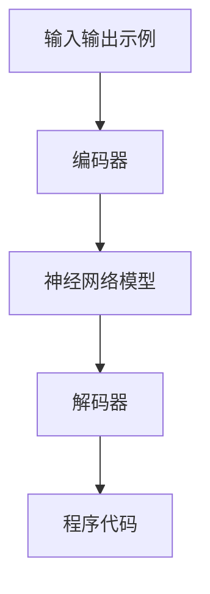

# 自动算法改进系统中神经程序归纳的新方法

> 关键词：自动算法改进系统、神经程序归纳、新方法、深度学习、程序合成

> 摘要：本文聚焦于自动算法改进系统中神经程序归纳的新方法。首先介绍了相关背景，包括研究的目的范围、预期读者等内容。接着阐述了神经程序归纳的核心概念与联系，通过文本示意图和 Mermaid 流程图展示其原理和架构。详细讲解了核心算法原理，并用 Python 源代码进行说明，同时给出了相应的数学模型和公式。通过项目实战展示代码实际案例并进行详细解释。探讨了该方法的实际应用场景，推荐了相关的学习资源、开发工具框架以及论文著作。最后总结了未来发展趋势与挑战，解答了常见问题并提供扩展阅读和参考资料，旨在为相关领域的研究和实践提供全面而深入的参考。

## 1. 背景介绍 
### 1.1 目的和范围
在当今科技飞速发展的时代，自动算法改进系统对于提高软件开发效率、优化算法性能具有至关重要的意义。神经程序归纳作为其中的关键技术，旨在让计算机自动从给定的输入输出示例中推导出相应的程序。本研究的目的在于探索一种新的神经程序归纳方法，以提高程序归纳的准确性、效率和泛化能力，从而更好地服务于自动算法改进系统。

本研究的范围涵盖了神经程序归纳的基本原理、核心算法、数学模型，以及在实际项目中的应用。同时，还将探讨相关的学习资源、开发工具和研究成果，为该领域的研究和实践提供全面的参考。

### 1.2 预期读者
本文预期读者包括对自动算法改进系统、神经程序归纳、深度学习等领域感兴趣的研究人员、工程师和学生。对于希望深入了解程序合成技术、探索新的算法改进方法的专业人士，本文将提供有价值的技术信息和实践指导。

### 1.3 文档结构概述
本文将按照以下结构进行组织：首先介绍背景信息，包括研究目的、预期读者和文档结构概述等。接着阐述神经程序归纳的核心概念与联系，通过文本示意图和 Mermaid 流程图展示其原理和架构。详细讲解核心算法原理，并用 Python 源代码进行说明，同时给出相应的数学模型和公式。通过项目实战展示代码实际案例并进行详细解释。探讨该方法的实际应用场景，推荐相关的学习资源、开发工具框架以及论文著作。最后总结未来发展趋势与挑战，解答常见问题并提供扩展阅读和参考资料。

### 1.4 术语表
#### 1.4.1 核心术语定义
- **自动算法改进系统**：一种能够自动对现有算法进行优化和改进的系统，通过分析算法的性能指标，自动调整算法的参数或结构，以提高算法的效率和准确性。
- **神经程序归纳**：利用神经网络技术，从给定的输入输出示例中自动推导出相应程序的过程。
- **程序合成**：将高级的规范或示例转换为可执行程序的过程，神经程序归纳是程序合成的一种重要方法。

#### 1.4.2 相关概念解释
- **深度学习**：一种基于人工神经网络的机器学习方法，通过多层神经网络自动学习数据的特征和模式，在图像识别、自然语言处理等领域取得了显著的成果。
- **神经网络**：由大量的神经元组成的计算模型，通过神经元之间的连接和权重调整来实现信息的处理和学习。

#### 1.4.3 缩略词列表
- **AI**：Artificial Intelligence，人工智能
- **ML**：Machine Learning，机器学习
- **DL**：Deep Learning，深度学习

## 2. 核心概念与联系 
神经程序归纳的核心思想是利用神经网络的强大学习能力，从给定的输入输出示例中学习程序的结构和逻辑，从而自动生成满足要求的程序。其基本原理是将输入输出示例编码为神经网络能够处理的向量表示，然后通过神经网络的训练和推理过程，生成程序的表示，最后将程序表示解码为可执行的程序代码。

### 文本示意图
神经程序归纳的过程可以用以下文本示意图表示：

输入输出示例 -> 编码器 -> 神经网络模型 -> 解码器 -> 程序代码

### Mermaid 流程图


在这个流程图中，输入输出示例首先经过编码器进行编码，将其转换为适合神经网络处理的向量表示。然后，向量表示输入到神经网络模型中进行训练和推理，学习程序的结构和逻辑。最后，神经网络的输出经过解码器解码为可执行的程序代码。

## 3. 核心算法原理 & 具体操作步骤 
### 核心算法原理
本研究采用的神经程序归纳方法基于序列到序列（Seq2Seq）模型，该模型由编码器和解码器组成。编码器将输入输出示例编码为固定长度的向量表示，解码器根据这个向量表示生成程序代码。

#### Seq2Seq 模型
Seq2Seq 模型是一种基于循环神经网络（RNN）的模型，其基本结构如下：

```python
import torch
import torch.nn as nn

class Encoder(nn.Module):
    def __init__(self, input_size, hidden_size):
        super(Encoder, self).__init__()
        self.hidden_size = hidden_size
        self.embedding = nn.Embedding(input_size, hidden_size)
        self.gru = nn.GRU(hidden_size, hidden_size)

    def forward(self, input, hidden):
        embedded = self.embedding(input).view(1, 1, -1)
        output = embedded
        output, hidden = self.gru(output, hidden)
        return output, hidden

    def initHidden(self):
        return torch.zeros(1, 1, self.hidden_size)

class Decoder(nn.Module):
    def __init__(self, hidden_size, output_size):
        super(Decoder, self).__init__()
        self.hidden_size = hidden_size
        self.embedding = nn.Embedding(output_size, hidden_size)
        self.gru = nn.GRU(hidden_size, hidden_size)
        self.out = nn.Linear(hidden_size, output_size)
        self.softmax = nn.LogSoftmax(dim=1)

    def forward(self, input, hidden):
        output = self.embedding(input).view(1, 1, -1)
        output = nn.functional.relu(output)
        output, hidden = self.gru(output, hidden)
        output = self.softmax(self.out(output[0]))
        return output, hidden

    def initHidden(self):
        return torch.zeros(1, 1, self.hidden_size)
```

### 具体操作步骤
1. **数据预处理**：将输入输出示例进行编码，转换为适合神经网络处理的向量表示。
2. **模型训练**：使用编码后的输入输出示例对 Seq2Seq 模型进行训练，调整模型的参数，使其能够学习到程序的结构和逻辑。
3. **模型推理**：在训练好的模型上进行推理，输入新的输入输出示例，生成相应的程序代码。

```python
# 训练过程示例
encoder = Encoder(input_size, hidden_size)
decoder = Decoder(hidden_size, output_size)
criterion = nn.NLLLoss()
learning_rate = 0.01

encoder_optimizer = torch.optim.SGD(encoder.parameters(), lr=learning_rate)
decoder_optimizer = torch.optim.SGD(decoder.parameters(), lr=learning_rate)

for epoch in range(num_epochs):
    encoder_optimizer.zero_grad()
    decoder_optimizer.zero_grad()

    input_tensor = ...  # 输入张量
    target_tensor = ...  # 目标张量

    encoder_hidden = encoder.initHidden()
    encoder_outputs = torch.zeros(max_length, encoder.hidden_size)

    for ei in range(input_tensor.size(0)):
        encoder_output, encoder_hidden = encoder(input_tensor[ei], encoder_hidden)
        encoder_outputs[ei] = encoder_output[0, 0]

    decoder_input = torch.tensor([[SOS_token]])
    decoder_hidden = encoder_hidden
    loss = 0

    for di in range(target_tensor.size(0)):
        decoder_output, decoder_hidden = decoder(decoder_input, decoder_hidden)
        topv, topi = decoder_output.topk(1)
        decoder_input = topi.squeeze().detach()

        loss += criterion(decoder_output, target_tensor[di])
        if decoder_input.item() == EOS_token:
            break

    loss.backward()
    encoder_optimizer.step()
    decoder_optimizer.step()
```

## 4. 数学模型和公式 & 详细讲解 & 举例说明 
### 数学模型
Seq2Seq 模型的数学模型可以用以下公式表示：

#### 编码器
编码器的输入是输入序列 $x = (x_1, x_2, \cdots, x_T)$，其中 $T$ 是序列的长度。编码器的输出是隐藏状态序列 $h = (h_1, h_2, \cdots, h_T)$，其中 $h_t$ 是第 $t$ 时刻的隐藏状态。

编码器的计算公式如下：

$$
h_t = \text{GRU}(E(x_t), h_{t-1})
$$

其中 $E(x_t)$ 是输入 $x_t$ 的嵌入表示，$\text{GRU}$ 是门控循环单元（Gated Recurrent Unit）。

#### 解码器
解码器的输入是编码器的最后一个隐藏状态 $h_T$ 和之前生成的输出序列 $y = (y_1, y_2, \cdots, y_{t-1})$。解码器的输出是当前时刻的输出概率分布 $p(y_t|y_1, \cdots, y_{t-1}, h_T)$。

解码器的计算公式如下：

$$
s_t = \text{GRU}(E(y_{t-1}), s_{t-1})
$$

$$
p(y_t|y_1, \cdots, y_{t-1}, h_T) = \text{softmax}(W_s s_t + b_s)
$$

其中 $s_t$ 是解码器第 $t$ 时刻的隐藏状态，$W_s$ 和 $b_s$ 是线性变换的参数。

### 详细讲解
编码器的作用是将输入序列编码为固定长度的向量表示，捕捉输入序列的语义信息。解码器的作用是根据编码器的输出和之前生成的输出序列，生成当前时刻的输出。通过不断迭代，解码器可以生成整个输出序列。

### 举例说明
假设输入序列为 $x = (1, 2, 3)$，目标输出序列为 $y = (4, 5, 6)$。编码器将输入序列编码为隐藏状态序列 $h = (h_1, h_2, h_3)$，解码器根据 $h_3$ 和之前生成的输出序列，依次生成 $y_1 = 4$，$y_2 = 5$，$y_3 = 6$。

## 5. 项目实战：代码实际案例和详细解释说明 
### 5.1  开发环境搭建
本项目使用 Python 语言进行开发，需要安装以下库：
- PyTorch：用于构建和训练神经网络模型。
- NumPy：用于数值计算。
- Matplotlib：用于可视化结果。

可以使用以下命令安装这些库：

```bash
pip install torch numpy matplotlib
```

### 5.2  源代码详细实现和代码解读
以下是一个完整的神经程序归纳项目的源代码示例：

```python
import torch
import torch.nn as nn
import torch.optim as optim
import random

# 定义超参数
input_size = 10
hidden_size = 20
output_size = 10
num_epochs = 100
learning_rate = 0.01

# 定义编码器和解码器
class Encoder(nn.Module):
    def __init__(self, input_size, hidden_size):
        super(Encoder, self).__init__()
        self.hidden_size = hidden_size
        self.embedding = nn.Embedding(input_size, hidden_size)
        self.gru = nn.GRU(hidden_size, hidden_size)

    def forward(self, input, hidden):
        embedded = self.embedding(input).view(1, 1, -1)
        output = embedded
        output, hidden = self.gru(output, hidden)
        return output, hidden

    def initHidden(self):
        return torch.zeros(1, 1, self.hidden_size)

class Decoder(nn.Module):
    def __init__(self, hidden_size, output_size):
        super(Decoder, self).__init__()
        self.hidden_size = hidden_size
        self.embedding = nn.Embedding(output_size, hidden_size)
        self.gru = nn.GRU(hidden_size, hidden_size)
        self.out = nn.Linear(hidden_size, output_size)
        self.softmax = nn.LogSoftmax(dim=1)

    def forward(self, input, hidden):
        output = self.embedding(input).view(1, 1, -1)
        output = nn.functional.relu(output)
        output, hidden = self.gru(output, hidden)
        output = self.softmax(self.out(output[0]))
        return output, hidden

    def initHidden(self):
        return torch.zeros(1, 1, self.hidden_size)

# 生成训练数据
def generate_data():
    input_tensor = torch.tensor([random.randint(0, input_size - 1) for _ in range(3)])
    target_tensor = torch.tensor([random.randint(0, output_size - 1) for _ in range(3)])
    return input_tensor, target_tensor

# 训练模型
encoder = Encoder(input_size, hidden_size)
decoder = Decoder(hidden_size, output_size)
criterion = nn.NLLLoss()
encoder_optimizer = optim.SGD(encoder.parameters(), lr=learning_rate)
decoder_optimizer = optim.SGD(decoder.parameters(), lr=learning_rate)

for epoch in range(num_epochs):
    encoder_optimizer.zero_grad()
    decoder_optimizer.zero_grad()

    input_tensor, target_tensor = generate_data()

    encoder_hidden = encoder.initHidden()
    encoder_outputs = torch.zeros(3, encoder.hidden_size)

    for ei in range(input_tensor.size(0)):
        encoder_output, encoder_hidden = encoder(input_tensor[ei], encoder_hidden)
        encoder_outputs[ei] = encoder_output[0, 0]

    decoder_input = torch.tensor([[0]])
    decoder_hidden = encoder_hidden
    loss = 0

    for di in range(target_tensor.size(0)):
        decoder_output, decoder_hidden = decoder(decoder_input, decoder_hidden)
        topv, topi = decoder_output.topk(1)
        decoder_input = topi.squeeze().detach()

        loss += criterion(decoder_output, target_tensor[di])
        if decoder_input.item() == 1:
            break

    loss.backward()
    encoder_optimizer.step()
    decoder_optimizer.step()

    if epoch % 10 == 0:
        print(f'Epoch {epoch}, Loss: {loss.item()}')

# 测试模型
input_tensor, target_tensor = generate_data()
encoder_hidden = encoder.initHidden()
encoder_outputs = torch.zeros(3, encoder.hidden_size)

for ei in range(input_tensor.size(0)):
    encoder_output, encoder_hidden = encoder(input_tensor[ei], encoder_hidden)
    encoder_outputs[ei] = encoder_output[0, 0]

decoder_input = torch.tensor([[0]])
decoder_hidden = encoder_hidden
output_sequence = []

for di in range(3):
    decoder_output, decoder_hidden = decoder(decoder_input, decoder_hidden)
    topv, topi = decoder_output.topk(1)
    decoder_input = topi.squeeze().detach()
    output_sequence.append(decoder_input.item())

print(f'Input: {input_tensor}')
print(f'Target: {target_tensor}')
print(f'Output: {output_sequence}')
```

### 5.3  代码解读与分析
- **编码器和解码器的定义**：使用 PyTorch 定义了编码器和解码器，编码器使用 GRU 对输入序列进行编码，解码器使用 GRU 生成输出序列。
- **数据生成**：使用 `generate_data` 函数生成随机的输入输出示例。
- **训练过程**：在每个 epoch 中，对编码器和解码器的参数进行更新，通过反向传播计算梯度并更新参数。
- **测试过程**：在训练完成后，使用新的输入输出示例进行测试，输出模型生成的序列。

## 6. 实际应用场景 
神经程序归纳在自动算法改进系统中有广泛的应用场景，以下是一些具体的例子：

### 自动代码生成
在软件开发中，神经程序归纳可以根据用户提供的功能描述或输入输出示例，自动生成相应的代码。例如，在编写数据处理程序时，用户可以提供输入数据和期望的输出结果，神经程序归纳系统可以自动生成实现该功能的代码，提高开发效率。

### 算法优化
对于已有的算法，神经程序归纳可以通过分析算法的输入输出示例，自动发现算法的潜在问题，并生成改进后的算法。例如，在机器学习算法中，神经程序归纳可以根据训练数据和模型的输出结果，自动调整算法的参数或结构，提高算法的性能。

### 智能编程助手
神经程序归纳可以作为智能编程助手，为程序员提供实时的代码建议和帮助。当程序员在编写代码时遇到问题，智能编程助手可以根据问题的描述和上下文信息，自动生成相关的代码片段，帮助程序员快速解决问题。

## 7. 工具和资源推荐
### 7.1 学习资源推荐
#### 7.1.1 书籍推荐
- 《深度学习》（Deep Learning）：由 Ian Goodfellow、Yoshua Bengio 和 Aaron Courville 编写，是深度学习领域的经典教材，详细介绍了深度学习的基本原理和算法。
- 《Python 深度学习》（Deep Learning with Python）：由 Francois Chollet 编写，结合 Keras 框架介绍了深度学习的实践应用，适合初学者入门。

#### 7.1.2 在线课程
- Coursera 上的《深度学习专项课程》（Deep Learning Specialization）：由 Andrew Ng 教授授课，系统地介绍了深度学习的各个方面，包括神经网络、卷积神经网络、循环神经网络等。
- edX 上的《人工智能基础》（Fundamentals of Artificial Intelligence）：介绍了人工智能的基本概念和方法，包括机器学习、深度学习等。

#### 7.1.3 技术博客和网站
- Medium 上的 Towards Data Science：有许多关于深度学习、机器学习的技术文章和实践经验分享。
- arXiv：是一个开放的学术预印本平台，包含了大量的最新研究成果，特别是在人工智能、深度学习等领域。

### 7.2 开发工具框架推荐
#### 7.2.1 IDE和编辑器
- PyCharm：是一款专门为 Python 开发设计的集成开发环境，提供了丰富的代码编辑、调试、测试等功能。
- Visual Studio Code：是一款轻量级的代码编辑器，支持多种编程语言，有丰富的插件可以扩展功能。

#### 7.2.2 调试和性能分析工具
- PyTorch Profiler：是 PyTorch 提供的性能分析工具，可以帮助开发者分析模型的性能瓶颈，优化代码。
- TensorBoard：是 TensorFlow 提供的可视化工具，也可以用于 PyTorch 模型的可视化和调试。

#### 7.2.3 相关框架和库
- PyTorch：是一个开源的深度学习框架，提供了丰富的神经网络模块和优化算法，方便开发者构建和训练深度学习模型。
- NumPy：是 Python 中用于数值计算的基础库，提供了高效的数组操作和数学函数。

### 7.3 相关论文著作推荐
#### 7.3.1 经典论文
- "Sequence to Sequence Learning with Neural Networks"：介绍了 Seq2Seq 模型的基本原理和应用，是神经程序归纳领域的经典论文。
- "Neural Program Induction by RNN Encoding of Subprograms"：提出了一种基于 RNN 编码子程序的神经程序归纳方法。

#### 7.3.2 最新研究成果
- 在 arXiv 上搜索“Neural Program Induction”可以找到最新的研究成果和进展。

#### 7.3.3 应用案例分析
- 一些开源项目和学术论文中会有神经程序归纳在实际应用中的案例分析，可以参考学习。

## 8. 总结：未来发展趋势与挑战
### 未来发展趋势
- **更强的泛化能力**：未来的神经程序归纳方法将更加注重提高模型的泛化能力，能够处理更复杂、更多样化的输入输出示例，生成更具通用性的程序。
- **与其他技术的融合**：神经程序归纳将与其他技术，如强化学习、元学习等融合，进一步提高程序归纳的效率和准确性。
- **应用领域的拓展**：神经程序归纳将在更多领域得到应用，如自动化测试、智能硬件编程等，为这些领域带来新的发展机遇。

### 挑战
- **数据获取和标注**：神经程序归纳需要大量的输入输出示例作为训练数据，数据的获取和标注是一个挑战。
- **模型复杂度和计算资源**：随着模型复杂度的增加，训练和推理所需的计算资源也会增加，如何在有限的计算资源下提高模型的性能是一个挑战。
- **程序的可解释性**：神经程序归纳生成的程序往往缺乏可解释性，如何提高程序的可解释性，让用户更好地理解和信任生成的程序是一个重要的挑战。

## 9. 附录：常见问题与解答
### 问题 1：神经程序归纳和传统的程序合成方法有什么区别？
神经程序归纳利用神经网络的学习能力，从输入输出示例中自动学习程序的结构和逻辑，而传统的程序合成方法通常基于规则和约束，需要人工编写复杂的规则和算法。神经程序归纳具有更强的灵活性和适应性，但也存在可解释性差的问题。

### 问题 2：如何提高神经程序归纳的准确性？
可以通过增加训练数据的数量和质量、调整模型的超参数、使用更复杂的模型结构等方法来提高神经程序归纳的准确性。此外，还可以采用集成学习等方法，结合多个模型的预测结果，提高最终的准确性。

### 问题 3：神经程序归纳在实际应用中存在哪些局限性？
神经程序归纳在实际应用中存在一些局限性，如数据获取和标注困难、模型复杂度高、程序可解释性差等。此外，神经程序归纳生成的程序可能存在性能问题，需要进一步优化。

## 10. 扩展阅读 & 参考资料
- Goodfellow, I., Bengio, Y., & Courville, A. (2016). Deep Learning. MIT Press.
- Chollet, F. (2017). Deep Learning with Python. Manning Publications.
- Sutskever, I., Vinyals, O., & Le, Q. V. (2014). Sequence to Sequence Learning with Neural Networks. In Advances in Neural Information Processing Systems.
- Devlin, J., Chang, M. W., Lee, K., & Toutanova, K. (2018). BERT: Pre-training of Deep Bidirectional Transformers for Language Understanding. arXiv preprint arXiv:1810.04805.
- PyTorch 官方文档：https://pytorch.org/docs/stable/index.html
- arXiv 官网：https://arxiv.org/