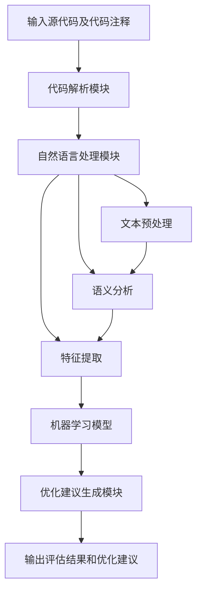

# 自然语言处理在代码注释质量评估与优化中的应用

> 关键词：自然语言处理、代码注释质量评估、代码注释优化、机器学习、文本分析

> 摘要：本文深入探讨了自然语言处理（NLP）在代码注释质量评估与优化中的应用。首先介绍了相关背景知识，包括研究目的、预期读者和文档结构等。接着阐述了核心概念，如代码注释和自然语言处理的原理及联系，并给出了相应的示意图和流程图。详细讲解了核心算法原理，通过Python代码进行说明，还介绍了相关数学模型和公式。通过项目实战展示了如何利用NLP进行代码注释质量评估与优化的具体实现过程。分析了实际应用场景，推荐了学习、开发相关的工具和资源，最后总结了未来发展趋势与挑战，解答了常见问题并提供了扩展阅读和参考资料，旨在为开发者和研究人员提供全面的技术指导和深入的思考。

## 1. 背景介绍 
### 1.1 目的和范围
代码注释是软件开发过程中的重要组成部分，它能够帮助开发者理解代码的功能、逻辑和设计意图，提高代码的可维护性和可读性。然而，目前代码注释的质量参差不齐，存在注释缺失、注释不准确、注释与代码不一致等问题。本研究的目的是利用自然语言处理技术对代码注释的质量进行评估，并提供优化建议，以提高代码注释的整体质量。

本研究的范围涵盖了常见的编程语言，如Python、Java、C++等，主要关注代码注释的语义准确性、完整性和一致性等方面的评估与优化。

### 1.2 预期读者
本文的预期读者包括软件开发人员、软件测试人员、软件架构师、自然语言处理研究人员以及对代码质量和注释优化感兴趣的技术爱好者。软件开发人员可以通过本文了解如何利用NLP技术提高自己代码注释的质量；软件测试人员可以借助相关技术更准确地评估代码注释的质量；软件架构师可以从宏观层面考虑如何在项目中应用这些技术来提升整体代码质量；自然语言处理研究人员可以从中获得在代码领域应用NLP技术的灵感；技术爱好者可以通过本文了解相关领域的前沿技术和发展趋势。

### 1.3 文档结构概述
本文将按照以下结构进行组织：
- 核心概念与联系：介绍代码注释和自然语言处理的核心概念，以及它们之间的联系，并给出相应的示意图和流程图。
- 核心算法原理 & 具体操作步骤：详细讲解用于代码注释质量评估与优化的核心算法原理，并通过Python代码进行具体说明。
- 数学模型和公式 & 详细讲解 & 举例说明：介绍相关的数学模型和公式，并结合具体例子进行详细讲解。
- 项目实战：代码实际案例和详细解释说明：通过一个实际的项目案例，展示如何利用NLP技术进行代码注释质量评估与优化的具体实现过程。
- 实际应用场景：分析自然语言处理在代码注释质量评估与优化中的实际应用场景。
- 工具和资源推荐：推荐学习、开发相关的工具和资源，包括书籍、在线课程、技术博客、IDE和编辑器、调试和性能分析工具、相关框架和库以及相关论文著作等。
- 总结：未来发展趋势与挑战：总结自然语言处理在代码注释质量评估与优化中的未来发展趋势和面临的挑战。
- 附录：常见问题与解答：解答读者在阅读本文过程中可能遇到的常见问题。
- 扩展阅读 & 参考资料：提供相关的扩展阅读材料和参考资料。

### 1.4 术语表
#### 1.4.1 核心术语定义
- **代码注释**：是程序员在代码中添加的自然语言文本，用于解释代码的功能、逻辑、设计意图等，以帮助其他开发者理解代码。
- **自然语言处理（NLP）**：是计算机科学与人工智能领域中的一个重要方向，它研究如何让计算机理解、处理和生成人类语言，包括文本分类、情感分析、命名实体识别等任务。
- **代码注释质量评估**：是指对代码注释的语义准确性、完整性、一致性等方面进行评价的过程。
- **代码注释优化**：是指根据代码注释质量评估的结果，对代码注释进行修改和完善，以提高注释质量的过程。

#### 1.4.2 相关概念解释
- **语义准确性**：指代码注释所表达的语义与代码实际实现的功能是否一致。
- **完整性**：指代码注释是否涵盖了代码的关键信息，如输入输出、功能描述、异常处理等。
- **一致性**：指代码注释与代码本身在语法、逻辑等方面是否保持一致。

#### 1.4.3 缩略词列表
- **NLP**：自然语言处理（Natural Language Processing）
- **ML**：机器学习（Machine Learning）
- **DL**：深度学习（Deep Learning）

## 2. 核心概念与联系 
### 核心概念原理
#### 代码注释
代码注释是程序员为了提高代码的可读性和可维护性而添加的自然语言文本。在不同的编程语言中，代码注释的语法有所不同。例如，在Python中，使用 `#` 符号来表示单行注释，使用 `'''` 或 `"""` 来表示多行注释；在Java和C++中，使用 `//` 表示单行注释，使用 `/* */` 表示多行注释。

代码注释的主要作用包括：
- 解释代码的功能：帮助其他开发者快速理解代码的用途。
- 说明代码的实现逻辑：解释代码是如何实现特定功能的。
- 记录代码的设计意图：传达代码的设计思路和背景信息。

#### 自然语言处理
自然语言处理是一门研究如何让计算机理解、处理和生成人类语言的学科。它涉及到多个领域的知识，包括语言学、计算机科学、数学等。自然语言处理的主要任务包括：
- 文本分类：将文本划分到不同的类别中。
- 情感分析：判断文本所表达的情感倾向，如积极、消极或中性。
- 命名实体识别：识别文本中的人名、地名、组织机构名等实体。
- 机器翻译：将一种语言的文本翻译成另一种语言。

在代码注释质量评估与优化中，自然语言处理主要用于分析代码注释的语义，判断其准确性、完整性和一致性等。

### 架构的文本示意图
```plaintext
代码注释质量评估与优化系统架构

输入：源代码及代码注释
|
|-- 代码解析模块：解析源代码，提取代码注释和代码片段
|
|-- 自然语言处理模块：
|   |-- 文本预处理：去除停用词、词干提取等
|   |-- 语义分析：分析注释的语义，判断准确性、完整性和一致性
|   |-- 特征提取：提取注释的特征，如关键词、句子长度等
|
|-- 机器学习模型：根据提取的特征进行训练，评估注释质量
|
|-- 优化建议生成模块：根据评估结果生成优化建议
|
输出：代码注释质量评估结果和优化建议
```

### Mermaid 流程图


## 3. 核心算法原理 & 具体操作步骤 
### 核心算法原理
在代码注释质量评估与优化中，主要使用的算法包括文本预处理算法、语义分析算法和机器学习算法。

#### 文本预处理算法
文本预处理是自然语言处理的基础步骤，主要包括以下操作：
- **去除停用词**：停用词是指在文本中频繁出现但对文本语义影响较小的词语，如“的”、“是”、“在”等。去除停用词可以减少文本的噪声，提高后续分析的效率。
- **词干提取**：词干提取是指将词语还原为其词干形式，如将“running”还原为“run”。词干提取可以减少词语的变体，提高文本的表示效率。

以下是一个使用Python的 `nltk` 库进行文本预处理的示例代码：
```python
import nltk
from nltk.corpus import stopwords
from nltk.stem import PorterStemmer
from nltk.tokenize import word_tokenize

nltk.download('stopwords')
nltk.download('punkt')

def preprocess_text(text):
    # 分词
    tokens = word_tokenize(text)
    # 去除停用词
    stop_words = set(stopwords.words('english'))
    filtered_tokens = [token for token in tokens if token.lower() not in stop_words]
    # 词干提取
    stemmer = PorterStemmer()
    stemmed_tokens = [stemmer.stem(token) for token in filtered_tokens]
    return stemmed_tokens

# 示例注释文本
comment = "This is a sample comment for testing the preprocessing algorithm."
preprocessed_comment = preprocess_text(comment)
print(preprocessed_comment)
```

#### 语义分析算法
语义分析是判断代码注释语义准确性、完整性和一致性的关键步骤。常用的语义分析方法包括基于规则的方法和基于机器学习的方法。

基于规则的方法是通过定义一系列的规则来判断注释的语义是否正确。例如，判断注释中是否包含关键的输入输出信息、是否与代码的功能描述一致等。

基于机器学习的方法是通过训练一个机器学习模型来判断注释的语义。例如，使用朴素贝叶斯分类器、支持向量机等模型对注释进行分类，判断其是否准确、完整和一致。

以下是一个使用朴素贝叶斯分类器进行注释语义分类的示例代码：
```python
from sklearn.feature_extraction.text import CountVectorizer
from sklearn.naive_bayes import MultinomialNB
from sklearn.model_selection import train_test_split

# 示例注释数据和标签
comments = ["This function adds two numbers.", "This is a wrong comment.", "This function calculates the average."]
labels = [1, 0, 1]  # 1表示准确，0表示不准确

# 文本向量化
vectorizer = CountVectorizer()
X = vectorizer.fit_transform(comments)

# 划分训练集和测试集
X_train, X_test, y_train, y_test = train_test_split(X, labels, test_size=0.2, random_state=42)

# 训练朴素贝叶斯分类器
clf = MultinomialNB()
clf.fit(X_train, y_train)

# 预测
test_comment = ["This function subtracts two numbers."]
test_X = vectorizer.transform(test_comment)
prediction = clf.predict(test_X)
print("Prediction:", prediction)
```

#### 机器学习算法
机器学习算法用于根据提取的特征对代码注释的质量进行评估。常用的机器学习算法包括决策树、随机森林、支持向量机等。

以下是一个使用随机森林分类器进行代码注释质量评估的示例代码：
```python
from sklearn.ensemble import RandomForestClassifier
from sklearn.metrics import accuracy_score

# 示例特征数据和标签
features = [[1, 2, 3], [4, 5, 6], [7, 8, 9]]
labels = [1, 0, 1]

# 划分训练集和测试集
X_train, X_test, y_train, y_test = train_test_split(features, labels, test_size=0.2, random_state=42)

# 训练随机森林分类器
rf = RandomForestClassifier()
rf.fit(X_train, y_train)

# 预测
y_pred = rf.predict(X_test)

# 计算准确率
accuracy = accuracy_score(y_test, y_pred)
print("Accuracy:", accuracy)
```

### 具体操作步骤
1. **数据收集**：收集包含代码注释的源代码数据，并对其进行标注，标注信息包括注释的质量等级（如准确、不准确、不完整等）。
2. **代码解析**：使用代码解析工具（如 `ast` 模块）解析源代码，提取代码注释和代码片段。
3. **文本预处理**：对提取的代码注释进行文本预处理，包括去除停用词、词干提取等。
4. **特征提取**：从预处理后的注释中提取特征，如关键词、句子长度、词频等。
5. **模型训练**：使用提取的特征和标注信息训练机器学习模型，如朴素贝叶斯分类器、随机森林分类器等。
6. **质量评估**：使用训练好的模型对新的代码注释进行质量评估，判断其准确性、完整性和一致性。
7. **优化建议生成**：根据评估结果生成优化建议，如补充缺失的信息、修改不准确的描述等。

## 4. 数学模型和公式 & 详细讲解 & 举例说明 
### 文本向量化模型
在自然语言处理中，文本向量化是将文本转换为数值向量的过程，以便机器学习模型能够处理。常用的文本向量化方法包括词袋模型（Bag of Words）和词嵌入模型（Word Embedding）。

#### 词袋模型
词袋模型是一种简单的文本向量化方法，它将文本看作是一个词的集合，不考虑词的顺序。具体步骤如下：
1. **构建词汇表**：将所有文本中的词提取出来，去重后形成一个词汇表。
2. **文本表示**：对于每个文本，统计词汇表中每个词在该文本中出现的次数，形成一个向量。

例如，假设有以下两个文本：
- 文本1：“This is a sample comment.”
- 文本2：“This is another sample comment.”

构建的词汇表为：["This", "is", "a", "sample", "comment", "another"]

文本1的向量表示为：[1, 1, 1, 1, 1, 0]
文本2的向量表示为：[1, 1, 0, 1, 1, 1]

词袋模型的数学公式可以表示为：
$$
\mathbf{x} = [x_1, x_2, \cdots, x_n]
$$
其中，$\mathbf{x}$ 是文本的向量表示，$x_i$ 是词汇表中第 $i$ 个词在文本中出现的次数，$n$ 是词汇表的大小。

#### 词嵌入模型
词嵌入模型是一种更高级的文本向量化方法，它将词映射到一个低维的向量空间中，使得语义相似的词在向量空间中距离较近。常用的词嵌入模型包括Word2Vec、GloVe等。

以Word2Vec为例，它通过训练一个神经网络来学习词的向量表示。具体来说，Word2Vec有两种训练模式：连续词袋模型（Continuous Bag of Words, CBOW）和跳过-gram模型（Skip-gram）。

- **连续词袋模型（CBOW）**：根据上下文词预测中心词。
- **跳过-gram模型（Skip-gram）**：根据中心词预测上下文词。

Word2Vec的数学公式可以表示为：
$$
\mathbf{v}_w = f(w)
$$
其中，$\mathbf{v}_w$ 是词 $w$ 的向量表示，$f$ 是Word2Vec模型学习到的映射函数。

### 机器学习模型评估指标
在使用机器学习模型进行代码注释质量评估时，需要使用一些评估指标来衡量模型的性能。常用的评估指标包括准确率（Accuracy）、精确率（Precision）、召回率（Recall）和F1值（F1-score）。

#### 准确率
准确率是指模型预测正确的样本数占总样本数的比例。其数学公式为：
$$
\text{Accuracy} = \frac{\text{TP} + \text{TN}}{\text{TP} + \text{TN} + \text{FP} + \text{FN}}
$$
其中，$\text{TP}$ 表示真正例（预测为正例且实际为正例），$\text{TN}$ 表示真反例（预测为反例且实际为反例），$\text{FP}$ 表示假正例（预测为正例但实际为反例），$\text{FN}$ 表示假反例（预测为反例但实际为正例）。

#### 精确率
精确率是指模型预测为正例的样本中，实际为正例的比例。其数学公式为：
$$
\text{Precision} = \frac{\text{TP}}{\text{TP} + \text{FP}}
$$

#### 召回率
召回率是指实际为正例的样本中，被模型预测为正例的比例。其数学公式为：
$$
\text{Recall} = \frac{\text{TP}}{\text{TP} + \text{FN}}
$$

#### F1值
F1值是精确率和召回率的调和平均数，用于综合衡量模型的性能。其数学公式为：
$$
\text{F1} = \frac{2 \times \text{Precision} \times \text{Recall}}{\text{Precision} + \text{Recall}}
$$

例如，假设有一个二分类问题，模型的预测结果如下：
| 实际类别 | 预测类别 |
| ---- | ---- |
| 正例 | 正例 |
| 正例 | 反例 |
| 反例 | 正例 |
| 反例 | 反例 |

则 $\text{TP} = 1$，$\text{TN} = 1$，$\text{FP} = 1$，$\text{FN} = 1$。

准确率为：$\text{Accuracy} = \frac{1 + 1}{1 + 1 + 1 + 1} = 0.5$
精确率为：$\text{Precision} = \frac{1}{1 + 1} = 0.5$
召回率为：$\text{Recall} = \frac{1}{1 + 1} = 0.5$
F1值为：$\text{F1} = \frac{2 \times 0.5 \times 0.5}{0.5 + 0.5} = 0.5$

## 5. 项目实战：代码实际案例和详细解释说明 
### 5.1  开发环境搭建
#### 安装Python
首先，确保你已经安装了Python。可以从Python官方网站（https://www.python.org/downloads/）下载并安装适合你操作系统的Python版本。建议使用Python 3.6及以上版本。

#### 安装必要的库
使用以下命令安装项目所需的库：
```sh
pip install nltk scikit-learn pandas
```
- `nltk`：用于自然语言处理任务，如文本预处理、分词等。
- `scikit-learn`：用于机器学习任务，如模型训练、评估等。
- `pandas`：用于数据处理和分析。

### 5.2  源代码详细实现和代码解读
以下是一个完整的项目代码示例，用于对Python代码注释的质量进行评估和优化：
```python
import nltk
from nltk.corpus import stopwords
from nltk.stem import PorterStemmer
from nltk.tokenize import word_tokenize
from sklearn.feature_extraction.text import CountVectorizer
from sklearn.naive_bayes import MultinomialNB
from sklearn.model_selection import train_test_split
from sklearn.metrics import accuracy_score
import pandas as pd

# 下载必要的nltk数据
nltk.download('stopwords')
nltk.download('punkt')

# 文本预处理函数
def preprocess_text(text):
    # 分词
    tokens = word_tokenize(text)
    # 去除停用词
    stop_words = set(stopwords.words('english'))
    filtered_tokens = [token for token in tokens if token.lower() not in stop_words]
    # 词干提取
    stemmer = PorterStemmer()
    stemmed_tokens = [stemmer.stem(token) for token in filtered_tokens]
    return " ".join(stemmed_tokens)

# 读取数据集
data = pd.read_csv('comments.csv')
comments = data['comment'].tolist()
labels = data['label'].tolist()

# 文本预处理
preprocessed_comments = [preprocess_text(comment) for comment in comments]

# 文本向量化
vectorizer = CountVectorizer()
X = vectorizer.fit_transform(preprocessed_comments)

# 划分训练集和测试集
X_train, X_test, y_train, y_test = train_test_split(X, labels, test_size=0.2, random_state=42)

# 训练朴素贝叶斯分类器
clf = MultinomialNB()
clf.fit(X_train, y_train)

# 预测
y_pred = clf.predict(X_test)

# 计算准确率
accuracy = accuracy_score(y_test, y_pred)
print("Accuracy:", accuracy)

# 优化建议生成函数
def generate_optimization_suggestion(comment):
    preprocessed_comment = preprocess_text(comment)
    comment_vector = vectorizer.transform([preprocessed_comment])
    prediction = clf.predict(comment_vector)
    if prediction[0] == 0:
        return "The comment may be inaccurate. Please check and update it."
    else:
        return "The comment is accurate."

# 示例注释
test_comment = "This function adds two numbers."
suggestion = generate_optimization_suggestion(test_comment)
print("Suggestion:", suggestion)
```

### 5.3  代码解读与分析
1. **数据读取**：使用 `pandas` 库读取包含代码注释和标签的数据集。
2. **文本预处理**：定义 `preprocess_text` 函数，对代码注释进行分词、去除停用词和词干提取等操作。
3. **文本向量化**：使用 `CountVectorizer` 将预处理后的注释转换为数值向量。
4. **模型训练**：使用 `MultinomialNB` 训练朴素贝叶斯分类器。
5. **模型评估**：使用 `accuracy_score` 计算模型的准确率。
6. **优化建议生成**：定义 `generate_optimization_suggestion` 函数，根据模型的预测结果生成优化建议。

通过以上步骤，我们可以对代码注释的质量进行评估，并根据评估结果生成优化建议。

## 6. 实际应用场景 
### 软件开发团队
在软件开发团队中，代码注释质量评估与优化可以帮助团队成员更好地理解代码，提高代码的可维护性和可读性。例如，新加入的开发者可以通过高质量的代码注释快速了解代码的功能和逻辑，减少学习成本。同时，团队成员在进行代码审查时，可以使用相关工具对代码注释的质量进行评估，及时发现和纠正注释中的问题。

### 开源项目
在开源项目中，代码注释的质量直接影响到项目的参与度和贡献度。高质量的代码注释可以吸引更多的开发者参与项目，提高项目的活跃度。通过自然语言处理技术对代码注释进行质量评估和优化，可以提升开源项目的整体质量和影响力。

### 代码托管平台
代码托管平台（如GitHub、GitLab等）可以集成代码注释质量评估与优化功能，为开发者提供代码注释质量分析报告和优化建议。这可以帮助开发者更好地管理自己的代码仓库，提高代码的质量和可维护性。

### 代码自动生成工具
代码自动生成工具可以结合自然语言处理技术，根据代码的功能自动生成高质量的代码注释。同时，在生成注释后，可以使用代码注释质量评估技术对生成的注释进行检查和优化，确保注释的准确性和完整性。

## 7. 工具和资源推荐
### 7.1 学习资源推荐
#### 7.1.1 书籍推荐
- 《自然语言处理入门》：这本书由何晗编写，是一本适合初学者的自然语言处理入门书籍。书中详细介绍了自然语言处理的基本概念、算法和应用，通过大量的示例代码帮助读者快速掌握相关知识。
- 《Python自然语言处理》：由Steven Bird、Ewan Klein和Edward Loper编写，本书以Python为工具，介绍了自然语言处理的各种技术和方法。书中包含了丰富的实例和代码，适合有一定Python基础的读者。
- 《统计自然语言处理基础》：作者是Christopher D. Manning和Hinrich Schütze，本书系统地介绍了统计自然语言处理的理论和方法，是自然语言处理领域的经典教材。

#### 7.1.2 在线课程
- Coursera上的“Natural Language Processing Specialization”：由DeepLearning.AI提供，该课程涵盖了自然语言处理的各个方面，包括文本分类、情感分析、机器翻译等。课程由知名教授授课，内容丰富，适合有一定机器学习基础的学习者。
- edX上的“Natural Language Processing with Python and NLTK”：该课程介绍了如何使用Python和NLTK库进行自然语言处理任务。课程内容包括文本预处理、词性标注、命名实体识别等，通过实际案例帮助学习者掌握相关技术。
- 哔哩哔哩上的“自然语言处理入门课程”：这是一系列免费的视频课程，由国内的自然语言处理专家讲解，内容通俗易懂，适合初学者入门。

#### 7.1.3 技术博客和网站
- 自然语言处理社区（https://www.nlpcommunity.cn/）：该网站是国内自然语言处理领域的专业社区，提供了丰富的技术文章、开源项目和学术资源。
- 博客园（https://www.cnblogs.com/）：博客园上有很多自然语言处理领域的博主，他们分享了自己的学习经验、研究成果和项目实践，对学习者有很大的帮助。
- Medium（https://medium.com/）：Medium上有很多关于自然语言处理的优质文章，涵盖了最新的研究成果、技术应用和实践经验。

### 7.2 开发工具框架推荐
#### 7.2.1 IDE和编辑器
- PyCharm：是一款专门为Python开发设计的集成开发环境（IDE），具有强大的代码编辑、调试和分析功能。PyCharm支持各种Python库和框架，适合开发自然语言处理项目。
- Visual Studio Code：是一款轻量级的代码编辑器，具有丰富的插件生态系统。通过安装相关插件，Visual Studio Code可以支持Python开发、自然语言处理任务等。
- Jupyter Notebook：是一个交互式的开发环境，适合进行数据分析和机器学习实验。Jupyter Notebook支持Python、R等多种编程语言，可以方便地展示代码和运行结果。

#### 7.2.2 调试和性能分析工具
- pdb：是Python自带的调试工具，可以帮助开发者定位代码中的问题。通过在代码中设置断点，开发者可以逐步执行代码，查看变量的值和程序的执行流程。
- cProfile：是Python的性能分析工具，可以分析代码的执行时间和函数调用情况。通过使用cProfile，开发者可以找出代码中的性能瓶颈，进行优化。
- TensorBoard：是TensorFlow的可视化工具，用于监控和分析深度学习模型的训练过程。TensorBoard可以展示模型的损失曲线、准确率曲线、参数分布等信息，帮助开发者更好地理解和优化模型。

#### 7.2.3 相关框架和库
- NLTK：是Python中最常用的自然语言处理库之一，提供了丰富的工具和数据集，用于文本预处理、词性标注、命名实体识别等任务。
- spaCy：是一个高效的自然语言处理库，具有快速的处理速度和良好的性能。spaCy支持多种语言，提供了预训练的模型和简单易用的API。
- scikit-learn：是Python中常用的机器学习库，提供了各种机器学习算法和工具，用于数据预处理、模型训练、模型评估等任务。
- TensorFlow和PyTorch：是深度学习领域的两大主流框架，用于构建和训练深度学习模型。在自然语言处理中，TensorFlow和PyTorch可以用于构建神经网络模型，如循环神经网络（RNN）、长短期记忆网络（LSTM）等。

### 7.3 相关论文著作推荐
#### 7.3.1 经典论文
- “Efficient Estimation of Word Representations in Vector Space”：这篇论文介绍了Word2Vec模型，是词嵌入领域的经典论文。论文提出了连续词袋模型（CBOW）和跳过-gram模型（Skip-gram），为词向量的学习提供了一种有效的方法。
- “Long Short-Term Memory”：这篇论文介绍了长短期记忆网络（LSTM），是循环神经网络领域的重要论文。LSTM通过引入门控机制，解决了传统循环神经网络中的梯度消失和梯度爆炸问题，在自然语言处理等领域取得了广泛的应用。
- “Attention Is All You Need”：这篇论文介绍了Transformer模型，是自然语言处理领域的里程碑式论文。Transformer模型通过引入注意力机制，实现了并行计算，提高了模型的训练效率和性能。

#### 7.3.2 最新研究成果
- 可以关注自然语言处理领域的顶级学术会议，如ACL（Annual Meeting of the Association for Computational Linguistics）、EMNLP（Conference on Empirical Methods in Natural Language Processing）等，这些会议上会发表很多最新的研究成果。
- 也可以关注相关的学术期刊，如Journal of Artificial Intelligence Research（JAIR）、Computational Linguistics等，这些期刊会发表高质量的自然语言处理研究论文。

#### 7.3.3 应用案例分析
- 可以参考一些开源项目的文档和代码，了解自然语言处理技术在实际项目中的应用。例如，GitHub上有很多使用自然语言处理技术进行代码注释分析的项目，可以从中学习到实际的应用案例和实现方法。
- 一些科技公司的技术博客也会分享自然语言处理技术在实际业务中的应用案例，如Google、Facebook、百度等公司的技术博客，可以从中了解到最新的应用趋势和实践经验。

## 8. 总结：未来发展趋势与挑战
### 未来发展趋势
#### 多模态融合
未来，自然语言处理在代码注释质量评估与优化中可能会与其他模态的信息进行融合，如代码的可视化信息、执行轨迹信息等。通过多模态融合，可以更全面地评估代码注释的质量，提供更准确的优化建议。

#### 深度学习模型的进一步应用
随着深度学习技术的不断发展，更强大的深度学习模型将被应用于代码注释质量评估与优化中。例如，使用预训练的语言模型（如BERT、GPT等）来提高注释语义分析的准确性和效率。

#### 自动化和智能化
未来的代码注释质量评估与优化工具将更加自动化和智能化。工具可以自动检测代码中的注释问题，并根据上下文信息自动生成优化建议，减少开发者的手动干预。

### 面临的挑战
#### 语义理解的准确性
虽然自然语言处理技术在语义理解方面取得了很大的进展，但在代码注释的语义理解中仍然存在挑战。代码注释通常包含专业的技术术语和特定的上下文信息，准确理解这些信息需要更深入的语义分析和知识推理。

#### 数据的稀缺性
高质量的代码注释数据集相对较少，这限制了机器学习模型的训练效果。收集和标注大规模的代码注释数据集是一个具有挑战性的任务，需要投入大量的人力和时间。

#### 跨语言和跨领域的适应性
不同的编程语言和领域具有不同的代码风格和注释习惯，如何开发具有跨语言和跨领域适应性的代码注释质量评估与优化工具是一个亟待解决的问题。

## 9. 附录：常见问题与解答
### 1. 自然语言处理技术在代码注释质量评估中的准确性如何保证？
自然语言处理技术在代码注释质量评估中的准确性可以通过以下方法来保证：
- 使用高质量的训练数据：收集和标注大规模的代码注释数据集，确保数据的准确性和多样性。
- 选择合适的算法和模型：根据具体的任务选择合适的自然语言处理算法和机器学习模型，如使用深度学习模型可以提高语义理解的准确性。
- 进行模型评估和调优：使用评估指标（如准确率、精确率、召回率等）对模型进行评估，并通过调优模型的参数来提高模型的性能。

### 2. 如何处理不同编程语言的代码注释？
处理不同编程语言的代码注释可以采用以下方法：
- 代码解析：使用不同编程语言的解析器（如Python的 `ast` 模块、Java的 `javaparser` 等）来解析代码，提取代码注释。
- 语言无关的特征提取：在特征提取阶段，尽量提取与语言无关的特征，如注释的长度、关键词的出现频率等。
- 多语言模型训练：使用多语言的代码注释数据集来训练模型，提高模型的跨语言适应性。

### 3. 代码注释质量评估与优化工具的性能如何提升？
提升代码注释质量评估与优化工具的性能可以从以下几个方面入手：
- 算法优化：选择高效的自然语言处理算法和机器学习算法，减少计算复杂度。
- 并行计算：使用并行计算技术（如GPU加速）来提高模型的训练和推理速度。
- 数据预处理优化：在数据预处理阶段，采用更高效的方法进行文本预处理，如使用并行处理技术来加快分词和词干提取的速度。

## 10. 扩展阅读 & 参考资料
### 扩展阅读
- 《人工智能：现代方法》：这本书系统地介绍了人工智能的各个领域，包括自然语言处理、机器学习、知识表示等，是人工智能领域的经典教材。
- 《深度学习》：由Ian Goodfellow、Yoshua Bengio和Aaron Courville编写，本书详细介绍了深度学习的理论和方法，包括神经网络、卷积神经网络、循环神经网络等。
- 《代码大全》：这本书是软件开发领域的经典著作，介绍了软件开发的最佳实践和方法，包括代码注释的编写原则和技巧。

### 参考资料
- NLTK官方文档：https://www.nltk.org/
- scikit-learn官方文档：https://scikit-learn.org/stable/
- TensorFlow官方文档：https://www.tensorflow.org/
- PyTorch官方文档：https://pytorch.org/
- ACL官方网站：https://www.aclweb.org/
- EMNLP官方网站：https://2020.emnlp.org/