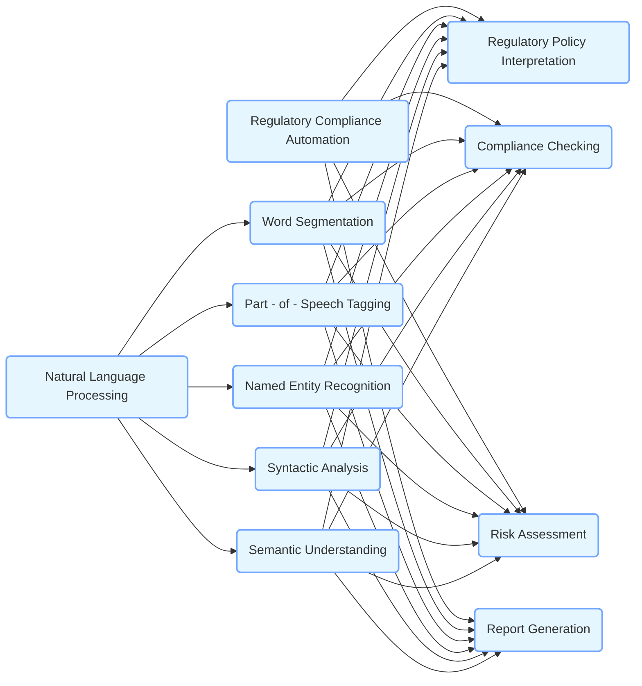

# 自然语言处理在监管合规自动化中的应用

> 关键词：自然语言处理、监管合规自动化、文本分析、机器学习、合规检查

> 摘要：本文深入探讨了自然语言处理（NLP）在监管合规自动化领域的应用。首先介绍了监管合规自动化的背景和目的，阐述了NLP相关核心概念及其联系。详细讲解了NLP核心算法原理，并给出Python代码示例。通过数学模型和公式进一步剖析其原理，同时结合实际案例说明。接着展示了NLP在监管合规自动化中的项目实战，包括开发环境搭建、源代码实现与解读。分析了NLP在该领域的实际应用场景，推荐了学习资源、开发工具框架以及相关论文著作。最后总结了NLP在监管合规自动化中的未来发展趋势与挑战，并提供常见问题解答和扩展阅读参考资料。

## 1. 背景介绍 
### 1.1 目的和范围
在当今复杂多变的商业环境中，企业面临着众多监管要求和合规标准。监管合规涉及到大量的法律法规、政策文件以及内部规章制度，这些文本信息不仅数量庞大，而且内容复杂。手动处理这些合规事务不仅效率低下，还容易出现错误和遗漏。自然语言处理技术的出现为监管合规自动化提供了有力的解决方案。

本文的目的在于全面介绍自然语言处理在监管合规自动化中的应用，涵盖从基本概念到实际应用的各个方面。具体范围包括NLP的核心算法、数学模型、项目实战以及在不同场景下的应用等内容。

### 1.2 预期读者
本文预期读者包括从事监管合规工作的专业人员，他们希望了解如何利用NLP技术提高合规工作的效率和准确性；软件开发人员，尤其是对自然语言处理和自动化系统开发感兴趣的人员；研究机构的学者，致力于探索NLP在不同领域的应用；以及对金融、医疗、法律等行业监管合规有兴趣的相关人士。

### 1.3 文档结构概述
本文按照以下结构进行组织：
- 核心概念与联系：介绍自然语言处理和监管合规自动化的核心概念，并阐述它们之间的联系。
- 核心算法原理 & 具体操作步骤：详细讲解NLP的核心算法，如分词、词性标注、命名实体识别等，并给出Python代码实现。
- 数学模型和公式 & 详细讲解 & 举例说明：通过数学模型和公式深入剖析NLP算法的原理，并结合实际例子进行说明。
- 项目实战：代码实际案例和详细解释说明：展示一个完整的监管合规自动化项目，包括开发环境搭建、源代码实现和代码解读。
- 实际应用场景：分析NLP在监管合规自动化中的具体应用场景。
- 工具和资源推荐：推荐学习资源、开发工具框架和相关论文著作。
- 总结：未来发展趋势与挑战：总结NLP在监管合规自动化中的发展趋势和面临的挑战。
- 附录：常见问题与解答：解答读者可能遇到的常见问题。
- 扩展阅读 & 参考资料：提供相关的扩展阅读材料和参考资料。

### 1.4 术语表
#### 1.4.1 核心术语定义
- **自然语言处理（Natural Language Processing, NLP）**：是计算机科学、人工智能和语言学的交叉领域，旨在让计算机能够理解、处理和生成人类语言。
- **监管合规自动化（Regulatory Compliance Automation）**：利用技术手段自动处理和执行监管合规任务，减少人工干预，提高合规工作的效率和准确性。
- **文本分析（Text Analysis）**：对文本数据进行处理、分析和挖掘，以提取有价值的信息。
- **机器学习（Machine Learning）**：是一门多领域交叉学科，涉及概率论、统计学、逼近论、凸分析、算法复杂度理论等多门学科。它专门研究计算机怎样模拟或实现人类的学习行为，以获取新的知识或技能，重新组织已有的知识结构使之不断改善自身的性能。
- **合规检查（Compliance Checking）**：检查企业的业务活动是否符合相关的法律法规、政策文件和内部规章制度。

#### 1.4.2 相关概念解释
- **词性标注（Part-of-Speech Tagging）**：为文本中的每个词语标注其词性，如名词、动词、形容词等。词性标注有助于理解文本的语法结构，为后续的语义分析提供基础。
- **命名实体识别（Named Entity Recognition, NER）**：识别文本中具有特定意义的实体，如人名、地名、组织机构名等。NER在信息提取和知识图谱构建中具有重要作用。
- **文本分类（Text Classification）**：将文本划分到不同的类别中，如新闻分类、垃圾邮件分类等。文本分类可以帮助企业快速筛选和处理大量的文本信息。

#### 1.4.3 缩略词列表
- **NLP**：Natural Language Processing（自然语言处理）
- **NER**：Named Entity Recognition（命名实体识别）
- **ML**：Machine Learning（机器学习）
- **RCA**：Regulatory Compliance Automation（监管合规自动化）

## 2. 核心概念与联系 

### 自然语言处理核心概念
自然语言处理是一门让计算机能够理解、处理和生成人类语言的技术。它主要包括以下几个核心任务：
- **分词（Word Segmentation）**：将连续的文本分割成单个的词语。例如，将“我爱自然语言处理”分割成“我”、“爱”、“自然语言处理”。
- **词性标注（Part-of-Speech Tagging）**：为每个词语标注其词性，如名词、动词、形容词等。例如，“我”是代词，“爱”是动词。
- **命名实体识别（Named Entity Recognition）**：识别文本中具有特定意义的实体，如人名、地名、组织机构名等。例如，“乔布斯”是人名，“苹果公司”是组织机构名。
- **句法分析（Syntactic Analysis）**：分析句子的语法结构，确定词语之间的关系。例如，“我喜欢苹果”中，“我”是主语，“喜欢”是谓语，“苹果”是宾语。
- **语义理解（Semantic Understanding）**：理解文本的语义信息，包括词语的含义、句子的意图等。例如，“我想要一杯咖啡”表达了一种需求。

### 监管合规自动化核心概念
监管合规自动化是指利用技术手段自动处理和执行监管合规任务。它的主要目标是提高合规工作的效率和准确性，减少人工干预。监管合规自动化通常包括以下几个方面：
- **法规政策解读**：对法律法规、政策文件进行自动解读，提取关键信息和合规要求。
- **合规检查**：检查企业的业务活动是否符合相关的法规政策和内部规章制度。
- **风险评估**：评估企业面临的合规风险，提前预警并采取相应的措施。
- **报告生成**：自动生成合规报告，记录企业的合规情况。

### 两者之间的联系
自然语言处理技术为监管合规自动化提供了强大的支持。通过NLP技术，可以对大量的法规政策文本和企业业务数据进行自动处理和分析，实现法规政策解读、合规检查、风险评估等功能。具体来说，NLP在监管合规自动化中的应用包括以下几个方面：
- **法规政策文本处理**：利用分词、词性标注、命名实体识别等技术对法规政策文本进行处理，提取关键信息和合规要求。
- **业务数据文本分析**：对企业的业务数据文本进行分析，如合同文本、报告文本等，检查是否符合法规政策要求。
- **风险预警**：通过语义理解和机器学习技术，对企业的业务活动进行实时监测，提前发现潜在的合规风险。
- **报告生成**：利用文本生成技术，自动生成合规报告，提高报告的准确性和效率。

### 文本示意图
```plaintext
自然语言处理
|-- 分词
|-- 词性标注
|-- 命名实体识别
|-- 句法分析
|-- 语义理解

监管合规自动化
|-- 法规政策解读
|-- 合规检查
|-- 风险评估
|-- 报告生成

联系：自然语言处理技术支持监管合规自动化的各个环节
```

### Mermaid流程图


## 3. 核心算法原理 & 具体操作步骤 

### 分词算法原理及Python实现
#### 算法原理
分词是自然语言处理的基础任务之一，其目的是将连续的文本分割成单个的词语。常见的分词算法有基于规则的分词算法和基于统计的分词算法。

基于规则的分词算法通过预先定义的规则来进行分词，例如正向最大匹配、逆向最大匹配等。正向最大匹配算法从文本的左侧开始，尽可能匹配最长的词语。

基于统计的分词算法则利用大量的文本数据进行训练，统计词语的出现频率和共现概率，从而确定最优的分词结果。常见的基于统计的分词算法有隐马尔可夫模型（HMM）和条件随机场（CRF）。

#### Python代码实现
以下是一个简单的正向最大匹配分词算法的Python实现：
```python
def forward_max_match(sentence, word_dict):
    max_len = max([len(word) for word in word_dict])
    result = []
    index = 0
    while index < len(sentence):
        for i in range(max_len, 0, -1):
            if index + i > len(sentence):
                continue
            word = sentence[index:index + i]
            if word in word_dict:
                result.append(word)
                index += i
                break
        else:
            result.append(sentence[index])
            index += 1
    return result

# 示例
word_dict = ["自然语言处理", "我爱", "编程"]
sentence = "我爱自然语言处理编程"
print(forward_max_match(sentence, word_dict))
```

### 词性标注算法原理及Python实现
#### 算法原理
词性标注是为文本中的每个词语标注其词性。常见的词性标注算法有基于规则的词性标注算法和基于统计的词性标注算法。

基于规则的词性标注算法通过预先定义的规则来进行词性标注，例如根据词语的后缀、前缀等特征来判断词性。

基于统计的词性标注算法则利用大量的标注数据进行训练，统计词语和词性之间的概率关系，从而确定最优的词性标注结果。常见的基于统计的词性标注算法有隐马尔可夫模型（HMM）和最大熵模型。

#### Python代码实现
以下是一个使用`nltk`库进行词性标注的Python示例：
```python
import nltk
nltk.download('punkt')
nltk.download('averaged_perceptron_tagger')

sentence = "I love natural language processing."
tokens = nltk.word_tokenize(sentence)
pos_tags = nltk.pos_tag(tokens)
print(pos_tags)
```

### 命名实体识别算法原理及Python实现
#### 算法原理
命名实体识别是识别文本中具有特定意义的实体，如人名、地名、组织机构名等。常见的命名实体识别算法有基于规则的命名实体识别算法和基于机器学习的命名实体识别算法。

基于规则的命名实体识别算法通过预先定义的规则来进行实体识别，例如根据词语的特征、上下文信息等。

基于机器学习的命名实体识别算法则利用大量的标注数据进行训练，学习实体的特征和模式，从而实现实体识别。常见的基于机器学习的命名实体识别算法有条件随机场（CRF）和深度学习模型，如循环神经网络（RNN）、长短期记忆网络（LSTM）等。

#### Python代码实现
以下是一个使用`jieba`和`sklearn_crfsuite`库进行中文命名实体识别的Python示例：
```python
import jieba
import jieba.posseg as pseg
from sklearn_crfsuite import CRF

# 定义特征提取函数
def word2features(sent, i):
    word = sent[i][0]
    postag = sent[i][1]
    features = {
        'bias': 1.0,
        'word.lower()': word.lower(),
        'word[-3:]': word[-3:],
        'word[-2:]': word[-2:],
        'word.isupper()': word.isupper(),
        'word.istitle()': word.istitle(),
        'word.isdigit()': word.isdigit(),
        'postag': postag,
        'postag[:2]': postag[:2],
    }
    if i > 0:
        word1 = sent[i - 1][0]
        postag1 = sent[i - 1][1]
        features.update({
            '-1:word.lower()': word1.lower(),
            '-1:word.istitle()': word1.istitle(),
            '-1:word.isupper()': word1.isupper(),
            '-1:postag': postag1,
            '-1:postag[:2]': postag1[:2],
        })
    else:
        features['BOS'] = True
    if i < len(sent) - 1:
        word1 = sent[i + 1][0]
        postag1 = sent[i + 1][1]
        features.update({
            '+1:word.lower()': word1.lower(),
            '+1:word.istitle()': word1.istitle(),
            '+1:word.isupper()': word1.isupper(),
            '+1:postag': postag1,
            '+1:postag[:2]': postag1[:2],
        })
    else:
        features['EOS'] = True
    return features

def sent2features(sent):
    return [word2features(sent, i) for i in range(len(sent))]

def sent2labels(sent):
    return [label for token, postag, label in sent]

# 示例数据
train_sents = [
    [('乔布斯', 'nr', 'PER'), ('是', 'v', 'O'), ('苹果公司', 'nt', 'ORG'), ('的', 'u', 'O'), ('创始人', 'n', 'O')]
]
X_train = [sent2features(s) for s in train_sents]
y_train = [sent2labels(s) for s in train_sents]

# 训练CRF模型
crf = CRF(
    algorithm='lbfgs',
    c1=0.1,
    c2=0.1,
    max_iterations=100,
    all_possible_transitions=True
)
crf.fit(X_train, y_train)

# 进行命名实体识别
test_sent = "乔布斯创办了苹果公司"
test_tokens = pseg.cut(test_sent)
test_sent = [(word, tag) for word, tag in test_tokens]
X_test = [sent2features(test_sent)]
y_pred = crf.predict(X_test)
print(y_pred)
```

## 4. 数学模型和公式 & 详细讲解 & 举例说明 

### 隐马尔可夫模型（HMM）
#### 数学模型
隐马尔可夫模型是一种统计模型，用于描述一个含有隐含未知参数的马尔可夫过程。它由三个部分组成：状态转移概率矩阵 $A$、观测概率矩阵 $B$ 和初始状态概率向量 $\pi$。

设 $Q = \{q_1, q_2, \cdots, q_N\}$ 是所有可能的状态集合，$V = \{v_1, v_2, \cdots, v_M\}$ 是所有可能的观测值集合。$A = [a_{ij}]_{N \times N}$ 是状态转移概率矩阵，其中 $a_{ij} = P(q_{t+1} = q_j | q_t = q_i)$ 表示在时刻 $t$ 处于状态 $q_i$ 的条件下，在时刻 $t+1$ 转移到状态 $q_j$ 的概率。$B = [b_j(k)]_{N \times M}$ 是观测概率矩阵，其中 $b_j(k) = P(o_t = v_k | q_t = q_j)$ 表示在时刻 $t$ 处于状态 $q_j$ 的条件下，观测到观测值 $v_k$ 的概率。$\pi = [\pi_i]_{N \times 1}$ 是初始状态概率向量，其中 $\pi_i = P(q_1 = q_i)$ 表示在时刻 $t = 1$ 处于状态 $q_i$ 的概率。

#### 公式讲解
隐马尔可夫模型有三个基本问题：
1. **评估问题**：给定模型 $\lambda = (A, B, \pi)$ 和观测序列 $O = (o_1, o_2, \cdots, o_T)$，计算 $P(O|\lambda)$。可以使用前向算法或后向算法来解决这个问题。
    - 前向算法：定义前向概率 $\alpha_t(i) = P(o_1, o_2, \cdots, o_t, q_t = q_i | \lambda)$，则有：
        - 初始化：$\alpha_1(i) = \pi_i b_i(o_1)$，$i = 1, 2, \cdots, N$
        - 递推：$\alpha_{t+1}(j) = \left[\sum_{i = 1}^{N} \alpha_t(i) a_{ij}\right] b_j(o_{t+1})$，$t = 1, 2, \cdots, T - 1$，$j = 1, 2, \cdots, N$
        - 终止：$P(O|\lambda) = \sum_{i = 1}^{N} \alpha_T(i)$
2. **学习问题**：给定观测序列 $O = (o_1, o_2, \cdots, o_T)$，估计模型 $\lambda = (A, B, \pi)$ 的参数，使得 $P(O|\lambda)$ 最大。可以使用 Baum - Welch 算法来解决这个问题。
3. **解码问题**：给定模型 $\lambda = (A, B, \pi)$ 和观测序列 $O = (o_1, o_2, \cdots, o_T)$，找出最可能的状态序列 $Q = (q_1, q_2, \cdots, q_T)$。可以使用维特比算法来解决这个问题。
    - 维特比算法：定义维特比变量 $\delta_t(i) = \max_{q_1, q_2, \cdots, q_{t-1}} P(q_1, q_2, \cdots, q_t = q_i, o_1, o_2, \cdots, o_t | \lambda)$，则有：
        - 初始化：$\delta_1(i) = \pi_i b_i(o_1)$，$i = 1, 2, \cdots, N$
        - 递推：$\delta_{t+1}(j) = \max_{i = 1}^{N} \left[\delta_t(i) a_{ij}\right] b_j(o_{t+1})$，$t = 1, 2, \cdots, T - 1$，$j = 1, 2, \cdots, N$
        - 终止：$\max_{i = 1}^{N} \delta_T(i)$
        - 回溯：找出最可能的状态序列

#### 举例说明
假设我们有一个简单的天气模型，状态集合 $Q = \{\text{晴天}, \text{阴天}, \text{雨天}\}$，观测值集合 $V = \{\text{散步}, \text{购物}, \text{打扫}\}$。状态转移概率矩阵 $A$、观测概率矩阵 $B$ 和初始状态概率向量 $\pi$ 如下：
$$
A = \begin{bmatrix}
0.7 & 0.2 & 0.1 \\
0.3 & 0.5 & 0.2 \\
0.2 & 0.3 & 0.5
\end{bmatrix}
$$
$$
B = \begin{bmatrix}
0.6 & 0.3 & 0.1 \\
0.4 & 0.4 & 0.2 \\
0.1 & 0.3 & 0.6
\end{bmatrix}
$$
$$
\pi = \begin{bmatrix}
0.6 \\
0.3 \\
0.1
\end{bmatrix}
$$
假设观测序列 $O = (\text{散步}, \text{购物}, \text{打扫})$，我们可以使用前向算法计算 $P(O|\lambda)$，使用维特比算法找出最可能的状态序列。

### 条件随机场（CRF）
#### 数学模型
条件随机场是一种判别式概率图模型，用于解决序列标注问题。给定一个输入序列 $X = (x_1, x_2, \cdots, x_n)$ 和一个输出序列 $Y = (y_1, y_2, \cdots, y_n)$，条件随机场定义了在给定输入序列 $X$ 的条件下，输出序列 $Y$ 的条件概率：
$$
P(Y|X) = \frac{1}{Z(X)} \exp\left(\sum_{i = 1}^{n} \sum_{k = 1}^{K} \lambda_k t_k(y_{i-1}, y_i, X, i) + \sum_{i = 1}^{n} \sum_{l = 1}^{L} \mu_l s_l(y_i, X, i)\right)
$$
其中，$Z(X)$ 是归一化因子，$t_k(y_{i-1}, y_i, X, i)$ 是转移特征函数，$s_l(y_i, X, i)$ 是状态特征函数，$\lambda_k$ 和 $\mu_l$ 是特征函数的权重。

#### 公式讲解
条件随机场的训练目标是最大化对数似然函数：
$$
L(\lambda, \mu) = \sum_{i = 1}^{m} \log P(Y^{(i)}|X^{(i)})
$$
其中，$(X^{(i)}, Y^{(i)})$ 是第 $i$ 个训练样本，$m$ 是训练样本的数量。可以使用梯度下降法、拟牛顿法等优化算法来求解特征函数的权重。

#### 举例说明
在命名实体识别任务中，输入序列 $X$ 是文本中的词语序列，输出序列 $Y$ 是每个词语对应的实体标签序列。转移特征函数可以考虑相邻标签之间的转移关系，状态特征函数可以考虑词语的特征，如词性、前缀、后缀等。通过训练条件随机场模型，可以学习到不同特征函数的权重，从而实现准确的命名实体识别。

## 5. 项目实战：代码实际案例和详细解释说明 

### 5.1  开发环境搭建
#### 安装Python
首先，确保你已经安装了Python 3.x版本。可以从Python官方网站（https://www.python.org/downloads/）下载并安装适合你操作系统的Python版本。

#### 安装必要的库
在命令行中使用以下命令安装必要的库：
```sh
pip install jieba nltk sklearn_crfsuite
```
`jieba` 用于中文分词，`nltk` 用于英文文本处理和词性标注，`sklearn_crfsuite` 用于训练条件随机场模型。

### 5.2  源代码详细实现和代码解读
#### 项目需求
我们要实现一个简单的监管合规自动化系统，用于检查企业合同文本是否符合相关法规政策。具体步骤包括：对合同文本进行分词、词性标注和命名实体识别，提取关键信息，然后检查这些信息是否符合法规政策要求。

#### 源代码实现
```python
import jieba
import jieba.posseg as pseg
from sklearn_crfsuite import CRF

# 定义特征提取函数
def word2features(sent, i):
    word = sent[i][0]
    postag = sent[i][1]
    features = {
        'bias': 1.0,
        'word.lower()': word.lower(),
        'word[-3:]': word[-3:],
        'word[-2:]': word[-2:],
        'word.isupper()': word.isupper(),
        'word.istitle()': word.istitle(),
        'word.isdigit()': word.isdigit(),
        'postag': postag,
        'postag[:2]': postag[:2],
    }
    if i > 0:
        word1 = sent[i - 1][0]
        postag1 = sent[i - 1][1]
        features.update({
            '-1:word.lower()': word1.lower(),
            '-1:word.istitle()': word1.istitle(),
            '-1:word.isupper()': word1.isupper(),
            '-1:postag': postag1,
            '-1:postag[:2]': postag1[:2],
        })
    else:
        features['BOS'] = True
    if i < len(sent) - 1:
        word1 = sent[i + 1][0]
        postag1 = sent[i + 1][1]
        features.update({
            '+1:word.lower()': word1.lower(),
            '+1:word.istitle()': word1.istitle(),
            '+1:word.isupper()': word1.isupper(),
            '+1:postag': postag1,
            '+1:postag[:2]': postag1[:2],
        })
    else:
        features['EOS'] = True
    return features

def sent2features(sent):
    return [word2features(sent, i) for i in range(len(sent))]

def sent2labels(sent):
    return [label for token, postag, label in sent]

# 示例训练数据
train_sents = [
    [('合同', 'n', 'CONTRACT'), ('甲方', 'n', 'PARTY_A'), ('乙方', 'n', 'PARTY_B'), ('签订', 'v', 'O'), ('于', 'p', 'O'), ('2023年', 't', 'DATE'), ('10月', 't', 'DATE'), ('1日', 't', 'DATE')]
]
X_train = [sent2features(s) for s in train_sents]
y_train = [sent2labels(s) for s in train_sents]

# 训练CRF模型
crf = CRF(
    algorithm='lbfgs',
    c1=0.1,
    c2=0.1,
    max_iterations=100,
    all_possible_transitions=True
)
crf.fit(X_train, y_train)

# 示例合同文本
contract_text = "合同甲方张三和乙方李四于2024年1月1日签订"

# 分词和词性标注
tokens = pseg.cut(contract_text)
sent = [(word, tag) for word, tag in tokens]
X_test = [sent2features(sent)]

# 进行命名实体识别
y_pred = crf.predict(X_test)

# 提取关键信息
key_info = []
for i in range(len(sent)):
    if y_pred[0][i] != 'O':
        key_info.append((sent[i][0], y_pred[0][i]))

# 简单的合规检查
compliance = True
# 假设法规要求合同签订日期必须在2023年之后
for info in key_info:
    if info[1] == 'DATE':
        if int(info[0].split('年')[0]) < 2023:
            compliance = False

print("关键信息:", key_info)
print("是否合规:", compliance)
```

### 5.3  代码解读与分析
#### 特征提取函数
`word2features` 函数用于提取每个词语的特征，包括词语本身的特征（如大小写、后缀等）和上下文特征（如前一个词语和后一个词语的特征）。`sent2features` 函数将整个句子的词语转换为特征向量。

#### 训练数据和模型训练
`train_sents` 是示例训练数据，包含了一些合同文本的标注信息。使用 `sklearn_crfsuite` 库的 `CRF` 类来训练条件随机场模型。

#### 合同文本处理
对示例合同文本进行分词和词性标注，然后将其转换为特征向量。使用训练好的模型进行命名实体识别，提取关键信息。

#### 合规检查
根据法规政策要求，对提取的关键信息进行简单的合规检查。在这个例子中，假设法规要求合同签订日期必须在2023年之后。

## 6. 实际应用场景 
### 金融行业监管合规
在金融行业，监管合规要求非常严格。自然语言处理技术可以用于以下方面：
- **法规政策解读**：对大量的金融法规政策文本进行自动解读，提取关键信息和合规要求。例如，解读巴塞尔协议、证券法等法规文件。
- **合同审查**：检查金融合同文本是否符合法规政策要求，如贷款合同、保险合同等。通过命名实体识别和语义理解技术，提取合同中的关键条款和信息，进行合规检查。
- **风险评估**：对金融机构的业务活动进行实时监测，通过分析新闻报道、社交媒体等文本信息，提前发现潜在的合规风险。例如，监测金融机构的违规操作、市场操纵等行为。
- **报告生成**：自动生成合规报告，记录金融机构的合规情况。通过文本生成技术，根据提取的关键信息和合规检查结果，生成准确、规范的合规报告。

### 医疗行业监管合规
在医疗行业，监管合规涉及到患者隐私保护、药品安全、医疗质量等多个方面。自然语言处理技术可以用于以下方面：
- **病历审查**：检查病历文本是否符合医疗法规政策要求，如病历的完整性、准确性等。通过分词、词性标注和命名实体识别技术，提取病历中的关键信息，进行合规检查。
- **药品说明书审查**：对药品说明书文本进行分析，检查是否符合药品监管要求。例如，检查药品的适应症、用法用量、不良反应等信息是否准确、完整。
- **医疗广告审查**：审查医疗广告文本是否符合广告法规政策要求，如广告内容的真实性、合法性等。通过语义理解技术，分析广告文本的意图和含义，进行合规检查。
- **医疗数据安全监测**：对医疗数据进行实时监测，通过分析医疗数据文本，发现潜在的数据安全风险。例如，监测患者隐私数据的泄露、非法访问等行为。

### 法律行业监管合规
在法律行业，监管合规涉及到律师执业规范、法律文书审查等多个方面。自然语言处理技术可以用于以下方面：
- **法律文书审查**：检查法律文书文本是否符合法律规定和格式要求，如合同、诉状、判决书等。通过句法分析和语义理解技术，分析法律文书的结构和含义，进行合规检查。
- **律师执业规范监测**：对律师的业务活动进行实时监测，通过分析律师的法律文书、代理意见等文本信息，发现潜在的执业违规行为。例如，监测律师的利益冲突、虚假宣传等行为。
- **法律法规更新跟踪**：及时跟踪法律法规的更新和变化，通过分析法律法规文本，提取关键信息和变化点，为律师和企业提供合规建议。

## 7. 工具和资源推荐
### 7.1 学习资源推荐
#### 7.1.1 书籍推荐
- 《自然语言处理入门》：作者何晗，本书系统地介绍了自然语言处理的基础知识和常用技术，适合初学者入门。
- 《统计自然语言处理基础》：作者Christopher D. Manning和Hinrich Schütze，本书是自然语言处理领域的经典教材，详细介绍了统计自然语言处理的理论和方法。
- 《Python自然语言处理》：作者Steven Bird、Ewan Klein和Edward Loper，本书通过Python代码示例，介绍了自然语言处理的各种技术和应用。

#### 7.1.2 在线课程
- Coursera上的“Natural Language Processing Specialization”：由斯坦福大学教授Dan Jurafsky和Christopher Manning授课，系统地介绍了自然语言处理的各个方面。
- edX上的“Introduction to Natural Language Processing”：由哥伦比亚大学教授Kathy McKeown授课，适合初学者入门。
- 网易云课堂上的“自然语言处理实战”：由资深技术专家授课，通过实际项目案例，介绍自然语言处理的应用和实践。

#### 7.1.3 技术博客和网站
- 开源中国（https://www.oschina.net/）：提供了大量的技术文章和开源项目，包括自然语言处理领域的相关内容。
- 博客园（https://www.cnblogs.com/）：有很多技术博客作者分享自然语言处理的经验和心得。
- 机器之心（https://www.alpaca.ai/）：专注于人工智能领域的技术报道和分析，包括自然语言处理的最新进展。

### 7.2 开发工具框架推荐
#### 7.2.1 IDE和编辑器
- PyCharm：是一款专门为Python开发设计的集成开发环境，具有强大的代码编辑、调试和项目管理功能。
- Visual Studio Code：是一款轻量级的代码编辑器，支持多种编程语言，包括Python。它具有丰富的插件生态系统，可以方便地进行自然语言处理开发。
- Jupyter Notebook：是一个交互式的开发环境，适合进行数据分析和模型训练。它可以将代码、文本和可视化结果集成在一个文档中，方便进行实验和分享。

#### 7.2.2 调试和性能分析工具
- pdb：是Python自带的调试工具，可以在代码中设置断点，逐步执行代码，查看变量的值和程序的执行流程。
- cProfile：是Python的性能分析工具，可以统计代码的执行时间和函数调用次数，帮助找出性能瓶颈。
- TensorBoard：是TensorFlow的可视化工具，可以用于可视化模型的训练过程和性能指标，方便进行模型调优。

#### 7.2.3 相关框架和库
- NLTK（Natural Language Toolkit）：是一个广泛使用的自然语言处理库，提供了丰富的工具和数据集，包括分词、词性标注、命名实体识别等功能。
- SpaCy：是一个快速、高效的自然语言处理库，支持多种语言，具有简单易用的API。
- AllenNLP：是一个基于PyTorch的自然语言处理框架，提供了预训练模型和工具，方便进行自然语言处理任务的开发。

### 7.3 相关论文著作推荐
#### 7.3.1 经典论文
- “A Statistical Approach to Machine Translation”：由K. Brown和P. F. Brown等人发表，介绍了统计机器翻译的基本原理和方法。
- “Conditional Random Fields: Probabilistic Models for Segmenting and Labeling Sequence Data”：由John D. Lafferty等人发表，提出了条件随机场模型，用于解决序列标注问题。
- “Neural Machine Translation by Jointly Learning to Align and Translate”：由Dzmitry Bahdanau等人发表，提出了注意力机制，在神经机器翻译领域取得了重要突破。

#### 7.3.2 最新研究成果
- ACL（Annual Meeting of the Association for Computational Linguistics）：是自然语言处理领域的顶级会议，每年都会发表大量的最新研究成果。
- EMNLP（Conference on Empirical Methods in Natural Language Processing）：是自然语言处理领域的重要会议，专注于实证方法的研究和应用。
- arXiv（https://arxiv.org/）：是一个预印本平台，提供了大量的自然语言处理领域的最新研究论文。

#### 7.3.3 应用案例分析
- 《自然语言处理在金融科技中的应用》：介绍了自然语言处理技术在金融科技领域的应用案例，包括风险评估、舆情分析等方面。
- 《自然语言处理在医疗领域的应用实践》：探讨了自然语言处理技术在医疗领域的应用，如病历分析、医学问答系统等。
- 《法律人工智能：技术原理与应用案例》：分析了自然语言处理技术在法律领域的应用案例，如法律文书审查、智能法律咨询等。

## 8. 总结：未来发展趋势与挑战
### 未来发展趋势
- **深度学习的广泛应用**：随着深度学习技术的不断发展，越来越多的自然语言处理任务将采用深度学习模型，如循环神经网络（RNN）、长短期记忆网络（LSTM）、卷积神经网络（CNN）和Transformer模型等。这些模型具有强大的特征提取和语义理解能力，可以提高监管合规自动化的准确性和效率。
- **多模态融合**：未来的监管合规自动化系统将不仅仅依赖于文本信息，还将融合图像、语音等多模态信息。例如，通过分析合同文本、合同签字图像和合同签订时的语音记录，实现更加全面和准确的合规检查。
- **知识图谱的构建**：知识图谱可以将法规政策、企业业务数据等信息进行整合和关联，为监管合规自动化提供更加丰富和准确的知识支持。通过知识图谱，可以实现更加智能的法规政策解读和合规检查。
- **自动化和智能化水平的提高**：未来的监管合规自动化系统将实现更高程度的自动化和智能化。例如，自动发现新的法规政策变化，自动调整合规检查规则，自动生成合规报告等。

### 挑战
- **数据质量和标注问题**：自然语言处理模型的性能很大程度上依赖于数据的质量和标注的准确性。在监管合规领域，数据往往具有敏感性和复杂性，数据标注的难度较大。因此，如何获取高质量的标注数据是一个挑战。
- **法规政策的动态变化**：法规政策是不断变化的，监管合规自动化系统需要及时跟上法规政策的变化。如何快速、准确地更新合规检查规则，是一个需要解决的问题。
- **语义理解的局限性**：虽然自然语言处理技术在语义理解方面取得了很大的进展，但仍然存在一定的局限性。在处理复杂的法规政策文本和企业业务数据时，可能会出现理解不准确的情况。
- **隐私和安全问题**：监管合规涉及到大量的敏感信息，如企业的财务数据、客户的个人信息等。如何保障这些信息的隐私和安全，是一个重要的挑战。

## 9. 附录：常见问题与解答
### 问题1：自然语言处理技术在监管合规自动化中的应用是否成熟？
解答：自然语言处理技术在监管合规自动化中的应用已经取得了一定的进展，但还存在一些挑战和局限性。目前，一些基本的任务，如分词、词性标注、命名实体识别等已经比较成熟，但在语义理解和复杂的合规检查方面，还需要进一步的研究和改进。

### 问题2：如何选择适合的自然语言处理工具和框架？
解答：选择适合的自然语言处理工具和框架需要考虑多个因素，如任务需求、数据规模、性能要求、易用性等。如果是初学者，可以选择NLTK等简单易用的库；如果需要处理大规模数据和复杂任务，可以选择SpaCy、AllenNLP等高效的框架。

### 问题3：如何解决自然语言处理模型的过拟合问题？
解答：解决自然语言处理模型的过拟合问题可以采用以下方法：增加训练数据的规模、使用正则化方法（如L1和L2正则化）、使用Dropout技术、进行模型融合等。

### 问题4：如何保障监管合规自动化系统的安全性？
解答：保障监管合规自动化系统的安全性可以从以下几个方面入手：采用安全的开发框架和技术、对敏感信息进行加密处理、设置访问权限和审计机制、定期进行安全漏洞扫描和修复等。

## 10. 扩展阅读 & 参考资料
### 扩展阅读
- 《人工智能时代的自然语言处理》：深入探讨了自然语言处理技术在人工智能时代的发展和应用。
- 《大数据与自然语言处理》：介绍了大数据技术在自然语言处理中的应用和挑战。
- 《自然语言处理中的深度学习方法》：详细介绍了深度学习在自然语言处理中的各种应用和技术。

### 参考资料
- Jurafsky, D., & Martin, J. H. (2022). Speech and Language Processing (3rd ed. draft).
- Manning, C. D., & Schütze, H. (1999). Foundations of Statistical Natural Language Processing.
- Bird, S., Klein, E., & Loper, E. (2009). Natural Language Processing with Python.