# 自然语言处理在需求澄清与细化中的应用

> 关键词：自然语言处理、需求澄清、需求细化、文本分析、机器学习

> 摘要：本文聚焦于自然语言处理（NLP）在需求澄清与细化中的应用。首先介绍了相关背景，包括目的、预期读者、文档结构和术语表。接着阐述了自然语言处理和需求澄清细化的核心概念及联系，给出了原理和架构的示意图与流程图。详细讲解了核心算法原理，并用 Python 代码进行示例。深入探讨了相关数学模型和公式，并举例说明。通过项目实战展示了代码的实际应用和详细解读。分析了自然语言处理在需求澄清与细化中的实际应用场景。推荐了学习资源、开发工具框架和相关论文著作。最后总结了未来发展趋势与挑战，提供了常见问题解答和扩展阅读参考资料，旨在全面深入地探讨自然语言处理在需求澄清与细化这一重要领域的应用。

## 1. 背景介绍 
### 1.1 目的和范围
在软件开发、项目管理等众多领域，需求澄清与细化是至关重要的环节。准确清晰的需求是项目成功的基础，但需求往往以自然语言的形式呈现，存在模糊性、歧义性等问题。自然语言处理（NLP）技术的出现为解决这些问题提供了有效的手段。本文的目的在于深入探讨自然语言处理技术如何应用于需求澄清与细化过程，详细阐述相关技术原理、算法、实际应用案例等内容，范围涵盖从基本概念到实际操作，从理论模型到项目实践等多个方面。

### 1.2 预期读者
本文预期读者包括软件开发人员、项目管理人员、需求分析师、自然语言处理研究人员以及对该领域感兴趣的技术爱好者。软件开发人员可以了解如何利用 NLP 技术更好地理解和处理需求，提高软件质量；项目管理人员可以借助 NLP 优化项目需求管理流程，提升项目成功率；需求分析师能够掌握更先进的工具和方法进行需求澄清与细化；自然语言处理研究人员可以从中获取在实际应用场景中的研究思路；技术爱好者则可以拓宽知识面，了解该领域的前沿动态。

### 1.3 文档结构概述
本文将按照以下结构展开：首先介绍核心概念与联系，明确自然语言处理和需求澄清细化的基本原理和相互关系；接着详细讲解核心算法原理和具体操作步骤，并使用 Python 代码进行示例；阐述相关的数学模型和公式，并举例说明；通过项目实战展示代码的实际应用和详细解读；分析自然语言处理在需求澄清与细化中的实际应用场景；推荐学习资源、开发工具框架和相关论文著作；最后总结未来发展趋势与挑战，提供常见问题解答和扩展阅读参考资料。

### 1.4 术语表
#### 1.4.1 核心术语定义
- **自然语言处理（Natural Language Processing, NLP）**：是计算机科学、人工智能和语言学的交叉领域，旨在让计算机能够理解、处理和生成人类语言。
- **需求澄清**：指对需求文档或描述中模糊、不清楚的部分进行明确和解释，确保各方对需求的理解一致。
- **需求细化**：将笼统、宽泛的需求进一步分解为具体、可操作的子需求，以便更好地进行项目规划和开发。

#### 1.4.2 相关概念解释
- **文本分类**：将文本划分到不同的类别中，在需求分析中可用于对需求进行分类整理。
- **命名实体识别**：识别文本中的特定实体，如人名、地名、组织机构名等，在需求分析中有助于提取关键信息。
- **语义理解**：理解文本的语义含义，能够把握需求的真正意图。

#### 1.4.3 缩略词列表
- **NLP**：Natural Language Processing，自然语言处理
- **NER**：Named Entity Recognition，命名实体识别
- **TF-IDF**：Term Frequency-Inverse Document Frequency，词频 - 逆文档频率

## 2. 核心概念与联系 
### 自然语言处理原理
自然语言处理的核心目标是让计算机理解和处理人类语言。其基本原理包括词法分析、句法分析、语义分析和语用分析等多个层面。词法分析主要是将文本拆分成单词或词块，去除停用词等无关信息；句法分析则分析句子的语法结构，确定词语之间的关系；语义分析旨在理解文本的语义含义，把握句子的真正意图；语用分析考虑语言使用的上下文和背景信息。

### 需求澄清与细化的概念
需求澄清是解决需求描述中模糊、歧义的问题，确保各方对需求的理解一致。例如，需求文档中提到“系统要具备良好的性能”，这里的“良好的性能”就是一个模糊的表述，需要进一步澄清具体的性能指标，如响应时间、吞吐量等。需求细化则是将宽泛的需求分解为具体的子需求。比如，需求是“开发一个电商系统”，可以细化为商品管理、订单管理、用户管理等子需求。

### 两者的联系
自然语言处理技术可以为需求澄清与细化提供有力支持。通过文本分类、命名实体识别等技术，可以对需求文档进行分析，提取关键信息，帮助澄清需求中的模糊部分。例如，利用命名实体识别可以识别出需求中的关键业务实体，如产品名称、客户类型等，从而更准确地理解需求。同时，语义理解技术可以帮助分析需求的真正意图，将宽泛的需求细化为具体的子需求。

### 文本示意图
```plaintext
自然语言处理
|-- 词法分析
|   |-- 分词
|   |-- 停用词去除
|-- 句法分析
|   |-- 语法结构分析
|-- 语义分析
|   |-- 语义理解
|-- 语用分析
|   |-- 上下文理解

需求澄清与细化
|-- 需求澄清
|   |-- 消除模糊性
|   |-- 解决歧义
|-- 需求细化
|   |-- 分解宽泛需求
|   |-- 生成子需求

自然语言处理支持需求澄清与细化
|-- 文本分类
|   |-- 需求分类整理
|-- 命名实体识别
|   |-- 提取关键信息
|-- 语义理解
|   |-- 把握需求意图
```

### Mermaid 流程图

```mermaid
graph LR
    classDef process fill:#E5F6FF,stroke:#73A6FF,stroke-width:2px
    
    A(Natural Language Processing):::process --> B(Lexical Analysis):::process
    A --> C(Syntactic Analysis):::process
    A --> D(Semantic Analysis):::process
    A --> E(Pragmatic Analysis):::process
    B --> B1(Word Segmentation):::process
    B --> B2(Stop Word Removal):::process
    C --> C1(Grammar Structure Analysis):::process
    D --> D1(Semantic Understanding):::process
    E --> E1(Context Understanding):::process
    
    F(Requirement Clarification and Refinement):::process --> G(Requirement Clarification):::process
    F --> H(Requirement Refinement):::process
    G --> G1(Eliminate Ambiguity):::process
    G --> G2(Solve Disambiguation):::process
    H --> H1(Decompose Broad Requirements):::process
    H --> H2(Generate Sub - Requirements):::process
    
    A --> I(Text Classification):::process
    A --> J(Named Entity Recognition):::process
    A --> K(Semantic Understanding):::process
    I --> I1(Requirement Classification):::process
    J --> J1(Extract Key Information):::process
    K --> K1(Grasp Requirement Intention):::process
    I --> F
    J --> F
    K --> F
```


## 3. 核心算法原理 & 具体操作步骤 
### 文本分类算法 - Naive Bayes
#### 算法原理
Naive Bayes 是一种基于贝叶斯定理和特征条件独立假设的分类算法。对于一个文本分类问题，给定一个文本 $x$ 和类别集合 $C = \{c_1, c_2, \cdots, c_n\}$，我们要计算 $P(c_i|x)$，即文本 $x$ 属于类别 $c_i$ 的概率。根据贝叶斯定理：

$$P(c_i|x) = \frac{P(x|c_i)P(c_i)}{P(x)}$$

由于 $P(x)$ 对于所有类别都是相同的，所以我们只需要比较 $P(x|c_i)P(c_i)$ 的大小。在 Naive Bayes 中，假设文本 $x$ 由特征 $x_1, x_2, \cdots, x_m$ 组成，并且这些特征在给定类别 $c_i$ 下是条件独立的，即：

$$P(x|c_i) = \prod_{j = 1}^{m}P(x_j|c_i)$$

#### Python 代码实现
```python
from sklearn.feature_extraction.text import TfidfVectorizer
from sklearn.naive_bayes import MultinomialNB
from sklearn.pipeline import Pipeline

# 示例数据
documents = [
    "The system should support user registration.",
    "The system needs to have a shopping cart feature.",
    "The application should allow users to search for products.",
    "The software should manage user accounts."
]
labels = ["User Registration", "Shopping Cart", "Product Search", "User Account Management"]

# 创建 Pipeline
text_clf = Pipeline([
    ('tfidf', TfidfVectorizer()),
    ('clf', MultinomialNB())
])

# 训练模型
text_clf.fit(documents, labels)

# 测试新文本
new_text = "The system should let users create new accounts."
predicted = text_clf.predict([new_text])
print(f"Predicted category: {predicted[0]}")
```
#### 具体操作步骤
1. **数据准备**：收集需求文档数据，并将其分为训练集和测试集。为每个需求文档标注类别。
2. **特征提取**：使用 TfidfVectorizer 将文本转换为数值特征向量。
3. **模型训练**：使用训练集数据训练 Naive Bayes 模型。
4. **模型评估**：使用测试集数据评估模型的性能。
5. **预测**：使用训练好的模型对新的需求文本进行分类。

### 命名实体识别算法 - BiLSTM + CRF
#### 算法原理
BiLSTM（Bidirectional Long Short - Term Memory）是一种能够处理序列数据的神经网络模型，它可以同时考虑序列的前向和后向信息。CRF（Conditional Random Field）是一种概率图模型，常用于序列标注任务。在命名实体识别中，我们将输入的文本序列通过 BiLSTM 进行特征提取，然后使用 CRF 进行序列标注，确定每个词的实体标签。

#### Python 代码实现
```python
import tensorflow as tf
from tensorflow.keras.preprocessing.sequence import pad_sequences
from tensorflow.keras.utils import to_categorical
from sklearn.model_selection import train_test_split
import numpy as np

# 示例数据
sentences = [
    ["The", "system", "should", "support", "user", "registration"],
    ["The", "system", "needs", "a", "shopping", "cart", "feature"]
]
tags = [
    ["O", "O", "O", "O", "O", "B - Function"],
    ["O", "O", "O", "O", "O", "B - Function", "I - Function"]
]

# 构建词汇表和标签表
word2idx = {}
tag2idx = {}
for sentence in sentences:
    for word in sentence:
        if word not in word2idx:
            word2idx[word] = len(word2idx)
for tag_list in tags:
    for tag in tag_list:
        if tag not in tag2idx:
            tag2idx[tag] = len(tag2idx)

# 将文本和标签转换为数字序列
X = [[word2idx[word] for word in sentence] for sentence in sentences]
y = [[tag2idx[tag] for tag in tag_list] for tag_list in tags]

# 填充序列
max_length = max([len(sentence) for sentence in sentences])
X = pad_sequences(X, maxlen = max_length, padding='post')
y = pad_sequences(y, maxlen = max_length, padding='post')
y = [to_categorical(i, num_classes=len(tag2idx)) for i in y]
y = np.array(y)

# 划分训练集和测试集
X_train, X_test, y_train, y_test = train_test_split(X, y, test_size=0.2)

# 构建 BiLSTM + CRF 模型
model = tf.keras.Sequential([
    tf.keras.layers.Embedding(input_dim=len(word2idx), output_dim=100, input_length=max_length),
    tf.keras.layers.Bidirectional(tf.keras.layers.LSTM(units=50, return_sequences=True)),
    tf.keras.layers.TimeDistributed(tf.keras.layers.Dense(len(tag2idx), activation='softmax'))
])

model.compile(optimizer='adam', loss='categorical_crossentropy', metrics=['accuracy'])

# 训练模型
model.fit(X_train, y_train, epochs=10, batch_size=1)

# 预测
predictions = model.predict(X_test)
```
#### 具体操作步骤
1. **数据准备**：收集需求文档数据，并进行标注，确定每个词的实体标签。
2. **构建词汇表和标签表**：将文本中的词和标签转换为数字。
3. **数据预处理**：将文本和标签转换为数字序列，并进行填充。
4. **模型构建**：构建 BiLSTM + CRF 模型。
5. **模型训练**：使用训练集数据训练模型。
6. **模型评估**：使用测试集数据评估模型的性能。
7. **预测**：使用训练好的模型对新的需求文本进行命名实体识别。

## 4. 数学模型和公式 & 详细讲解 & 举例说明 
### 词频 - 逆文档频率（TF - IDF）
#### 数学公式
TF - IDF 是一种用于信息检索与文本挖掘的常用加权技术。对于一个词 $t$ 在文档 $d$ 中的 TF - IDF 值可以表示为：

$$TF - IDF(t, d) = TF(t, d) \times IDF(t)$$

其中，$TF(t, d)$ 表示词 $t$ 在文档 $d$ 中的词频，即词 $t$ 在文档 $d$ 中出现的次数除以文档 $d$ 中的总词数：

$$TF(t, d)=\frac{count(t, d)}{\sum_{w \in d}count(w, d)}$$

$IDF(t)$ 表示词 $t$ 的逆文档频率，计算公式为：

$$IDF(t)=\log\frac{N}{df(t)}$$

其中，$N$ 是文档集合中的文档总数，$df(t)$ 是包含词 $t$ 的文档数。

#### 详细讲解
TF - IDF 的核心思想是，如果一个词在某个文档中出现的频率很高，但在整个文档集合中出现的频率很低，那么这个词对于该文档的重要性就很高。词频（TF）衡量了词在文档中的重要性，而逆文档频率（IDF）则衡量了词在整个文档集合中的稀有性。

#### 举例说明
假设我们有一个文档集合包含 100 个文档，其中一个文档 $d$ 总共有 100 个词，词 $t$ 在文档 $d$ 中出现了 5 次，而在整个文档集合中，有 10 个文档包含词 $t$。

首先计算词频：

$$TF(t, d)=\frac{5}{100}=0.05$$

然后计算逆文档频率：

$$IDF(t)=\log\frac{100}{10}=\log(10) \approx 2.30$$

最后计算 TF - IDF 值：

$$TF - IDF(t, d)=0.05\times2.30 = 0.115$$

### 贝叶斯定理
#### 数学公式
贝叶斯定理是概率论中的一个重要定理，其公式为：

$$P(A|B)=\frac{P(B|A)P(A)}{P(B)}$$

其中，$P(A|B)$ 表示在事件 $B$ 发生的条件下事件 $A$ 发生的概率，$P(B|A)$ 表示在事件 $A$ 发生的条件下事件 $B$ 发生的概率，$P(A)$ 是事件 $A$ 发生的先验概率，$P(B)$ 是事件 $B$ 发生的概率。

#### 详细讲解
贝叶斯定理提供了一种从先验概率和条件概率计算后验概率的方法。在文本分类中，我们可以将事件 $A$ 看作是文本属于某个类别，事件 $B$ 看作是文本的特征。通过贝叶斯定理，我们可以根据文本的特征来计算文本属于某个类别的概率。

#### 举例说明
假设我们有一个文本分类问题，有两个类别：“需求功能”和“需求非功能”。已知在所有需求文档中，“需求功能”类别的文档占 60%，即 $P(功能)=0.6$，“需求非功能”类别的文档占 40%，即 $P(非功能)=0.4$。对于某个特征词“性能”，在“需求功能”类别的文档中出现的概率为 20%，即 $P(性能|功能)=0.2$，在“需求非功能”类别的文档中出现的概率为 10%，即 $P(性能|非功能)=0.1$。

现在有一个新的需求文档，其中包含特征词“性能”，我们要计算该文档属于“需求功能”类别的概率。

首先计算 $P(性能)$：

$$P(性能)=P(性能|功能)P(功能)+P(性能|非功能)P(非功能)$$
$$=0.2\times0.6 + 0.1\times0.4=0.12 + 0.04 = 0.16$$

然后根据贝叶斯定理计算 $P(功能|性能)$：

$$P(功能|性能)=\frac{P(性能|功能)P(功能)}{P(性能)}=\frac{0.2\times0.6}{0.16}=\frac{0.12}{0.16}=0.75$$

所以，该文档属于“需求功能”类别的概率为 75%。

## 5. 项目实战：代码实际案例和详细解释说明 
### 5.1  开发环境搭建
#### 安装 Python
首先需要安装 Python 环境，建议使用 Python 3.7 及以上版本。可以从 Python 官方网站（https://www.python.org/downloads/）下载并安装。

#### 安装必要的库
使用 pip 安装所需的库，以下是一些常用的库及其安装命令：
```bash
pip install scikit-learn
pip install tensorflow
pip install numpy
pip install pandas
```

### 5.2  源代码详细实现和代码解读
#### 需求分类项目
```python
import pandas as pd
from sklearn.feature_extraction.text import TfidfVectorizer
from sklearn.naive_bayes import MultinomialNB
from sklearn.model_selection import train_test_split
from sklearn.metrics import accuracy_score

# 读取数据
data = pd.read_csv('requirements.csv')
X = data['requirement_text']
y = data['category']

# 划分训练集和测试集
X_train, X_test, y_train, y_test = train_test_split(X, y, test_size=0.2, random_state=42)

# 特征提取
vectorizer = TfidfVectorizer()
X_train_vec = vectorizer.fit_transform(X_train)
X_test_vec = vectorizer.transform(X_test)

# 训练模型
model = MultinomialNB()
model.fit(X_train_vec, y_train)

# 预测
y_pred = model.predict(X_test_vec)

# 评估模型
accuracy = accuracy_score(y_test, y_pred)
print(f"Accuracy: {accuracy}")
```
#### 代码解读
1. **数据读取**：使用 pandas 库读取包含需求文本和类别的 CSV 文件。
2. **数据划分**：使用 train_test_split 函数将数据划分为训练集和测试集。
3. **特征提取**：使用 TfidfVectorizer 将文本转换为 TF - IDF 特征向量。
4. **模型训练**：使用 MultinomialNB 训练 Naive Bayes 分类模型。
5. **预测和评估**：使用训练好的模型对测试集进行预测，并计算准确率。

#### 需求命名实体识别项目
```python
import tensorflow as tf
from tensorflow.keras.preprocessing.sequence import pad_sequences
from tensorflow.keras.utils import to_categorical
from sklearn.model_selection import train_test_split
import numpy as np

# 示例数据
sentences = [
    ["The", "system", "should", "support", "user", "registration"],
    ["The", "system", "needs", "a", "shopping", "cart", "feature"]
]
tags = [
    ["O", "O", "O", "O", "O", "B - Function"],
    ["O", "O", "O", "O", "O", "B - Function", "I - Function"]
]

# 构建词汇表和标签表
word2idx = {}
tag2idx = {}
for sentence in sentences:
    for word in sentence:
        if word not in word2idx:
            word2idx[word] = len(word2idx)
for tag_list in tags:
    for tag in tag_list:
        if tag not in tag2idx:
            tag2idx[tag] = len(tag2idx)

# 将文本和标签转换为数字序列
X = [[word2idx[word] for word in sentence] for sentence in sentences]
y = [[tag2idx[tag] for tag in tag_list] for tag_list in tags]

# 填充序列
max_length = max([len(sentence) for sentence in sentences])
X = pad_sequences(X, maxlen = max_length, padding='post')
y = pad_sequences(y, maxlen = max_length, padding='post')
y = [to_categorical(i, num_classes=len(tag2idx)) for i in y]
y = np.array(y)

# 划分训练集和测试集
X_train, X_test, y_train, y_test = train_test_split(X, y, test_size=0.2)

# 构建 BiLSTM + CRF 模型
model = tf.keras.Sequential([
    tf.keras.layers.Embedding(input_dim=len(word2idx), output_dim=100, input_length=max_length),
    tf.keras.layers.Bidirectional(tf.keras.layers.LSTM(units=50, return_sequences=True)),
    tf.keras.layers.TimeDistributed(tf.keras.layers.Dense(len(tag2idx), activation='softmax'))
])

model.compile(optimizer='adam', loss='categorical_crossentropy', metrics=['accuracy'])

# 训练模型
model.fit(X_train, y_train, epochs=10, batch_size=1)

# 预测
predictions = model.predict(X_test)
```
#### 代码解读
1. **数据准备**：定义示例需求文本和对应的实体标签。
2. **构建词汇表和标签表**：将文本中的词和标签转换为数字。
3. **数据预处理**：将文本和标签转换为数字序列，并进行填充。
4. **数据划分**：将数据划分为训练集和测试集。
5. **模型构建**：构建 BiLSTM + CRF 模型。
6. **模型训练**：使用训练集数据训练模型。
7. **预测**：使用训练好的模型对测试集进行预测。

### 5.3  代码解读与分析
#### 需求分类代码分析
- **数据读取和划分**：使用 pandas 读取 CSV 文件，将数据划分为训练集和测试集，保证模型能够在未见过的数据上进行评估。
- **特征提取**：TF - IDF 特征提取能够将文本转换为数值特征向量，考虑了词在文档中的频率和在整个文档集合中的稀有性，有助于提高分类模型的性能。
- **模型选择**：Naive Bayes 模型是一种简单有效的分类模型，对于文本分类问题具有较好的效果。
- **评估指标**：使用准确率作为评估指标，直观地反映了模型的分类性能。

#### 需求命名实体识别代码分析
- **数据预处理**：将文本和标签转换为数字序列并填充，使得输入数据具有统一的长度，适合模型的输入要求。
- **模型构建**：BiLSTM 能够处理序列数据，同时考虑前后文信息，CRF 用于序列标注，两者结合可以有效地进行命名实体识别。
- **模型训练**：使用交叉熵损失函数和 Adam 优化器进行模型训练，提高模型的性能。
- **预测**：通过预测得到每个词的实体标签，从而完成命名实体识别任务。

## 6. 实际应用场景 
### 软件开发项目
在软件开发项目中，需求澄清与细化是至关重要的环节。自然语言处理技术可以帮助开发团队更好地理解需求文档，减少需求理解的偏差。例如，通过文本分类可以将需求文档中的功能需求和非功能需求进行分类，方便开发团队进行任务分配。命名实体识别可以提取需求中的关键业务实体，如用户角色、系统模块等，有助于开发团队进行系统设计。

### 项目管理
在项目管理中，需求的准确把握是项目成功的关键。自然语言处理技术可以对项目需求进行实时监控和分析，及时发现需求中的模糊和歧义部分，并进行澄清和细化。例如，通过语义理解技术可以分析需求的变更影响，帮助项目管理人员做出合理的决策。

### 需求调研
在需求调研阶段，收集到的需求往往是用户的自然语言描述，存在大量的模糊性和不确定性。自然语言处理技术可以对这些需求进行整理和分析，提取关键信息，为后续的需求澄清和细化提供基础。例如，通过文本挖掘技术可以发现用户需求的潜在模式和趋势。

## 7. 工具和资源推荐
### 7.1 学习资源推荐
#### 7.1.1 书籍推荐
- 《自然语言处理入门》：作者何晗，这本书适合初学者，介绍了自然语言处理的基本概念和常用算法，通过大量的实例帮助读者理解和掌握相关知识。
- 《Python 自然语言处理》：作者 Steven Bird 等，详细介绍了使用 Python 进行自然语言处理的方法和技术，包括文本处理、分类、聚类等内容。
- 《统计自然语言处理基础》：作者宗成庆，系统地介绍了统计自然语言处理的基本理论和方法，适合有一定基础的读者深入学习。

#### 7.1.2 在线课程
- Coursera 上的“Natural Language Processing Specialization”：由深度学习领域的知名学者授课，涵盖了自然语言处理的多个方面，包括词嵌入、序列模型、问答系统等。
- edX 上的“Natural Language Processing with Python and NLTK”：介绍了使用 Python 和 NLTK 库进行自然语言处理的方法和技术，通过实践项目帮助学员掌握相关技能。
- 哔哩哔哩上的“自然语言处理入门课程”：一些博主分享的自然语言处理入门课程，内容通俗易懂，适合初学者学习。

#### 7.1.3 技术博客和网站
- Medium：上面有很多自然语言处理领域的技术博客，涵盖了最新的研究成果和实践经验。
- 机器之心：关注人工智能领域的最新动态，提供了丰富的自然语言处理相关的文章和技术解读。
- 开源中国：有很多开发者分享的自然语言处理项目和经验，对于实际开发有很大的帮助。

### 7.2 开发工具框架推荐
#### 7.2.1 IDE和编辑器
- PyCharm：一款专业的 Python 集成开发环境，提供了丰富的代码编辑、调试和版本控制等功能，适合 Python 开发。
- Jupyter Notebook：一种交互式的开发环境，支持 Python、R 等多种编程语言，方便进行数据分析和模型训练。
- Visual Studio Code：一款轻量级的代码编辑器，支持多种编程语言，有丰富的插件可以扩展功能。

#### 7.2.2 调试和性能分析工具
- TensorBoard：TensorFlow 提供的可视化工具，可以用于监控模型的训练过程，分析模型的性能指标。
- Py-Spy：一个用于分析 Python 程序性能的工具，可以帮助开发者找出程序中的性能瓶颈。
- Debugpy：Python 的调试器，可以在 IDE 中进行代码调试，方便定位和解决问题。

#### 7.2.3 相关框架和库
- NLTK（Natural Language Toolkit）：一个广泛使用的自然语言处理库，提供了丰富的文本处理工具和数据集，适合初学者使用。
- SpaCy：一个高效的自然语言处理库，具有快速的处理速度和良好的性能，支持多种语言。
- AllenNLP：一个用于自然语言处理的深度学习框架，提供了很多预训练模型和工具，方便进行模型开发和实验。

### 7.3 相关论文著作推荐
#### 7.3.1 经典论文
- “A Statistical Approach to Machine Translation”：介绍了统计机器翻译的基本方法和原理，对自然语言处理的发展产生了深远的影响。
- “Efficient Estimation of Word Representations in Vector Space”：提出了 Word2Vec 模型，为词嵌入技术的发展奠定了基础。
- “Attention Is All You Need”：提出了 Transformer 模型，在自然语言处理领域取得了巨大的成功。

#### 7.3.2 最新研究成果
- 在 ACL（Association for Computational Linguistics）、EMNLP（Conference on Empirical Methods in Natural Language Processing）等顶级自然语言处理会议上发表的论文，展示了该领域的最新研究成果和技术趋势。
- ArXiv 上的自然语言处理相关论文，很多研究人员会在上面分享他们的最新研究工作。

#### 7.3.3 应用案例分析
- 一些大型科技公司如 Google、Microsoft 等发表的关于自然语言处理在实际应用中的案例分析，例如自然语言处理在搜索引擎、智能客服等方面的应用。
- 一些开源项目的文档和报告，介绍了自然语言处理技术在实际项目中的应用和实现方法。

## 8. 总结：未来发展趋势与挑战
### 未来发展趋势
#### 多模态融合
未来自然语言处理将与图像、音频等多模态数据进行融合。在需求澄清与细化中，可能会结合用户的语音描述、界面截图等多模态信息，更全面准确地理解需求。例如，在一个软件需求调研中，用户可以通过语音描述需求，同时上传相关的界面原型图，系统可以综合处理这些信息，提高需求理解的准确性。

#### 强化学习与自然语言处理的结合
强化学习可以用于优化自然语言处理模型的决策过程。在需求澄清与细化中，通过强化学习可以不断调整模型的策略，根据用户的反馈来优化需求分析的结果。例如，系统在对需求进行分类和细化后，根据用户的评价信息，利用强化学习算法调整分类和细化的策略，提高准确性。

#### 低资源语言处理
随着全球化的发展，对低资源语言的需求处理也越来越重要。未来自然语言处理技术将更加关注低资源语言的处理，开发适用于低资源语言的需求澄清与细化方法。例如，针对一些小语种的软件开发项目，能够准确处理其需求文档。

### 挑战
#### 语义理解的深度和准确性
虽然目前自然语言处理技术在语义理解方面取得了一定的进展，但对于复杂的语义和上下文理解仍然存在困难。在需求澄清与细化中，准确理解需求的真正意图是关键，但很多需求文档中存在隐喻、隐含意义等，给语义理解带来了挑战。

#### 数据质量和标注成本
自然语言处理模型的性能很大程度上依赖于高质量的数据。在需求澄清与细化领域，收集和标注大量的需求数据是一项艰巨的任务。数据标注需要专业的领域知识，标注成本较高，而且数据质量也难以保证。

#### 隐私和安全问题
需求文档中可能包含敏感信息，如用户的个人信息、企业的商业机密等。在使用自然语言处理技术进行需求分析时，需要确保数据的隐私和安全。同时，模型的训练和部署也需要考虑安全风险，防止模型被恶意攻击。

## 9. 附录：常见问题与解答
### 自然语言处理技术在需求澄清与细化中的准确率有多高？
自然语言处理技术的准确率受到多种因素的影响，如数据质量、模型选择、任务复杂度等。在一些简单的需求分类任务中，准确率可以达到 80% 以上，但在复杂的需求语义理解和细化任务中，准确率可能会有所下降。通过不断优化模型和增加训练数据，可以提高准确率。

### 如何选择适合的自然语言处理模型用于需求澄清与细化？
选择适合的模型需要考虑任务的特点和数据的规模。对于简单的文本分类任务，可以选择 Naive Bayes 等传统模型；对于序列标注任务，如命名实体识别，可以选择 BiLSTM + CRF 等模型；对于复杂的语义理解任务，可以选择基于 Transformer 的模型，如 BERT 等。同时，还需要根据数据的规模和质量进行调整。

### 自然语言处理技术是否可以完全替代人工进行需求澄清与细化？
目前自然语言处理技术还不能完全替代人工进行需求澄清与细化。虽然自然语言处理技术可以帮助分析和处理需求文档，但在一些复杂的语义理解、需求判断和沟通协调等方面，还需要人工的参与。自然语言处理技术可以作为辅助工具，提高需求澄清与细化的效率和准确性。

### 如何处理需求文档中的非标准语言和口语化表达？
处理非标准语言和口语化表达可以采用以下方法：首先进行数据预处理，去除一些无意义的口语词汇和符号；然后使用词法分析和句法分析技术，将文本转换为标准的语言结构；还可以使用预训练模型，这些模型在大规模数据上进行训练，对非标准语言和口语化表达有一定的鲁棒性。

## 10. 扩展阅读 & 参考资料
### 扩展阅读
- 《深度学习》：作者 Ian Goodfellow 等，深入介绍了深度学习的基本原理和方法，对于理解自然语言处理中的深度学习模型有很大的帮助。
- 《人工智能：现代方法》：作者 Stuart Russell 等，全面介绍了人工智能的各个领域，包括自然语言处理，是一本经典的人工智能教材。
- 《大数据时代》：作者维克托·迈尔 - 舍恩伯格等，探讨了大数据对各个领域的影响，自然语言处理作为处理大数据的重要技术，在书中也有相关的讨论。

### 参考资料
- 相关学术论文和研究报告，如 ACL、EMNLP 等会议的论文集。
- 开源项目的文档和代码，如 NLTK、SpaCy 等项目的官方文档。
- 技术博客和论坛上的相关文章和讨论，如 Stack Overflow、GitHub 等平台上的内容。