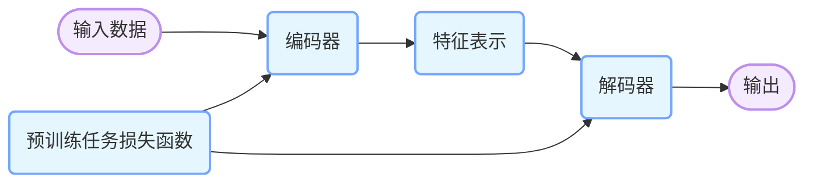

# 自监督学习提升AI推理的泛化能力

> 关键词：自监督学习、AI推理、泛化能力、无监督学习、预训练模型

> 摘要：本文聚焦于自监督学习在提升AI推理泛化能力方面的重要作用。首先介绍了自监督学习的背景，包括其目的、适用读者群体、文档结构和相关术语。接着阐述了自监督学习的核心概念，通过文本示意图和Mermaid流程图展示其原理和架构。详细讲解了自监督学习的核心算法原理，并用Python代码进行说明。深入探讨了相关的数学模型和公式，并举例解释。通过项目实战，从开发环境搭建到源代码实现和解读，全面展示自监督学习的应用。列举了自监督学习在多个领域的实际应用场景。推荐了学习自监督学习的工具和资源，包括书籍、在线课程、技术博客、开发工具和相关论文。最后总结了自监督学习的未来发展趋势与挑战，解答了常见问题，并提供了扩展阅读和参考资料，旨在为读者全面深入地了解自监督学习提升AI推理泛化能力提供有价值的参考。

## 1. 背景介绍 
### 1.1 目的和范围
在当今的人工智能领域，AI推理的泛化能力是衡量模型性能的关键指标之一。泛化能力指的是模型在面对未见过的数据时，依然能够做出准确预测的能力。然而，传统的监督学习方法往往需要大量的标注数据，这不仅成本高昂，而且在某些领域难以获取足够的标注样本。自监督学习作为一种新兴的学习范式，为解决这一问题提供了新的思路。

本文的目的在于深入探讨自监督学习如何提升AI推理的泛化能力。我们将从理论层面剖析自监督学习的核心概念、算法原理和数学模型，同时通过实际的项目案例展示其在实际应用中的效果。文章的范围涵盖了自监督学习的基础知识、核心技术以及在不同领域的应用场景，旨在为读者提供一个全面而深入的了解。

### 1.2 预期读者
本文预期读者包括对人工智能和机器学习有一定基础的专业人士，如数据科学家、机器学习工程师、AI研究人员等。同时，对于希望深入了解自监督学习技术及其应用的学生和爱好者也具有较高的参考价值。读者应具备一定的Python编程基础和线性代数、概率论等数学知识，以便更好地理解文中的算法原理和代码实现。

### 1.3 文档结构概述
本文将按照以下结构进行组织：
- 核心概念与联系：介绍自监督学习的基本概念、原理和架构，通过文本示意图和Mermaid流程图进行直观展示。
- 核心算法原理 & 具体操作步骤：详细讲解自监督学习的核心算法，并用Python代码实现，说明具体的操作步骤。
- 数学模型和公式 & 详细讲解 & 举例说明：深入分析自监督学习的数学模型和相关公式，并通过实际例子进行解释。
- 项目实战：通过一个实际的项目案例，从开发环境搭建、源代码实现到代码解读，展示自监督学习的应用过程。
- 实际应用场景：列举自监督学习在不同领域的实际应用场景，如计算机视觉、自然语言处理等。
- 工具和资源推荐：推荐学习自监督学习的相关工具、资源和论文著作。
- 总结：未来发展趋势与挑战：总结自监督学习的发展趋势和面临的挑战。
- 附录：常见问题与解答：解答读者在学习过程中可能遇到的常见问题。
- 扩展阅读 & 参考资料：提供相关的扩展阅读材料和参考资料，方便读者进一步深入学习。

### 1.4 术语表
#### 1.4.1 核心术语定义
- **自监督学习（Self-Supervised Learning）**：一种无监督学习方法，通过从数据本身自动生成监督信号来训练模型，无需人工标注。
- **泛化能力（Generalization Ability）**：模型在未见过的数据上的表现能力，即能够从训练数据中学习到普遍规律并应用到新数据上。
- **预训练模型（Pretrained Model）**：在大规模数据集上进行自监督学习得到的模型，可以作为后续任务的初始化模型，以提高模型的性能。
- **对比学习（Contrastive Learning）**：自监督学习中的一种常用方法，通过对比正样本和负样本，使模型学习到数据的特征表示。

#### 1.4.2 相关概念解释
- **无监督学习（Unsupervised Learning）**：一种机器学习方法，训练数据没有标注信息，模型需要自行发现数据中的结构和规律。自监督学习是无监督学习的一种特殊形式。
- **监督学习（Supervised Learning）**：训练数据包含输入和对应的标注信息，模型通过学习输入和标注之间的映射关系来进行预测。
- **特征表示（Feature Representation）**：将原始数据转换为一种更具代表性和可区分性的特征向量，以便模型进行处理和分析。

#### 1.4.3 缩略词列表
- **CNN（Convolutional Neural Network）**：卷积神经网络，常用于图像和视频处理。
- **Transformer**：一种基于注意力机制的神经网络架构，在自然语言处理中取得了显著的成果。
- **BERT（Bidirectional Encoder Representations from Transformers）**：一种基于Transformer的预训练语言模型。
- **SimCLR（Simple Framework for Contrastive Learning of Representations）**：一种简单有效的对比学习框架。

## 2. 核心概念与联系 

### 自监督学习的基本概念
自监督学习的核心思想是利用数据本身的内在结构和关系，自动生成监督信号来训练模型。与传统的监督学习不同，自监督学习不需要人工标注数据，因此可以利用大规模的无标注数据进行训练。通过自监督学习，模型可以学习到数据的通用特征表示，这些特征表示可以迁移到各种下游任务中，从而提高模型的泛化能力。

### 自监督学习的原理
自监督学习通常通过设计一个预训练任务来实现。预训练任务的目标是让模型学习到数据的某些方面的特征。例如，在图像领域，可以设计一个图像补全任务，让模型根据图像的部分信息预测缺失的部分；在自然语言处理领域，可以设计一个掩码语言模型任务，让模型预测被掩码的单词。

在预训练过程中，模型通过最小化预训练任务的损失函数来学习数据的特征表示。预训练完成后，模型可以被用于各种下游任务，如分类、检测、生成等。在下游任务中，通常会在预训练模型的基础上进行微调，以适应具体的任务需求。

### 自监督学习的架构
自监督学习的架构通常包括编码器和解码器两部分。编码器负责将输入数据转换为特征表示，解码器负责根据特征表示生成输出。在不同的自监督学习方法中，编码器和解码器的具体结构可能会有所不同。

例如，在对比学习中，编码器通常是一个神经网络，用于提取输入数据的特征向量。解码器可以是一个简单的线性层，用于计算特征向量之间的相似度。在图像补全任务中，编码器可以是一个卷积神经网络，用于提取图像的特征，解码器可以是一个反卷积神经网络，用于根据特征生成完整的图像。

### 文本示意图
下面是一个简单的自监督学习架构的文本示意图：

```plaintext
输入数据 -> 编码器 -> 特征表示 -> 解码器 -> 输出
|                                      |
|                                      |
|__________预训练任务损失函数__________|
```

在这个示意图中，输入数据经过编码器转换为特征表示，解码器根据特征表示生成输出。预训练任务损失函数用于衡量输出与目标之间的差异，模型通过最小化损失函数来学习数据的特征表示。

### Mermaid流程图


这个流程图展示了自监督学习的基本流程。输入数据首先经过编码器得到特征表示，然后解码器根据特征表示生成输出。预训练任务损失函数用于指导编码器和解码器的学习过程。

## 3. 核心算法原理 & 具体操作步骤 

### 对比学习算法原理
对比学习是自监督学习中一种常用的算法，其核心思想是通过对比正样本和负样本，使模型学习到数据的特征表示。在对比学习中，通常会对输入数据进行不同的增强操作，得到正样本对。同时，从数据集中随机选择一些其他数据作为负样本。

模型的目标是最大化正样本对之间的相似度，最小化正样本与负样本之间的相似度。常用的相似度度量方法包括余弦相似度等。

下面是一个简单的对比学习算法的Python代码实现：

```python
import torch
import torch.nn as nn
import torch.optim as optim
import torchvision.transforms as transforms
from torch.utils.data import DataLoader, Dataset
import numpy as np

# 定义编码器
class Encoder(nn.Module):
    def __init__(self):
        super(Encoder, self).__init__()
        self.fc1 = nn.Linear(784, 128)
        self.relu = nn.ReLU()
        self.fc2 = nn.Linear(128, 64)

    def forward(self, x):
        x = self.fc1(x)
        x = self.relu(x)
        x = self.fc2(x)
        return x

# 定义对比学习损失函数
class ContrastiveLoss(nn.Module):
    def __init__(self, temperature=0.1):
        super(ContrastiveLoss, self).__init__()
        self.temperature = temperature
        self.criterion = nn.CrossEntropyLoss()

    def forward(self, features):
        batch_size = features.shape[0]
        labels = torch.arange(batch_size).to(features.device)
        similarity_matrix = torch.matmul(features, features.T) / self.temperature
        loss = self.criterion(similarity_matrix, labels)
        return loss

# 定义数据集
class CustomDataset(Dataset):
    def __init__(self, data):
        self.data = data

    def __len__(self):
        return len(self.data)

    def __getitem__(self, idx):
        return self.data[idx]

# 数据增强
transform = transforms.Compose([
    transforms.ToTensor(),
    transforms.Normalize((0.5,), (0.5,))
])

# 生成一些随机数据作为示例
data = np.random.randn(100, 784).astype(np.float32)
dataset = CustomDataset(data)
dataloader = DataLoader(dataset, batch_size=32, shuffle=True)

# 初始化编码器和损失函数
encoder = Encoder()
criterion = ContrastiveLoss()
optimizer = optim.Adam(encoder.parameters(), lr=0.001)

# 训练过程
num_epochs = 10
for epoch in range(num_epochs):
    running_loss = 0.0
    for batch in dataloader:
        optimizer.zero_grad()
        features = encoder(batch)
        loss = criterion(features)
        loss.backward()
        optimizer.step()
        running_loss += loss.item()
    print(f'Epoch {epoch+1}, Loss: {running_loss / len(dataloader)}')
```

### 具体操作步骤
1. **数据准备**：准备大规模的无标注数据，并进行必要的数据增强操作，以生成正样本对。
2. **模型定义**：定义编码器和解码器的结构，通常编码器可以使用卷积神经网络或Transformer等。
3. **损失函数定义**：选择合适的损失函数，如对比损失函数，用于衡量正样本和负样本之间的相似度。
4. **训练过程**：将数据输入到模型中，通过最小化损失函数来更新模型的参数。
5. **微调过程**：在预训练完成后，将模型用于具体的下游任务，并在下游任务的数据集上进行微调。

## 4. 数学模型和公式 & 详细讲解 & 举例说明 

### 对比学习的数学模型
在对比学习中，假设我们有一个编码器 $f$，它将输入数据 $x$ 映射到特征空间 $z = f(x)$。给定一个正样本对 $(x_i, x_j)$ 和一组负样本 $\{x_k\}_{k=1}^K$，我们希望最大化正样本对之间的相似度，最小化正样本与负样本之间的相似度。

常用的相似度度量方法是余弦相似度：

$$
\mathrm{sim}(z_i, z_j) = \frac{z_i^T z_j}{\|z_i\| \|z_j\|}
$$

对比学习的损失函数通常采用 InfoNCE（Info Noise Contrastive Estimation）损失：

$$
\mathcal{L}_{InfoNCE} = -\log \frac{\exp(\mathrm{sim}(z_i, z_j) / \tau)}{\sum_{k=1}^{K+1} \exp(\mathrm{sim}(z_i, z_k) / \tau)}
$$

其中，$\tau$ 是温度参数，用于控制相似度的分布。

### 详细讲解
InfoNCE 损失的核心思想是将正样本对的相似度得分与所有样本（包括正样本和负样本）的相似度得分进行对比。通过取对数和负号，我们将最大化正样本对相似度的问题转化为最小化损失函数的问题。

温度参数 $\tau$ 控制了相似度得分的分布。当 $\tau$ 较小时，相似度得分的分布会更加尖锐，模型会更加关注正样本对的相似度；当 $\tau$ 较大时，相似度得分的分布会更加平滑，模型会更加关注所有样本之间的相似度。

### 举例说明
假设我们有一个正样本对 $(x_1, x_2)$ 和两个负样本 $x_3$ 和 $x_4$。编码器将它们映射到特征空间得到 $z_1, z_2, z_3, z_4$。计算它们之间的余弦相似度：

$$
\mathrm{sim}(z_1, z_2) = 0.8, \mathrm{sim}(z_1, z_3) = 0.2, \mathrm{sim}(z_1, z_4) = 0.1
$$

假设温度参数 $\tau = 0.1$，则 InfoNCE 损失为：

$$
\mathcal{L}_{InfoNCE} = -\log \frac{\exp(0.8 / 0.1)}{\exp(0.8 / 0.1) + \exp(0.2 / 0.1) + \exp(0.1 / 0.1)}
$$

通过最小化这个损失函数，模型会学习到使得正样本对之间的相似度尽可能大，正样本与负样本之间的相似度尽可能小的特征表示。

## 5. 项目实战：代码实际案例和详细解释说明 

### 5.1  开发环境搭建
在进行自监督学习的项目实战之前，需要搭建相应的开发环境。以下是具体的步骤：

#### 安装Python
首先，确保你已经安装了Python。建议使用Python 3.7及以上版本。你可以从Python官方网站（https://www.python.org/downloads/）下载并安装Python。

#### 安装深度学习框架
我们使用PyTorch作为深度学习框架。可以使用以下命令安装PyTorch：

```sh
pip install torch torchvision
```

#### 安装其他依赖库
还需要安装一些其他的依赖库，如NumPy、Matplotlib等。可以使用以下命令安装：

```sh
pip install numpy matplotlib
```

### 5.2  源代码详细实现和代码解读
以下是一个基于自监督学习的图像分类项目的完整代码实现：

```python
import torch
import torch.nn as nn
import torch.optim as optim
import torchvision
import torchvision.transforms as transforms
from torch.utils.data import DataLoader
import matplotlib.pyplot as plt
import numpy as np

# 数据增强和预处理
transform = transforms.Compose([
    transforms.RandomResizedCrop(224),
    transforms.RandomHorizontalFlip(),
    transforms.ToTensor(),
    transforms.Normalize((0.5, 0.5, 0.5), (0.5, 0.5, 0.5))
])

# 加载数据集
trainset = torchvision.datasets.CIFAR10(root='./data', train=True,
                                        download=True, transform=transform)
trainloader = DataLoader(trainset, batch_size=32, shuffle=True)

testset = torchvision.datasets.CIFAR10(root='./data', train=False,
                                       download=True, transform=transform)
testloader = DataLoader(testset, batch_size=32, shuffle=False)

# 定义编码器
class Encoder(nn.Module):
    def __init__(self):
        super(Encoder, self).__init__()
        self.conv1 = nn.Conv2d(3, 64, kernel_size=3, padding=1)
        self.relu = nn.ReLU()
        self.pool = nn.MaxPool2d(2, 2)
        self.conv2 = nn.Conv2d(64, 128, kernel_size=3, padding=1)
        self.fc1 = nn.Linear(128 * 56 * 56, 128)

    def forward(self, x):
        x = self.conv1(x)
        x = self.relu(x)
        x = self.pool(x)
        x = self.conv2(x)
        x = self.relu(x)
        x = self.pool(x)
        x = x.view(-1, 128 * 56 * 56)
        x = self.fc1(x)
        return x

# 定义对比学习损失函数
class ContrastiveLoss(nn.Module):
    def __init__(self, temperature=0.1):
        super(ContrastiveLoss, self).__init__()
        self.temperature = temperature
        self.criterion = nn.CrossEntropyLoss()

    def forward(self, features):
        batch_size = features.shape[0]
        labels = torch.arange(batch_size).to(features.device)
        similarity_matrix = torch.matmul(features, features.T) / self.temperature
        loss = self.criterion(similarity_matrix, labels)
        return loss

# 初始化编码器和损失函数
encoder = Encoder()
criterion = ContrastiveLoss()
optimizer = optim.Adam(encoder.parameters(), lr=0.001)

# 预训练过程
num_epochs = 10
for epoch in range(num_epochs):
    running_loss = 0.0
    for i, data in enumerate(trainloader, 0):
        inputs, _ = data
        optimizer.zero_grad()
        features = encoder(inputs)
        loss = criterion(features)
        loss.backward()
        optimizer.step()
        running_loss += loss.item()
    print(f'Epoch {epoch+1}, Loss: {running_loss / len(trainloader)}')

# 定义分类器
class Classifier(nn.Module):
    def __init__(self, input_size, num_classes):
        super(Classifier, self).__init__()
        self.fc = nn.Linear(input_size, num_classes)

    def forward(self, x):
        x = self.fc(x)
        return x

# 初始化分类器
classifier = Classifier(128, 10)
criterion_classifier = nn.CrossEntropyLoss()
optimizer_classifier = optim.Adam(classifier.parameters(), lr=0.001)

# 微调过程
num_epochs_finetune = 5
for epoch in range(num_epochs_finetune):
    running_loss = 0.0
    for i, data in enumerate(trainloader, 0):
        inputs, labels = data
        features = encoder(inputs)
        outputs = classifier(features)
        loss = criterion_classifier(outputs, labels)
        optimizer_classifier.zero_grad()
        loss.backward()
        optimizer_classifier.step()
        running_loss += loss.item()
    print(f'Epoch {epoch+1}, Fine-tuning Loss: {running_loss / len(trainloader)}')

# 测试过程
correct = 0
total = 0
with torch.no_grad():
    for data in testloader:
        images, labels = data
        features = encoder(images)
        outputs = classifier(features)
        _, predicted = torch.max(outputs.data, 1)
        total += labels.size(0)
        correct += (predicted == labels).sum().item()

print(f'Accuracy of the network on the 10000 test images: {100 * correct / total}%')
```

### 5.3  代码解读与分析
#### 数据处理部分
- `transform`：定义了数据增强和预处理的操作，包括随机裁剪、随机翻转、转换为张量和归一化。
- `trainset` 和 `testset`：使用 `torchvision.datasets.CIFAR10` 加载 CIFAR-10 数据集，并应用数据增强和预处理操作。
- `trainloader` 和 `testloader`：使用 `DataLoader` 对数据集进行批量加载。

#### 编码器部分
- `Encoder` 类：定义了一个简单的卷积神经网络作为编码器，用于提取图像的特征表示。

#### 对比学习部分
- `ContrastiveLoss` 类：定义了对比学习的损失函数，使用 InfoNCE 损失。
- 预训练过程：通过最小化对比学习损失函数，让编码器学习到图像的特征表示。

#### 分类器部分
- `Classifier` 类：定义了一个简单的全连接层作为分类器，用于将特征表示映射到类别标签。
- 微调过程：在预训练完成后，固定编码器的参数，只训练分类器的参数，以适应图像分类任务。

#### 测试部分
- 测试过程：使用测试集对模型进行评估，计算模型的准确率。

通过这个项目实战，我们展示了如何使用自监督学习来提升图像分类模型的泛化能力。预训练过程让模型学习到了图像的通用特征表示，微调过程让模型适应了具体的分类任务，从而提高了模型在测试集上的准确率。

## 6. 实际应用场景 
### 计算机视觉领域
- **图像分类**：自监督学习可以在大规模无标注图像数据上进行预训练，学习到图像的通用特征表示。然后在有标注的图像数据集上进行微调，提高图像分类模型的性能。例如，在 ImageNet 数据集上进行自监督预训练的模型，在各种下游图像分类任务中都取得了很好的效果。
- **目标检测**：自监督学习可以帮助模型学习到物体的外观特征和上下文信息，从而提高目标检测的准确率。例如，通过自监督学习可以学习到物体的形状、颜色等特征，以及物体之间的空间关系。
- **图像生成**：在图像生成任务中，自监督学习可以用于学习图像的分布和结构。例如，通过自监督学习可以学习到图像的纹理、颜色分布等信息，从而生成更加真实的图像。

### 自然语言处理领域
- **语言模型**：自监督学习在语言模型中得到了广泛的应用。例如，BERT 模型通过掩码语言模型任务进行自监督学习，学习到了语言的语义和语法信息。这些预训练的语言模型可以用于各种下游任务，如文本分类、情感分析、问答系统等。
- **机器翻译**：自监督学习可以帮助模型学习到不同语言之间的语义和语法对应关系。例如，通过自监督学习可以学习到源语言和目标语言之间的词汇和句子结构的映射关系，从而提高机器翻译的质量。
- **文本生成**：在文本生成任务中，自监督学习可以用于学习文本的分布和语义信息。例如，通过自监督学习可以学习到文本的主题、风格等信息，从而生成更加自然和连贯的文本。

### 医疗领域
- **医学图像分析**：医疗领域的图像数据往往标注成本较高，自监督学习可以利用大量的无标注医学图像数据进行预训练，学习到医学图像的特征表示。然后在有标注的医学图像数据集上进行微调，用于疾病诊断、病变检测等任务。
- **医疗文本挖掘**：医疗领域存在大量的文本数据，如病历、医学文献等。自监督学习可以用于学习医疗文本的语义和语法信息，从而提高医疗文本挖掘的效率和准确性。例如，通过自监督学习可以学习到疾病的症状、治疗方法等信息，用于辅助医生进行诊断和治疗决策。

### 自动驾驶领域
- **环境感知**：自动驾驶车辆需要对周围环境进行感知，包括识别道路、交通标志、行人等。自监督学习可以利用大量的无标注的车载摄像头数据进行预训练，学习到环境的特征表示。然后在有标注的数据集上进行微调，提高环境感知的准确性。
- **运动预测**：自监督学习可以帮助模型学习到车辆和行人的运动模式和规律，从而进行准确的运动预测。例如，通过自监督学习可以学习到车辆的加速、减速、转弯等行为模式，以及行人的行走方向和速度等信息。

## 7. 工具和资源推荐
### 7.1 学习资源推荐
#### 7.1.1 书籍推荐
- 《深度学习》（Deep Learning）：由 Ian Goodfellow、Yoshua Bengio 和 Aaron Courville 合著，是深度学习领域的经典教材，涵盖了深度学习的基本概念、算法和应用。
- 《Python深度学习》（Deep Learning with Python）：由 Francois Chollet 编写，介绍了如何使用 Python 和 Keras 进行深度学习的实践。
- 《动手学深度学习》（Dive into Deep Learning）：由 Aston Zhang、Zachary C. Lipton、Mu Li 和 Alexander J. Smola 编写，提供了丰富的深度学习代码示例和详细的解释。

#### 7.1.2 在线课程
- Coursera 上的“深度学习专项课程”（Deep Learning Specialization）：由 Andrew Ng 教授授课，包括神经网络和深度学习、改善深层神经网络、结构化机器学习项目、卷积神经网络和序列模型等五个课程。
- edX 上的“使用 PyTorch 进行深度学习”（Introduction to Deep Learning with PyTorch）：介绍了如何使用 PyTorch 进行深度学习的开发。
- 哔哩哔哩上的“李沐深度学习”系列视频：李沐老师以通俗易懂的方式讲解深度学习的原理和实践。

#### 7.1.3 技术博客和网站
- Medium 上的 Towards Data Science：汇集了大量的数据科学和机器学习的文章和教程。
- 机器之心：专注于人工智能领域的资讯和技术分享。
- OpenAI 博客：OpenAI 发布的最新研究成果和技术文章。

### 7.2 开发工具框架推荐
#### 7.2.1 IDE和编辑器
- PyCharm：一款专业的 Python 集成开发环境，提供了丰富的代码编辑、调试和项目管理功能。
- Jupyter Notebook：一种交互式的开发环境，适合进行数据分析和模型实验。
- Visual Studio Code：一款轻量级的代码编辑器，支持多种编程语言和插件扩展。

#### 7.2.2 调试和性能分析工具
- PyTorch Profiler：PyTorch 自带的性能分析工具，可以帮助开发者分析模型的性能瓶颈。
- TensorBoard：一个可视化工具，用于监控和分析深度学习模型的训练过程。
- NVIDIA Nsight Systems：用于分析 GPU 应用程序的性能。

#### 7.2.3 相关框架和库
- PyTorch：一个开源的深度学习框架，具有动态图、易于使用等特点。
- TensorFlow：一个广泛使用的深度学习框架，提供了丰富的工具和库。
- Hugging Face Transformers：一个用于自然语言处理的开源库，提供了大量的预训练模型和工具。

### 7.3 相关论文著作推荐
#### 7.3.1 经典论文
- “BERT: Pre-training of Deep Bidirectional Transformers for Language Understanding”：介绍了 BERT 模型的原理和应用，是自然语言处理领域的经典论文。
- “SimCLR: A Simple Framework for Contrastive Learning of Representations”：提出了一种简单有效的对比学习框架 SimCLR。
- “ImageNet Classification with Deep Convolutional Neural Networks”：介绍了 AlexNet 模型，开启了深度学习在计算机视觉领域的热潮。

#### 7.3.2 最新研究成果
- 可以关注 arXiv 上的最新论文，如计算机视觉领域的 CVPR、ICCV、ECCV 会议论文，自然语言处理领域的 ACL、EMNLP、NAACL 会议论文。
- 各大科技公司的研究博客，如 Google AI Blog、Facebook AI Research 等，会发布最新的研究成果。

#### 7.3.3 应用案例分析
- 《人工智能：现代方法》（Artificial Intelligence: A Modern Approach）：介绍了人工智能的各种应用案例和方法。
- 一些知名的技术博客和网站会分享自监督学习在不同领域的应用案例，如 Kaggle 上的竞赛案例。

## 8. 总结：未来发展趋势与挑战
### 未来发展趋势
- **多模态自监督学习**：未来的自监督学习将不仅仅局限于单一模态的数据，如图像或文本，而是会朝着多模态的方向发展。例如，结合图像、文本和音频等多种模态的数据进行自监督学习，可以学习到更加丰富和全面的特征表示，从而提高模型在复杂任务中的性能。
- **自监督学习与强化学习的结合**：自监督学习可以为强化学习提供更好的特征表示，而强化学习可以为自监督学习提供更有针对性的学习目标。将两者结合起来，可以提高智能体在复杂环境中的学习能力和决策能力。
- **自监督学习在边缘设备上的应用**：随着物联网和边缘计算的发展，需要在边缘设备上运行高效的人工智能模型。自监督学习可以通过在大规模数据上进行预训练，然后在边缘设备上进行微调，减少对标注数据的依赖，提高模型在边缘设备上的泛化能力。

### 挑战
- **计算资源需求**：自监督学习通常需要在大规模数据集上进行训练，这对计算资源提出了很高的要求。如何在有限的计算资源下提高自监督学习的效率，是一个亟待解决的问题。
- **预训练任务的设计**：预训练任务的设计直接影响到自监督学习的效果。如何设计出更加有效的预训练任务，让模型学习到更加有用的特征表示，是自监督学习领域的一个挑战。
- **模型可解释性**：自监督学习模型通常是基于深度神经网络的，这些模型往往具有较高的复杂度，缺乏可解释性。如何提高自监督学习模型的可解释性，让人们更好地理解模型的决策过程，是一个重要的研究方向。

## 9. 附录：常见问题与解答
### 问题1：自监督学习和无监督学习有什么区别？
自监督学习是无监督学习的一种特殊形式。无监督学习是指在没有标注数据的情况下，让模型自行发现数据中的结构和规律。而自监督学习通过设计预训练任务，从数据本身自动生成监督信号来训练模型。可以说，自监督学习是在无监督学习的基础上，引入了一种自动生成标签的机制。

### 问题2：自监督学习一定能提高模型的泛化能力吗？
不一定。自监督学习可以在一定程度上提高模型的泛化能力，尤其是在标注数据有限的情况下。但是，自监督学习的效果还受到预训练任务的设计、数据集的质量和规模等因素的影响。如果预训练任务设计不合理，或者数据集存在偏差，自监督学习可能无法取得良好的效果。

### 问题3：自监督学习和监督学习可以结合使用吗？
可以。自监督学习和监督学习可以结合使用，以充分发挥两者的优势。一种常见的做法是先在大规模无标注数据上进行自监督学习，得到一个预训练模型。然后在有标注的数据集上对预训练模型进行微调，以适应具体的监督学习任务。这种方法可以提高模型的性能和泛化能力。

### 问题4：自监督学习需要多少数据？
自监督学习通常需要大量的数据来学习到数据的通用特征表示。具体需要多少数据取决于任务的复杂度和数据的多样性。一般来说，数据量越大，模型学习到的特征表示越丰富，泛化能力也越强。但是，数据量的增加也会带来计算资源和时间的增加，需要在数据量和计算资源之间进行权衡。

## 10. 扩展阅读 & 参考资料
### 扩展阅读
- 《深度学习进阶：自然语言处理》：深入介绍了自然语言处理领域的深度学习技术，包括自监督学习在自然语言处理中的应用。
- 《计算机视觉：算法与应用》：涵盖了计算机视觉领域的各种算法和应用，包括自监督学习在计算机视觉中的应用。
- 《强化学习：原理与Python实现》：介绍了强化学习的基本原理和实现方法，以及自监督学习与强化学习的结合。

### 参考资料
- Goodfellow, I., Bengio, Y., & Courville, A. (2016). Deep Learning. MIT Press.
- Chollet, F. (2018). Deep Learning with Python. Manning Publications.
- Zhang, A., Lipton, Z. C., Li, M., & Smola, A. J. (2020). Dive into Deep Learning.
- Devlin, J., Chang, M. W., Lee, K., & Toutanova, K. (2018). BERT: Pre-training of Deep Bidirectional Transformers for Language Understanding. arXiv preprint arXiv:1810.04805.
- Chen, T., Kornblith, S., Norouzi, M., & Hinton, G. (2020). SimCLR: A Simple Framework for Contrastive Learning of Representations. arXiv preprint arXiv:2002.05709.
- Krizhevsky, A., Sutskever, I., & Hinton, G. E. (2012). ImageNet Classification with Deep Convolutional Neural Networks. In Advances in neural information processing systems (pp. 1097-1105).