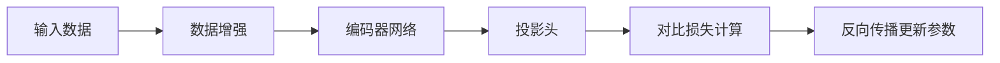

# 自监督对比学习提升AI推理的判别能力

> 关键词：自监督对比学习、AI推理、判别能力、特征表示、对比损失

> 摘要：本文聚焦于自监督对比学习在提升AI推理判别能力方面的应用。首先介绍了研究的背景、目的、预期读者和文档结构等内容。接着详细阐述了自监督对比学习的核心概念、原理和架构，通过Python代码展示了核心算法原理及具体操作步骤，并给出了相关的数学模型和公式。然后通过项目实战展示了代码的实际应用和详细解释。进一步探讨了自监督对比学习在实际场景中的应用，推荐了相关的学习资源、开发工具框架和论文著作。最后总结了自监督对比学习的未来发展趋势与挑战，解答了常见问题并提供了扩展阅读和参考资料。

## 1. 背景介绍 
### 1.1 目的和范围
在当今的人工智能领域，AI推理的判别能力至关重要。准确的判别能力能够使AI系统在图像识别、语音识别、自然语言处理等众多任务中做出更准确的决策。自监督对比学习作为一种新兴的学习方法，为提升AI推理的判别能力提供了新的思路和方法。本文的目的在于深入探讨自监督对比学习如何提升AI推理的判别能力，详细介绍其原理、算法、应用场景等方面的内容，涵盖了从理论到实践的多个层面。

### 1.2 预期读者
本文的预期读者包括人工智能领域的研究人员、开发者、学生以及对自监督对比学习和AI推理感兴趣的技术爱好者。研究人员可以从本文中获取关于自监督对比学习的最新研究进展和应用思路；开发者能够学习到具体的算法实现和项目实战经验；学生可以通过本文系统地了解自监督对比学习的相关知识；技术爱好者则可以通过本文对这一前沿技术有一个初步的认识和了解。

### 1.3 文档结构概述
本文将按照以下结构进行组织：首先介绍自监督对比学习的核心概念与联系，包括其原理和架构；接着详细讲解核心算法原理和具体操作步骤，并给出Python代码示例；然后介绍相关的数学模型和公式，并通过举例进行说明；之后通过项目实战展示代码的实际应用和详细解释；再探讨自监督对比学习在实际场景中的应用；推荐相关的学习资源、开发工具框架和论文著作；最后总结未来发展趋势与挑战，解答常见问题并提供扩展阅读和参考资料。

### 1.4 术语表
#### 1.4.1 核心术语定义
- **自监督对比学习**：一种无监督学习方法，通过对比不同视图下的数据样本来学习数据的特征表示，不需要人工标注的标签信息。
- **AI推理**：指AI系统根据输入的数据和学习到的模型进行决策和判断的过程。
- **判别能力**：指AI系统区分不同类别或模式的能力。
- **特征表示**：将原始数据转换为一种更具代表性和可区分性的向量表示。
- **对比损失**：用于衡量不同样本之间的相似度或差异度的损失函数，在自监督对比学习中起到关键作用。

#### 1.4.2 相关概念解释
- **无监督学习**：是机器学习的一种类型，在没有人工标注的标签信息的情况下，让模型自动发现数据中的模式和结构。
- **视图**：指对同一数据样本进行不同的变换或处理后得到的不同表示形式。
- **正样本对**：指具有相似语义或属于同一类别的样本对。
- **负样本对**：指具有不同语义或属于不同类别的样本对。

#### 1.4.3 缩略词列表
- **SSL**：Self-Supervised Learning，自监督学习
- **CL**：Contrastive Learning，对比学习
- **SCL**：Self-Supervised Contrastive Learning，自监督对比学习
- **CNN**：Convolutional Neural Network，卷积神经网络
- **MLP**：Multi-Layer Perceptron，多层感知机

## 2. 核心概念与联系 

### 核心概念原理
自监督对比学习的核心思想是通过对比不同视图下的数据样本来学习数据的特征表示。具体来说，对于一个给定的数据样本，我们会生成多个不同的视图（例如，对图像进行随机裁剪、旋转、颜色变换等操作），然后将这些视图输入到神经网络中进行特征提取。在训练过程中，我们希望网络学习到的特征能够使得同一数据样本的不同视图在特征空间中距离较近，而不同数据样本的视图在特征空间中距离较远。

为了实现这一目标，自监督对比学习引入了对比损失函数。对比损失函数通常会鼓励正样本对（同一数据样本的不同视图）之间的相似度，同时惩罚负样本对（不同数据样本的视图）之间的相似度。通过最小化对比损失函数，网络可以学习到具有判别性的特征表示，从而提升AI推理的判别能力。

### 架构的文本示意图
以下是自监督对比学习的基本架构示意图：

输入数据 -> 数据增强（生成不同视图） -> 编码器网络（提取特征） -> 投影头（映射到对比空间） -> 对比损失计算 -> 反向传播更新网络参数

### Mermaid流程图


## 3. 核心算法原理 & 具体操作步骤 

### 核心算法原理
自监督对比学习的核心算法可以分为以下几个步骤：

1. **数据增强**：对输入的数据样本进行随机的数据增强操作，生成多个不同的视图。
2. **特征提取**：将生成的不同视图输入到编码器网络中，提取其特征表示。
3. **投影映射**：将提取的特征通过投影头映射到对比空间，得到用于对比的特征向量。
4. **对比损失计算**：计算正样本对和负样本对之间的对比损失。
5. **参数更新**：通过反向传播算法，根据对比损失更新编码器网络和投影头的参数。

### 具体操作步骤及Python源代码
以下是一个简单的自监督对比学习的Python代码示例，使用PyTorch框架实现：

```python
import torch
import torch.nn as nn
import torch.optim as optim
import torchvision.transforms as transforms
from torch.utils.data import DataLoader, Dataset

# 定义编码器网络
class Encoder(nn.Module):
    def __init__(self):
        super(Encoder, self).__init__()
        self.conv1 = nn.Conv2d(3, 64, kernel_size=3, stride=1, padding=1)
        self.relu = nn.ReLU()
        self.pool = nn.MaxPool2d(kernel_size=2, stride=2)
        self.fc = nn.Linear(64 * 16 * 16, 128)

    def forward(self, x):
        x = self.conv1(x)
        x = self.relu(x)
        x = self.pool(x)
        x = x.view(-1, 64 * 16 * 16)
        x = self.fc(x)
        return x

# 定义投影头
class ProjectionHead(nn.Module):
    def __init__(self):
        super(ProjectionHead, self).__init__()
        self.fc1 = nn.Linear(128, 64)
        self.relu = nn.ReLU()
        self.fc2 = nn.Linear(64, 32)

    def forward(self, x):
        x = self.fc1(x)
        x = self.relu(x)
        x = self.fc2(x)
        return x

# 定义对比损失函数
class ContrastiveLoss(nn.Module):
    def __init__(self, temperature=0.1):
        super(ContrastiveLoss, self).__init__()
        self.temperature = temperature
        self.criterion = nn.CrossEntropyLoss()

    def forward(self, features):
        batch_size = features.shape[0]
        labels = torch.arange(batch_size).to(features.device)
        similarity_matrix = torch.matmul(features, features.T) / self.temperature
        loss = self.criterion(similarity_matrix, labels)
        return loss

# 定义数据集
class CustomDataset(Dataset):
    def __init__(self, data, transform=None):
        self.data = data
        self.transform = transform

    def __len__(self):
        return len(self.data)

    def __getitem__(self, idx):
        sample = self.data[idx]
        if self.transform:
            view1 = self.transform(sample)
            view2 = self.transform(sample)
        return view1, view2

# 数据增强
transform = transforms.Compose([
    transforms.RandomResizedCrop(32),
    transforms.RandomHorizontalFlip(),
    transforms.ToTensor()
])

# 生成一些随机数据作为示例
data = [torch.randn(3, 32, 32) for _ in range(100)]
dataset = CustomDataset(data, transform=transform)
dataloader = DataLoader(dataset, batch_size=16, shuffle=True)

# 初始化模型、损失函数和优化器
encoder = Encoder()
projection_head = ProjectionHead()
criterion = ContrastiveLoss()
optimizer = optim.Adam(list(encoder.parameters()) + list(projection_head.parameters()), lr=0.001)

# 训练过程
num_epochs = 10
for epoch in range(num_epochs):
    running_loss = 0.0
    for view1, view2 in dataloader:
        optimizer.zero_grad()
        features1 = encoder(view1)
        features2 = encoder(view2)
        projected_features1 = projection_head(features1)
        projected_features2 = projection_head(features2)
        all_features = torch.cat([projected_features1, projected_features2], dim=0)
        loss = criterion(all_features)
        loss.backward()
        optimizer.step()
        running_loss += loss.item()
    print(f'Epoch {epoch + 1}, Loss: {running_loss / len(dataloader)}')
```

### 代码解释
1. **编码器网络**：`Encoder`类用于提取输入数据的特征表示。它包含一个卷积层、一个ReLU激活函数、一个最大池化层和一个全连接层。
2. **投影头**：`ProjectionHead`类用于将编码器提取的特征映射到对比空间。它包含两个全连接层和一个ReLU激活函数。
3. **对比损失函数**：`ContrastiveLoss`类用于计算对比损失。它使用交叉熵损失函数来衡量不同样本之间的相似度。
4. **数据集和数据增强**：`CustomDataset`类用于封装数据集，`transform`用于对数据进行随机的数据增强操作。
5. **训练过程**：在训练过程中，我们将不同视图的样本输入到编码器和投影头中，计算对比损失，并通过反向传播算法更新模型的参数。

## 4. 数学模型和公式 & 详细讲解 & 举例说明 

### 对比损失函数的数学模型
对比损失函数通常使用InfoNCE（Info Noise Contrastive Estimation）损失，其数学公式如下：

$$
L_{contrastive} = -\frac{1}{N} \sum_{i=1}^{N} \log \frac{\exp(\frac{\mathbf{z}_i^T \mathbf{z}_{i'}}{\tau})}{\sum_{j=1}^{2N} \exp(\frac{\mathbf{z}_i^T \mathbf{z}_j}{\tau})}
$$

其中，$N$ 是样本的数量，$\mathbf{z}_i$ 和 $\mathbf{z}_{i'}$ 是同一数据样本的不同视图的特征向量，$\mathbf{z}_j$ 是所有样本的特征向量，$\tau$ 是温度参数。

### 详细讲解
InfoNCE损失的核心思想是通过对比正样本对和负样本对之间的相似度来学习特征表示。分子部分表示正样本对之间的相似度，分母部分表示所有样本对之间的相似度。通过最大化正样本对之间的相似度，同时最小化负样本对之间的相似度，模型可以学习到具有判别性的特征表示。

### 举例说明
假设我们有一个包含4个样本的批次，每个样本有两个不同的视图。那么 $N = 4$，总共有 $2N = 8$ 个特征向量。对于第 $i$ 个样本的一个视图的特征向量 $\mathbf{z}_i$，其正样本对是另一个视图的特征向量 $\mathbf{z}_{i'}$，负样本对是其他6个样本的特征向量。通过计算InfoNCE损失，我们可以使得 $\mathbf{z}_i$ 和 $\mathbf{z}_{i'}$ 之间的相似度尽可能高，而 $\mathbf{z}_i$ 和其他负样本对之间的相似度尽可能低。

## 5. 项目实战：代码实际案例和详细解释说明 

### 5.1  开发环境搭建
为了运行上述的自监督对比学习代码，我们需要搭建以下开发环境：

1. **Python**：建议使用Python 3.6及以上版本。
2. **PyTorch**：可以根据自己的CUDA版本选择合适的PyTorch版本进行安装。安装命令如下：
```sh
pip install torch torchvision
```
3. **其他依赖库**：根据代码中使用的库，还需要安装`torchvision`、`numpy`等库。安装命令如下：
```sh
pip install torchvision numpy
```

### 5.2  源代码详细实现和代码解读
上述代码已经在第3节中详细介绍过，这里再对其进行一些补充说明。

- **数据增强**：通过`torchvision.transforms`模块对输入数据进行随机的数据增强操作，包括随机裁剪、随机水平翻转和转换为张量等操作。
- **编码器网络**：使用卷积层和全连接层构建编码器网络，用于提取输入数据的特征表示。
- **投影头**：使用全连接层构建投影头，将编码器提取的特征映射到对比空间。
- **对比损失函数**：使用InfoNCE损失作为对比损失函数，通过交叉熵损失函数实现。
- **训练过程**：在训练过程中，我们将不同视图的样本输入到编码器和投影头中，计算对比损失，并通过反向传播算法更新模型的参数。

### 5.3  代码解读与分析
- **数据增强的作用**：数据增强可以增加数据的多样性，使得模型能够学习到更鲁棒的特征表示。通过随机裁剪、随机水平翻转等操作，我们可以生成不同的视图，从而提高模型的泛化能力。
- **编码器和投影头的作用**：编码器用于提取输入数据的特征表示，投影头用于将编码器提取的特征映射到对比空间。通过投影头的映射，我们可以使得不同样本的特征在对比空间中具有更好的可区分性。
- **对比损失函数的作用**：对比损失函数是自监督对比学习的核心，它通过对比正样本对和负样本对之间的相似度来学习特征表示。通过最小化对比损失函数，模型可以学习到具有判别性的特征表示，从而提升AI推理的判别能力。

## 6. 实际应用场景 
自监督对比学习在多个领域都有广泛的应用，以下是一些常见的实际应用场景：

### 图像识别
在图像识别任务中，自监督对比学习可以用于预训练图像特征提取模型。通过在大规模无标注图像数据上进行自监督对比学习，模型可以学习到具有判别性的图像特征表示。然后，将预训练的模型在有标注的图像数据集上进行微调，用于具体的图像分类、目标检测等任务。这种方法可以显著提高模型的性能，尤其是在标注数据有限的情况下。

### 语音识别
在语音识别任务中，自监督对比学习可以用于学习语音信号的特征表示。通过对语音信号进行不同的变换（如添加噪声、改变语速等），生成不同的视图，然后使用自监督对比学习方法学习这些视图之间的特征表示。这种方法可以提高语音识别模型对不同语音风格和环境噪声的鲁棒性。

### 自然语言处理
在自然语言处理任务中，自监督对比学习可以用于学习文本的语义表示。例如，通过对文本进行不同的掩码操作，生成不同的视图，然后使用自监督对比学习方法学习这些视图之间的特征表示。这种方法可以提高自然语言处理模型在文本分类、情感分析、机器翻译等任务中的性能。

### 医疗影像分析
在医疗影像分析任务中，自监督对比学习可以用于学习医学图像的特征表示。由于医疗影像数据通常标注成本较高，自监督对比学习可以在大量无标注的医疗影像数据上进行预训练，学习到具有判别性的医学图像特征表示。然后，将预训练的模型在少量有标注的医疗影像数据集上进行微调，用于疾病诊断、病变检测等任务。

## 7. 工具和资源推荐
### 7.1 学习资源推荐
#### 7.1.1 书籍推荐
- 《深度学习》（Deep Learning）：由Ian Goodfellow、Yoshua Bengio和Aaron Courville合著，是深度学习领域的经典教材，涵盖了深度学习的基本原理、算法和应用。
- 《Python深度学习》（Deep Learning with Python）：由Francois Chollet所著，介绍了如何使用Python和Keras框架进行深度学习的开发，适合初学者入门。
- 《动手学深度学习》（Dive into Deep Learning）：由李沐等人编写，提供了丰富的深度学习代码示例和详细的讲解，适合通过实践来学习深度学习。

#### 7.1.2 在线课程
- Coursera上的“深度学习专项课程”（Deep Learning Specialization）：由Andrew Ng教授授课，涵盖了深度学习的多个方面，包括神经网络、卷积神经网络、循环神经网络等。
- edX上的“强化学习基础”（Fundamentals of Reinforcement Learning）：介绍了强化学习的基本概念、算法和应用，适合对强化学习感兴趣的学习者。
- 哔哩哔哩上的“李宏毅机器学习课程”：由李宏毅教授授课，课程内容生动有趣，适合初学者快速入门机器学习和深度学习。

#### 7.1.3 技术博客和网站
- Medium：是一个技术博客平台，上面有很多关于人工智能、深度学习、自监督学习等领域的优秀文章。
- arXiv：是一个预印本论文平台，提供了大量的最新研究成果和论文，适合关注前沿技术的研究人员。
- 机器之心：是一个专注于人工智能领域的科技媒体，提供了丰富的技术资讯、论文解读和行业动态。

### 7.2 开发工具框架推荐
#### 7.2.1 IDE和编辑器
- PyCharm：是一款专门为Python开发设计的集成开发环境（IDE），提供了丰富的代码编辑、调试、版本控制等功能，适合专业的Python开发者。
- Jupyter Notebook：是一个交互式的开发环境，支持Python、R等多种编程语言，适合进行数据探索、模型实验和代码演示。
- Visual Studio Code：是一款轻量级的代码编辑器，支持多种编程语言和插件扩展，适合快速开发和调试代码。

#### 7.2.2 调试和性能分析工具
- PyTorch Profiler：是PyTorch框架自带的性能分析工具，可以帮助开发者分析模型的运行时间、内存使用等情况，优化模型的性能。
- TensorBoard：是TensorFlow框架自带的可视化工具，也可以用于PyTorch模型的可视化。它可以展示模型的训练过程、损失曲线、准确率等信息，帮助开发者更好地理解模型的性能。
- NVIDIA Nsight Systems：是一款专门用于GPU性能分析的工具，可以帮助开发者分析GPU的使用情况、内存带宽等指标，优化模型在GPU上的运行性能。

#### 7.2.3 相关框架和库
- PyTorch：是一个开源的深度学习框架，提供了丰富的深度学习模型和工具，支持GPU加速，适合进行深度学习的研究和开发。
- TensorFlow：是另一个广泛使用的深度学习框架，具有强大的分布式训练和部署能力，适合工业级的深度学习应用。
- Scikit-learn：是一个用于机器学习的Python库，提供了丰富的机器学习算法和工具，适合进行传统机器学习任务的开发。

### 7.3 相关论文著作推荐
#### 7.3.1 经典论文
- “A Simple Framework for Contrastive Learning of Visual Representations”（SimCLR）：提出了一种简单而有效的自监督对比学习框架，在图像表示学习方面取得了很好的效果。
- “Momentum Contrast for Unsupervised Visual Representation Learning”（MoCo）：提出了一种基于动量对比的自监督对比学习方法，通过维护一个动态的字典来提高对比学习的效率。
- “Contrastive Predictive Coding”（CPC）：提出了一种基于对比预测编码的自监督学习方法，用于学习序列数据的特征表示。

#### 7.3.2 最新研究成果
- “BYOL: Bootstrap Your Own Latent: A New Approach to Self-Supervised Learning”：提出了一种无负样本的自监督对比学习方法，通过自引导的方式学习特征表示。
- “SwAV: Unsupervised Learning of Visual Features by Contrasting Cluster Assignments”：提出了一种基于聚类对比的自监督学习方法，通过对比不同聚类分配来学习特征表示。
- “DINO: Emerging Properties in Self-Supervised Vision Transformers”：研究了自监督学习在视觉Transformer模型中的应用，发现了一些新兴的特性。

#### 7.3.3 应用案例分析
- “Self-Supervised Learning for Medical Image Analysis: A Survey”：对自监督学习在医疗影像分析领域的应用进行了综述，介绍了各种自监督学习方法在医疗影像分类、分割、检测等任务中的应用。
- “Contrastive Learning for Audio: A Survey”：对自监督对比学习在音频领域的应用进行了综述，介绍了各种对比学习方法在音频分类、语音识别、音乐信息检索等任务中的应用。
- “Self-Supervised Learning for Natural Language Processing: A Survey”：对自监督学习在自然语言处理领域的应用进行了综述，介绍了各种自监督学习方法在文本分类、情感分析、机器翻译等任务中的应用。

## 8. 总结：未来发展趋势与挑战
### 未来发展趋势
- **多模态自监督对比学习**：未来的研究可能会更加关注多模态数据的自监督对比学习，例如将图像、语音、文本等多种模态的数据结合起来进行学习，以获得更全面、更强大的特征表示。
- **无监督预训练与有监督微调的结合**：自监督对比学习在无监督预训练阶段可以学习到通用的特征表示，然后在有监督微调阶段可以针对具体任务进行优化。未来的研究可能会进一步探索如何更好地结合这两个阶段，提高模型的性能和泛化能力。
- **自监督对比学习在强化学习中的应用**：自监督对比学习可以为强化学习提供更有效的特征表示，从而提高强化学习算法的效率和性能。未来的研究可能会将自监督对比学习应用到强化学习中，解决强化学习中的一些挑战，如样本效率低、泛化能力差等问题。

### 挑战
- **计算资源需求**：自监督对比学习通常需要大量的计算资源来进行训练，尤其是在处理大规模数据集时。如何降低计算资源的需求，提高训练效率，是一个亟待解决的问题。
- **对比损失函数的设计**：对比损失函数的设计对自监督对比学习的性能有着重要的影响。如何设计更有效的对比损失函数，提高模型的判别能力，是一个需要深入研究的问题。
- **模型的可解释性**：自监督对比学习模型通常是黑盒模型，其学习到的特征表示和决策过程难以解释。如何提高模型的可解释性，让人们更好地理解模型的行为和决策依据，是一个具有挑战性的问题。

## 9. 附录：常见问题与解答
### 问题1：自监督对比学习和有监督学习有什么区别？
自监督对比学习是一种无监督学习方法，不需要人工标注的标签信息。它通过对比不同视图下的数据样本来学习数据的特征表示。而有监督学习需要人工标注的标签信息，通过最小化预测结果和标签之间的损失函数来学习模型的参数。

### 问题2：自监督对比学习中数据增强的作用是什么？
数据增强的作用是增加数据的多样性，使得模型能够学习到更鲁棒的特征表示。通过对数据进行随机的变换（如裁剪、旋转、颜色变换等），可以生成不同的视图，从而提高模型的泛化能力。

### 问题3：自监督对比学习的对比损失函数有哪些？
常见的对比损失函数包括InfoNCE损失、Triplet损失等。InfoNCE损失通过对比正样本对和负样本对之间的相似度来学习特征表示，Triplet损失则通过对比锚点样本、正样本和负样本之间的距离来学习特征表示。

### 问题4：自监督对比学习可以应用于哪些领域？
自监督对比学习可以应用于图像识别、语音识别、自然语言处理、医疗影像分析等多个领域。在这些领域中，自监督对比学习可以用于预训练模型，学习到具有判别性的特征表示，从而提高模型的性能。

## 10. 扩展阅读 & 参考资料
- Goodfellow, I., Bengio, Y., & Courville, A. (2016). Deep Learning. MIT Press.
- Chollet, F. (2017). Deep Learning with Python. Manning Publications.
- Li, M., Zhang, A., & Zhang, Z. (2020). Dive into Deep Learning. Amazon KDP.
- Chen, T., Kornblith, S., Norouzi, M., & Hinton, G. (2020). A Simple Framework for Contrastive Learning of Visual Representations. arXiv preprint arXiv:2002.05709.
- He, K., Fan, H., Wu, Y., Xie, S., & Girshick, R. (2020). Momentum Contrast for Unsupervised Visual Representation Learning. In Proceedings of the IEEE/CVF Conference on Computer Vision and Pattern Recognition (pp. 9729-9738).
- Oord, A. v. d., Li, Y., & Vinyals, O. (2018). Representation Learning with Contrastive Predictive Coding. arXiv preprint arXiv:1807.03748.
- Grill, J.-B., Strub, F., Altché, F., Tallec, C., Richemond, P. H., Buchatskaya, E., ... & Valko, M. (2020). Bootstrap Your Own Latent: A New Approach to Self-Supervised Learning. arXiv preprint arXiv:2006.07733.
- Caron, M., Misra, I., Mairal, J., Goyal, P., Bojanowski, P., & Joulin, A. (2020). Unsupervised Learning of Visual Features by Contrasting Cluster Assignments. arXiv preprint arXiv:2006.09882.
- Caron, M., Touvron, H., Misra, I., Jégou, H., Mairal, J., Bojanowski, P., & Joulin, A. (2021). Emerging Properties in Self-Supervised Vision Transformers. arXiv preprint arXiv:2104.14294.
- Wang, Y., & Yuille, A. L. (2020). Self-Supervised Learning for Medical Image Analysis: A Survey. arXiv preprint arXiv:2006.12097.
- Zafeiriou, S., & Kossaifi, J. (2021). Contrastive Learning for Audio: A Survey. arXiv preprint arXiv:2108.00917.
- Devlin, J., Chang, M.-W., Lee, K., & Toutanova, K. (2018). BERT: Pre-training of Deep Bidirectional Transformers for Language Understanding. arXiv preprint arXiv:1810.04805.