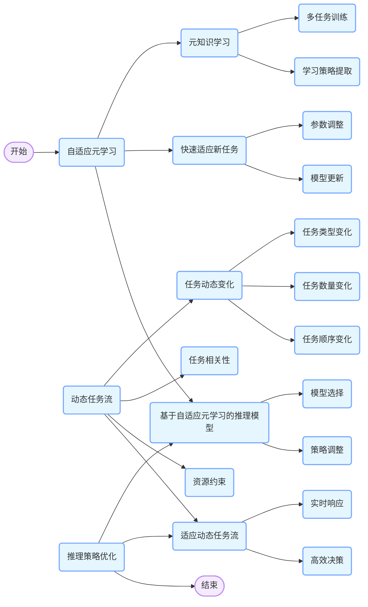

# 自适应元学习优化动态任务流中的推理策略

> 关键词：自适应元学习、动态任务流、推理策略、优化算法、机器学习

> 摘要：本文聚焦于自适应元学习在动态任务流推理策略优化方面的应用。随着任务流的动态性和复杂性不断增加，传统的推理策略难以满足高效准确的推理需求。自适应元学习通过快速学习和适应新任务的能力，为动态任务流中的推理策略优化提供了新的思路。文章详细介绍了自适应元学习和动态任务流的核心概念及其联系，阐述了核心算法原理和具体操作步骤，通过数学模型和公式深入分析其原理，并结合实际案例展示了如何在项目中应用该技术。此外，还探讨了其实际应用场景，推荐了相关的学习资源、开发工具和论文著作，最后总结了该领域的未来发展趋势与挑战。

## 1. 背景介绍 

### 1.1 目的和范围
在当今的信息技术领域，许多实际应用场景都涉及到动态任务流的处理，如智能物流中的订单调度、医疗诊断中的病例分析流程等。这些任务流的特点是任务的类型、数量和顺序会随时间动态变化，传统的推理策略往往难以在这种动态环境下保持高效和准确。本文的目的是研究如何利用自适应元学习技术优化动态任务流中的推理策略，以提高系统在动态环境下的推理性能。范围涵盖了自适应元学习的基本原理、相关算法、数学模型，以及在实际项目中的应用案例和工具资源推荐。

### 1.2 预期读者
本文预期读者包括对人工智能、机器学习领域感兴趣的研究人员、工程师和学生。对于从事动态任务流处理、智能决策系统开发的专业人士，以及希望了解自适应元学习在实际应用中如何发挥作用的技术爱好者也具有一定的参考价值。

### 1.3 文档结构概述
本文将按照以下结构展开：首先介绍自适应元学习和动态任务流的核心概念及其联系，然后详细阐述核心算法原理和具体操作步骤，通过数学模型和公式深入分析其原理。接着结合实际案例展示项目实战中的代码实现和详细解释，探讨该技术的实际应用场景。之后推荐相关的学习资源、开发工具和论文著作。最后总结该领域的未来发展趋势与挑战，并提供常见问题的解答和扩展阅读参考资料。

### 1.4 术语表
#### 1.4.1 核心术语定义
- **自适应元学习（Adaptive Meta-Learning）**：一种机器学习方法，旨在让模型能够快速学习和适应新的任务，通过从多个任务中学习通用的知识和学习策略，以提高在未知任务上的学习效率和性能。
- **动态任务流（Dynamic Task Flow）**：任务的类型、数量和顺序随时间动态变化的任务序列，在实际应用中，这些任务可能具有不同的优先级和资源需求。
- **推理策略（Inference Strategy）**：在给定任务流的情况下，系统用于做出决策和推断的方法和规则，目标是在满足任务约束的前提下，尽可能高效地完成任务。

#### 1.4.2 相关概念解释
- **元知识（Meta-Knowledge）**：在自适应元学习中，元知识是指从多个任务中学习到的通用信息，如学习率、模型结构等，这些知识可以帮助模型更快地适应新任务。
- **任务分布（Task Distribution）**：描述了任务流中不同类型任务出现的概率和频率，了解任务分布对于设计有效的推理策略至关重要。

#### 1.4.3 缩略词列表
- **MAML（Model-Agnostic Meta-Learning）**：模型无关元学习，一种经典的自适应元学习算法。
- **RL（Reinforcement Learning）**：强化学习，一种通过智能体与环境交互并根据奖励信号学习最优策略的机器学习方法。

## 2. 核心概念与联系 

### 2.1 自适应元学习原理
自适应元学习的核心思想是通过在多个相关任务上进行训练，学习到一种通用的学习策略，使得模型能够在面对新任务时快速适应。传统的机器学习方法通常需要大量的数据和长时间的训练才能在特定任务上取得较好的性能，而自适应元学习则能够利用先前学习到的知识，在少量数据上快速调整模型参数，实现对新任务的有效学习。

例如，在图像分类任务中，如果模型已经学习了不同动物的分类知识，当遇到一个新的动物类别时，自适应元学习可以利用之前学习到的特征提取和分类策略，快速适应新的分类任务。

### 2.2 动态任务流特点
动态任务流具有以下特点：
- **任务动态性**：任务的类型、数量和顺序会随时间变化，例如在智能客服系统中，不同时间段可能会收到不同类型的客户咨询请求。
- **任务相关性**：任务之间可能存在一定的关联，例如在供应链管理中，订单处理任务可能与库存管理任务相互影响。
- **资源约束**：任务的执行通常受到资源的限制，如计算资源、时间资源等。

### 2.3 自适应元学习与动态任务流的联系
自适应元学习可以为动态任务流中的推理策略优化提供有效的解决方案。在动态任务流中，由于任务的动态性和不确定性，传统的推理策略可能无法及时适应新的任务需求。而自适应元学习通过学习通用的学习策略，能够快速调整推理模型的参数，以适应不同类型和顺序的任务。

例如，在一个智能机器人的任务调度系统中，当任务流发生变化时，自适应元学习可以帮助机器人快速学习新的任务规则和推理策略，从而更高效地完成任务。

### 2.4 核心概念架构的文本示意图
```plaintext
自适应元学习
├── 元知识学习
│   ├── 多任务训练
│   ├── 学习策略提取
├── 快速适应新任务
│   ├── 参数调整
│   ├── 模型更新

动态任务流
├── 任务动态变化
│   ├── 任务类型变化
│   ├── 任务数量变化
│   ├── 任务顺序变化
├── 任务相关性
├── 资源约束

推理策略优化
├── 基于自适应元学习的推理模型
│   ├── 模型选择
│   ├── 策略调整
├── 适应动态任务流
│   ├── 实时响应
│   ├── 高效决策
```

### 2.5 Mermaid 流程图


## 3. 核心算法原理 & 具体操作步骤 

### 3.1 核心算法原理：Model-Agnostic Meta-Learning (MAML)
MAML 是一种经典的自适应元学习算法，其核心思想是通过在多个任务上进行训练，找到一组初始参数，使得模型在这些任务上进行少量的梯度更新后，能够在新任务上取得较好的性能。

具体来说，MAML 的训练过程分为两个阶段：元训练阶段和元测试阶段。在元训练阶段，模型从多个任务中采样一些任务作为训练任务，对于每个训练任务，先使用当前的模型参数进行前向传播和损失计算，然后根据损失计算梯度并更新模型参数。接着，使用更新后的参数在该任务上再次进行前向传播和损失计算，将这个损失作为元损失，用于更新初始的模型参数。在元测试阶段，模型使用训练好的初始参数，在新的任务上进行少量的梯度更新，以适应新任务。

### 3.2 Python 源代码实现 MAML
```python
import torch
import torch.nn as nn
import torch.optim as optim

# 定义一个简单的神经网络模型
class SimpleModel(nn.Module):
    def __init__(self, input_size, hidden_size, output_size):
        super(SimpleModel, self).__init__()
        self.fc1 = nn.Linear(input_size, hidden_size)
        self.relu = nn.ReLU()
        self.fc2 = nn.Linear(hidden_size, output_size)

    def forward(self, x):
        out = self.fc1(x)
        out = self.relu(out)
        out = self.fc2(out)
        return out

# MAML 算法实现
def maml(model, tasks, num_inner_steps, inner_lr, meta_lr, num_meta_steps):
    meta_optimizer = optim.Adam(model.parameters(), lr=meta_lr)

    for meta_step in range(num_meta_steps):
        meta_losses = []
        for task in tasks:
            # 保存当前模型参数
            fast_weights = dict(model.named_parameters())

            # 内循环：在当前任务上进行少量梯度更新
            for inner_step in range(num_inner_steps):
                inputs, labels = task
                outputs = model.forward(inputs)
                loss = nn.CrossEntropyLoss()(outputs, labels)
                grads = torch.autograd.grad(loss, fast_weights.values(), create_graph=True)
                fast_weights = dict((name, param - inner_lr * grad) for ((name, param), grad) in zip(fast_weights.items(), grads))

            # 计算元损失
            inputs, labels = task
            outputs = model.forward(inputs)
            meta_loss = nn.CrossEntropyLoss()(outputs, labels)
            meta_losses.append(meta_loss)

        # 元更新
        meta_loss = torch.stack(meta_losses).mean()
        meta_optimizer.zero_grad()
        meta_loss.backward()
        meta_optimizer.step()

        if (meta_step + 1) % 100 == 0:
            print(f"Meta step {meta_step + 1}, Meta loss: {meta_loss.item()}")

    return model

# 示例使用
input_size = 10
hidden_size = 20
output_size = 5
model = SimpleModel(input_size, hidden_size, output_size)

# 模拟一些任务
tasks = []
for _ in range(10):
    inputs = torch.randn(32, input_size)
    labels = torch.randint(0, output_size, (32,))
    tasks.append((inputs, labels))

# 训练参数
num_inner_steps = 5
inner_lr = 0.01
meta_lr = 0.001
num_meta_steps = 1000

# 训练模型
trained_model = maml(model, tasks, num_inner_steps, inner_lr, meta_lr, num_meta_steps)
```

### 3.3 具体操作步骤
1. **定义模型**：首先需要定义一个合适的模型结构，如上述代码中的 `SimpleModel`。
2. **初始化参数**：设置内循环的步数 `num_inner_steps`、内循环的学习率 `inner_lr`、元学习率 `meta_lr` 和元训练的步数 `num_meta_steps`。
3. **准备任务数据**：收集或生成多个任务的数据，每个任务可以表示为输入数据和对应的标签。
4. **元训练**：在每个元训练步骤中，对每个任务进行内循环的梯度更新，计算元损失，并使用元优化器更新模型的初始参数。
5. **元测试**：使用训练好的模型在新的任务上进行少量的梯度更新，以适应新任务。

## 4. 数学模型和公式 & 详细讲解 & 举例说明 

### 4.1 数学模型
在 MAML 算法中，我们的目标是找到一组初始参数 $\theta$，使得模型在新任务上进行少量的梯度更新后能够取得较好的性能。

设 $T$ 是任务的集合，对于每个任务 $t \in T$，我们有输入数据 $x_t$ 和对应的标签 $y_t$。模型在任务 $t$ 上的损失函数为 $L_t(\theta)$。

在元训练阶段，对于每个任务 $t$，我们首先使用当前的参数 $\theta$ 计算损失 $L_t(\theta)$，然后根据损失计算梯度 $\nabla_{\theta} L_t(\theta)$，并使用梯度更新参数得到 $\theta'_t = \theta - \alpha \nabla_{\theta} L_t(\theta)$，其中 $\alpha$ 是内循环的学习率。

接着，我们使用更新后的参数 $\theta'_t$ 计算元损失 $\mathcal{L}_{meta}(\theta) = \sum_{t \in T} L_t(\theta'_t)$，并根据元损失更新初始参数 $\theta$，即 $\theta \leftarrow \theta - \beta \nabla_{\theta} \mathcal{L}_{meta}(\theta)$，其中 $\beta$ 是元学习率。

### 4.2 公式详细讲解
- **内循环参数更新**：
  $$\theta'_t = \theta - \alpha \nabla_{\theta} L_t(\theta)$$
  这个公式表示在任务 $t$ 上，使用当前的参数 $\theta$ 计算损失 $L_t(\theta)$，然后根据梯度 $\nabla_{\theta} L_t(\theta)$ 对参数进行更新，得到更新后的参数 $\theta'_t$。

- **元损失计算**：
  $$\mathcal{L}_{meta}(\theta) = \sum_{t \in T} L_t(\theta'_t)$$
  元损失是所有任务在更新后的参数 $\theta'_t$ 上的损失之和。

- **元参数更新**：
  $$\theta \leftarrow \theta - \beta \nabla_{\theta} \mathcal{L}_{meta}(\theta)$$
  根据元损失的梯度 $\nabla_{\theta} \mathcal{L}_{meta}(\theta)$ 对初始参数 $\theta$ 进行更新，使得模型能够在多个任务上都取得较好的性能。

### 4.3 举例说明
假设我们有两个任务 $t_1$ 和 $t_2$，模型的参数 $\theta$ 是一个二维向量 $[w_1, w_2]$。

对于任务 $t_1$，输入数据 $x_1$ 和标签 $y_1$ 计算得到损失 $L_{t_1}(\theta) = (w_1 + w_2 - 1)^2$。
内循环的学习率 $\alpha = 0.1$，则更新后的参数 $\theta'_{t_1} = [w_1 - 0.1 \times 2(w_1 + w_2 - 1), w_2 - 0.1 \times 2(w_1 + w_2 - 1)]$。

对于任务 $t_2$，输入数据 $x_2$ 和标签 $y_2$ 计算得到损失 $L_{t_2}(\theta) = (w_1 - w_2)^2$。
更新后的参数 $\theta'_{t_2} = [w_1 - 0.1 \times 2(w_1 - w_2), w_2 + 0.1 \times 2(w_1 - w_2)]$。

元损失 $\mathcal{L}_{meta}(\theta) = L_{t_1}(\theta'_{t_1}) + L_{t_2}(\theta'_{t_2})$。
元学习率 $\beta = 0.01$，根据元损失的梯度更新初始参数 $\theta$。

## 5. 项目实战：代码实际案例和详细解释说明 

### 5.1 开发环境搭建
#### 5.1.1 安装 Python
首先需要安装 Python 环境，建议使用 Python 3.7 及以上版本。可以从 Python 官方网站（https://www.python.org/downloads/）下载并安装。

#### 5.1.2 安装依赖库
在项目中，我们需要使用 PyTorch 进行深度学习模型的开发。可以使用以下命令安装 PyTorch：
```bash
pip install torch torchvision
```
此外，还可以安装一些其他的辅助库，如 `numpy`、`matplotlib` 等：
```bash
pip install numpy matplotlib
```

### 5.2 源代码详细实现和代码解读
以下是一个完整的项目实战代码示例，用于在动态任务流中使用自适应元学习优化推理策略。

```python
import torch
import torch.nn as nn
import torch.optim as optim
import numpy as np

# 定义一个简单的神经网络模型
class SimpleModel(nn.Module):
    def __init__(self, input_size, hidden_size, output_size):
        super(SimpleModel, self).__init__()
        self.fc1 = nn.Linear(input_size, hidden_size)
        self.relu = nn.ReLU()
        self.fc2 = nn.Linear(hidden_size, output_size)

    def forward(self, x):
        out = self.fc1(x)
        out = self.relu(out)
        out = self.fc2(out)
        return out

# MAML 算法实现
def maml(model, tasks, num_inner_steps, inner_lr, meta_lr, num_meta_steps):
    meta_optimizer = optim.Adam(model.parameters(), lr=meta_lr)

    for meta_step in range(num_meta_steps):
        meta_losses = []
        for task in tasks:
            # 保存当前模型参数
            fast_weights = dict(model.named_parameters())

            # 内循环：在当前任务上进行少量梯度更新
            for inner_step in range(num_inner_steps):
                inputs, labels = task
                outputs = model.forward(inputs)
                loss = nn.CrossEntropyLoss()(outputs, labels)
                grads = torch.autograd.grad(loss, fast_weights.values(), create_graph=True)
                fast_weights = dict((name, param - inner_lr * grad) for ((name, param), grad) in zip(fast_weights.items(), grads))

            # 计算元损失
            inputs, labels = task
            outputs = model.forward(inputs)
            meta_loss = nn.CrossEntropyLoss()(outputs, labels)
            meta_losses.append(meta_loss)

        # 元更新
        meta_loss = torch.stack(meta_losses).mean()
        meta_optimizer.zero_grad()
        meta_loss.backward()
        meta_optimizer.step()

        if (meta_step + 1) % 100 == 0:
            print(f"Meta step {meta_step + 1}, Meta loss: {meta_loss.item()}")

    return model

# 模拟动态任务流
def generate_dynamic_tasks(num_tasks, input_size, output_size):
    tasks = []
    for _ in range(num_tasks):
        num_samples = np.random.randint(10, 100)
        inputs = torch.randn(num_samples, input_size)
        labels = torch.randint(0, output_size, (num_samples,))
        tasks.append((inputs, labels))
    return tasks

# 主函数
if __name__ == "__main__":
    input_size = 10
    hidden_size = 20
    output_size = 5
    model = SimpleModel(input_size, hidden_size, output_size)

    # 生成动态任务流
    num_tasks = 10
    tasks = generate_dynamic_tasks(num_tasks, input_size, output_size)

    # 训练参数
    num_inner_steps = 5
    inner_lr = 0.01
    meta_lr = 0.001
    num_meta_steps = 1000

    # 训练模型
    trained_model = maml(model, tasks, num_inner_steps, inner_lr, meta_lr, num_meta_steps)

    # 在新任务上进行测试
    new_task = generate_dynamic_tasks(1, input_size, output_size)[0]
    inputs, labels = new_task
    outputs = trained_model.forward(inputs)
    test_loss = nn.CrossEntropyLoss()(outputs, labels)
    print(f"Test loss on new task: {test_loss.item()}")
```

### 5.3 代码解读与分析
#### 5.3.1 模型定义
`SimpleModel` 是一个简单的两层全连接神经网络，包含一个输入层、一个隐藏层和一个输出层。通过 `forward` 方法定义了模型的前向传播过程。

#### 5.3.2 MAML 算法实现
`maml` 函数实现了 MAML 算法的核心逻辑。在每个元训练步骤中，对于每个任务，先进行内循环的梯度更新，然后计算元损失，并使用元优化器更新模型的初始参数。

#### 5.3.3 动态任务流生成
`generate_dynamic_tasks` 函数用于生成动态任务流，每个任务的样本数量是随机的，输入数据是随机生成的，标签是随机整数。

#### 5.3.4 主函数
在主函数中，首先定义了模型的参数，然后生成动态任务流，设置训练参数并调用 `maml` 函数进行训练。最后，在一个新的任务上进行测试，计算测试损失。

## 6. 实际应用场景 
### 6.1 智能物流中的订单调度
在智能物流系统中，订单的数量、类型和配送要求会随时间动态变化。自适应元学习可以用于优化订单调度的推理策略，根据不同的订单任务快速调整调度模型，提高物流配送的效率和准确性。例如，当遇到紧急订单时，系统可以利用之前学习到的知识，快速制定出最优的配送方案。

### 6.2 医疗诊断中的病例分析流程
在医疗诊断中，不同的病例具有不同的症状和疾病类型，病例的出现也是动态变化的。自适应元学习可以帮助医生在面对新的病例时，快速利用之前积累的诊断经验，优化诊断推理策略，提高诊断的准确性和效率。例如，对于罕见病的诊断，系统可以通过自适应元学习快速适应新的病症特征，为医生提供更准确的诊断建议。

### 6.3 金融风险评估
在金融领域，市场环境和客户的信用状况是动态变化的。自适应元学习可以用于优化金融风险评估的推理策略，根据不同的市场条件和客户信息，快速调整风险评估模型，提高风险评估的准确性和及时性。例如，当市场出现剧烈波动时，系统可以快速学习新的市场特征，调整风险评估指标，为金融机构提供更可靠的风险预警。

## 7. 工具和资源推荐
### 7.1 学习资源推荐
#### 7.1.1 书籍推荐
- 《Deep Learning》（深度学习）：由 Ian Goodfellow、Yoshua Bengio 和 Aaron Courville 合著，是深度学习领域的经典教材，涵盖了深度学习的基本概念、算法和应用。
- 《Reinforcement Learning: An Introduction》（强化学习导论）：由 Richard S. Sutton 和 Andrew G. Barto 合著，是强化学习领域的权威书籍，对强化学习的理论和算法进行了详细的介绍。
- 《Meta-Learning: A Survey》（元学习综述）：对元学习的概念、算法和应用进行了全面的综述，适合深入了解元学习的读者。

#### 7.1.2 在线课程
- Coursera 上的 “Deep Learning Specialization”（深度学习专项课程）：由 Andrew Ng 教授授课，涵盖了深度学习的各个方面，包括神经网络、卷积神经网络、循环神经网络等。
- edX 上的 “Reinforcement Learning”（强化学习课程）：由 Berkeley 大学的 Pieter Abbeel 教授授课，详细介绍了强化学习的理论和算法。
- OpenAI Gym 的官方文档和教程：提供了丰富的强化学习环境和示例代码，帮助读者快速上手强化学习。

#### 7.1.3 技术博客和网站
- Medium 上的 AI 相关博客：有许多优秀的技术博客分享了最新的人工智能研究成果和实践经验。
- arXiv 网站：是一个预印本论文平台，提供了大量的最新研究论文，包括自适应元学习和动态任务流处理方面的研究。
- GitHub 上的开源项目：可以找到许多与自适应元学习和动态任务流处理相关的开源代码和项目，通过学习这些项目可以加深对相关技术的理解。

### 7.2 开发工具框架推荐
#### 7.2.1 IDE和编辑器
- PyCharm：是一款专业的 Python 集成开发环境，提供了丰富的代码编辑、调试和项目管理功能，适合开发深度学习项目。
- Jupyter Notebook：是一个交互式的开发环境，支持 Python、R 等多种编程语言，非常适合进行数据分析和模型实验。
- Visual Studio Code：是一款轻量级的代码编辑器，支持多种编程语言和插件，具有丰富的扩展功能，适合快速开发和调试代码。

#### 7.2.2 调试和性能分析工具
- TensorBoard：是 TensorFlow 提供的可视化工具，可以用于可视化模型的训练过程、损失曲线、参数分布等，帮助开发者更好地理解和调试模型。
- PyTorch Profiler：是 PyTorch 提供的性能分析工具，可以用于分析模型的运行时间、内存使用情况等，帮助开发者优化模型性能。
- cProfile：是 Python 内置的性能分析工具，可以用于分析 Python 代码的运行时间和函数调用情况，帮助开发者找出代码中的性能瓶颈。

#### 7.2.3 相关框架和库
- PyTorch：是一个开源的深度学习框架，提供了丰富的深度学习模型和工具，支持动态图和静态图计算，适合开发自适应元学习和动态任务流处理相关的项目。
- TensorFlow：是另一个广泛使用的深度学习框架，具有强大的分布式计算能力和丰富的模型库，适合大规模的深度学习项目。
- OpenAI Gym：是一个开源的强化学习环境库，提供了各种不同类型的强化学习环境，方便开发者进行强化学习算法的实验和评估。

### 7.3 相关论文著作推荐
#### 7.3.1 经典论文
- “Model-Agnostic Meta-Learning for Fast Adaptation of Deep Networks”（模型无关元学习用于深度网络的快速适应）：提出了 MAML 算法，是自适应元学习领域的经典论文。
- “Learning to Learn by Gradient Descent by Gradient Descent”（通过梯度下降学习梯度下降进行学习）：探讨了元学习的基本思想和方法，对元学习的发展产生了重要影响。
- “Reinforcement Learning in Continuous Action Spaces”（连续动作空间中的强化学习）：对连续动作空间中的强化学习算法进行了研究，为动态任务流中的决策优化提供了理论基础。

#### 7.3.2 最新研究成果
- 关注 arXiv 网站上关于自适应元学习和动态任务流处理的最新研究论文，了解该领域的最新技术和方法。
- 参加相关的学术会议，如 NeurIPS（神经信息处理系统大会）、ICML（国际机器学习会议）等，获取最新的研究成果和行业动态。

#### 7.3.3 应用案例分析
- 一些知名科技公司的技术博客会分享他们在自适应元学习和动态任务流处理方面的应用案例，如 Google、Facebook、Microsoft 等。通过学习这些案例，可以了解该技术在实际应用中的挑战和解决方案。

## 8. 总结：未来发展趋势与挑战
### 8.1 未来发展趋势
- **与其他技术的融合**：自适应元学习可能会与强化学习、迁移学习、深度学习等技术进一步融合，形成更强大的学习方法，以更好地应对复杂的动态任务流。例如，将元学习与强化学习结合，可以在动态环境中更高效地学习最优策略。
- **应用领域的拓展**：随着技术的不断发展，自适应元学习在智能交通、智能家居、工业自动化等领域的应用将越来越广泛。例如，在智能交通中，优化交通信号控制的推理策略，提高交通流量效率。
- **模型的可解释性和可解释性**：未来的研究将更加关注自适应元学习模型的可解释性，使得模型的决策过程更加透明，便于用户理解和信任。例如，通过可视化技术展示模型在动态任务流中的推理过程。

### 8.2 挑战
- **计算资源需求**：自适应元学习通常需要大量的计算资源来进行训练，特别是在处理大规模动态任务流时，计算成本会更高。如何降低计算资源需求，提高训练效率是一个亟待解决的问题。
- **数据的多样性和质量**：动态任务流中的数据具有多样性和动态性，数据的质量和标注的准确性会影响模型的性能。如何获取高质量的多样化数据，并进行有效的数据预处理是一个挑战。
- **模型的泛化能力**：在实际应用中，模型需要在不同的动态任务流中都具有良好的泛化能力。如何提高模型的泛化能力，使其能够适应各种未知的任务变化是一个重要的研究方向。

## 9. 附录：常见问题与解答
### 9.1 自适应元学习和传统机器学习有什么区别？
自适应元学习的目标是让模型能够快速学习和适应新的任务，通过从多个任务中学习通用的知识和学习策略。而传统机器学习通常需要大量的数据和长时间的训练才能在特定任务上取得较好的性能，对新任务的适应能力较弱。

### 9.2 MAML 算法的复杂度如何？
MAML 算法的复杂度主要取决于内循环的步数、元训练的步数和模型的复杂度。内循环的步数越多，计算量越大；元训练的步数越多，训练时间越长；模型的复杂度越高，参数数量越多，计算和存储成本也会相应增加。

### 9.3 如何选择合适的学习率？
学习率的选择是一个经验性的过程，通常需要进行实验和调优。可以使用学习率衰减策略，如指数衰减、阶梯衰减等，在训练过程中逐渐降低学习率，以提高模型的稳定性和收敛速度。也可以使用自适应学习率算法，如 Adam、Adagrad 等，自动调整学习率。

### 9.4 自适应元学习在动态任务流中的应用有哪些限制？
自适应元学习在动态任务流中的应用可能受到计算资源、数据质量、模型泛化能力等方面的限制。例如，计算资源不足可能导致训练时间过长；数据质量不高可能影响模型的性能；模型泛化能力不足可能导致在未知任务上的表现不佳。

## 10. 扩展阅读 & 参考资料
- [OpenAI Gym 官方文档](https://gym.openai.com/docs/)
- [PyTorch 官方文档](https://pytorch.org/docs/stable/index.html)
- [TensorFlow 官方文档](https://www.tensorflow.org/api_docs)
- Finn, C., Abbeel, P., & Levine, S. (2017). Model-Agnostic Meta-Learning for Fast Adaptation of Deep Networks. arXiv preprint arXiv:1703.03400.
- Andrychowicz, M., Denil, M., Gomez, S., Hoffman, M. W., Pfau, D., Schaul, T., & De Freitas, N. (2016). Learning to learn by gradient descent by gradient descent. In Advances in neural information processing systems (pp. 3981-3989).