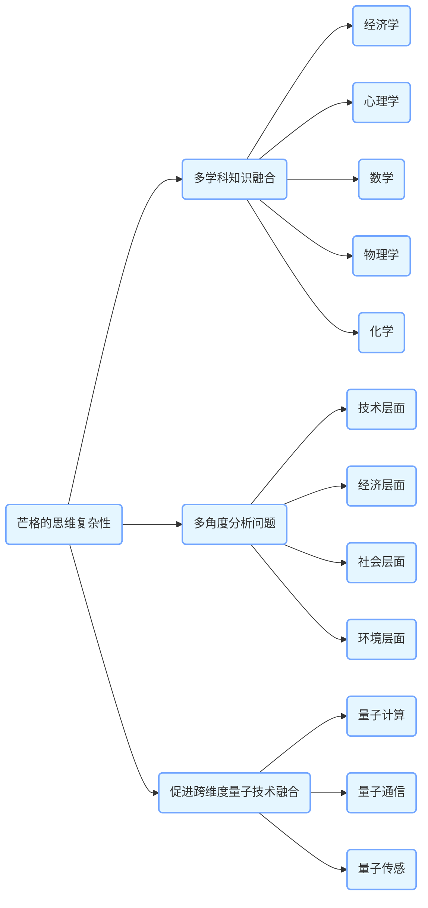

# 芒格的"思维复杂性"在跨维度量子技术融合中的重要性

> 关键词：芒格、思维复杂性、跨维度量子技术融合、多学科思维、技术创新

> 摘要：本文深入探讨了芒格的“思维复杂性”在跨维度量子技术融合中的重要性。首先介绍了相关背景，包括研究目的、预期读者、文档结构和术语表。接着阐述了核心概念，即芒格的思维复杂性和跨维度量子技术融合的原理与联系。详细讲解了核心算法原理和具体操作步骤，运用 Python 代码进行说明，并给出了相关的数学模型和公式。通过项目实战展示了思维复杂性在实际中的应用，分析了代码实现和解读。探讨了跨维度量子技术融合的实际应用场景，推荐了相关的学习资源、开发工具框架和论文著作。最后总结了未来发展趋势与挑战，解答了常见问题并提供了扩展阅读和参考资料。强调了芒格的思维复杂性对于推动跨维度量子技术融合创新的关键作用。

## 1. 背景介绍 
### 1.1 目的和范围
本研究旨在深入剖析芒格的“思维复杂性”在跨维度量子技术融合这一前沿领域的重要性。跨维度量子技术融合是一个充满挑战与机遇的新兴研究方向，涉及量子力学、信息科学、材料科学等多个学科的交叉。而芒格的思维复杂性强调从多个学科和角度去思考问题，这种思维方式对于解决跨维度量子技术融合中的复杂问题具有重要的指导意义。通过本研究，我们希望能够揭示思维复杂性如何促进跨维度量子技术的创新和发展，为相关领域的研究人员和从业者提供有益的思路和方法。

### 1.2 预期读者
本文主要面向对量子技术、跨学科研究以及思维方法感兴趣的专业人士和科研人员，包括量子物理学家、计算机科学家、材料科学家、工程师等。同时，也适合对科技发展趋势和创新思维有探索欲望的普通读者，帮助他们了解跨维度量子技术融合的前沿动态以及思维方式对技术创新的重要影响。

### 1.3 文档结构概述
本文将按照以下结构展开：首先介绍核心概念，阐述芒格的思维复杂性和跨维度量子技术融合的内涵以及它们之间的联系；接着详细讲解核心算法原理和具体操作步骤，通过 Python 代码进行说明；然后给出相关的数学模型和公式，并举例说明；通过项目实战展示思维复杂性在实际中的应用，包括开发环境搭建、源代码实现和代码解读；探讨跨维度量子技术融合的实际应用场景；推荐相关的学习资源、开发工具框架和论文著作；最后总结未来发展趋势与挑战，解答常见问题并提供扩展阅读和参考资料。

### 1.4 术语表
#### 1.4.1 核心术语定义
- **芒格的思维复杂性**：指查理·芒格所倡导的一种思维方式，强调从多个不同的学科和领域获取知识，并将这些知识融会贯通，用于解决复杂的问题。这种思维方式鼓励人们打破学科界限，从多个角度去审视和分析问题。
- **跨维度量子技术融合**：将不同维度（如时间维度、空间维度等）的量子技术进行整合和协同，以实现更强大的功能和性能。例如，将量子计算技术与量子通信技术在不同维度上进行融合，以提高信息处理和传输的效率和安全性。

#### 1.4.2 相关概念解释
- **量子技术**：基于量子力学原理发展起来的一系列技术，包括量子计算、量子通信、量子传感等。这些技术利用量子力学的特性，如量子叠加、量子纠缠等，来实现传统技术无法达到的功能和性能。
- **多学科思维**：跨越不同学科的界限，综合运用多个学科的知识和方法来解决问题的思维方式。在跨维度量子技术融合中，多学科思维尤为重要，因为该领域涉及多个学科的交叉和融合。

#### 1.4.3 缩略词列表
- **QC**：Quantum Computing，量子计算
- **QKD**：Quantum Key Distribution，量子密钥分发
- **QIP**：Quantum Information Processing，量子信息处理

## 2. 核心概念与联系 

### 2.1 芒格的思维复杂性原理
芒格认为，世界是一个复杂的系统，任何单一学科的知识都不足以全面理解和解决现实中的问题。因此，他提倡学习多个学科的重要理论和方法，构建一个多元的思维模型体系。例如，在分析一个商业问题时，不仅要运用经济学的原理，还要考虑心理学、社会学、数学等学科的因素。这种思维方式能够帮助人们从不同的角度去看待问题，发现问题的本质和潜在的解决方案。

### 2.2 跨维度量子技术融合原理
跨维度量子技术融合的核心在于利用量子力学的特性，将不同维度的量子技术进行整合。在量子世界中，量子系统具有独特的性质，如量子叠加和量子纠缠。通过在不同维度上对这些量子系统进行操作和控制，可以实现更高效的信息处理、更安全的通信和更精确的传感。例如，在时间维度上，可以利用量子态的演化来实现量子计算的加速；在空间维度上，可以利用量子纠缠来实现远距离的量子通信。

### 2.3 两者之间的联系
芒格的思维复杂性与跨维度量子技术融合之间存在着紧密的联系。跨维度量子技术融合是一个高度复杂的问题，涉及多个学科和领域的知识。芒格的思维复杂性能够为解决这个问题提供有效的方法和思路。通过运用多学科的知识和思维方式，研究人员可以更好地理解跨维度量子技术融合的原理和机制，发现新的研究方向和解决方案。例如，在量子技术的材料研究中，不仅需要运用物理学的知识，还需要考虑化学、材料科学等学科的因素。芒格的思维复杂性能够帮助研究人员打破学科界限，综合运用多学科的知识来解决材料选择和制备的问题。

### 2.4 文本示意图
```plaintext
芒格的思维复杂性
|
|--多学科知识融合
|   |--经济学
|   |--心理学
|   |--数学
|   |--物理学
|   |--化学
|   |--...
|
|--多角度分析问题
|   |--技术层面
|   |--经济层面
|   |--社会层面
|   |--环境层面
|   |--...
|
|--促进跨维度量子技术融合
    |--量子计算
    |--量子通信
    |--量子传感
    |--...
```

### 2.5 Mermaid 流程图


## 3. 核心算法原理 & 具体操作步骤 

### 3.1 核心算法原理
在跨维度量子技术融合中，一个重要的算法是量子态的操控和演化算法。量子态可以用波函数来描述，波函数的演化遵循薛定谔方程。在实际应用中，我们通常需要对量子态进行测量和操作，以实现特定的功能。例如，在量子计算中，我们需要通过对量子比特的操作来实现逻辑门的运算。

### 3.2 Python 代码实现
以下是一个简单的 Python 代码示例，用于模拟量子比特的操作和测量。我们使用 Qiskit 库来实现这个示例。

```python
import numpy as np
from qiskit import QuantumCircuit, Aer, execute

# 创建一个量子电路，包含 1 个量子比特和 1 个经典比特
qc = QuantumCircuit(1, 1)

# 对量子比特应用 Hadamard 门，将其置于叠加态
qc.h(0)

# 对量子比特进行测量，并将结果存储到经典比特中
qc.measure(0, 0)

# 使用 Aer 模拟器运行量子电路
backend = Aer.get_backend('qasm_simulator')
job = execute(qc, backend, shots=1000)
result = job.result()

# 获取测量结果
counts = result.get_counts(qc)
print("测量结果:", counts)
```

### 3.3 代码解释
1. **导入必要的库**：导入 `numpy` 用于数值计算，`QuantumCircuit` 用于创建量子电路，`Aer` 用于选择模拟器，`execute` 用于执行量子电路。
2. **创建量子电路**：创建一个包含 1 个量子比特和 1 个经典比特的量子电路。
3. **应用 Hadamard 门**：对量子比特应用 Hadamard 门，将其置于叠加态。Hadamard 门是一个常用的量子门，它可以将基态 $|0\rangle$ 转换为 $\frac{1}{\sqrt{2}}(|0\rangle + |1\rangle)$。
4. **测量量子比特**：对量子比特进行测量，并将结果存储到经典比特中。
5. **运行量子电路**：使用 Aer 模拟器运行量子电路，并设置测量次数为 1000 次。
6. **获取测量结果**：获取测量结果并打印出来。

### 3.4 具体操作步骤
1. **安装 Qiskit 库**：可以使用 `pip install qiskit` 命令来安装 Qiskit 库。
2. **编写代码**：按照上述代码示例编写量子电路的代码。
3. **运行代码**：在 Python 环境中运行代码，观察测量结果。

## 4. 数学模型和公式 & 详细讲解 & 举例说明 

### 4.1 量子态的表示
量子态可以用波函数 $\psi$ 来表示。对于一个单量子比特系统，其波函数可以表示为：

$$
|\psi\rangle = \alpha|0\rangle + \beta|1\rangle
$$

其中，$\alpha$ 和 $\beta$ 是复数，满足 $|\alpha|^2 + |\beta|^2 = 1$。$|0\rangle$ 和 $|1\rangle$ 是量子比特的基态。

### 4.2 量子门的矩阵表示
量子门可以用矩阵来表示。例如，Hadamard 门的矩阵表示为：

$$
H = \frac{1}{\sqrt{2}}\begin{bmatrix}
1 & 1 \\
1 & -1
\end{bmatrix}
$$

当对量子态 $|\psi\rangle$ 应用 Hadamard 门时，新的量子态 $|\psi'\rangle$ 可以通过矩阵乘法得到：

$$
|\psi'\rangle = H|\psi\rangle
$$

### 4.3 举例说明
假设初始量子态为 $|0\rangle$，即 $\alpha = 1$，$\beta = 0$。将其表示为向量形式：

$$
|0\rangle = \begin{bmatrix}
1 \\
0
\end{bmatrix}
$$

应用 Hadamard 门：

$$
|\psi'\rangle = H|0\rangle = \frac{1}{\sqrt{2}}\begin{bmatrix}
1 & 1 \\
1 & -1
\end{bmatrix}\begin{bmatrix}
1 \\
0
\end{bmatrix} = \frac{1}{\sqrt{2}}\begin{bmatrix}
1 \\
1
\end{bmatrix} = \frac{1}{\sqrt{2}}(|0\rangle + |1\rangle)
$$

这表明，初始态 $|0\rangle$ 经过 Hadamard 门后，变成了叠加态 $\frac{1}{\sqrt{2}}(|0\rangle + |1\rangle)$。

### 4.4 测量概率
在测量量子态时，得到基态 $|0\rangle$ 的概率为 $|\alpha|^2$，得到基态 $|1\rangle$ 的概率为 $|\beta|^2$。对于上述叠加态 $\frac{1}{\sqrt{2}}(|0\rangle + |1\rangle)$，测量得到 $|0\rangle$ 和 $|1\rangle$ 的概率均为 $\frac{1}{2}$。

### 4.5 多量子比特系统
对于多量子比特系统，其量子态可以用张量积来表示。例如，对于一个两量子比特系统，其量子态可以表示为：

$$
|\psi\rangle = \sum_{i,j=0}^{1} c_{ij}|i\rangle|j\rangle
$$

其中，$c_{ij}$ 是复数，满足 $\sum_{i,j=0}^{1} |c_{ij}|^2 = 1$。多量子比特系统的量子门也可以用矩阵来表示，通过张量积和矩阵乘法来实现对量子态的操作。

## 5. 项目实战：代码实际案例和详细解释说明 

### 5.1  开发环境搭建
#### 5.1.1 安装 Python
首先，需要安装 Python 环境。可以从 Python 官方网站（https://www.python.org/downloads/）下载适合自己操作系统的 Python 安装包，并按照安装向导进行安装。建议安装 Python 3.7 及以上版本。

#### 5.1.2 安装 Qiskit 库
Qiskit 是一个用于量子计算的开源框架，我们可以使用 `pip` 命令来安装 Qiskit：

```sh
pip install qiskit
```

#### 5.1.3 安装 Jupyter Notebook（可选）
Jupyter Notebook 是一个交互式的开发环境，非常适合进行量子计算的实验和演示。可以使用以下命令安装 Jupyter Notebook：

```sh
pip install jupyter
```

安装完成后，可以使用以下命令启动 Jupyter Notebook：

```sh
jupyter notebook
```

### 5.2  源代码详细实现和代码解读
#### 5.2.1 实现量子纠缠态
以下是一个实现两量子比特纠缠态的 Python 代码示例：

```python
from qiskit import QuantumCircuit, Aer, execute
import matplotlib.pyplot as plt

# 创建一个包含 2 个量子比特和 2 个经典比特的量子电路
qc = QuantumCircuit(2, 2)

# 对第一个量子比特应用 Hadamard 门
qc.h(0)

# 对第一个和第二个量子比特应用 CNOT 门
qc.cx(0, 1)

# 对两个量子比特进行测量
qc.measure([0, 1], [0, 1])

# 使用 Aer 模拟器运行量子电路
backend = Aer.get_backend('qasm_simulator')
job = execute(qc, backend, shots=1000)
result = job.result()

# 获取测量结果
counts = result.get_counts(qc)

# 绘制测量结果的直方图
from qiskit.visualization import plot_histogram
plot_histogram(counts).show()
```

#### 5.2.2 代码解读
1. **导入必要的库**：导入 `QuantumCircuit` 用于创建量子电路，`Aer` 用于选择模拟器，`execute` 用于执行量子电路，`matplotlib.pyplot` 用于绘制直方图。
2. **创建量子电路**：创建一个包含 2 个量子比特和 2 个经典比特的量子电路。
3. **应用 Hadamard 门**：对第一个量子比特应用 Hadamard 门，将其置于叠加态。
4. **应用 CNOT 门**：对第一个和第二个量子比特应用 CNOT 门，实现量子纠缠。CNOT 门是一个条件门，当控制比特为 $|1\rangle$ 时，目标比特会发生翻转。
5. **测量量子比特**：对两个量子比特进行测量，并将结果存储到经典比特中。
6. **运行量子电路**：使用 Aer 模拟器运行量子电路，并设置测量次数为 1000 次。
7. **获取测量结果**：获取测量结果并绘制直方图，直观地展示测量结果的分布。

### 5.3  代码解读与分析
#### 5.3.1 量子纠缠态的原理
在上述代码中，通过应用 Hadamard 门和 CNOT 门，我们实现了两量子比特的纠缠态。初始时，两个量子比特都处于基态 $|00\rangle$。经过 Hadamard 门后，第一个量子比特处于叠加态 $\frac{1}{\sqrt{2}}(|0\rangle + |1\rangle)$。然后，应用 CNOT 门，当第一个量子比特为 $|1\rangle$ 时，第二个量子比特会发生翻转。最终的量子态为：

$$
|\psi\rangle = \frac{1}{\sqrt{2}}(|00\rangle + |11\rangle)
$$

这是一个典型的纠缠态，即两个量子比特的状态是相互关联的。测量其中一个量子比特的状态，会立即确定另一个量子比特的状态。

#### 5.3.2 测量结果分析
在测量纠缠态时，我们只能得到两种可能的结果：$|00\rangle$ 或 $|11\rangle$。这是因为纠缠态的特性决定了两个量子比特的状态是相互关联的。在上述代码中，我们进行了 1000 次测量，测量结果的直方图应该主要集中在 $|00\rangle$ 和 $|11\rangle$ 两个状态上。

## 6. 实际应用场景 
### 6.1 量子通信
在量子通信中，跨维度量子技术融合可以提高通信的安全性和效率。例如，利用量子纠缠态可以实现量子密钥分发（QKD），确保通信双方之间的密钥传输是绝对安全的。通过在不同维度上对量子态进行操作和控制，可以增加密钥的生成速率和传输距离。同时，结合量子隐形传态技术，可以实现远距离的量子信息传输，为未来的全球量子通信网络奠定基础。

### 6.2 量子计算
跨维度量子技术融合对于量子计算的发展具有重要意义。在量子计算中，需要解决量子比特的退相干问题和提高量子门的操作精度。通过在不同维度上对量子系统进行调控，可以有效地抑制量子比特的退相干，提高量子计算的稳定性和可靠性。例如，利用时间维度上的量子态演化，可以实现量子纠错码的编码和解码，从而提高量子计算的容错能力。

### 6.3 量子传感
量子传感是利用量子系统的特性来实现高精度的测量。跨维度量子技术融合可以提高量子传感的灵敏度和分辨率。例如，在空间维度上，利用量子纠缠态可以实现多通道的量子传感，同时测量多个物理量。在时间维度上，通过对量子态的精确控制，可以实现对微弱信号的快速检测和测量。

### 6.4 量子模拟
量子模拟是利用量子系统来模拟其他量子系统的行为。跨维度量子技术融合可以扩展量子模拟的能力和范围。例如，在不同维度上对量子系统进行模拟，可以研究复杂的量子多体问题，如高温超导、量子相变等。通过结合量子计算和量子传感技术，可以实现对量子模拟结果的精确测量和验证。

## 7. 工具和资源推荐
### 7.1 学习资源推荐
#### 7.1.1 书籍推荐
- 《量子计算与量子信息》（Quantum Computation and Quantum Information）：这本书是量子计算领域的经典教材，由 Michael A. Nielsen 和 Isaac L. Chuang 所著。它全面介绍了量子计算和量子信息的基本原理、算法和应用。
- 《查理·芒格的智慧：投资的格栅理论》（Poor Charlie's Almanack: The Wit and Wisdom of Charles T. Munger）：这本书汇集了查理·芒格的演讲和文章，深入阐述了他的思维方式和投资哲学，对于理解芒格的思维复杂性非常有帮助。

#### 7.1.2 在线课程
- Coursera 上的“量子计算基础”（Fundamentals of Quantum Computation）课程：该课程由加州理工学院的教授授课，系统地介绍了量子计算的基本概念、算法和实验技术。
- edX 上的“量子信息科学与技术”（Quantum Information Science and Technology）课程：该课程涵盖了量子信息的各个方面，包括量子比特、量子门、量子算法等。

#### 7.1.3 技术博客和网站
- Qiskit 官方博客（https://qiskit.org/blog/）：Qiskit 是一个用于量子计算的开源框架，其官方博客提供了最新的量子计算研究成果、技术教程和应用案例。
- Quantum Computing Report（https://www.quantumcomputingreport.com/）：该网站专注于量子计算领域的新闻和分析，提供了全球量子计算产业的最新动态和发展趋势。

### 7.2 开发工具框架推荐
#### 7.2.1 IDE和编辑器
- PyCharm：一款功能强大的 Python 集成开发环境，支持代码编辑、调试、版本控制等功能，非常适合开发量子计算相关的 Python 代码。
- Jupyter Notebook：一个交互式的开发环境，支持 Python、R 等多种编程语言，非常适合进行量子计算的实验和演示。

#### 7.2.2 调试和性能分析工具
- Qiskit Aer：Qiskit 提供的一个模拟器，支持多种模拟模式，可以用于调试和验证量子电路的正确性。
- TensorFlow Quantum：一个用于量子机器学习的开源框架，提供了丰富的工具和接口，用于开发和优化量子机器学习模型。

#### 7.2.3 相关框架和库
- Qiskit：一个用于量子计算的开源框架，提供了丰富的工具和接口，用于创建、模拟和运行量子电路。
- Cirq：Google 开发的一个用于量子计算的开源框架，支持多种量子硬件平台，具有高效的模拟和编译能力。

### 7.3 相关论文著作推荐
#### 7.3.1 经典论文
- “Quantum Computation and Shor's Factoring Algorithm”：这篇论文介绍了 Shor 算法，该算法是量子计算领域的一个重要突破，能够在多项式时间内分解大整数，对传统密码学构成了威胁。
- “Teleporting an Unknown Quantum State via Dual Classical and Einstein-Podolsky-Rosen Channels”：这篇论文提出了量子隐形传态的概念和实现方案，为量子通信的发展奠定了基础。

#### 7.3.2 最新研究成果
- 关注《Nature》、《Science》、《Physical Review Letters》等顶级学术期刊，这些期刊经常发表量子技术领域的最新研究成果。
- 参加国际量子计算会议（如 IEEE International Conference on Quantum Computing and Engineering），了解最新的研究动态和技术趋势。

#### 7.3.3 应用案例分析
- 研究 IBM、Google、Microsoft 等科技公司在量子技术领域的应用案例，了解他们如何将量子技术应用于实际问题的解决。
- 关注量子技术初创公司的发展，了解他们在量子通信、量子计算、量子传感等领域的创新应用。

## 8. 总结：未来发展趋势与挑战
### 8.1 未来发展趋势
#### 8.1.1 跨学科融合加深
未来，跨维度量子技术融合将与更多的学科进行深度融合，如生物学、医学、材料科学等。例如，在生物学领域，量子技术可以用于研究生物分子的结构和功能，为药物研发和疾病诊断提供新的方法和手段。在医学领域，量子传感技术可以实现对生物体内微小信号的高精度检测，为早期疾病诊断和治疗提供支持。

#### 8.1.2 量子技术实用化加速
随着技术的不断进步，量子技术将逐渐从实验室走向实际应用。未来，量子通信、量子计算、量子传感等技术将在金融、通信、能源、交通等领域得到广泛应用。例如，量子通信可以保障金融交易的安全，量子计算可以加速药物研发和材料设计，量子传感可以提高能源勘探和环境监测的精度。

#### 8.1.3 量子生态系统逐步完善
未来，将形成一个完整的量子生态系统，包括量子硬件制造商、量子软件开发商、量子服务提供商等。量子硬件制造商将不断提高量子比特的数量和质量，量子软件开发商将开发更多的量子算法和应用程序，量子服务提供商将为用户提供量子计算、量子通信等服务。

### 8.2 挑战
#### 8.2.1 技术难题
目前，跨维度量子技术融合还面临着许多技术难题，如量子比特的退相干、量子门的操作精度、量子纠错等。这些问题需要科学家们不断地进行研究和探索，寻找有效的解决方案。

#### 8.2.2 人才短缺
量子技术是一个高度专业化的领域，需要具备深厚的物理学、数学和计算机科学知识的专业人才。目前，全球范围内量子技术领域的人才短缺问题较为严重，需要加强人才培养和引进。

#### 8.2.3 成本高昂
量子技术的研发和应用需要大量的资金投入，包括设备购置、实验场地建设、人员培训等。目前，量子技术的成本仍然较高，限制了其大规模的应用和推广。

## 9. 附录：常见问题与解答
### 9.1 什么是芒格的思维复杂性？
芒格的思维复杂性强调从多个不同的学科和领域获取知识，并将这些知识融会贯通，用于解决复杂的问题。这种思维方式鼓励人们打破学科界限，从多个角度去审视和分析问题。

### 9.2 跨维度量子技术融合有哪些应用场景？
跨维度量子技术融合的应用场景包括量子通信、量子计算、量子传感、量子模拟等。在量子通信中，可以提高通信的安全性和效率；在量子计算中，可以解决复杂的计算问题；在量子传感中，可以实现高精度的测量；在量子模拟中，可以研究复杂的量子多体问题。

### 9.3 如何学习跨维度量子技术融合？
可以通过阅读相关的书籍、参加在线课程、关注技术博客和网站等方式来学习跨维度量子技术融合。同时，还可以进行实际的项目实践，使用开源的量子计算框架进行实验和开发。

### 9.4 量子技术的发展面临哪些挑战？
量子技术的发展面临着技术难题、人才短缺和成本高昂等挑战。需要科学家们不断地进行研究和探索，加强人才培养和引进，降低技术成本，推动量子技术的发展和应用。

## 10. 扩展阅读 & 参考资料
### 10.1 扩展阅读
- 《量子比特与量子纠缠》：深入介绍了量子比特和量子纠缠的基本概念和应用。
- 《跨学科研究方法与实践》：介绍了跨学科研究的方法和实践经验，对于理解跨维度量子技术融合的跨学科性质有帮助。

### 10.2 参考资料
- Nielsen, M. A., & Chuang, I. L. (2000). Quantum Computation and Quantum Information. Cambridge University Press.
- Munger, C. T. (2005). Poor Charlie's Almanack: The Wit and Wisdom of Charles T. Munger. Donning Company Publishers.
- Qiskit Documentation: https://qiskit.org/documentation/
- Cirq Documentation: https://quantumai.google/cirq