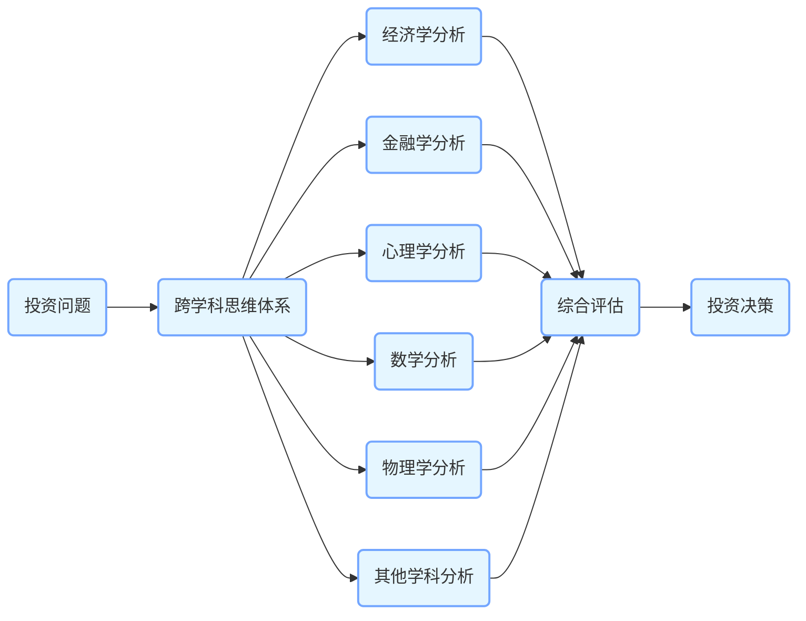

# 芒格的"思维格栅"：构建全面的投资分析框架

> 关键词：芒格、思维格栅、投资分析框架、跨学科思维、投资决策

> 摘要：本文深入探讨了芒格的“思维格栅”理论及其在构建全面投资分析框架中的应用。首先介绍了“思维格栅”理论的背景和重要性，接着阐述了其核心概念与联系，包括跨学科思维的原理和架构。通过详细讲解核心算法原理和具体操作步骤，结合数学模型和公式进行举例说明，帮助读者理解如何运用这一理论进行投资分析。随后通过项目实战展示了如何在实际中应用“思维格栅”理论构建投资分析框架，并分析了其在不同实际应用场景中的作用。同时推荐了相关的学习资源、开发工具框架和论文著作，最后总结了未来发展趋势与挑战，还设置了常见问题解答和扩展阅读参考资料，旨在为投资者提供一个全面且深入的关于“思维格栅”理论的知识体系，助力投资者构建更全面、科学的投资分析框架。

## 1. 背景介绍 
### 1.1 目的和范围
本文章的目的在于深入剖析芒格的“思维格栅”理论，并详细阐述如何运用这一理论构建全面的投资分析框架。范围涵盖了“思维格栅”理论的起源、核心概念、算法原理、数学模型，以及在实际投资项目中的应用和相关工具资源推荐等多个方面。通过全面系统的讲解，帮助投资者理解并掌握运用跨学科思维进行投资分析的方法，提升投资决策的科学性和准确性。

### 1.2 预期读者
本文预期读者主要包括对投资领域感兴趣的人士，如专业投资者、投资爱好者、金融从业者等。同时，对于希望提升自身思维方式和决策能力的人群，以及对跨学科知识应用有探索欲望的学习者也具有一定的参考价值。

### 1.3 文档结构概述
本文首先介绍“思维格栅”理论的背景知识，包括目的、预期读者和文档结构概述等内容。接着阐述其核心概念与联系，通过文本示意图和 Mermaid 流程图展示跨学科思维的原理和架构。然后详细讲解核心算法原理和具体操作步骤，结合数学模型和公式进行举例说明。之后通过项目实战展示如何在实际中应用“思维格栅”理论构建投资分析框架，并分析其在不同实际应用场景中的作用。再推荐相关的学习资源、开发工具框架和论文著作。最后总结未来发展趋势与挑战，设置常见问题解答和扩展阅读参考资料。

### 1.4 术语表
#### 1.4.1 核心术语定义
- **思维格栅**：芒格提出的一种投资思维方式，强调将不同学科的知识和思维方式相互交织，形成一个类似格栅的思维体系，用于全面、深入地分析投资问题。
- **跨学科思维**：打破学科界限，综合运用多个学科的理论、方法和工具来解决问题的思维方式。
- **投资分析框架**：一套系统的方法和流程，用于对投资项目进行全面评估和分析，以做出合理的投资决策。

#### 1.4.2 相关概念解释
- **学科知识**：不同学科领域所包含的专业知识，如经济学、金融学、心理学、数学、物理学等。
- **投资决策**：投资者根据对投资项目的分析和评估，做出是否投资以及如何投资的决定。

#### 1.4.3 缩略词列表
本文中无缩略词。

## 2. 核心概念与联系 
### 核心概念原理
芒格的“思维格栅”理论基于这样一个理念：现实世界中的问题往往是复杂的，单一学科的知识和思维方式难以全面、深入地理解和解决这些问题。因此，投资者需要构建一个跨学科的思维体系，将不同学科的知识和思维方式相互融合，形成一个类似格栅的结构。

在这个思维格栅中，每一个学科的知识和思维方式都可以看作是格栅的一根横杆或纵杆。不同学科的知识和思维方式相互交织、相互影响，共同构成了一个有机的整体。通过运用这个思维格栅，投资者可以从多个角度、多个层面来分析投资问题，从而做出更加全面、准确的投资决策。

例如，在分析一家企业的投资价值时，投资者不仅需要运用经济学和金融学的知识来评估企业的财务状况和市场前景，还需要运用心理学的知识来了解企业管理层的决策行为和投资者的情绪变化，运用数学的知识来进行数据分析和模型构建，运用物理学的知识来理解企业所处的行业竞争环境和技术发展趋势等。

### 架构的文本示意图
```plaintext
|-------------------|
|  经济学知识      |
|-------------------|
|  金融学知识      |
|-------------------|
|  心理学知识      |
|-------------------|
|  数学知识        |
|-------------------|
|  物理学知识      |
|-------------------|
|  其他学科知识    |
|-------------------|
```
这个示意图表示了“思维格栅”的基本架构，不同学科的知识相互叠加，形成一个多层次的结构。

### Mermaid 流程图

这个流程图展示了运用“思维格栅”理论进行投资分析的过程。首先面对一个投资问题，然后运用跨学科思维体系，从不同学科的角度进行分析，最后将各个学科的分析结果进行综合评估，从而做出投资决策。

## 3. 核心算法原理 & 具体操作步骤 
### 核心算法原理
“思维格栅”理论的核心算法原理可以概括为以下几个步骤：
1. **知识获取**：广泛学习不同学科的知识，包括但不限于经济学、金融学、心理学、数学、物理学等。
2. **知识整合**：将不同学科的知识进行整合，形成一个有机的知识体系。在整合过程中，需要寻找不同学科知识之间的联系和共性，以便更好地相互应用和补充。
3. **问题分析**：当面对一个投资问题时，运用整合后的知识体系，从多个学科的角度进行分析。每个学科的分析可以看作是一个独立的模块，通过对各个模块的分析结果进行综合，得到对投资问题的全面认识。
4. **决策制定**：根据对投资问题的全面认识，制定合理的投资决策。在决策过程中，需要综合考虑各个学科的分析结果，权衡利弊，做出最优选择。

### 具体操作步骤
以下是运用 Python 代码实现一个简单的“思维格栅”投资分析框架的示例：

```python
# 定义不同学科的分析函数

# 经济学分析函数
def economic_analysis(company_data):
    # 这里简单假设通过分析公司的财务数据来评估其经济状况
    revenue = company_data.get('revenue', 0)
    profit = company_data.get('profit', 0)
    if revenue > 0 and profit > 0:
        return '经济状况良好'
    else:
        return '经济状况不佳'

# 金融学分析函数
def financial_analysis(company_data):
    # 这里简单假设通过分析公司的资产负债表来评估其财务风险
    assets = company_data.get('assets', 0)
    liabilities = company_data.get('liabilities', 0)
    if assets > liabilities:
        return '财务风险较低'
    else:
        return '财务风险较高'

# 心理学分析函数
def psychological_analysis(company_data):
    # 这里简单假设通过分析公司管理层的决策风格来评估其心理因素
    management_style = company_data.get('management_style', '保守')
    if management_style == '激进':
        return '管理层决策风格激进，有较高风险'
    else:
        return '管理层决策风格保守，风险相对较低'

# 数学分析函数
def mathematical_analysis(company_data):
    # 这里简单假设通过计算公司的增长率来评估其发展潜力
    revenue_growth_rate = company_data.get('revenue_growth_rate', 0)
    if revenue_growth_rate > 0.1:
        return '发展潜力较大'
    else:
        return '发展潜力较小'

# 综合分析函数
def comprehensive_analysis(company_data):
    economic_result = economic_analysis(company_data)
    financial_result = financial_analysis(company_data)
    psychological_result = psychological_analysis(company_data)
    mathematical_result = mathematical_analysis(company_data)

    analysis_results = {
        '经济学分析': economic_result,
        '金融学分析': financial_result,
        '心理学分析': psychological_result,
        '数学分析': mathematical_result
    }

    return analysis_results

# 示例公司数据
company_data = {
    'revenue': 1000000,
    'profit': 100000,
    'assets': 500000,
    'liabilities': 300000,
    'management_style': '保守',
    'revenue_growth_rate': 0.15
}

# 进行综合分析
results = comprehensive_analysis(company_data)
for key, value in results.items():
    print(f'{key}: {value}')
```

### 代码解释
1. **知识获取**：在代码中，我们通过定义不同学科的分析函数来模拟获取不同学科的知识和分析方法。每个分析函数代表一个学科的分析视角。
2. **知识整合**：通过综合分析函数 `comprehensive_analysis` 将不同学科的分析函数整合在一起，形成一个综合的分析框架。
3. **问题分析**：将示例公司数据作为输入，调用综合分析函数，得到各个学科的分析结果。
4. **决策制定**：在这个示例中，我们只是输出了各个学科的分析结果，实际应用中，投资者可以根据这些结果综合考虑，做出投资决策。

## 4. 数学模型和公式 & 详细讲解 & 举例说明 
### 数学模型和公式
在投资分析中，数学模型和公式可以帮助我们更准确地评估投资项目的价值和风险。以下是一些常见的数学模型和公式：

#### 1. 净现值（NPV）公式
净现值是指投资项目在未来各期现金流量的现值之和减去初始投资的现值。其公式为：
$$NPV = \sum_{t=0}^{n} \frac{CF_t}{(1 + r)^t} - I_0$$
其中，$NPV$ 表示净现值，$CF_t$ 表示第 $t$ 期的现金流量，$r$ 表示折现率，$I_0$ 表示初始投资，$n$ 表示投资项目的期限。

#### 2. 内部收益率（IRR）公式
内部收益率是指使投资项目的净现值等于零的折现率。其公式为：
$$\sum_{t=0}^{n} \frac{CF_t}{(1 + IRR)^t} - I_0 = 0$$
其中，$IRR$ 表示内部收益率，其他参数含义与净现值公式相同。

#### 3. 夏普比率（Sharpe Ratio）公式
夏普比率是指投资组合的预期收益率与无风险收益率之差除以投资组合的标准差。其公式为：
$$Sharpe Ratio = \frac{E(R_p) - R_f}{\sigma_p}$$
其中，$Sharpe Ratio$ 表示夏普比率，$E(R_p)$ 表示投资组合的预期收益率，$R_f$ 表示无风险收益率，$\sigma_p$ 表示投资组合的标准差。

### 详细讲解
- **净现值（NPV）**：净现值是一种常用的投资决策指标，它考虑了资金的时间价值。如果净现值大于零，则说明投资项目的收益大于成本，项目可行；如果净现值小于零，则说明投资项目的收益小于成本，项目不可行。
- **内部收益率（IRR）**：内部收益率反映了投资项目的实际收益率。如果内部收益率大于折现率，则说明投资项目的收益大于成本，项目可行；如果内部收益率小于折现率，则说明投资项目的收益小于成本，项目不可行。
- **夏普比率（Sharpe Ratio）**：夏普比率反映了投资组合的风险调整后收益。夏普比率越高，说明投资组合在承担相同风险的情况下，获得的收益越高。

### 举例说明
假设一个投资项目的初始投资为 $1000$ 元，未来三年的现金流量分别为 $300$ 元、$400$ 元、$500$ 元，折现率为 $10\%$。

#### 计算净现值（NPV）
$$NPV = \frac{300}{(1 + 0.1)^1} + \frac{400}{(1 + 0.1)^2} + \frac{500}{(1 + 0.1)^3} - 1000$$
$$NPV = \frac{300}{1.1} + \frac{400}{1.21} + \frac{500}{1.331} - 1000$$
$$NPV \approx 272.73 + 330.58 + 375.66 - 1000$$
$$NPV \approx -21.03$$

由于净现值小于零，说明该投资项目的收益小于成本，项目不可行。

#### 计算内部收益率（IRR）
使用 Python 代码计算内部收益率：
```python
import numpy as np

cash_flows = [-1000, 300, 400, 500]
irr = np.irr(cash_flows)
print(f'内部收益率: {irr * 100:.2f}%')
```
运行代码后，得到内部收益率约为 $8.66\%$。由于内部收益率小于折现率 $10\%$，说明该投资项目的收益小于成本，项目不可行。

#### 计算夏普比率（Sharpe Ratio）
假设投资组合的预期收益率为 $15\%$，无风险收益率为 $5\%$，投资组合的标准差为 $20\%$。
$$Sharpe Ratio = \frac{0.15 - 0.05}{0.2} = 0.5$$
夏普比率为 $0.5$，说明该投资组合在承担一定风险的情况下，获得了一定的收益。

## 5. 项目实战：代码实际案例和详细解释说明 
### 5.1  开发环境搭建
在进行“思维格栅”投资分析框架的项目实战时，我们可以使用 Python 作为开发语言。以下是搭建开发环境的步骤：

1. **安装 Python**：从 Python 官方网站（https://www.python.org/downloads/）下载并安装 Python 3.x 版本。
2. **安装开发工具**：推荐使用 PyCharm 或 Visual Studio Code 作为开发工具。可以从官方网站下载并安装相应的开发工具。
3. **安装必要的库**：在项目中，我们可能需要使用一些 Python 库，如 `numpy`、`pandas` 等。可以使用以下命令安装这些库：
```sh
pip install numpy pandas
```

### 5.2  源代码详细实现和代码解读
以下是一个更完整的“思维格栅”投资分析框架的源代码示例：

```python
import numpy as np
import pandas as pd

# 定义不同学科的分析函数

# 经济学分析函数
def economic_analysis(company_data):
    revenue = company_data.get('revenue', 0)
    profit = company_data.get('profit', 0)
    if revenue > 0 and profit > 0:
        economic_score = 80
    elif revenue > 0 and profit <= 0:
        economic_score = 60
    else:
        economic_score = 40
    return economic_score

# 金融学分析函数
def financial_analysis(company_data):
    assets = company_data.get('assets', 0)
    liabilities = company_data.get('liabilities', 0)
    debt_ratio = liabilities / assets if assets > 0 else 1
    if debt_ratio < 0.5:
        financial_score = 80
    elif debt_ratio < 0.8:
        financial_score = 60
    else:
        financial_score = 40
    return financial_score

# 心理学分析函数
def psychological_analysis(company_data):
    management_style = company_data.get('management_style', '保守')
    if management_style == '激进':
        psychological_score = 40
    elif management_style == '稳健':
        psychological_score = 60
    else:
        psychological_score = 80
    return psychological_score

# 数学分析函数
def mathematical_analysis(company_data):
    revenue_growth_rate = company_data.get('revenue_growth_rate', 0)
    if revenue_growth_rate > 0.2:
        mathematical_score = 80
    elif revenue_growth_rate > 0.1:
        mathematical_score = 60
    else:
        mathematical_score = 40
    return mathematical_score

# 综合分析函数
def comprehensive_analysis(company_data):
    economic_score = economic_analysis(company_data)
    financial_score = financial_analysis(company_data)
    psychological_score = psychological_analysis(company_data)
    mathematical_score = mathematical_analysis(company_data)

    total_score = (economic_score + financial_score + psychological_score + mathematical_score) / 4
    analysis_results = {
        '经济学得分': economic_score,
        '金融学得分': financial_score,
        '心理学得分': psychological_score,
        '数学得分': mathematical_score,
        '综合得分': total_score
    }

    if total_score >= 80:
        investment_decision = '强烈推荐投资'
    elif total_score >= 60:
        investment_decision = '可以考虑投资'
    else:
        investment_decision = '不建议投资'

    analysis_results['投资决策'] = investment_decision
    return analysis_results

# 示例公司数据
company_data = {
    'revenue': 1000000,
    'profit': 100000,
    'assets': 500000,
    'liabilities': 300000,
    'management_style': '保守',
    'revenue_growth_rate': 0.15
}

# 进行综合分析
results = comprehensive_analysis(company_data)
for key, value in results.items():
    print(f'{key}: {value}')
```

### 5.3  代码解读与分析
1. **知识获取**：通过定义不同学科的分析函数，如 `economic_analysis`、`financial_analysis`、`psychological_analysis` 和 `mathematical_analysis`，获取不同学科的知识和分析方法。每个分析函数根据相应学科的原理和指标，对公司数据进行分析，并给出一个得分。
2. **知识整合**：在综合分析函数 `comprehensive_analysis` 中，将各个学科的分析结果进行整合，计算出综合得分。同时，根据综合得分给出投资决策建议。
3. **问题分析**：将示例公司数据作为输入，调用综合分析函数，得到各个学科的得分、综合得分和投资决策建议。
4. **决策制定**：根据综合得分，判断是否建议投资。如果综合得分大于等于 80，则强烈推荐投资；如果综合得分大于等于 60，则可以考虑投资；如果综合得分小于 60，则不建议投资。

## 6. 实际应用场景 
### 股票投资
在股票投资中，运用“思维格栅”理论可以帮助投资者更全面地分析上市公司的投资价值。投资者可以从经济学的角度分析公司的行业地位、市场份额和盈利能力；从金融学的角度分析公司的财务状况、估值水平和风险特征；从心理学的角度分析公司管理层的决策行为和投资者的情绪变化；从数学的角度分析公司的财务数据和业绩增长趋势；从其他学科的角度分析公司所处的政策环境、技术发展趋势等。通过综合运用这些学科的知识和方法，投资者可以更准确地评估股票的投资价值，做出更合理的投资决策。

### 基金投资
在基金投资中，“思维格栅”理论同样具有重要的应用价值。投资者可以从经济学的角度分析宏观经济形势和市场趋势，选择适合的基金类型；从金融学的角度分析基金的投资策略、业绩表现和风险水平；从心理学的角度分析基金经理的投资风格和决策行为；从数学的角度分析基金的收益指标和风险指标；从其他学科的角度分析基金公司的管理水平和信誉度等。通过综合考虑这些因素，投资者可以选择更优质的基金产品，提高投资收益。

### 房地产投资
在房地产投资中，运用“思维格栅”理论可以帮助投资者更全面地评估房地产项目的投资价值。投资者可以从经济学的角度分析房地产市场的供求关系、价格走势和宏观经济环境；从金融学的角度分析房地产项目的融资成本、租金收益率和投资回报率；从心理学的角度分析购房者和投资者的心理需求和行为偏好；从数学的角度分析房地产项目的成本效益和风险评估；从其他学科的角度分析房地产项目的地理位置、环境质量和政策法规等。通过综合运用这些学科的知识和方法，投资者可以做出更明智的房地产投资决策。

### 企业并购投资
在企业并购投资中，“思维格栅”理论可以为投资者提供全面的分析视角。投资者可以从经济学的角度分析并购双方的行业竞争力、市场协同效应和经济合理性；从金融学的角度分析并购的估值模型、融资安排和财务风险；从心理学的角度分析并购双方管理层的文化差异和整合难度；从数学的角度分析并购的成本效益和财务预测；从其他学科的角度分析并购的法律合规性、社会影响等。通过综合考虑这些因素，投资者可以更好地评估企业并购的可行性和风险，提高并购投资的成功率。

## 7. 工具和资源推荐
### 7.1 学习资源推荐
#### 7.1.1 书籍推荐
- 《穷查理宝典：查理·芒格的智慧箴言录》：这是一本全面介绍芒格思想和投资理念的书籍，书中详细阐述了芒格的“思维格栅”理论和跨学科思维方法，是学习“思维格栅”理论的必读之书。
- 《经济学原理》（曼昆著）：经典的经济学教材，系统介绍了经济学的基本原理和方法，对于理解经济现象和进行经济分析具有重要的指导作用。
- 《金融学》（博迪、莫顿著）：全面介绍了金融学的基本理论和实践，包括金融市场、投资组合、风险管理等内容，是学习金融学的优秀教材。
- 《思考，快与慢》（丹尼尔·卡尼曼著）：介绍了人类思维的两种模式——快思考和慢思考，以及它们在决策过程中的作用，对于理解心理学在投资决策中的应用具有重要的启示作用。
- 《数学之美》（吴军著）：用通俗易懂的语言介绍了数学在信息科学、互联网等领域的应用，展示了数学的魅力和威力，有助于培养数学思维和运用数学方法解决实际问题的能力。

#### 7.1.2 在线课程
- Coursera 平台上的“经济学原理”课程：由知名教授授课，系统讲解经济学的基本原理和方法。
- edX 平台上的“金融学基础”课程：介绍金融学的基本概念和理论，包括金融市场、投资决策等内容。
- 网易云课堂上的“投资心理学”课程：探讨心理学在投资决策中的应用，帮助投资者了解自己和他人的心理行为，避免投资中的心理误区。
- 中国大学 MOOC 上的“高等数学”课程：系统学习高等数学的知识和方法，为运用数学模型进行投资分析打下基础。

#### 7.1.3 技术博客和网站
- 雪球网：专注于投资领域的社区平台，提供股票、基金等投资产品的分析和讨论，投资者可以在这里交流投资经验和分享投资见解。
- 华尔街见闻：提供全球金融市场的实时资讯和深度分析，帮助投资者了解市场动态和宏观经济形势。
- 知乎：一个知识分享平台，有很多关于投资、经济学、金融学等领域的问题和回答，可以从中获取不同的观点和思路。
- 量化投资与机器学习微信公众号：专注于量化投资和机器学习在投资领域的应用，分享相关的技术文章和案例。

### 7.2 开发工具框架推荐
#### 7.2.1 IDE和编辑器
- PyCharm：专业的 Python 集成开发环境，具有代码编辑、调试、自动补全、代码分析等功能，适合开发 Python 投资分析程序。
- Visual Studio Code：轻量级的代码编辑器，支持多种编程语言，通过安装插件可以实现 Python 开发的各种功能，如代码调试、版本控制等。

#### 7.2.2 调试和性能分析工具
- `pdb`：Python 自带的调试工具，可以帮助开发者在代码运行过程中进行调试，查看变量的值和程序的执行流程。
- `cProfile`：Python 自带的性能分析工具，可以分析代码的运行时间和函数调用次数，帮助开发者找出性能瓶颈。
- `Py-Spy`：一个轻量级的 Python 性能分析工具，可以在不修改代码的情况下对 Python 程序进行性能分析，实时查看函数的执行时间和调用次数。

#### 7.2.3 相关框架和库
- `numpy`：Python 的数值计算库，提供了高效的数组和矩阵运算功能，在投资分析中可以用于数据处理和数学计算。
- `pandas`：Python 的数据处理库，提供了 DataFrame 和 Series 等数据结构，方便进行数据清洗、分析和可视化。
- `scikit-learn`：Python 的机器学习库，提供了各种机器学习算法和工具，如分类、回归、聚类等，可以用于投资预测和风险评估。
- `matplotlib`：Python 的绘图库，用于数据可视化，可以将投资分析结果以图表的形式展示出来，方便用户理解和分析。

### 7.3 相关论文著作推荐
#### 7.3.1 经典论文
- Markowitz, H. M. (1952). Portfolio Selection. The Journal of Finance, 7(1), 77 - 91. 该论文提出了现代投资组合理论，为投资组合的优化和风险管理提供了理论基础。
- Fama, E. F., & French, K. R. (1992). The Cross - Section of Expected Stock Returns. The Journal of Finance, 47(2), 427 - 465. 这篇论文提出了三因子模型，对股票的预期收益率进行了更深入的分析和解释。

#### 7.3.2 最新研究成果
- 关注顶级金融学术期刊，如 The Journal of Finance、The Review of Financial Studies 等，这些期刊上发表的最新研究成果反映了投资领域的前沿动态和研究方向。

#### 7.3.3 应用案例分析
- 可以参考一些知名投资机构的研究报告和案例分析，如巴菲特的伯克希尔·哈撒韦公司的年报，从中学习他们的投资策略和分析方法。

## 8. 总结：未来发展趋势与挑战
### 未来发展趋势
1. **跨学科融合加深**：随着投资环境的日益复杂和多元化，“思维格栅”理论所强调的跨学科思维将得到更广泛的应用和发展。不同学科之间的融合将更加深入，不仅局限于传统的经济学、金融学、心理学等学科，还将涉及到人工智能、大数据、区块链等新兴技术领域。例如，运用人工智能和大数据技术可以更高效地获取和分析投资相关的数据，为投资决策提供更准确的依据；区块链技术可以提高投资交易的透明度和安全性。
2. **智能化投资分析**：人工智能和机器学习技术的不断发展将推动投资分析向智能化方向发展。基于“思维格栅”理论的投资分析框架可以结合人工智能算法，实现自动化的投资分析和决策。例如，通过机器学习算法对历史数据进行学习和分析，预测市场趋势和投资机会；利用自然语言处理技术对新闻、公告等文本信息进行分析，挖掘潜在的投资价值。
3. **个性化投资服务**：随着投资者需求的不断多样化，未来的投资服务将更加注重个性化。基于“思维格栅”理论的投资分析框架可以根据投资者的风险偏好、投资目标、资产状况等因素，为投资者提供个性化的投资建议和方案。例如，为风险偏好较高的投资者推荐具有较高收益潜力的投资产品，为风险偏好较低的投资者推荐稳健型的投资产品。

### 挑战
1. **知识获取和整合难度大**：“思维格栅”理论要求投资者具备广泛的跨学科知识，然而不同学科的知识体系复杂多样，知识的获取和整合需要花费大量的时间和精力。此外，如何将不同学科的知识有机地融合在一起，形成一个有效的分析框架，也是一个具有挑战性的问题。
2. **数据质量和隐私问题**：在智能化投资分析过程中，需要大量的数据支持。然而，数据的质量和隐私问题是一个不容忽视的挑战。数据质量不高可能导致分析结果不准确，而数据隐私问题则可能涉及到法律和道德风险。如何确保数据的质量和安全性，是未来需要解决的重要问题。
3. **市场不确定性增加**：投资市场充满了不确定性，宏观经济环境、政策法规、突发事件等因素都可能对市场产生重大影响。即使运用了“思维格栅”理论进行全面的投资分析，也难以完全准确地预测市场的变化。因此，如何应对市场的不确定性，降低投资风险，是投资者面临的长期挑战。

## 9. 附录：常见问题与解答
### 问题 1：“思维格栅”理论适用于所有类型的投资吗？
解答：“思维格栅”理论具有广泛的适用性，可以应用于股票、基金、房地产、企业并购等多种类型的投资。然而，不同类型的投资具有不同的特点和风险，在应用“思维格栅”理论时，需要根据具体的投资类型和情况，选择合适的学科知识和分析方法。

### 问题 2：如何快速学习和掌握不同学科的知识？
解答：学习不同学科的知识需要耐心和时间。可以通过阅读相关的书籍、参加在线课程、关注专业的技术博客和网站等方式来获取知识。同时，可以结合实际的投资案例进行学习和分析，加深对知识的理解和应用。此外，还可以与其他投资者和专业人士进行交流和讨论，分享学习经验和见解。

### 问题 3：在运用“思维格栅”理论进行投资分析时，如何确定各个学科的权重？
解答：确定各个学科的权重没有固定的标准，需要根据具体的投资情况和投资者的经验来判断。一般来说，可以根据投资项目的特点和风险，对不同学科的分析结果进行综合考虑。例如，对于一些受宏观经济环境影响较大的投资项目，可以适当提高经济学和金融学的权重；对于一些受管理层决策影响较大的投资项目，可以适当提高心理学的权重。

### 问题 4：“思维格栅”理论与传统的投资分析方法有什么区别？
解答：传统的投资分析方法往往侧重于单一学科的知识和方法，如经济学、金融学等。而“思维格栅”理论强调跨学科思维，综合运用多个学科的知识和方法来进行投资分析。相比传统的投资分析方法，“思维格栅”理论可以从更全面、更深入的角度来理解和分析投资问题，从而做出更合理的投资决策。

## 10. 扩展阅读 & 参考资料
### 扩展阅读
- 《黑天鹅：如何应对不可预知的未来》（纳西姆·尼古拉斯·塔勒布著）：探讨了不确定性和稀有事件对投资和决策的影响，与“思维格栅”理论中应对市场不确定性的理念相关。
- 《创新者的窘境》（克莱顿·克里斯坦森著）：分析了创新和变革对企业和投资的影响，从不同角度为投资分析提供了思考。
- 《人类简史：从动物到上帝》（尤瓦尔·赫拉利著）：从宏观的历史和人类发展的角度，为理解经济、社会和投资环境提供了更广阔的视野。

### 参考资料
- 查理·芒格的演讲和著作，如《穷查理宝典：查理·芒格的智慧箴言录》。
- 相关的学术期刊文章，如 The Journal of Finance、The Review of Financial Studies 等。
- 知名投资机构的研究报告和案例分析，如伯克希尔·哈撒韦公司的年报。
- 在线课程平台上的相关课程资料，如 Coursera、edX、网易云课堂、中国大学 MOOC 等。