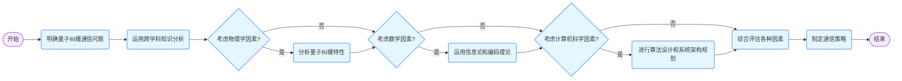

# 芒格的"清晰思考"方法在量子纠缠通信策略制定中的运用

> 关键词：芒格、清晰思考方法、量子纠缠通信、策略制定、跨学科思维

> 摘要：本文探讨了芒格的“清晰思考”方法在量子纠缠通信策略制定中的应用。首先介绍了研究的背景、目的、预期读者和文档结构，对相关术语进行了定义。接着阐述了“清晰思考”方法和量子纠缠通信的核心概念及联系，分析了其原理并给出了相应的流程图。详细讲解了在策略制定中可运用的核心算法原理，用Python代码进行了说明，同时给出了相关的数学模型和公式。通过项目实战案例，展示了如何在实际中运用这些方法和原理。还探讨了该方法在量子纠缠通信中的实际应用场景，推荐了学习、开发所需的工具和资源。最后总结了未来发展趋势与挑战，解答了常见问题，并提供了扩展阅读和参考资料。

## 1. 背景介绍 
### 1.1 目的和范围
本研究旨在探索如何将芒格的“清晰思考”方法应用于量子纠缠通信策略的制定过程中。量子纠缠通信作为前沿的通信技术，面临着诸多技术和策略上的挑战。而芒格的“清晰思考”方法以其跨学科、理性分析的特点，为解决复杂问题提供了独特的视角。通过本研究，我们希望找到有效的方法，将这两种看似不同领域的理念相结合，从而优化量子纠缠通信的策略制定，提高通信的效率、可靠性和安全性。研究范围涵盖了从理论概念的介绍到实际应用案例的分析，涉及量子纠缠通信的基本原理、“清晰思考”方法的核心要素、策略制定的算法和数学模型，以及实际项目中的具体操作和应用场景等方面。

### 1.2 预期读者
本文的预期读者包括从事量子通信领域的科研人员、工程师，他们可以从本文中获得新的策略制定思路，为实际工作提供参考；对跨学科研究感兴趣的学者，能够看到不同领域知识的融合应用；以及对量子技术和思维方法有学习需求的学生和爱好者，帮助他们深入理解相关概念和方法。

### 1.3 文档结构概述
本文将按照以下结构进行阐述：首先介绍核心概念，包括芒格的“清晰思考”方法和量子纠缠通信的基本原理，并分析它们之间的联系；接着讲解在策略制定中可运用的核心算法原理和具体操作步骤，用Python代码进行详细说明；然后给出相关的数学模型和公式，并举例说明其应用；通过项目实战案例，展示如何在实际中运用这些方法和原理；探讨该方法在量子纠缠通信中的实际应用场景；推荐学习、开发所需的工具和资源；最后总结未来发展趋势与挑战，解答常见问题，并提供扩展阅读和参考资料。

### 1.4 术语表
#### 1.4.1 核心术语定义
- **芒格的“清晰思考”方法**：由查理·芒格提出的一种思考方式，强调运用多学科知识，从不同角度分析问题，避免思维定式，以达到更全面、准确的决策。
- **量子纠缠**：是量子力学中的一种现象，指两个或多个量子系统之间存在一种特殊的关联，使得一个系统的状态变化会瞬间影响到其他系统的状态，无论它们之间的距离有多远。
- **量子纠缠通信**：利用量子纠缠现象进行信息传输的通信方式，具有高度的安全性和潜在的高速传输能力。
- **策略制定**：为实现特定目标而制定一系列行动方案和决策的过程。

#### 1.4.2 相关概念解释
- **跨学科思维**：“清晰思考”方法的重要组成部分，意味着综合运用多个学科的知识和方法来解决问题。在量子纠缠通信策略制定中，可能涉及物理学、数学、计算机科学、信息论等多个学科的知识。
- **量子态**：描述量子系统状态的物理量，量子纠缠通信中信息的传输和处理都与量子态的变化密切相关。
- **通信协议**：为了实现有效的通信，通信双方需要遵循的一系列规则和约定。在量子纠缠通信中，通信协议的设计需要考虑量子力学的特性。

#### 1.4.3 缩略词列表
- **QKD**：Quantum Key Distribution，量子密钥分发，是量子纠缠通信中的一项重要技术，用于安全地分发加密密钥。
- **qubit**：Quantum bit，量子比特，是量子信息的基本单位，类似于经典计算机中的比特。

## 2. 核心概念与联系 
### 2.1 芒格的“清晰思考”方法原理
芒格的“清晰思考”方法强调从多个学科的角度去看待问题。他认为，世界上的各种现象和问题往往不是单一学科所能解释和解决的，因此需要掌握多个学科的核心知识和思维方式。例如，在分析一个复杂的问题时，不仅要运用数学的逻辑推理，还要考虑心理学中的人性因素、经济学中的成本效益原则等。这种跨学科的思维方式可以帮助我们避免片面和狭隘的思考，从而更全面、深入地理解问题。

### 2.2 量子纠缠通信原理
量子纠缠通信基于量子纠缠现象。当两个或多个粒子处于纠缠态时，它们的量子态是相互关联的。例如，两个纠缠的量子比特，一个量子比特的状态发生变化，另一个量子比特的状态会瞬间发生相应的变化，无论它们之间的距离有多远。利用这种特性，可以实现信息的高速、安全传输。在量子密钥分发（QKD）中，通过纠缠粒子的测量结果来生成和分发加密密钥，由于量子力学的特性，任何对密钥的窃听都会被发现，从而保证了通信的安全性。

### 2.3 两者的联系
在量子纠缠通信策略制定中，芒格的“清晰思考”方法可以发挥重要作用。量子纠缠通信涉及到复杂的物理原理、数学模型和工程实现，仅从单一学科的角度很难制定出最优的策略。运用“清晰思考”方法，我们可以综合考虑物理学中量子纠缠的特性、数学中信息论和编码理论、计算机科学中算法设计和系统架构等多个方面的知识。例如，在设计量子通信协议时，需要考虑物理层面上量子态的制备和测量，数学层面上的信息编码和纠错，以及工程层面上的系统稳定性和可靠性。通过跨学科的思考，可以更全面地评估各种因素，制定出更合理、更有效的通信策略。

### 2.4 文本示意图
```plaintext
芒格的“清晰思考”方法
|--跨学科知识运用
|   |--物理学知识
|   |   |--量子力学原理
|   |   |--量子纠缠特性
|   |--数学知识
|   |   |--信息论
|   |   |--编码理论
|   |--计算机科学知识
|   |   |--算法设计
|   |   |--系统架构
|--理性分析和决策
|   |--全面评估各种因素
|   |--避免思维定式
|   |--制定最优策略

量子纠缠通信
|--量子纠缠现象
|   |--粒子间的量子关联
|   |--量子态的瞬间变化
|--信息传输
|   |--利用纠缠态传输信息
|   |--量子密钥分发
|--通信协议设计
|   |--考虑量子特性的规则
|   |--保证通信安全和效率

两者联系
|--在策略制定中结合
|   |--运用跨学科知识分析量子通信问题
|   |--制定更合理有效的通信策略
```

### 2.5 Mermaid 流程图


## 3. 核心算法原理 & 具体操作步骤 
### 3.1 核心算法原理
在量子纠缠通信策略制定中，一个重要的算法是量子密钥分发算法。以BB84协议为例，它是最早提出的量子密钥分发协议之一。其基本原理是利用光子的偏振态来表示量子比特，通过随机选择不同的基（如水平 - 垂直基和对角基）来编码信息。通信双方（Alice和Bob）通过交换光子并进行测量，然后比较部分测量结果来检测是否存在窃听。如果没有窃听，他们就可以利用剩余的测量结果生成共享的密钥。

### 3.2 Python 代码实现
```python
import random

# 定义光子的偏振态
H = 0  # 水平偏振
V = 1  # 垂直偏振
D = 2  # 正对角偏振
A = 3  # 反对角偏振

# 定义基
X = [H, V]
Z = [D, A]

# Alice 生成随机比特序列和基序列
def alice_generate_bits_and_bases(length):
    bits = [random.randint(0, 1) for _ in range(length)]
    bases = [random.choice([X, Z]) for _ in range(length)]
    return bits, bases

# 根据比特和基生成光子偏振态
def alice_encode(bits, bases):
    photons = []
    for bit, base in zip(bits, bases):
        if base == X:
            if bit == 0:
                photons.append(H)
            else:
                photons.append(V)
        else:
            if bit == 0:
                photons.append(D)
            else:
                photons.append(A)
    return photons

# Bob 随机选择基进行测量
def bob_measure(photons):
    bases = [random.choice([X, Z]) for _ in range(len(photons))]
    bits = []
    for photon, base in zip(photons, bases):
        if base == X:
            if photon in [H, V]:
                if photon == H:
                    bits.append(0)
                else:
                    bits.append(1)
            else:
                # 如果光子偏振态与基不匹配，随机测量结果
                bits.append(random.randint(0, 1))
        else:
            if photon in [D, A]:
                if photon == D:
                    bits.append(0)
                else:
                    bits.append(1)
            else:
                bits.append(random.randint(0, 1))
    return bits, bases

# Alice 和 Bob 比较基序列，保留相同基对应的比特
def sift_bits(alice_bits, alice_bases, bob_bits, bob_bases):
    sifted_alice_bits = []
    sifted_bob_bits = []
    for i in range(len(alice_bits)):
        if alice_bases[i] == bob_bases[i]:
            sifted_alice_bits.append(alice_bits[i])
            sifted_bob_bits.append(bob_bits[i])
    return sifted_alice_bits, sifted_bob_bits

# 检测是否存在窃听
def check_for_eavesdropping(sifted_alice_bits, sifted_bob_bits, check_length):
    if len(sifted_alice_bits) < check_length:
        return False
    check_alice_bits = sifted_alice_bits[:check_length]
    check_bob_bits = sifted_bob_bits[:check_length]
    for bit1, bit2 in zip(check_alice_bits, check_bob_bits):
        if bit1!= bit2:
            return True
    return False

# 主函数
def main():
    length = 100
    alice_bits, alice_bases = alice_generate_bits_and_bases(length)
    photons = alice_encode(alice_bits, alice_bases)
    bob_bits, bob_bases = bob_measure(photons)
    sifted_alice_bits, sifted_bob_bits = sift_bits(alice_bits, alice_bases, bob_bits, bob_bases)
    check_length = 10
    eavesdropping_detected = check_for_eavesdropping(sifted_alice_bits, sifted_bob_bits, check_length)
    if eavesdropping_detected:
        print("检测到窃听！")
    else:
        final_key_alice = sifted_alice_bits[check_length:]
        final_key_bob = sifted_bob_bits[check_length:]
        print("密钥生成成功！")
        print("Alice 的密钥:", final_key_alice)
        print("Bob 的密钥:", final_key_bob)

if __name__ == "__main__":
    main()
```

### 3.3 具体操作步骤
1. **生成随机比特序列和基序列**：Alice 随机生成一个比特序列和一个基序列，用于编码信息。
2. **编码光子偏振态**：根据比特序列和基序列，Alice 将信息编码到光子的偏振态中，并发送给 Bob。
3. **Bob 测量光子**：Bob 随机选择基对收到的光子进行测量，得到自己的比特序列。
4. **基比较和比特筛选**：Alice 和 Bob 公开比较他们选择的基序列，只保留基相同的比特，得到筛选后的比特序列。
5. **窃听检测**：Alice 和 Bob 公开比较部分筛选后的比特，如果存在差异，则说明可能存在窃听。
6. **生成最终密钥**：如果没有检测到窃听，Alice 和 Bob 利用剩余的筛选后的比特生成共享的密钥。

## 4. 数学模型和公式 & 详细讲解 & 举例说明 
### 4.1 量子比特的数学表示
在量子力学中，量子比特（qubit）可以用二维希尔伯特空间中的向量来表示。一个量子比特的一般状态可以表示为：
$$|\psi\rangle = \alpha|0\rangle + \beta|1\rangle$$
其中，$|0\rangle$ 和 $|1\rangle$ 是基态，$\alpha$ 和 $\beta$ 是复数，满足归一化条件 $|\alpha|^2 + |\beta|^2 = 1$。$|\alpha|^2$ 表示测量量子比特得到 $|0\rangle$ 状态的概率，$|\beta|^2$ 表示测量得到 $|1\rangle$ 状态的概率。

### 4.2 BB84 协议的数学分析
在 BB84 协议中，假设 Alice 发送的量子比特处于 $|0\rangle$ 或 $|1\rangle$ 状态（在 $X$ 基下），或者处于 $|+\rangle = \frac{1}{\sqrt{2}}(|0\rangle + |1\rangle)$ 或 $|-\rangle = \frac{1}{\sqrt{2}}(|0\rangle - |1\rangle)$ 状态（在 $Z$ 基下）。

当 Bob 在正确的基下测量时，测量结果与 Alice 发送的比特一致。例如，如果 Alice 发送 $|0\rangle$，Bob 在 $X$ 基下测量，得到 $|0\rangle$ 的概率为 1。如果 Bob 在错误的基下测量，测量结果是随机的。例如，如果 Alice 发送 $|0\rangle$，Bob 在 $Z$ 基下测量，得到 $|+\rangle$ 或 $|-\rangle$ 的概率各为 $\frac{1}{2}$。

假设存在窃听者 Eve，她在信道中对光子进行测量。如果 Eve 在错误的基下测量，会引入干扰，导致 Bob 的测量结果与 Alice 发送的比特不一致。设 Eve 测量的错误率为 $p$，则在没有窃听时，Bob 和 Alice 筛选后的比特一致的概率为 1；在有窃听时，Bob 和 Alice 筛选后的比特一致的概率为 $1 - p$。

### 4.3 举例说明
假设 Alice 发送的量子比特序列为 $|0\rangle, |1\rangle, |+\rangle, |-\rangle$，对应的基序列为 $X, X, Z, Z$。Bob 的测量基序列为 $X, Z, X, Z$。

- 对于第一个量子比特 $|0\rangle$，Bob 在 $X$ 基下测量，得到 $|0\rangle$，测量结果正确。
- 对于第二个量子比特 $|1\rangle$，Bob 在 $Z$ 基下测量，测量结果是随机的，假设得到 $|+\rangle$，测量结果错误。
- 对于第三个量子比特 $|+\rangle$，Bob 在 $X$ 基下测量，测量结果是随机的，假设得到 $|0\rangle$，测量结果错误。
- 对于第四个量子比特 $|-\rangle$，Bob 在 $Z$ 基下测量，得到 $|-\rangle$，测量结果正确。

然后 Alice 和 Bob 比较基序列，只保留基相同的比特（这里是第一个和第四个），得到筛选后的比特序列。通过比较部分筛选后的比特，可以检测是否存在窃听。

## 5. 项目实战：代码实际案例和详细解释说明 
### 5.1  开发环境搭建
为了运行上述的量子密钥分发代码，需要搭建以下开发环境：
- **Python 环境**：建议使用 Python 3.6 及以上版本。可以从 Python 官方网站（https://www.python.org/downloads/）下载并安装。
- **开发工具**：可以使用任何文本编辑器或集成开发环境（IDE），如 PyCharm、VS Code 等。这里以 VS Code 为例，下载并安装 VS Code（https://code.visualstudio.com/），然后安装 Python 扩展。

### 5.2  源代码详细实现和代码解读
```python
import random

# 定义光子的偏振态
H = 0  # 水平偏振
V = 1  # 垂直偏振
D = 2  # 正对角偏振
A = 3  # 反对角偏振

# 定义基
X = [H, V]
Z = [D, A]

# Alice 生成随机比特序列和基序列
def alice_generate_bits_and_bases(length):
    bits = [random.randint(0, 1) for _ in range(length)]
    bases = [random.choice([X, Z]) for _ in range(length)]
    return bits, bases

# 根据比特和基生成光子偏振态
def alice_encode(bits, bases):
    photons = []
    for bit, base in zip(bits, bases):
        if base == X:
            if bit == 0:
                photons.append(H)
            else:
                photons.append(V)
        else:
            if bit == 0:
                photons.append(D)
            else:
                photons.append(A)
    return photons

# Bob 随机选择基进行测量
def bob_measure(photons):
    bases = [random.choice([X, Z]) for _ in range(len(photons))]
    bits = []
    for photon, base in zip(photons, bases):
        if base == X:
            if photon in [H, V]:
                if photon == H:
                    bits.append(0)
                else:
                    bits.append(1)
            else:
                # 如果光子偏振态与基不匹配，随机测量结果
                bits.append(random.randint(0, 1))
        else:
            if photon in [D, A]:
                if photon == D:
                    bits.append(0)
                else:
                    bits.append(1)
            else:
                bits.append(random.randint(0, 1))
    return bits, bases

# Alice 和 Bob 比较基序列，保留相同基对应的比特
def sift_bits(alice_bits, alice_bases, bob_bits, bob_bases):
    sifted_alice_bits = []
    sifted_bob_bits = []
    for i in range(len(alice_bits)):
        if alice_bases[i] == bob_bases[i]:
            sifted_alice_bits.append(alice_bits[i])
            sifted_bob_bits.append(bob_bits[i])
    return sifted_alice_bits, sifted_bob_bits

# 检测是否存在窃听
def check_for_eavesdropping(sifted_alice_bits, sifted_bob_bits, check_length):
    if len(sifted_alice_bits) < check_length:
        return False
    check_alice_bits = sifted_alice_bits[:check_length]
    check_bob_bits = sifted_bob_bits[:check_length]
    for bit1, bit2 in zip(check_alice_bits, check_bob_bits):
        if bit1!= bit2:
            return True
    return False

# 主函数
def main():
    length = 100
    alice_bits, alice_bases = alice_generate_bits_and_bases(length)
    photons = alice_encode(alice_bits, alice_bases)
    bob_bits, bob_bases = bob_measure(photons)
    sifted_alice_bits, sifted_bob_bits = sift_bits(alice_bits, alice_bases, bob_bits, bob_bases)
    check_length = 10
    eavesdropping_detected = check_for_eavesdropping(sifted_alice_bits, sifted_bob_bits, check_length)
    if eavesdropping_detected:
        print("检测到窃听！")
    else:
        final_key_alice = sifted_alice_bits[check_length:]
        final_key_bob = sifted_bob_bits[check_length:]
        print("密钥生成成功！")
        print("Alice 的密钥:", final_key_alice)
        print("Bob 的密钥:", final_key_bob)

if __name__ == "__main__":
    main()
```

### 5.3  代码解读与分析
- **导入模块**：`import random` 用于生成随机数，在代码中用于随机生成比特序列和基序列。
- **定义偏振态和基**：定义了光子的四种偏振态 `H`、`V`、`D`、`A`，以及两种基 `X` 和 `Z`。
- **Alice 生成比特和基序列**：`alice_generate_bits_and_bases` 函数随机生成指定长度的比特序列和基序列。
- **Alice 编码光子**：`alice_encode` 函数根据比特序列和基序列生成光子的偏振态。
- **Bob 测量光子**：`bob_measure` 函数随机选择基对光子进行测量，得到自己的比特序列。如果测量基与光子偏振态不匹配，测量结果是随机的。
- **比特筛选**：`sift_bits` 函数比较 Alice 和 Bob 的基序列，只保留基相同的比特。
- **窃听检测**：`check_for_eavesdropping` 函数比较部分筛选后的比特，如果存在差异，则说明可能存在窃听。
- **主函数**：`main` 函数调用上述函数完成整个量子密钥分发过程，并输出结果。

## 6. 实际应用场景 
### 6.1 军事通信
在军事领域，通信的安全性至关重要。量子纠缠通信的高度安全性可以为军事指挥、情报传递等提供可靠的保障。利用芒格的“清晰思考”方法，可以综合考虑军事战略、物理特性、工程实现等多方面因素，制定出适合军事通信需求的策略。例如，在设计量子通信网络时，需要考虑战场环境的复杂性、通信节点的分布、抗干扰能力等因素。

### 6.2 金融交易
金融交易涉及大量的敏感信息，如客户账户信息、交易数据等。量子纠缠通信可以确保这些信息在传输过程中的安全性，防止信息泄露和篡改。通过运用“清晰思考”方法，在制定金融量子通信策略时，可以考虑金融市场的实时性要求、交易规模、成本效益等因素，优化通信协议和系统架构，提高金融交易的安全性和效率。

### 6.3 政府机密通信
政府部门处理大量的机密信息，如国家安全情报、政策制定等。量子纠缠通信的安全性可以满足政府机密通信的严格要求。运用“清晰思考”方法，可以从政策法规、技术可行性、人员培训等多个角度出发，制定出全面、有效的通信策略，保障政府机密信息的安全传输。

### 6.4 科研合作
在科研领域，不同地区的科研团队之间需要进行大量的数据共享和交流。量子纠缠通信可以提供高速、安全的通信通道，促进科研合作的开展。通过“清晰思考”方法，在制定科研量子通信策略时，可以考虑科研项目的特点、数据类型、合作模式等因素，优化通信方案，提高科研合作的效率和质量。

## 7. 工具和资源推荐
### 7.1 学习资源推荐
#### 7.1.1 书籍推荐
- 《穷查理宝典：查理·芒格的智慧箴言录》：全面介绍了芒格的思想和“清晰思考”方法，是学习芒格思维的经典书籍。
- 《量子力学导论》：深入讲解量子力学的基本原理，对于理解量子纠缠通信的物理基础非常有帮助。
- 《信息论基础》：介绍信息论的基本概念和理论，在量子纠缠通信中信息的编码、传输和处理都离不开信息论的知识。

#### 7.1.2 在线课程
- Coursera 上的“量子计算与量子信息”课程：系统介绍量子计算和量子信息的基础知识，包括量子纠缠、量子比特等概念。
- edX 上的“跨学科思维方法”课程：帮助学习者掌握跨学科思考的技巧和方法，与芒格的“清晰思考”方法相关。

#### 7.1.3 技术博客和网站
- 量子比特（https://www.qbitai.com/）：专注于量子技术领域的资讯和技术文章，提供最新的量子纠缠通信研究动态和技术进展。
- 科学网（https://www.sciencenet.cn/）：涵盖多个学科的科研资讯和学术讨论，在上面可以找到关于量子力学、跨学科研究等方面的文章和观点。

### 7.2 开发工具框架推荐
#### 7.2.1 IDE和编辑器
- PyCharm：功能强大的 Python 集成开发环境，提供代码编辑、调试、代码分析等功能，适合开发量子纠缠通信相关的 Python 代码。
- VS Code：轻量级的代码编辑器，支持多种编程语言，通过安装 Python 扩展可以方便地进行 Python 开发。

#### 7.2.2 调试和性能分析工具
- PDB：Python 自带的调试器，可以帮助开发者定位代码中的问题和错误。
- cProfile：Python 的性能分析工具，可以分析代码的运行时间和函数调用情况，帮助优化代码性能。

#### 7.2.3 相关框架和库
- Qiskit：IBM 开发的开源量子计算框架，提供了量子电路模拟、量子算法实现等功能，可用于量子纠缠通信的模拟和实验。
- Cirq：Google 开发的量子计算框架，支持量子电路的设计和模拟，对于研究量子纠缠通信中的量子态操作有帮助。

### 7.3 相关论文著作推荐
#### 7.3.1 经典论文
- "Quantum Cryptography Based on Bell's Theorem"：首次提出了基于贝尔定理的量子密码学方案，为量子纠缠通信的发展奠定了基础。
- "The BB84 Quantum Key Distribution Protocol"：详细介绍了 BB84 量子密钥分发协议，是量子密钥分发领域的经典论文。

#### 7.3.2 最新研究成果
- 关注 Nature、Science 等顶级学术期刊上关于量子纠缠通信的研究论文，了解该领域的最新技术突破和研究进展。
- 参加国际量子信息科学会议（QIP）、量子计算与通信会议（QCC）等学术会议，获取最新的研究成果和学术动态。

#### 7.3.3 应用案例分析
- 研究国内外量子通信示范项目的相关报告和论文，如中国的墨子号量子卫星通信项目，了解量子纠缠通信在实际应用中的技术方案、挑战和解决方案。

## 8. 总结：未来发展趋势与挑战
### 8.1 未来发展趋势
- **技术融合**：量子纠缠通信将与其他前沿技术，如人工智能、物联网等深度融合。例如，利用人工智能算法优化量子通信协议，提高通信效率和安全性；将量子纠缠通信应用于物联网设备之间的安全通信，保障物联网系统的信息安全。
- **产业化发展**：随着技术的不断成熟，量子纠缠通信将逐渐从实验室走向产业化应用。更多的企业将参与到量子通信产业的发展中，推动量子通信设备的商业化生产和应用，形成完整的产业链。
- **国际合作加强**：量子纠缠通信是一个全球性的研究领域，各国之间将加强合作与交流。共同开展科研项目，共享研究成果，制定国际标准，推动量子纠缠通信技术的全球发展。

### 8.2 挑战
- **技术难题**：目前量子纠缠通信技术还面临着一些技术难题，如量子态的制备和保持、量子比特的退相干、量子通信距离的限制等。需要进一步的研究和创新来解决这些问题，提高量子纠缠通信的性能和可靠性。
- **成本问题**：量子纠缠通信设备的研发和生产成本较高，限制了其大规模应用。需要通过技术创新和产业规模化发展来降低成本，提高量子纠缠通信的性价比。
- **人才短缺**：量子纠缠通信是一个跨学科的领域，需要掌握量子力学、数学、计算机科学等多学科知识的专业人才。目前相关领域的人才短缺，需要加强人才培养和引进，满足行业发展的需求。

## 9. 附录：常见问题与解答
### 9.1 什么是量子纠缠？
量子纠缠是量子力学中的一种现象，指两个或多个量子系统之间存在一种特殊的关联，使得一个系统的状态变化会瞬间影响到其他系统的状态，无论它们之间的距离有多远。例如，两个纠缠的量子比特，一个量子比特的状态发生变化，另一个量子比特的状态会瞬间发生相应的变化。

### 9.2 芒格的“清晰思考”方法如何应用于量子纠缠通信策略制定？
芒格的“清晰思考”方法强调运用多学科知识，从不同角度分析问题。在量子纠缠通信策略制定中，可以综合考虑物理学中量子纠缠的特性、数学中信息论和编码理论、计算机科学中算法设计和系统架构等多个方面的知识。通过跨学科的思考，更全面地评估各种因素，制定出更合理、更有效的通信策略。

### 9.3 量子纠缠通信有哪些优势？
量子纠缠通信具有高度的安全性和潜在的高速传输能力。在安全性方面，基于量子力学的特性，任何对量子通信的窃听都会被发现，从而保证了通信的安全性。在传输速度方面，量子纠缠现象可以实现信息的瞬间传输，具有很大的发展潜力。

### 9.4 量子密钥分发协议有哪些？
常见的量子密钥分发协议有 BB84 协议、E91 协议、BBM92 协议等。BB84 协议是最早提出的量子密钥分发协议之一，利用光子的偏振态来表示量子比特，通过随机选择不同的基来编码信息。E91 协议基于贝尔不等式的违反来检测窃听。BBM92 协议是对 BB84 协议的改进，提高了协议的效率和安全性。

## 10. 扩展阅读 & 参考资料
### 10.1 扩展阅读
- 《从一到无穷大》：这本书以生动有趣的方式介绍了数学、物理、生物等多个学科的知识，有助于培养跨学科思维。
- 《时间简史》：虽然主要介绍宇宙学的知识，但其中涉及到的量子力学和相对论的概念，对于理解量子纠缠通信的物理基础有一定的帮助。

### 10.2 参考资料
- Nielsen, M. A., & Chuang, I. L. (2010). Quantum Computation and Quantum Information. Cambridge University Press.
- Munger, C. T. (2005). Poor Charlie's Almanack: The Wit and Wisdom of Charles T. Munger. Donning Company Publishers.
- Bennett, C. H., & Brassard, G. (1984). Quantum cryptography: Public key distribution and coin tossing. In Proceedings of IEEE International Conference on Computers, Systems, and Signal Processing.

以上文章详细探讨了芒格的“清晰思考”方法在量子纠缠通信策略制定中的运用，从理论到实践，为读者提供了全面的了解和参考。希望通过本文的介绍，能够激发更多人对跨学科研究和量子纠缠通信的兴趣和探索。