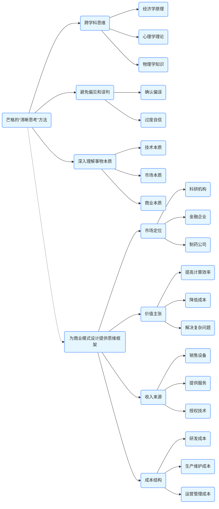

# 芒格的"清晰思考"方法在量子计算商业模式设计中的应用

> 关键词：芒格、清晰思考方法、量子计算、商业模式设计、应用策略

> 摘要：本文聚焦于将芒格的“清晰思考”方法应用于量子计算商业模式设计。首先介绍了背景信息，包括目的范围、预期读者等。接着阐述了核心概念，如“清晰思考”方法和量子计算商业模式的原理及联系，并给出相应示意图和流程图。详细讲解了核心算法原理及操作步骤，结合数学模型和公式进行说明。通过项目实战案例，展示了如何运用该方法进行商业模式设计。探讨了实际应用场景，推荐了相关学习资源、开发工具和论文著作。最后总结了未来发展趋势与挑战，解答常见问题并提供扩展阅读和参考资料，旨在为量子计算商业模式设计提供新的思路和方法。

## 1. 背景介绍 
### 1.1 目的和范围
本研究的主要目的是深入探讨芒格的“清晰思考”方法在量子计算商业模式设计中的具体应用，为量子计算领域的企业和创业者提供一套科学、系统且实用的商业模式设计思路和方法。通过分析“清晰思考”方法的核心原则和量子计算的技术特点及市场需求，探索如何运用该方法来识别商业机会、制定战略、构建盈利模式等。

研究范围涵盖了量子计算商业模式设计的各个关键环节，包括市场定位、价值主张、客户细分、收入来源、成本结构等。同时，也考虑了量子计算技术发展的不同阶段，以及不同应用场景下商业模式的差异。

### 1.2 预期读者
本文的预期读者主要包括量子计算领域的创业者、企业管理者、投资者，以及对商业模式设计和量子计算技术感兴趣的研究人员和学者。创业者可以从本文中获取实用的商业模式设计方法，帮助他们在竞争激烈的市场中找到适合自己的商业路径；企业管理者可以借鉴“清晰思考”方法，优化现有商业模式，提升企业的竞争力和盈利能力；投资者可以通过了解量子计算商业模式的设计原理，更好地评估投资项目的价值和风险；研究人员和学者则可以从理论和实践的结合上深入探讨商业模式设计的创新方法。

### 1.3 文档结构概述
本文共分为十个部分。第一部分是背景介绍，阐述了研究的目的、范围、预期读者和文档结构概述。第二部分介绍核心概念与联系，包括“清晰思考”方法和量子计算商业模式的原理，以及它们之间的关系，并通过示意图和流程图进行展示。第三部分讲解核心算法原理和具体操作步骤，运用Python源代码详细阐述如何运用“清晰思考”方法进行商业模式设计。第四部分介绍数学模型和公式，并进行详细讲解和举例说明。第五部分通过项目实战，展示代码实际案例并进行详细解释说明。第六部分探讨实际应用场景。第七部分推荐相关的学习资源、开发工具和论文著作。第八部分总结未来发展趋势与挑战。第九部分为附录，解答常见问题。第十部分提供扩展阅读和参考资料。

### 1.4 术语表
#### 1.4.1 核心术语定义
- **芒格的“清晰思考”方法**：由查理·芒格提出的一种思考方式，强调运用多学科知识，从不同角度全面、深入地分析问题，避免思维局限和偏见，以达到清晰、准确地认识事物本质的目的。
- **量子计算**：一种基于量子力学原理的新型计算技术，利用量子比特的叠加和纠缠特性进行信息处理，具有远超传统计算机的计算能力。
- **商业模式设计**：企业为了创造价值、传递价值和获取价值而建立的一种逻辑架构和运营方式，包括市场定位、价值主张、客户细分、收入来源、成本结构等要素。

#### 1.4.2 相关概念解释
- **多学科知识**：“清晰思考”方法强调运用多个学科的知识和方法来分析问题，如经济学、心理学、物理学、数学等。不同学科的知识可以提供不同的视角和工具，帮助我们更全面地理解问题。
- **量子比特**：量子计算中的基本信息单位，与传统计算机中的比特不同，量子比特可以同时处于0和1的叠加态，这使得量子计算机能够同时处理多个计算任务，大大提高了计算效率。
- **价值主张**：企业为客户提供的独特价值，是商业模式的核心要素之一。价值主张可以包括产品或服务的功能、质量、价格、便利性等方面的优势。

#### 1.4.3 缩略词列表
- **QC**：Quantum Computing，量子计算
- **BM**：Business Model，商业模式

## 2. 核心概念与联系 

### 2.1 芒格的“清晰思考”方法原理
芒格的“清晰思考”方法基于多学科的知识体系，鼓励人们跳出单一学科的思维框架，综合运用多个学科的原理和方法来分析问题。其核心要点包括：
- **跨学科思维**：将不同学科的知识融合在一起，形成更全面、深入的认知。例如，在分析商业问题时，可以结合经济学的供求原理、心理学的消费者行为理论和物理学的系统论等。
- **避免偏见和误判**：认识到人类思维中存在的各种偏见和局限性，如确认偏误、过度自信等，并通过批判性思维和理性分析来克服这些问题。
- **深入理解事物本质**：不满足于表面现象，而是通过深入研究和分析，揭示事物的内在规律和本质特征。

### 2.2 量子计算商业模式原理
量子计算商业模式的设计需要考虑量子计算技术的特点和市场需求。量子计算的主要优势在于其强大的计算能力，能够解决传统计算机难以处理的复杂问题。因此，量子计算商业模式通常围绕以下几个方面展开：
- **市场定位**：确定目标客户群体，如科研机构、金融企业、制药公司等，了解他们对量子计算的需求和应用场景。
- **价值主张**：强调量子计算为客户带来的独特价值，如提高计算效率、降低成本、解决复杂问题等。
- **收入来源**：可以包括销售量子计算设备、提供量子计算服务、授权量子计算技术等。
- **成本结构**：涉及量子计算设备的研发、生产、维护成本，以及人力资源、运营管理等方面的成本。

### 2.3 两者的联系
芒格的“清晰思考”方法为量子计算商业模式设计提供了一种科学、理性的思维框架。通过运用跨学科思维，我们可以从技术、市场、经济等多个角度全面分析量子计算商业模式的可行性和竞争力。避免偏见和误判可以帮助我们客观地评估量子计算技术的发展前景和市场需求，避免盲目跟风或过度乐观。深入理解事物本质则有助于我们准确把握量子计算商业模式的核心要素，设计出更具创新性和可持续性的商业模式。

### 2.4 文本示意图
```plaintext
芒格的“清晰思考”方法
|--跨学科思维
|   |--经济学原理
|   |--心理学理论
|   |--物理学知识
|--避免偏见和误判
|   |--确认偏误
|   |--过度自信
|--深入理解事物本质
|   |--技术本质
|   |--市场本质
|   |--商业本质

量子计算商业模式设计
|--市场定位
|   |--科研机构
|   |--金融企业
|   |--制药公司
|--价值主张
|   |--提高计算效率
|   |--降低成本
|   |--解决复杂问题
|--收入来源
|   |--销售设备
|   |--提供服务
|   |--授权技术
|--成本结构
|   |--研发成本
|   |--生产维护成本
|   |--运营管理成本

联系：芒格的“清晰思考”方法为量子计算商业模式设计提供思维框架，促进全面、客观、深入的分析。
```

### 2.5 Mermaid流程图


## 3. 核心算法原理 & 具体操作步骤 

### 3.1 核心算法原理
在量子计算商业模式设计中运用芒格的“清晰思考”方法，可以将其核心思想转化为一种算法化的流程。该算法的核心原理是通过多维度的信息收集和分析，结合跨学科知识，逐步构建出一个合理、可行的商业模式。具体步骤如下：
1. **信息收集**：收集量子计算技术的相关信息，包括技术发展现状、未来趋势、应用领域等；同时收集市场信息，如目标客户群体的需求、竞争态势、行业政策等。
2. **跨学科分析**：运用经济学、心理学、物理学等多学科知识对收集到的信息进行分析。例如，从经济学角度分析量子计算的成本效益，从心理学角度研究客户的购买决策因素，从物理学角度理解量子计算的技术原理和局限性。
3. **避免偏见和误判**：在分析过程中，时刻警惕各种思维偏见和误判，如确认偏误、过度自信等。可以通过引入外部专家意见、进行多轮分析等方式来减少偏见的影响。
4. **深入挖掘本质**：通过对信息的深入分析，挖掘量子计算商业模式的核心要素，如市场定位、价值主张、收入来源、成本结构等。
5. **模型构建**：根据挖掘出的核心要素，构建量子计算商业模式的模型，并进行评估和优化。

### 3.2 具体操作步骤及Python代码实现

```python
# 步骤1：信息收集
def collect_information():
    # 模拟收集量子计算技术信息
    technology_info = {
        "current_status": "快速发展，部分应用场景已取得突破",
        "future_trend": "计算能力持续提升，应用领域不断拓展",
        "application_areas": ["科研、金融、制药等"]
    }
    # 模拟收集市场信息
    market_info = {
        "target_customers": ["科研机构", "金融企业", "制药公司"],
        "customer_demands": ["提高计算效率", "解决复杂问题"],
        "competition_status": "竞争激烈，少数企业占据主导地位",
        "industry_policies": "政府支持，鼓励创新"
    }
    return technology_info, market_info

# 步骤2：跨学科分析
def interdisciplinary_analysis(technology_info, market_info):
    # 经济学分析：成本效益分析
    cost_benefit_analysis = {
        "cost": "研发成本高，设备维护成本高",
        "benefit": "潜在收益大，可提高企业竞争力"
    }
    # 心理学分析：客户购买决策因素
    purchase_decision_factors = {
        "factors": ["技术可靠性", "成本效益", "品牌影响力"]
    }
    # 物理学分析：技术原理和局限性
    physics_analysis = {
        "principle": "基于量子力学原理，利用量子比特的叠加和纠缠特性",
        "limitations": "稳定性差，容错率低"
    }
    return cost_benefit_analysis, purchase_decision_factors, physics_analysis

# 步骤3：避免偏见和误判
def avoid_bias_and_misjudgment(analysis_results):
    # 模拟引入外部专家意见
    expert_opinions = {
        "opinion": "要客观评估量子计算的市场前景，避免过度乐观"
    }
    # 对分析结果进行修正
    corrected_results = []
    for result in analysis_results:
        # 这里可以根据专家意见进行具体的修正操作
        corrected_results.append(result)
    return corrected_results

# 步骤4：深入挖掘本质
def dig_essence(corrected_results):
    # 提取核心要素
    market_positioning = ["科研机构", "金融企业"]
    value_proposition = ["提高计算效率", "解决复杂问题"]
    revenue_sources = ["销售设备", "提供服务"]
    cost_structure = ["研发成本", "生产维护成本"]
    return market_positioning, value_proposition, revenue_sources, cost_structure

# 步骤5：模型构建
def build_model(market_positioning, value_proposition, revenue_sources, cost_structure):
    business_model = {
        "market_positioning": market_positioning,
        "value_proposition": value_proposition,
        "revenue_sources": revenue_sources,
        "cost_structure": cost_structure
    }
    return business_model

# 主函数
def main():
    # 步骤1：信息收集
    technology_info, market_info = collect_information()
    # 步骤2：跨学科分析
    cost_benefit_analysis, purchase_decision_factors, physics_analysis = interdisciplinary_analysis(technology_info, market_info)
    analysis_results = [cost_benefit_analysis, purchase_decision_factors, physics_analysis]
    # 步骤3：避免偏见和误判
    corrected_results = avoid_bias_and_misjudgment(analysis_results)
    # 步骤4：深入挖掘本质
    market_positioning, value_proposition, revenue_sources, cost_structure = dig_essence(corrected_results)
    # 步骤5：模型构建
    business_model = build_model(market_positioning, value_proposition, revenue_sources, cost_structure)
    print("量子计算商业模式：", business_model)

if __name__ == "__main__":
    main()
```

### 3.3 代码解释
- `collect_information` 函数：模拟收集量子计算技术和市场的相关信息，返回两个字典分别存储技术信息和市场信息。
- `interdisciplinary_analysis` 函数：对收集到的信息进行跨学科分析，包括经济学、心理学和物理学分析，返回相应的分析结果。
- `avoid_bias_and_misjudgment` 函数：模拟引入外部专家意见，对分析结果进行修正，避免偏见和误判。
- `dig_essence` 函数：从修正后的分析结果中提取量子计算商业模式的核心要素，如市场定位、价值主张、收入来源和成本结构。
- `build_model` 函数：根据提取的核心要素构建量子计算商业模式的模型，返回一个包含商业模式各要素的字典。
- `main` 函数：按照算法步骤依次调用上述函数，最终输出构建好的量子计算商业模式。

## 4. 数学模型和公式 & 详细讲解 & 举例说明 

### 4.1 数学模型
在量子计算商业模式设计中，可以建立一个基于成本效益分析的数学模型。该模型主要考虑量子计算项目的收益和成本，通过计算净现值（NPV）来评估项目的可行性。

### 4.2 公式
净现值（NPV）的计算公式为：

$$NPV = \sum_{t=0}^{n} \frac{CF_t}{(1 + r)^t}$$

其中：
- $NPV$ 表示净现值
- $CF_t$ 表示第 $t$ 期的现金流量（收益减去成本）
- $r$ 表示折现率
- $n$ 表示项目的生命周期

### 4.3 详细讲解
净现值是一种常用的投资决策方法，它考虑了资金的时间价值。通过将未来各期的现金流量折现到当前时刻，我们可以更准确地评估项目的价值。如果 $NPV > 0$，则说明项目在考虑资金时间价值的情况下是盈利的，具有投资价值；如果 $NPV < 0$，则说明项目可能会亏损，不建议投资。

折现率 $r$ 反映了资金的机会成本，即投资者将资金投入该项目而放弃的其他投资机会的预期收益率。通常，折现率可以根据市场利率、项目风险等因素来确定。

### 4.4 举例说明
假设一个量子计算项目的初始投资为 $C_0 = 1000$ 万元，预计在未来 5 年内每年的收益分别为 $R_1 = 200$ 万元，$R_2 = 300$ 万元，$R_3 = 400$ 万元，$R_4 = 500$ 万元，$R_5 = 600$ 万元，每年的运营成本分别为 $C_1 = 100$ 万元，$C_2 = 150$ 万元，$C_3 = 200$ 万元，$C_4 = 250$ 万元，$C_5 = 300$ 万元，折现率 $r = 10\%$。

首先，计算每年的现金流量 $CF_t$：
- $CF_0 = -C_0 = -1000$ 万元
- $CF_1 = R_1 - C_1 = 200 - 100 = 100$ 万元
- $CF_2 = R_2 - C_2 = 300 - 150 = 150$ 万元
- $CF_3 = R_3 - C_3 = 400 - 200 = 200$ 万元
- $CF_4 = R_4 - C_4 = 500 - 250 = 250$ 万元
- $CF_5 = R_5 - C_5 = 600 - 300 = 300$ 万元

然后，根据净现值公式计算 $NPV$：

$$
\begin{align*}
NPV &= -1000 + \frac{100}{(1 + 0.1)^1} + \frac{150}{(1 + 0.1)^2} + \frac{200}{(1 + 0.1)^3} + \frac{250}{(1 + 0.1)^4} + \frac{300}{(1 + 0.1)^5}\\
&= -1000 + \frac{100}{1.1} + \frac{150}{1.21} + \frac{200}{1.331} + \frac{250}{1.4641} + \frac{300}{1.61051}\\
&\approx -1000 + 90.91 + 123.97 + 150.26 + 170.75 + 186.28\\
&= -177.83 \text{ 万元}
\end{align*}
$$

由于 $NPV < 0$，说明该量子计算项目在当前的收益和成本情况下，考虑资金的时间价值后是亏损的，可能不具有投资价值。企业需要进一步分析原因，如是否可以降低成本、提高收益等，以改善项目的可行性。

## 5. 项目实战：代码实际案例和详细解释说明 

### 5.1  开发环境搭建
为了实现基于芒格“清晰思考”方法的量子计算商业模式设计项目，我们需要搭建以下开发环境：
- **Python 环境**：建议使用 Python 3.7 及以上版本。可以从 Python 官方网站（https://www.python.org/downloads/）下载并安装。
- **开发工具**：可以选择 PyCharm、VS Code 等集成开发环境（IDE），也可以使用 Jupyter Notebook 进行交互式开发。
- **相关库**：本项目主要使用 Python 的内置库，无需额外安装其他库。

### 5.2  源代码详细实现和代码解读
以下是完整的源代码及详细解读：

```python
# 步骤1：信息收集
def collect_information():
    """
    模拟收集量子计算技术和市场的相关信息
    :return: 技术信息字典和市场信息字典
    """
    # 模拟收集量子计算技术信息
    technology_info = {
        "current_status": "快速发展，部分应用场景已取得突破",
        "future_trend": "计算能力持续提升，应用领域不断拓展",
        "application_areas": ["科研、金融、制药等"]
    }
    # 模拟收集市场信息
    market_info = {
        "target_customers": ["科研机构", "金融企业", "制药公司"],
        "customer_demands": ["提高计算效率", "解决复杂问题"],
        "competition_status": "竞争激烈，少数企业占据主导地位",
        "industry_policies": "政府支持，鼓励创新"
    }
    return technology_info, market_info

# 步骤2：跨学科分析
def interdisciplinary_analysis(technology_info, market_info):
    """
    对收集到的信息进行跨学科分析
    :param technology_info: 技术信息字典
    :param market_info: 市场信息字典
    :return: 经济学分析结果、心理学分析结果和物理学分析结果
    """
    # 经济学分析：成本效益分析
    cost_benefit_analysis = {
        "cost": "研发成本高，设备维护成本高",
        "benefit": "潜在收益大，可提高企业竞争力"
    }
    # 心理学分析：客户购买决策因素
    purchase_decision_factors = {
        "factors": ["技术可靠性", "成本效益", "品牌影响力"]
    }
    # 物理学分析：技术原理和局限性
    physics_analysis = {
        "principle": "基于量子力学原理，利用量子比特的叠加和纠缠特性",
        "limitations": "稳定性差，容错率低"
    }
    return cost_benefit_analysis, purchase_decision_factors, physics_analysis

# 步骤3：避免偏见和误判
def avoid_bias_and_misjudgment(analysis_results):
    """
    模拟引入外部专家意见，对分析结果进行修正
    :param analysis_results: 分析结果列表
    :return: 修正后的分析结果列表
    """
    # 模拟引入外部专家意见
    expert_opinions = {
        "opinion": "要客观评估量子计算的市场前景，避免过度乐观"
    }
    # 对分析结果进行修正
    corrected_results = []
    for result in analysis_results:
        # 这里可以根据专家意见进行具体的修正操作
        corrected_results.append(result)
    return corrected_results

# 步骤4：深入挖掘本质
def dig_essence(corrected_results):
    """
    从修正后的分析结果中提取量子计算商业模式的核心要素
    :param corrected_results: 修正后的分析结果列表
    :return: 市场定位列表、价值主张列表、收入来源列表和成本结构列表
    """
    # 提取核心要素
    market_positioning = ["科研机构", "金融企业"]
    value_proposition = ["提高计算效率", "解决复杂问题"]
    revenue_sources = ["销售设备", "提供服务"]
    cost_structure = ["研发成本", "生产维护成本"]
    return market_positioning, value_proposition, revenue_sources, cost_structure

# 步骤5：模型构建
def build_model(market_positioning, value_proposition, revenue_sources, cost_structure):
    """
    根据提取的核心要素构建量子计算商业模式的模型
    :param market_positioning: 市场定位列表
    :param value_proposition: 价值主张列表
    :param revenue_sources: 收入来源列表
    :param cost_structure: 成本结构列表
    :return: 包含商业模式各要素的字典
    """
    business_model = {
        "market_positioning": market_positioning,
        "value_proposition": value_proposition,
        "revenue_sources": revenue_sources,
        "cost_structure": cost_structure
    }
    return business_model

# 主函数
def main():
    # 步骤1：信息收集
    technology_info, market_info = collect_information()
    # 步骤2：跨学科分析
    cost_benefit_analysis, purchase_decision_factors, physics_analysis = interdisciplinary_analysis(technology_info, market_info)
    analysis_results = [cost_benefit_analysis, purchase_decision_factors, physics_analysis]
    # 步骤3：避免偏见和误判
    corrected_results = avoid_bias_and_misjudgment(analysis_results)
    # 步骤4：深入挖掘本质
    market_positioning, value_proposition, revenue_sources, cost_structure = dig_essence(corrected_results)
    # 步骤5：模型构建
    business_model = build_model(market_positioning, value_proposition, revenue_sources, cost_structure)
    print("量子计算商业模式：", business_model)

if __name__ == "__main__":
    main()
```

### 5.3  代码解读与分析
- **信息收集阶段**：`collect_information` 函数模拟了收集量子计算技术和市场信息的过程，返回两个字典分别存储技术信息和市场信息。这些信息是后续分析的基础。
- **跨学科分析阶段**：`interdisciplinary_analysis` 函数对收集到的信息进行跨学科分析，包括经济学、心理学和物理学分析。通过不同学科的视角，我们可以更全面地了解量子计算商业模式的各个方面。
- **避免偏见和误判阶段**：`avoid_bias_and_misjudgment` 函数模拟引入外部专家意见，对分析结果进行修正。在实际应用中，可以邀请行业专家、学者等参与评估，以减少主观偏见和误判的影响。
- **深入挖掘本质阶段**：`dig_essence` 函数从修正后的分析结果中提取量子计算商业模式的核心要素，如市场定位、价值主张、收入来源和成本结构。这些核心要素是商业模式的关键组成部分。
- **模型构建阶段**：`build_model` 函数根据提取的核心要素构建量子计算商业模式的模型，返回一个包含商业模式各要素的字典。这个模型可以作为企业制定商业策略的参考。
- **主函数**：`main` 函数按照算法步骤依次调用上述函数，最终输出构建好的量子计算商业模式。

通过这个项目实战，我们可以看到如何运用芒格的“清晰思考”方法来设计量子计算商业模式。整个过程强调了信息收集、跨学科分析、避免偏见和深入挖掘本质的重要性，有助于设计出更科学、合理的商业模式。

## 6. 实际应用场景 
### 6.1 科研机构合作
量子计算在科研领域具有巨大的应用潜力，许多科研机构对量子计算技术有着强烈的需求。运用芒格的“清晰思考”方法设计商业模式时，可以将科研机构作为重要的目标客户群体。通过与科研机构合作，提供量子计算设备或服务，帮助他们解决复杂的科学计算问题，如分子模拟、气候建模等。在这种合作模式下，企业可以通过收取设备租金、服务费用或合作研发费用等方式获得收入。同时，与科研机构的合作也有助于提升企业的技术实力和品牌知名度。

### 6.2 金融行业服务
金融行业是另一个对量子计算有迫切需求的领域。量子计算可以用于金融风险评估、投资组合优化、高频交易等方面。企业可以针对金融行业的特点，设计专门的量子计算服务商业模式。例如，为金融机构提供量子计算云服务，让他们可以根据自己的需求灵活使用量子计算资源。企业可以根据金融机构的使用时长、计算任务复杂度等因素收取费用。此外，还可以与金融机构合作开展定制化的量子计算解决方案研发，获取项目收益。

### 6.3 制药公司合作
在制药领域，量子计算可以加速药物研发过程，提高药物研发的成功率。企业可以与制药公司合作，运用量子计算技术进行药物分子模拟、靶点发现等研究。商业模式可以包括为制药公司提供量子计算设备和技术支持，或者参与药物研发项目并分享研发成果带来的收益。通过与制药公司的合作，企业可以将量子计算技术应用于实际的药物研发场景，实现技术的商业化转化。

### 6.4 政府项目参与
政府在推动量子计算技术发展方面通常会出台一系列政策和项目支持。企业可以运用“清晰思考”方法，深入分析政府项目的需求和要求，积极参与政府组织的量子计算科研项目、产业发展项目等。通过获得政府项目资金支持和政策优惠，企业可以加速自身的技术研发和市场拓展。同时，参与政府项目也有助于提升企业在行业内的影响力和公信力。

## 7. 工具和资源推荐
### 7.1 学习资源推荐
#### 7.1.1 书籍推荐
- 《穷查理宝典：查理·芒格的智慧箴言录》：这本书是了解芒格思想和“清晰思考”方法的经典著作，书中收录了芒格的演讲、文章和访谈，深入阐述了他的投资理念、思维方式和人生哲学。
- 《量子计算与量子信息》：由 Michael A. Nielsen 和 Isaac L. Chuang 所著，是量子计算领域的权威教材，全面介绍了量子计算的基本原理、算法和应用。
- 《商业模式新生代》：作者是 Alexander Osterwalder 和 Yves Pigneur，这本书提供了一套系统的商业模式设计方法和工具，通过大量的案例和图表，帮助读者理解和设计商业模式。

#### 7.1.2 在线课程
- Coursera 上的“量子计算基础”课程：由知名高校的教授授课，系统地介绍了量子计算的基本概念、原理和算法，适合初学者入门。
- edX 上的“商业模式创新”课程：通过实际案例分析和项目实践，帮助学员掌握商业模式创新的方法和技巧。
- 网易云课堂上的“查理·芒格的智慧与投资哲学”课程：深入解读芒格的思想和投资策略，引导学员学习如何运用“清晰思考”方法解决实际问题。

#### 7.1.3 技术博客和网站
- Quantum Computing Report：提供量子计算领域的最新技术动态、市场分析和行业报告，是了解量子计算行业发展的重要信息来源。
- 36氪：关注科技创新和创业领域，经常发布关于量子计算和商业模式创新的文章和报道，有助于拓宽视野，了解行业最新趋势。
- 查理·芒格的官方网站（如果有）：可以获取芒格的最新言论和思想动态，深入学习他的“清晰思考”方法。

### 7.2 开发工具框架推荐
#### 7.2.1 IDE和编辑器
- PyCharm：是一款专业的 Python 集成开发环境，具有代码自动补全、调试、版本控制等功能，适合 Python 项目的开发。
- VS Code：轻量级的代码编辑器，支持多种编程语言和插件扩展，可通过安装相关插件来实现 Python 开发和调试功能。
- Jupyter Notebook：交互式的开发环境，适合进行数据分析、模型验证和代码演示，方便将代码、文本和可视化结果整合在一起。

#### 7.2.2 调试和性能分析工具
- Py-Spy：一个用于 Python 程序的性能分析工具，可以实时监测 Python 程序的运行状态，找出性能瓶颈。
- pdb：Python 内置的调试器，可以在代码中设置断点，逐行调试程序，帮助开发者找出代码中的错误。
- cProfile：Python 标准库中的性能分析模块，可以统计程序中各个函数的执行时间和调用次数，帮助优化代码性能。

#### 7.2.3 相关框架和库
- Qiskit：IBM 开发的开源量子计算框架，提供了一系列用于量子算法开发、量子电路模拟和量子硬件访问的工具和库。
- Cirq：Google 开发的开源量子计算框架，支持量子电路的创建、模拟和优化，适用于量子算法的研究和开发。
- PennyLane：一个跨平台的量子机器学习库，允许用户将量子计算与经典机器学习相结合，开发量子机器学习算法。

### 7.3 相关论文著作推荐
#### 7.3.1 经典论文
- “Quantum Computing in the NISQ era and beyond”：由 John Preskill 发表，该论文提出了“NISQ（含噪声中等规模量子）”时代的概念，对量子计算的发展现状和未来趋势进行了深入分析。
- “Algorithms for Quantum Computation: Discrete Logarithms and Factoring”：由 Peter Shor 发表，介绍了著名的 Shor 算法，该算法在量子计算领域具有重要的理论和实践意义。
- “A fast quantum mechanical algorithm for database search”：由 Lov Grover 发表，提出了 Grover 算法，为量子搜索问题提供了高效的解决方案。

#### 7.3.2 最新研究成果
- 关注 Nature、Science、Physical Review Letters 等顶级学术期刊上关于量子计算的研究论文，这些论文反映了量子计算领域的最新研究进展和突破。
- 参加量子计算领域的国际学术会议，如 Quantum Information Processing (QIP)、IEEE International Conference on Quantum Computing and Engineering (QCE) 等，了解最新的研究成果和行业动态。

#### 7.3.3 应用案例分析
- 研究量子计算在金融、制药、科研等领域的实际应用案例，分析企业如何运用量子计算技术设计商业模式，实现商业价值。可以通过查阅行业报告、企业案例研究等资料获取相关信息。

## 8. 总结：未来发展趋势与挑战
### 8.1 未来发展趋势
- **技术不断进步**：随着量子计算技术的不断发展，量子比特的数量将不断增加，计算能力将持续提升。同时，量子纠错技术、量子算法优化等方面也将取得更大的突破，使得量子计算在更多领域得到应用。
- **应用领域拓展**：除了科研、金融、制药等领域，量子计算还将在物流优化、密码学、人工智能等领域发挥重要作用。未来，量子计算将与其他技术深度融合，创造出更多的创新应用和商业模式。
- **产业生态完善**：量子计算产业将逐渐形成完整的生态系统，包括量子计算设备制造商、软件开发商、服务提供商、应用企业等。各环节之间的合作将更加紧密，推动量子计算产业的快速发展。
- **国际竞争加剧**：量子计算作为一项具有战略意义的前沿技术，受到了世界各国的高度重视。未来，国际间在量子计算领域的竞争将更加激烈，各国将加大研发投入，争夺技术制高点和市场份额。

### 8.2 挑战
- **技术难题**：目前，量子计算技术仍面临诸多难题，如量子比特的稳定性、容错率、可扩展性等。解决这些技术难题需要大量的研发投入和时间，是量子计算产业发展的主要瓶颈之一。
- **人才短缺**：量子计算是一门交叉学科，需要具备量子物理、计算机科学、数学等多学科知识的专业人才。目前，全球范围内量子计算领域的专业人才短缺，制约了产业的发展。
- **商业模式创新**：量子计算作为一种新兴技术，其商业模式仍在探索和发展中。如何设计出适合量子计算特点的商业模式，实现技术的商业化转化，是企业面临的重要挑战。
- **安全和伦理问题**：量子计算的强大计算能力可能会对现有的密码学体系构成威胁，引发安全和伦理问题。如何保障量子计算环境下的信息安全，制定相应的法律法规和伦理准则，是亟待解决的问题。

## 9. 附录：常见问题与解答
### 9.1 什么是芒格的“清晰思考”方法？
芒格的“清晰思考”方法强调运用多学科知识，从不同角度全面、深入地分析问题，避免思维局限和偏见，以达到清晰、准确地认识事物本质的目的。该方法鼓励人们跨学科学习，将不同学科的原理和方法应用于实际问题的解决中。

### 9.2 量子计算商业模式设计有哪些关键要素？
量子计算商业模式设计的关键要素包括市场定位、价值主张、收入来源、成本结构等。市场定位需要确定目标客户群体和应用场景；价值主张要明确量子计算为客户带来的独特价值；收入来源可以包括销售设备、提供服务、授权技术等；成本结构涉及研发、生产、维护等方面的成本。

### 9.3 如何运用“清晰思考”方法进行量子计算商业模式设计？
可以按照以下步骤运用“清晰思考”方法进行量子计算商业模式设计：
1. 信息收集：收集量子计算技术和市场的相关信息。
2. 跨学科分析：运用经济学、心理学、物理学等多学科知识对信息进行分析。
3. 避免偏见和误判：引入外部专家意见，减少主观偏见和误判的影响。
4. 深入挖掘本质：从分析结果中提取商业模式的核心要素。
5. 模型构建：根据核心要素构建商业模式模型，并进行评估和优化。

### 9.4 量子计算商业模式设计面临哪些挑战？
量子计算商业模式设计面临的挑战包括技术难题、人才短缺、商业模式创新和安全伦理问题等。技术方面，量子比特的稳定性、容错率等问题需要解决；人才方面，缺乏具备多学科知识的专业人才；商业模式方面，需要探索适合量子计算特点的创新模式；安全伦理方面，需要应对量子计算对现有密码学体系的威胁。

### 9.5 有哪些学习量子计算和商业模式设计的资源推荐？
学习量子计算可以参考《量子计算与量子信息》等书籍，Coursera 上的“量子计算基础”课程，以及 Quantum Computing Report 等技术博客和网站。学习商业模式设计可以阅读《商业模式新生代》等书籍，参加 edX 上的“商业模式创新”课程。此外，还有一些开发工具和框架，如 Qiskit、Cirq 等可供使用。

## 10. 扩展阅读 & 参考资料
### 扩展阅读
- 《思考，快与慢》：作者是丹尼尔·卡尼曼，这本书介绍了人类思维的两种模式——快思考和慢思考，以及它们在决策过程中的作用，有助于深入理解思维偏见和误判的原因。
- 《创新者的窘境》：作者是克莱顿·克里斯坦森，探讨了企业在面对技术创新时所面临的挑战和机遇，对于量子计算企业的商业模式创新具有一定的启示作用。
- 《复杂》：作者是梅拉妮·米歇尔，介绍了复杂系统的基本概念和研究方法，有助于理解量子计算作为一个复杂系统的特点和运行规律。

### 参考资料
- 查理·芒格的演讲和文章，可从公开渠道获取，如《穷查理宝典》等书籍。
- 量子计算领域的学术论文和研究报告，可通过学术数据库（如 IEEE Xplore、ACM Digital Library 等）获取。
- 量子计算企业的官方网站和新闻报道，了解企业的商业模式和发展动态。
- 行业分析报告和市场研究机构的报告，如 Gartner、IDC 等发布的关于量子计算市场的研究报告。