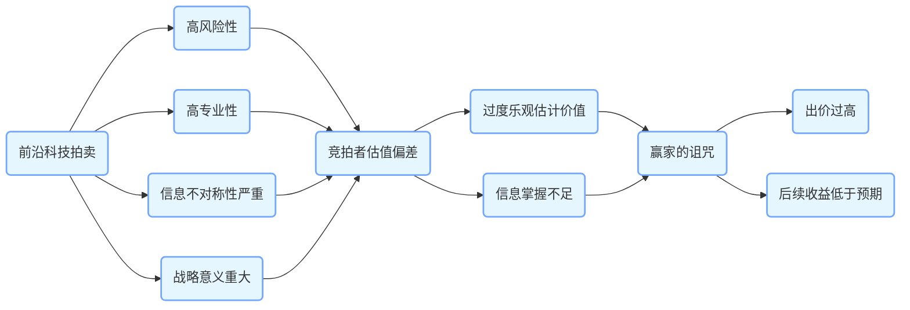

# 芒格的"赢家的诅咒"提醒在前沿科技拍卖中的应用

> 关键词：芒格、赢家的诅咒、前沿科技拍卖、拍卖理论、博弈论

> 摘要：本文深入探讨了芒格提出的“赢家的诅咒”提醒在前沿科技拍卖领域的应用。首先介绍了“赢家的诅咒”的背景知识，包括其概念来源与相关理论基础。接着阐述了前沿科技拍卖的特点和重要性。通过分析核心概念与联系，明确了“赢家的诅咒”在前沿科技拍卖场景中的作用机制。详细讲解了涉及的核心算法原理和具体操作步骤，借助数学模型和公式深入剖析其内在逻辑，并辅以实际案例进行说明。通过项目实战，展示了在前沿科技拍卖中如何应用相关理论和算法。探讨了该理论在实际应用中的场景和价值。推荐了相关的学习资源、开发工具框架以及论文著作。最后总结了未来发展趋势与挑战，解答常见问题，并提供扩展阅读和参考资料，旨在为前沿科技拍卖参与者提供全面、深入的理论和实践指导。

## 1. 背景介绍 
### 1.1 目的和范围
本文章的目的在于深入研究芒格的“赢家的诅咒”提醒在前沿科技拍卖中的具体应用。通过对相关理论和实际案例的分析，为参与前沿科技拍卖的各方，包括拍卖组织者、竞拍者等，提供有价值的决策参考和风险防范建议。研究范围涵盖了前沿科技拍卖的各个环节，从拍卖规则的制定、竞拍者的策略选择，到拍卖结果的评估和后续影响。同时，还涉及到与“赢家的诅咒”相关的博弈论、信息经济学等理论在该场景下的应用。

### 1.2 预期读者
本文预期读者主要包括从事前沿科技领域的企业管理者、技术投资者、拍卖行业从业者、对拍卖理论和博弈论感兴趣的学者和研究人员，以及关注科技产业发展和投资机会的普通读者。对于企业管理者和投资者来说，了解“赢家的诅咒”在前沿科技拍卖中的应用，有助于他们在竞拍过程中做出更明智的决策，降低投资风险；对于拍卖行业从业者，能够为其优化拍卖规则和流程提供思路；对于学者和研究人员，可作为进一步深入研究的参考；对于普通读者，能帮助他们更好地理解科技产业中的经济现象和市场规律。

### 1.3 文档结构概述
本文将按照以下结构展开：首先介绍相关背景知识，包括“赢家的诅咒”的概念和前沿科技拍卖的特点；接着阐述核心概念与联系，通过文本示意图和 Mermaid 流程图展示“赢家的诅咒”在前沿科技拍卖中的作用机制；然后详细讲解核心算法原理和具体操作步骤，用 Python 代码进行说明，并给出数学模型和公式；通过项目实战展示在实际拍卖场景中的应用和代码解读；探讨实际应用场景和价值；推荐相关的学习资源、开发工具框架和论文著作；最后总结未来发展趋势与挑战，解答常见问题，并提供扩展阅读和参考资料。

### 1.4 术语表
#### 1.4.1 核心术语定义
- **赢家的诅咒**：在拍卖等竞争环境中，由于竞拍者对拍卖物品的价值估计存在偏差，赢得拍卖的竞拍者往往可能出价过高，支付的价格超过了物品的实际价值，从而导致其在后续的交易或使用中遭受损失。
- **前沿科技拍卖**：指针对具有前沿性、创新性的科技成果、技术专利、科研设备等进行的拍卖活动，这类拍卖通常具有高风险、高收益、技术专业性强等特点。
- **竞拍者**：参与拍卖活动，试图以出价的方式获得拍卖物品的个人或组织。
- **拍卖者**：组织和举办拍卖活动的个人或机构。

#### 1.4.2 相关概念解释
- **信息不对称**：在拍卖过程中，不同竞拍者对拍卖物品的价值信息掌握程度不同，这种信息差异可能导致竞拍者对物品价值的估计出现偏差，进而影响其出价决策。
- **博弈论**：研究决策主体在相互作用时的策略选择和均衡结果的理论。在拍卖场景中，竞拍者之间的出价行为可以看作是一种博弈，每个竞拍者都需要根据其他竞拍者的可能策略来选择自己的最优出价。
- **估值偏差**：竞拍者对拍卖物品的实际价值的估计与物品真实价值之间的差异。估值偏差可能是由于信息不足、主观判断失误等原因造成的。

#### 1.4.3 缩略词列表
- **Nash Equilibrium**：纳什均衡，指在博弈过程中，每个参与者都选择了自己的最优策略，使得在其他参与者策略不变的情况下，任何一个参与者都无法通过改变自己的策略获得更高的收益。

## 2. 核心概念与联系 
### 2.1 “赢家的诅咒”概念原理
“赢家的诅咒”这一概念最早由石油行业的观察和研究提出。在石油开采权的拍卖中，研究者发现赢得拍卖的公司往往在后续的开采过程中获得的利润低于预期，甚至出现亏损。这是因为在拍卖过程中，各个竞拍者对石油储量和开采成本等信息的掌握存在差异，他们会根据自己的判断给出竞拍价格。由于竞拍者都希望赢得拍卖，往往会高估石油的价值，而赢得拍卖的公司就是出价最高的，这就可能导致其支付的价格超过了石油的实际价值，从而陷入“赢家的诅咒”。

在前沿科技拍卖中，“赢家的诅咒”同样存在。前沿科技具有创新性和不确定性，竞拍者对其未来的市场价值、技术发展前景等信息掌握不充分，容易出现估值偏差。例如，对于一项新兴的人工智能技术专利，不同的竞拍者可能根据自己的技术团队实力、市场预测等因素对其价值进行估计。由于竞争激烈，竞拍者可能会过度乐观地估计该专利的价值，从而在拍卖中出价过高。当赢得拍卖后，可能会发现该技术在实际应用中面临诸多困难，或者市场需求不如预期，导致无法实现预期的收益。

### 2.2 前沿科技拍卖特点
前沿科技拍卖与传统拍卖相比，具有以下特点：
- **高风险性**：前沿科技的发展具有很大的不确定性，其技术是否能够成功商业化、是否会被更先进的技术替代等都存在风险。例如，一项基因编辑技术可能在实验室阶段表现出色，但在临床试验中可能会遇到各种问题，导致其商业价值大打折扣。
- **高专业性**：竞拍者需要具备专业的技术知识和行业经验，才能准确评估拍卖的前沿科技的价值。对于一些复杂的量子计算技术、生物技术等，普通的投资者可能很难理解其技术原理和市场潜力。
- **信息不对称性严重**：由于前沿科技的创新性，相关信息往往不公开、不透明。竞拍者之间对技术的研发进度、核心技术细节、市场竞争态势等信息的掌握存在很大差异。这使得竞拍者在估值时更加困难，容易出现估值偏差。
- **战略意义重大**：对于企业来说，获得前沿科技的所有权或使用权可能具有重要的战略意义，如提升企业的技术竞争力、开拓新的市场领域等。因此，企业在竞拍时可能会更加激进，进一步加剧了“赢家的诅咒”的风险。

### 2.3 两者联系的文本示意图
```plaintext
前沿科技拍卖
    |
    |-- 高风险性
    |-- 高专业性
    |-- 信息不对称性严重
    |-- 战略意义重大
    |
    |-- 竞拍者估值偏差
    |       |
    |       |-- 过度乐观估计价值
    |       |-- 信息掌握不足
    |
    |-- 赢家的诅咒
            |
            |-- 出价过高
            |-- 后续收益低于预期
```

### 2.4 Mermaid 流程图


## 3. 核心算法原理 & 具体操作步骤 
### 3.1 核心算法原理
在前沿科技拍卖中，为了避免“赢家的诅咒”，可以采用贝叶斯博弈模型。贝叶斯博弈模型考虑了竞拍者之间的信息不对称性，每个竞拍者根据自己的私人信息和对其他竞拍者信息的概率分布来进行出价决策。

假设在一个前沿科技拍卖中有 $n$ 个竞拍者，每个竞拍者 $i$ 对拍卖的科技成果的估值为 $v_i$，这个估值是竞拍者的私人信息。同时，每个竞拍者对其他竞拍者的估值有一个概率分布的估计。竞拍者的目标是最大化自己的期望收益。

竞拍者 $i$ 的期望收益 $U_i$ 可以表示为：
$U_i = \begin{cases}
v_i - b_i, & \text{如果 } b_i \text{ 是最高出价}\\
0, & \text{否则}
\end{cases}$

其中 $b_i$ 是竞拍者 $i$ 的出价。

在贝叶斯均衡中，每个竞拍者的出价策略是其估值的函数，即 $b_i = s_i(v_i)$。竞拍者会根据自己的估值和对其他竞拍者策略的估计来选择最优的出价。

### 3.2 具体操作步骤
1. **信息收集**：竞拍者在参与拍卖前，需要尽可能收集与拍卖的前沿科技相关的信息，包括技术原理、研发进度、市场需求、竞争态势等。同时，了解其他竞拍者的背景和可能的竞拍策略。
2. **估值模型建立**：根据收集到的信息，建立对拍卖科技成果的估值模型。可以采用多种方法，如现金流折现法、市场比较法等。考虑到前沿科技的不确定性，还可以引入概率分布来描述估值的范围。
3. **概率分布估计**：对其他竞拍者的估值和出价策略进行概率分布估计。这可以基于历史拍卖数据、行业经验等进行推断。
4. **出价策略选择**：根据自己的估值、对其他竞拍者的概率分布估计，以及贝叶斯博弈模型，选择最优的出价策略。在出价时，要考虑到“赢家的诅咒”的风险，避免出价过高。
5. **拍卖过程监控**：在拍卖过程中，实时监控其他竞拍者的出价情况，根据新的信息调整自己的出价策略。

### 3.3 Python 源代码实现
```python
import numpy as np

# 定义竞拍者类
class Bidder:
    def __init__(self, id, true_value):
        self.id = id
        self.true_value = true_value
        self.estimated_distribution = None  # 对其他竞拍者估值的概率分布估计

    def set_estimated_distribution(self, distribution):
        self.estimated_distribution = distribution

    def bid(self):
        # 简单的出价策略：根据自己的估值和对其他竞拍者的估计出价
        if self.estimated_distribution is None:
            return self.true_value * 0.8  # 没有估计时，保守出价
        else:
            # 模拟根据概率分布计算期望收益，选择最优出价
            max_expected_utility = -np.inf
            best_bid = 0
            for bid in np.linspace(0, self.true_value, 100):
                # 计算期望收益
                expected_utility = self.calculate_expected_utility(bid)
                if expected_utility > max_expected_utility:
                    max_expected_utility = expected_utility
                    best_bid = bid
            return best_bid

    def calculate_expected_utility(self, bid):
        # 简单模拟计算期望收益
        probability_of_winning = 0.5  # 假设获胜概率为 0.5
        if bid > self.true_value:
            return -np.inf  # 避免出价超过自己的估值
        else:
            return (self.true_value - bid) * probability_of_winning

# 定义拍卖类
class Auction:
    def __init__(self, bidders):
        self.bidders = bidders

    def run_auction(self):
        bids = []
        for bidder in self.bidders:
            bid = bidder.bid()
            bids.append(bid)
        winner_index = np.argmax(bids)
        winner = self.bidders[winner_index]
        winning_bid = bids[winner_index]
        return winner, winning_bid

# 示例使用
if __name__ == "__main__":
    # 创建竞拍者
    bidder1 = Bidder(1, 100)
    bidder2 = Bidder(2, 120)
    bidder3 = Bidder(3, 90)
    bidders = [bidder1, bidder2, bidder3]

    # 设置估计的概率分布（这里简单模拟）
    distribution = np.random.uniform(0, 150, 100)
    for bidder in bidders:
        bidder.set_estimated_distribution(distribution)

    # 运行拍卖
    auction = Auction(bidders)
    winner, winning_bid = auction.run_auction()
    print(f"赢家 ID: {winner.id}, 获胜出价: {winning_bid}")
```

## 4. 数学模型和公式 & 详细讲解 & 举例说明 
### 4.1 数学模型和公式
#### 4.1.1 估值模型
在前沿科技拍卖中，对科技成果的估值可以采用现金流折现法。假设科技成果在未来 $T$ 期内产生的现金流为 $CF_t$，折现率为 $r$，则其现值 $V$ 可以表示为：
$$V = \sum_{t=1}^{T} \frac{CF_t}{(1 + r)^t}$$

其中，$CF_t$ 是第 $t$ 期的现金流，$r$ 是折现率，反映了资金的时间价值和投资的风险。

#### 4.1.2 贝叶斯博弈模型
在贝叶斯博弈中，每个竞拍者 $i$ 的类型为 $v_i$（即其对拍卖物品的估值），类型空间为 $V_i$。竞拍者的策略是一个函数 $s_i: V_i \to B$，其中 $B$ 是出价空间。

竞拍者 $i$ 的期望收益 $U_i$ 可以表示为：
$$U_i(s_i, s_{-i}, v_i) = \int_{V_{-i}} u_i(s_i(v_i), s_{-i}(v_{-i}), v_i, v_{-i}) f_{-i}(v_{-i}) dv_{-i}$$

其中，$s_{-i}$ 是其他竞拍者的策略组合，$v_{-i}$ 是其他竞拍者的类型组合，$f_{-i}(v_{-i})$ 是其他竞拍者类型的联合概率密度函数，$u_i$ 是竞拍者 $i$ 的收益函数。

在贝叶斯均衡中，每个竞拍者的策略 $s_i$ 满足：
$$U_i(s_i, s_{-i}, v_i) \geq U_i(s_i', s_{-i}, v_i), \quad \forall s_i' \in S_i$$

其中 $S_i$ 是竞拍者 $i$ 的策略空间。

### 4.2 详细讲解
#### 4.2.1 现金流折现法估值
现金流折现法的核心思想是将未来的现金流按照一定的折现率折算到当前时刻，以反映资金的时间价值和投资的风险。折现率 $r$ 的选择非常关键，它通常由无风险利率和风险溢价组成。无风险利率可以参考国债收益率等，风险溢价则需要根据科技成果的风险程度进行调整。例如，对于一项新兴的人工智能技术，由于其技术不确定性和市场竞争风险较高，风险溢价可能会相对较大。

#### 4.2.2 贝叶斯博弈模型
贝叶斯博弈模型考虑了竞拍者之间的信息不对称性。每个竞拍者根据自己的类型（估值）和对其他竞拍者类型的概率分布来选择最优的出价策略。在贝叶斯均衡中，每个竞拍者的策略都是在给定其他竞拍者策略的情况下的最优反应。这意味着在均衡状态下，没有竞拍者能够通过单方面改变自己的策略来提高自己的期望收益。

### 4.3 举例说明
假设一个前沿科技拍卖中，有两个竞拍者 $A$ 和 $B$。该科技成果预计在未来 3 年内产生的现金流分别为 $CF_1 = 100$ 万元，$CF_2 = 200$ 万元，$CF_3 = 300$ 万元，折现率 $r = 0.1$。

根据现金流折现法，该科技成果的现值为：
$$V = \frac{100}{(1 + 0.1)^1} + \frac{200}{(1 + 0.1)^2} + \frac{300}{(1 + 0.1)^3} \approx 481.59 \text{ 万元}$$

假设竞拍者 $A$ 对该科技成果的估值为 $v_A = 500$ 万元，竞拍者 $B$ 对该科技成果的估值为 $v_B = 450$ 万元。他们对对方估值的概率分布有自己的估计。

在贝叶斯博弈中，竞拍者 $A$ 会根据自己的估值和对 $B$ 的估值概率分布来选择最优出价。假设 $A$ 认为 $B$ 的估值在 $[400, 500]$ 万元之间均匀分布，$A$ 会通过计算不同出价下的期望收益来确定最优出价。

例如，当 $A$ 出价 $b_A = 480$ 万元时，$A$ 获胜的概率取决于 $B$ 的出价。如果 $B$ 的出价低于 $480$ 万元，$A$ 获胜，其收益为 $v_A - b_A = 500 - 480 = 20$ 万元；如果 $B$ 的出价高于 $480$ 万元，$A$ 失败，收益为 0 万元。$A$ 会根据对 $B$ 估值的概率分布来计算获胜的概率，进而计算期望收益。通过比较不同出价下的期望收益，$A$ 选择期望收益最大的出价作为最优出价。

## 5. 项目实战：代码实际案例和详细解释说明 
### 5.1  开发环境搭建
#### 5.1.1 安装 Python
首先需要安装 Python 环境。可以从 Python 官方网站（https://www.python.org/downloads/）下载适合自己操作系统的 Python 安装包，按照安装向导进行安装。建议安装 Python 3.6 及以上版本。

#### 5.1.2 安装必要的库
本项目中使用了 `numpy` 库，用于数值计算。可以使用以下命令安装 `numpy`：
```sh
pip install numpy
```

### 5.2  源代码详细实现和代码解读
```python
import numpy as np

# 定义竞拍者类
class Bidder:
    def __init__(self, id, true_value):
        self.id = id
        self.true_value = true_value
        self.estimated_distribution = None  # 对其他竞拍者估值的概率分布估计

    def set_estimated_distribution(self, distribution):
        self.estimated_distribution = distribution

    def bid(self):
        # 简单的出价策略：根据自己的估值和对其他竞拍者的估计出价
        if self.estimated_distribution is None:
            return self.true_value * 0.8  # 没有估计时，保守出价
        else:
            # 模拟根据概率分布计算期望收益，选择最优出价
            max_expected_utility = -np.inf
            best_bid = 0
            for bid in np.linspace(0, self.true_value, 100):
                # 计算期望收益
                expected_utility = self.calculate_expected_utility(bid)
                if expected_utility > max_expected_utility:
                    max_expected_utility = expected_utility
                    best_bid = bid
            return best_bid

    def calculate_expected_utility(self, bid):
        # 简单模拟计算期望收益
        probability_of_winning = 0.5  # 假设获胜概率为 0.5
        if bid > self.true_value:
            return -np.inf  # 避免出价超过自己的估值
        else:
            return (self.true_value - bid) * probability_of_winning

# 定义拍卖类
class Auction:
    def __init__(self, bidders):
        self.bidders = bidders

    def run_auction(self):
        bids = []
        for bidder in self.bidders:
            bid = bidder.bid()
            bids.append(bid)
        winner_index = np.argmax(bids)
        winner = self.bidders[winner_index]
        winning_bid = bids[winner_index]
        return winner, winning_bid

# 示例使用
if __name__ == "__main__":
    # 创建竞拍者
    bidder1 = Bidder(1, 100)
    bidder2 = Bidder(2, 120)
    bidder3 = Bidder(3, 90)
    bidders = [bidder1, bidder2, bidder3]

    # 设置估计的概率分布（这里简单模拟）
    distribution = np.random.uniform(0, 150, 100)
    for bidder in bidders:
        bidder.set_estimated_distribution(distribution)

    # 运行拍卖
    auction = Auction(bidders)
    winner, winning_bid = auction.run_auction()
    print(f"赢家 ID: {winner.id}, 获胜出价: {winning_bid}")
```

#### 5.2.1 代码解读
- **Bidder 类**：
  - `__init__` 方法：初始化竞拍者的 ID 和对拍卖物品的真实估值，同时将对其他竞拍者估值的概率分布估计初始化为 `None`。
  - `set_estimated_distribution` 方法：用于设置对其他竞拍者估值的概率分布估计。
  - `bid` 方法：根据是否有对其他竞拍者的估计来选择出价策略。如果没有估计，采用保守出价策略，出价为真实估值的 80%；如果有估计，则通过遍历不同的出价，计算期望收益，选择期望收益最大的出价。
  - `calculate_expected_utility` 方法：计算在给定出价下的期望收益。如果出价超过自己的估值，期望收益为负无穷，避免出价过高；否则，假设获胜概率为 0.5，计算期望收益。

- **Auction 类**：
  - `__init__` 方法：初始化拍卖，接收竞拍者列表作为参数。
  - `run_auction` 方法：运行拍卖过程，获取每个竞拍者的出价，找出出价最高的竞拍者作为赢家，并返回赢家和获胜出价。

- **示例使用部分**：
  - 创建了三个竞拍者，分别设置了不同的真实估值。
  - 模拟了对其他竞拍者估值的概率分布，并将其设置给每个竞拍者。
  - 运行拍卖，输出赢家的 ID 和获胜出价。

### 5.3  代码解读与分析
#### 5.3.1 优点
- **简单易懂**：代码结构清晰，使用了面向对象的编程思想，将竞拍者和拍卖过程分别封装在不同的类中，易于理解和扩展。
- **考虑了信息不对称**：通过 `estimated_distribution` 属性，模拟了竞拍者对其他竞拍者估值的概率分布估计，体现了信息不对称的特点。
- **避免出价过高**：在 `calculate_expected_utility` 方法中，通过判断出价是否超过自己的估值，避免了出价过高的情况，一定程度上降低了“赢家的诅咒”的风险。

#### 5.3.2 局限性
- **简化的假设**：代码中对获胜概率的假设比较简单，实际中获胜概率需要根据更复杂的模型和信息来计算。
- **估值模型简单**：代码中没有详细实现对拍卖物品的估值模型，只是简单地使用了真实估值，实际应用中需要更复杂的估值方法。
- **缺乏动态调整**：在拍卖过程中，没有考虑到竞拍者根据其他竞拍者的出价动态调整自己的出价策略，实际拍卖中竞拍者会根据新的信息不断调整策略。

## 6. 实际应用场景 
### 6.1 技术专利拍卖
在技术专利拍卖中，“赢家的诅咒”提醒具有重要的应用价值。例如，在半导体芯片技术领域，一项新型芯片制造工艺的专利拍卖可能吸引众多企业参与。竞拍者需要对该专利的技术价值、市场前景、研发成本等进行评估。由于芯片技术发展迅速，市场竞争激烈，竞拍者可能会过度乐观地估计该专利的未来收益，从而在拍卖中出价过高。如果赢得拍卖的企业后续发现该专利在实际应用中存在技术难题，或者市场需求不如预期，就可能陷入“赢家的诅咒”。因此，竞拍者在参与技术专利拍卖时，需要充分考虑“赢家的诅咒”风险，采用科学的估值方法和出价策略。

### 6.2 科研设备拍卖
科研设备拍卖也可能面临“赢家的诅咒”问题。例如，在生物医学领域，一台先进的基因测序设备的拍卖。竞拍者可能会被设备的先进性能所吸引，高估其在科研和商业应用中的价值。然而，购买设备后可能会发现设备的维护成本过高、操作难度大、配套技术不完善等问题，导致设备的实际使用效率低下，无法实现预期的收益。因此，在科研设备拍卖中，竞拍者需要谨慎评估设备的实际价值和使用成本，避免出价过高。

### 6.3 新兴科技公司股权拍卖
新兴科技公司股权拍卖同样存在“赢家的诅咒”风险。例如，一家专注于人工智能自动驾驶技术的初创公司进行股权拍卖。竞拍者可能会被公司的创新技术和市场潜力所吸引，对公司的未来发展过于乐观，从而在拍卖中抬高股权价格。但实际上，自动驾驶技术的商业化面临着诸多挑战，如法律法规限制、技术安全问题等。如果赢得拍卖的投资者在后续发现公司的发展不如预期，就可能遭受损失。因此，在新兴科技公司股权拍卖中，投资者需要全面评估公司的技术实力、市场前景、管理团队等因素，合理出价。

## 7. 工具和资源推荐
### 7.1 学习资源推荐
#### 7.1.1 书籍推荐
- 《拍卖理论》（Paul Klemperer 著）：这本书全面介绍了拍卖理论的基本概念、模型和应用，对于理解“赢家的诅咒”和拍卖机制具有重要的参考价值。
- 《博弈论基础》（Robert Gibbons 著）：博弈论是理解拍卖过程中竞拍者策略选择的重要理论基础，这本书系统地介绍了博弈论的基本原理和方法。
- 《信息经济学》（约瑟夫·斯蒂格利茨 著）：信息经济学探讨了信息不对称情况下的经济行为和决策，对于理解前沿科技拍卖中的信息问题和“赢家的诅咒”现象有很大帮助。

#### 7.1.2 在线课程
- Coursera 平台上的“拍卖理论与实践”课程：由知名学者授课，详细讲解了拍卖理论的各个方面，并结合实际案例进行分析。
- edX 平台上的“博弈论”课程：系统介绍了博弈论的基本概念和应用，包括在拍卖场景中的应用。
- 中国大学 MOOC 上的“信息经济学”课程：帮助学习者深入理解信息不对称对经济决策的影响，以及如何在信息不完全的情况下做出最优决策。

#### 7.1.3 技术博客和网站
- 知乎：在知乎上搜索“拍卖理论”、“赢家的诅咒”等关键词，可以找到很多专业人士的分享和讨论，了解最新的研究成果和实践经验。
- 果壳网：果壳网的科技板块有很多关于前沿科技的介绍和分析，对于了解前沿科技拍卖的背景和相关技术有一定的帮助。
- SSRN（社会科学研究网络）：该网站提供了大量的学术论文和研究报告，包括拍卖理论、博弈论、信息经济学等领域的最新研究成果。

### 7.2 开发工具框架推荐
#### 7.2.1 IDE和编辑器
- PyCharm：一款专门为 Python 开发设计的集成开发环境，具有代码编辑、调试、自动补全、代码分析等功能，方便开发和调试与拍卖模型相关的 Python 代码。
- Jupyter Notebook：是一个交互式的开发环境，适合进行数据分析、模型实验和代码演示。可以将代码、文本、图表等结合在一起，方便展示和分享研究成果。

#### 7.2.2 调试和性能分析工具
- PDB（Python 调试器）：Python 内置的调试器，可以帮助开发者逐行调试代码，查找和解决代码中的问题。
- cProfile：Python 标准库中的性能分析工具，可以统计代码中各个函数的执行时间和调用次数，帮助开发者优化代码性能。

#### 7.2.3 相关框架和库
- NumPy：用于数值计算的 Python 库，提供了高效的数组操作和数学函数，在实现拍卖模型的数值计算中非常有用。
- SciPy：基于 NumPy 的科学计算库，提供了更多的数学算法和工具，如优化算法、概率分布函数等，可用于实现更复杂的拍卖模型和算法。
- Pandas：用于数据处理和分析的 Python 库，可以方便地处理和分析拍卖数据，如竞拍者的出价记录、估值信息等。

### 7.3 相关论文著作推荐
#### 7.3.1 经典论文
- “Counterspeculation, Auctions, and Competitive Sealed Tenders”（William Vickrey 著）：这篇论文提出了维克里拍卖（第二价格密封拍卖）的概念，对拍卖理论的发展产生了深远影响。
- “The Winner's Curse in Bilateral Negotiations”（Max H. Bazerman 和 William F. Samuelson 著）：研究了双边谈判中的“赢家的诅咒”现象，为理解拍卖中的类似问题提供了参考。

#### 7.3.2 最新研究成果
- 关注顶级学术期刊如《Econometrica》、《Journal of Economic Theory》等，这些期刊经常发表关于拍卖理论、博弈论、信息经济学等领域的最新研究成果。
- 参加相关的学术会议，如计量经济学会世界大会、博弈论学会世界大会等，了解学术界的最新研究动态。

#### 7.3.3 应用案例分析
- 一些商业案例分析书籍和报告中会涉及到前沿科技拍卖的实际案例，如《哈佛商业评论》上的相关案例分析文章，通过分析这些案例可以了解“赢家的诅咒”在实际拍卖中的表现和应对策略。

## 8. 总结：未来发展趋势与挑战
### 8.1 未来发展趋势
#### 8.1.1 智能化拍卖系统
随着人工智能和机器学习技术的发展，未来的前沿科技拍卖可能会采用智能化的拍卖系统。这些系统可以利用大数据分析和预测模型，帮助竞拍者更准确地评估拍卖物品的价值，制定更合理的出价策略。同时，智能化拍卖系统还可以实时监控拍卖过程，根据竞拍者的行为和市场变化自动调整拍卖规则，提高拍卖的效率和公平性。

#### 8.1.2 国际化和多元化
前沿科技的发展是全球性的，未来的前沿科技拍卖将越来越国际化。竞拍者将来自不同的国家和地区，拍卖的物品也将涵盖更广泛的领域，包括生物技术、量子计算、新能源等。这将促进科技成果的全球流通和合作，推动科技的快速发展。

#### 8.1.3 与金融市场的融合
前沿科技拍卖可能会与金融市场更加紧密地融合。例如，通过金融创新工具，如科技债券、科技基金等，为竞拍者提供更多的融资渠道，降低竞拍的门槛。同时，金融市场的波动也会对前沿科技拍卖产生影响，竞拍者需要更加关注金融市场的动态，合理调整自己的竞拍策略。

### 8.2 挑战
#### 8.2.1 信息安全和隐私保护
在智能化拍卖系统中，大量的竞拍者信息和拍卖数据需要进行处理和存储，这带来了信息安全和隐私保护的挑战。如果这些信息被泄露或滥用，可能会对竞拍者的利益造成损害，影响拍卖的公平性和公信力。因此，需要加强信息安全技术和法律法规的保障，确保竞拍者的信息安全和隐私。

#### 8.2.2 估值难度增加
随着前沿科技的不断发展，其复杂性和不确定性也在增加，这使得对拍卖物品的估值难度越来越大。例如，对于一些新兴的量子技术、人工智能技术等，目前还缺乏成熟的估值方法和标准。竞拍者需要不断提高自己的技术水平和分析能力，采用多种估值方法相结合的方式，尽可能准确地评估拍卖物品的价值。

#### 8.2.3 监管难度加大
国际化和多元化的前沿科技拍卖使得监管难度加大。不同国家和地区的法律法规、监管政策存在差异，这可能导致拍卖过程中出现监管漏洞和法律纠纷。需要加强国际间的合作和协调，建立统一的监管标准和机制，确保前沿科技拍卖的健康发展。

## 9. 附录：常见问题与解答
### 9.1 什么是“赢家的诅咒”？
“赢家的诅咒”是指在拍卖等竞争环境中，由于竞拍者对拍卖物品的价值估计存在偏差，赢得拍卖的竞拍者往往可能出价过高，支付的价格超过了物品的实际价值，从而导致其在后续的交易或使用中遭受损失。

### 9.2 为什么前沿科技拍卖容易出现“赢家的诅咒”？
前沿科技拍卖具有高风险性、高专业性、信息不对称性严重和战略意义重大等特点。这些特点使得竞拍者对拍卖的前沿科技的价值评估更加困难，容易出现估值偏差。同时，由于竞争激烈和战略意义的驱动，竞拍者可能会过度乐观地估计其价值，从而在拍卖中出价过高，增加了“赢家的诅咒”的风险。

### 9.3 如何避免在前沿科技拍卖中陷入“赢家的诅咒”？
- **充分收集信息**：在参与拍卖前，尽可能收集与拍卖的前沿科技相关的信息，包括技术原理、研发进度、市场需求、竞争态势等。
- **采用科学的估值方法**：可以采用现金流折现法、市场比较法等多种方法对拍卖物品进行估值，并考虑到前沿科技的不确定性，引入概率分布来描述估值的范围。
- **运用博弈论策略**：根据贝叶斯博弈模型，考虑其他竞拍者的策略和信息，选择最优的出价策略。在出价时，要避免出价过高，考虑到“赢家的诅咒”的风险。
- **建立风险评估机制**：对参与拍卖的风险进行评估，制定相应的风险应对措施。如果发现风险过高，要谨慎参与拍卖。

### 9.4 代码中的获胜概率是如何确定的？
在代码中，获胜概率是简单假设为 0.5。实际中，获胜概率需要根据更复杂的模型和信息来计算。可以根据竞拍者对其他竞拍者估值的概率分布、出价策略等信息，通过数学模型来计算获胜的概率。例如，可以使用蒙特卡罗模拟方法，模拟大量的拍卖场景，统计在不同出价下的获胜次数，从而估计获胜概率。

### 9.5 如何根据新的信息动态调整出价策略？
在拍卖过程中，竞拍者可以实时监控其他竞拍者的出价情况，根据新的信息调整自己的出价策略。例如，如果发现其他竞拍者的出价高于自己的预期，可以重新评估拍卖物品的价值，调整自己的估值和出价策略。同时，也可以根据市场环境、技术发展等外部信息的变化，及时调整出价策略。在实际应用中，可以使用机器学习算法，对竞拍者的出价行为和市场信息进行分析和预测，实现出价策略的动态调整。

## 10. 扩展阅读 & 参考资料
### 10.1 扩展阅读
- 《思考，快与慢》（丹尼尔·卡尼曼 著）：这本书介绍了人类决策过程中的两种思维模式，对于理解竞拍者在拍卖过程中的决策行为和心理偏差有很大帮助。
- 《创新者的窘境》（克莱顿·克里斯坦森 著）：探讨了创新技术在市场中的发展规律和企业面临的挑战，对于理解前沿科技拍卖中的技术风险和市场变化有一定的启示。
- 《资本的秘密》（赫尔南多·德·索托 著）：分析了资本在经济发展中的作用和机制，对于理解前沿科技拍卖与金融市场的关系有一定的参考价值。

### 10.2 参考资料
- Klemperer, P. (2004). Auctions: Theory and Practice. Princeton University Press.
- Gibbons, R. (1992). A Primer in Game Theory. Harvester Wheatsheaf.
- Stiglitz, J. E. (2000). Information and the Change in the Paradigm in Economics. The American Economic Review, 90(3), 460 - 501.
- Vickrey, W. (1961). Counterspeculation, Auctions, and Competitive Sealed Tenders. The Journal of Finance, 16(1), 8 - 37.
- Bazerman, M. H., & Samuelson, W. F. (1983). The Winner's Curse in Bilateral Negotiations. Administrative Science Quarterly, 28(4), 618 - 634.