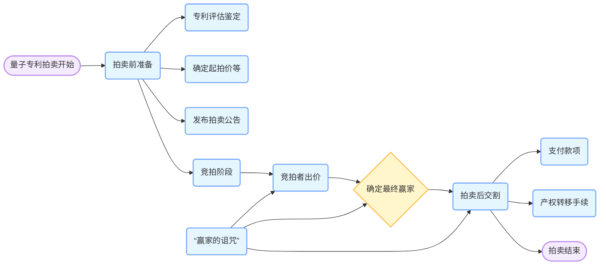

# 芒格的"赢家的诅咒"提醒在量子专利拍卖中的应用

> 关键词：芒格、赢家的诅咒、量子专利拍卖、博弈论、决策分析

> 摘要：本文深入探讨了芒格的“赢家的诅咒”提醒在量子专利拍卖中的应用。首先介绍了相关背景知识，包括“赢家的诅咒”的概念以及量子专利拍卖的特点。接着阐述了核心概念与联系，分析了“赢家的诅咒”在量子专利拍卖中的作用机制。通过具体的核心算法原理和数学模型，详细讲解了如何在拍卖决策中考虑“赢家的诅咒”。结合项目实战案例，展示了实际的代码实现和分析。探讨了量子专利拍卖中“赢家的诅咒”的实际应用场景，并推荐了相关的学习工具和资源。最后总结了未来发展趋势与挑战，解答常见问题并提供扩展阅读和参考资料，旨在为在量子专利拍卖领域的参与者提供全面的决策参考和理论支持。

## 1. 背景介绍 
### 1.1 目的和范围
本研究的目的在于深入剖析芒格的“赢家的诅咒”提醒在量子专利拍卖中的具体应用。随着量子技术的快速发展，量子专利的价值日益凸显，专利拍卖成为了获取量子技术知识产权的重要途径。然而，拍卖过程中存在着诸多不确定性和风险，“赢家的诅咒”现象可能会导致拍卖赢家付出过高的代价，从而影响其后续的商业利益。本研究将探讨如何在量子专利拍卖中识别、评估和应对“赢家的诅咒”，为拍卖参与者提供科学的决策依据。研究范围涵盖了量子专利拍卖的各个环节，包括拍卖前的专利评估、拍卖中的竞价策略制定以及拍卖后的专利价值实现等。

### 1.2 预期读者
本文预期读者包括量子技术领域的企业管理者、专利代理人、知识产权律师、投资机构人员以及对量子技术和拍卖理论感兴趣的学者和研究人员。这些读者在量子专利拍卖或相关领域具有一定的专业背景和实践经验，希望通过本文深入了解“赢家的诅咒”在量子专利拍卖中的影响和应对策略，以提高决策的科学性和合理性。

### 1.3 文档结构概述
本文共分为十个部分。第一部分为背景介绍，阐述了研究的目的、范围、预期读者和文档结构概述，并对相关术语进行了定义和解释。第二部分介绍了核心概念与联系，包括“赢家的诅咒”的原理、量子专利拍卖的架构以及两者之间的联系，并通过文本示意图和 Mermaid 流程图进行了直观展示。第三部分讲解了核心算法原理和具体操作步骤，使用 Python 源代码详细阐述了如何在拍卖决策中考虑“赢家的诅咒”。第四部分介绍了数学模型和公式，对相关模型和公式进行了详细讲解，并通过举例说明其应用。第五部分为项目实战，包括开发环境搭建、源代码详细实现和代码解读以及代码分析。第六部分探讨了量子专利拍卖中“赢家的诅咒”的实际应用场景。第七部分推荐了相关的学习工具和资源，包括书籍、在线课程、技术博客和网站、开发工具框架以及相关论文著作。第八部分总结了未来发展趋势与挑战。第九部分为附录，解答了常见问题。第十部分提供了扩展阅读和参考资料。

### 1.4 术语表
#### 1.4.1 核心术语定义
- **赢家的诅咒**：在拍卖等竞争环境中，由于竞拍者对标的物价值的估计存在偏差，最终赢得拍卖的竞拍者往往是对标的物价值高估最多的人，从而可能导致其在获得标的物后遭受经济损失的现象。
- **量子专利**：涉及量子技术领域的专利，包括量子计算、量子通信、量子测量等方面的发明创造所获得的专利权。
- **拍卖**：一种通过公开竞价的方式，将特定物品或财产权利转让给出价最高者的交易方式。
- **竞拍者**：参与拍卖活动，对拍卖标的物进行竞价的个人或组织。
- **标的物价值**：拍卖标的物在市场上的实际价值或潜在价值。

#### 1.4.2 相关概念解释
- **信息不对称**：在拍卖过程中，竞拍者对标的物的信息掌握程度不同，导致部分竞拍者可能对标的物价值的估计存在偏差。
- **估值偏差**：竞拍者对标的物价值的估计与实际价值之间的差异。
- **风险溢价**：竞拍者为了弥补在拍卖中可能面临的风险而愿意支付的额外价格。

#### 1.4.3 缩略词列表
- **QIP**：Quantum Information Processing（量子信息处理）
- **QC**：Quantum Computing（量子计算）
- **QC**：Quantum Cryptography（量子密码学）

## 2. 核心概念与联系 

### “赢家的诅咒”原理
“赢家的诅咒”源于信息不对称和竞拍者的过度自信。在拍卖中，每个竞拍者都会根据自己所掌握的信息对标的物的价值进行估计。然而，由于信息的不完全性和主观性，不同竞拍者的估计值会存在差异。通常情况下，那些对标的物价值估计较高的竞拍者会愿意出更高的价格，从而在竞争中获胜。但当他们赢得拍卖后，可能会发现标的物的实际价值并没有他们预期的那么高，从而遭受损失。

### 量子专利拍卖架构
量子专利拍卖通常包括以下几个阶段：
1. **拍卖前准备**：拍卖机构对量子专利进行评估和鉴定，确定拍卖的起拍价、保留价等参数，并发布拍卖公告，吸引潜在的竞拍者。
2. **竞拍阶段**：竞拍者根据自己对量子专利的评估和预期，提交竞拍价格。拍卖机构根据竞拍者的出价情况，确定最终的赢家。
3. **拍卖后交割**：拍卖赢家支付拍卖款项，获得量子专利的所有权，并办理相关的产权转移手续。

### 两者联系
在量子专利拍卖中，“赢家的诅咒”现象更为复杂和突出。由于量子技术的专业性和前沿性，竞拍者对量子专利的价值评估难度较大，信息不对称问题更为严重。同时，量子专利的潜在价值具有很大的不确定性，竞拍者可能会因为对其未来发展前景的过度乐观而高估其价值。因此，在量子专利拍卖中，竞拍者更容易陷入“赢家的诅咒”陷阱。

### 文本示意图
```plaintext
        量子专利拍卖
        ┌────────────────────┐
        │  拍卖前准备      │
        │ ┌──────────────┐ │
        │ │ 专利评估鉴定  │ │
        │ │ 确定起拍价等  │ │
        │ │ 发布拍卖公告  │ │
        │ └──────────────┘ │
        ├────────────────────┤
        │  竞拍阶段        │
        │ ┌──────────────┐ │
        │ │ 竞拍者出价    │ │
        │ │ 确定最终赢家  │ │
        │ └──────────────┘ │
        ├────────────────────┤
        │  拍卖后交割      │
        │ ┌──────────────┐ │
        │ │ 支付款项      │ │
        │ │ 产权转移手续  │ │
        │ └──────────────┘ │
        └────────────────────┘
                │
                │  “赢家的诅咒”影响
                ▼
  赢家可能高估专利价值，面临经济损失
```

### Mermaid 流程图


## 3. 核心算法原理 & 具体操作步骤 

### 算法原理
为了在量子专利拍卖中避免“赢家的诅咒”，我们可以采用贝叶斯决策理论。贝叶斯决策理论是一种基于概率的决策方法，它通过考虑先验概率和后验概率，来做出最优的决策。在量子专利拍卖中，我们可以将竞拍者对量子专利的估值看作是一个随机变量，其概率分布可以通过历史数据和专家经验来估计。在竞拍过程中，竞拍者可以根据其他竞拍者的出价信息，不断更新自己对量子专利价值的估计，从而做出更合理的竞价决策。

### Python 源代码实现
```python
import numpy as np

# 定义量子专利的真实价值范围
true_value_min = 100000
true_value_max = 1000000

# 定义竞拍者数量
num_bidders = 5

# 定义每个竞拍者的估值偏差系数
bias_coefficients = np.random.uniform(0.8, 1.2, num_bidders)

# 生成量子专利的真实价值
true_value = np.random.uniform(true_value_min, true_value_max)

# 每个竞拍者对量子专利的估值
bidder_estimates = bias_coefficients * true_value

# 模拟竞拍过程
bids = []
for estimate in bidder_estimates:
    # 竞拍者的出价，考虑一定的风险溢价
    bid = estimate * np.random.uniform(0.9, 1.1)
    bids.append(bid)

# 确定赢家
winner_index = np.argmax(bids)
winner_bid = bids[winner_index]
winner_estimate = bidder_estimates[winner_index]

# 计算赢家的损失（如果存在）
winner_loss = winner_bid - true_value if winner_bid > true_value else 0

# 输出结果
print(f"量子专利的真实价值: {true_value}")
print(f"每个竞拍者的估值: {bidder_estimates}")
print(f"每个竞拍者的出价: {bids}")
print(f"赢家的出价: {winner_bid}")
print(f"赢家的估值: {winner_estimate}")
print(f"赢家的损失: {winner_loss}")
```

### 具体操作步骤
1. **确定量子专利的真实价值范围**：根据量子技术的发展趋势、市场需求和相关专利的历史交易数据，估计量子专利的真实价值范围。
2. **生成竞拍者的估值偏差系数**：每个竞拍者对量子专利的估值都会存在一定的偏差，通过随机生成估值偏差系数来模拟这种偏差。
3. **计算每个竞拍者的估值**：将估值偏差系数乘以量子专利的真实价值，得到每个竞拍者对量子专利的估值。
4. **模拟竞拍过程**：每个竞拍者根据自己的估值和一定的风险溢价，确定自己的出价。
5. **确定赢家**：选择出价最高的竞拍者作为赢家。
6. **计算赢家的损失**：如果赢家的出价高于量子专利的真实价值，则计算赢家的损失。

## 4. 数学模型和公式 & 详细讲解 & 举例说明 

### 数学模型
设 $V$ 为量子专利的真实价值，$V_i$ 为第 $i$ 个竞拍者对量子专利的估值，$\epsilon_i$ 为第 $i$ 个竞拍者的估值偏差系数，$b_i$ 为第 $i$ 个竞拍者的出价，$\alpha_i$ 为第 $i$ 个竞拍者的风险溢价系数。则有：
$$V_i = \epsilon_i V$$
$$b_i = \alpha_i V_i$$

其中，$\epsilon_i \in [0.8, 1.2]$，$\alpha_i \in [0.9, 1.1]$。

### 详细讲解
- **估值偏差系数 $\epsilon_i$**：反映了竞拍者对量子专利价值的估计偏差。由于信息不对称和个人判断的主观性，不同竞拍者的估值偏差系数会有所不同。
- **风险溢价系数 $\alpha_i$**：反映了竞拍者在竞拍过程中愿意承担的风险程度。风险溢价系数越高，竞拍者越愿意出高价，以增加自己赢得拍卖的机会。

### 举例说明
假设量子专利的真实价值 $V = 500000$，有三个竞拍者，他们的估值偏差系数分别为 $\epsilon_1 = 0.9$，$\epsilon_2 = 1.1$，$\epsilon_3 = 1.0$，风险溢价系数分别为 $\alpha_1 = 0.95$，$\alpha_2 = 1.05$，$\alpha_3 = 1.0$。则有：
- 第一个竞拍者的估值：$V_1 = \epsilon_1 V = 0.9 \times 500000 = 450000$
- 第一个竞拍者的出价：$b_1 = \alpha_1 V_1 = 0.95 \times 450000 = 427500$
- 第二个竞拍者的估值：$V_2 = \epsilon_2 V = 1.1 \times 500000 = 550000$
- 第二个竞拍者的出价：$b_2 = \alpha_2 V_2 = 1.05 \times 550000 = 577500$
- 第三个竞拍者的估值：$V_3 = \epsilon_3 V = 1.0 \times 500000 = 500000$
- 第三个竞拍者的出价：$b_3 = \alpha_3 V_3 = 1.0 \times 500000 = 500000$

由于 $b_2 > b_3 > b_1$，所以第二个竞拍者赢得拍卖。其出价 $b_2 = 577500$ 高于量子专利的真实价值 $V = 500000$，可能会面临“赢家的诅咒”，损失为 $577500 - 500000 = 77500$。

## 5. 项目实战：代码实际案例和详细解释说明 

### 5.1  开发环境搭建
为了运行上述 Python 代码，我们需要搭建以下开发环境：
1. **Python 安装**：从 Python 官方网站（https://www.python.org/downloads/）下载并安装 Python 3.x 版本。
2. **集成开发环境（IDE）**：推荐使用 PyCharm 或 Visual Studio Code 等 IDE，它们提供了丰富的代码编辑、调试和运行功能。
3. **依赖库安装**：上述代码仅使用了 Python 内置的 `numpy` 库，使用以下命令安装：
```sh
pip install numpy
```

### 5.2  源代码详细实现和代码解读
```python
import numpy as np

# 定义量子专利的真实价值范围
true_value_min = 100000
true_value_max = 1000000

# 定义竞拍者数量
num_bidders = 5

# 定义每个竞拍者的估值偏差系数
bias_coefficients = np.random.uniform(0.8, 1.2, num_bidders)

# 生成量子专利的真实价值
true_value = np.random.uniform(true_value_min, true_value_max)

# 每个竞拍者对量子专利的估值
bidder_estimates = bias_coefficients * true_value

# 模拟竞拍过程
bids = []
for estimate in bidder_estimates:
    # 竞拍者的出价，考虑一定的风险溢价
    bid = estimate * np.random.uniform(0.9, 1.1)
    bids.append(bid)

# 确定赢家
winner_index = np.argmax(bids)
winner_bid = bids[winner_index]
winner_estimate = bidder_estimates[winner_index]

# 计算赢家的损失（如果存在）
winner_loss = winner_bid - true_value if winner_bid > true_value else 0

# 输出结果
print(f"量子专利的真实价值: {true_value}")
print(f"每个竞拍者的估值: {bidder_estimates}")
print(f"每个竞拍者的出价: {bids}")
print(f"赢家的出价: {winner_bid}")
print(f"赢家的估值: {winner_estimate}")
print(f"赢家的损失: {winner_loss}")
```
- **导入 `numpy` 库**：`numpy` 是一个用于科学计算的 Python 库，提供了高效的数组操作和数学函数。
- **定义量子专利的真实价值范围**：`true_value_min` 和 `true_value_max` 分别表示量子专利真实价值的最小值和最大值。
- **定义竞拍者数量**：`num_bidders` 表示参与拍卖的竞拍者数量。
- **生成估值偏差系数**：`bias_coefficients` 是一个长度为 `num_bidders` 的数组，其中每个元素表示一个竞拍者的估值偏差系数，取值范围为 $[0.8, 1.2]$。
- **生成量子专利的真实价值**：`true_value` 是一个在 `true_value_min` 和 `true_value_max` 之间的随机数，表示量子专利的真实价值。
- **计算每个竞拍者的估值**：`bidder_estimates` 是一个长度为 `num_bidders` 的数组，其中每个元素表示一个竞拍者对量子专利的估值，通过将估值偏差系数乘以真实价值得到。
- **模拟竞拍过程**：通过循环遍历每个竞拍者的估值，乘以一个在 $[0.9, 1.1]$ 之间的随机数，得到每个竞拍者的出价，并将其添加到 `bids` 列表中。
- **确定赢家**：使用 `np.argmax` 函数找到出价最高的竞拍者的索引，从而确定赢家。
- **计算赢家的损失**：如果赢家的出价高于量子专利的真实价值，则计算赢家的损失；否则，损失为 0。
- **输出结果**：使用 `print` 函数输出量子专利的真实价值、每个竞拍者的估值、每个竞拍者的出价、赢家的出价、赢家的估值和赢家的损失。

### 5.3  代码解读与分析
- **随机性**：代码中使用了随机数生成函数，因此每次运行代码的结果都会不同。这反映了实际拍卖过程中的不确定性。
- **估值偏差**：通过生成不同的估值偏差系数，模拟了竞拍者对量子专利价值的不同估计。这体现了信息不对称和个人判断的主观性。
- **风险溢价**：在出价过程中，考虑了一定的风险溢价，反映了竞拍者在竞拍过程中愿意承担的风险程度。
- **“赢家的诅咒”**：通过比较赢家的出价和量子专利的真实价值，计算赢家的损失，从而模拟了“赢家的诅咒”现象。

## 6. 实际应用场景 
### 企业专利战略布局
企业在进行量子技术研发和市场拓展时，需要通过专利拍卖获取相关的量子专利，以增强自身的技术实力和市场竞争力。在参与量子专利拍卖时，企业可以运用“赢家的诅咒”理论，对专利价值进行合理评估，避免因过度竞争而支付过高的价格。例如，一家量子计算企业在参与一项量子算法专利拍卖时，通过分析市场需求、技术发展趋势和自身研发能力，对该专利的价值进行了准确评估，并在竞拍过程中保持理性，最终以合理的价格获得了该专利，为企业的发展奠定了坚实的基础。

### 投资机构的专利投资
投资机构在寻找具有潜力的量子技术项目时，会关注量子专利的拍卖活动。他们希望通过投资有价值的量子专利，获得高额的回报。然而，由于量子技术的复杂性和不确定性，投资机构在参与拍卖时也面临着“赢家的诅咒”风险。投资机构可以通过建立专业的评估团队，综合考虑技术前景、市场需求、法律风险等因素，对量子专利的价值进行全面评估。同时，在竞拍过程中，采用合理的竞价策略，避免盲目跟风出价。例如，某投资机构在参与一项量子通信专利拍卖时，通过深入的市场调研和技术分析，发现该专利虽然具有一定的技术创新性，但市场应用前景尚不明朗。因此，在竞拍过程中，该投资机构保持谨慎，最终避免了高价竞拍带来的风险。

### 科研机构的技术合作
科研机构在开展量子技术研究时，可能会通过专利拍卖获取相关的技术资源，以促进自身的科研工作。在这个过程中，科研机构也需要注意“赢家的诅咒”问题。科研机构可以与其他科研团队合作，共同评估量子专利的价值，并根据自身的科研需求和经费情况，制定合理的竞拍策略。例如，某科研机构在参与一项量子测量专利拍卖时，与其他相关领域的科研团队合作，对该专利的技术可行性和应用前景进行了深入分析。通过合作，他们发现该专利虽然在理论上具有一定的创新性，但在实际应用中还存在一些技术难题。因此，该科研机构在竞拍过程中保持理性，最终没有参与高价竞拍，避免了不必要的损失。

## 7. 工具和资源推荐
### 7.1 学习资源推荐
#### 7.1.1 书籍推荐
- 《拍卖理论》（《Auction Theory》）：这本书全面介绍了拍卖理论的基本概念、模型和方法，对理解“赢家的诅咒”现象和拍卖决策具有重要的参考价值。
- 《量子技术导论》（《Introduction to Quantum Technology》）：该书系统地介绍了量子技术的基本原理、发展现状和应用前景，有助于读者了解量子专利的技术背景。
- 《决策分析》（《Decision Analysis》）：决策分析是一门研究如何在不确定情况下做出最优决策的学科，对于在量子专利拍卖中避免“赢家的诅咒”具有重要的指导意义。

#### 7.1.2 在线课程
- Coursera 上的“拍卖理论与实践”课程：该课程由知名学者授课，通过理论讲解和案例分析，深入介绍了拍卖理论和实践中的各种问题，包括“赢家的诅咒”现象。
- edX 上的“量子计算基础”课程：该课程系统地介绍了量子计算的基本原理和技术，帮助读者了解量子技术领域的相关知识。
- Udemy 上的“决策分析与风险管理”课程：该课程介绍了决策分析的基本方法和工具，以及如何在实际决策中进行风险管理，对于在量子专利拍卖中做出合理决策具有重要的帮助。

#### 7.1.3 技术博客和网站
- 量子计算前沿（https://quantumcomputingfrontier.com/）：该网站专注于量子计算领域的最新技术和研究成果，提供了丰富的量子技术资讯和学术论文。
- 拍卖理论论坛（https://auctiontheoryforum.com/）：这是一个专门讨论拍卖理论和实践问题的论坛，用户可以在上面交流经验、分享观点。
- 科技日报（https://www.stdaily.com/）：该网站提供了包括量子技术在内的科技领域的最新新闻和研究动态，有助于读者了解量子技术的发展趋势。

### 7.2 开发工具框架推荐
#### 7.2.1 IDE和编辑器
- PyCharm：一款功能强大的 Python 集成开发环境，提供了丰富的代码编辑、调试和运行功能，适合开发量子专利拍卖相关的 Python 代码。
- Visual Studio Code：一款轻量级的代码编辑器，支持多种编程语言，具有丰富的插件生态系统，可以方便地进行 Python 代码开发。

#### 7.2.2 调试和性能分析工具
- PDB：Python 内置的调试工具，可以帮助开发者定位代码中的错误和问题。
- cProfile：Python 标准库中的性能分析工具，可以帮助开发者分析代码的性能瓶颈，优化代码效率。

#### 7.2.3 相关框架和库
- NumPy：一个用于科学计算的 Python 库，提供了高效的数组操作和数学函数，在量子专利拍卖的模拟和分析中具有重要的应用。
- Pandas：一个用于数据处理和分析的 Python 库，可以方便地处理和分析量子专利拍卖中的数据。
- Matplotlib：一个用于数据可视化的 Python 库，可以将量子专利拍卖中的数据以图表的形式直观地展示出来。

### 7.3 相关论文著作推荐
#### 7.3.1 经典论文
- “Common Value Auctions and the Winner's Curse”（《共同价值拍卖与赢家的诅咒》）：这篇经典论文首次提出了“赢家的诅咒”概念，并对其进行了深入的理论分析。
- “Quantum Computing: A Gentle Introduction”（《量子计算：一个温和的介绍》）：该论文系统地介绍了量子计算的基本原理和技术，是量子技术领域的经典文献。

#### 7.3.2 最新研究成果
- 关注《Nature》、《Science》等顶级学术期刊上关于量子技术和拍卖理论的最新研究成果，了解该领域的前沿动态。
- 参加国际量子技术会议和拍卖理论会议，获取最新的研究报告和学术论文。

#### 7.3.3 应用案例分析
- 分析国内外量子专利拍卖的实际案例，了解“赢家的诅咒”在实际拍卖中的表现和影响，以及企业和投资机构的应对策略。
- 研究量子技术企业的专利战略和投资决策案例，学习如何在量子专利拍卖中做出合理的决策。

## 8. 总结：未来发展趋势与挑战
### 未来发展趋势
- **量子技术的快速发展**：随着量子技术的不断进步，量子专利的数量和价值将不断增加，量子专利拍卖市场也将越来越活跃。
- **拍卖机制的创新**：为了更好地适应量子专利拍卖的特点和需求，未来可能会出现一些创新的拍卖机制，如组合拍卖、动态拍卖等。
- **数据驱动的决策**：随着大数据和人工智能技术的发展，未来在量子专利拍卖中，将更多地运用数据驱动的决策方法，提高决策的科学性和准确性。

### 挑战
- **技术评估难度大**：由于量子技术的专业性和前沿性，对量子专利的技术评估难度较大，需要专业的技术团队和先进的评估方法。
- **信息不对称问题严重**：在量子专利拍卖中，信息不对称问题更为严重，竞拍者难以准确掌握量子专利的真实价值和潜在风险。
- **法律和政策环境不完善**：目前，量子技术领域的法律和政策环境还不完善，对于量子专利的保护和交易还存在一些问题，需要进一步加强相关的法律法规建设。

## 9. 附录：常见问题与解答
### 1. 什么是“赢家的诅咒”？
“赢家的诅咒”是指在拍卖等竞争环境中，由于竞拍者对标的物价值的估计存在偏差，最终赢得拍卖的竞拍者往往是对标的物价值高估最多的人，从而可能导致其在获得标的物后遭受经济损失的现象。

### 2. 为什么在量子专利拍卖中更容易出现“赢家的诅咒”？
由于量子技术的专业性和前沿性，竞拍者对量子专利的价值评估难度较大，信息不对称问题更为严重。同时，量子专利的潜在价值具有很大的不确定性，竞拍者可能会因为对其未来发展前景的过度乐观而高估其价值，因此在量子专利拍卖中更容易出现“赢家的诅咒”。

### 3. 如何在量子专利拍卖中避免“赢家的诅咒”？
可以采用以下方法避免“赢家的诅咒”：
- 建立专业的评估团队，对量子专利的价值进行全面、准确的评估。
- 采用合理的竞价策略，避免盲目跟风出价。
- 考虑风险溢价，在出价时预留一定的安全边际。
- 加强信息收集和分析，减少信息不对称的影响。

### 4. 量子专利拍卖的流程是怎样的？
量子专利拍卖通常包括拍卖前准备、竞拍阶段和拍卖后交割三个阶段。拍卖前准备包括专利评估鉴定、确定起拍价等参数和发布拍卖公告；竞拍阶段竞拍者根据自己的评估和预期出价，确定最终赢家；拍卖后交割包括支付款项和办理产权转移手续。

### 5. 有哪些工具和资源可以帮助我学习和了解量子专利拍卖和“赢家的诅咒”？
可以参考相关的书籍、在线课程、技术博客和网站，如《拍卖理论》、Coursera 上的“拍卖理论与实践”课程、量子计算前沿网站等。同时，还可以使用一些开发工具和框架，如 PyCharm、NumPy 等，进行相关的代码开发和数据分析。

## 10. 扩展阅读 & 参考资料
### 扩展阅读
- 《量子力学原理》（《The Principles of Quantum Mechanics》）：这本书深入介绍了量子力学的基本原理和数学基础，对于理解量子技术的本质具有重要的帮助。
- 《拍卖与招标》（《Auctions and Bidding》）：该书详细介绍了拍卖和招标的各种形式和应用，以及相关的理论和实践问题。
- 《决策科学》（《Decision Science》）：决策科学是一门研究如何在复杂环境中做出最优决策的学科，对于在量子专利拍卖中做出合理决策具有重要的参考价值。

### 参考资料
- Klemperer, P. (2004). Auctions: Theory and Practice. Princeton University Press.
- Nielsen, M. A., & Chuang, I. L. (2010). Quantum Computation and Quantum Information. Cambridge University Press.
- Raiffa, H. (1997). Decision Analysis: Introductory Lectures on Choices under Uncertainty. McGraw-Hill.
- 相关量子技术和拍卖理论的学术期刊和会议论文。