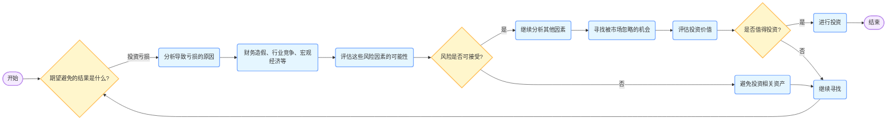

# 芒格的"颠倒思考"：在投资中应用逆向思维

> 关键词：芒格、颠倒思考、逆向思维、投资、决策、风险规避、价值发现

> 摘要：本文围绕芒格的“颠倒思考”这一重要理念，深入探讨其在投资领域的应用。通过对逆向思维的核心概念、算法原理、数学模型等多方面的剖析，结合实际案例展示如何在投资中运用逆向思维做出更明智的决策。同时，介绍了相关的学习资源、开发工具以及论文著作，帮助读者全面理解和掌握这一投资智慧。最后，对逆向思维在投资中的未来发展趋势与挑战进行总结，并解答常见问题，为投资者提供有价值的参考。

## 1. 背景介绍 
### 1.1 目的和范围
本文的目的在于深入探讨芒格的“颠倒思考”这一逆向思维方式在投资领域的具体应用。通过对逆向思维原理、操作步骤、实际案例等多方面的分析，帮助投资者更好地理解和运用这一思维模式，提高投资决策的质量和成功率。范围涵盖逆向思维在股票投资、基金投资、债券投资等多种投资场景中的应用，以及如何在投资的各个环节，如选股、估值、风险管理等方面运用逆向思维。

### 1.2 预期读者
本文预期读者主要包括广大投资者，无论是初涉投资领域的新手，还是有一定投资经验的专业人士。对于想要提升投资决策能力、学习投资智慧的人来说，本文都具有较高的参考价值。同时，也适合对投资理论和思维方式感兴趣的研究人员和学者阅读。

### 1.3 文档结构概述
本文首先介绍了背景信息，包括目的、预期读者和文档结构概述。接着阐述了逆向思维的核心概念与联系，通过文本示意图和 Mermaid 流程图展示其原理和架构。然后详细讲解了核心算法原理和具体操作步骤，并结合 Python 源代码进行说明。随后介绍了逆向思维在投资中的数学模型和公式，并举例说明。在项目实战部分，通过实际案例展示逆向思维在投资中的应用，并对代码进行详细解读和分析。之后探讨了逆向思维在实际投资场景中的应用。接着推荐了相关的学习资源、开发工具和论文著作。最后总结了逆向思维在投资中的未来发展趋势与挑战，解答常见问题，并提供扩展阅读和参考资料。

### 1.4 术语表
#### 1.4.1 核心术语定义
- **颠倒思考**：即逆向思维，指从相反的方向去思考问题，突破常规思维的局限，以获得新的视角和解决方案。
- **逆向思维投资法**：在投资过程中，运用逆向思维来分析市场、评估资产价值、制定投资策略的方法。
- **风险规避**：通过各种手段降低投资过程中可能面临的风险，保护投资者的资产安全。
- **价值发现**：通过深入分析和研究，发现被市场低估的资产，从而获得投资机会。

#### 1.4.2 相关概念解释
- **正向思维**：人们在解决问题时通常采用的常规思维方式，按照事物发展的正常顺序和逻辑进行思考。
- **羊群效应**：在投资市场中，投资者往往会受到其他投资者的影响，盲目跟随市场趋势进行投资，而忽略了自己的独立思考和判断。

#### 1.4.3 缩略词列表
无

## 2. 核心概念与联系 
逆向思维的核心在于打破常规的思维模式，从相反的方向去思考问题。在投资领域，正向思维通常是关注如何获取收益，而逆向思维则更注重如何规避风险。通过逆向思考，投资者可以发现被市场忽略的机会，避免陷入常见的投资陷阱。

### 逆向思维原理文本示意图
逆向思维的原理可以用以下文本示意图表示：

常规思维：问题 -> 解决方案（正向推导）

逆向思维：期望避免的结果 -> 导致该结果的原因 -> 避免这些原因的方法（反向推导）

例如，在投资中，常规思维可能是寻找那些被市场看好、热门的股票，期望获得高额收益。而逆向思维则是思考哪些因素可能导致投资失败，如公司财务造假、行业竞争加剧、宏观经济环境恶化等，然后尽量避免投资那些存在这些风险因素的股票。

### Mermaid 流程图


这个流程图展示了逆向思维在投资中的应用过程。首先明确期望避免的结果，然后分析导致该结果的原因，评估风险因素的可能性，根据风险的可接受程度决定是否投资。如果风险不可接受，则避免投资相关资产；如果风险可接受，则继续寻找被市场忽略的机会，评估投资价值，最终决定是否进行投资。

## 3. 核心算法原理 & 具体操作步骤 
### 核心算法原理
逆向思维在投资中的核心算法原理可以概括为以下几个步骤：

1. **确定期望避免的结果**：明确在投资中最不希望出现的情况，如投资亏损、资产大幅缩水等。
2. **分析导致结果的原因**：从宏观经济、行业趋势、公司基本面等多个角度分析可能导致期望避免结果的原因。
3. **评估风险因素的可能性**：对每个风险因素的发生概率进行评估，可以采用定性和定量相结合的方法。
4. **制定规避风险的策略**：根据风险因素的评估结果，制定相应的规避策略，如避免投资高风险资产、分散投资等。
5. **寻找被市场忽略的机会**：在规避风险的基础上，通过逆向思考寻找被市场忽略的投资机会，这些机会可能是由于市场情绪、信息不对称等原因导致的。
6. **评估投资价值**：对找到的投资机会进行全面评估，包括公司的财务状况、盈利能力、竞争优势等，确定其投资价值。
7. **做出投资决策**：根据投资价值的评估结果，结合自身的投资目标和风险承受能力，做出是否投资的决策。

### 具体操作步骤及 Python 源代码示例
以下是一个简单的 Python 代码示例，演示如何运用逆向思维进行股票投资的初步分析。假设我们要避免投资那些财务状况不佳的公司，我们可以通过分析公司的财务指标来筛选股票。

```python
import pandas as pd

# 模拟从数据库或 API 获取股票财务数据
def get_stock_financial_data():
    data = {
        '股票代码': ['000001', '000002', '000003', '000004'],
        '资产负债率': [0.6, 0.3, 0.8, 0.4],
        '净利润增长率': [0.1, -0.2, 0.05, 0.15],
        '流动比率': [1.2, 1.8, 0.9, 1.5]
    }
    df = pd.DataFrame(data)
    return df

# 逆向思维筛选股票
def reverse_thinking_stock_selection():
    df = get_stock_financial_data()
    
    # 设定财务指标的筛选标准
    asset_liability_ratio_threshold = 0.7  # 资产负债率阈值
    net_profit_growth_rate_threshold = 0  # 净利润增长率阈值
    current_ratio_threshold = 1.0  # 流动比率阈值
    
    # 筛选出不符合标准的股票
    filtered_df = df[
        (df['资产负债率'] > asset_liability_ratio_threshold) |
        (df['净利润增长率'] < net_profit_growth_rate_threshold) |
        (df['流动比率'] < current_ratio_threshold)
    ]
    
    # 得到符合标准的股票
    selected_stocks = df[~df['股票代码'].isin(filtered_df['股票代码'])]
    
    return selected_stocks

# 执行筛选
selected_stocks = reverse_thinking_stock_selection()
print("筛选后符合标准的股票：")
print(selected_stocks)
```

在这个代码示例中，我们首先模拟获取股票的财务数据，包括资产负债率、净利润增长率和流动比率。然后设定这些财务指标的筛选标准，通过逆向思维，筛选出不符合标准的股票，最后得到符合标准的股票。这个过程体现了逆向思维在投资中的应用，即先排除那些可能存在风险的股票，再从剩余的股票中寻找投资机会。

## 4. 数学模型和公式 & 详细讲解 & 举例说明 
### 风险评估模型
在逆向思维投资中，风险评估是一个重要的环节。我们可以使用一些数学模型来评估投资风险，其中一个常用的模型是风险价值（VaR）模型。

#### 风险价值（VaR）模型公式
风险价值（VaR）是指在一定的置信水平下，某一投资组合在未来特定时期内可能遭受的最大损失。其计算公式为：

$$VaR = z_{\alpha} \times \sigma \times \sqrt{\Delta t} \times V$$

其中：
- $z_{\alpha}$ 是对应置信水平 $\alpha$ 的标准正态分布分位数。例如，当置信水平为 95% 时，$z_{\alpha} = 1.645$；当置信水平为 99% 时，$z_{\alpha} = 2.326$。
- $\sigma$ 是投资组合的收益率标准差。
- $\Delta t$ 是时间间隔，通常以年为单位。
- $V$ 是投资组合的初始价值。

#### 详细讲解
风险价值（VaR）模型的核心思想是通过统计分析来估计投资组合在一定置信水平下的最大可能损失。$z_{\alpha}$ 表示在标准正态分布中，对应置信水平的分位数，它反映了在该置信水平下，投资组合收益率的偏离程度。$\sigma$ 是投资组合收益率的标准差，它衡量了投资组合收益率的波动程度。$\Delta t$ 表示时间间隔，因为投资风险通常与时间有关，时间越长，风险越大。$V$ 是投资组合的初始价值，它决定了损失的规模。

#### 举例说明
假设一个投资组合的初始价值为 $V = 100000$ 元，收益率标准差为 $\sigma = 0.2$，时间间隔为 $\Delta t = 1$ 年，置信水平为 95%，则 $z_{\alpha} = 1.645$。根据风险价值（VaR）模型公式，可计算出该投资组合在 95% 置信水平下的风险价值为：

$$VaR = 1.645 \times 0.2 \times \sqrt{1} \times 100000 = 32900$$

这意味着在 95% 的置信水平下，该投资组合在未来 1 年内可能遭受的最大损失为 32900 元。投资者可以根据这个结果来评估投资风险，并采取相应的风险规避措施。

### 估值模型
在逆向思维投资中，估值也是一个重要的环节。我们可以使用一些估值模型来评估资产的价值，其中一个常用的模型是股息贴现模型（DDM）。

#### 股息贴现模型（DDM）公式
股息贴现模型（DDM）是一种基于股息的估值模型，其基本公式为：

$$V = \frac{D_1}{r - g}$$

其中：
- $V$ 是股票的内在价值。
- $D_1$ 是下一期预计发放的股息。
- $r$ 是投资者要求的必要收益率。
- $g$ 是股息的增长率。

#### 详细讲解
股息贴现模型（DDM）的核心思想是将股票的价值视为未来股息的现值之和。$D_1$ 表示下一期预计发放的股息，它是投资者从股票中获得的收益之一。$r$ 是投资者要求的必要收益率，它反映了投资者对投资风险的补偿要求。$g$ 是股息的增长率，它表示股息在未来的增长趋势。通过将未来的股息按照投资者要求的必要收益率进行贴现，可以得到股票的内在价值。

#### 举例说明
假设某股票下一期预计发放的股息为 $D_1 = 2$ 元，投资者要求的必要收益率为 $r = 0.1$，股息的增长率为 $g = 0.05$。根据股息贴现模型（DDM）公式，可计算出该股票的内在价值为：

$$V = \frac{2}{0.1 - 0.05} = 40$$

这意味着该股票的内在价值为 40 元。如果当前股票的市场价格低于 40 元，则该股票可能被低估，具有投资价值；如果当前股票的市场价格高于 40 元，则该股票可能被高估，需要谨慎投资。

## 5. 项目实战：代码实际案例和详细解释说明 
### 5.1  开发环境搭建
为了实现逆向思维在投资中的应用，我们可以使用 Python 作为开发语言。以下是搭建开发环境的步骤：

1. **安装 Python**：从 Python 官方网站（https://www.python.org/downloads/）下载并安装 Python 3.x 版本。
2. **安装必要的库**：使用 pip 命令安装以下必要的库：
    - pandas：用于数据处理和分析。
    - numpy：用于数值计算。
    - matplotlib：用于数据可视化。

```bash
pip install pandas numpy matplotlib
```

### 5.2  源代码详细实现和代码解读
以下是一个更完整的 Python 代码示例，演示如何运用逆向思维进行股票投资的综合分析。该示例包括数据获取、财务指标分析、风险评估、估值计算等步骤。

```python
import pandas as pd
import numpy as np
import matplotlib.pyplot as plt

# 模拟从数据库或 API 获取股票财务数据
def get_stock_financial_data():
    data = {
        '股票代码': ['000001', '000002', '000003', '000004'],
        '资产负债率': [0.6, 0.3, 0.8, 0.4],
        '净利润增长率': [0.1, -0.2, 0.05, 0.15],
        '流动比率': [1.2, 1.8, 0.9, 1.5],
        '股息率': [0.03, 0.05, 0.02, 0.04],
        '市盈率': [20, 15, 30, 18]
    }
    df = pd.DataFrame(data)
    return df

# 逆向思维筛选股票
def reverse_thinking_stock_selection():
    df = get_stock_financial_data()
    
    # 设定财务指标的筛选标准
    asset_liability_ratio_threshold = 0.7  # 资产负债率阈值
    net_profit_growth_rate_threshold = 0  # 净利润增长率阈值
    current_ratio_threshold = 1.0  # 流动比率阈值
    dividend_yield_threshold = 0.02  # 股息率阈值
    pe_ratio_threshold = 25  # 市盈率阈值
    
    # 筛选出不符合标准的股票
    filtered_df = df[
        (df['资产负债率'] > asset_liability_ratio_threshold) |
        (df['净利润增长率'] < net_profit_growth_rate_threshold) |
        (df['流动比率'] < current_ratio_threshold) |
        (df['股息率'] < dividend_yield_threshold) |
        (df['市盈率'] > pe_ratio_threshold)
    ]
    
    # 得到符合标准的股票
    selected_stocks = df[~df['股票代码'].isin(filtered_df['股票代码'])]
    
    return selected_stocks

# 风险评估：计算风险价值（VaR）
def calculate_var(portfolio_value, volatility, confidence_level=0.95, time_interval=1):
    from scipy.stats import norm
    z_alpha = norm.ppf(confidence_level)
    var = z_alpha * volatility * np.sqrt(time_interval) * portfolio_value
    return var

# 估值计算：股息贴现模型（DDM）
def calculate_ddm_value(dividend_next_year, required_return, dividend_growth_rate):
    value = dividend_next_year / (required_return - dividend_growth_rate)
    return value

# 主函数
def main():
    # 逆向思维筛选股票
    selected_stocks = reverse_thinking_stock_selection()
    print("筛选后符合标准的股票：")
    print(selected_stocks)
    
    # 风险评估
    portfolio_value = 100000  # 投资组合初始价值
    volatility = 0.2  # 投资组合收益率标准差
    var = calculate_var(portfolio_value, volatility)
    print(f"在 95% 置信水平下，投资组合的风险价值（VaR）为：{var} 元")
    
    # 估值计算
    dividend_next_year = 2  # 下一期预计发放的股息
    required_return = 0.1  # 投资者要求的必要收益率
    dividend_growth_rate = 0.05  # 股息的增长率
    ddm_value = calculate_ddm_value(dividend_next_year, required_return, dividend_growth_rate)
    print(f"根据股息贴现模型（DDM）计算的股票内在价值为：{ddm_value} 元")
    
    # 数据可视化：绘制财务指标柱状图
    plt.figure(figsize=(10, 6))
    plt.bar(selected_stocks['股票代码'], selected_stocks['资产负债率'], label='资产负债率')
    plt.bar(selected_stocks['股票代码'], selected_stocks['净利润增长率'], label='净利润增长率')
    plt.bar(selected_stocks['股票代码'], selected_stocks['流动比率'], label='流动比率')
    plt.xlabel('股票代码')
    plt.ylabel('财务指标值')
    plt.title('筛选后股票的财务指标')
    plt.legend()
    plt.show()

if __name__ == "__main__":
    main()
```

### 5.3  代码解读与分析
1. **数据获取**：`get_stock_financial_data` 函数模拟从数据库或 API 获取股票的财务数据，包括资产负债率、净利润增长率、流动比率、股息率和市盈率等。
2. **逆向思维筛选股票**：`reverse_thinking_stock_selection` 函数根据设定的财务指标筛选标准，筛选出不符合标准的股票，得到符合标准的股票。
3. **风险评估**：`calculate_var` 函数使用风险价值（VaR）模型计算投资组合在一定置信水平下的最大可能损失。
4. **估值计算**：`calculate_ddm_value` 函数使用股息贴现模型（DDM）计算股票的内在价值。
5. **主函数**：`main` 函数调用上述函数，完成股票筛选、风险评估、估值计算等操作，并使用 `matplotlib` 库绘制财务指标柱状图，直观展示筛选后股票的财务状况。

通过这个代码示例，我们可以看到如何运用逆向思维进行股票投资的综合分析，包括筛选股票、评估风险、计算估值等步骤。同时，数据可视化可以帮助我们更直观地了解股票的财务状况，为投资决策提供参考。

## 6. 实际应用场景 
逆向思维在投资中有广泛的应用场景，以下是一些常见的例子：

### 熊市中的投资机会
在熊市中，市场情绪普遍悲观，大多数股票价格下跌。此时，运用逆向思维，投资者可以关注那些被市场过度抛售但基本面良好的股票。这些股票可能由于市场恐慌而被低估，具有较高的投资价值。例如，在 2008 年全球金融危机期间，许多优质公司的股票价格大幅下跌，但一些逆向投资者抓住了机会，在低位买入这些股票，在随后的市场反弹中获得了丰厚的回报。

### 行业低谷期的投资
当某个行业处于低谷期时，市场对该行业的前景普遍不看好，相关企业的股价也会受到影响。然而，逆向投资者会深入分析行业的发展趋势和企业的竞争力，寻找那些具有复苏潜力的企业。例如，在新能源汽车行业发展初期，由于技术不成熟、成本较高等原因，该行业面临诸多挑战，股价表现不佳。但一些逆向投资者看到了新能源汽车的发展前景，提前布局相关企业，随着行业的发展，这些投资获得了巨大的收益。

### 规避热门投资陷阱
在投资市场中，经常会出现一些热门的投资主题或概念，吸引大量投资者跟风投资。然而，这些热门投资往往存在泡沫和风险。逆向投资者会保持冷静，不盲目跟风，而是思考这些热门投资背后的风险和可持续性。例如，在 2015 年的创业板牛市中，许多创业板股票价格大幅上涨，市场情绪狂热。但一些逆向投资者意识到了其中的风险，提前减持创业板股票，避免了随后的市场暴跌带来的损失。

### 挖掘被忽视的资产
逆向思维还可以帮助投资者挖掘被市场忽视的资产。这些资产可能由于缺乏市场关注、信息不对称等原因而被低估。例如，一些小型企业或新兴行业的企业，由于规模较小、知名度不高，往往容易被市场忽视。但逆向投资者会通过深入研究和分析，发现这些企业的潜在价值，从而获得投资机会。

## 7. 工具和资源推荐
### 7.1 学习资源推荐
#### 7.1.1 书籍推荐
- 《穷查理宝典：查理·芒格的智慧箴言录》：这本书收录了芒格的演讲、文章和访谈，全面介绍了芒格的投资理念、思维方式和人生智慧，是学习逆向思维和投资的经典之作。
- 《聪明的投资者》：作者是本杰明·格雷厄姆，这本书是价值投资的经典著作，介绍了价值投资的基本原理和方法，对逆向思维在投资中的应用也有深入的阐述。
- 《金融炼金术》：作者是乔治·索罗斯，这本书介绍了索罗斯的反身性理论，以及他在投资中的逆向思维和实践经验，对投资者有很大的启发。

#### 7.1.2 在线课程
- Coursera 上的“投资学原理”：这门课程由知名大学的教授授课，系统介绍了投资学的基本原理和方法，包括资产定价、投资组合理论、风险管理等内容，对逆向思维在投资中的应用也有涉及。
- edX 上的“价值投资分析”：这门课程专注于价值投资的分析方法和技巧，通过实际案例讲解如何运用逆向思维进行价值投资，适合有一定投资基础的学习者。

#### 7.1.3 技术博客和网站
- 雪球网：这是一个投资交流社区，有大量的投资者分享自己的投资经验和观点，包括逆向思维在投资中的应用案例和分析。
- 东方财富网：这是一个专业的金融资讯网站，提供丰富的股票、基金、债券等金融产品的信息和数据，有助于投资者进行逆向思维分析。

### 7.2 开发工具框架推荐
#### 7.2.1 IDE和编辑器
- PyCharm：这是一款专业的 Python 集成开发环境，具有代码编辑、调试、版本控制等功能，适合 Python 开发者使用。
- Jupyter Notebook：这是一个交互式的开发环境，支持 Python、R 等多种编程语言，适合进行数据处理、分析和可视化。

#### 7.2.2 调试和性能分析工具
- pdb：Python 自带的调试工具，可以帮助开发者调试代码，查找问题。
- cProfile：Python 自带的性能分析工具，可以帮助开发者分析代码的性能瓶颈，优化代码。

#### 7.2.3 相关框架和库
- pandas：用于数据处理和分析，提供了丰富的数据结构和函数，方便进行数据清洗、转换和计算。
- numpy：用于数值计算，提供了高效的数组和矩阵运算功能，是科学计算的基础库。
- matplotlib：用于数据可视化，提供了多种绘图函数和工具，方便绘制各种图表。

### 7.3 相关论文著作推荐
#### 7.3.1 经典论文
- Fama, E. F., & French, K. R. (1992). The cross-section of expected stock returns. The Journal of Finance, 47(2), 427-465. 这篇论文提出了著名的 Fama-French 三因子模型，对股票收益率的影响因素进行了深入分析，为逆向思维在投资中的应用提供了理论基础。
- Kahneman, D., & Tversky, A. (1979). Prospect theory: An analysis of decision under risk. Econometrica, 47(2), 263-291. 这篇论文提出了前景理论，解释了人们在决策过程中的非理性行为，对逆向思维在投资决策中的应用有重要的启示。

#### 7.3.2 最新研究成果
- Barberis, N., & Thaler, R. H. (2003). A survey of behavioral finance. Handbook of the Economics of Finance, 1, 1053-1128. 这篇论文对行为金融学的最新研究成果进行了综述，包括投资者的心理偏差、市场异象等内容，为逆向思维在投资中的应用提供了新的视角。
- Cochrane, J. H. (2011). Asset pricing puzzles. The Journal of Economic Perspectives, 25(2), 107-130. 这篇论文讨论了资产定价中的一些谜题，如股权溢价之谜、动量效应等，对逆向思维在投资中的应用有一定的参考价值。

#### 7.3.3 应用案例分析
- Asness, C. S., Moskowitz, T. J., & Pedersen, L. H. (2013). Value and momentum everywhere. The Journal of Finance, 68(3), 929-985. 这篇论文通过实证研究，分析了价值和动量策略在不同市场和资产类别中的表现，为逆向思维在投资中的应用提供了实际案例。
- Greenblatt, J. (2005). The little book that beats the market. John Wiley & Sons. 这本书介绍了作者的投资策略和方法，通过实际案例展示了如何运用逆向思维进行价值投资，获得超额收益。

## 8. 总结：未来发展趋势与挑战
### 未来发展趋势
1. **与人工智能和大数据的结合**：随着人工智能和大数据技术的发展，逆向思维在投资中的应用将更加智能化和精准化。通过对大量的市场数据、公司财务数据、新闻资讯等进行分析和挖掘，可以更准确地发现投资机会和风险，为逆向思维提供更有力的支持。
2. **跨领域应用**：逆向思维不仅在股票投资、基金投资等传统金融领域有广泛的应用，未来还将拓展到其他领域，如房地产投资、创业投资、艺术品投资等。通过跨领域的应用，可以发现更多的投资机会和创新模式。
3. **投资者教育的加强**：随着投资者对逆向思维的认识和理解不断加深，投资者教育将越来越受到重视。更多的投资者将学习和掌握逆向思维的方法和技巧，运用逆向思维进行投资决策，提高投资收益和风险控制能力。

### 挑战
1. **数据质量和可靠性**：逆向思维在投资中的应用依赖于大量的数据，但数据的质量和可靠性可能存在问题。不准确或不完整的数据可能导致错误的分析和决策，影响投资效果。
2. **市场的复杂性和不确定性**：投资市场是复杂多变的，受到宏观经济、政策法规、行业竞争、市场情绪等多种因素的影响。逆向思维虽然可以帮助投资者发现一些被市场忽略的机会，但无法完全预测市场的变化和不确定性，投资决策仍然存在风险。
3. **投资者的心理偏差**：投资者在决策过程中往往存在各种心理偏差，如贪婪、恐惧、过度自信等。这些心理偏差可能影响投资者的逆向思维能力，导致投资者无法做出理性的决策。

## 9. 附录：常见问题与解答
### 1. 逆向思维在投资中一定能获得成功吗？
逆向思维在投资中可以帮助投资者发现一些被市场忽略的机会，提高投资决策的质量和成功率。但投资市场是复杂多变的，受到多种因素的影响，逆向思维并不能保证一定能获得成功。投资者还需要结合自己的投资目标、风险承受能力、投资经验等因素，做出合理的投资决策。

### 2. 如何培养逆向思维能力？
培养逆向思维能力需要从多个方面入手。首先，要学习和掌握逆向思维的基本原理和方法，可以通过阅读相关的书籍、文章和参加培训课程来学习。其次，要注重实践，在投资过程中尝试运用逆向思维进行分析和决策，不断积累经验。此外，还可以通过与其他投资者交流和讨论，学习他们的逆向思维经验和方法。

### 3. 逆向思维与价值投资有什么关系？
逆向思维与价值投资有密切的关系。价值投资的核心是寻找被市场低估的资产，而逆向思维可以帮助投资者从相反的方向去思考问题，发现那些被市场忽视的价值。逆向思维是价值投资的重要思维方式之一，通过逆向思维，投资者可以更准确地评估资产的价值，做出更明智的投资决策。

### 4. 逆向思维在不同的投资市场中都适用吗？
逆向思维在不同的投资市场中都有一定的适用性。无论是股票市场、债券市场、期货市场还是其他投资市场，都存在市场情绪波动、信息不对称等问题，逆向思维可以帮助投资者从这些问题中发现投资机会。但不同的投资市场有不同的特点和规律，投资者在运用逆向思维时需要结合具体的市场情况进行分析和决策。

## 10. 扩展阅读 & 参考资料
### 扩展阅读
- 《黑天鹅：如何应对不可预知的未来》，作者纳西姆·尼古拉斯·塔勒布，这本书介绍了黑天鹅事件的特点和影响，以及如何运用逆向思维应对不确定性。
- 《反脆弱：从不确定性中获益》，作者纳西姆·尼古拉斯·塔勒布，这本书提出了反脆弱的概念，阐述了如何在不确定性中获得收益，对逆向思维在投资中的应用有新的启示。

### 参考资料
- 芒格，查理. 《穷查理宝典：查理·芒格的智慧箴言录》. 中信出版社.
- 格雷厄姆，本杰明. 《聪明的投资者》. 人民邮电出版社.
- 索罗斯，乔治. 《金融炼金术》. 海南出版社.
- Fama, E. F., & French, K. R. (1992). The cross-section of expected stock returns. The Journal of Finance, 47(2), 427-465.
- Kahneman, D., & Tversky, A. (1979). Prospect theory: An analysis of decision under risk. Econometrica, 47(2), 263-291.
- Barberis, N., & Thaler, R. H. (2003). A survey of behavioral finance. Handbook of the Economics of Finance, 1, 1053-1128.
- Cochrane, J. H. (2011). Asset pricing puzzles. The Journal of Economic Perspectives, 25(2), 107-130.
- Asness, C. S., Moskowitz, T. J., & Pedersen, L. H. (2013). Value and momentum everywhere. The Journal of Finance, 68(3), 929-985.
- Greenblatt, J. (2005). The little book that beats the market. John Wiley & Sons.