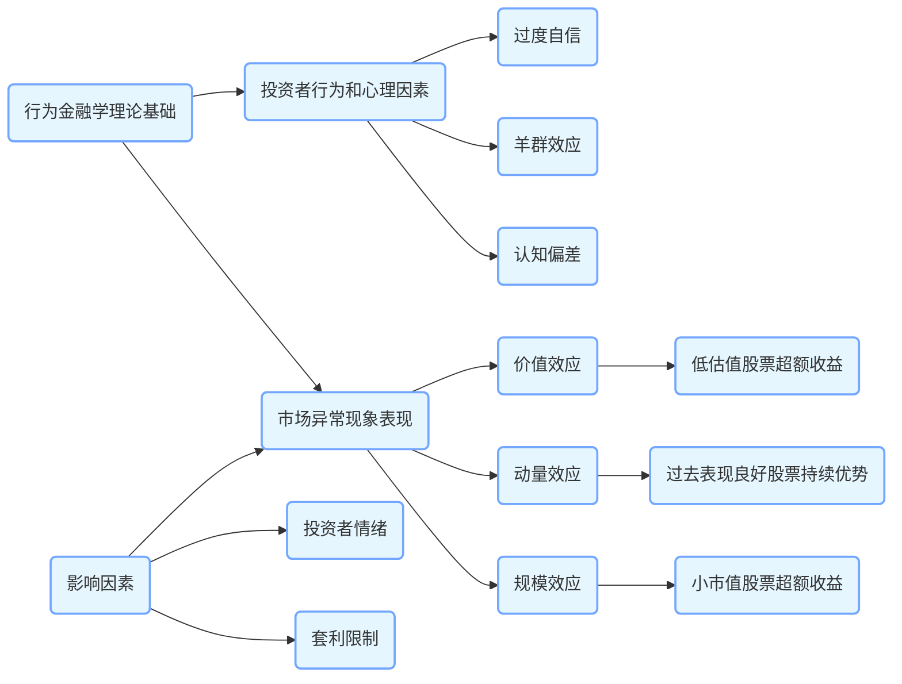

# 詹姆斯·蒙蒂尔的市场异常现象研究

> 关键词：詹姆斯·蒙蒂尔、市场异常现象、行为金融学、投资策略、价值投资

> 摘要：本文聚焦于詹姆斯·蒙蒂尔对市场异常现象的研究。首先介绍研究的背景，包括目的、预期读者、文档结构和相关术语。接着阐述市场异常现象的核心概念及其联系，给出原理和架构的文本示意图与Mermaid流程图。详细讲解核心算法原理及具体操作步骤，运用Python代码进行说明。深入探讨相关数学模型和公式，并举例分析。通过项目实战，展示代码实际案例并进行详细解释。分析市场异常现象的实际应用场景，推荐相关的学习资源、开发工具框架和论文著作。最后总结市场异常现象研究的未来发展趋势与挑战，提供常见问题解答和扩展阅读参考资料，旨在全面深入地剖析詹姆斯·蒙蒂尔的研究成果及其对金融市场的意义。

## 1. 背景介绍 
### 1.1 目的和范围
詹姆斯·蒙蒂尔是行为金融学领域的知名专家，他对市场异常现象的研究旨在揭示金融市场中不符合传统有效市场假说的现象。本研究的目的是深入探讨蒙蒂尔的研究成果，分析市场异常现象的成因、表现和影响，为投资者提供更全面的市场认知和投资策略参考。研究范围涵盖蒙蒂尔所关注的多种市场异常现象，如价值效应、动量效应、规模效应等，并结合行为金融学的理论进行分析。

### 1.2 预期读者
本文预期读者包括金融从业者、投资者、金融研究人员以及对金融市场和行为金融学感兴趣的人士。对于金融从业者和投资者，本文可以提供新的投资思路和策略；对于研究人员，有助于进一步拓展市场异常现象的研究；对于普通爱好者，能帮助他们更好地理解金融市场的复杂性。

### 1.3 文档结构概述
本文将按照以下结构展开：首先介绍市场异常现象的核心概念与联系，包括其原理和架构；接着讲解核心算法原理和具体操作步骤，并用Python代码实现；然后阐述相关数学模型和公式，并举例说明；通过项目实战展示代码实际案例及详细解释；分析市场异常现象的实际应用场景；推荐相关的学习资源、开发工具框架和论文著作；最后总结未来发展趋势与挑战，提供常见问题解答和扩展阅读参考资料。

### 1.4 术语表
#### 1.4.1 核心术语定义
- **市场异常现象**：指金融市场中出现的与传统有效市场假说相悖的现象，如股票价格的长期偏离、收益率的异常波动等。
- **有效市场假说**：认为市场价格已经充分反映了所有可用信息，投资者无法通过分析历史数据或其他信息获得超额收益。
- **行为金融学**：结合心理学和金融学的理论，研究投资者的行为和心理因素对金融市场的影响。
- **价值效应**：指低估值股票（如低市盈率、低市净率股票）在长期内表现优于高估值股票的现象。
- **动量效应**：指过去一段时间内表现良好的股票在未来一段时间内继续表现良好的现象。
- **规模效应**：指小市值股票在长期内表现优于大市值股票的现象。

#### 1.4.2 相关概念解释
- **投资者情绪**：投资者对市场的乐观或悲观态度，会影响他们的投资决策和市场价格。
- **认知偏差**：投资者在信息处理和决策过程中出现的偏差，如过度自信、羊群效应等。
- **套利限制**：由于各种因素（如交易成本、风险等）的存在，使得投资者无法通过套利活动消除市场异常现象。

#### 1.4.3 缩略词列表
- **EMH**：有效市场假说（Efficient Market Hypothesis）
- **PE**：市盈率（Price-to-Earnings Ratio）
- **PB**：市净率（Price-to-Book Ratio）

## 2. 核心概念与联系 

### 核心概念原理
詹姆斯·蒙蒂尔的市场异常现象研究基于行为金融学的理论。传统的有效市场假说认为市场是完全有效的，所有信息都能及时、准确地反映在股票价格中。然而，现实市场中存在许多不符合这一假说的现象。行为金融学认为，投资者并非完全理性，他们的行为和心理因素会影响市场价格。例如，投资者的过度自信会导致他们高估自己的投资能力，从而做出不理性的投资决策；羊群效应会使投资者盲目跟随他人的投资行为，导致市场价格的过度波动。

市场异常现象包括价值效应、动量效应和规模效应等。价值效应的原理是，市场有时会低估一些基本面良好但短期不被市场看好的股票，这些低估值股票在长期内会回归其内在价值，从而获得超额收益。动量效应则是由于投资者对信息的反应不足或过度反应，使得股票价格在短期内呈现出趋势性运动。规模效应可能是因为小市值公司具有更高的成长潜力，但市场对其关注不足，导致其股票价格被低估。

### 架构的文本示意图
```plaintext
市场异常现象研究
|-- 行为金融学理论基础
|   |-- 投资者行为和心理因素
|       |-- 过度自信
|       |-- 羊群效应
|       |-- 认知偏差
|-- 市场异常现象表现
|   |-- 价值效应
|   |   |-- 低估值股票超额收益
|   |-- 动量效应
|   |   |-- 过去表现良好股票持续优势
|   |-- 规模效应
|       |-- 小市值股票超额收益
|-- 影响因素
|   |-- 投资者情绪
|   |-- 套利限制
```

### Mermaid流程图


## 3. 核心算法原理 & 具体操作步骤 

### 价值效应选股算法原理
价值效应选股的核心思想是选择低估值的股票。常见的估值指标有市盈率（PE）和市净率（PB）。一般来说，低PE和低PB的股票被认为是被低估的。我们可以通过计算股票的PE和PB值，筛选出低于一定阈值的股票。

以下是Python代码实现：
```python
import pandas as pd

# 模拟股票数据
data = {
    'stock_code': ['000001', '000002', '000003', '000004', '000005'],
    'price': [10, 20, 15, 25, 30],
    'earnings_per_share': [1, 2, 1.5, 2.5, 3],
    'book_value_per_share': [5, 10, 7.5, 12.5, 15]
}

df = pd.DataFrame(data)

# 计算PE和PB
df['PE'] = df['price'] / df['earnings_per_share']
df['PB'] = df['price'] / df['book_value_per_share']

# 设定阈值
pe_threshold = 10
pb_threshold = 2

# 筛选低估值股票
low_valuation_stocks = df[(df['PE'] < pe_threshold) & (df['PB'] < pb_threshold)]

print(low_valuation_stocks)
```
### 代码解释
1. 首先，我们使用`pandas`库创建了一个模拟的股票数据集，包含股票代码、价格、每股收益和每股账面价值。
2. 然后，通过计算价格与每股收益的比值得到PE，价格与每股账面价值的比值得到PB。
3. 设定PE和PB的阈值，筛选出同时满足PE低于10且PB低于2的股票。

### 动量效应选股算法原理
动量效应选股的原理是选择过去一段时间内表现良好的股票。我们可以计算股票在过去一段时间（如6个月或12个月）的收益率，选择收益率排名靠前的股票。

以下是Python代码实现：
```python
import pandas as pd

# 模拟股票历史价格数据
stock_prices = {
    'stock_code': ['000001', '000002', '000003', '000004', '000005'],
    'start_price': [10, 20, 15, 25, 30],
    'end_price': [12, 22, 18, 30, 33]
}

df = pd.DataFrame(stock_prices)

# 计算收益率
df['return_rate'] = (df['end_price'] - df['start_price']) / df['start_price']

# 选择收益率排名前3的股票
top_stocks = df.nlargest(3, 'return_rate')

print(top_stocks)
```
### 代码解释
1. 创建一个模拟的股票历史价格数据集，包含股票代码、起始价格和结束价格。
2. 计算每只股票的收益率，即（结束价格 - 起始价格）/ 起始价格。
3. 使用`nlargest`函数选择收益率排名前3的股票。

## 4. 数学模型和公式 & 详细讲解 & 举例说明 

### 价值效应相关数学模型和公式
#### 市盈率（PE）
市盈率的计算公式为：
$$PE = \frac{P}{EPS}$$
其中，$P$ 表示股票价格，$EPS$ 表示每股收益。

例如，某股票价格为20元，每股收益为2元，则该股票的市盈率为：
$$PE = \frac{20}{2} = 10$$

#### 市净率（PB）
市净率的计算公式为：
$$PB = \frac{P}{BVPS}$$
其中，$P$ 表示股票价格，$BVPS$ 表示每股账面价值。

例如，某股票价格为20元，每股账面价值为10元，则该股票的市净率为：
$$PB = \frac{20}{10} = 2$$

### 动量效应相关数学模型和公式
#### 简单收益率
简单收益率的计算公式为：
$$R = \frac{P_t - P_{t-1}}{P_{t-1}}$$
其中，$R$ 表示收益率，$P_t$ 表示期末价格，$P_{t-1}$ 表示期初价格。

例如，某股票期初价格为10元，期末价格为12元，则该股票的简单收益率为：
$$R = \frac{12 - 10}{10} = 0.2 = 20\%$$

### 举例说明
假设我们有以下三只股票的数据：

| 股票代码 | 价格 | 每股收益 | 每股账面价值 | 期初价格 | 期末价格 |
| --- | --- | --- | --- | --- | --- |
| 000001 | 10 | 1 | 5 | 10 | 12 |
| 000002 | 20 | 2 | 10 | 20 | 22 |
| 000003 | 15 | 1.5 | 7.5 | 15 | 18 |

计算它们的PE、PB和收益率：

- 股票000001：
  - $PE = \frac{10}{1} = 10$
  - $PB = \frac{10}{5} = 2$
  - $R = \frac{12 - 10}{10} = 0.2 = 20\%$

- 股票000002：
  - $PE = \frac{20}{2} = 10$
  - $PB = \frac{20}{10} = 2$
  - $R = \frac{22 - 20}{20} = 0.1 = 10\%$

- 股票000003：
  - $PE = \frac{15}{1.5} = 10$
  - $PB = \frac{15}{7.5} = 2$
  - $R = \frac{18 - 15}{15} = 0.2 = 20\%$

从价值效应来看，三只股票的PE和PB相同，难以区分优劣。从动量效应来看，股票000001和000003的收益率高于股票000002。

## 5. 项目实战：代码实际案例和详细解释说明 

### 5.1  开发环境搭建
为了进行市场异常现象的研究和实践，我们需要搭建一个合适的开发环境。以下是具体步骤：

#### 安装Python
首先，从Python官方网站（https://www.python.org/downloads/）下载并安装Python 3.x版本。安装过程中，记得勾选“Add Python to PATH”选项，以便在命令行中可以直接使用Python。

#### 安装必要的库
我们需要安装一些常用的Python库，如`pandas`、`numpy`、`matplotlib`等。可以使用以下命令进行安装：
```sh
pip install pandas numpy matplotlib
```

#### 数据获取
可以从金融数据提供商（如Tushare、BaoStock等）获取股票数据。以Tushare为例，需要先注册并获取token，然后安装Tushare库：
```sh
pip install tushare
```

### 5.2  源代码详细实现和代码解读
以下是一个结合价值效应和动量效应的选股项目的代码实现：
```python
import tushare as ts
import pandas as pd
import numpy as np
import matplotlib.pyplot as plt

# 设置Tushare token
ts.set_token('your_token')
pro = ts.pro_api()

# 获取股票基本信息
stock_basic = pro.stock_basic(exchange='', list_status='L', fields='ts_code,symbol,name,industry')

# 获取财务数据
financial_data = pro.daily_basic(ts_code='', trade_date='', fields='ts_code,pe_ttm,pb')

# 合并数据
merged_data = pd.merge(stock_basic, financial_data, on='ts_code')

# 筛选低估值股票
pe_threshold = 10
pb_threshold = 2
low_valuation_stocks = merged_data[(merged_data['pe_ttm'] < pe_threshold) & (merged_data['pb'] < pb_threshold)]

# 获取历史行情数据
start_date = '20200101'
end_date = '20210101'
historical_data = []
for ts_code in low_valuation_stocks['ts_code']:
    df = pro.daily(ts_code=ts_code, start_date=start_date, end_date=end_date)
    if not df.empty:
        df['return_rate'] = df['close'].pct_change()
        total_return = (df['close'].iloc[-1] - df['close'].iloc[0]) / df['close'].iloc[0]
        historical_data.append({
            'ts_code': ts_code,
            'total_return': total_return
        })

historical_df = pd.DataFrame(historical_data)

# 选择收益率排名前10的股票
top_stocks = historical_df.nlargest(10, 'total_return')

# 打印结果
print(top_stocks)

# 绘制收益率柱状图
plt.bar(top_stocks['ts_code'], top_stocks['total_return'])
plt.xlabel('Stock Code')
plt.ylabel('Total Return')
plt.title('Top 10 Stocks by Total Return')
plt.show()
```
### 代码解读
1. **数据获取**：
   - 使用Tushare库获取股票基本信息和财务数据。
   - 通过`pd.merge`函数将股票基本信息和财务数据合并。
2. **价值效应筛选**：
   - 设定PE和PB的阈值，筛选出低估值的股票。
3. **动量效应筛选**：
   - 获取低估值股票的历史行情数据。
   - 计算每只股票的总收益率。
   - 选择收益率排名前10的股票。
4. **结果展示**：
   - 打印筛选出的股票信息。
   - 使用`matplotlib`库绘制收益率柱状图。

### 5.3  代码解读与分析
通过以上代码，我们实现了一个结合价值效应和动量效应的选股策略。首先，利用价值效应筛选出低估值的股票，然后在这些股票中利用动量效应选择收益率较高的股票。这种策略的优点是综合考虑了股票的估值和表现，可能会提高投资收益。然而，也存在一些局限性，如数据的准确性和及时性、市场环境的变化等。在实际应用中，需要不断调整参数和策略，以适应不同的市场情况。

## 6. 实际应用场景 
### 投资组合构建
投资者可以利用詹姆斯·蒙蒂尔的市场异常现象研究成果来构建投资组合。例如，根据价值效应选择低估值的股票，根据动量效应选择过去表现良好的股票，将这些股票组合在一起，以提高投资组合的收益。同时，可以根据不同的市场环境和投资目标，调整价值效应和动量效应的权重。

### 量化投资策略开发
量化投资者可以将市场异常现象的研究转化为具体的量化投资策略。通过编写代码，实现对股票的筛选和交易信号的生成。例如，根据PE、PB和收益率等指标，编写算法自动筛选符合条件的股票，并在适当的时候发出买入或卖出信号。

### 风险管理
市场异常现象的研究可以帮助投资者识别市场中的风险。例如，当市场出现过度的动量效应时，可能意味着市场存在泡沫，投资者需要谨慎操作。同时，通过分析不同市场异常现象之间的关系，可以更好地进行风险分散，降低投资组合的风险。

### 金融研究和教学
市场异常现象的研究对于金融研究人员和教学人员也具有重要意义。研究人员可以进一步深入探讨市场异常现象的成因和影响，推动行为金融学的发展。教学人员可以将这些研究成果融入到金融课程中，帮助学生更好地理解金融市场的复杂性。

## 7. 工具和资源推荐
### 7.1 学习资源推荐
#### 7.1.1 书籍推荐
- 《行为金融学》：这本书系统地介绍了行为金融学的理论和方法，包括投资者的行为和心理因素对金融市场的影响。
- 《聪明的投资者》：本杰明·格雷厄姆的经典著作，强调了价值投资的重要性，对市场异常现象的研究有一定的启示作用。
- 《金融心理学》：探讨了投资者的心理因素在金融决策中的作用，有助于理解市场异常现象的成因。

#### 7.1.2 在线课程
- Coursera上的“行为金融学”课程：由知名教授授课，内容涵盖行为金融学的各个方面。
- 网易云课堂上的“量化投资入门”课程：介绍了量化投资的基本概念和方法，包括市场异常现象的应用。

#### 7.1.3 技术博客和网站
- 雪球网：提供了丰富的股票分析和投资经验分享，有很多关于市场异常现象的讨论。
- 金融界网站：包含大量的金融资讯和研究报告，对市场异常现象的研究有一定的参考价值。

### 7.2 开发工具框架推荐
#### 7.2.1 IDE和编辑器
- PyCharm：一款功能强大的Python集成开发环境，适合进行金融数据分析和量化投资策略开发。
- Jupyter Notebook：可以方便地进行代码编写、数据可视化和文档记录，是金融研究和教学的常用工具。

#### 7.2.2 调试和性能分析工具
- pdb：Python自带的调试工具，可以帮助开发者定位代码中的问题。
- cProfile：用于分析Python代码的性能，找出性能瓶颈。

#### 7.2.3 相关框架和库
- pandas：用于数据处理和分析，是金融数据分析的必备库。
- numpy：提供了高效的数值计算功能，常用于金融模型的实现。
- matplotlib：用于数据可视化，能够直观地展示金融数据和分析结果。

### 7.3 相关论文著作推荐
#### 7.3.1 经典论文
- Fama, E. F., & French, K. R. (1992). The cross-section of expected stock returns. The Journal of Finance, 47(2), 427-465. 该论文提出了Fama-French三因子模型，对市场异常现象的研究有重要影响。
- Jegadeesh, N., & Titman, S. (1993). Returns to buying winners and selling losers: Implications for stock market efficiency. The Journal of Finance, 48(1), 65-91. 这篇论文首次提出了动量效应的概念。

#### 7.3.2 最新研究成果
可以关注《Journal of Financial Economics》、《Review of Financial Studies》等金融领域的顶级期刊，获取市场异常现象的最新研究成果。

#### 7.3.3 应用案例分析
一些金融研究机构和投资公司会发布市场异常现象的应用案例分析报告，可以通过他们的官方网站获取相关资料。

## 8. 总结：未来发展趋势与挑战
### 未来发展趋势
- **多因素融合**：未来的市场异常现象研究可能会将更多的因素融合在一起，如宏观经济因素、行业因素等，以提高投资策略的有效性。
- **人工智能和机器学习的应用**：随着人工智能和机器学习技术的发展，它们将被广泛应用于市场异常现象的研究和投资策略的开发。例如，使用深度学习算法来挖掘市场中的隐藏信息和规律。
- **跨市场和跨境研究**：市场异常现象的研究将不再局限于单一市场，而是会拓展到跨市场和跨境的研究，以发现更多的投资机会。

### 挑战
- **数据质量和可靠性**：市场异常现象的研究依赖于大量的金融数据，数据的质量和可靠性直接影响研究结果的准确性。如何获取高质量、准确的数据是一个挑战。
- **市场环境变化**：金融市场是不断变化的，市场异常现象也可能会随着市场环境的变化而消失或减弱。如何及时调整投资策略以适应市场变化是一个难题。
- **监管政策的影响**：监管政策的变化可能会对市场异常现象产生影响，投资者需要关注监管政策的动态，以避免因政策变化而带来的风险。

## 9. 附录：常见问题与解答
### 问题1：市场异常现象是否会一直存在？
市场异常现象并不是一直存在的，它们可能会随着市场环境的变化而消失或减弱。例如，当市场变得更加有效时，一些市场异常现象可能会逐渐消失。然而，新的市场异常现象也可能会不断出现。

### 问题2：如何判断一个市场异常现象是否具有投资价值？
判断一个市场异常现象是否具有投资价值需要综合考虑多个因素，如异常现象的稳定性、收益率、风险等。可以通过历史数据回测、统计分析等方法来评估异常现象的投资价值。

### 问题3：价值效应和动量效应是否可以同时应用？
可以同时应用价值效应和动量效应。在实际投资中，可以先根据价值效应筛选出低估值的股票，然后在这些股票中根据动量效应选择过去表现良好的股票，以构建投资组合。

### 问题4：市场异常现象的研究是否适用于所有市场？
市场异常现象的研究在不同市场可能会有不同的表现。一些市场可能存在更明显的市场异常现象，而另一些市场可能相对更有效。在应用市场异常现象的研究成果时，需要考虑市场的特点和环境。

## 10. 扩展阅读 & 参考资料
- 蒙蒂尔, J. (2017). 行为投资学手册：投资者如何避免成为自己最大的敌人. 机械工业出版社.
- Fama, E. F., & French, K. R. (2015). A five-factor asset pricing model. Journal of Financial Economics, 116(1), 1-22.
- 雪球网：https://xueqiu.com/
- 金融界网站：https://www.jrj.com.cn/
- Tushare官方网站：https://tushare.pro/