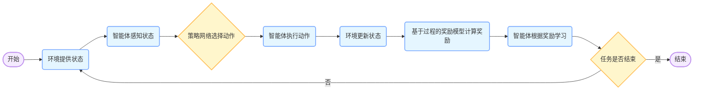

# 训练基于过程的奖励模型(PRM)

> 关键词：基于过程的奖励模型(PRM)、强化学习、奖励机制、训练方法、模型优化

> 摘要：本文围绕训练基于过程的奖励模型(PRM)展开全面深入的探讨。首先介绍了相关背景知识，包括目的、预期读者等内容。接着阐述了基于过程的奖励模型的核心概念与联系，剖析其原理和架构。详细讲解了核心算法原理并给出Python源代码示例，同时介绍了相关数学模型和公式。通过项目实战部分，提供代码实际案例并进行详细解释。探讨了该模型的实际应用场景，推荐了学习、开发等方面的工具和资源。最后总结了未来发展趋势与挑战，还包含常见问题解答以及扩展阅读和参考资料，旨在为读者全面呈现基于过程的奖励模型的训练方法和相关知识。

## 1. 背景介绍 
### 1.1 目的和范围
在强化学习领域，传统的奖励模型往往只关注最终的结果，而忽略了达到该结果的过程。然而，在许多实际应用场景中，过程的合理性、效率等因素同样重要。基于过程的奖励模型(PRM)旨在弥补这一缺陷，通过对智能体行为过程的评估来提供奖励信号，从而引导智能体学习到更优的策略。

本文的范围将涵盖基于过程的奖励模型的基本概念、核心算法原理、数学模型、项目实战以及实际应用场景等方面，帮助读者全面了解和掌握训练基于过程的奖励模型的方法和技术。

### 1.2 预期读者
本文预期读者包括对强化学习、人工智能领域有一定了解的研究人员、开发者和学生。对于希望深入研究奖励机制、优化智能体学习策略的专业人士，以及对相关领域感兴趣并希望学习新知识的爱好者都具有参考价值。

### 1.3 文档结构概述
本文将按照以下结构进行组织：首先介绍基于过程的奖励模型的背景知识，包括目的、预期读者和文档结构概述等内容。接着详细阐述核心概念与联系，包括原理和架构，并通过示意图和流程图进行展示。然后讲解核心算法原理，给出Python源代码示例，同时介绍相关数学模型和公式。通过项目实战部分，提供代码实际案例并进行详细解释。探讨该模型的实际应用场景，推荐学习、开发等方面的工具和资源。最后总结未来发展趋势与挑战，包含常见问题解答以及扩展阅读和参考资料。

### 1.4 术语表
#### 1.4.1 核心术语定义
- **基于过程的奖励模型(PRM)**：一种奖励模型，通过对智能体行为过程的评估来提供奖励信号，而不仅仅关注最终结果。
- **强化学习**：一种机器学习范式，智能体通过与环境进行交互，根据环境反馈的奖励信号来学习最优策略。
- **智能体**：在强化学习中，能够感知环境状态、执行动作并根据奖励信号进行学习的实体。
- **策略**：智能体在不同环境状态下选择动作的规则。

#### 1.4.2 相关概念解释
- **奖励机制**：在强化学习中，用于评估智能体行为好坏的一种反馈机制，奖励信号引导智能体学习到更优的策略。
- **状态**：环境在某一时刻的描述，智能体根据当前状态选择动作。
- **动作**：智能体在某一状态下可以执行的操作。

#### 1.4.3 缩略词列表
- **PRM**：基于过程的奖励模型(Process-based Reward Model)
- **RL**：强化学习(Reinforcement Learning)

## 2. 核心概念与联系 
基于过程的奖励模型(PRM)的核心思想是将奖励的计算不仅依赖于最终的结果，还考虑智能体在达到结果过程中的行为表现。这种奖励机制能够更全面地评估智能体的行为，引导智能体学习到更合理、高效的策略。

### 核心概念原理
传统的奖励模型通常只在任务结束时给予一个最终的奖励，智能体在学习过程中可能会采取一些短视的行为来追求这个最终奖励，而忽略了过程的合理性。基于过程的奖励模型则在智能体执行动作的每一个时间步都给予一个奖励，这个奖励反映了当前动作在整个过程中的价值。

例如，在机器人路径规划任务中，传统奖励模型可能只在机器人到达目标位置时给予一个正奖励，而在路径规划过程中不给予任何奖励。这样机器人可能会采取一些危险、低效的路径。而基于过程的奖励模型可以在机器人每走一步时，根据其当前位置与目标位置的距离、是否避开障碍物等因素给予一个奖励，引导机器人学习到更安全、高效的路径规划策略。

### 架构的文本示意图
基于过程的奖励模型(PRM)的架构主要包括以下几个部分：
1. **环境**：智能体交互的外部世界，提供状态信息。
2. **智能体**：感知环境状态，执行动作，并根据奖励信号进行学习。
3. **基于过程的奖励模型**：根据智能体的动作和环境状态，计算每一个时间步的奖励。
4. **策略网络**：根据环境状态选择动作。

```plaintext
+----------------+       +----------------+       +----------------+
|      环境      | <---- |     智能体     | <---- | 基于过程的奖励模型 |
+----------------+       +----------------+       +----------------+
           ^                                                         |
           |                                                         |
           |                                                         |
           v                                                         |
+----------------+                                                   |
|    策略网络    | <-------------------------------------------------+
+----------------+
```

### Mermaid 流程图


## 3. 核心算法原理 & 具体操作步骤 
### 核心算法原理
基于过程的奖励模型(PRM)的核心算法原理是在每一个时间步根据智能体的动作和环境状态计算奖励。常见的方法是使用一个奖励函数来计算奖励，奖励函数可以根据具体的任务和需求进行设计。

例如，在一个简单的二维网格世界中，智能体的目标是从起点移动到终点。奖励函数可以设计为：
- 如果智能体移动到了障碍物上，给予一个负奖励。
- 如果智能体离终点更近了，给予一个正奖励。
- 如果智能体离终点更远了，给予一个负奖励。

### 具体操作步骤
1. **初始化环境和智能体**：设置环境的初始状态和智能体的初始策略。
2. **循环执行以下步骤直到任务结束**：
    - 环境提供当前状态。
    - 智能体感知当前状态。
    - 策略网络根据当前状态选择动作。
    - 智能体执行动作。
    - 环境更新状态。
    - 基于过程的奖励模型根据动作和状态计算奖励。
    - 智能体根据奖励更新策略。

### Python源代码示例
```python
import numpy as np

# 定义环境
class GridWorld:
    def __init__(self, grid_size, start, goal, obstacles):
        self.grid_size = grid_size
        self.start = start
        self.goal = goal
        self.obstacles = obstacles
        self.current_state = start

    def reset(self):
        self.current_state = self.start
        return self.current_state

    def step(self, action):
        x, y = self.current_state
        if action == 0:  # 上
            x = max(x - 1, 0)
        elif action == 1:  # 下
            x = min(x + 1, self.grid_size[0] - 1)
        elif action == 2:  # 左
            y = max(y - 1, 0)
        elif action == 3:  # 右
            y = min(y + 1, self.grid_size[1] - 1)

        new_state = (x, y)
        if new_state in self.obstacles:
            reward = -10
        elif new_state == self.goal:
            reward = 100
        else:
            distance_to_goal = np.linalg.norm(np.array(new_state) - np.array(self.goal))
            prev_distance = np.linalg.norm(np.array(self.current_state) - np.array(self.goal))
            if distance_to_goal < prev_distance:
                reward = 1
            else:
                reward = -1

        self.current_state = new_state
        done = new_state == self.goal
        return new_state, reward, done

# 定义智能体
class Agent:
    def __init__(self, num_states, num_actions):
        self.num_states = num_states
        self.num_actions = num_actions
        self.q_table = np.zeros((num_states, num_actions))

    def choose_action(self, state, epsilon=0.1):
        if np.random.uniform(0, 1) < epsilon:
            action = np.random.choice(self.num_actions)
        else:
            state_index = np.ravel_multi_index(state, self.num_states)
            action = np.argmax(self.q_table[state_index])
        return action

    def update_q_table(self, state, action, reward, next_state, alpha=0.1, gamma=0.9):
        state_index = np.ravel_multi_index(state, self.num_states)
        next_state_index = np.ravel_multi_index(next_state, self.num_states)
        self.q_table[state_index, action] += alpha * (reward + gamma * np.max(self.q_table[next_state_index]) - self.q_table[state_index, action])

# 训练过程
grid_size = (5, 5)
start = (0, 0)
goal = (4, 4)
obstacles = [(2, 2), (3, 2)]

env = GridWorld(grid_size, start, goal, obstacles)
agent = Agent(grid_size, 4)

num_episodes = 1000
for episode in range(num_episodes):
    state = env.reset()
    done = False
    while not done:
        action = agent.choose_action(state)
        next_state, reward, done = env.step(action)
        agent.update_q_table(state, action, reward, next_state)
        state = next_state
```

## 4. 数学模型和公式 & 详细讲解 & 举例说明 
### 数学模型
基于过程的奖励模型(PRM)的数学模型可以表示为一个函数 $R(s, a)$，其中 $s$ 表示环境状态，$a$ 表示智能体执行的动作，$R(s, a)$ 表示在状态 $s$ 下执行动作 $a$ 所获得的奖励。

### 公式
在强化学习中，智能体的目标是最大化累积奖励。累积奖励可以表示为：
$$G_t = \sum_{k=0}^{\infty} \gamma^k R_{t+k+1}$$
其中 $G_t$ 表示从时间步 $t$ 开始的累积奖励，$\gamma$ 是折扣因子，$0 \leq \gamma \leq 1$，$R_{t+k+1}$ 表示时间步 $t + k + 1$ 获得的奖励。

智能体的策略 $\pi$ 可以表示为在状态 $s$ 下选择动作 $a$ 的概率：
$$\pi(a|s) = P(A_t = a | S_t = s)$$

智能体的价值函数 $V^{\pi}(s)$ 表示在策略 $\pi$ 下从状态 $s$ 开始的期望累积奖励：
$$V^{\pi}(s) = E_{\pi}[G_t | S_t = s]$$

动作价值函数 $Q^{\pi}(s, a)$ 表示在策略 $\pi$ 下从状态 $s$ 执行动作 $a$ 开始的期望累积奖励：
$$Q^{\pi}(s, a) = E_{\pi}[G_t | S_t = s, A_t = a]$$

### 详细讲解
- **折扣因子 $\gamma$**：折扣因子 $\gamma$ 用于权衡即时奖励和未来奖励的重要性。当 $\gamma$ 接近 1 时，智能体更注重未来的奖励；当 $\gamma$ 接近 0 时，智能体更注重即时奖励。
- **价值函数 $V^{\pi}(s)$**：价值函数 $V^{\pi}(s)$ 表示在策略 $\pi$ 下从状态 $s$ 开始的期望累积奖励，反映了状态 $s$ 的好坏。
- **动作价值函数 $Q^{\pi}(s, a)$**：动作价值函数 $Q^{\pi}(s, a)$ 表示在策略 $\pi$ 下从状态 $s$ 执行动作 $a$ 开始的期望累积奖励，反映了在状态 $s$ 下执行动作 $a$ 的好坏。

### 举例说明
在前面的二维网格世界示例中，假设折扣因子 $\gamma = 0.9$。当智能体从起点 $(0, 0)$ 移动到 $(0, 1)$ 时，获得奖励 $R = 1$。从 $(0, 1)$ 继续移动，可能会获得更多的奖励。假设后续的奖励依次为 $R_1 = 1, R_2 = 1, \cdots$，则从 $(0, 0)$ 移动到 $(0, 1)$ 开始的累积奖励为：
$$G_0 = R + \gamma R_1 + \gamma^2 R_2 + \cdots = 1 + 0.9 \times 1 + 0.9^2 \times 1 + \cdots$$
这是一个等比数列求和，根据等比数列求和公式 $S = \frac{a_1}{1 - q}$（其中 $a_1$ 是首项，$q$ 是公比），可得：
$$G_0 = \frac{1}{1 - 0.9} = 10$$

## 5. 项目实战：代码实际案例和详细解释说明 
### 5.1  开发环境搭建
- **Python 环境**：建议使用 Python 3.6 及以上版本。可以从 Python 官方网站（https://www.python.org/downloads/）下载安装。
- **依赖库**：本项目需要使用 `numpy` 库，可以使用以下命令进行安装：
```sh
pip install numpy
```

### 5.2  源代码详细实现和代码解读
以下是前面示例代码的详细解读：
```python
import numpy as np

# 定义环境
class GridWorld:
    def __init__(self, grid_size, start, goal, obstacles):
        self.grid_size = grid_size
        self.start = start
        self.goal = goal
        self.obstacles = obstacles
        self.current_state = start

    def reset(self):
        self.current_state = self.start
        return self.current_state

    def step(self, action):
        x, y = self.current_state
        if action == 0:  # 上
            x = max(x - 1, 0)
        elif action == 1:  # 下
            x = min(x + 1, self.grid_size[0] - 1)
        elif action == 2:  # 左
            y = max(y - 1, 0)
        elif action == 3:  # 右
            y = min(y + 1, self.grid_size[1] - 1)

        new_state = (x, y)
        if new_state in self.obstacles:
            reward = -10
        elif new_state == self.goal:
            reward = 100
        else:
            distance_to_goal = np.linalg.norm(np.array(new_state) - np.array(self.goal))
            prev_distance = np.linalg.norm(np.array(self.current_state) - np.array(self.goal))
            if distance_to_goal < prev_distance:
                reward = 1
            else:
                reward = -1

        self.current_state = new_state
        done = new_state == self.goal
        return new_state, reward, done

# 定义智能体
class Agent:
    def __init__(self, num_states, num_actions):
        self.num_states = num_states
        self.num_actions = num_actions
        self.q_table = np.zeros((num_states[0] * num_states[1], num_actions))

    def choose_action(self, state, epsilon=0.1):
        if np.random.uniform(0, 1) < epsilon:
            action = np.random.choice(self.num_actions)
        else:
            state_index = np.ravel_multi_index(state, self.num_states)
            action = np.argmax(self.q_table[state_index])
        return action

    def update_q_table(self, state, action, reward, next_state, alpha=0.1, gamma=0.9):
        state_index = np.ravel_multi_index(state, self.num_states)
        next_state_index = np.ravel_multi_index(next_state, self.num_states)
        self.q_table[state_index, action] += alpha * (reward + gamma * np.max(self.q_table[next_state_index]) - self.q_table[state_index, action])

# 训练过程
grid_size = (5, 5)
start = (0, 0)
goal = (4, 4)
obstacles = [(2, 2), (3, 2)]

env = GridWorld(grid_size, start, goal, obstacles)
agent = Agent(grid_size, 4)

num_episodes = 1000
for episode in range(num_episodes):
    state = env.reset()
    done = False
    while not done:
        action = agent.choose_action(state)
        next_state, reward, done = env.step(action)
        agent.update_q_table(state, action, reward, next_state)
        state = next_state
```
- **`GridWorld` 类**：定义了二维网格世界的环境。`__init__` 方法初始化环境的参数，包括网格大小、起点、终点和障碍物。`reset` 方法将环境状态重置为起点。`step` 方法根据智能体执行的动作更新环境状态，并计算奖励。
- **`Agent` 类**：定义了智能体。`__init__` 方法初始化智能体的参数，包括状态数、动作数和 Q 表。`choose_action` 方法根据当前状态选择动作，使用 $\epsilon$-贪心策略。`update_q_table` 方法根据奖励更新 Q 表。
- **训练过程**：循环执行多个回合的训练，每个回合中智能体与环境进行交互，根据奖励更新 Q 表。

### 5.3  代码解读与分析
- **奖励机制**：在 `GridWorld` 类的 `step` 方法中，根据智能体的动作和环境状态计算奖励。如果智能体移动到了障碍物上，给予一个负奖励；如果智能体到达了终点，给予一个正奖励；如果智能体离终点更近了，给予一个正奖励；如果智能体离终点更远了，给予一个负奖励。这种奖励机制鼓励智能体避开障碍物，尽快到达终点。
- **Q 学习算法**：在 `Agent` 类的 `update_q_table` 方法中，使用 Q 学习算法更新 Q 表。Q 学习算法是一种无模型的强化学习算法，通过不断更新 Q 表来学习最优策略。
- **$\epsilon$-贪心策略**：在 `Agent` 类的 `choose_action` 方法中，使用 $\epsilon$-贪心策略选择动作。$\epsilon$-贪心策略以一定的概率 $\epsilon$ 随机选择动作，以探索环境；以 $1 - \epsilon$ 的概率选择 Q 表中值最大的动作，以利用已有的知识。

## 6. 实际应用场景 
基于过程的奖励模型(PRM)在许多实际应用场景中都有广泛的应用，以下是一些常见的应用场景：
### 机器人控制
在机器人路径规划、运动控制等任务中，基于过程的奖励模型可以引导机器人学习到更安全、高效的策略。例如，在机器人导航任务中，传统的奖励模型可能只在机器人到达目标位置时给予一个正奖励，而基于过程的奖励模型可以在机器人每走一步时，根据其当前位置与目标位置的距离、是否避开障碍物等因素给予一个奖励，引导机器人学习到更合理的路径规划策略。

### 自动驾驶
在自动驾驶领域，基于过程的奖励模型可以评估车辆在行驶过程中的行为表现，如车速、加速度、与其他车辆的距离等。通过对这些过程因素的评估，可以引导自动驾驶车辆学习到更安全、舒适的驾驶策略。

### 游戏AI
在游戏开发中，基于过程的奖励模型可以用于训练游戏 AI。例如，在角色扮演游戏中，除了最终的游戏胜利奖励外，还可以根据角色在游戏过程中的行为表现，如探索地图、完成任务、与其他角色的互动等给予奖励，引导游戏 AI 学习到更丰富、有趣的游戏策略。

### 资源管理
在资源管理领域，基于过程的奖励模型可以用于优化资源分配策略。例如，在云计算中，根据虚拟机的资源使用情况、任务执行进度等因素给予奖励，引导资源分配算法学习到更高效的资源分配策略。

## 7. 工具和资源推荐
### 7.1 学习资源推荐
#### 7.1.1 书籍推荐
- 《强化学习：原理与Python实现》：全面介绍了强化学习的基本原理和算法，包括基于过程的奖励模型等相关内容。
- 《动手学强化学习》：通过大量的代码示例和实践项目，帮助读者快速掌握强化学习的应用和开发。

#### 7.1.2 在线课程
- Coursera 上的 “Reinforcement Learning Specialization”：由知名学者授课，系统讲解强化学习的理论和实践。
- 哔哩哔哩上的相关强化学习教程：有许多优质的免费教程，适合初学者学习。

#### 7.1.3 技术博客和网站
- OpenAI 博客：发布强化学习领域的最新研究成果和应用案例。
- 知乎的强化学习专栏：有许多专业人士分享的经验和见解。

### 7.2 开发工具框架推荐
#### 7.2.1 IDE和编辑器
- PyCharm：功能强大的 Python 集成开发环境，支持代码调试、自动补全、版本控制等功能。
- Visual Studio Code：轻量级的代码编辑器，支持多种编程语言，有丰富的插件扩展功能。

#### 7.2.2 调试和性能分析工具
- `pdb`：Python 自带的调试工具，可以帮助开发者调试代码。
- `cProfile`：Python 自带的性能分析工具，可以分析代码的性能瓶颈。

#### 7.2.3 相关框架和库
- OpenAI Gym：一个开源的强化学习环境库，提供了许多标准的强化学习任务环境。
- Stable Baselines：一个基于 TensorFlow 和 PyTorch 的强化学习库，提供了许多预训练的强化学习算法。

### 7.3 相关论文著作推荐
#### 7.3.1 经典论文
- “Reinforcement Learning: An Introduction”：强化学习领域的经典著作，系统介绍了强化学习的基本理论和算法。
- “Human-level control through deep reinforcement learning”：介绍了深度强化学习在游戏领域的应用，提出了深度 Q 网络（DQN）算法。

#### 7.3.2 最新研究成果
- 关注 arXiv 上的最新论文，了解基于过程的奖励模型等强化学习领域的最新研究进展。

#### 7.3.3 应用案例分析
- 查看相关会议论文和期刊文章，了解基于过程的奖励模型在实际应用中的案例和经验。

## 8. 总结：未来发展趋势与挑战
### 未来发展趋势
- **与深度学习的融合**：将基于过程的奖励模型与深度学习相结合，利用深度学习的强大表示能力，学习更复杂的奖励函数和策略网络，提高智能体的学习能力和性能。
- **多智能体系统**：在多智能体系统中应用基于过程的奖励模型，研究智能体之间的协作和竞争关系，实现更高效的多智能体决策和控制。
- **可解释性研究**：提高基于过程的奖励模型的可解释性，使人们能够理解智能体的决策过程和奖励机制，增强对智能体的信任和控制。

### 挑战
- **奖励函数设计**：设计合理的奖励函数是基于过程的奖励模型的关键，但在实际应用中，奖励函数的设计往往比较困难，需要考虑多种因素和权衡。
- **计算资源需求**：基于过程的奖励模型通常需要大量的计算资源来训练和优化，尤其是在与深度学习结合的情况下，计算资源的需求会更高。
- **环境建模**：准确地建模环境是基于过程的奖励模型的基础，但在复杂的实际环境中，环境建模往往比较困难，存在许多不确定性和噪声。

## 9. 附录：常见问题与解答
### 1. 基于过程的奖励模型与传统奖励模型有什么区别？
传统奖励模型通常只关注最终的结果，而基于过程的奖励模型不仅关注最终结果，还考虑智能体在达到结果过程中的行为表现。基于过程的奖励模型能够更全面地评估智能体的行为，引导智能体学习到更合理、高效的策略。

### 2. 如何设计基于过程的奖励模型的奖励函数？
设计奖励函数需要根据具体的任务和需求进行考虑。一般来说，可以从以下几个方面入手：
- **任务目标**：明确任务的最终目标，给予达到目标的智能体正奖励。
- **过程因素**：考虑智能体在执行任务过程中的行为表现，如动作的合理性、效率、安全性等，给予相应的奖励或惩罚。
- **权衡和调整**：根据实际情况对奖励函数进行权衡和调整，确保奖励函数能够引导智能体学习到最优策略。

### 3. 基于过程的奖励模型的训练时间通常比较长，有什么方法可以加快训练速度？
可以从以下几个方面加快基于过程的奖励模型的训练速度：
- **优化算法**：选择更高效的优化算法，如 Adam 优化器等。
- **并行计算**：利用 GPU 或多线程进行并行计算，提高计算效率。
- **经验回放**：使用经验回放机制，提高数据的利用率。

### 4. 基于过程的奖励模型在实际应用中可能会遇到哪些问题？
基于过程的奖励模型在实际应用中可能会遇到以下问题：
- **奖励函数设计不合理**：奖励函数设计不合理可能导致智能体学习到错误的策略。
- **环境噪声和不确定性**：实际环境中存在噪声和不确定性，可能影响智能体的学习和决策。
- **计算资源限制**：基于过程的奖励模型通常需要大量的计算资源，计算资源的限制可能影响训练速度和性能。

## 10. 扩展阅读 & 参考资料
### 扩展阅读
- 《Deep Reinforcement Learning Hands-On》：深入介绍了深度强化学习的理论和实践，包括基于过程的奖励模型等相关内容。
- 《Reinforcement Learning: Theory and Python Implementation》：系统讲解了强化学习的理论和算法，提供了丰富的 Python 代码示例。

### 参考资料
- Sutton, R. S., & Barto, A. G. (2018). Reinforcement Learning: An Introduction. MIT press.
- Mnih, V., Kavukcuoglu, K., Silver, D., Rusu, A. A., Veness, J., Bellemare, M. G., ... & Petersen, S. (2015). Human-level control through deep reinforcement learning. Nature, 518(7540), 529-533.
- OpenAI Gym 官方文档：https://gym.openai.com/docs/
- Stable Baselines 官方文档：https://stable-baselines.readthedocs.io/en/master/