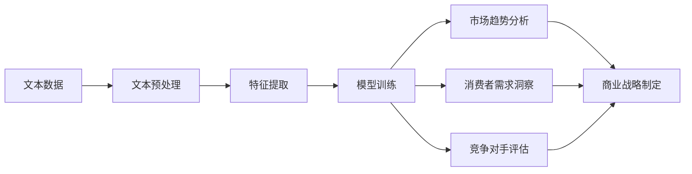

# 语言模型在创新商业战略与竞争情报分析中的多维度应用

> 关键词：语言模型、商业战略、竞争情报分析、多维度应用、自然语言处理

> 摘要：本文深入探讨了语言模型在创新商业战略与竞争情报分析中的多维度应用。随着自然语言处理技术的快速发展，语言模型在商业领域展现出了巨大的潜力。通过对语言模型核心概念、算法原理、数学模型的详细阐述，结合项目实战案例，分析了其在市场趋势预测、竞争对手监测、消费者洞察等多个实际应用场景中的作用。同时，推荐了相关的学习资源、开发工具和论文著作，最后对语言模型在商业领域的未来发展趋势与挑战进行了总结，并提供了常见问题解答和扩展阅读参考资料，旨在为商业从业者和技术人员提供全面而深入的指导。

## 1. 背景介绍 
### 1.1 目的和范围
本文章的目的在于全面探讨语言模型在创新商业战略与竞争情报分析中的多维度应用。随着信息技术的飞速发展，商业环境日益复杂多变，企业需要更高效、准确的工具和方法来制定战略和分析竞争情报。语言模型作为自然语言处理领域的重要成果，为商业领域带来了新的机遇和挑战。本文将涵盖语言模型的基本概念、核心算法、数学模型，以及其在商业战略制定和竞争情报分析中的具体应用场景和案例，旨在为读者提供一个系统、深入的理解。

### 1.2 预期读者
本文预期读者包括商业领域的从业者，如企业战略规划师、市场分析师、竞争情报专家等，他们可以从本文中了解语言模型如何应用于实际商业场景，为决策提供支持。同时，也适合自然语言处理领域的技术人员和研究人员，他们可以通过本文了解语言模型在商业领域的应用需求和挑战，为进一步的技术研发提供参考。此外，对商业和技术交叉领域感兴趣的学生和爱好者也可以从本文中获得有价值的信息。

### 1.3 文档结构概述
本文将按照以下结构进行组织：首先介绍语言模型的背景和相关概念，包括核心概念、算法原理和数学模型；然后通过项目实战案例详细说明语言模型在商业战略与竞争情报分析中的具体应用；接着分析语言模型在实际商业场景中的应用案例；推荐相关的学习资源、开发工具和论文著作；最后总结语言模型在商业领域的未来发展趋势与挑战，并提供常见问题解答和扩展阅读参考资料。

### 1.4 术语表
#### 1.4.1 核心术语定义
- **语言模型**：是一种对自然语言文本进行概率建模的模型，用于预测文本中每个词出现的概率，从而理解和生成自然语言。
- **商业战略**：是企业为实现长期目标而制定的一系列决策和行动计划，包括市场定位、产品策略、竞争策略等。
- **竞争情报分析**：是对竞争对手和竞争环境的信息进行收集、分析和评估的过程，旨在为企业提供决策支持，增强竞争力。
- **自然语言处理**：是计算机科学与语言学的交叉领域，旨在让计算机能够理解、处理和生成自然语言。

#### 1.4.2 相关概念解释
- **深度学习**：是一种基于人工神经网络的机器学习方法，通过多层神经网络自动学习数据的特征和模式，在自然语言处理等领域取得了显著的成果。
- **循环神经网络（RNN）**：是一种具有循环结构的神经网络，能够处理序列数据，如自然语言文本。由于其存在梯度消失等问题，后来发展出了长短期记忆网络（LSTM）和门控循环单元（GRU）等改进模型。
- **Transformer架构**：是一种基于注意力机制的神经网络架构，克服了RNN的一些局限性，在自然语言处理任务中表现出色，成为当前语言模型的主流架构。

#### 1.4.3 缩略词列表
- **NLP**：自然语言处理（Natural Language Processing）
- **RNN**：循环神经网络（Recurrent Neural Network）
- **LSTM**：长短期记忆网络（Long Short-Term Memory）
- **GRU**：门控循环单元（Gated Recurrent Unit）
- **GPT**：生成式预训练变压器（Generative Pretrained Transformer）

## 2. 核心概念与联系 

### 语言模型的核心概念
语言模型的核心目标是对自然语言文本的概率分布进行建模。给定一个词序列 $w_1, w_2, \cdots, w_n$，语言模型可以计算出该序列出现的概率 $P(w_1, w_2, \cdots, w_n)$。根据链式法则，这个概率可以分解为：

$$P(w_1, w_2, \cdots, w_n) = P(w_1)P(w_2|w_1)P(w_3|w_1, w_2) \cdots P(w_n|w_1, w_2, \cdots, w_{n-1})$$

其中，$P(w_i|w_1, w_2, \cdots, w_{i-1})$ 表示在给定前面 $i-1$ 个词的条件下，第 $i$ 个词出现的概率。

### 语言模型与商业战略和竞争情报分析的联系
语言模型可以通过对大量文本数据的分析和处理，为商业战略制定和竞争情报分析提供有价值的信息。例如，通过分析市场新闻、社交媒体评论、行业报告等文本数据，语言模型可以帮助企业了解市场趋势、消费者需求和竞争对手动态，从而制定更有效的商业战略。在竞争情报分析方面，语言模型可以对竞争对手的产品描述、宣传文案、客户反馈等进行分析，提取关键信息，评估竞争对手的优势和劣势。

### 文本示意图
```plaintext
语言模型
|-- 数据输入（文本数据）
|   |-- 市场新闻
|   |-- 社交媒体评论
|   |-- 行业报告
|   |-- 竞争对手文案
|-- 处理过程
|   |-- 文本预处理（分词、词性标注、命名实体识别等）
|   |-- 特征提取（词向量表示、句子向量表示等）
|   |-- 模型训练（基于深度学习算法）
|-- 输出结果
|   |-- 市场趋势分析
|   |-- 消费者需求洞察
|   |-- 竞争对手评估
|   |-- 商业战略建议
```

### Mermaid流程图


## 3. 核心算法原理 & 具体操作步骤 

### 核心算法原理
当前主流的语言模型大多基于Transformer架构，以GPT系列模型为例，其核心算法原理基于自注意力机制。自注意力机制允许模型在处理每个词时，考虑到序列中其他词的信息，从而捕捉到词与词之间的长距离依赖关系。

以下是自注意力机制的Python代码实现示例：

```python
import torch
import torch.nn as nn
import torch.nn.functional as F

class SelfAttention(nn.Module):
    def __init__(self, input_dim, output_dim):
        super(SelfAttention, self).__init__()
        self.query = nn.Linear(input_dim, output_dim)
        self.key = nn.Linear(input_dim, output_dim)
        self.value = nn.Linear(input_dim, output_dim)

    def forward(self, x):
        Q = self.query(x)
        K = self.key(x)
        V = self.value(x)

        scores = torch.matmul(Q, K.transpose(-2, -1))
        attention_weights = F.softmax(scores, dim=-1)
        output = torch.matmul(attention_weights, V)
        return output
```

### 具体操作步骤
1. **数据收集**：收集与商业战略和竞争情报分析相关的文本数据，如市场新闻、社交媒体评论、行业报告等。
2. **数据预处理**：对收集到的文本数据进行预处理，包括分词、词性标注、命名实体识别等，将文本转换为适合模型处理的格式。
3. **特征提取**：使用词向量表示、句子向量表示等方法，将文本数据转换为数值特征。
4. **模型训练**：使用收集到的文本数据对语言模型进行训练，调整模型的参数，使其能够准确地预测文本的概率分布。
5. **模型评估**：使用评估指标，如困惑度（Perplexity）等，对训练好的模型进行评估，判断模型的性能。
6. **应用与分析**：将训练好的模型应用于商业战略和竞争情报分析中，如市场趋势预测、竞争对手监测、消费者洞察等。

## 4. 数学模型和公式 & 详细讲解 & 举例说明 

### 语言模型的数学模型
语言模型的核心是对文本的概率分布进行建模。在统计语言模型中，常用的方法是n-gram模型。n-gram模型假设一个词的出现只依赖于其前面的 $n-1$ 个词，即：

$$P(w_i|w_1, w_2, \cdots, w_{i-1}) \approx P(w_i|w_{i-(n-1)}, \cdots, w_{i-1})$$

例如，对于一个三元组（trigram）模型，$n=3$，则有：

$$P(w_i|w_1, w_2, \cdots, w_{i-1}) \approx P(w_i|w_{i-2}, w_{i-1})$$

### 自注意力机制的数学公式
自注意力机制的核心是计算注意力权重，其数学公式如下：

$$Attention(Q, K, V) = softmax(\frac{QK^T}{\sqrt{d_k}})V$$

其中，$Q$ 是查询矩阵，$K$ 是键矩阵，$V$ 是值矩阵，$d_k$ 是键向量的维度。

### 详细讲解
- **n-gram模型**：n-gram模型是一种简单而有效的语言模型，通过统计语料库中n-gram的出现频率来估计概率。然而，n-gram模型存在数据稀疏问题，即某些n-gram可能在语料库中从未出现过，导致概率估计不准确。
- **自注意力机制**：自注意力机制通过计算查询、键和值之间的相似度，得到注意力权重，从而动态地分配每个词的重要性。$\sqrt{d_k}$ 是为了防止点积结果过大，导致softmax函数的梯度消失。

### 举例说明
假设我们有一个句子 “The cat is on the mat”，对于三元组模型，我们可以计算 $P(mat|is, on)$ 的概率。在自注意力机制中，对于词 “mat”，其查询向量 $Q_{mat}$ 会与其他词的键向量 $K_{cat}, K_{is}, \cdots$ 进行点积运算，得到注意力分数，再经过softmax函数得到注意力权重，最后与值向量 $V_{cat}, V_{is}, \cdots$ 进行加权求和，得到 “mat” 的上下文表示。

## 5. 项目实战：代码实际案例和详细解释说明 

### 5.1  开发环境搭建
1. **安装Python**：建议使用Python 3.7及以上版本，可以从Python官方网站下载安装包进行安装。
2. **安装深度学习框架**：推荐使用PyTorch或TensorFlow，这里以PyTorch为例，可以使用以下命令进行安装：
```sh
pip install torch torchvision
```
3. **安装相关库**：安装自然语言处理相关的库，如NLTK、SpaCy等：
```sh
pip install nltk spacy
python -m spacy download en_core_web_sm
```

### 5.2  源代码详细实现和代码解读
以下是一个使用PyTorch实现的简单语言模型示例，用于预测下一个词：

```python
import torch
import torch.nn as nn
import torch.optim as optim
from torch.utils.data import Dataset, DataLoader
import nltk
from nltk.tokenize import word_tokenize
nltk.download('punkt')

# 定义数据集类
class TextDataset(Dataset):
    def __init__(self, text, seq_length):
        self.text = text
        self.seq_length = seq_length
        self.tokens = word_tokenize(text)
        self.vocab = sorted(set(self.tokens))
        self.word_to_idx = {word: idx for idx, word in enumerate(self.vocab)}
        self.idx_to_word = {idx: word for idx, word in enumerate(self.vocab)}
        self.input_sequences = []
        self.target_sequences = []
        for i in range(len(self.tokens) - seq_length):
            input_seq = self.tokens[i:i+seq_length]
            target_seq = self.tokens[i+seq_length]
            input_ids = [self.word_to_idx[word] for word in input_seq]
            target_id = self.word_to_idx[target_seq]
            self.input_sequences.append(input_ids)
            self.target_sequences.append(target_id)

    def __len__(self):
        return len(self.input_sequences)

    def __getitem__(self, idx):
        input_seq = torch.tensor(self.input_sequences[idx], dtype=torch.long)
        target_seq = torch.tensor(self.target_sequences[idx], dtype=torch.long)
        return input_seq, target_seq

# 定义语言模型类
class SimpleLanguageModel(nn.Module):
    def __init__(self, vocab_size, embedding_dim, hidden_dim, seq_length):
        super(SimpleLanguageModel, self).__init__()
        self.embedding = nn.Embedding(vocab_size, embedding_dim)
        self.lstm = nn.LSTM(embedding_dim, hidden_dim, batch_first=True)
        self.fc = nn.Linear(hidden_dim * seq_length, vocab_size)

    def forward(self, x):
        embedded = self.embedding(x)
        lstm_output, _ = self.lstm(embedded)
        lstm_output = lstm_output.reshape(lstm_output.size(0), -1)
        output = self.fc(lstm_output)
        return output

# 训练模型
def train_model(model, dataloader, criterion, optimizer, epochs):
    model.train()
    for epoch in range(epochs):
        total_loss = 0
        for input_seq, target_seq in dataloader:
            optimizer.zero_grad()
            output = model(input_seq)
            loss = criterion(output, target_seq)
            loss.backward()
            optimizer.step()
            total_loss += loss.item()
        print(f'Epoch {epoch+1}/{epochs}, Loss: {total_loss/len(dataloader)}')

# 示例文本
text = "The cat is on the mat. The dog is in the yard."
seq_length = 3
dataset = TextDataset(text, seq_length)
dataloader = DataLoader(dataset, batch_size=2, shuffle=True)

vocab_size = len(dataset.vocab)
embedding_dim = 100
hidden_dim = 128

model = SimpleLanguageModel(vocab_size, embedding_dim, hidden_dim, seq_length)
criterion = nn.CrossEntropyLoss()
optimizer = optim.Adam(model.parameters(), lr=0.001)

train_model(model, dataloader, criterion, optimizer, epochs=10)
```

### 5.3  代码解读与分析
- **TextDataset类**：用于处理文本数据，将文本分词并转换为索引序列，同时将数据划分为输入序列和目标序列。
- **SimpleLanguageModel类**：定义了一个简单的语言模型，包括嵌入层、LSTM层和全连接层。嵌入层将词索引转换为词向量，LSTM层处理序列数据，全连接层将LSTM的输出映射到词表大小的维度，用于预测下一个词。
- **train_model函数**：用于训练模型，通过计算损失函数并进行反向传播更新模型参数。

## 6. 实际应用场景 
### 市场趋势预测
语言模型可以通过分析市场新闻、行业报告等文本数据，提取关键信息，预测市场趋势。例如，通过分析科技新闻中关于人工智能、区块链等技术的报道，预测这些技术在未来的发展趋势和市场需求。

### 竞争对手监测
语言模型可以对竞争对手的官方网站、社交媒体账号、产品评论等进行分析，了解竞争对手的产品特点、市场策略和客户反馈。例如，通过分析竞争对手的产品评论，发现其产品的优势和劣势，为企业制定竞争策略提供参考。

### 消费者洞察
语言模型可以分析消费者在社交媒体、论坛等平台上的评论和反馈，了解消费者的需求、偏好和意见。例如，通过分析消费者对某品牌化妆品的评论，了解消费者对产品的功效、价格、包装等方面的看法，为企业改进产品和服务提供依据。

### 商业战略制定
语言模型可以综合分析市场趋势、竞争对手信息和消费者洞察，为企业制定商业战略提供支持。例如，根据市场趋势预测和竞争对手分析，企业可以确定市场定位、产品策略和竞争策略，提高市场竞争力。

## 7. 工具和资源推荐
### 7.1 学习资源推荐
#### 7.1.1 书籍推荐
- 《深度学习》（Deep Learning）：由Ian Goodfellow、Yoshua Bengio和Aaron Courville合著，是深度学习领域的经典教材，涵盖了神经网络、卷积神经网络、循环神经网络等内容。
- 《自然语言处理入门》（Natural Language Processing in Action）：由Hobson Lane、Cole Howard和 Hannes Hapke合著，介绍了自然语言处理的基本概念、算法和应用。
- 《Python自然语言处理》（Natural Language Processing with Python）：由Steven Bird、Ewan Klein和Edward Loper合著，详细介绍了使用Python进行自然语言处理的方法和工具。

#### 7.1.2 在线课程
- Coursera上的“深度学习专项课程”（Deep Learning Specialization）：由Andrew Ng教授讲授，包括神经网络和深度学习、改善深层神经网络、结构化机器学习项目等课程。
- edX上的“自然语言处理”（Natural Language Processing）：由哥伦比亚大学的教授讲授，介绍了自然语言处理的前沿技术和应用。
- 网易云课堂上的“Python自然语言处理实战”：由国内知名讲师讲授，通过实际案例介绍了Python在自然语言处理中的应用。

#### 7.1.3 技术博客和网站
- Medium：是一个技术博客平台，有很多关于自然语言处理和语言模型的文章和教程。
- arXiv：是一个预印本平台，提供了大量关于自然语言处理和人工智能的最新研究成果。
- Hugging Face：是一个专注于自然语言处理的开源社区，提供了丰富的语言模型和工具。

### 7.2 开发工具框架推荐
#### 7.2.1 IDE和编辑器
- PyCharm：是一款专业的Python集成开发环境，提供了代码编辑、调试、版本控制等功能。
- Jupyter Notebook：是一个交互式的开发环境，适合进行数据探索和模型实验。
- Visual Studio Code：是一款轻量级的代码编辑器，支持多种编程语言和插件扩展。

#### 7.2.2 调试和性能分析工具
- TensorBoard：是TensorFlow的可视化工具，可以用于可视化模型的训练过程、损失函数、准确率等指标。
- PyTorch Profiler：是PyTorch的性能分析工具，可以用于分析模型的性能瓶颈和资源使用情况。
- cProfile：是Python的内置性能分析工具，可以用于分析Python代码的执行时间和调用关系。

#### 7.2.3 相关框架和库
- PyTorch：是一个开源的深度学习框架，提供了丰富的神经网络层和优化算法，广泛应用于自然语言处理和计算机视觉等领域。
- TensorFlow：是另一个流行的深度学习框架，具有强大的分布式训练和部署能力。
- Transformers：是Hugging Face开发的一个开源库，提供了多种预训练的语言模型，如GPT、BERT等，方便用户进行自然语言处理任务。

### 7.3 相关论文著作推荐
#### 7.3.1 经典论文
- “Attention Is All You Need”：提出了Transformer架构，是当前语言模型的基础。
- “BERT: Pre-training of Deep Bidirectional Transformers for Language Understanding”：介绍了BERT模型，在自然语言处理任务中取得了显著的成果。
- “Generative Pretrained Transformer 3”：介绍了GPT-3模型，展示了大规模语言模型的强大能力。

#### 7.3.2 最新研究成果
- 关注arXiv上的最新论文，了解自然语言处理和语言模型领域的最新研究进展。
- 参加相关的学术会议，如ACL（Association for Computational Linguistics）、EMNLP（Conference on Empirical Methods in Natural Language Processing）等，获取最新的研究成果和趋势。

#### 7.3.3 应用案例分析
- 关注商业领域的案例分析文章和报告，了解语言模型在实际商业场景中的应用效果和经验教训。
- 研究行业内领先企业的实践案例，学习他们如何应用语言模型来提升竞争力和创新能力。

## 8. 总结：未来发展趋势与挑战
### 未来发展趋势
- **模型规模不断扩大**：随着计算资源的不断提升，语言模型的规模将继续扩大，从而能够学习到更丰富的语言知识和模式，提高语言理解和生成的能力。
- **多模态融合**：语言模型将与图像、音频等其他模态的信息进行融合，实现更全面、深入的信息理解和处理，如多模态对话系统、智能视频分析等。
- **个性化应用**：根据用户的个性化需求和偏好，提供定制化的语言服务，如个性化推荐、智能客服等。
- **跨语言应用**：语言模型将在跨语言交流和翻译等领域发挥更大的作用，打破语言障碍，促进全球信息的流通和共享。

### 挑战
- **数据隐私和安全**：语言模型的训练需要大量的文本数据，这些数据可能包含用户的隐私信息，如何保护数据隐私和安全是一个重要的挑战。
- **模型可解释性**：深度学习模型通常是黑盒模型，难以解释其决策过程和结果，如何提高语言模型的可解释性，让用户更好地理解和信任模型是一个亟待解决的问题。
- **计算资源和能源消耗**：大规模语言模型的训练和推理需要大量的计算资源和能源，如何降低计算成本和能源消耗，提高模型的效率和可持续性是一个重要的研究方向。
- **伦理和社会问题**：语言模型的应用可能会带来一些伦理和社会问题，如虚假信息传播、偏见和歧视等，如何引导语言模型的健康发展，避免这些问题的发生是一个需要关注的问题。

## 9. 附录：常见问题与解答
### 问题1：语言模型在商业应用中需要多少数据？
答：语言模型在商业应用中所需的数据量取决于具体的任务和模型复杂度。一般来说，数据量越大，模型的性能越好。但对于一些简单的任务，如关键词提取、情感分析等，可能只需要几千条数据就可以取得较好的效果。对于复杂的任务，如文本生成、对话系统等，可能需要数万条甚至更多的数据。

### 问题2：如何评估语言模型在商业应用中的性能？
答：可以使用多种评估指标来评估语言模型在商业应用中的性能，如准确率、召回率、F1值、困惑度等。具体选择哪种评估指标取决于具体的任务和应用场景。例如，对于分类任务，可以使用准确率、召回率和F1值；对于语言生成任务，可以使用困惑度等指标。

### 问题3：语言模型在商业应用中会遇到哪些挑战？
答：语言模型在商业应用中会遇到数据质量、数据隐私、模型可解释性、计算资源等挑战。数据质量可能会影响模型的性能，数据隐私需要得到保护，模型可解释性需要提高，计算资源可能会限制模型的应用范围。

### 问题4：如何选择适合商业应用的语言模型？
答：选择适合商业应用的语言模型需要考虑多个因素，如任务类型、数据量、计算资源、模型性能等。对于一些简单的任务，可以选择轻量级的语言模型；对于复杂的任务，可以选择大规模的预训练语言模型。同时，还需要考虑模型的可解释性、可扩展性等因素。

## 10. 扩展阅读 & 参考资料
### 扩展阅读
- 《人工智能时代的商业革命》：探讨了人工智能技术在商业领域的应用和影响，包括语言模型、机器学习、计算机视觉等。
- 《大数据时代的竞争情报分析》：介绍了大数据技术在竞争情报分析中的应用，包括数据收集、数据分析、数据挖掘等。
- 《自然语言处理实战：基于Scikit-Learn、Keras和TensorFlow》：通过实际案例介绍了自然语言处理的方法和技术，包括文本分类、情感分析、命名实体识别等。

### 参考资料
- Goodfellow, I., Bengio, Y., & Courville, A. (2016). Deep Learning. MIT Press.
- Bird, S., Klein, E., & Loper, E. (2009). Natural Language Processing with Python. O'Reilly Media.
- Vaswani, A., Shazeer, N., Parmar, N., Uszkoreit, J., Jones, L., Gomez, A. N., ... & Polosukhin, I. (2017). Attention is all you need. In Advances in neural information processing systems (pp. 5998-6008).
- Devlin, J., Chang, M. W., Lee, K., & Toutanova, K. (2018). Bert: Pre-training of deep bidirectional transformers for language understanding. arXiv preprint arXiv:1810.04805.
- Brown, T. B., Mann, B., Ryder, N., Subbiah, M., Kaplan, J. D., Dhariwal, P., ... & Amodei, D. (2020). Language models are few-shot learners. arXiv preprint arXiv:2005.14165.