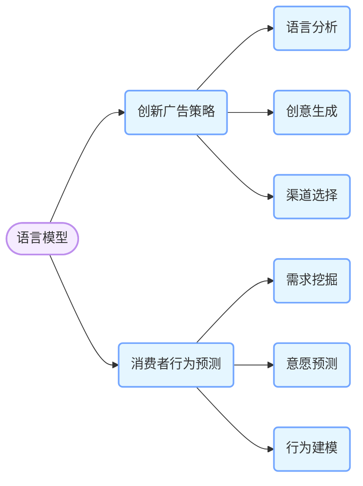

# 语言模型在创新广告策略与消费者行为预测中的多维度研究

> 关键词：语言模型、创新广告策略、消费者行为预测、多维度研究、自然语言处理、机器学习、市场营销

> 摘要：本文聚焦于语言模型在创新广告策略制定与消费者行为预测领域的多维度研究。首先阐述了研究的背景与目的，明确了预期读者与文档结构。接着深入剖析语言模型的核心概念、算法原理，结合数学模型进行详细讲解。通过项目实战展示了语言模型在实际应用中的代码实现与解读。探讨了其在不同场景下的实际应用，推荐了相关学习资源、开发工具及论文著作。最后总结了语言模型在该领域的未来发展趋势与挑战，并对常见问题进行了解答，为相关领域的研究与实践提供了全面且深入的参考。

## 1. 背景介绍 
### 1.1 目的和范围
在当今数字化营销时代，广告策略的创新以及对消费者行为的精准预测成为企业提升市场竞争力的关键。语言模型作为自然语言处理领域的重要技术，能够对大量文本数据进行分析和理解，为广告策略的制定和消费者行为的预测提供有力支持。本研究的目的在于深入探讨语言模型在这两个领域的应用，通过多维度的分析，挖掘语言模型的潜力，为企业提供更有效的广告策略和更准确的消费者行为预测方法。研究范围涵盖了语言模型的基本原理、算法实现、实际应用案例以及未来发展趋势等方面。

### 1.2 预期读者
本文预期读者包括市场营销领域的从业者，如广告策划师、市场分析师等，他们可以从本文中获取语言模型在广告策略和消费者行为预测方面的应用思路和方法；自然语言处理和机器学习领域的研究人员和开发者，他们可以了解语言模型在实际业务场景中的具体应用需求和挑战；以及对数字化营销和人工智能技术感兴趣的学者和学生，通过本文可以深入了解语言模型在跨学科领域的应用价值。

### 1.3 文档结构概述
本文首先介绍研究的背景信息，包括目的、预期读者和文档结构。接着阐述语言模型的核心概念与联系，通过文本示意图和 Mermaid 流程图展示其原理和架构。然后详细讲解语言模型的核心算法原理和具体操作步骤，结合 Python 源代码进行说明。再通过数学模型和公式对语言模型进行深入分析，并举例说明。之后通过项目实战展示语言模型在创新广告策略和消费者行为预测中的代码实现和详细解释。接着探讨语言模型在实际应用中的场景。随后推荐相关的学习资源、开发工具和论文著作。最后总结语言模型在该领域的未来发展趋势与挑战，解答常见问题，并提供扩展阅读和参考资料。

### 1.4 术语表
#### 1.4.1 核心术语定义
- **语言模型**：是一种对自然语言进行建模的统计模型，用于计算一个句子或一段文本出现的概率，以及预测下一个可能出现的词。
- **创新广告策略**：指企业为了吸引消费者、提高品牌知名度和促进销售，采用新颖、独特的广告手段和方法制定的广告计划。
- **消费者行为预测**：通过对消费者的历史数据、行为模式、偏好等信息进行分析和挖掘，预测消费者未来的购买行为、品牌选择等。
- **自然语言处理（NLP）**：是人工智能的一个重要分支，主要研究如何让计算机理解、处理和生成自然语言。
- **机器学习**：是一门多领域交叉学科，涉及概率论、统计学、逼近论、凸分析、算法复杂度理论等多门学科。它专门研究计算机怎样模拟或实现人类的学习行为，以获取新的知识或技能，重新组织已有的知识结构使之不断改善自身的性能。

#### 1.4.2 相关概念解释
- **文本嵌入**：将文本转换为向量表示的过程，以便计算机能够处理和分析文本。常见的文本嵌入方法有词向量（如 Word2Vec、GloVe）和句向量（如 BERT 嵌入）。
- **情感分析**：是自然语言处理中的一项任务，用于判断文本所表达的情感倾向，如积极、消极或中性。
- **主题模型**：用于发现文本集合中的主题结构，将文本表示为主题的概率分布。常见的主题模型有潜在狄利克雷分配（LDA）。

#### 1.4.3 缩略词列表
- **NLP**：自然语言处理（Natural Language Processing）
- **LDA**：潜在狄利克雷分配（Latent Dirichlet Allocation）
- **BERT**：双向编码器表示来自变压器（Bidirectional Encoder Representations from Transformers）

## 2. 核心概念与联系 

### 语言模型的核心概念
语言模型的核心目标是对自然语言的概率分布进行建模。给定一个词序列 $w_1, w_2, \cdots, w_n$，语言模型的任务是计算该序列出现的概率 $P(w_1, w_2, \cdots, w_n)$。根据链式法则，这个概率可以分解为：

$$P(w_1, w_2, \cdots, w_n) = P(w_1)P(w_2|w_1)P(w_3|w_1, w_2) \cdots P(w_n|w_1, w_2, \cdots, w_{n-1})$$

在实际应用中，由于计算复杂度的原因，通常采用 $n$-gram 模型进行近似。$n$-gram 模型假设当前词的出现只依赖于前 $n - 1$ 个词，即：

$$P(w_i|w_1, w_2, \cdots, w_{i-1}) \approx P(w_i|w_{i - n + 1}, w_{i - n + 2}, \cdots, w_{i-1})$$

### 语言模型与创新广告策略的联系
语言模型可以帮助广告策划师更好地理解消费者的语言习惯和需求。通过对大量消费者文本数据的分析，语言模型可以提取出消费者关注的热点话题、情感倾向等信息。广告策划师可以根据这些信息制定更有针对性的广告策略，例如选择合适的广告语言、主题和传播渠道。此外，语言模型还可以用于生成创意广告文案，提高广告的吸引力和感染力。

### 语言模型与消费者行为预测的联系
消费者的文本数据，如评论、社交媒体帖子等，包含了丰富的关于消费者行为和偏好的信息。语言模型可以对这些文本数据进行分析和挖掘，提取出消费者的潜在需求、购买意愿等特征。通过将这些特征与消费者的历史购买数据相结合，机器学习模型可以更准确地预测消费者的未来行为，如购买产品的概率、购买时间等。

### 文本示意图
```plaintext
           语言模型
          /         \
  创新广告策略   消费者行为预测
    /   |   \         /   |   \
语言分析 创意生成 渠道选择  需求挖掘 意愿预测 行为建模
```

### Mermaid 流程图


## 3. 核心算法原理 & 具体操作步骤 

### 核心算法原理
在本研究中，我们主要使用基于深度学习的语言模型，如 BERT（Bidirectional Encoder Representations from Transformers）。BERT 是一种预训练的语言模型，它基于变压器（Transformer）架构，通过双向注意力机制来学习文本的上下文表示。

BERT 的训练过程分为两个阶段：预训练和微调。在预训练阶段，BERT 使用大规模的无监督文本数据进行训练，学习文本的通用语言表示。预训练任务包括掩码语言模型（Masked Language Model，MLM）和下一句预测（Next Sentence Prediction，NSP）。

- **掩码语言模型（MLM）**：随机选择输入文本中的一些词，将其替换为特殊的掩码标记（[MASK]），然后让模型预测这些被掩码的词。通过这种方式，模型可以学习到文本的上下文信息。
- **下一句预测（NSP）**：给定两个句子，模型需要判断这两个句子在原始文本中是否是连续的。这个任务可以帮助模型学习句子之间的语义关系。

在微调阶段，BERT 可以根据具体的任务进行微调，如文本分类、情感分析等。通过在预训练模型的基础上进行微调，可以大大提高模型在特定任务上的性能。

### Python 源代码实现
以下是一个使用 PyTorch 和 Transformers 库进行 BERT 文本分类的示例代码：

```python
import torch
from torch.utils.data import Dataset, DataLoader
from transformers import BertTokenizer, BertForSequenceClassification, AdamW
from sklearn.model_selection import train_test_split
import pandas as pd

# 定义数据集类
class TextDataset(Dataset):
    def __init__(self, texts, labels, tokenizer, max_length):
        self.texts = texts
        self.labels = labels
        self.tokenizer = tokenizer
        self.max_length = max_length

    def __len__(self):
        return len(self.texts)

    def __getitem__(self, idx):
        text = self.texts[idx]
        label = self.labels[idx]
        encoding = self.tokenizer.encode_plus(
            text,
            add_special_tokens=True,
            max_length=self.max_length,
            padding='max_length',
            truncation=True,
            return_tensors='pt'
        )
        return {
            'input_ids': encoding['input_ids'].flatten(),
            'attention_mask': encoding['attention_mask'].flatten(),
            'labels': torch.tensor(label, dtype=torch.long)
        }

# 加载数据
data = pd.read_csv('data.csv')
texts = data['text'].tolist()
labels = data['label'].tolist()

# 划分训练集和测试集
train_texts, test_texts, train_labels, test_labels = train_test_split(texts, labels, test_size=0.2, random_state=42)

# 加载预训练的 BERT 分词器和模型
tokenizer = BertTokenizer.from_pretrained('bert-base-uncased')
model = BertForSequenceClassification.from_pretrained('bert-base-uncased', num_labels=len(set(labels)))

# 创建数据集和数据加载器
train_dataset = TextDataset(train_texts, train_labels, tokenizer, max_length=128)
test_dataset = TextDataset(test_texts, test_labels, tokenizer, max_length=128)

train_dataloader = DataLoader(train_dataset, batch_size=16, shuffle=True)
test_dataloader = DataLoader(test_dataset, batch_size=16, shuffle=False)

# 定义优化器和训练参数
optimizer = AdamW(model.parameters(), lr=2e-5)
device = torch.device('cuda' if torch.cuda.is_available() else 'cpu')
model.to(device)

# 训练模型
num_epochs = 3
for epoch in range(num_epochs):
    model.train()
    total_loss = 0
    for batch in train_dataloader:
        input_ids = batch['input_ids'].to(device)
        attention_mask = batch['attention_mask'].to(device)
        labels = batch['labels'].to(device)

        model.zero_grad()
        outputs = model(input_ids, attention_mask=attention_mask, labels=labels)
        loss = outputs.loss
        loss.backward()
        optimizer.step()
        total_loss += loss.item()

    print(f'Epoch {epoch + 1}, Loss: {total_loss / len(train_dataloader)}')

# 评估模型
model.eval()
correct_predictions = 0
total_predictions = 0
with torch.no_grad():
    for batch in test_dataloader:
        input_ids = batch['input_ids'].to(device)
        attention_mask = batch['attention_mask'].to(device)
        labels = batch['labels'].to(device)

        outputs = model(input_ids, attention_mask=attention_mask)
        logits = outputs.logits
        predictions = torch.argmax(logits, dim=1)
        correct_predictions += (predictions == labels).sum().item()
        total_predictions += labels.size(0)

print(f'Accuracy: {correct_predictions / total_predictions}')
```

### 具体操作步骤
1. **数据准备**：收集和整理与广告和消费者行为相关的文本数据，并将其标注为不同的类别。
2. **分词处理**：使用预训练的 BERT 分词器将文本数据转换为模型可以处理的输入格式。
3. **模型加载**：加载预训练的 BERT 模型，并根据具体任务调整模型的输出层。
4. **数据集创建**：创建训练集和测试集的数据集对象，并使用数据加载器进行批量处理。
5. **模型训练**：定义优化器和训练参数，对模型进行训练。
6. **模型评估**：在测试集上评估模型的性能，计算准确率等指标。

## 4. 数学模型和公式 & 详细讲解 & 举例说明 

### 掩码语言模型（MLM）的数学模型
在掩码语言模型中，给定输入文本 $X = [x_1, x_2, \cdots, x_n]$，随机选择其中的一些词进行掩码，得到掩码后的文本 $\tilde{X} = [\tilde{x}_1, \tilde{x}_2, \cdots, \tilde{x}_n]$。模型的目标是预测被掩码的词。

设被掩码的词的位置集合为 $M$，则模型的损失函数可以表示为：

$$L_{MLM} = -\sum_{i \in M} \log P(x_i|\tilde{X})$$

其中，$P(x_i|\tilde{X})$ 是模型预测位置 $i$ 处的词为 $x_i$ 的概率。

### 下一句预测（NSP）的数学模型
在 NSP 任务中，给定两个句子 $A$ 和 $B$，模型需要判断 $B$ 是否是 $A$ 的下一句。设标签 $y$ 表示 $B$ 是否是 $A$ 的下一句（$y = 1$ 表示是，$y = 0$ 表示不是），模型的输出是一个概率分布 $P(y|\theta, A, B)$，其中 $\theta$ 是模型的参数。

NSP 的损失函数可以表示为交叉熵损失：

$$L_{NSP} = -\sum_{y \in \{0, 1\}} y \log P(y|\theta, A, B) + (1 - y) \log (1 - P(y|\theta, A, B))$$

### 总损失函数
BERT 的总损失函数是 MLM 损失和 NSP 损失的加权和：

$$L = \alpha L_{MLM} + \beta L_{NSP}$$

其中，$\alpha$ 和 $\beta$ 是超参数，通常设置为 $\alpha = \beta = 1$。

### 举例说明
假设我们有以下文本：
```plaintext
句子 A: 今天天气很好。
句子 B: 我打算出去散步。
```
在 MLM 任务中，我们可能会随机掩码句子 A 中的“天气”这个词，得到掩码后的句子：
```plaintext
句子 A': 今天 [MASK] 很好。
```
模型的任务是预测 [MASK] 处的词为“天气”。

在 NSP 任务中，由于句子 B 是句子 A 的下一句，所以标签 $y = 1$。模型需要输出一个概率，预测句子 B 是句子 A 的下一句的概率。

## 5. 项目实战：代码实际案例和详细解释说明 

### 5.1  开发环境搭建
- **操作系统**：推荐使用 Linux 或 macOS 系统，也可以使用 Windows 系统。
- **Python 环境**：建议使用 Python 3.7 及以上版本。可以使用 Anaconda 或 Miniconda 来管理 Python 环境。
- **深度学习框架**：使用 PyTorch 作为深度学习框架，可以通过以下命令安装：
```bash
pip install torch torchvision torchaudio
```
- **Transformers 库**：使用 Hugging Face 的 Transformers 库来加载和使用预训练的 BERT 模型，可以通过以下命令安装：
```bash
pip install transformers
```
- **其他依赖库**：还需要安装 pandas、scikit-learn 等库，可以通过以下命令安装：
```bash
pip install pandas scikit-learn
```

### 5.2  源代码详细实现和代码解读
```python
import torch
from torch.utils.data import Dataset, DataLoader
from transformers import BertTokenizer, BertForSequenceClassification, AdamW
from sklearn.model_selection import train_test_split
import pandas as pd

# 定义数据集类
class TextDataset(Dataset):
    def __init__(self, texts, labels, tokenizer, max_length):
        self.texts = texts
        self.labels = labels
        self.tokenizer = tokenizer
        self.max_length = max_length

    def __len__(self):
        return len(self.texts)

    def __getitem__(self, idx):
        text = self.texts[idx]
        label = self.labels[idx]
        encoding = self.tokenizer.encode_plus(
            text,
            add_special_tokens=True,
            max_length=self.max_length,
            padding='max_length',
            truncation=True,
            return_tensors='pt'
        )
        return {
            'input_ids': encoding['input_ids'].flatten(),
            'attention_mask': encoding['attention_mask'].flatten(),
            'labels': torch.tensor(label, dtype=torch.long)
        }

# 加载数据
data = pd.read_csv('data.csv')
texts = data['text'].tolist()
labels = data['label'].tolist()

# 划分训练集和测试集
train_texts, test_texts, train_labels, test_labels = train_test_split(texts, labels, test_size=0.2, random_state=42)

# 加载预训练的 BERT 分词器和模型
tokenizer = BertTokenizer.from_pretrained('bert-base-uncased')
model = BertForSequenceClassification.from_pretrained('bert-base-uncased', num_labels=len(set(labels)))

# 创建数据集和数据加载器
train_dataset = TextDataset(train_texts, train_labels, tokenizer, max_length=128)
test_dataset = TextDataset(test_texts, test_labels, tokenizer, max_length=128)

train_dataloader = DataLoader(train_dataset, batch_size=16, shuffle=True)
test_dataloader = DataLoader(test_dataset, batch_size=16, shuffle=False)

# 定义优化器和训练参数
optimizer = AdamW(model.parameters(), lr=2e-5)
device = torch.device('cuda' if torch.cuda.is_available() else 'cpu')
model.to(device)

# 训练模型
num_epochs = 3
for epoch in range(num_epochs):
    model.train()
    total_loss = 0
    for batch in train_dataloader:
        input_ids = batch['input_ids'].to(device)
        attention_mask = batch['attention_mask'].to(device)
        labels = batch['labels'].to(device)

        model.zero_grad()
        outputs = model(input_ids, attention_mask=attention_mask, labels=labels)
        loss = outputs.loss
        loss.backward()
        optimizer.step()
        total_loss += loss.item()

    print(f'Epoch {epoch + 1}, Loss: {total_loss / len(train_dataloader)}')

# 评估模型
model.eval()
correct_predictions = 0
total_predictions = 0
with torch.no_grad():
    for batch in test_dataloader:
        input_ids = batch['input_ids'].to(device)
        attention_mask = batch['attention_mask'].to(device)
        labels = batch['labels'].to(device)

        outputs = model(input_ids, attention_mask=attention_mask)
        logits = outputs.logits
        predictions = torch.argmax(logits, dim=1)
        correct_predictions += (predictions == labels).sum().item()
        total_predictions += labels.size(0)

print(f'Accuracy: {correct_predictions / total_predictions}')
```

### 代码解读与分析
1. **数据集类定义**：`TextDataset` 类继承自 `torch.utils.data.Dataset`，用于封装文本数据和标签。在 `__getitem__` 方法中，使用 BERT 分词器将文本转换为输入格式，并返回输入 ID、注意力掩码和标签。
2. **数据加载**：使用 `pandas` 库读取 CSV 文件中的数据，并将文本和标签分别存储在列表中。
3. **数据集划分**：使用 `sklearn.model_selection.train_test_split` 函数将数据划分为训练集和测试集。
4. **模型加载**：使用 `BertTokenizer.from_pretrained` 加载预训练的 BERT 分词器，使用 `BertForSequenceClassification.from_pretrained` 加载预训练的 BERT 模型，并根据标签的数量调整模型的输出层。
5. **数据集和数据加载器创建**：创建训练集和测试集的数据集对象，并使用 `DataLoader` 进行批量处理。
6. **优化器和训练参数定义**：使用 `AdamW` 优化器，并根据设备情况选择使用 GPU 或 CPU 进行训练。
7. **模型训练**：在每个 epoch 中，将模型设置为训练模式，遍历训练数据加载器，计算损失并进行反向传播和参数更新。
8. **模型评估**：将模型设置为评估模式，遍历测试数据加载器，计算预测准确率。

## 6. 实际应用场景 
### 创新广告策略方面
- **个性化广告推荐**：通过语言模型分析消费者的文本数据，了解消费者的兴趣爱好、购买历史等信息，为消费者推荐个性化的广告内容。例如，根据消费者在社交媒体上的评论和点赞，推荐与之相关的产品广告。
- **广告创意生成**：语言模型可以生成新颖、独特的广告文案。广告策划师可以输入一些关键词和要求，语言模型可以生成多个广告文案供选择。例如，输入“运动品牌，夏季促销”，语言模型可以生成不同风格的广告文案，如幽默风趣、时尚大气等。
- **广告渠道选择**：通过分析不同渠道上的消费者文本数据，了解消费者在各个渠道上的活跃程度和偏好，选择最适合的广告渠道。例如，如果发现某个品牌的消费者在社交媒体上的讨论热度较高，可以选择在社交媒体上投放广告。

### 消费者行为预测方面
- **购买意愿预测**：通过语言模型分析消费者的文本数据，如产品评论、购物咨询等，判断消费者的购买意愿。例如，如果消费者在评论中表达了对某个产品的强烈兴趣和需求，那么该消费者购买该产品的可能性较大。
- **品牌忠诚度预测**：通过分析消费者的长期文本数据，了解消费者对不同品牌的态度和评价，预测消费者的品牌忠诚度。例如，如果消费者在多个场合都对某个品牌表示赞赏和支持，那么该消费者对该品牌的忠诚度较高。
- **消费趋势预测**：通过分析大量消费者的文本数据，发现消费趋势的变化。例如，如果在某个时间段内，消费者对环保产品的讨论增多，那么可以预测环保产品的消费趋势将会上升。

## 7. 工具和资源推荐
### 7.1 学习资源推荐
#### 7.1.1 书籍推荐
- 《深度学习》（Deep Learning）：由 Ian Goodfellow、Yoshua Bengio 和 Aaron Courville 所著，是深度学习领域的经典教材，涵盖了深度学习的基本概念、算法和应用。
- 《自然语言处理入门》（Natural Language Processing in Action）：由 Hobson Lane、Cole Howard 和 Hannes Hapke 所著，介绍了自然语言处理的基本技术和应用，包括文本分类、情感分析、命名实体识别等。
- 《Python 自然语言处理》（Natural Language Processing with Python）：由 Steven Bird、Ewan Klein 和 Edward Loper 所著，使用 Python 语言介绍了自然语言处理的基本技术和工具，是学习自然语言处理的入门书籍。

#### 7.1.2 在线课程
- Coursera 上的“深度学习专项课程”（Deep Learning Specialization）：由 Andrew Ng 教授授课，涵盖了深度学习的各个方面，包括神经网络、卷积神经网络、循环神经网络等。
- edX 上的“自然语言处理基础”（Foundations of Natural Language Processing）：由宾夕法尼亚大学的 Mark Dredze 教授授课，介绍了自然语言处理的基本概念、算法和应用。
- 哔哩哔哩上的“李宏毅机器学习课程”：由台湾大学的李宏毅教授授课，课程内容生动有趣，适合初学者学习机器学习和深度学习。

#### 7.1.3 技术博客和网站
- Hugging Face Blog：提供了关于自然语言处理和深度学习的最新研究成果和技术文章，特别是关于 Transformers 库的使用和应用。
- Medium 上的 Towards Data Science：是一个数据科学和机器学习领域的技术博客，有很多关于自然语言处理和深度学习的优质文章。
- 机器之心：是一个专注于人工智能领域的媒体平台，提供了最新的人工智能技术动态、研究成果和应用案例。

### 7.2 开发工具框架推荐
#### 7.2.1 IDE和编辑器
- PyCharm：是一款专门为 Python 开发设计的集成开发环境（IDE），具有代码编辑、调试、版本控制等功能，非常适合开发深度学习和自然语言处理项目。
- Visual Studio Code：是一款轻量级的代码编辑器，支持多种编程语言和插件，通过安装相关插件可以实现 Python 开发、代码调试等功能。
- Jupyter Notebook：是一个交互式的开发环境，适合进行数据探索、模型训练和实验验证。可以在浏览器中直接编写和运行代码，并查看代码的执行结果。

#### 7.2.2 调试和性能分析工具
- PyTorch Profiler：是 PyTorch 提供的性能分析工具，可以帮助开发者分析模型的训练和推理过程中的性能瓶颈，如 GPU 利用率、内存使用情况等。
- TensorBoard：是 TensorFlow 提供的可视化工具，也可以与 PyTorch 结合使用。可以通过 TensorBoard 可视化模型的训练过程、损失曲线、准确率等指标。
- NVIDIA Nsight Systems：是 NVIDIA 提供的性能分析工具，专门用于分析 GPU 应用程序的性能。可以帮助开发者优化 GPU 代码，提高模型的训练和推理速度。

#### 7.2.3 相关框架和库
- PyTorch：是一个开源的深度学习框架，提供了丰富的深度学习模型和工具，支持 GPU 加速，非常适合开发自然语言处理和深度学习项目。
- Transformers：是 Hugging Face 开发的一个开源库，提供了多种预训练的语言模型，如 BERT、GPT、RoBERTa 等，以及相应的分词器和工具，方便开发者使用和微调这些模型。
- Scikit-learn：是一个开源的机器学习库，提供了多种机器学习算法和工具，如分类、回归、聚类等，适合进行数据预处理、模型选择和评估等任务。

### 7.3 相关论文著作推荐
#### 7.3.1 经典论文
- “Attention Is All You Need”：提出了变压器（Transformer）架构，是自然语言处理领域的重要突破，为后续的预训练语言模型奠定了基础。
- “BERT: Pre-training of Deep Bidirectional Transformers for Language Understanding”：介绍了 BERT 模型的预训练和微调方法，在多个自然语言处理任务上取得了优异的成绩。
- “Distributed Representations of Words and Phrases and their Compositionality”：提出了 Word2Vec 算法，用于学习词的向量表示，是自然语言处理领域的经典算法之一。

#### 7.3.2 最新研究成果
- 关注 ACL（Association for Computational Linguistics）、EMNLP（Conference on Empirical Methods in Natural Language Processing）等自然语言处理领域的顶级会议，这些会议上会发布最新的研究成果和技术进展。
- 关注 arXiv 预印本平台，许多研究人员会在该平台上发布最新的研究论文。

#### 7.3.3 应用案例分析
- 可以参考一些企业和研究机构发布的关于语言模型在广告和消费者行为预测方面的应用案例，了解实际应用中的挑战和解决方案。例如，谷歌、Facebook 等公司在广告领域的研究和实践。

## 8. 总结：未来发展趋势与挑战
### 未来发展趋势
- **多模态融合**：未来的语言模型将不仅仅局限于文本数据，还会融合图像、音频、视频等多模态数据，从而更全面地理解消费者的行为和需求。例如，结合消费者的图片评论和视频分享，更好地分析消费者的兴趣爱好。
- **个性化和定制化**：随着消费者对个性化体验的需求不断增加，语言模型将更加注重个性化和定制化。通过对每个消费者的独特数据进行分析，为消费者提供更加个性化的广告和服务。
- **实时性和动态性**：在快速变化的市场环境中，语言模型需要具备实时性和动态性，能够及时捕捉消费者行为和市场趋势的变化，为企业提供及时的决策支持。
- **跨领域应用**：语言模型将在更多领域得到应用，如医疗、金融、教育等。通过与其他领域的知识和技术相结合，为这些领域带来新的发展机遇。

### 挑战
- **数据隐私和安全**：语言模型的训练和应用需要大量的消费者数据，这些数据涉及到消费者的隐私和安全。如何在保护消费者隐私和安全的前提下，合理使用和分析这些数据是一个重要的挑战。
- **模型可解释性**：许多深度学习模型，如 BERT 等，是黑盒模型，其决策过程难以解释。在广告和消费者行为预测等领域，模型的可解释性非常重要，因为企业需要了解模型的决策依据，以便做出合理的决策。
- **计算资源和成本**：训练和运行大规模的语言模型需要大量的计算资源和成本。如何降低计算资源的需求和成本，提高模型的效率和可扩展性是一个亟待解决的问题。
- **语言多样性和文化差异**：不同地区和文化背景的消费者使用的语言和表达方式存在差异。语言模型需要能够处理这些语言多样性和文化差异，以提高在不同地区和文化背景下的应用效果。

## 9. 附录：常见问题与解答
### 问题 1：如何选择合适的语言模型？
答：选择合适的语言模型需要考虑多个因素，如任务类型、数据规模、计算资源等。如果是简单的文本分类任务，可以选择一些轻量级的预训练模型，如 DistilBERT；如果是复杂的自然语言生成任务，可以选择 GPT 系列的模型。此外，还需要根据数据规模和计算资源来选择合适的模型大小。

### 问题 2：如何处理数据不平衡问题？
答：数据不平衡是指不同类别的样本数量差异较大的问题。可以采用以下方法来处理数据不平衡问题：
- **数据增强**：通过对少数类样本进行复制、修改等操作，增加少数类样本的数量。
- **重采样**：可以采用过采样（如 SMOTE 算法）或欠采样的方法来平衡数据。
- **调整损失函数**：可以在损失函数中对不同类别的样本进行加权，增加少数类样本的权重。

### 问题 3：如何提高模型的性能？
答：可以从以下几个方面提高模型的性能：
- **数据质量**：确保数据的准确性、完整性和一致性，对数据进行清洗和预处理。
- **模型选择和调优**：选择合适的模型，并对模型的超参数进行调优，如学习率、批次大小等。
- **特征工程**：提取和选择有意义的特征，提高模型的输入质量。
- **集成学习**：可以采用集成学习的方法，将多个模型的预测结果进行融合，提高模型的性能。

### 问题 4：语言模型在实际应用中可能会遇到哪些问题？
答：语言模型在实际应用中可能会遇到以下问题：
- **语义理解不准确**：语言模型可能无法准确理解一些复杂的语义和语境，导致预测结果不准确。
- **数据偏差**：训练数据可能存在偏差，导致模型在某些情况下表现不佳。
- **计算资源限制**：训练和运行大规模的语言模型需要大量的计算资源，可能会受到硬件设备的限制。
- **实时性要求**：在一些实时应用场景中，语言模型的推理速度可能无法满足要求。

## 10. 扩展阅读 & 参考资料
### 扩展阅读
- 《人工智能时代的营销革命》：探讨了人工智能技术在营销领域的应用和发展趋势，对语言模型在广告和消费者行为预测方面的应用有更深入的分析。
- 《数据驱动的营销决策》：介绍了如何利用数据来制定营销决策，包括消费者行为分析、广告策略优化等方面的内容。

### 参考资料
- Hugging Face 官方文档：https://huggingface.co/docs/transformers/index
- PyTorch 官方文档：https://pytorch.org/docs/stable/index.html
- Scikit-learn 官方文档：https://scikit-learn.org/stable/documentation.html