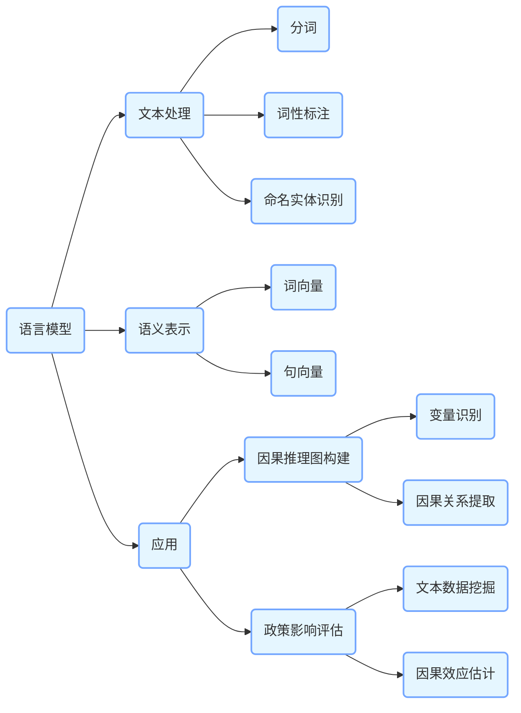

# 语言模型在因果推理图构建与政策影响评估中的研究进展

> 关键词：语言模型、因果推理图构建、政策影响评估、研究进展、自然语言处理

> 摘要：本文聚焦于语言模型在因果推理图构建与政策影响评估领域的研究进展。首先介绍了该研究的背景，包括目的、预期读者、文档结构和相关术语。接着阐述了核心概念及其联系，给出了原理和架构的文本示意图与 Mermaid 流程图。详细讲解了核心算法原理，并用 Python 代码进行说明，同时介绍了相关的数学模型和公式。通过项目实战，展示了代码的实际案例和详细解释。分析了该技术的实际应用场景，推荐了相关的学习资源、开发工具框架和论文著作。最后总结了未来发展趋势与挑战，提供了常见问题解答和扩展阅读参考资料。旨在全面深入地探讨语言模型在因果推理图构建与政策影响评估中的应用和发展。

## 1. 背景介绍 
### 1.1 目的和范围
随着社会的发展，政策的制定和评估变得愈发重要。准确评估政策的影响能够帮助政策制定者做出更科学合理的决策，而因果推理图则是理解政策因果关系的有效工具。语言模型在自然语言处理领域取得了显著进展，其强大的语义理解和知识表示能力为因果推理图构建和政策影响评估提供了新的思路和方法。

本研究的目的在于系统地梳理语言模型在因果推理图构建与政策影响评估中的应用现状、技术方法和研究趋势。范围涵盖了从基础的因果推理理论到实际的政策评估案例，涉及自然语言处理、机器学习、统计学等多个领域的知识和技术。

### 1.2 预期读者
本文预期读者包括从事自然语言处理、机器学习、政策研究等领域的科研人员，希望了解语言模型在政策评估中应用的政策制定者和相关从业人员，以及对该领域感兴趣的研究生和本科生。

### 1.3 文档结构概述
本文将按照以下结构展开：首先介绍相关的核心概念和联系，包括因果推理图、语言模型和政策影响评估的基本原理和它们之间的关系；接着详细阐述核心算法原理和具体操作步骤，并用 Python 代码进行示例；介绍相关的数学模型和公式，并通过举例说明其应用；进行项目实战，展示代码的实际实现和解读；分析该技术在实际中的应用场景；推荐相关的学习资源、开发工具框架和论文著作；最后总结未来发展趋势与挑战，提供常见问题解答和扩展阅读参考资料。

### 1.4 术语表
#### 1.4.1 核心术语定义
- **语言模型**：是一种基于概率统计或深度学习的模型，用于对自然语言文本进行建模和处理，能够预测文本中单词或短语的出现概率。常见的语言模型有 BERT、GPT 等。
- **因果推理图**：是一种图形化的表示方法，用于描述变量之间的因果关系。节点表示变量，边表示因果关系，通过因果推理图可以直观地分析变量之间的因果影响。
- **政策影响评估**：是指对政策实施后产生的效果和影响进行评估和分析，以确定政策的有效性和合理性，为政策的调整和优化提供依据。

#### 1.4.2 相关概念解释
- **自然语言处理（NLP）**：是人工智能的一个重要分支，研究如何让计算机理解和处理自然语言。语言模型是自然语言处理中的重要工具，用于文本分类、情感分析、机器翻译等任务。
- **机器学习**：是一门多领域交叉学科，涉及概率论、统计学、逼近论、凸分析、算法复杂度理论等多门学科。它专门研究计算机怎样模拟或实现人类的学习行为，以获取新的知识或技能，重新组织已有的知识结构使之不断改善自身的性能。在因果推理图构建和政策影响评估中，机器学习算法可用于数据挖掘、模型训练等。
- **统计学**：是通过搜索、整理、分析、描述数据等手段，以达到推断所测对象的本质，甚至预测对象未来的一门综合性科学。在政策影响评估中，统计学方法可用于数据的收集、整理和分析，以评估政策的效果。

#### 1.4.3 缩略词列表
- **BERT**：Bidirectional Encoder Representations from Transformers，基于变换器的双向编码器表示
- **GPT**：Generative Pretrained Transformer，生成式预训练变换器
- **NLP**：Natural Language Processing，自然语言处理

## 2. 核心概念与联系 

### 核心概念原理
#### 语言模型原理
语言模型的核心思想是根据给定的上下文预测下一个单词或短语的概率。以 BERT 为例，它是一种基于变换器（Transformer）架构的双向编码器。BERT 通过在大规模文本数据上进行无监督学习，学习到文本的语义表示。其训练过程包括掩码语言模型（Masked Language Model，MLM）和下一句预测（Next Sentence Prediction，NSP）两个任务。

在 MLM 任务中，BERT 会随机掩码输入文本中的一些单词，然后预测这些掩码单词。通过这种方式，BERT 可以学习到单词之间的上下文关系。在 NSP 任务中，BERT 会判断两个句子是否是连续的，从而学习到句子之间的逻辑关系。

#### 因果推理图原理
因果推理图基于因果关系理论，通过图形化的方式表示变量之间的因果关系。常见的因果推理图有有向无环图（Directed Acyclic Graph，DAG）。在 DAG 中，节点表示变量，有向边表示因果关系。例如，在政策影响评估中，节点可以表示政策变量、中间变量和结果变量，边表示这些变量之间的因果影响。

因果推理图的构建通常基于领域知识、数据挖掘和因果推断算法。通过分析变量之间的相关性和因果关系，可以构建出合理的因果推理图。

#### 政策影响评估原理
政策影响评估的基本原理是通过比较政策实施前后的结果变量，或者比较实施政策和未实施政策的不同群体的结果变量，来评估政策的影响。常见的评估方法有实验研究和观察性研究。

在实验研究中，研究人员会随机将研究对象分为实验组和对照组，对实验组实施政策，对对照组不实施政策，然后比较两组的结果变量。在观察性研究中，研究人员通过收集和分析现有的数据，利用因果推断方法来评估政策的影响。

### 核心概念架构的文本示意图
```plaintext
语言模型
|
|-- 文本处理
|   |-- 分词
|   |-- 词性标注
|   |-- 命名实体识别
|
|-- 语义表示
|   |-- 词向量
|   |-- 句向量
|
|-- 应用
|   |-- 因果推理图构建
|   |   |-- 变量识别
|   |   |-- 因果关系提取
|   |
|   |-- 政策影响评估
|       |-- 文本数据挖掘
|       |-- 因果效应估计
```

### Mermaid 流程图


## 3. 核心算法原理 & 具体操作步骤 

### 核心算法原理
#### 基于语言模型的因果关系提取算法
基于语言模型的因果关系提取算法主要利用语言模型的语义理解能力，从文本中提取因果关系。具体步骤如下：
1. **文本预处理**：对输入的文本进行分词、词性标注、命名实体识别等处理，将文本转换为适合语言模型处理的格式。
2. **特征提取**：使用语言模型对预处理后的文本进行编码，提取文本的语义特征。
3. **因果关系分类**：利用分类器（如支持向量机、神经网络等）对提取的特征进行分类，判断文本中是否存在因果关系，并确定因果关系的类型。

#### 因果推理图构建算法
因果推理图构建算法通常基于因果发现算法和领域知识。常见的因果发现算法有 PC 算法、FCI 算法等。以 PC 算法为例，其基本步骤如下：
1. **初始化**：构建一个完全无向图，节点表示变量。
2. **独立性检验**：对每对节点进行独立性检验，根据检验结果删除不相关的边。
3. **方向确定**：通过分析节点之间的条件独立性关系，确定边的方向，最终得到有向无环图。

### 具体操作步骤及 Python 代码示例
#### 基于语言模型的因果关系提取
```python
import torch
from transformers import BertTokenizer, BertForSequenceClassification

# 加载预训练的 BERT 模型和分词器
tokenizer = BertTokenizer.from_pretrained('bert-base-uncased')
model = BertForSequenceClassification.from_pretrained('bert-base-uncased', num_labels=2)

# 输入文本
text = "The increase in taxes led to a decrease in consumer spending."

# 文本预处理
inputs = tokenizer(text, return_tensors='pt')

# 模型预测
with torch.no_grad():
    outputs = model(**inputs)
    logits = outputs.logits
    prediction = torch.argmax(logits, dim=1).item()

if prediction == 1:
    print("文本中存在因果关系")
else:
    print("文本中不存在因果关系")
```
#### 因果推理图构建（使用 PC 算法）
```python
import numpy as np
from causallearn.search.ConstraintBased.PC import pc
from causallearn.utils.cit import chisq

# 生成示例数据
data = np.random.randn(100, 3)

# 使用 PC 算法构建因果推理图
cg = pc(data, 0.05, chisq, node_names=['X', 'Y', 'Z'])

# 输出因果推理图
print(cg.G)
```

## 4. 数学模型和公式 & 详细讲解 & 举例说明 

### 语言模型的数学模型
#### 掩码语言模型（MLM）
在 MLM 中，给定输入文本 $x = [x_1, x_2, \cdots, x_n]$，随机掩码其中的一些单词，得到掩码文本 $\tilde{x}$。语言模型的目标是最大化预测掩码单词的概率，即：
$$
\mathcal{L}_{MLM} = -\sum_{i \in \mathcal{M}} \log p(x_i | \tilde{x})
$$
其中，$\mathcal{M}$ 是掩码单词的索引集合，$p(x_i | \tilde{x})$ 是在掩码文本 $\tilde{x}$ 的条件下预测单词 $x_i$ 的概率。

#### 下一句预测（NSP）
给定两个句子 $A$ 和 $B$，语言模型的目标是判断 $B$ 是否是 $A$ 的下一句。定义标签 $y$，$y = 1$ 表示 $B$ 是 $A$ 的下一句，$y = 0$ 表示 $B$ 不是 $A$ 的下一句。NSP 的损失函数为：
$$
\mathcal{L}_{NSP} = - \sum_{i=1}^{N} [y_i \log p(y_i = 1 | A, B) + (1 - y_i) \log p(y_i = 0 | A, B)]
$$
其中，$N$ 是样本数量，$p(y_i | A, B)$ 是在句子 $A$ 和 $B$ 的条件下预测标签 $y_i$ 的概率。

### 因果推理的数学模型
#### 因果效应估计
在政策影响评估中，常用的因果效应估计方法是平均处理效应（Average Treatment Effect，ATE）。假设 $Y(1)$ 表示接受政策处理的结果变量，$Y(0)$ 表示未接受政策处理的结果变量，ATE 的定义为：
$$
ATE = E[Y(1) - Y(0)]
$$
其中，$E$ 表示期望。由于在实际中无法同时观察到 $Y(1)$ 和 $Y(0)$，需要使用因果推断方法来估计 ATE。

### 举例说明
#### 语言模型的 MLM 示例
假设输入文本为 "The dog chased the cat."，随机掩码 "chased" 这个单词，得到掩码文本 "The dog [MASK] the cat."。语言模型需要预测 "[MASK]" 位置的单词。通过计算 $p(\text{chased} | \text{The dog [MASK] the cat.})$，并最大化该概率来训练模型。

#### 因果效应估计示例
假设研究一项教育政策对学生成绩的影响。将学生随机分为实验组（接受政策处理）和对照组（未接受政策处理）。实验组学生的平均成绩为 80 分，对照组学生的平均成绩为 70 分。则该政策的 ATE 估计值为 $80 - 70 = 10$ 分。

## 5. 项目实战：代码实际案例和详细解释说明 

### 5.1  开发环境搭建
#### 安装 Python
首先需要安装 Python 环境，建议使用 Python 3.7 及以上版本。可以从 Python 官方网站（https://www.python.org/downloads/）下载并安装。

#### 安装必要的库
使用 pip 安装所需的库，包括 `transformers`、`torch`、`causallearn` 等。
```sh
pip install transformers torch causallearn
```

### 5.2  源代码详细实现和代码解读
#### 基于语言模型的政策文本因果关系提取
```python
import torch
from transformers import BertTokenizer, BertForSequenceClassification

# 加载预训练的 BERT 模型和分词器
tokenizer = BertTokenizer.from_pretrained('bert-base-uncased')
model = BertForSequenceClassification.from_pretrained('bert-base-uncased', num_labels=2)

# 政策文本数据
policy_texts = [
    "The new tax policy led to a reduction in business investment.",
    "The education reform had no significant impact on student performance."
]

for text in policy_texts:
    # 文本预处理
    inputs = tokenizer(text, return_tensors='pt')

    # 模型预测
    with torch.no_grad():
        outputs = model(**inputs)
        logits = outputs.logits
        prediction = torch.argmax(logits, dim=1).item()

    if prediction == 1:
        print(f"文本 '{text}' 中存在因果关系")
    else:
        print(f"文本 '{text}' 中不存在因果关系")
```
**代码解读**：
1. **加载模型和分词器**：使用 `transformers` 库加载预训练的 BERT 模型和分词器。
2. **定义政策文本数据**：将需要分析的政策文本存储在列表中。
3. **文本预处理**：使用分词器将文本转换为适合模型输入的格式。
4. **模型预测**：使用模型对预处理后的文本进行预测，判断文本中是否存在因果关系。

#### 基于因果推理图的政策影响评估
```python
import numpy as np
from causallearn.search.ConstraintBased.PC import pc
from causallearn.utils.cit import chisq

# 生成政策相关数据
policy_data = np.random.randn(100, 4)

# 使用 PC 算法构建因果推理图
cg = pc(policy_data, 0.05, chisq, node_names=['Policy', 'Variable1', 'Variable2', 'Outcome'])

# 输出因果推理图
print(cg.G)

# 分析政策对结果变量的影响
# 这里可以根据因果推理图进行进一步的分析，例如计算因果效应
```
**代码解读**：
1. **生成政策相关数据**：使用 `numpy` 生成随机数据模拟政策相关变量。
2. **使用 PC 算法构建因果推理图**：调用 `causallearn` 库中的 `pc` 函数，根据数据构建因果推理图。
3. **输出因果推理图**：打印因果推理图的信息。
4. **分析政策对结果变量的影响**：可以根据因果推理图进行进一步的分析，例如计算因果效应。

### 5.3  代码解读与分析
#### 基于语言模型的因果关系提取代码分析
该代码利用预训练的 BERT 模型对政策文本进行因果关系判断。优点是可以利用 BERT 模型强大的语义理解能力，对复杂的文本进行准确的分析。缺点是需要大量的训练数据来微调模型，以提高模型的性能。

#### 基于因果推理图的政策影响评估代码分析
该代码使用 PC 算法构建因果推理图，通过分析变量之间的因果关系来评估政策的影响。优点是可以直观地展示变量之间的因果关系，便于进行深入的分析。缺点是 PC 算法对数据的质量和独立性假设要求较高，如果数据存在噪声或违反独立性假设，可能会导致因果推理图的不准确。

## 6. 实际应用场景 
### 政策制定与评估
在政策制定阶段，语言模型可以帮助政策制定者从大量的文本信息中提取相关的因果关系和影响因素，为政策的设计提供参考。在政策评估阶段，通过构建因果推理图和估计因果效应，可以准确评估政策的实施效果，为政策的调整和优化提供依据。

### 社会科学研究
在社会科学研究中，如经济学、社会学等领域，语言模型和因果推理图可以用于分析社会现象之间的因果关系。例如，分析经济政策对就业、通货膨胀等变量的影响，研究社会事件对公众态度和行为的影响等。

### 医疗健康领域
在医疗健康领域，语言模型可以从医学文献和临床记录中提取因果关系，帮助医生和研究人员了解疾病的发生机制和治疗效果。因果推理图可以用于评估医疗政策和干预措施对患者健康状况的影响，为医疗决策提供支持。

## 7. 工具和资源推荐
### 7.1 学习资源推荐
#### 7.1.1 书籍推荐
- 《自然语言处理入门》：介绍了自然语言处理的基本概念、算法和技术，适合初学者入门。
- 《因果推断：基础与方法》：详细讲解了因果推断的理论和方法，是学习因果推理的重要参考书籍。
- 《深度学习》：全面介绍了深度学习的原理、算法和应用，对于理解语言模型的工作原理有很大帮助。

#### 7.1.2 在线课程
- Coursera 上的 “Natural Language Processing Specialization”：提供了自然语言处理的系统学习课程，包括语言模型、文本分类、机器翻译等内容。
- edX 上的 “Causal Inference in Statistics: A Primer”：专门讲解因果推断的在线课程，由因果推断领域的专家授课。
- 网易云课堂上的 “深度学习实战”：通过实际项目案例，介绍深度学习的应用和开发技巧。

#### 7.1.3 技术博客和网站
- Hugging Face Blog：提供了关于语言模型的最新研究和应用案例，是了解语言模型发展动态的重要渠道。
- Towards Data Science：发表了大量关于数据科学、机器学习和自然语言处理的技术文章，有很多关于因果推理和政策评估的优秀文章。
- arXiv.org：是一个预印本服务器，提供了大量的学术论文，包括语言模型、因果推理等领域的最新研究成果。

### 7.2 开发工具框架推荐
#### 7.2.1 IDE和编辑器
- PyCharm：是一款专业的 Python 集成开发环境，提供了代码编辑、调试、版本控制等功能，适合开发 Python 项目。
- Jupyter Notebook：是一个交互式的开发环境，支持代码、文本、图表等多种形式的展示，方便进行数据分析和模型实验。
- Visual Studio Code：是一款轻量级的代码编辑器，支持多种编程语言，具有丰富的插件扩展功能。

#### 7.2.2 调试和性能分析工具
- PDB：是 Python 自带的调试器，可以用于调试 Python 代码，定位程序中的错误。
- TensorBoard：是 TensorFlow 提供的可视化工具，可以用于可视化模型的训练过程、性能指标等。
- cProfile：是 Python 标准库中的性能分析工具，可以分析代码的运行时间和函数调用次数，帮助优化代码性能。

#### 7.2.3 相关框架和库
- Transformers：是 Hugging Face 开发的一个用于自然语言处理的开源库，提供了多种预训练的语言模型，如 BERT、GPT 等，方便进行语言模型的开发和应用。
- Causal-learn：是一个用于因果发现和因果推断的 Python 库，提供了多种因果发现算法和因果效应估计方法。
- Scikit-learn：是一个常用的机器学习库，提供了多种机器学习算法和工具，可用于数据预处理、模型训练和评估等。

### 7.3 相关论文著作推荐
#### 7.3.1 经典论文
- “BERT: Pre-training of Deep Bidirectional Transformers for Language Understanding”：介绍了 BERT 模型的原理和训练方法，是自然语言处理领域的经典论文。
- “Causal Diagrams for Empirical Research”：提出了因果图的概念和方法，为因果推理提供了重要的理论基础。
- “The Central Role of the Propensity Score in Observational Studies for Causal Effects”：介绍了倾向得分在观察性研究中的应用，是因果效应估计的重要文献。

#### 7.3.2 最新研究成果
- 在 arXiv.org 上搜索 “Language models for causal inference” 和 “Policy impact evaluation using language models” 可以找到关于语言模型在因果推理和政策评估方面的最新研究成果。

#### 7.3.3 应用案例分析
- 可以在学术数据库（如 IEEE Xplore、ACM Digital Library 等）中搜索相关的应用案例分析论文，了解语言模型在实际政策评估中的应用和效果。

## 8. 总结：未来发展趋势与挑战
### 未来发展趋势
#### 多模态融合
未来的研究可能会将语言模型与其他模态的数据（如图像、音频等）进行融合，以更全面地构建因果推理图和评估政策影响。例如，结合图像数据可以更直观地了解政策实施后的社会现象变化。

#### 强化学习与因果推理的结合
强化学习可以用于优化政策的制定和实施过程，而因果推理可以提供更准确的因果关系信息。将两者结合可以实现更智能的政策决策和评估。

#### 跨领域应用拓展
语言模型在因果推理图构建和政策影响评估的应用将拓展到更多领域，如环境科学、交通运输等，为不同领域的政策制定和评估提供支持。

### 挑战
#### 数据质量和标注问题
因果推理和政策评估需要高质量的数据，包括准确的变量信息和因果关系标注。然而，实际数据往往存在噪声、缺失值等问题，并且因果关系的标注需要专业的领域知识，这增加了数据收集和处理的难度。

#### 模型解释性问题
语言模型通常是黑盒模型，其决策过程难以解释。在政策评估中，需要对模型的结果进行解释，以确保政策制定者能够理解和信任模型的评估结果。因此，提高模型的解释性是一个重要的挑战。

#### 因果关系的复杂性
现实世界中的因果关系往往非常复杂，存在多个中间变量和交互作用。如何准确地捕捉和表示这些复杂的因果关系是语言模型在因果推理图构建和政策影响评估中面临的挑战之一。

## 9. 附录：常见问题与解答
### 问题 1：语言模型在因果推理图构建中的优势是什么？
语言模型具有强大的语义理解能力，可以从大量的文本数据中提取因果关系信息。它可以处理自然语言文本，无需手动定义特征，能够自动学习文本中的语义和语法信息，从而更准确地识别变量和因果关系。

### 问题 2：如何评估因果推理图的准确性？
可以使用多种方法评估因果推理图的准确性，如基于独立性检验的方法、基于因果效应估计的方法等。此外，还可以通过与领域专家的知识进行比较，以及进行实际应用的验证来评估因果推理图的准确性。

### 问题 3：在政策影响评估中，如何处理数据的缺失值？
处理数据缺失值的方法有很多种，如删除缺失值、插补法（均值插补、中位数插补、回归插补等）、多重插补法等。选择合适的方法需要根据数据的特点和分析的目的来决定。

### 问题 4：语言模型需要多少训练数据才能达到较好的性能？
语言模型需要大量的训练数据才能达到较好的性能。具体的训练数据量取决于模型的复杂度、任务的难度和数据的质量等因素。一般来说，预训练的语言模型已经在大规模的文本数据上进行了训练，但在特定的任务中，还需要使用少量的标注数据进行微调。

## 10. 扩展阅读 & 参考资料
### 扩展阅读
- Pearl, J., Glymour, M., & Jewell, N. P. (2016). Causal inference in statistics: A primer. Wiley.
- Devlin, J., Chang, M. W., Lee, K., & Toutanova, K. (2018). BERT: Pre-training of Deep Bidirectional Transformers for Language Understanding. arXiv preprint arXiv:1810.04805.
- Rubin, D. B. (1974). Estimating causal effects of treatments in randomized and nonrandomized studies. Journal of educational Psychology, 66(5), 688.

### 参考资料
- Hugging Face 官方文档：https://huggingface.co/docs
- Causal-learn 官方文档：https://causal-learn.readthedocs.io/en/latest/
- Scikit-learn 官方文档：https://scikit-learn.org/stable/documentation.html