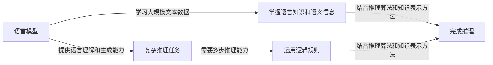

# 语言模型在复杂推理任务中的表现优化

> 关键词：语言模型、复杂推理任务、表现优化、推理算法、应用场景

> 摘要：本文聚焦于语言模型在复杂推理任务中的表现优化。首先介绍了相关背景，包括目的、预期读者等。接着阐述了语言模型和复杂推理任务的核心概念及联系，详细讲解了用于优化表现的核心算法原理和具体操作步骤，并通过Python代码进行说明。同时给出了相关的数学模型和公式，辅以举例。通过项目实战展示了代码实现和解读，探讨了实际应用场景。推荐了学习、开发工具和相关论文著作。最后总结了未来发展趋势与挑战，提供了常见问题解答和扩展阅读参考资料，旨在为提升语言模型在复杂推理任务中的性能提供全面的技术指导。

## 1. 背景介绍 
### 1.1 目的和范围
随着人工智能技术的飞速发展，语言模型在自然语言处理领域取得了显著成就。然而，在面对复杂推理任务时，语言模型的表现仍有待提高。本文的目的在于深入探讨如何优化语言模型在复杂推理任务中的表现，涵盖了从核心概念的理解到具体算法的实现，再到实际应用场景的分析等多个方面。通过对这些内容的研究，为研究人员和开发者提供全面的技术指导，以提升语言模型在复杂推理任务中的性能。

### 1.2 预期读者
本文预期读者包括自然语言处理领域的研究人员、人工智能开发者、对语言模型和复杂推理任务感兴趣的技术爱好者。对于研究人员，本文可以为其提供新的研究思路和方法；对于开发者，有助于他们在实际项目中优化语言模型的性能；对于技术爱好者，可以帮助他们深入理解语言模型在复杂推理任务中的工作原理和优化策略。

### 1.3 文档结构概述
本文将按照以下结构进行组织：首先介绍核心概念与联系，明确语言模型和复杂推理任务的定义和相互关系；接着阐述核心算法原理和具体操作步骤，通过Python代码详细讲解；然后给出数学模型和公式，并举例说明；通过项目实战展示代码实现和解读；探讨实际应用场景；推荐相关的学习资源、开发工具和论文著作；最后总结未来发展趋势与挑战，提供常见问题解答和扩展阅读参考资料。

### 1.4 术语表
#### 1.4.1 核心术语定义
- **语言模型**：是一种概率模型，用于计算一个句子或文本序列出现的概率。它可以根据输入的文本预测下一个可能出现的单词或字符，常见的语言模型有基于统计的模型和基于深度学习的模型。
- **复杂推理任务**：指需要综合运用多种知识和逻辑规则，经过多步推理才能得出结论的任务。例如，数学证明、法律推理、医疗诊断等。
- **推理算法**：用于指导语言模型进行推理的算法，旨在提高语言模型在复杂推理任务中的准确性和效率。

#### 1.4.2 相关概念解释
- **预训练模型**：是在大规模无监督数据上进行预训练的语言模型，如GPT、BERT等。预训练模型可以学习到丰富的语言知识和语义信息，为后续的微调任务提供良好的基础。
- **微调**：在预训练模型的基础上，使用特定任务的有监督数据对模型进行进一步训练，以适应具体的任务需求。
- **知识图谱**：是一种结构化的语义网络，用于表示实体之间的关系和知识。知识图谱可以为语言模型提供额外的知识信息，帮助其进行更准确的推理。

#### 1.4.3 缩略词列表
- **NLP**：自然语言处理（Natural Language Processing）
- **GPT**：生成式预训练变换器（Generative Pretrained Transformer）
- **BERT**：双向编码器表征变换器（Bidirectional Encoder Representations from Transformers）

## 2. 核心概念与联系 

### 语言模型
语言模型是自然语言处理中的核心技术之一，它的主要目标是对自然语言文本进行建模，预测文本序列的概率分布。基于深度学习的语言模型通常采用神经网络架构，如循环神经网络（RNN）、长短期记忆网络（LSTM）和变换器（Transformer）等。这些模型通过在大规模文本数据上进行训练，学习到语言的语法、语义和上下文信息。

### 复杂推理任务
复杂推理任务是自然语言处理中的一个具有挑战性的领域，它要求模型能够理解文本中的语义信息，运用逻辑规则进行推理，并得出合理的结论。复杂推理任务可以分为多种类型，如演绎推理、归纳推理、类比推理等。这些任务通常需要模型具备多步推理能力、知识理解能力和逻辑判断能力。

### 两者的联系
语言模型为复杂推理任务提供了基础的语言理解和生成能力。通过对大规模文本数据的学习，语言模型可以掌握丰富的语言知识和语义信息，从而能够对输入的文本进行理解和分析。然而，语言模型本身并不具备专门的推理能力，需要结合特定的推理算法和知识表示方法来完成复杂推理任务。

### 文本示意图
```plaintext
语言模型 <------ 提供语言理解和生成能力 ------ 复杂推理任务
|                                                  |
| 学习大规模文本数据                             需要多步推理能力
|                                                  |
| 掌握语言知识和语义信息                         运用逻辑规则
|                                                  |
|                                                  |
| ---- 结合推理算法和知识表示方法 ----->        |
```

### Mermaid 流程图


## 3. 核心算法原理 & 具体操作步骤 

### 核心算法原理
为了优化语言模型在复杂推理任务中的表现，我们可以采用基于知识图谱的推理算法。该算法的核心思想是将知识图谱中的知识信息融入到语言模型中，帮助模型进行更准确的推理。具体来说，我们可以通过以下步骤实现：
1. **知识图谱构建**：收集和整理相关领域的知识，构建知识图谱。知识图谱中的节点表示实体，边表示实体之间的关系。
2. **知识嵌入**：将知识图谱中的实体和关系嵌入到低维向量空间中，以便于语言模型进行处理。
3. **融合模型**：将知识嵌入与语言模型的输入进行融合，使语言模型能够利用知识图谱中的信息进行推理。
4. **推理训练**：使用带有推理标签的数据集对融合模型进行训练，优化模型的推理能力。

### 具体操作步骤

#### 步骤 1：知识图谱构建
我们可以使用Python的`rdflib`库来构建知识图谱。以下是一个简单的示例代码：
```python
from rdflib import Graph, URIRef, Literal, Namespace

# 创建一个空的知识图谱
g = Graph()

# 定义命名空间
ns = Namespace("http://example.org/")

# 定义实体和关系
entity1 = URIRef(ns + "entity1")
entity2 = URIRef(ns + "entity2")
relation = URIRef(ns + "relation")

# 添加三元组到知识图谱中
g.add((entity1, relation, entity2))

# 保存知识图谱
g.serialize(destination='knowledge_graph.ttl', format='turtle')
```

#### 步骤 2：知识嵌入
我们可以使用`PyKEEN`库来进行知识嵌入。以下是一个简单的示例代码：
```python
from pykeen.pipeline import pipeline

# 加载知识图谱
result = pipeline(
    dataset='KnowledgeGraphDataset',
    dataset_kwargs=dict(paths='knowledge_graph.ttl'),
    model='TransE',
    training_loop='SLCWATrainingLoop',
    evaluator='RankBasedEvaluator',
    training_kwargs=dict(num_epochs=100),
)

# 保存知识嵌入
result.model.save_embeddings('knowledge_embeddings.pkl')
```

#### 步骤 3：融合模型
我们可以使用`transformers`库来构建融合模型。以下是一个简单的示例代码：
```python
import torch
from transformers import AutoModel, AutoTokenizer

# 加载语言模型和分词器
tokenizer = AutoTokenizer.from_pretrained('bert-base-uncased')
model = AutoModel.from_pretrained('bert-base-uncased')

# 加载知识嵌入
knowledge_embeddings = torch.load('knowledge_embeddings.pkl')

# 定义融合模型
class FusionModel(torch.nn.Module):
    def __init__(self, language_model, knowledge_embeddings):
        super(FusionModel, self).__init__()
        self.language_model = language_model
        self.knowledge_embeddings = knowledge_embeddings

    def forward(self, input_ids, attention_mask):
        # 获取语言模型的输出
        outputs = self.language_model(input_ids=input_ids, attention_mask=attention_mask)
        # 融合知识嵌入
        # 这里只是一个简单的示例，实际应用中需要根据具体情况进行设计
        fused_output = outputs.last_hidden_state + knowledge_embeddings
        return fused_output

# 创建融合模型
fusion_model = FusionModel(model, knowledge_embeddings)
```

#### 步骤 4：推理训练
我们可以使用`torch`库来进行推理训练。以下是一个简单的示例代码：
```python
import torch.optim as optim
from torch.utils.data import DataLoader, Dataset

# 定义数据集
class ReasoningDataset(Dataset):
    def __init__(self, texts, labels):
        self.texts = texts
        self.labels = labels

    def __len__(self):
        return len(self.texts)

    def __getitem__(self, idx):
        text = self.texts[idx]
        label = self.labels[idx]
        return text, label

# 示例数据集
texts = ["This is a sample text for reasoning task.", "Another sample text."]
labels = [0, 1]

# 创建数据集和数据加载器
dataset = ReasoningDataset(texts, labels)
dataloader = DataLoader(dataset, batch_size=2, shuffle=True)

# 定义损失函数和优化器
criterion = torch.nn.CrossEntropyLoss()
optimizer = optim.Adam(fusion_model.parameters(), lr=0.001)

# 训练模型
for epoch in range(10):
    for texts, labels in dataloader:
        # 分词
        inputs = tokenizer(texts, return_tensors='pt', padding=True, truncation=True)
        input_ids = inputs['input_ids']
        attention_mask = inputs['attention_mask']

        # 前向传播
        outputs = fusion_model(input_ids, attention_mask)
        # 这里需要根据具体任务进行输出处理和损失计算
        # 简单示例：假设输出为分类结果
        logits = torch.mean(outputs, dim=1)
        loss = criterion(logits, torch.tensor(labels))

        # 反向传播和优化
        optimizer.zero_grad()
        loss.backward()
        optimizer.step()

    print(f'Epoch {epoch + 1}, Loss: {loss.item()}')
```

## 4. 数学模型和公式 & 详细讲解 & 举例说明 

### 知识图谱嵌入模型：TransE
TransE是一种经典的知识图谱嵌入模型，它的核心思想是将知识图谱中的实体和关系嵌入到低维向量空间中，使得实体之间的关系可以通过向量的加法来表示。具体来说，对于一个三元组 $(h, r, t)$，其中 $h$ 表示头实体，$r$ 表示关系，$t$ 表示尾实体，TransE模型的目标是使得 $h + r \approx t$。

#### 数学公式
TransE模型的损失函数定义为：
$$
L = \sum_{(h, r, t) \in S} \sum_{(h', r', t') \in S'} [\gamma + d(h + r, t) - d(h' + r', t')]_+
$$
其中，$S$ 是正样本集合，$S'$ 是负样本集合，$\gamma$ 是一个边界值，$d(x, y)$ 是向量 $x$ 和 $y$ 之间的距离，通常使用 $L_1$ 或 $L_2$ 距离，$[z]_+ = \max(0, z)$ 是一个取正函数。

#### 详细讲解
- **正样本和负样本**：正样本是知识图谱中真实存在的三元组，负样本是通过随机替换正样本中的头实体或尾实体得到的虚假三元组。
- **距离函数**：$d(x, y)$ 用于衡量两个向量之间的距离，距离越小表示两个向量越相似。在TransE模型中，我们希望正样本的距离尽可能小，负样本的距离尽可能大。
- **边界值**：$\gamma$ 是一个超参数，用于控制正样本和负样本之间的距离差异。如果正样本和负样本的距离差异小于 $\gamma$，则会产生损失。

#### 举例说明
假设我们有一个知识图谱，其中包含三元组 $(China, capital, Beijing)$。在TransE模型中，我们将 $China$、$capital$ 和 $Beijing$ 分别嵌入到向量空间中，得到向量 $\mathbf{h}$、$\mathbf{r}$ 和 $\mathbf{t}$。模型的目标是使得 $\mathbf{h} + \mathbf{r} \approx \mathbf{t}$。如果我们随机生成一个负样本 $(China, capital, Shanghai)$，则模型会调整向量的表示，使得 $\mathbf{h} + \mathbf{r}$ 更接近 $\mathbf{t}$（$Beijing$ 的向量），而远离 $\mathbf{t}'$（$Shanghai$ 的向量）。

### 融合模型的损失函数
在融合模型中，我们通常使用交叉熵损失函数来进行训练。交叉熵损失函数的定义为：
$$
L = - \sum_{i = 1}^{N} y_i \log(p_i)
$$
其中，$N$ 是样本数量，$y_i$ 是真实标签，$p_i$ 是模型预测的概率。

#### 详细讲解
交叉熵损失函数用于衡量模型预测的概率分布与真实标签之间的差异。当模型预测的概率分布与真实标签越接近时，损失函数的值越小。

#### 举例说明
假设我们有一个二分类任务，真实标签为 $y = [1, 0]$，模型预测的概率为 $p = [0.8, 0.2]$。则交叉熵损失为：
$$
L = - (1 \times \log(0.8) + 0 \times \log(0.2)) \approx 0.223
$$

## 5. 项目实战：代码实际案例和详细解释说明 

### 5.1  开发环境搭建
#### 安装Python
首先，确保你已经安装了Python 3.7或更高版本。你可以从Python官方网站（https://www.python.org/downloads/）下载并安装Python。

#### 创建虚拟环境
为了避免不同项目之间的依赖冲突，建议使用虚拟环境。你可以使用`venv`模块来创建虚拟环境：
```bash
python -m venv reasoning_env
```
激活虚拟环境：
- 在Windows上：
```bash
reasoning_env\Scripts\activate
```
- 在Linux或Mac上：
```bash
source reasoning_env/bin/activate
```

#### 安装依赖库
在虚拟环境中安装所需的依赖库：
```bash
pip install rdflib pykeen transformers torch
```

### 5.2  源代码详细实现和代码解读
#### 知识图谱构建
```python
from rdflib import Graph, URIRef, Literal, Namespace

# 创建一个空的知识图谱
g = Graph()

# 定义命名空间
ns = Namespace("http://example.org/")

# 定义实体和关系
entity1 = URIRef(ns + "entity1")
entity2 = URIRef(ns + "entity2")
relation = URIRef(ns + "relation")

# 添加三元组到知识图谱中
g.add((entity1, relation, entity2))

# 保存知识图谱
g.serialize(destination='knowledge_graph.ttl', format='turtle')
```
**代码解读**：
- `Graph()`：创建一个空的知识图谱对象。
- `Namespace()`：定义一个命名空间，用于唯一标识实体和关系。
- `URIRef()`：创建一个统一资源标识符（URI），表示知识图谱中的实体或关系。
- `g.add()`：将三元组添加到知识图谱中。
- `g.serialize()`：将知识图谱保存为Turtle格式的文件。

#### 知识嵌入
```python
from pykeen.pipeline import pipeline

# 加载知识图谱
result = pipeline(
    dataset='KnowledgeGraphDataset',
    dataset_kwargs=dict(paths='knowledge_graph.ttl'),
    model='TransE',
    training_loop='SLCWATrainingLoop',
    evaluator='RankBasedEvaluator',
    training_kwargs=dict(num_epochs=100),
)

# 保存知识嵌入
result.model.save_embeddings('knowledge_embeddings.pkl')
```
**代码解读**：
- `pipeline()`：使用`pykeen`库的管道函数来进行知识嵌入。
- `dataset`：指定数据集类型为`KnowledgeGraphDataset`。
- `model`：选择知识嵌入模型为`TransE`。
- `training_loop`：指定训练循环类型为`SLCWATrainingLoop`。
- `evaluator`：指定评估器类型为`RankBasedEvaluator`。
- `training_kwargs`：设置训练参数，如训练轮数为100。
- `result.model.save_embeddings()`：保存知识嵌入结果。

#### 融合模型
```python
import torch
from transformers import AutoModel, AutoTokenizer

# 加载语言模型和分词器
tokenizer = AutoTokenizer.from_pretrained('bert-base-uncased')
model = AutoModel.from_pretrained('bert-base-uncased')

# 加载知识嵌入
knowledge_embeddings = torch.load('knowledge_embeddings.pkl')

# 定义融合模型
class FusionModel(torch.nn.Module):
    def __init__(self, language_model, knowledge_embeddings):
        super(FusionModel, self).__init__()
        self.language_model = language_model
        self.knowledge_embeddings = knowledge_embeddings

    def forward(self, input_ids, attention_mask):
        # 获取语言模型的输出
        outputs = self.language_model(input_ids=input_ids, attention_mask=attention_mask)
        # 融合知识嵌入
        # 这里只是一个简单的示例，实际应用中需要根据具体情况进行设计
        fused_output = outputs.last_hidden_state + knowledge_embeddings
        return fused_output

# 创建融合模型
fusion_model = FusionModel(model, knowledge_embeddings)
```
**代码解读**：
- `AutoTokenizer.from_pretrained()`：从预训练模型中加载分词器。
- `AutoModel.from_pretrained()`：从预训练模型中加载语言模型。
- `torch.load()`：加载知识嵌入结果。
- `FusionModel`：定义一个融合模型类，继承自`torch.nn.Module`。
- `__init__()`：初始化融合模型，包含语言模型和知识嵌入。
- `forward()`：定义模型的前向传播过程，将语言模型的输出和知识嵌入进行融合。

#### 推理训练
```python
import torch.optim as optim
from torch.utils.data import DataLoader, Dataset

# 定义数据集
class ReasoningDataset(Dataset):
    def __init__(self, texts, labels):
        self.texts = texts
        self.labels = labels

    def __len__(self):
        return len(self.texts)

    def __getitem__(self, idx):
        text = self.texts[idx]
        label = self.labels[idx]
        return text, label

# 示例数据集
texts = ["This is a sample text for reasoning task.", "Another sample text."]
labels = [0, 1]

# 创建数据集和数据加载器
dataset = ReasoningDataset(texts, labels)
dataloader = DataLoader(dataset, batch_size=2, shuffle=True)

# 定义损失函数和优化器
criterion = torch.nn.CrossEntropyLoss()
optimizer = optim.Adam(fusion_model.parameters(), lr=0.001)

# 训练模型
for epoch in range(10):
    for texts, labels in dataloader:
        # 分词
        inputs = tokenizer(texts, return_tensors='pt', padding=True, truncation=True)
        input_ids = inputs['input_ids']
        attention_mask = inputs['attention_mask']

        # 前向传播
        outputs = fusion_model(input_ids, attention_mask)
        # 这里需要根据具体任务进行输出处理和损失计算
        # 简单示例：假设输出为分类结果
        logits = torch.mean(outputs, dim=1)
        loss = criterion(logits, torch.tensor(labels))

        # 反向传播和优化
        optimizer.zero_grad()
        loss.backward()
        optimizer.step()

    print(f'Epoch {epoch + 1}, Loss: {loss.item()}')
```
**代码解读**：
- `ReasoningDataset`：定义一个自定义数据集类，继承自`torch.utils.data.Dataset`。
- `DataLoader`：创建数据加载器，用于批量加载数据。
- `torch.nn.CrossEntropyLoss()`：定义交叉熵损失函数。
- `optim.Adam()`：定义Adam优化器。
- 训练循环：遍历数据集，进行前向传播、损失计算、反向传播和参数更新。

### 5.3  代码解读与分析
#### 知识图谱构建
通过`rdflib`库，我们可以方便地构建知识图谱。知识图谱是一种结构化的知识表示方法，它可以帮助语言模型更好地理解实体之间的关系。

#### 知识嵌入
使用`pykeen`库的`TransE`模型进行知识嵌入，将知识图谱中的实体和关系嵌入到低维向量空间中。知识嵌入可以将离散的实体和关系转换为连续的向量表示，便于语言模型进行处理。

#### 融合模型
通过定义`FusionModel`类，将语言模型和知识嵌入进行融合。在实际应用中，我们可以根据具体任务的需求，设计更复杂的融合策略。

#### 推理训练
使用交叉熵损失函数和Adam优化器对融合模型进行训练。在训练过程中，我们需要注意数据的处理和损失的计算，确保模型能够学习到有效的推理能力。

## 6. 实际应用场景 
### 医疗诊断
在医疗领域，语言模型可以用于辅助医生进行诊断。通过对患者的症状描述、病历信息等文本数据进行分析，结合医学知识图谱，语言模型可以进行复杂的推理，为医生提供可能的诊断结果和治疗建议。例如，根据患者的症状和检查结果，推理出可能的疾病类型，并推荐相应的检查项目和治疗方案。

### 法律推理
在法律领域，语言模型可以用于法律条文的解读和案例分析。通过对法律文本和案例数据的学习，结合法律知识图谱，语言模型可以进行复杂的推理，帮助律师和法官进行法律判断。例如，根据案件的事实和相关法律条文，推理出案件的判决结果和法律依据。

### 数学证明
在数学领域，语言模型可以用于辅助数学证明。通过对数学知识和定理的学习，结合数学知识图谱，语言模型可以进行复杂的推理，为数学家提供证明思路和方法。例如，根据已知的数学定理和条件，推理出待证明的结论。

### 智能客服
在智能客服领域，语言模型可以用于回答用户的复杂问题。通过对用户的问题进行理解和分析，结合知识库和知识图谱，语言模型可以进行复杂的推理，为用户提供准确的答案和解决方案。例如，根据用户的问题和历史对话记录，推理出用户的需求，并提供相应的服务和建议。

## 7. 工具和资源推荐
### 7.1 学习资源推荐
#### 7.1.1 书籍推荐
- 《自然语言处理入门》：这本书详细介绍了自然语言处理的基本概念、算法和技术，适合初学者入门。
- 《深度学习》：这本书是深度学习领域的经典教材，介绍了深度学习的基本原理、模型和算法，对于理解语言模型的工作原理有很大帮助。
- 《知识图谱：方法、实践与应用》：这本书系统地介绍了知识图谱的构建、表示、推理和应用，对于在复杂推理任务中使用知识图谱有重要的参考价值。

#### 7.1.2 在线课程
- Coursera上的“Natural Language Processing Specialization”：这是一个由斯坦福大学教授开设的自然语言处理专项课程，涵盖了自然语言处理的各个方面，包括语言模型、机器翻译、情感分析等。
- edX上的“Deep Learning for Natural Language Processing”：这是一个由哥伦比亚大学教授开设的深度学习自然语言处理课程，介绍了深度学习在自然语言处理中的应用，包括语言模型、序列到序列模型等。

#### 7.1.3 技术博客和网站
- Hugging Face Blog：Hugging Face是一个专注于自然语言处理的开源社区，其博客上发布了许多关于语言模型和自然语言处理的最新研究成果和技术文章。
- Towards Data Science：这是一个数据科学和机器学习领域的技术博客，上面有很多关于自然语言处理和语言模型的优质文章。

### 7.2 开发工具框架推荐
#### 7.2.1 IDE和编辑器
- PyCharm：是一款专业的Python集成开发环境，提供了丰富的代码编辑、调试和版本控制功能，适合Python开发者使用。
- Visual Studio Code：是一款轻量级的代码编辑器，支持多种编程语言和插件扩展，对于快速开发和调试Python代码非常方便。

#### 7.2.2 调试和性能分析工具
- PyTorch Profiler：是PyTorch提供的性能分析工具，可以帮助开发者分析模型的性能瓶颈，优化代码性能。
- TensorBoard：是TensorFlow提供的可视化工具，可以用于可视化模型的训练过程、损失曲线和模型结构等。

#### 7.2.3 相关框架和库
- Transformers：是Hugging Face开发的一个用于自然语言处理的开源库，提供了多种预训练模型和工具，方便开发者快速构建和训练语言模型。
- PyKEEN：是一个用于知识图谱嵌入的开源库，提供了多种知识图谱嵌入模型和训练工具，方便开发者进行知识图谱嵌入和推理。

### 7.3 相关论文著作推荐
#### 7.3.1 经典论文
- “Attention Is All You Need”：这篇论文提出了Transformer模型，是现代语言模型的基础，对自然语言处理领域产生了深远的影响。
- “BERT: Pre-training of Deep Bidirectional Transformers for Language Understanding”：这篇论文提出了BERT模型，是一种基于Transformer的预训练语言模型，在多个自然语言处理任务中取得了优异的成绩。

#### 7.3.2 最新研究成果
- 关于将知识图谱与语言模型相结合的研究成果，如“ERNIE: Enhanced Representation through Knowledge Integration”等，这些研究旨在提高语言模型在复杂推理任务中的表现。

#### 7.3.3 应用案例分析
- 一些关于语言模型在医疗、法律、数学等领域应用的案例分析论文，这些论文可以帮助我们了解语言模型在实际应用中的挑战和解决方案。

## 8. 总结：未来发展趋势与挑战
### 未来发展趋势
#### 多模态融合
未来的语言模型将不仅仅局限于文本数据，还将融合图像、音频、视频等多模态数据。通过多模态融合，语言模型可以获取更丰富的信息，从而在复杂推理任务中取得更好的表现。例如，在医疗诊断中，结合患者的病历文本和医学影像数据进行推理。

#### 知识增强
知识图谱和外部知识库将与语言模型更紧密地结合，为语言模型提供更丰富的知识信息。通过知识增强，语言模型可以进行更准确的推理，解决一些需要专业知识的复杂推理任务。例如，在法律推理中，结合法律条文和案例知识库进行推理。

#### 强化学习优化
强化学习将被应用于语言模型的训练中，通过奖励机制引导模型学习更有效的推理策略。强化学习可以使语言模型在复杂推理任务中不断优化自己的行为，提高推理的准确性和效率。

### 挑战
#### 数据质量和标注
复杂推理任务通常需要大量高质量的标注数据，然而数据的标注是一项耗时且昂贵的工作。同时，数据的质量也会影响模型的性能，因此如何获取高质量的标注数据是一个挑战。

#### 计算资源需求
随着语言模型的不断发展，模型的规模越来越大，计算资源需求也越来越高。在复杂推理任务中，需要进行大量的推理计算，这对计算资源提出了更高的要求。如何在有限的计算资源下提高模型的推理效率是一个挑战。

#### 可解释性
语言模型在复杂推理任务中的决策过程往往是黑盒的，难以解释其推理依据。在一些对可解释性要求较高的领域，如医疗和法律，模型的可解释性是一个重要的问题。如何提高语言模型的可解释性是未来研究的一个重要方向。

## 9. 附录：常见问题与解答
### 问题1：如何选择合适的知识图谱嵌入模型？
解答：选择合适的知识图谱嵌入模型需要考虑多个因素，如知识图谱的规模、实体和关系的类型、任务的需求等。常见的知识图谱嵌入模型有TransE、DistMult、ComplEx等。对于大规模知识图谱，TransE是一个不错的选择；对于具有复杂关系的知识图谱，ComplEx可能更合适。你可以根据具体情况进行实验和比较，选择性能最优的模型。

### 问题2：如何处理知识图谱中的缺失数据？
解答：处理知识图谱中的缺失数据可以采用多种方法。一种方法是使用知识图谱补全技术，如基于规则的方法、基于机器学习的方法等，预测缺失的三元组。另一种方法是使用数据增强技术，通过对已有数据进行变换和扩展，增加数据的多样性。此外，还可以结合外部数据源来补充知识图谱中的缺失信息。

### 问题3：如何评估语言模型在复杂推理任务中的性能？
解答：评估语言模型在复杂推理任务中的性能可以采用多种指标，如准确率、召回率、F1值、平均精度均值（MAP）等。此外，还可以根据具体任务的特点设计特定的评估指标。在评估时，需要使用与实际应用场景相似的测试数据集，以确保评估结果的可靠性。

### 问题4：如何提高融合模型的训练效率？
解答：提高融合模型的训练效率可以从多个方面入手。首先，可以选择合适的优化器和学习率，如Adam优化器和自适应学习率策略。其次，可以采用批量归一化（Batch Normalization）和Dropout等技术，减少模型的过拟合，提高训练的稳定性。此外，还可以使用分布式训练和混合精度训练等技术，充分利用计算资源，加快训练速度。

## 10. 扩展阅读 & 参考资料
### 扩展阅读
- 《人工智能：一种现代的方法》：这本书全面介绍了人工智能的各个领域，包括自然语言处理、机器学习、知识表示和推理等，对于深入理解语言模型和复杂推理任务有很大帮助。
- 《自然语言处理实战：基于Python和深度学习》：这本书通过实际案例介绍了自然语言处理的各种技术和应用，包括语言模型的构建和训练，适合有一定编程基础的读者阅读。

### 参考资料
- Hugging Face官方文档：https://huggingface.co/docs
- PyKEEN官方文档：https://pykeen.readthedocs.io/
- rdflib官方文档：https://rdflib.readthedocs.io/
- 相关学术论文和研究报告，可以通过学术数据库如IEEE Xplore、ACM Digital Library、arXiv等获取。