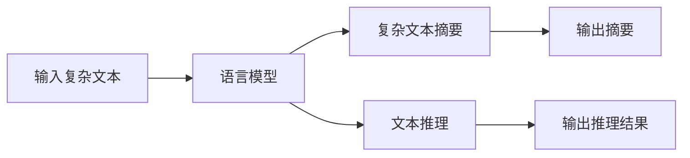

# 语言模型在复杂文本摘要与推理中的表现

> 关键词：语言模型、复杂文本摘要、文本推理、自然语言处理、Transformer架构

> 摘要：本文聚焦于语言模型在复杂文本摘要与推理中的表现。首先介绍了相关背景，包括研究目的、预期读者等。接着阐述了语言模型、复杂文本摘要和推理的核心概念及其联系，通过示意图和流程图进行直观展示。详细讲解了核心算法原理，并用Python代码进行实现。分析了相关的数学模型和公式，辅以具体例子加深理解。通过项目实战展示了如何搭建环境、实现代码并进行解读。探讨了语言模型在多个实际场景中的应用，推荐了学习资源、开发工具框架和相关论文著作。最后总结了未来发展趋势与挑战，解答了常见问题，并提供了扩展阅读和参考资料，旨在全面剖析语言模型在复杂文本摘要与推理方面的性能和应用。

## 1. 背景介绍 
### 1.1 目的和范围
随着信息爆炸时代的到来，每天产生的文本数据量呈指数级增长。复杂文本如学术论文、新闻报道、法律文书等充斥在各个领域。从这些海量且复杂的文本中提取关键信息、进行准确摘要以及基于文本进行有效推理变得至关重要。本研究的目的在于深入探究语言模型在处理复杂文本摘要与推理任务时的表现，分析其优势和局限性，为进一步的研究和应用提供参考。

研究范围涵盖了多种主流的语言模型，如基于Transformer架构的GPT系列、BERT及其变体等。同时，针对不同类型的复杂文本，包括科技、医学、金融等领域的文本，分析语言模型在摘要和推理任务中的性能差异。

### 1.2 预期读者
本文的预期读者包括自然语言处理领域的研究人员、开发者、学生以及对语言模型应用感兴趣的专业人士。研究人员可以从本文中获取关于语言模型在复杂文本处理方面的最新研究动态和技术趋势；开发者可以借鉴文中的代码实现和项目实战经验，应用到实际的开发项目中；学生可以通过本文系统地学习语言模型在复杂文本摘要与推理中的相关知识；专业人士可以了解语言模型在不同领域的应用潜力，为业务决策提供参考。

### 1.3 文档结构概述
本文将按照以下结构进行组织：首先介绍语言模型、复杂文本摘要和推理的核心概念及其联系，通过文本示意图和Mermaid流程图进行直观展示；接着详细讲解核心算法原理，并使用Python代码进行实现；分析相关的数学模型和公式，结合具体例子进行说明；通过项目实战展示如何搭建开发环境、实现代码并进行解读；探讨语言模型在实际场景中的应用；推荐学习资源、开发工具框架和相关论文著作；总结未来发展趋势与挑战；解答常见问题；最后提供扩展阅读和参考资料。

### 1.4 术语表
#### 1.4.1 核心术语定义
- **语言模型**：是一种对语言概率分布进行建模的模型，它能够根据输入的文本序列预测下一个可能出现的词的概率。语言模型可以用于生成文本、文本分类、机器翻译等多种自然语言处理任务。
- **复杂文本摘要**：指的是从包含丰富信息、结构复杂的文本中提取关键信息，生成简洁、准确的摘要的过程。复杂文本可能具有较长的篇幅、复杂的语法结构、多个主题等特点。
- **文本推理**：是指基于给定的文本信息，通过逻辑分析和知识运用，推导出新的结论或信息的过程。文本推理可以分为演绎推理、归纳推理等不同类型。

#### 1.4.2 相关概念解释
- **Transformer架构**：是一种基于注意力机制的深度学习架构，它在自然语言处理领域取得了巨大的成功。Transformer架构通过多头注意力机制捕捉文本中的长距离依赖关系，避免了传统循环神经网络在处理长序列时的梯度消失问题。
- **预训练模型**：是指在大规模文本数据上进行无监督学习训练得到的模型。预训练模型可以学习到语言的通用特征和模式，然后在特定的下游任务上进行微调，以提高模型在该任务上的性能。

#### 1.4.3 缩略词列表
- **GPT**：Generative Pretrained Transformer，生成式预训练Transformer。
- **BERT**：Bidirectional Encoder Representations from Transformers，基于Transformer的双向编码器表示。
- **NLP**：Natural Language Processing，自然语言处理。

## 2. 核心概念与联系 

### 核心概念原理
#### 语言模型
语言模型的核心原理是学习语言的概率分布。给定一个文本序列 $x_1, x_2, \cdots, x_n$，语言模型的目标是计算条件概率 $P(x_n|x_1, x_2, \cdots, x_{n-1})$，即根据前面的 $n - 1$ 个词预测第 $n$ 个词的概率。常见的语言模型训练方法包括基于最大似然估计的方法，通过最大化训练数据的似然函数来学习模型参数。

#### 复杂文本摘要
复杂文本摘要的目标是从复杂文本中提取关键信息，生成简洁的摘要。主要方法可以分为抽取式摘要和生成式摘要。抽取式摘要通过选择文本中的重要句子或短语来组成摘要；生成式摘要则是通过模型生成新的句子来表达文本的核心内容。

#### 文本推理
文本推理基于给定的文本信息，运用逻辑规则和知识进行推理。在自然语言处理中，文本推理可以通过模型学习文本中的语义关系和逻辑结构，从而实现推理任务。例如，根据文本中的前提条件推导出结论，或者判断两个文本之间的逻辑关系（如蕴含、矛盾等）。

### 架构的文本示意图
```plaintext
          语言模型
         /         \
  复杂文本摘要    文本推理
```
这个示意图展示了语言模型与复杂文本摘要和文本推理之间的关系。语言模型是基础，为复杂文本摘要和文本推理提供了语言理解和生成的能力。复杂文本摘要和文本推理是语言模型在不同任务上的应用。

### Mermaid流程图

该流程图展示了从输入复杂文本到输出摘要和推理结果的整个过程。首先，复杂文本输入到语言模型中，语言模型对文本进行处理和理解。然后，基于语言模型的输出，分别进行复杂文本摘要和文本推理任务。最后，输出摘要和推理结果。

## 3. 核心算法原理 & 具体操作步骤 

### 核心算法原理
在处理复杂文本摘要与推理任务时，基于Transformer架构的语言模型发挥了重要作用。下面以BERT模型为例，介绍其核心算法原理。

BERT模型是一种双向编码器，它通过在大规模文本数据上进行预训练，学习到语言的通用特征。BERT的核心结构是多层Transformer编码器，每个编码器层包含多头注意力机制和前馈神经网络。

#### 多头注意力机制
多头注意力机制允许模型在不同的表示子空间中并行地关注输入序列的不同部分。给定输入序列 $X = [x_1, x_2, \cdots, x_n]$，多头注意力机制的计算步骤如下：
1. 对输入序列 $X$ 进行线性变换，得到查询矩阵 $Q$、键矩阵 $K$ 和值矩阵 $V$：
   - $Q = XW^Q$
   - $K = XW^K$
   - $V = XW^V$
   其中，$W^Q$、$W^K$ 和 $W^V$ 是可学习的权重矩阵。
2. 计算注意力分数：
   - $Attention(Q, K, V) = softmax(\frac{QK^T}{\sqrt{d_k}})V$
   其中，$d_k$ 是键向量的维度。
3. 多头注意力机制通过将输入序列 $X$ 投影到多个低维子空间中，并行计算多个注意力头，然后将结果拼接起来：
   - $MultiHead(Q, K, V) = Concat(head_1, head_2, \cdots, head_h)W^O$
   其中，$head_i = Attention(QW^Q_i, KW^K_i, VW^V_i)$，$W^Q_i$、$W^K_i$ 和 $W^V_i$ 是第 $i$ 个注意力头的权重矩阵，$W^O$ 是输出权重矩阵。

#### 前馈神经网络
每个编码器层的多头注意力机制输出经过一个前馈神经网络进行非线性变换：
- $FFN(x) = max(0, xW_1 + b_1)W_2 + b_2$
其中，$W_1$、$W_2$ 是权重矩阵，$b_1$、$b_2$ 是偏置向量。

### 具体操作步骤
以下是使用Python和Hugging Face的Transformers库实现基于BERT模型的文本摘要和推理的具体步骤：

```python
# 安装必要的库
!pip install transformers

# 导入所需的库
from transformers import AutoTokenizer, AutoModelForSeq2SeqLM, AutoModelForSequenceClassification
import torch

# 步骤1：加载预训练的BERT模型和分词器
# 对于文本摘要，我们使用T5模型
tokenizer_summary = AutoTokenizer.from_pretrained("t5-small")
model_summary = AutoModelForSeq2SeqLM.from_pretrained("t5-small")

# 对于文本推理，我们使用BERT模型
tokenizer_reasoning = AutoTokenizer.from_pretrained("bert-base-uncased")
model_reasoning = AutoModelForSequenceClassification.from_pretrained("bert-base-uncased", num_labels=3)

# 步骤2：准备输入文本
input_text_summary = "This is a long and complex text that needs to be summarized. It contains a lot of information about various topics."
input_text_reasoning = "Premise: The sun rises in the east. Hypothesis: The sun rises in the east."

# 步骤3：对输入文本进行分词
inputs_summary = tokenizer_summary(input_text_summary, return_tensors="pt")
inputs_reasoning = tokenizer_reasoning(input_text_reasoning, return_tensors="pt")

# 步骤4：进行文本摘要
summary_ids = model_summary.generate(inputs_summary["input_ids"], num_beams=4, max_length=50, early_stopping=True)
summary = tokenizer_summary.decode(summary_ids[0], skip_special_tokens=True)

# 步骤5：进行文本推理
with torch.no_grad():
    outputs_reasoning = model_reasoning(**inputs_reasoning)
    logits = outputs_reasoning.logits
    predicted_class_id = torch.argmax(logits, dim=-1).item()

# 步骤6：输出结果
print("Summary:", summary)
print("Reasoning result:", predicted_class_id)
```

### 代码解释
1. **加载预训练模型和分词器**：使用 `AutoTokenizer` 和 `AutoModelForSeq2SeqLM` 加载用于文本摘要的T5模型和分词器，使用 `AutoModelForSequenceClassification` 加载用于文本推理的BERT模型和分词器。
2. **准备输入文本**：定义需要进行摘要和推理的输入文本。
3. **分词**：使用分词器将输入文本转换为模型可以处理的输入格式。
4. **文本摘要**：使用 `generate` 方法生成文本摘要。
5. **文本推理**：使用模型进行推理，通过 `argmax` 函数获取预测的类别。
6. **输出结果**：打印生成的摘要和推理结果。

## 4. 数学模型和公式 & 详细讲解 & 举例说明 

### 语言模型的数学模型
语言模型的核心是计算条件概率 $P(x_n|x_1, x_2, \cdots, x_{n-1})$。常见的语言模型可以表示为：
$$P(x_1, x_2, \cdots, x_n) = \prod_{i=1}^{n} P(x_i|x_1, x_2, \cdots, x_{i-1})$$

例如，对于一个简单的句子 "The dog runs"，语言模型计算其概率为：
$$P(\text{The}, \text{dog}, \text{runs}) = P(\text{The}) \times P(\text{dog}|\text{The}) \times P(\text{runs}|\text{The}, \text{dog})$$

### 多头注意力机制的数学公式
如前面所述，多头注意力机制的计算步骤如下：
1. 线性变换：
   - $Q = XW^Q$
   - $K = XW^K$
   - $V = XW^V$
   假设输入序列 $X$ 的形状为 $[n, d]$，其中 $n$ 是序列长度，$d$ 是输入向量的维度。$W^Q$、$W^K$ 和 $W^V$ 的形状分别为 $[d, d_k]$、$[d, d_k]$ 和 $[d, d_v]$，则 $Q$、$K$ 和 $V$ 的形状分别为 $[n, d_k]$、$[n, d_k]$ 和 $[n, d_v]$。
2. 注意力分数计算：
   - $Attention(Q, K, V) = softmax(\frac{QK^T}{\sqrt{d_k}})V$
   $QK^T$ 的形状为 $[n, n]$，$\frac{QK^T}{\sqrt{d_k}}$ 进行缩放操作，然后通过 $softmax$ 函数将其转换为概率分布。最后，将概率分布与 $V$ 相乘得到注意力输出。
3. 多头注意力机制：
   - $MultiHead(Q, K, V) = Concat(head_1, head_2, \cdots, head_h)W^O$
   假设每个注意力头的维度为 $d_{head}$，则 $h \times d_{head} = d_v$。$W^O$ 的形状为 $[h \times d_{head}, d]$。

### 前馈神经网络的数学公式
前馈神经网络的计算公式为：
$$FFN(x) = max(0, xW_1 + b_1)W_2 + b_2$$
假设输入向量 $x$ 的形状为 $[n, d]$，$W_1$ 的形状为 $[d, d_{ff}]$，$b_1$ 的形状为 $[d_{ff}]$，则 $xW_1 + b_1$ 的形状为 $[n, d_{ff}]$。经过 $max(0, \cdot)$ 激活函数后，再与 $W_2$ 相乘并加上 $b_2$，最终输出的形状为 $[n, d]$。

### 举例说明
假设输入序列 $X = \begin{bmatrix} 1 & 2 \\ 3 & 4 \\ 5 & 6 \end{bmatrix}$，$d = 2$，$d_k = d_v = 2$，$W^Q = \begin{bmatrix} 0.1 & 0.2 \\ 0.3 & 0.4 \end{bmatrix}$，$W^K = \begin{bmatrix} 0.5 & 0.6 \\ 0.7 & 0.8 \end{bmatrix}$，$W^V = \begin{bmatrix} 0.9 & 1.0 \\ 1.1 & 1.2 \end{bmatrix}$。

1. 计算 $Q$、$K$ 和 $V$：
   - $Q = XW^Q = \begin{bmatrix} 1 & 2 \\ 3 & 4 \\ 5 & 6 \end{bmatrix} \begin{bmatrix} 0.1 & 0.2 \\ 0.3 & 0.4 \end{bmatrix} = \begin{bmatrix} 0.7 & 1.0 \\ 1.5 & 2.2 \\ 2.3 & 3.4 \end{bmatrix}$
   - $K = XW^K = \begin{bmatrix} 1 & 2 \\ 3 & 4 \\ 5 & 6 \end{bmatrix} \begin{bmatrix} 0.5 & 0.6 \\ 0.7 & 0.8 \end{bmatrix} = \begin{bmatrix} 1.9 & 2.2 \\ 4.3 & 5.0 \\ 6.7 & 7.8 \end{bmatrix}$
   - $V = XW^V = \begin{bmatrix} 1 & 2 \\ 3 & 4 \\ 5 & 6 \end{bmatrix} \begin{bmatrix} 0.9 & 1.0 \\ 1.1 & 1.2 \end{bmatrix} = \begin{bmatrix} 3.1 & 3.4 \\ 7.1 & 8.2 \\ 11.1 & 12.4 \end{bmatrix}$
2. 计算注意力分数：
   - $QK^T = \begin{bmatrix} 0.7 & 1.0 \\ 1.5 & 2.2 \\ 2.3 & 3.4 \end{bmatrix} \begin{bmatrix} 1.9 & 4.3 & 6.7 \\ 2.2 & 5.0 & 7.8 \end{bmatrix} = \begin{bmatrix} 3.53 & 8.11 & 12.19 \\ 7.81 & 17.95 & 27.21 \\ 12.09 & 27.89 & 42.71 \end{bmatrix}$
   - $\frac{QK^T}{\sqrt{d_k}} = \frac{1}{\sqrt{2}} \begin{bmatrix} 3.53 & 8.11 & 12.19 \\ 7.81 & 17.95 & 27.21 \\ 12.09 & 27.89 & 42.71 \end{bmatrix}$
   - $Attention(Q, K, V) = softmax(\frac{QK^T}{\sqrt{d_k}})V$
   经过 $softmax$ 函数和矩阵乘法运算后，得到注意力输出。

## 5. 项目实战：代码实际案例和详细解释说明 

### 5.1  开发环境搭建
#### 安装Python
首先，确保你已经安装了Python 3.6或更高版本。可以从Python官方网站（https://www.python.org/downloads/）下载并安装Python。

#### 创建虚拟环境
为了避免不同项目之间的依赖冲突，建议使用虚拟环境。可以使用 `venv` 或 `conda` 来创建虚拟环境。

使用 `venv` 创建虚拟环境的命令如下：
```sh
python -m venv myenv
source myenv/bin/activate  # 在Windows上使用 myenv\Scripts\activate
```

#### 安装必要的库
在虚拟环境中，使用 `pip` 安装所需的库：
```sh
pip install transformers torch numpy pandas
```

### 5.2  源代码详细实现和代码解读
以下是一个完整的项目实战代码，实现了基于T5模型的复杂文本摘要和基于BERT模型的文本推理：

```python
import torch
from transformers import AutoTokenizer, AutoModelForSeq2SeqLM, AutoModelForSequenceClassification

# 加载预训练的T5模型和分词器用于文本摘要
tokenizer_summary = AutoTokenizer.from_pretrained("t5-small")
model_summary = AutoModelForSeq2SeqLM.from_pretrained("t5-small")

# 加载预训练的BERT模型和分词器用于文本推理
tokenizer_reasoning = AutoTokenizer.from_pretrained("bert-base-uncased")
model_reasoning = AutoModelForSequenceClassification.from_pretrained("bert-base-uncased", num_labels=3)

def summarize_text(text):
    """
    对输入的文本进行摘要
    :param text: 输入的文本
    :return: 生成的摘要
    """
    # 对输入文本进行分词
    inputs = tokenizer_summary("summarize: " + text, return_tensors="pt")
    # 生成摘要
    summary_ids = model_summary.generate(inputs["input_ids"], num_beams=4, max_length=50, early_stopping=True)
    # 解码生成的摘要
    summary = tokenizer_summary.decode(summary_ids[0], skip_special_tokens=True)
    return summary

def perform_reasoning(premise, hypothesis):
    """
    进行文本推理
    :param premise: 前提文本
    :param hypothesis: 假设文本
    :return: 推理结果（0: 蕴含，1: 矛盾，2: 中立）
    """
    # 对输入文本进行分词
    inputs = tokenizer_reasoning(premise, hypothesis, return_tensors="pt")
    # 进行推理
    with torch.no_grad():
        outputs = model_reasoning(**inputs)
        logits = outputs.logits
        predicted_class_id = torch.argmax(logits, dim=-1).item()
    return predicted_class_id

# 测试文本摘要
input_text_summary = "This is a long and complex text that needs to be summarized. It contains a lot of information about various topics."
summary = summarize_text(input_text_summary)
print("Summary:", summary)

# 测试文本推理
premise = "The sun rises in the east."
hypothesis = "The sun rises in the east."
reasoning_result = perform_reasoning(premise, hypothesis)
print("Reasoning result:", reasoning_result)
```

### 代码解读与分析
#### 加载预训练模型和分词器
使用 `AutoTokenizer` 和 `AutoModelForSeq2SeqLM` 加载用于文本摘要的T5模型和分词器，使用 `AutoModelForSequenceClassification` 加载用于文本推理的BERT模型和分词器。

#### `summarize_text` 函数
- 该函数接受一个文本作为输入，首先在输入文本前添加 "summarize: " 前缀，这是T5模型要求的输入格式。
- 然后使用分词器对输入文本进行分词，将其转换为模型可以处理的输入格式。
- 调用 `generate` 方法生成摘要，通过 `num_beams` 参数控制束搜索的宽度，`max_length` 参数控制生成摘要的最大长度，`early_stopping` 参数控制是否在生成结束时提前停止。
- 最后使用分词器对生成的摘要进行解码，去除特殊标记，得到最终的摘要。

#### `perform_reasoning` 函数
- 该函数接受前提文本和假设文本作为输入，使用分词器将它们合并并分词。
- 在推理过程中，使用 `torch.no_grad()` 上下文管理器来禁用梯度计算，以提高推理速度。
- 调用模型进行推理，得到输出的逻辑值 `logits`。
- 使用 `torch.argmax` 函数获取预测的类别。

#### 测试部分
定义了一个测试文本用于摘要和一组前提文本和假设文本用于推理，调用相应的函数进行测试，并打印结果。

## 6. 实际应用场景 
### 新闻媒体领域
在新闻媒体领域，每天都会产生大量的新闻报道。语言模型可以用于对这些新闻进行摘要，帮助读者快速了解新闻的核心内容。例如，新闻网站可以使用语言模型生成新闻摘要，显示在首页或列表页，让读者在不阅读全文的情况下就能了解新闻的大致内容。同时，语言模型还可以用于新闻推理，例如判断两条新闻之间的逻辑关系，挖掘新闻背后的潜在信息。

### 学术研究领域
学术论文通常包含大量的专业知识和复杂的内容。语言模型可以对学术论文进行摘要，帮助研究人员快速筛选和了解相关研究。此外，在学术研究中，经常需要进行文献综述和推理分析。语言模型可以辅助研究人员进行文献综述的撰写，通过对大量文献的摘要和分析，提取关键信息和研究趋势。在推理分析方面，语言模型可以根据已有研究成果进行推理，提出新的研究假设和方向。

### 金融领域
金融领域的文本数据包括公司年报、市场分析报告、新闻资讯等。语言模型可以对这些文本进行摘要，帮助投资者快速了解公司的财务状况、市场动态等信息。在金融风险评估和投资决策中，语言模型可以进行文本推理，例如根据公司的财务报表和新闻报道，推理公司的未来发展趋势和潜在风险，为投资者提供决策参考。

### 法律领域
法律文书如合同、判决书等通常具有复杂的结构和严谨的逻辑。语言模型可以对法律文书进行摘要，帮助律师和法官快速了解文书的核心内容。在法律推理方面，语言模型可以根据法律条文和案例，推理案件的判决结果，辅助法律决策。

## 7. 工具和资源推荐
### 7.1 学习资源推荐
#### 7.1.1 书籍推荐
- 《深度学习》（Deep Learning）：由Ian Goodfellow、Yoshua Bengio和Aaron Courville撰写，是深度学习领域的经典教材，涵盖了深度学习的基本原理、算法和应用。
- 《自然语言处理入门》（Natural Language Processing with Python）：由Steven Bird、Ewan Klein和Edward Loper撰写，介绍了使用Python进行自然语言处理的基本方法和技术。
- 《Transformers for Natural Language Processing》：详细介绍了Transformer架构在自然语言处理中的应用，包括BERT、GPT等模型的原理和实现。

#### 7.1.2 在线课程
- Coursera上的“Natural Language Processing Specialization”：由深度学习领域的知名学者授课，涵盖了自然语言处理的各个方面，包括语言模型、文本分类、机器翻译等。
- edX上的“Deep Learning for Natural Language Processing”：介绍了深度学习在自然语言处理中的应用，包括Transformer架构、预训练模型等。
- 吴恩达的“DeepLearning.AI TensorFlow Developer Professional Certificate”：虽然主要侧重于TensorFlow的使用，但也包含了自然语言处理的相关内容。

#### 7.1.3 技术博客和网站
- Hugging Face Blog：提供了关于自然语言处理模型和技术的最新动态和研究成果，特别是关于Transformer架构和预训练模型的内容。
- Towards Data Science：是一个数据科学和机器学习领域的博客平台，有很多关于自然语言处理的优质文章。
- arXiv.org：是一个预印本论文库，包含了自然语言处理领域的最新研究成果。

### 7.2 开发工具框架推荐
#### 7.2.1 IDE和编辑器
- PyCharm：是一款功能强大的Python集成开发环境，提供了代码编辑、调试、版本控制等功能，适合开发自然语言处理项目。
- Visual Studio Code：是一款轻量级的代码编辑器，支持多种编程语言和插件，具有丰富的扩展功能，可以用于自然语言处理项目的开发。
- Jupyter Notebook：是一个交互式的开发环境，适合进行数据探索、模型实验和代码演示，在自然语言处理领域广泛应用。

#### 7.2.2 调试和性能分析工具
- TensorBoard：是TensorFlow的可视化工具，可以用于监控模型的训练过程、可视化模型的结构和性能指标。
- PyTorch Profiler：是PyTorch的性能分析工具，可以帮助开发者分析模型的性能瓶颈，优化代码。
- VS Code的调试器：可以用于调试Python代码，支持断点调试、变量查看等功能。

#### 7.2.3 相关框架和库
- Hugging Face Transformers：是一个广泛使用的自然语言处理库，提供了多种预训练模型和工具，方便开发者进行文本分类、文本生成、问答系统等任务的开发。
- NLTK（Natural Language Toolkit）：是一个Python库，提供了自然语言处理的基本工具和数据集，包括分词、词性标注、命名实体识别等功能。
- SpaCy：是一个快速、高效的自然语言处理库，提供了多种语言的处理支持，具有简单易用的API。

### 7.3 相关论文著作推荐
#### 7.3.1 经典论文
- “Attention Is All You Need”：介绍了Transformer架构，是自然语言处理领域的重要突破，为后续的预训练模型奠定了基础。
- “BERT: Pre-training of Deep Bidirectional Transformers for Language Understanding”：提出了BERT模型，通过双向预训练的方式学习语言的通用特征，在多个自然语言处理任务上取得了优异的成绩。
- “Generative Pretrained Transformer 3 (GPT-3): Language Models are Few-Shot Learners”：介绍了GPT-3模型，展示了大规模预训练模型在少样本学习和自然语言生成方面的强大能力。

#### 7.3.2 最新研究成果
- 关注arXiv.org上关于自然语言处理的最新论文，特别是关于语言模型在复杂文本摘要与推理方面的研究。
- 参加自然语言处理领域的顶级会议，如ACL（Association for Computational Linguistics）、EMNLP（Conference on Empirical Methods in Natural Language Processing）等，了解最新的研究动态。

#### 7.3.3 应用案例分析
- 研究一些实际应用中语言模型在复杂文本摘要与推理方面的案例，如新闻媒体、金融、法律等领域的应用。可以通过相关的学术论文、技术博客和行业报告来获取这些案例。

## 8. 总结：未来发展趋势与挑战
### 未来发展趋势
#### 模型规模和性能的提升
随着计算资源的不断增加和技术的进步，语言模型的规模将继续扩大，性能也将不断提升。更大规模的预训练模型可以学习到更丰富的语言知识和语义信息，从而在复杂文本摘要与推理任务中取得更好的表现。

#### 多模态融合
未来的语言模型将不仅仅局限于文本处理，还将与图像、音频等多模态信息进行融合。例如，在新闻报道中，结合图像和文本信息进行更全面的摘要和推理。多模态融合可以提供更丰富的信息，提高模型的理解和推理能力。

#### 个性化和定制化
随着用户需求的多样化，语言模型将向个性化和定制化方向发展。根据用户的偏好、领域知识等因素，为用户提供个性化的摘要和推理服务。例如，在金融领域，为不同的投资者提供符合其投资风格和需求的文本分析结果。

#### 可解释性和可信度提升
语言模型的可解释性和可信度是当前研究的热点之一。未来的语言模型将更加注重可解释性，能够向用户解释其推理过程和结果的依据。同时，提高模型的可信度，减少错误和偏见，确保模型在实际应用中的可靠性。

### 挑战
#### 数据质量和隐私问题
大规模的预训练需要大量的高质量数据，但数据的收集、整理和标注是一个耗时耗力的过程。同时，数据隐私问题也日益受到关注。在使用敏感数据进行训练时，需要确保数据的安全性和隐私性。

#### 计算资源和能耗问题
训练大规模的语言模型需要大量的计算资源和能源消耗。随着模型规模的不断扩大，计算资源和能耗问题将变得更加突出。如何在有限的资源下提高模型的训练效率和性能，是一个亟待解决的问题。

#### 语义理解和推理能力的提升
尽管语言模型在自然语言处理任务中取得了很大的进展，但在语义理解和推理能力方面仍存在不足。特别是在处理复杂的逻辑关系和常识推理时，模型的表现还不够理想。如何提高模型的语义理解和推理能力，是未来研究的重要方向。

#### 对抗攻击和鲁棒性问题
语言模型容易受到对抗攻击的影响，攻击者可以通过微小的扰动来改变模型的输出结果。提高模型的鲁棒性，使其能够抵御对抗攻击，是保证模型在实际应用中可靠性的关键。

## 9. 附录：常见问题与解答
### 问题1：语言模型在复杂文本摘要中容易出现哪些问题？
- **信息丢失**：由于复杂文本通常包含丰富的信息，语言模型在摘要过程中可能会丢失一些重要的细节。特别是当文本的主题较为复杂、涉及多个方面时，模型可能无法准确地提取所有关键信息。
- **摘要质量不稳定**：语言模型的摘要质量可能会受到输入文本的长度、结构和语言风格等因素的影响。对于一些结构混乱、语言表达不规范的文本，模型生成的摘要可能质量较低。
- **语义理解不准确**：复杂文本中可能包含一些专业术语、隐喻、双关等语义复杂的内容，语言模型可能无法准确理解这些内容的含义，从而导致摘要的语义不准确。

### 问题2：如何评估语言模型在复杂文本摘要与推理中的性能？
- **摘要评估指标**：常用的摘要评估指标包括ROUGE（Recall-Oriented Understudy for Gisting Evaluation）、BLEU（Bilingual Evaluation Understudy）等。ROUGE主要衡量摘要与参考摘要之间的重叠程度，包括ROUGE-1（单字重叠）、ROUGE-2（双字重叠）和ROUGE-L（最长公共子序列）等指标。BLEU主要用于评估机器翻译的质量，也可以用于摘要评估，它衡量生成摘要与参考摘要之间的n-gram匹配程度。
- **推理评估指标**：对于文本推理任务，可以使用准确率、召回率、F1值等指标来评估模型的性能。准确率是指模型预测正确的样本数占总样本数的比例；召回率是指模型正确预测为正例的样本数占实际正例样本数的比例；F1值是准确率和召回率的调和平均值。

### 问题3：语言模型在处理不同领域的复杂文本时表现有何差异？
- **专业知识要求**：不同领域的复杂文本具有不同的专业知识和术语。例如，医学领域的文本包含大量的医学术语和专业知识，金融领域的文本涉及金融市场、财务报表等知识。语言模型在处理这些领域的文本时，如果缺乏相应的专业知识，可能会导致理解和处理能力下降。
- **文本结构和语言风格**：不同领域的文本具有不同的结构和语言风格。例如，学术论文通常具有严谨的结构和规范的语言表达，新闻报道则更加注重时效性和简洁性。语言模型需要适应不同的文本结构和语言风格，才能更好地进行摘要和推理。

### 问题4：如何提高语言模型在复杂文本摘要与推理中的性能？
- **数据增强**：可以通过数据增强的方法扩充训练数据，例如对文本进行同义词替换、句子重组等操作，增加数据的多样性，提高模型的泛化能力。
- **多阶段训练**：采用多阶段训练的方法，先在大规模的通用数据上进行预训练，然后在特定领域的数据上进行微调，使模型能够学习到通用的语言知识和特定领域的专业知识。
- **融合外部知识**：将外部知识融入到语言模型中，例如使用知识图谱、百科全书等资源，帮助模型更好地理解文本中的语义和逻辑关系。

## 10. 扩展阅读 & 参考资料
### 扩展阅读
- 《Neural Network Methods in Natural Language Processing》：深入介绍了神经网络在自然语言处理中的应用，包括语言模型、文本分类、机器翻译等任务。
- 《Speech and Language Processing》：是自然语言处理领域的经典教材，涵盖了语音处理和语言处理的各个方面，包括分词、词性标注、句法分析等。
- 《Artificial Intelligence: A Modern Approach》：介绍了人工智能的基本概念、算法和应用，包括自然语言处理、机器学习、计算机视觉等领域。

### 参考资料
- Hugging Face官方文档：https://huggingface.co/docs/transformers/index
- TensorFlow官方文档：https://www.tensorflow.org/api_docs
- PyTorch官方文档：https://pytorch.org/docs/stable/index.html
- ACL Anthology：https://aclanthology.org/ ，自然语言处理领域的学术论文库。