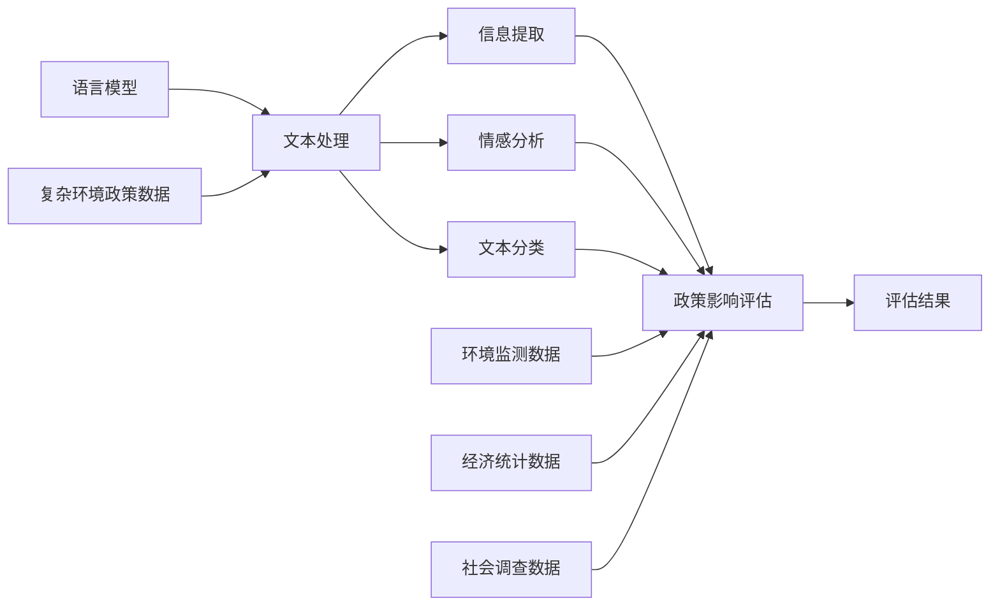

# 语言模型在复杂环境政策影响评估中的应用

> 关键词：语言模型、复杂环境政策、影响评估、自然语言处理、数据挖掘

> 摘要：本文聚焦于语言模型在复杂环境政策影响评估中的应用。首先介绍了相关背景，包括目的范围、预期读者等内容。接着阐述了核心概念与联系，深入剖析语言模型及环境政策影响评估的原理和架构。详细讲解了核心算法原理与具体操作步骤，通过Python源代码进行阐释。探讨了相关数学模型和公式，并举例说明。通过项目实战展示了代码的实际案例及详细解释。分析了语言模型在复杂环境政策影响评估中的实际应用场景。推荐了学习资源、开发工具框架以及相关论文著作。最后总结了未来发展趋势与挑战，提供了常见问题与解答以及扩展阅读和参考资料，旨在全面深入地探讨语言模型在该领域的应用，为相关研究和实践提供参考。

## 1. 背景介绍 
### 1.1 目的和范围
随着社会经济的快速发展，环境问题日益复杂，各种环境政策不断出台。准确评估这些政策的影响对于政策的制定、调整和优化至关重要。然而，复杂环境政策涉及到大量的文本信息，如政策文件、研究报告、公众反馈等，传统的评估方法难以有效处理这些海量的文本数据。语言模型作为自然语言处理领域的重要技术，具有强大的文本理解和分析能力，能够为复杂环境政策影响评估提供新的思路和方法。

本文的范围涵盖了语言模型的基本原理、在复杂环境政策影响评估中的具体应用方式、相关算法和数学模型，以及通过实际项目案例展示其应用效果。旨在全面介绍语言模型在该领域的应用，为研究人员和政策制定者提供技术支持和决策参考。

### 1.2 预期读者
本文的预期读者包括自然语言处理领域的研究人员、环境政策制定者和评估人员、对人工智能技术在政策评估中应用感兴趣的相关专业人士。对于研究人员，本文可以提供新的研究方向和技术思路；对于政策制定者和评估人员，有助于他们了解如何利用语言模型提高政策影响评估的效率和准确性；对于相关专业人士，能够拓宽他们对人工智能技术应用领域的认识。

### 1.3 文档结构概述
本文将按照以下结构进行阐述：首先介绍背景信息，包括目的范围、预期读者等；接着讲解核心概念与联系，包括语言模型和复杂环境政策影响评估的原理和架构；然后详细说明核心算法原理与具体操作步骤，并给出Python源代码；之后探讨数学模型和公式，并举例说明；通过项目实战展示代码的实际应用和详细解释；分析实际应用场景；推荐相关的学习资源、开发工具框架和论文著作；最后总结未来发展趋势与挑战，提供常见问题与解答以及扩展阅读和参考资料。

### 1.4 术语表
#### 1.4.1 核心术语定义
- **语言模型**：是一种对自然语言文本进行建模的统计模型，用于预测文本中下一个词或字符出现的概率。它能够学习语言的模式和规律，从而实现文本生成、文本分类、情感分析等多种自然语言处理任务。
- **复杂环境政策**：指涉及多个环境因素、多个利益相关者，且政策内容复杂、影响范围广泛的环境政策。例如，涉及大气污染、水污染、土壤污染等多方面治理的综合性环境政策。
- **影响评估**：对政策实施后所产生的各种影响进行系统、全面的分析和评价，包括环境影响、经济影响、社会影响等多个方面。

#### 1.4.2 相关概念解释
- **自然语言处理（NLP）**：是人工智能领域的一个重要分支，旨在让计算机能够理解、处理和生成人类语言。语言模型是自然语言处理中的关键技术之一。
- **文本挖掘**：从大量的文本数据中提取有价值的信息和知识，包括文本分类、信息抽取、情感分析等任务。在复杂环境政策影响评估中，文本挖掘可以帮助从政策文件和相关文本中提取关键信息。

#### 1.4.3 缩略词列表
- **NLP**：Natural Language Processing（自然语言处理）
- **ML**：Machine Learning（机器学习）
- **DL**：Deep Learning（深度学习）

## 2. 核心概念与联系 
### 2.1 语言模型原理
语言模型的基本原理是基于概率统计的方法，通过对大量文本数据的学习，计算出文本中词或字符的出现概率。常见的语言模型包括n-gram模型、基于神经网络的语言模型（如循环神经网络RNN、长短期记忆网络LSTM、门控循环单元GRU等）和Transformer架构的语言模型（如BERT、GPT等）。

以n-gram模型为例，它假设一个词的出现只与它前面的n-1个词有关。对于一个文本序列 $w_1, w_2, \cdots, w_T$，n-gram模型计算其概率为：

$$P(w_1, w_2, \cdots, w_T) = \prod_{t=1}^{T} P(w_t | w_{t - n + 1}, \cdots, w_{t - 1})$$

基于神经网络的语言模型则通过神经网络来学习文本的特征和模式，能够更好地捕捉文本中的长距离依赖关系。Transformer架构的语言模型则引入了注意力机制，进一步提高了模型的性能和效率。

### 2.2 复杂环境政策影响评估原理
复杂环境政策影响评估的原理是综合考虑政策实施前后的各种环境、经济和社会指标的变化，通过科学的方法和模型来评估政策的效果和影响。评估过程通常包括确定评估目标、收集相关数据、选择评估方法、进行数据分析和结果评价等步骤。

在数据收集方面，需要收集政策文件、环境监测数据、经济统计数据、社会调查数据等多方面的数据。评估方法包括定性分析和定量分析，定性分析主要通过专家判断和文献研究来评估政策的影响，定量分析则通过建立数学模型和统计分析来评估政策的效果。

### 2.3 语言模型与复杂环境政策影响评估的联系
语言模型在复杂环境政策影响评估中具有重要的应用价值。一方面，语言模型可以用于处理政策文件和相关文本数据，提取关键信息，如政策目标、政策措施、实施时间等，帮助政策评估人员更好地理解政策内容。另一方面，语言模型可以用于情感分析，了解公众对环境政策的态度和意见，为政策评估提供社会层面的信息。此外，语言模型还可以用于文本分类，将政策相关的文本分为不同的类别，如正面评价、负面评价、中性评价等，有助于对政策影响进行全面的评估。

### 2.4 架构示意图


## 3. 核心算法原理 & 具体操作步骤 
### 3.1 文本分类算法原理
文本分类是语言模型在复杂环境政策影响评估中的重要应用之一。常见的文本分类算法包括朴素贝叶斯算法、支持向量机算法、深度学习算法等。这里以深度学习算法中的卷积神经网络（CNN）为例进行讲解。

卷积神经网络通过卷积层、池化层和全连接层来提取文本的特征，并进行分类。卷积层通过卷积核在文本序列上滑动，提取局部特征。池化层则对卷积层的输出进行下采样，减少特征的维度。全连接层将池化层的输出进行分类。

### 3.2 Python代码实现
```python
import torch
import torch.nn as nn
import torch.optim as optim
from torch.utils.data import Dataset, DataLoader
from sklearn.model_selection import train_test_split
from sklearn.preprocessing import LabelEncoder
import numpy as np

# 定义数据集类
class TextDataset(Dataset):
    def __init__(self, texts, labels):
        self.texts = texts
        self.labels = labels

    def __len__(self):
        return len(self.texts)

    def __getitem__(self, idx):
        text = self.texts[idx]
        label = self.labels[idx]
        return text, label

# 定义卷积神经网络模型
class TextCNN(nn.Module):
    def __init__(self, vocab_size, embedding_dim, num_filters, filter_sizes, output_dim, dropout):
        super().__init__()
        self.embedding = nn.Embedding(vocab_size, embedding_dim)
        self.convs = nn.ModuleList([
            nn.Conv2d(in_channels=1,
                      out_channels=num_filters,
                      kernel_size=(fs, embedding_dim))
            for fs in filter_sizes
        ])
        self.fc = nn.Linear(len(filter_sizes) * num_filters, output_dim)
        self.dropout = nn.Dropout(dropout)

    def forward(self, text):
        embedded = self.embedding(text)
        embedded = embedded.unsqueeze(1)
        conved = [nn.functional.relu(conv(embedded)).squeeze(3) for conv in self.convs]
        pooled = [nn.functional.max_pool1d(conv, conv.shape[2]).squeeze(2) for conv in conved]
        cat = self.dropout(torch.cat(pooled, dim=1))
        return self.fc(cat)

# 数据预处理
texts = ["这是一条正面评价", "这是一条负面评价", "这是一条中性评价"]
labels = ["正面", "负面", "中性"]
label_encoder = LabelEncoder()
labels = label_encoder.fit_transform(labels)

# 划分训练集和测试集
train_texts, test_texts, train_labels, test_labels = train_test_split(texts, labels, test_size=0.2, random_state=42)

# 创建数据集和数据加载器
train_dataset = TextDataset(train_texts, train_labels)
train_loader = DataLoader(train_dataset, batch_size=1, shuffle=True)
test_dataset = TextDataset(test_texts, test_labels)
test_loader = DataLoader(test_dataset, batch_size=1, shuffle=False)

# 初始化模型
vocab_size = 1000
embedding_dim = 100
num_filters = 100
filter_sizes = [3, 4, 5]
output_dim = len(label_encoder.classes_)
dropout = 0.5
model = TextCNN(vocab_size, embedding_dim, num_filters, filter_sizes, output_dim, dropout)

# 定义损失函数和优化器
criterion = nn.CrossEntropyLoss()
optimizer = optim.Adam(model.parameters())

# 训练模型
num_epochs = 10
for epoch in range(num_epochs):
    model.train()
    for texts, labels in train_loader:
        optimizer.zero_grad()
        outputs = model(texts)
        loss = criterion(outputs, labels)
        loss.backward()
        optimizer.step()

# 测试模型
model.eval()
correct = 0
total = 0
with torch.no_grad():
    for texts, labels in test_loader:
        outputs = model(texts)
        _, predicted = torch.max(outputs.data, 1)
        total += labels.size(0)
        correct += (predicted == labels).sum().item()

print(f'Accuracy: {100 * correct / total}%')
```

### 3.3 具体操作步骤
1. **数据收集**：收集与复杂环境政策相关的文本数据，如政策文件、公众反馈等。
2. **数据预处理**：对收集到的文本数据进行清洗、分词、去除停用词等处理，将文本转换为模型可以处理的格式。
3. **模型选择**：根据任务需求选择合适的语言模型，如CNN、BERT等。
4. **模型训练**：使用预处理后的数据对模型进行训练，调整模型的参数，提高模型的性能。
5. **模型评估**：使用测试数据对训练好的模型进行评估，计算模型的准确率、召回率、F1值等指标。
6. **应用模型**：将训练好的模型应用到实际的复杂环境政策影响评估中，对新的文本数据进行分类和分析。

## 4. 数学模型和公式 & 详细讲解 & 举例说明 
### 4.1 卷积神经网络数学模型
卷积神经网络的核心操作是卷积操作和池化操作。

#### 4.1.1 卷积操作
卷积操作是通过卷积核在输入数据上滑动，计算卷积核与输入数据的对应元素乘积之和，得到卷积结果。对于一个二维输入数据 $X \in \mathbb{R}^{H \times W}$ 和一个二维卷积核 $K \in \mathbb{R}^{h \times w}$，卷积操作的数学公式为：

$$Y_{i,j} = \sum_{m=0}^{h-1} \sum_{n=0}^{w-1} X_{i+m, j+n} K_{m,n}$$

其中，$Y \in \mathbb{R}^{(H - h + 1) \times (W - w + 1)}$ 是卷积结果，$i$ 和 $j$ 是卷积结果的索引。

#### 4.1.2 池化操作
池化操作是对输入数据进行下采样，减少数据的维度。常见的池化操作包括最大池化和平均池化。最大池化是取池化窗口内的最大值作为池化结果，平均池化是取池化窗口内的平均值作为池化结果。

对于一个二维输入数据 $X \in \mathbb{R}^{H \times W}$ 和一个池化窗口大小为 $p \times p$，最大池化操作的数学公式为：

$$Y_{i,j} = \max_{m=0}^{p-1} \max_{n=0}^{p-1} X_{i \times p + m, j \times p + n}$$

其中，$Y \in \mathbb{R}^{\frac{H}{p} \times \frac{W}{p}}$ 是池化结果，$i$ 和 $j$ 是池化结果的索引。

### 4.2 举例说明
假设我们有一个输入数据 $X$ 为：

$$X = \begin{bmatrix}
1 & 2 & 3 \\
4 & 5 & 6 \\
7 & 8 & 9
\end{bmatrix}$$

卷积核 $K$ 为：

$$K = \begin{bmatrix}
1 & 0 \\
0 & 1
\end{bmatrix}$$

则卷积结果 $Y$ 为：

$$Y = \begin{bmatrix}
1 \times 1 + 2 \times 0 + 4 \times 0 + 5 \times 1 & 2 \times 1 + 3 \times 0 + 5 \times 0 + 6 \times 1 \\
4 \times 1 + 5 \times 0 + 7 \times 0 + 8 \times 1 & 5 \times 1 + 6 \times 0 + 8 \times 0 + 9 \times 1
\end{bmatrix} = \begin{bmatrix}
6 & 8 \\
12 & 14
\end{bmatrix}$$

假设我们对输入数据 $X$ 进行最大池化操作，池化窗口大小为 $2 \times 2$，则池化结果 $Y$ 为：

$$Y = \begin{bmatrix}
\max(1, 2, 4, 5) & \max(3, 6) \\
\max(7, 8) & \max(9)
\end{bmatrix} = \begin{bmatrix}
5 & 6 \\
8 & 9
\end{bmatrix}$$

## 5. 项目实战：代码实际案例和详细解释说明 
### 5.1  开发环境搭建
#### 5.1.1 安装Python
首先需要安装Python环境，建议使用Python 3.7及以上版本。可以从Python官方网站（https://www.python.org/downloads/） 下载并安装。

#### 5.1.2 安装深度学习框架
本文使用PyTorch作为深度学习框架，可以使用以下命令进行安装：

```sh
pip install torch torchvision
```

#### 5.1.3 安装其他依赖库
还需要安装一些其他的依赖库，如numpy、sklearn等，可以使用以下命令进行安装：

```sh
pip install numpy scikit-learn
```

### 5.2  源代码详细实现和代码解读
```python
import torch
import torch.nn as nn
import torch.optim as optim
from torch.utils.data import Dataset, DataLoader
from sklearn.model_selection import train_test_split
from sklearn.preprocessing import LabelEncoder
import numpy as np

# 定义数据集类
class TextDataset(Dataset):
    def __init__(self, texts, labels):
        self.texts = texts
        self.labels = labels

    def __len__(self):
        return len(self.texts)

    def __getitem__(self, idx):
        text = self.texts[idx]
        label = self.labels[idx]
        return text, label

# 定义卷积神经网络模型
class TextCNN(nn.Module):
    def __init__(self, vocab_size, embedding_dim, num_filters, filter_sizes, output_dim, dropout):
        super().__init__()
        self.embedding = nn.Embedding(vocab_size, embedding_dim)
        self.convs = nn.ModuleList([
            nn.Conv2d(in_channels=1,
                      out_channels=num_filters,
                      kernel_size=(fs, embedding_dim))
            for fs in filter_sizes
        ])
        self.fc = nn.Linear(len(filter_sizes) * num_filters, output_dim)
        self.dropout = nn.Dropout(dropout)

    def forward(self, text):
        embedded = self.embedding(text)
        embedded = embedded.unsqueeze(1)
        conved = [nn.functional.relu(conv(embedded)).squeeze(3) for conv in self.convs]
        pooled = [nn.functional.max_pool1d(conv, conv.shape[2]).squeeze(2) for conv in conved]
        cat = self.dropout(torch.cat(pooled, dim=1))
        return self.fc(cat)

# 数据预处理
texts = ["这是一条正面评价", "这是一条负面评价", "这是一条中性评价"]
labels = ["正面", "负面", "中性"]
label_encoder = LabelEncoder()
labels = label_encoder.fit_transform(labels)

# 划分训练集和测试集
train_texts, test_texts, train_labels, test_labels = train_test_split(texts, labels, test_size=0.2, random_state=42)

# 创建数据集和数据加载器
train_dataset = TextDataset(train_texts, train_labels)
train_loader = DataLoader(train_dataset, batch_size=1, shuffle=True)
test_dataset = TextDataset(test_texts, test_labels)
test_loader = DataLoader(test_dataset, batch_size=1, shuffle=False)

# 初始化模型
vocab_size = 1000
embedding_dim = 100
num_filters = 100
filter_sizes = [3, 4, 5]
output_dim = len(label_encoder.classes_)
dropout = 0.5
model = TextCNN(vocab_size, embedding_dim, num_filters, filter_sizes, output_dim, dropout)

# 定义损失函数和优化器
criterion = nn.CrossEntropyLoss()
optimizer = optim.Adam(model.parameters())

# 训练模型
num_epochs = 10
for epoch in range(num_epochs):
    model.train()
    for texts, labels in train_loader:
        optimizer.zero_grad()
        outputs = model(texts)
        loss = criterion(outputs, labels)
        loss.backward()
        optimizer.step()

# 测试模型
model.eval()
correct = 0
total = 0
with torch.no_grad():
    for texts, labels in test_loader:
        outputs = model(texts)
        _, predicted = torch.max(outputs.data, 1)
        total += labels.size(0)
        correct += (predicted == labels).sum().item()

print(f'Accuracy: {100 * correct / total}%')
```

### 5.3  代码解读与分析
#### 5.3.1 数据集类
`TextDataset` 类继承自 `torch.utils.data.Dataset`，用于封装文本数据和标签数据。`__len__` 方法返回数据集的长度，`__getitem__` 方法返回指定索引的文本和标签。

#### 5.3.2 卷积神经网络模型
`TextCNN` 类继承自 `torch.nn.Module`，定义了一个卷积神经网络模型。`__init__` 方法初始化模型的各个层，包括嵌入层、卷积层、全连接层和丢弃层。`forward` 方法定义了模型的前向传播过程，包括嵌入、卷积、池化和全连接操作。

#### 5.3.3 数据预处理
使用 `sklearn.preprocessing.LabelEncoder` 对标签进行编码，将文本标签转换为数字标签。使用 `sklearn.model_selection.train_test_split` 划分训练集和测试集。

#### 5.3.4 训练和测试
使用 `torch.nn.CrossEntropyLoss` 作为损失函数，`torch.optim.Adam` 作为优化器。在训练过程中，通过 `loss.backward()` 计算梯度，`optimizer.step()` 更新模型参数。在测试过程中，使用 `torch.max` 函数获取预测结果，计算准确率。

## 6. 实际应用场景 
### 6.1 政策文件分析
语言模型可以用于对复杂环境政策文件进行分析，提取政策的关键信息，如政策目标、政策措施、实施时间等。通过对政策文件的分析，可以更好地理解政策的内容和意图，为政策的实施和评估提供依据。

### 6.2 公众意见收集与分析
语言模型可以用于收集和分析公众对复杂环境政策的意见和反馈。通过对社交媒体、在线论坛等平台上的文本数据进行分析，了解公众对政策的态度和关注点，为政策的调整和优化提供参考。

### 6.3 政策效果评估
语言模型可以用于对复杂环境政策的效果进行评估。通过对政策实施前后的相关文本数据进行分析，比较政策实施前后的环境、经济和社会指标的变化，评估政策的效果和影响。

### 6.4 风险预警
语言模型可以用于对复杂环境政策实施过程中的风险进行预警。通过对相关文本数据的实时监测和分析，及时发现可能出现的问题和风险，为政策的调整和应对提供支持。

## 7. 工具和资源推荐
### 7.1 学习资源推荐
#### 7.1.1 书籍推荐
- 《深度学习》（Deep Learning），作者：Ian Goodfellow、Yoshua Bengio和Aaron Courville。这本书是深度学习领域的经典教材，系统地介绍了深度学习的基本原理、算法和应用。
- 《自然语言处理入门》，作者：何晗。这本书适合初学者，介绍了自然语言处理的基本概念、算法和实践。
- 《Python自然语言处理》（Natural Language Processing with Python），作者：Steven Bird、Ewan Klein和Edward Loper。这本书介绍了如何使用Python进行自然语言处理，包括文本处理、分类、信息抽取等任务。

#### 7.1.2 在线课程
- Coursera上的“深度学习专项课程”（Deep Learning Specialization），由Andrew Ng教授授课，系统地介绍了深度学习的基本原理和应用。
- 网易云课堂上的“自然语言处理实战”课程，介绍了自然语言处理的基本算法和实践。
- 哔哩哔哩上有很多关于自然语言处理和深度学习的视频教程，可以根据自己的需求选择学习。

#### 7.1.3 技术博客和网站
- 博客园（https://www.cnblogs.com/） ：有很多技术博客分享自然语言处理和深度学习的相关知识和经验。
- 知乎（https://www.zhihu.com/） ：有很多关于自然语言处理和深度学习的问题和回答，可以从中获取有用的信息。
- arXiv（https://arxiv.org/） ：是一个预印本数据库，收录了很多最新的学术论文，可以及时了解自然语言处理和深度学习的最新研究成果。

### 7.2 开发工具框架推荐
#### 7.2.1 IDE和编辑器
- PyCharm：是一款专业的Python集成开发环境，提供了代码编辑、调试、版本控制等功能，适合开发Python项目。
- Jupyter Notebook：是一个交互式的开发环境，适合进行数据探索、模型训练和结果展示。
- Visual Studio Code：是一款轻量级的代码编辑器，支持多种编程语言，有丰富的插件和扩展功能。

#### 7.2.2 调试和性能分析工具
- PyTorch Profiler：是PyTorch提供的性能分析工具，可以帮助开发者分析模型的性能瓶颈，优化模型的训练和推理速度。
- TensorBoard：是TensorFlow提供的可视化工具，也可以用于PyTorch项目。可以可视化模型的训练过程、损失曲线、准确率等指标。
- cProfile：是Python内置的性能分析工具，可以分析Python代码的运行时间和函数调用关系。

#### 7.2.3 相关框架和库
- PyTorch：是一个开源的深度学习框架，提供了丰富的深度学习模型和工具，支持GPU加速，广泛应用于自然语言处理、计算机视觉等领域。
- TensorFlow：是另一个开源的深度学习框架，具有强大的分布式训练和部署能力，也广泛应用于自然语言处理和计算机视觉等领域。
- Transformers：是Hugging Face开发的一个开源库，提供了多种预训练的语言模型，如BERT、GPT等，可以方便地进行自然语言处理任务。

### 7.3 相关论文著作推荐
#### 7.3.1 经典论文
- “Attention Is All You Need”，提出了Transformer架构，是自然语言处理领域的重要突破。
- “BERT: Pre-training of Deep Bidirectional Transformers for Language Understanding”，介绍了BERT模型，在自然语言处理任务中取得了很好的效果。
- “Generative Pretrained Transformer 3”，介绍了GPT-3模型，展示了大规模预训练语言模型的强大能力。

#### 7.3.2 最新研究成果
可以关注自然语言处理领域的顶级学术会议，如ACL（Association for Computational Linguistics）、EMNLP（Conference on Empirical Methods in Natural Language Processing）等，获取最新的研究成果。

#### 7.3.3 应用案例分析
可以参考一些实际应用案例的论文和报告，了解语言模型在复杂环境政策影响评估等领域的应用方法和效果。

## 8. 总结：未来发展趋势与挑战
### 8.1 未来发展趋势
- **多模态融合**：未来的语言模型将不仅仅局限于文本数据，还会融合图像、音频、视频等多模态数据，以更全面地理解和分析复杂环境政策的影响。
- **大规模预训练模型**：随着计算资源的不断提升，大规模预训练语言模型将得到更广泛的应用，能够更好地捕捉语言的模式和规律，提高政策影响评估的准确性。
- **可解释性增强**：语言模型的可解释性将成为未来的研究重点，通过提供模型的决策依据和解释，提高政策制定者和公众对模型结果的信任度。
- **跨领域应用**：语言模型将在更多的领域得到应用，与其他领域的技术进行融合，为复杂环境政策影响评估提供更全面的支持。

### 8.2 挑战
- **数据质量和多样性**：复杂环境政策相关的数据往往具有质量参差不齐、多样性不足的问题，如何获取高质量、多样化的数据是一个挑战。
- **模型复杂度和计算资源**：大规模预训练语言模型的复杂度较高，需要大量的计算资源进行训练和推理，如何降低模型的复杂度和计算成本是一个需要解决的问题。
- **伦理和隐私问题**：语言模型在处理文本数据时可能会涉及到伦理和隐私问题，如数据泄露、偏见等，如何保障数据的安全和隐私，避免模型产生偏见是一个重要的挑战。
- **领域知识融合**：复杂环境政策影响评估需要结合领域知识，如何将领域知识有效地融合到语言模型中，提高模型的性能和准确性是一个挑战。

## 9. 附录：常见问题与解答
### 9.1 语言模型在复杂环境政策影响评估中的准确性如何保证？
可以通过以下方法保证语言模型在复杂环境政策影响评估中的准确性：
- **数据质量控制**：收集高质量、多样化的数据，对数据进行清洗和预处理，去除噪声和错误数据。
- **模型选择和调优**：选择合适的语言模型，并对模型的参数进行调优，提高模型的性能。
- **领域知识融合**：将领域知识融入到模型中，如使用领域词典、规则等，提高模型对复杂环境政策的理解能力。
- **模型评估和验证**：使用交叉验证、留一法等方法对模型进行评估和验证，确保模型的泛化能力。

### 9.2 如何处理复杂环境政策相关的文本数据的语义理解问题？
可以使用以下方法处理复杂环境政策相关的文本数据的语义理解问题：
- **预训练语言模型**：使用预训练的语言模型，如BERT、GPT等，这些模型在大规模文本数据上进行了预训练，能够捕捉语言的语义信息。
- **语义分析技术**：使用语义分析技术，如词向量表示、主题模型等，对文本数据进行语义分析，提取文本的语义信息。
- **知识图谱**：构建知识图谱，将复杂环境政策相关的实体和关系进行整合，通过知识图谱辅助文本数据的语义理解。

### 9.3 语言模型在复杂环境政策影响评估中的应用是否受到语言和文化的限制？
语言模型在复杂环境政策影响评估中的应用会受到语言和文化的限制。不同的语言和文化具有不同的语言表达方式和语义理解，需要对语言模型进行相应的调整和优化。可以采用以下方法解决语言和文化限制的问题：
- **多语言模型**：使用多语言预训练模型，这些模型可以处理多种语言的文本数据。
- **领域自适应**：在特定的语言和文化环境下，对语言模型进行领域自适应训练，提高模型对该环境下文本数据的处理能力。
- **文化知识融合**：将文化知识融入到语言模型中，如使用文化词典、文化规则等，帮助模型更好地理解不同文化背景下的文本数据。

## 10. 扩展阅读 & 参考资料
- Goodfellow, I., Bengio, Y., & Courville, A. (2016). Deep Learning. MIT Press.
- Bird, S., Klein, E., & Loper, E. (2009). Natural Language Processing with Python. O'Reilly Media.
- Vaswani, A., Shazeer, N., Parmar, N., Uszkoreit, J., Jones, L., Gomez, A. N., ... & Polosukhin, I. (2017). Attention is all you need. In Advances in neural information processing systems (pp. 5998-6008).
- Devlin, J., Chang, M. W., Lee, K., & Toutanova, K. (2018). Bert: Pre-training of deep bidirectional transformers for language understanding. arXiv preprint arXiv:1810.04805.
- Brown, T. B., Mann, B., Ryder, N., Subbiah, M., Kaplan, J. D., Dhariwal, P., ... & Amodei, D. (2020). Language models are few-shot learners. arXiv preprint arXiv:2005.14165.
- 相关学术会议论文和报告，如ACL、EMNLP等会议的论文。
- 相关技术博客和网站的文章，如博客园、知乎等平台上的文章。