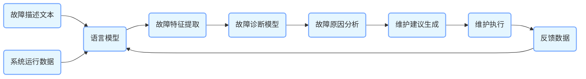

# 语言模型在复杂系统故障诊断与航空航天维护中的实践应用研究

> 关键词：语言模型、复杂系统故障诊断、航空航天维护、自然语言处理、机器学习

> 摘要：本文深入探讨了语言模型在复杂系统故障诊断与航空航天维护领域的实践应用。首先介绍了研究的背景、目的、预期读者和文档结构，对相关术语进行了清晰定义。阐述了语言模型及相关核心概念的原理与联系，通过 Mermaid 流程图直观展示其架构。详细讲解了核心算法原理，并用 Python 代码进行具体阐述。给出了数学模型和公式，并举例说明。通过项目实战，从开发环境搭建、源代码实现到代码解读进行了全面分析。探讨了语言模型在航空航天维护等实际场景中的应用，推荐了学习资源、开发工具框架和相关论文著作。最后总结了未来发展趋势与挑战，解答了常见问题，并提供了扩展阅读与参考资料。

## 1. 背景介绍 
### 1.1 目的和范围
在现代科技飞速发展的今天，复杂系统如航空航天系统的规模和复杂度不断增加。这些系统一旦出现故障，可能会导致严重的后果，如飞行事故、经济损失等。因此，高效准确的故障诊断和及时有效的维护至关重要。本研究的目的在于探索语言模型在复杂系统故障诊断与航空航天维护中的应用，提高故障诊断的准确性和效率，降低维护成本，提升系统的可靠性和安全性。

本研究的范围涵盖了语言模型在复杂系统故障诊断中的原理、算法、应用场景等方面，重点聚焦于航空航天维护领域。包括如何利用语言模型处理故障描述文本、分析故障原因、预测故障发展趋势以及提供维护建议等。

### 1.2 预期读者
本文的预期读者包括从事复杂系统故障诊断、航空航天维护领域的工程师、技术人员、研究人员，以及对自然语言处理、机器学习在工业领域应用感兴趣的学者和学生。对于那些希望了解如何利用先进技术提高复杂系统可靠性和维护效率的专业人士，本文将提供有价值的参考。

### 1.3 文档结构概述
本文将按照以下结构进行组织：首先介绍研究的背景信息，包括目的、范围、预期读者和文档结构概述，以及相关术语的定义。接着阐述核心概念与联系，展示其原理和架构。然后详细讲解核心算法原理和具体操作步骤，并用 Python 代码进行示例。随后给出数学模型和公式，并通过举例进行说明。通过项目实战部分，展示语言模型在实际应用中的开发环境搭建、源代码实现和代码解读。探讨语言模型在实际应用场景中的应用，推荐相关的学习资源、开发工具框架和论文著作。最后总结未来发展趋势与挑战，解答常见问题，并提供扩展阅读与参考资料。

### 1.4 术语表
#### 1.4.1 核心术语定义
- **语言模型**：是一种基于概率统计的模型，用于对自然语言文本进行建模，预测文本中单词或字符的出现概率。常见的语言模型有基于规则的语言模型、统计语言模型和深度学习语言模型。
- **复杂系统故障诊断**：指对复杂系统（如航空航天系统、工业控制系统等）中出现的故障进行检测、定位和原因分析的过程。
- **航空航天维护**：包括对航空航天器及其相关设备进行定期检查、保养、维修和故障排除等工作，以确保其安全可靠运行。
- **自然语言处理（NLP）**：是人工智能的一个分支，主要研究如何让计算机理解、处理和生成自然语言文本。
- **机器学习**：是一门多领域交叉学科，涉及概率论、统计学、逼近论、凸分析、算法复杂度理论等多门学科。它专门研究计算机怎样模拟或实现人类的学习行为，以获取新的知识或技能，重新组织已有的知识结构使之不断改善自身的性能。

#### 1.4.2 相关概念解释
- **故障描述文本**：是指在故障发生后，由操作人员、传感器等记录下来的关于故障现象、发生时间、发生地点等信息的文本。
- **故障原因分析**：通过对故障描述文本、系统运行数据等进行分析，找出导致故障发生的根本原因。
- **故障预测**：根据系统的历史故障数据、当前运行状态等信息，预测系统未来可能出现的故障。
- **维护建议**：根据故障诊断结果和系统的维护要求，提供的关于如何修复故障、进行预防性维护等方面的建议。

#### 1.4.3 缩略词列表
- **NLP**：自然语言处理（Natural Language Processing）
- **ML**：机器学习（Machine Learning）
- **DNN**：深度神经网络（Deep Neural Network）
- **RNN**：循环神经网络（Recurrent Neural Network）
- **LSTM**：长短期记忆网络（Long Short-Term Memory）
- **GRU**：门控循环单元（Gated Recurrent Unit）

## 2. 核心概念与联系 

### 核心概念原理
#### 语言模型原理
语言模型的基本原理是根据已有的文本数据，学习单词或字符之间的概率关系。例如，在一个简单的二元语言模型中，给定前一个单词，预测下一个单词的概率。其数学表达式为：

$$P(w_n|w_1, w_2, \cdots, w_{n-1})$$

其中，$w_1, w_2, \cdots, w_n$ 表示文本中的单词序列，$P(w_n|w_1, w_2, \cdots, w_{n-1})$ 表示在已知前 $n-1$ 个单词的情况下，第 $n$ 个单词出现的概率。

在深度学习时代，常用的语言模型如循环神经网络（RNN）及其变体长短期记忆网络（LSTM）和门控循环单元（GRU），它们能够处理序列数据，通过不断更新隐藏状态来捕捉文本中的上下文信息。

#### 复杂系统故障诊断原理
复杂系统故障诊断的原理是通过对系统的各种数据（如传感器数据、故障描述文本等）进行分析，识别系统是否出现故障，并确定故障的位置和原因。常见的故障诊断方法包括基于模型的方法、基于数据驱动的方法和基于知识的方法。

基于数据驱动的方法利用机器学习和深度学习算法，从大量的历史故障数据中学习故障模式，从而对新的故障进行诊断。基于知识的方法则利用专家知识和规则来进行故障诊断。

#### 航空航天维护原理
航空航天维护的原理是通过定期检查、保养和维修航空航天器及其相关设备，确保其性能和安全性。维护工作包括预防性维护和纠正性维护。预防性维护是在故障发生之前采取措施，防止故障的发生；纠正性维护是在故障发生后进行修复。

### 核心概念架构
以下是语言模型在复杂系统故障诊断与航空航天维护中的架构示意图：



该架构的工作流程如下：
1. 收集故障描述文本和系统运行数据。
2. 将这些数据输入到语言模型中，进行特征提取。
3. 利用故障诊断模型对提取的特征进行分析，判断是否存在故障。
4. 如果存在故障，进行故障原因分析，并生成维护建议。
5. 执行维护操作，并将反馈数据再次输入到语言模型中，进行模型更新和优化。

## 3. 核心算法原理 & 具体操作步骤 

### 核心算法原理
在语言模型中，我们以长短期记忆网络（LSTM）为例进行讲解。LSTM 是一种特殊的循环神经网络，能够解决传统 RNN 中的梯度消失问题，更好地捕捉序列数据中的长期依赖关系。

LSTM 单元包含三个门：输入门、遗忘门和输出门。输入门决定了新的输入信息有多少可以进入单元状态；遗忘门决定了单元状态中有多少信息需要被遗忘；输出门决定了单元状态中有多少信息可以输出。

以下是 LSTM 单元的数学表达式：

- 遗忘门：
$$f_t = \sigma(W_f[h_{t-1}, x_t] + b_f)$$

- 输入门：
$$i_t = \sigma(W_i[h_{t-1}, x_t] + b_i)$$

$$\tilde{C}_t = \tanh(W_C[h_{t-1}, x_t] + b_C)$$

- 单元状态更新：
$$C_t = f_t \odot C_{t-1} + i_t \odot \tilde{C}_t$$

- 输出门：
$$o_t = \sigma(W_o[h_{t-1}, x_t] + b_o)$$

$$h_t = o_t \odot \tanh(C_t)$$

其中，$x_t$ 是当前时刻的输入，$h_{t-1}$ 是上一时刻的隐藏状态，$C_{t-1}$ 是上一时刻的单元状态，$W_f, W_i, W_C, W_o$ 是权重矩阵，$b_f, b_i, b_C, b_o$ 是偏置向量，$\sigma$ 是 sigmoid 函数，$\tanh$ 是双曲正切函数，$\odot$ 表示逐元素相乘。

### 具体操作步骤
以下是使用 Python 和 PyTorch 实现一个简单的 LSTM 语言模型进行故障描述文本分类的示例代码：

```python
import torch
import torch.nn as nn
import torch.optim as optim
from torch.utils.data import Dataset, DataLoader

# 定义数据集类
class FaultDescriptionDataset(Dataset):
    def __init__(self, data, labels):
        self.data = data
        self.labels = labels

    def __len__(self):
        return len(self.data)

    def __getitem__(self, idx):
        return self.data[idx], self.labels[idx]

# 定义 LSTM 语言模型
class LSTMModel(nn.Module):
    def __init__(self, input_size, hidden_size, num_layers, num_classes):
        super(LSTMModel, self).__init__()
        self.hidden_size = hidden_size
        self.num_layers = num_layers
        self.lstm = nn.LSTM(input_size, hidden_size, num_layers, batch_first=True)
        self.fc = nn.Linear(hidden_size, num_classes)

    def forward(self, x):
        h0 = torch.zeros(self.num_layers, x.size(0), self.hidden_size).to(x.device)
        c0 = torch.zeros(self.num_layers, x.size(0), self.hidden_size).to(x.device)

        out, _ = self.lstm(x, (h0, c0))
        out = out[:, -1, :]
        out = self.fc(out)
        return out

# 超参数设置
input_size = 100
hidden_size = 128
num_layers = 2
num_classes = 5
batch_size = 32
num_epochs = 10
learning_rate = 0.001

# 生成随机数据
data = torch.randn(1000, 20, input_size)
labels = torch.randint(0, num_classes, (1000,))

# 创建数据集和数据加载器
dataset = FaultDescriptionDataset(data, labels)
dataloader = DataLoader(dataset, batch_size=batch_size, shuffle=True)

# 初始化模型、损失函数和优化器
model = LSTMModel(input_size, hidden_size, num_layers, num_classes)
criterion = nn.CrossEntropyLoss()
optimizer = optim.Adam(model.parameters(), lr=learning_rate)

# 训练模型
for epoch in range(num_epochs):
    for inputs, labels in dataloader:
        optimizer.zero_grad()
        outputs = model(inputs)
        loss = criterion(outputs, labels)
        loss.backward()
        optimizer.step()

    print(f'Epoch [{epoch+1}/{num_epochs}], Loss: {loss.item():.4f}')
```

### 代码解释
1. **数据集类**：`FaultDescriptionDataset` 类用于封装故障描述文本数据和对应的标签，实现了 `__len__` 和 `__getitem__` 方法，方便数据加载。
2. **LSTM 模型类**：`LSTMModel` 类定义了一个 LSTM 语言模型，包含一个 LSTM 层和一个全连接层。`forward` 方法实现了模型的前向传播过程。
3. **超参数设置**：设置了输入大小、隐藏层大小、层数、类别数、批量大小、训练轮数和学习率等超参数。
4. **数据生成和加载**：生成随机数据，并创建数据集和数据加载器。
5. **模型初始化**：初始化 LSTM 模型、交叉熵损失函数和 Adam 优化器。
6. **模型训练**：通过多个训练轮次，不断更新模型的参数，最小化损失函数。

## 4. 数学模型和公式 & 详细讲解 & 举例说明 

### 语言模型的数学模型
#### 统计语言模型
统计语言模型基于概率统计的方法，通过计算单词序列的概率来评估文本的合理性。最常见的统计语言模型是 n 元语法模型（n-gram model）。

对于一个长度为 $N$ 的单词序列 $w_1, w_2, \cdots, w_N$，其概率可以表示为：

$$P(w_1, w_2, \cdots, w_N) = \prod_{i=1}^{N} P(w_i|w_1, w_2, \cdots, w_{i-1})$$

为了简化计算，n 元语法模型假设每个单词的出现只依赖于前 $n-1$ 个单词，即：

$$P(w_i|w_1, w_2, \cdots, w_{i-1}) \approx P(w_i|w_{i-(n-1)}, \cdots, w_{i-1})$$

例如，二元语法模型（bigram model）中，$n=2$，则：

$$P(w_i|w_1, w_2, \cdots, w_{i-1}) \approx P(w_i|w_{i-1})$$

#### 深度学习语言模型
深度学习语言模型如 LSTM、GRU 等，通过神经网络来学习单词之间的复杂关系。以 LSTM 为例，其损失函数通常使用交叉熵损失函数。

对于一个包含 $N$ 个样本的数据集，每个样本的真实标签为 $y_i$，模型的预测输出为 $\hat{y}_i$，交叉熵损失函数的定义为：

$$L = -\frac{1}{N} \sum_{i=1}^{N} \sum_{j=1}^{C} y_{ij} \log(\hat{y}_{ij})$$

其中，$C$ 是类别数，$y_{ij}$ 是第 $i$ 个样本的第 $j$ 个类别的真实标签（通常为 0 或 1），$\hat{y}_{ij}$ 是模型对第 $i$ 个样本的第 $j$ 个类别的预测概率。

### 故障诊断的数学模型
#### 基于分类的故障诊断
在基于分类的故障诊断中，通常使用机器学习或深度学习模型将故障描述文本分类到不同的故障类别中。常用的分类算法有逻辑回归、支持向量机、神经网络等。

以逻辑回归为例，对于一个输入特征向量 $x$，其输出的概率可以表示为：

$$P(y=1|x) = \frac{1}{1 + e^{-(w^T x + b)}}$$

其中，$y$ 是类别标签（0 或 1），$w$ 是权重向量，$b$ 是偏置项。

#### 基于回归的故障诊断
在基于回归的故障诊断中，模型的目标是预测故障的严重程度或剩余使用寿命等连续值。常用的回归算法有线性回归、岭回归、神经网络回归等。

以线性回归为例，对于一个输入特征向量 $x$，其输出的预测值可以表示为：

$$\hat{y} = w^T x + b$$

其中，$\hat{y}$ 是预测值，$w$ 是权重向量，$b$ 是偏置项。

### 举例说明
#### 语言模型举例
假设我们有一个简单的文本数据集：["The cat is on the mat", "The dog is in the yard"]。我们可以使用二元语法模型来计算单词序列的概率。

例如，计算 "The cat" 出现的概率：

- 首先统计 "The" 出现的次数 $N_{The}$ 和 "The cat" 出现的次数 $N_{The cat}$。
- 则 $P(cat|The) = \frac{N_{The cat}}{N_{The}}$。

#### 故障诊断举例
假设我们有一个故障诊断数据集，包含故障描述文本和对应的故障类别标签。我们可以使用逻辑回归模型进行故障分类。

例如，对于一个新的故障描述文本 "The engine is making strange noises"，模型会根据学习到的权重向量 $w$ 和偏置项 $b$ 计算该文本属于每个故障类别的概率，然后选择概率最大的类别作为预测结果。

## 5. 项目实战：代码实际案例和详细解释说明 

### 5.1  开发环境搭建
#### 安装 Python
首先，确保你已经安装了 Python 3.x 版本。可以从 Python 官方网站（https://www.python.org/downloads/）下载并安装。

#### 安装 PyTorch
PyTorch 是一个流行的深度学习框架，我们可以使用以下命令安装：

```sh
pip install torch torchvision
```

#### 安装其他依赖库
还需要安装一些其他的依赖库，如 NumPy、Pandas、Scikit-learn 等：

```sh
pip install numpy pandas scikit-learn
```

### 5.2  源代码详细实现和代码解读
以下是一个完整的项目实战代码示例，使用 LSTM 语言模型对航空航天故障描述文本进行分类：

```python
import torch
import torch.nn as nn
import torch.optim as optim
from torch.utils.data import Dataset, DataLoader
import pandas as pd
from sklearn.model_selection import train_test_split
from sklearn.preprocessing import LabelEncoder
import numpy as np

# 加载数据集
data = pd.read_csv('fault_description.csv')
texts = data['description'].values
labels = data['label'].values

# 标签编码
label_encoder = LabelEncoder()
labels = label_encoder.fit_transform(labels)

# 划分训练集和测试集
train_texts, test_texts, train_labels, test_labels = train_test_split(texts, labels, test_size=0.2, random_state=42)

# 文本向量化
def vectorize_text(texts, max_length):
    tokenizer = {word: idx for idx, word in enumerate(set(' '.join(texts).split()))}
    vectors = []
    for text in texts:
        vector = [tokenizer.get(word, 0) for word in text.split()]
        vector = vector[:max_length] + [0] * (max_length - len(vector))
        vectors.append(vector)
    return np.array(vectors)

max_length = 50
train_vectors = vectorize_text(train_texts, max_length)
test_vectors = vectorize_text(test_texts, max_length)

# 定义数据集类
class FaultDescriptionDataset(Dataset):
    def __init__(self, data, labels):
        self.data = torch.tensor(data, dtype=torch.float32)
        self.labels = torch.tensor(labels, dtype=torch.long)

    def __len__(self):
        return len(self.data)

    def __getitem__(self, idx):
        return self.data[idx], self.labels[idx]

# 定义 LSTM 语言模型
class LSTMModel(nn.Module):
    def __init__(self, input_size, hidden_size, num_layers, num_classes):
        super(LSTMModel, self).__init__()
        self.hidden_size = hidden_size
        self.num_layers = num_layers
        self.embedding = nn.Embedding(input_size, hidden_size)
        self.lstm = nn.LSTM(hidden_size, hidden_size, num_layers, batch_first=True)
        self.fc = nn.Linear(hidden_size, num_classes)

    def forward(self, x):
        x = self.embedding(x.long())
        h0 = torch.zeros(self.num_layers, x.size(0), self.hidden_size).to(x.device)
        c0 = torch.zeros(self.num_layers, x.size(0), self.hidden_size).to(x.device)

        out, _ = self.lstm(x, (h0, c0))
        out = out[:, -1, :]
        out = self.fc(out)
        return out

# 超参数设置
input_size = len(set(' '.join(texts).split()))
hidden_size = 128
num_layers = 2
num_classes = len(set(labels))
batch_size = 32
num_epochs = 10
learning_rate = 0.001

# 创建数据集和数据加载器
train_dataset = FaultDescriptionDataset(train_vectors, train_labels)
train_dataloader = DataLoader(train_dataset, batch_size=batch_size, shuffle=True)

test_dataset = FaultDescriptionDataset(test_vectors, test_labels)
test_dataloader = DataLoader(test_dataset, batch_size=batch_size, shuffle=False)

# 初始化模型、损失函数和优化器
model = LSTMModel(input_size, hidden_size, num_layers, num_classes)
criterion = nn.CrossEntropyLoss()
optimizer = optim.Adam(model.parameters(), lr=learning_rate)

# 训练模型
for epoch in range(num_epochs):
    model.train()
    for inputs, labels in train_dataloader:
        optimizer.zero_grad()
        outputs = model(inputs)
        loss = criterion(outputs, labels)
        loss.backward()
        optimizer.step()

    print(f'Epoch [{epoch+1}/{num_epochs}], Loss: {loss.item():.4f}')

# 测试模型
model.eval()
correct = 0
total = 0
with torch.no_grad():
    for inputs, labels in test_dataloader:
        outputs = model(inputs)
        _, predicted = torch.max(outputs.data, 1)
        total += labels.size(0)
        correct += (predicted == labels).sum().item()

print(f'Test Accuracy: {100 * correct / total:.2f}%')
```

### 5.3  代码解读与分析
#### 数据加载和预处理
- 使用 `pandas` 库加载包含故障描述文本和标签的 CSV 文件。
- 使用 `LabelEncoder` 对标签进行编码，将字符串标签转换为整数标签。
- 使用 `train_test_split` 函数将数据集划分为训练集和测试集。
- 定义 `vectorize_text` 函数将文本转换为向量表示，使用简单的词袋模型。

#### 数据集类和数据加载器
- 定义 `FaultDescriptionDataset` 类，将文本向量和标签封装为数据集。
- 使用 `DataLoader` 类创建训练集和测试集的数据加载器，方便批量加载数据。

#### LSTM 模型定义
- 定义 `LSTMModel` 类，包含一个嵌入层、一个 LSTM 层和一个全连接层。
- `forward` 方法实现了模型的前向传播过程，包括嵌入、LSTM 计算和全连接层计算。

#### 模型训练和测试
- 初始化模型、损失函数和优化器。
- 通过多个训练轮次，不断更新模型的参数，最小化损失函数。
- 在测试集上评估模型的准确率。

## 6. 实际应用场景 
### 航空航天系统故障诊断
在航空航天领域，语言模型可以用于对飞行员、地勤人员等提供的故障描述文本进行分析，快速准确地诊断故障。例如，当飞行员报告 "The left engine is vibrating abnormally" 时，语言模型可以根据预训练的知识和历史故障数据，判断可能的故障原因，如发动机叶片损坏、轴承故障等，并提供相应的维护建议。

### 航空航天设备维护计划制定
语言模型可以分析设备的维护历史记录、故障预测结果等信息，制定合理的维护计划。例如，根据设备的使用时间、故障频率等因素，预测设备可能出现故障的时间，提前安排维护人员进行预防性维护，减少设备的停机时间和维修成本。

### 航空航天知识管理
语言模型可以帮助管理航空航天领域的大量知识和文档，如维修手册、技术报告、故障案例等。通过对这些知识进行语义理解和分析，实现知识的快速检索和推荐。例如，当维护人员遇到一个复杂的故障问题时，语言模型可以根据问题描述，快速检索相关的知识文档和解决方案。

### 航空航天人员培训
语言模型可以用于开发智能培训系统，为航空航天人员提供个性化的培训内容。例如，根据学员的学习进度和知识掌握情况，生成针对性的练习题和案例分析，帮助学员提高故障诊断和维护能力。

## 7. 工具和资源推荐
### 7.1 学习资源推荐
#### 7.1.1 书籍推荐
- 《自然语言处理入门》：这本书详细介绍了自然语言处理的基本概念、算法和应用，适合初学者入门。
- 《深度学习》：由 Ian Goodfellow、Yoshua Bengio 和 Aaron Courville 合著，是深度学习领域的经典教材，涵盖了神经网络、卷积神经网络、循环神经网络等内容。
- 《Python 自然语言处理》：介绍了如何使用 Python 进行自然语言处理，包括文本预处理、词性标注、命名实体识别等技术。

#### 7.1.2 在线课程
- Coursera 上的 "Natural Language Processing Specialization"：由深度学习领域的知名学者授课，系统地介绍了自然语言处理的各个方面。
- edX 上的 "Introduction to Artificial Intelligence"：涵盖了人工智能的基本概念、算法和应用，包括自然语言处理和机器学习。
- 网易云课堂上的 "Python 深度学习实战"：通过实际案例介绍了如何使用 Python 和深度学习框架进行项目开发。

#### 7.1.3 技术博客和网站
- Medium 上的 Towards Data Science：有很多关于自然语言处理、机器学习和深度学习的高质量文章。
- Kaggle：是一个数据科学竞赛平台，上面有很多关于自然语言处理的竞赛和优秀解决方案。
- Hugging Face：专注于自然语言处理，提供了大量的预训练模型和工具。

### 7.2 开发工具框架推荐
#### 7.2.1 IDE和编辑器
- PyCharm：是一款专门为 Python 开发设计的集成开发环境，具有强大的代码编辑、调试和项目管理功能。
- Visual Studio Code：是一款轻量级的代码编辑器，支持多种编程语言和插件，适合快速开发和调试。
- Jupyter Notebook：是一个交互式的开发环境，适合进行数据分析和模型实验。

#### 7.2.2 调试和性能分析工具
- TensorBoard：是 TensorFlow 提供的可视化工具，可以用于监控模型的训练过程、查看模型的结构和性能指标。
- PyTorch Profiler：是 PyTorch 提供的性能分析工具，可以帮助开发者找出代码中的性能瓶颈。
- cProfile：是 Python 自带的性能分析工具，可以分析代码的运行时间和函数调用次数。

#### 7.2.3 相关框架和库
- PyTorch：是一个开源的深度学习框架，具有动态图、易于使用等特点，广泛应用于自然语言处理和计算机视觉领域。
- TensorFlow：是 Google 开发的深度学习框架，具有强大的分布式训练和部署能力。
- Transformers：是 Hugging Face 开发的自然语言处理库，提供了大量的预训练模型和工具，如 BERT、GPT 等。

### 7.3 相关论文著作推荐
#### 7.3.1 经典论文
- "Attention Is All You Need"：提出了 Transformer 架构，是自然语言处理领域的重要突破。
- "Long Short-Term Memory"：介绍了长短期记忆网络（LSTM）的原理和应用。
- "A Neural Probabilistic Language Model"：提出了基于神经网络的语言模型，为深度学习语言模型的发展奠定了基础。

#### 7.3.2 最新研究成果
- 关注 ACL（Association for Computational Linguistics）、EMNLP（Conference on Empirical Methods in Natural Language Processing）等自然语言处理领域的顶级会议，了解最新的研究成果。
- 在 arXiv 上搜索关于语言模型在故障诊断和航空航天维护方面的最新论文。

#### 7.3.3 应用案例分析
- 阅读航空航天领域的技术报告和案例分析，了解语言模型在实际应用中的效果和挑战。
- 参考相关的行业白皮书和研究报告，了解语言模型在复杂系统故障诊断和维护中的应用趋势。

## 8. 总结：未来发展趋势与挑战
### 未来发展趋势
#### 多模态融合
未来的语言模型将不仅仅局限于处理文本数据，还会与图像、音频、视频等多模态数据进行融合。在航空航天故障诊断中，结合故障现场的图像、声音等信息，可以更全面准确地诊断故障。

#### 强化学习与语言模型的结合
强化学习可以让语言模型在与环境的交互中不断学习和优化，提高故障诊断和维护决策的能力。例如，通过强化学习，语言模型可以根据不同的故障情况选择最优的维护策略。

#### 可解释性语言模型
随着语言模型在航空航天等关键领域的应用越来越广泛，其可解释性变得尤为重要。未来的语言模型将更加注重可解释性，让用户能够理解模型的决策过程和依据。

#### 边缘计算与语言模型
在航空航天设备上部署边缘计算设备，结合语言模型进行实时故障诊断和处理，可以减少数据传输延迟，提高系统的响应速度和可靠性。

### 挑战
#### 数据质量和数量
高质量的故障描述数据和系统运行数据是训练语言模型的关键。然而，在航空航天领域，数据的收集和标注往往比较困难，数据的质量和数量可能无法满足模型训练的需求。

#### 模型复杂度和计算资源
随着语言模型的不断发展，模型的复杂度越来越高，需要大量的计算资源进行训练和推理。在航空航天设备上，计算资源通常比较有限，如何在有限的资源下实现高效的模型部署是一个挑战。

#### 安全性和可靠性
航空航天系统对安全性和可靠性要求极高，语言模型的错误诊断或误判可能会导致严重的后果。因此，如何确保语言模型在复杂环境下的安全性和可靠性是一个亟待解决的问题。

#### 领域知识融合
语言模型需要融合航空航天领域的专业知识，才能更好地进行故障诊断和维护。如何将领域知识有效地融入到语言模型中，是一个具有挑战性的问题。

## 9. 附录：常见问题与解答
### 问题 1：语言模型在航空航天故障诊断中的准确率如何保证？
解答：为了保证语言模型在航空航天故障诊断中的准确率，需要从以下几个方面入手：
- 收集高质量的故障数据，包括故障描述文本、系统运行数据等，并进行准确的标注。
- 选择合适的语言模型架构和算法，如 LSTM、Transformer 等，并进行充分的调优。
- 进行模型评估和验证，使用交叉验证、测试集等方法评估模型的性能，并根据评估结果进行模型改进。
- 融合领域知识，将航空航天领域的专业知识融入到模型中，提高模型的诊断能力。

### 问题 2：语言模型在航空航天维护中的实时性如何保障？
解答：为了保障语言模型在航空航天维护中的实时性，可以采取以下措施：
- 使用轻量级的语言模型架构，减少模型的计算复杂度。
- 采用边缘计算技术，在航空航天设备上部署边缘计算设备，实现本地数据处理和模型推理，减少数据传输延迟。
- 对模型进行优化，如量化、剪枝等，提高模型的推理速度。
- 建立实时数据处理和反馈机制，及时处理新的故障数据，更新模型的参数。

### 问题 3：如何将领域知识融入到语言模型中？
解答：可以通过以下几种方式将领域知识融入到语言模型中：
- 知识图谱：构建航空航天领域的知识图谱，将实体和关系信息融入到语言模型的训练中。
- 预训练模型微调：使用领域内的文本数据对预训练的语言模型进行微调，让模型学习领域知识。
- 特征工程：将领域知识作为额外的特征添加到模型的输入中，帮助模型更好地理解数据。
- 规则融合：将领域规则和专家知识与语言模型的输出进行融合，提高模型的决策准确性。

### 问题 4：语言模型在航空航天故障诊断中可能会遇到哪些挑战？
解答：语言模型在航空航天故障诊断中可能会遇到以下挑战：
- 数据质量和数量：航空航天领域的数据收集和标注困难，数据的质量和数量可能无法满足模型训练的需求。
- 模型复杂度和计算资源：语言模型的复杂度越来越高，需要大量的计算资源进行训练和推理，而航空航天设备上的计算资源通常比较有限。
- 安全性和可靠性：航空航天系统对安全性和可靠性要求极高，语言模型的错误诊断或误判可能会导致严重的后果。
- 领域知识融合：如何将航空航天领域的专业知识有效地融入到语言模型中，是一个具有挑战性的问题。

## 10. 扩展阅读 & 参考资料
### 扩展阅读
- 《航空航天系统工程》：介绍了航空航天系统的设计、开发、测试和维护等方面的知识，有助于深入了解航空航天领域的需求和特点。
- 《人工智能与复杂系统》：探讨了人工智能在复杂系统中的应用，包括故障诊断、预测和控制等方面。
- 《自然语言处理进阶》：深入介绍了自然语言处理的高级技术和算法，如语义理解、知识图谱等。

### 参考资料
- [PyTorch 官方文档](https://pytorch.org/docs/stable/index.html)
- [Hugging Face Transformers 文档](https://huggingface.co/docs/transformers/index)
- [TensorFlow 官方文档](https://www.tensorflow.org/api_docs)
- [ACL 会议论文集](https://aclanthology.org/)
- [EMNLP 会议论文集](https://aclanthology.org/volumes/series.emnlp/)