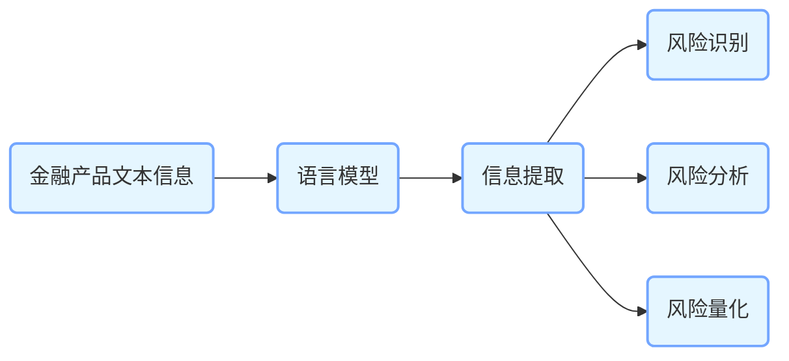

# 语言模型在复杂金融产品风险评估中的应用

> 关键词：语言模型、复杂金融产品、风险评估、自然语言处理、金融科技

> 摘要：本文深入探讨了语言模型在复杂金融产品风险评估中的应用。首先介绍了研究的背景、目的、预期读者等信息，明确了文档的结构和相关术语。接着阐述了语言模型与复杂金融产品风险评估的核心概念及联系，通过文本示意图和 Mermaid 流程图进行直观展示。详细讲解了核心算法原理，并给出 Python 源代码进行说明，同时介绍了相关的数学模型和公式。通过项目实战，展示了代码的实际案例并进行详细解释。分析了语言模型在复杂金融产品风险评估中的实际应用场景，推荐了学习、开发相关的工具和资源以及论文著作。最后总结了未来的发展趋势与挑战，解答了常见问题并提供了扩展阅读和参考资料，旨在为相关领域的研究者和从业者提供全面且深入的技术指导和理论支持。

## 1. 背景介绍 
### 1.1 目的和范围
在当今金融市场中，复杂金融产品层出不穷，其结构和风险特征日益复杂。准确评估这些产品的风险对于投资者、金融机构和监管部门都至关重要。传统的风险评估方法往往基于定量数据和固定的模型，难以充分捕捉复杂金融产品中蕴含的大量文本信息所反映的风险因素。语言模型作为自然语言处理领域的重要技术，具有处理和分析文本数据的强大能力。本研究的目的在于探讨如何将语言模型应用于复杂金融产品的风险评估中，以提高风险评估的准确性和全面性。

本研究的范围涵盖了常见的复杂金融产品，如结构化金融产品、衍生金融产品等。研究内容包括语言模型的原理、在风险评估中的应用方法、相关算法和数学模型，以及通过实际案例展示其应用效果。

### 1.2 预期读者
本文的预期读者包括金融领域的从业者，如投资经理、风险分析师、金融产品设计师等，他们可以通过本文了解语言模型在复杂金融产品风险评估中的应用，为实际工作提供新的思路和方法。同时，计算机科学领域的研究者和开发者，特别是从事自然语言处理和金融科技的人员，也可以从本文中获取相关的技术信息和应用案例。此外，对金融科技感兴趣的学生和爱好者也能从本文中获得有益的知识。

### 1.3 文档结构概述
本文将按照以下结构进行组织：首先介绍背景信息，包括目的、预期读者和文档结构概述等内容。接着阐述语言模型与复杂金融产品风险评估的核心概念及联系，通过文本示意图和 Mermaid 流程图进行直观展示。然后详细讲解核心算法原理，并给出 Python 源代码进行说明，同时介绍相关的数学模型和公式。通过项目实战，展示代码的实际案例并进行详细解释。分析语言模型在复杂金融产品风险评估中的实际应用场景，推荐学习、开发相关的工具和资源以及论文著作。最后总结未来的发展趋势与挑战，解答常见问题并提供扩展阅读和参考资料。

### 1.4 术语表
#### 1.4.1 核心术语定义
- **语言模型**：是一种用于处理自然语言的概率模型，它能够计算一个句子或文本序列出现的概率，从而对语言进行建模和理解。
- **复杂金融产品**：指结构复杂、风险特征难以直接评估的金融产品，通常包含多种金融工具和复杂的条款。
- **风险评估**：对金融产品可能面临的风险进行识别、分析和量化的过程。

#### 1.4.2 相关概念解释
- **自然语言处理（NLP）**：是计算机科学与人工智能领域中的一个重要方向，旨在让计算机能够理解、处理和生成自然语言。
- **金融科技（FinTech）**：是金融和科技的融合，利用现代科技手段创新金融业务模式、流程和产品。

#### 1.4.3 缩略词列表
- **NLP**：Natural Language Processing（自然语言处理）
- **RNN**：Recurrent Neural Network（循环神经网络）
- **LSTM**：Long Short - Term Memory（长短期记忆网络）
- **GRU**：Gated Recurrent Unit（门控循环单元）
- **BERT**：Bidirectional Encoder Representations from Transformers（基于转换器的双向编码器表示）

## 2. 核心概念与联系 

### 语言模型原理
语言模型的核心目标是预测一个词序列的概率分布。常见的语言模型包括基于统计的 n - 元语法模型和基于深度学习的神经网络模型。

- **n - 元语法模型**：n - 元语法模型是一种基于统计的语言模型，它假设一个词的出现只与前面的 n - 1 个词有关。例如，二元语法模型（n = 2）假设一个词的出现只依赖于它前面的一个词。其概率计算公式为：
$$P(w_i|w_{i - 1},w_{i - 2},\cdots,w_1)\approx P(w_i|w_{i - 1},\cdots,w_{i - n + 1})$$

- **神经网络语言模型**：神经网络语言模型通过神经网络来学习语言的表示和概率分布。常见的神经网络语言模型包括循环神经网络（RNN）、长短期记忆网络（LSTM）、门控循环单元（GRU）和基于转换器（Transformer）的模型，如 BERT。

### 复杂金融产品风险评估原理
复杂金融产品的风险评估通常包括以下几个步骤：
1. **风险识别**：确定金融产品可能面临的风险类型，如市场风险、信用风险、流动性风险等。
2. **风险分析**：分析各种风险因素对金融产品价值的影响程度。
3. **风险量化**：使用定量方法对风险进行度量，如计算风险价值（VaR）、条件风险价值（CVaR）等。

### 语言模型与复杂金融产品风险评估的联系
语言模型可以在复杂金融产品风险评估中发挥重要作用。金融产品的相关文档，如招股说明书、评级报告等，包含了大量的文本信息，这些信息反映了产品的风险特征。语言模型可以对这些文本进行处理和分析，提取有用的信息，帮助识别和评估风险。例如，通过分析文本中的关键词和语义信息，可以发现潜在的风险因素；通过对文本的情感分析，可以了解市场对金融产品的看法和预期。

### 文本示意图
```plaintext
语言模型
|-- n - 元语法模型
|-- 神经网络语言模型
|   |-- RNN
|   |-- LSTM
|   |-- GRU
|   |-- BERT

复杂金融产品风险评估
|-- 风险识别
|-- 风险分析
|-- 风险量化

联系：语言模型处理金融产品文本信息 -> 辅助风险识别、分析和量化
```

### Mermaid 流程图


## 3. 核心算法原理 & 具体操作步骤 

### 基于 BERT 的文本分类算法原理
BERT 是一种预训练的语言模型，它通过双向的自注意力机制学习文本的上下文表示。在复杂金融产品风险评估中，可以使用 BERT 进行文本分类，将金融产品的文本信息分类到不同的风险等级。

#### 具体操作步骤
1. **数据预处理**：收集金融产品的文本数据，并进行清洗和标注。标注的类别可以根据风险等级进行划分，如低风险、中风险、高风险等。
2. **模型加载**：加载预训练的 BERT 模型。
3. **微调模型**：在标注好的金融文本数据上对 BERT 模型进行微调，使其适应风险分类任务。
4. **预测**：使用微调后的模型对新的金融文本数据进行风险分类预测。

#### Python 源代码实现
```python
import torch
from torch.utils.data import Dataset, DataLoader
from transformers import BertTokenizer, BertForSequenceClassification, AdamW
from sklearn.model_selection import train_test_split
import pandas as pd

# 定义数据集类
class FinancialDataset(Dataset):
    def __init__(self, texts, labels, tokenizer, max_length):
        self.texts = texts
        self.labels = labels
        self.tokenizer = tokenizer
        self.max_length = max_length

    def __len__(self):
        return len(self.texts)

    def __getitem__(self, idx):
        text = str(self.texts[idx])
        label = self.labels[idx]
        encoding = self.tokenizer.encode_plus(
            text,
            add_special_tokens=True,
            max_length=self.max_length,
            padding='max_length',
            truncation=True,
            return_tensors='pt'
        )
        return {
            'input_ids': encoding['input_ids'].flatten(),
            'attention_mask': encoding['attention_mask'].flatten(),
            'labels': torch.tensor(label, dtype=torch.long)
        }

# 加载数据
data = pd.read_csv('financial_data.csv')
texts = data['text'].tolist()
labels = data['label'].tolist()

# 划分训练集和测试集
train_texts, test_texts, train_labels, test_labels = train_test_split(texts, labels, test_size=0.2, random_state=42)

# 加载 tokenizer 和模型
tokenizer = BertTokenizer.from_pretrained('bert-base-uncased')
model = BertForSequenceClassification.from_pretrained('bert-base-uncased', num_labels=3)

# 创建数据集和数据加载器
train_dataset = FinancialDataset(train_texts, train_labels, tokenizer, max_length=128)
test_dataset = FinancialDataset(test_texts, test_labels, tokenizer, max_length=128)

train_dataloader = DataLoader(train_dataset, batch_size=16, shuffle=True)
test_dataloader = DataLoader(test_dataset, batch_size=16, shuffle=False)

# 定义优化器
optimizer = AdamW(model.parameters(), lr=2e-5)

# 训练模型
device = torch.device('cuda' if torch.cuda.is_available() else 'cpu')
model.to(device)

epochs = 3
for epoch in range(epochs):
    model.train()
    total_loss = 0
    for batch in train_dataloader:
        input_ids = batch['input_ids'].to(device)
        attention_mask = batch['attention_mask'].to(device)
        labels = batch['labels'].to(device)

        model.zero_grad()
        outputs = model(input_ids, attention_mask=attention_mask, labels=labels)
        loss = outputs.loss
        total_loss += loss.item()
        loss.backward()
        optimizer.step()

    print(f'Epoch {epoch + 1}: Loss = {total_loss / len(train_dataloader)}')

# 评估模型
model.eval()
correct_predictions = 0
total_predictions = 0
for batch in test_dataloader:
    input_ids = batch['input_ids'].to(device)
    attention_mask = batch['attention_mask'].to(device)
    labels = batch['labels'].to(device)

    with torch.no_grad():
        outputs = model(input_ids, attention_mask=attention_mask)
        logits = outputs.logits
        predictions = torch.argmax(logits, dim=1)
        correct_predictions += (predictions == labels).sum().item()
        total_predictions += labels.size(0)

accuracy = correct_predictions / total_predictions
print(f'Test Accuracy: {accuracy}')
```

## 4. 数学模型和公式 & 详细讲解 & 举例说明 

### 风险价值（VaR）模型
风险价值（VaR）是一种常用的风险度量方法，它表示在一定的置信水平下，某一金融资产或投资组合在未来特定时期内可能遭受的最大损失。

#### 数学公式
在正态分布假设下，VaR 的计算公式为：
$$VaR = z_{\alpha}\sigma\sqrt{\Delta t}V_0$$
其中：
- $z_{\alpha}$ 是标准正态分布的分位数，对应于置信水平 $\alpha$。例如，当置信水平 $\alpha = 95\%$ 时，$z_{\alpha}=1.645$；当置信水平 $\alpha = 99\%$ 时，$z_{\alpha}=2.326$。
- $\sigma$ 是金融资产或投资组合的收益率的标准差。
- $\Delta t$ 是时间间隔。
- $V_0$ 是金融资产或投资组合的初始价值。

#### 详细讲解
VaR 模型的核心思想是通过统计方法来估计金融资产或投资组合的潜在损失。在实际应用中，需要先估计收益率的标准差 $\sigma$，这可以通过历史数据或其他方法来实现。然后根据置信水平选择相应的分位数 $z_{\alpha}$，并确定时间间隔 $\Delta t$ 和初始价值 $V_0$，最后代入公式计算 VaR。

#### 举例说明
假设某投资组合的初始价值 $V_0 = 1000000$ 元，收益率的标准差 $\sigma = 0.05$，时间间隔 $\Delta t = 1$ 天，置信水平 $\alpha = 95\%$。则 $z_{\alpha}=1.645$，代入公式可得：
$$VaR = 1.645\times0.05\times\sqrt{1}\times1000000 = 82250$$
这意味着在 95% 的置信水平下，该投资组合在一天内可能遭受的最大损失为 82250 元。

### 条件风险价值（CVaR）模型
条件风险价值（CVaR）也称为预期尾部损失（ES），它是在 VaR 的基础上进一步考虑了超过 VaR 的损失情况。

#### 数学公式
CVaR 的计算公式为：
$$CVaR_{\alpha}=\frac{1}{1 - \alpha}\int_{\alpha}^{1}VaR_{\beta}d\beta$$
其中：
- $\alpha$ 是置信水平。
- $VaR_{\beta}$ 是置信水平为 $\beta$ 时的 VaR 值。

#### 详细讲解
CVaR 考虑了在极端情况下的损失，它是超过 VaR 的损失的期望值。与 VaR 相比，CVaR 更能反映金融资产或投资组合的尾部风险。

#### 举例说明
假设已经计算出不同置信水平下的 VaR 值，通过数值积分的方法可以计算出 CVaR。例如，当置信水平 $\alpha = 95\%$ 时，通过对 $95\%$ 到 $100\%$ 之间的 VaR 值进行积分并除以 $5\%$，可以得到 CVaR。

## 5. 项目实战：代码实际案例和详细解释说明 

### 5.1  开发环境搭建
#### 操作系统
本项目可以在 Windows、Linux 或 macOS 操作系统上进行开发。建议使用 Linux 系统，如 Ubuntu 18.04 及以上版本，因为 Linux 系统在深度学习开发中具有更好的稳定性和兼容性。

#### 编程语言和库
- **Python**：建议使用 Python 3.7 及以上版本。
- **深度学习框架**：使用 PyTorch 作为深度学习框架，可以通过以下命令安装：
```bash
pip install torch torchvision
```
- **自然语言处理库**：使用 Transformers 库来加载和使用预训练的 BERT 模型，可以通过以下命令安装：
```bash
pip install transformers
```
- **数据处理库**：使用 Pandas 和 Scikit - learn 进行数据处理和划分，可以通过以下命令安装：
```bash
pip install pandas scikit - learn
```

### 5.2  源代码详细实现和代码解读
#### 数据集类的定义
```python
class FinancialDataset(Dataset):
    def __init__(self, texts, labels, tokenizer, max_length):
        self.texts = texts
        self.labels = labels
        self.tokenizer = tokenizer
        self.max_length = max_length

    def __len__(self):
        return len(self.texts)

    def __getitem__(self, idx):
        text = str(self.texts[idx])
        label = self.labels[idx]
        encoding = self.tokenizer.encode_plus(
            text,
            add_special_tokens=True,
            max_length=self.max_length,
            padding='max_length',
            truncation=True,
            return_tensors='pt'
        )
        return {
            'input_ids': encoding['input_ids'].flatten(),
            'attention_mask': encoding['attention_mask'].flatten(),
            'labels': torch.tensor(label, dtype=torch.long)
        }
```
**代码解读**：
- `__init__` 方法：初始化数据集类，接收文本数据、标签、tokenizer 和最大长度作为参数。
- `__len__` 方法：返回数据集的长度。
- `__getitem__` 方法：根据索引获取数据集中的一个样本。对文本进行编码，添加特殊标记，进行填充和截断操作，并返回输入 ID、注意力掩码和标签。

#### 数据加载和模型训练
```python
# 加载数据
data = pd.read_csv('financial_data.csv')
texts = data['text'].tolist()
labels = data['label'].tolist()

# 划分训练集和测试集
train_texts, test_texts, train_labels, test_labels = train_test_split(texts, labels, test_size=0.2, random_state=42)

# 加载 tokenizer 和模型
tokenizer = BertTokenizer.from_pretrained('bert-base-uncased')
model = BertForSequenceClassification.from_pretrained('bert-base-uncased', num_labels=3)

# 创建数据集和数据加载器
train_dataset = FinancialDataset(train_texts, train_labels, tokenizer, max_length=128)
test_dataset = FinancialDataset(test_texts, test_labels, tokenizer, max_length=128)

train_dataloader = DataLoader(train_dataset, batch_size=16, shuffle=True)
test_dataloader = DataLoader(test_dataset, batch_size=16, shuffle=False)

# 定义优化器
optimizer = AdamW(model.parameters(), lr=2e-5)

# 训练模型
device = torch.device('cuda' if torch.cuda.is_available() else 'cpu')
model.to(device)

epochs = 3
for epoch in range(epochs):
    model.train()
    total_loss = 0
    for batch in train_dataloader:
        input_ids = batch['input_ids'].to(device)
        attention_mask = batch['attention_mask'].to(device)
        labels = batch['labels'].to(device)

        model.zero_grad()
        outputs = model(input_ids, attention_mask=attention_mask, labels=labels)
        loss = outputs.loss
        total_loss += loss.item()
        loss.backward()
        optimizer.step()

    print(f'Epoch {epoch + 1}: Loss = {total_loss / len(train_dataloader)}')
```
**代码解读**：
- 数据加载：从 CSV 文件中读取金融文本数据和标签。
- 数据划分：使用 `train_test_split` 函数将数据划分为训练集和测试集。
- 模型加载：加载预训练的 BERT tokenizer 和分类模型。
- 数据集和数据加载器创建：创建训练集和测试集的数据集对象，并使用数据加载器进行批量处理。
- 优化器定义：使用 AdamW 优化器进行模型训练。
- 模型训练：将模型移动到 GPU 或 CPU 上，进行多个 epoch 的训练，计算损失并进行反向传播和参数更新。

#### 模型评估
```python
# 评估模型
model.eval()
correct_predictions = 0
total_predictions = 0
for batch in test_dataloader:
    input_ids = batch['input_ids'].to(device)
    attention_mask = batch['attention_mask'].to(device)
    labels = batch['labels'].to(device)

    with torch.no_grad():
        outputs = model(input_ids, attention_mask=attention_mask)
        logits = outputs.logits
        predictions = torch.argmax(logits, dim=1)
        correct_predictions += (predictions == labels).sum().item()
        total_predictions += labels.size(0)

accuracy = correct_predictions / total_predictions
print(f'Test Accuracy: {accuracy}')
```
**代码解读**：
- 模型评估：将模型设置为评估模式，遍历测试集，进行预测并计算准确率。

### 5.3  代码解读与分析
#### 优点
- **使用预训练模型**：BERT 是预训练的语言模型，具有强大的语言理解能力，可以在少量数据上进行微调，提高训练效率和模型性能。
- **数据处理和批量训练**：使用数据集类和数据加载器进行数据处理和批量训练，提高了代码的可维护性和训练效率。
- **评估指标**：使用准确率作为评估指标，直观地反映了模型的分类性能。

#### 缺点和改进方向
- **数据依赖**：模型的性能高度依赖于训练数据的质量和数量。可以收集更多的金融文本数据，并进行更精细的标注，以提高模型的性能。
- **模型复杂度**：BERT 模型的计算复杂度较高，训练和推理速度较慢。可以考虑使用轻量级的语言模型或进行模型压缩，以提高效率。
- **多模态信息融合**：当前代码只使用了文本信息，可以考虑融合其他模态的信息，如图像、数值数据等，以提高风险评估的准确性。

## 6. 实际应用场景 
### 投资者决策支持
投资者在选择复杂金融产品时，需要对产品的风险进行评估。语言模型可以分析金融产品的招股说明书、评级报告等文本信息，提取关键的风险因素，为投资者提供决策支持。例如，通过对文本的情感分析，了解市场对金融产品的看法；通过对风险条款的提取，帮助投资者识别潜在的风险。

### 金融机构风险管理
金融机构需要对其持有的复杂金融产品进行风险管理。语言模型可以对大量的金融文本数据进行实时监测和分析，及时发现潜在的风险。例如，分析新闻报道、社交媒体等文本信息，了解市场动态和舆情，为金融机构的风险管理提供预警。

### 监管部门监督
监管部门需要对金融市场进行监督，确保金融机构合规运营。语言模型可以帮助监管部门分析金融机构的报告、公告等文本信息，识别潜在的违规行为和风险。例如，通过对金融机构的风险披露文本进行分析，检查其是否准确、完整地披露了风险信息。

## 7. 工具和资源推荐
### 7.1 学习资源推荐
#### 7.1.1 书籍推荐
- 《自然语言处理入门》：作者何晗，本书系统地介绍了自然语言处理的基本概念、方法和技术，适合初学者入门。
- 《深度学习》：作者 Ian Goodfellow、Yoshua Bengio 和 Aaron Courville，本书是深度学习领域的经典著作，对神经网络、深度学习模型等进行了深入的讲解。
- 《金融科技：架构与实践》：作者陈道斌，本书介绍了金融科技的基本概念、技术和应用，对金融科技在风险管理中的应用有详细的阐述。

#### 7.1.2 在线课程
- Coursera 上的“Natural Language Processing Specialization”：由斯坦福大学的教授授课，系统地介绍了自然语言处理的各个方面。
- edX 上的“Deep Learning Fundamentals”：介绍了深度学习的基本原理和方法，包括神经网络、卷积神经网络、循环神经网络等。
- 中国大学 MOOC 上的“金融科技前沿与趋势”：由国内知名高校的教授授课，介绍了金融科技的最新发展和应用。

#### 7.1.3 技术博客和网站
- Medium：有很多关于自然语言处理和金融科技的技术博客文章，作者来自世界各地的研究者和开发者。
- Towards Data Science：专注于数据科学和机器学习领域，有很多关于语言模型和金融数据分析的文章。
- 金融界网站：提供金融市场的新闻、数据和分析，是了解金融行业动态的重要渠道。

### 7.2 开发工具框架推荐
#### 7.2.1 IDE和编辑器
- PyCharm：是一款专业的 Python 集成开发环境，具有代码编辑、调试、版本控制等功能，适合 Python 开发。
- Visual Studio Code：是一款轻量级的代码编辑器，支持多种编程语言，有丰富的插件可以扩展功能，适合快速开发和调试。

#### 7.2.2 调试和性能分析工具
- PyTorch Profiler：是 PyTorch 提供的性能分析工具，可以帮助开发者分析模型的训练和推理性能，找出性能瓶颈。
- TensorBoard：是 TensorFlow 提供的可视化工具，也可以与 PyTorch 结合使用，用于可视化模型的训练过程和性能指标。

#### 7.2.3 相关框架和库
- Transformers：由 Hugging Face 开发的自然语言处理框架，提供了多种预训练的语言模型和工具，方便开发者进行自然语言处理任务。
- Scikit - learn：是一个简单易用的机器学习库，提供了多种机器学习算法和工具，可用于数据处理、模型选择和评估等任务。
- Pandas：是一个强大的数据处理库，提供了数据结构和数据操作工具，方便开发者进行数据清洗、分析和可视化。

### 7.3 相关论文著作推荐
#### 7.3.1 经典论文
- “Attention Is All You Need”：提出了 Transformer 模型，为现代语言模型的发展奠定了基础。
- “BERT: Pre - training of Deep Bidirectional Transformers for Language Understanding”：介绍了 BERT 模型的原理和训练方法，是自然语言处理领域的重要论文。

#### 7.3.2 最新研究成果
- 关注 ACL（Association for Computational Linguistics）、EMNLP（Conference on Empirical Methods in Natural Language Processing）等自然语言处理领域的顶级会议，以及 Journal of Financial Economics、Review of Financial Studies 等金融领域的顶级期刊，了解最新的研究成果。

#### 7.3.3 应用案例分析
- 参考金融机构和科技公司发布的白皮书和研究报告，了解语言模型在复杂金融产品风险评估中的实际应用案例和效果。

## 8. 总结：未来发展趋势与挑战
### 未来发展趋势
- **多模态融合**：未来的语言模型将不仅仅处理文本信息，还将融合图像、音频、视频等多模态信息，以更全面地评估复杂金融产品的风险。例如，结合公司的财务报表图像和相关的新闻报道文本，进行更准确的风险评估。
- **实时风险监测**：随着金融市场的快速变化，实时风险监测将变得越来越重要。语言模型将能够实时处理和分析海量的金融文本数据，及时发现潜在的风险，为投资者和金融机构提供及时的预警。
- **个性化风险评估**：根据投资者的风险偏好、投资经验和财务状况等因素，为其提供个性化的复杂金融产品风险评估服务。语言模型可以通过分析投资者的历史交易记录和偏好文本，实现个性化的风险评估。

### 挑战
- **数据质量和隐私问题**：语言模型的性能高度依赖于数据的质量。金融文本数据往往存在噪声、不一致性和不完整性等问题，需要进行有效的数据清洗和预处理。同时，金融数据涉及到用户的隐私和敏感信息，如何在保证数据隐私的前提下进行有效的数据利用是一个重要的挑战。
- **模型解释性**：语言模型通常是黑盒模型，其决策过程难以解释。在金融领域，模型的解释性尤为重要，因为投资者和监管部门需要了解模型是如何评估风险的。如何提高语言模型的解释性，使其决策过程更加透明，是一个亟待解决的问题。
- **技术复杂性和成本**：语言模型的训练和部署需要大量的计算资源和时间，技术复杂性较高。对于一些中小金融机构来说，难以承担高昂的技术成本。如何降低语言模型的技术复杂性和成本，使其更广泛地应用于复杂金融产品风险评估中，是一个挑战。

## 9. 附录：常见问题与解答
### 问题 1：语言模型在复杂金融产品风险评估中的准确性如何保证？
解答：可以通过以下几个方面来保证语言模型的准确性：
- **数据质量**：收集高质量的金融文本数据，并进行精细的标注。数据的质量直接影响模型的性能。
- **模型选择和调优**：选择合适的语言模型，并进行充分的调优。可以使用交叉验证等方法来选择最优的模型参数。
- **多模型融合**：可以将多个语言模型进行融合，综合利用它们的优势，提高风险评估的准确性。

### 问题 2：语言模型能否完全替代传统的风险评估方法？
解答：目前语言模型还不能完全替代传统的风险评估方法。语言模型主要处理文本信息，而传统的风险评估方法通常基于定量数据和固定的模型。在复杂金融产品风险评估中，应该将语言模型与传统的风险评估方法相结合，充分发挥它们的优势，以提高风险评估的准确性和全面性。

### 问题 3：如何处理金融文本数据中的噪声和不一致性？
解答：可以采用以下方法处理金融文本数据中的噪声和不一致性：
- **数据清洗**：去除文本中的特殊字符、停用词等噪声信息。
- **标准化处理**：对文本进行标准化处理，如统一大小写、词形还原等。
- **数据增强**：可以使用数据增强技术，如同义词替换、句子重组等，增加数据的多样性，提高模型的鲁棒性。

## 10. 扩展阅读 & 参考资料
### 扩展阅读
- 《人工智能：现代方法》：全面介绍了人工智能的基本概念、方法和技术，对语言模型和自然语言处理有深入的讲解。
- 《金融风险管理》：系统地介绍了金融风险管理的理论和方法，对复杂金融产品的风险评估有详细的阐述。

### 参考资料
- Hugging Face 官方文档：https://huggingface.co/docs/transformers/index
- PyTorch 官方文档：https://pytorch.org/docs/stable/index.html
- 金融稳定理事会（FSB）发布的相关报告和研究成果。