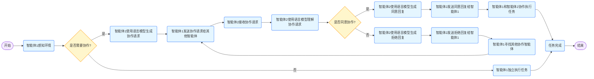

# 语言模型在多agent协作任务中的应用

> 关键词：语言模型、多agent协作、智能体交互、自然语言处理、分布式系统、协作策略、任务执行

> 摘要：本文深入探讨了语言模型在多agent协作任务中的应用。随着人工智能技术的不断发展，多agent系统在各个领域的应用日益广泛，而语言模型的引入为多agent之间的协作提供了新的思路和方法。文章首先介绍了相关的背景知识，包括目的、预期读者、文档结构和术语表等。接着阐述了语言模型和多agent协作的核心概念及联系，详细讲解了核心算法原理和具体操作步骤，并给出了相应的数学模型和公式。通过项目实战展示了代码实现和详细解释，分析了实际应用场景。同时推荐了相关的学习资源、开发工具框架和论文著作。最后总结了未来发展趋势与挑战，并提供了常见问题与解答以及扩展阅读和参考资料，旨在为相关领域的研究者和开发者提供全面而深入的技术指导。

## 1. 背景介绍 
### 1.1 目的和范围
随着人工智能技术的快速发展，多agent系统在许多领域得到了广泛应用，如智能交通、工业自动化、智能电网等。在多agent系统中，agent之间的协作是实现系统目标的关键。语言模型作为自然语言处理领域的重要技术，能够对自然语言进行理解和生成，为多agent之间的通信和协作提供了有力的支持。本文的目的在于深入探讨语言模型在多agent协作任务中的应用，包括其原理、算法、数学模型、实际案例等方面，范围涵盖了从理论基础到实际应用的各个环节，旨在为相关领域的研究者和开发者提供全面而深入的技术参考。

### 1.2 预期读者
本文预期读者包括但不限于人工智能、计算机科学、自动化控制等领域的研究者、学生和开发者。对于对多agent系统和语言模型感兴趣的技术爱好者，本文也能提供有价值的信息和技术指导。

### 1.3 文档结构概述
本文将按照以下结构进行组织：首先介绍相关的背景知识，包括目的、预期读者、文档结构和术语表等。接着阐述语言模型和多agent协作的核心概念及联系，通过文本示意图和Mermaid流程图进行详细说明。然后详细讲解核心算法原理和具体操作步骤，并给出相应的Python源代码。之后介绍数学模型和公式，并进行详细讲解和举例说明。通过项目实战展示代码实现和详细解释，分析实际应用场景。同时推荐相关的学习资源、开发工具框架和论文著作。最后总结未来发展趋势与挑战，并提供常见问题与解答以及扩展阅读和参考资料。

### 1.4 术语表
#### 1.4.1 核心术语定义
- **语言模型（Language Model）**：是一种对自然语言进行建模的统计模型，用于计算一个句子或一段文本的概率，能够理解和生成自然语言。
- **多agent系统（Multi - agent System，MAS）**：由多个自主的智能体（agent）组成的系统，这些智能体通过相互协作来实现系统的目标。
- **智能体（Agent）**：是一个能够感知环境、自主决策并采取行动的实体，具有一定的智能和自主性。
- **协作任务（Collaborative Task）**：多个智能体共同参与，通过协作来完成的任务。

#### 1.4.2 相关概念解释
- **自然语言处理（Natural Language Processing，NLP）**：是人工智能的一个重要分支，研究如何让计算机理解和处理人类语言，语言模型是自然语言处理中的关键技术之一。
- **分布式系统（Distributed System）**：是由多个独立的计算机节点组成的系统，这些节点通过网络进行通信和协作，多agent系统通常可以看作是一种分布式系统。

#### 1.4.3 缩略词列表
- **MAS**：Multi - agent System，多agent系统
- **NLP**：Natural Language Processing，自然语言处理

## 2. 核心概念与联系 

### 语言模型原理
语言模型的核心目标是计算一个句子或一段文本的概率。常见的语言模型包括基于统计的语言模型和基于神经网络的语言模型。基于统计的语言模型如n - gram模型，它通过统计语料库中n个连续词出现的频率来估计句子的概率。基于神经网络的语言模型如循环神经网络（RNN）、长短期记忆网络（LSTM）和Transformer等，它们能够学习到更复杂的语言模式和语义信息。

### 多agent协作原理
多agent系统中的智能体通过感知环境、与其他智能体通信和协作来实现系统的目标。智能体之间的协作可以基于不同的策略，如合作策略、竞争策略等。在协作过程中，智能体需要根据自身的状态和其他智能体的信息来做出决策。

### 核心概念联系
语言模型为多agent之间的通信提供了自然语言接口，使得智能体能够以自然语言的方式进行交互。智能体可以使用语言模型来理解其他智能体发送的自然语言消息，并生成相应的自然语言回复。通过语言模型，多agent系统可以更加灵活和高效地进行协作，能够处理复杂的任务和信息交流。

### 文本示意图
```plaintext
多agent系统
|-- 智能体1
|   |-- 感知模块
|   |-- 决策模块
|   |-- 通信模块（使用语言模型进行自然语言交互）
|   |-- 执行模块
|-- 智能体2
|   |-- 感知模块
|   |-- 决策模块
|   |-- 通信模块（使用语言模型进行自然语言交互）
|   |-- 执行模块
|-- ...
|-- 智能体n
|   |-- 感知模块
|   |-- 决策模块
|   |-- 通信模块（使用语言模型进行自然语言交互）
|   |-- 执行模块
```

### Mermaid流程图


## 3. 核心算法原理 & 具体操作步骤 

### 语言模型选择
在多agent协作任务中，可以选择不同的语言模型，如BERT、GPT等。这里以简单的n - gram语言模型为例进行讲解。

### n - gram语言模型原理
n - gram语言模型基于马尔可夫假设，即一个词的出现只与它前面的n - 1个词有关。对于一个句子 $w_1, w_2, \cdots, w_m$，其概率可以表示为：

$P(w_1, w_2, \cdots, w_m) \approx \prod_{i = 1}^{m} P(w_i | w_{i - n + 1}, \cdots, w_{i - 1})$

### Python实现n - gram语言模型
```python
import re
from collections import defaultdict

class NGramLanguageModel:
    def __init__(self, n):
        self.n = n
        self.ngram_counts = defaultdict(int)
        self.context_counts = defaultdict(int)

    def train(self, text):
        tokens = re.findall(r'\w+', text.lower())
        for i in range(len(tokens) - self.n + 1):
            ngram = tuple(tokens[i:i + self.n])
            context = ngram[:-1]
            self.ngram_counts[ngram] += 1
            self.context_counts[context] += 1

    def predict(self, context):
        context = tuple(context)
        candidates = []
        for ngram, count in self.ngram_counts.items():
            if ngram[:-1] == context:
                probability = count / self.context_counts[context]
                candidates.append((ngram[-1], probability))
        candidates.sort(key=lambda x: x[1], reverse=True)
        return candidates
```

### 多agent协作算法步骤
1. **初始化**：初始化所有智能体的状态和语言模型。
2. **感知环境**：每个智能体感知当前环境信息。
3. **决策**：根据感知到的信息和自身目标，智能体决定是否需要协作。
4. **通信**：如果需要协作，智能体使用语言模型生成协作请求并发送给其他智能体。
5. **响应**：其他智能体接收协作请求，使用语言模型理解请求，并根据自身情况决定是否同意协作，然后使用语言模型生成响应消息并发送。
6. **协作执行**：如果有智能体同意协作，它们共同执行协作任务。
7. **循环**：重复步骤2 - 6，直到任务完成。

### Python实现多agent协作框架
```python
class Agent:
    def __init__(self, id, language_model):
        self.id = id
        self.language_model = language_model
        self.state = "idle"
        self.memory = []

    def perceive(self, environment):
        # 模拟感知环境
        self.memory.append(environment)

    def decide(self):
        # 简单决策逻辑，这里假设如果环境中有特定关键字就需要协作
        for info in self.memory:
            if "collaboration" in info.lower():
                return True
        return False

    def communicate(self, other_agents):
        if self.decide():
            request = "Need collaboration"
            for agent in other_agents:
                if agent.id != self.id:
                    agent.receive_message(request)

    def receive_message(self, message):
        # 使用语言模型理解消息
        # 这里简单模拟，实际需要调用语言模型进行理解
        print(f"Agent {self.id} received message: {message}")
        response = "Agree to collaborate"
        # 发送响应消息
        # 这里简单模拟，实际需要实现消息发送逻辑
        print(f"Agent {self.id} sent response: {response}")

    def collaborate(self, other_agents):
        print(f"Agent {self.id} is collaborating with other agents.")
```

### 主程序调用
```python
# 初始化语言模型
lm = NGramLanguageModel(n=2)
text = "This is a sample text for training the language model."
lm.train(text)

# 初始化智能体
agent1 = Agent(1, lm)
agent2 = Agent(2, lm)
agents = [agent1, agent2]

# 模拟环境信息
environment_info = "This is a collaboration task."

# 智能体感知环境
for agent in agents:
    agent.perceive(environment_info)

# 智能体通信和协作
for agent in agents:
    agent.communicate(agents)
    agent.collaborate(agents)
```

## 4. 数学模型和公式 & 详细讲解 & 举例说明 

### n - gram语言模型数学模型
在n - gram语言模型中，核心的数学公式是计算条件概率 $P(w_i | w_{i - n + 1}, \cdots, w_{i - 1})$。根据最大似然估计，该条件概率可以表示为：

$P(w_i | w_{i - n + 1}, \cdots, w_{i - 1}) = \frac{C(w_{i - n + 1}, \cdots, w_{i - 1}, w_i)}{C(w_{i - n + 1}, \cdots, w_{i - 1})}$

其中 $C(w_{i - n + 1}, \cdots, w_{i - 1}, w_i)$ 表示n - gram $(w_{i - n + 1}, \cdots, w_{i - 1}, w_i)$ 在语料库中出现的次数，$C(w_{i - n + 1}, \cdots, w_{i - 1})$ 表示 $(n - 1)$ - gram $(w_{i - n + 1}, \cdots, w_{i - 1})$ 在语料库中出现的次数。

### 详细讲解
这个公式的原理是基于统计的思想，通过计算语料库中不同n - gram和 $(n - 1)$ - gram的出现频率来估计条件概率。例如，在一个语料库中，“the cat” 出现了100次，“the cat runs” 出现了20次，那么 $P(runs | the, cat) = \frac{20}{100} = 0.2$。

### 举例说明
假设我们有一个简单的语料库：“I like apples. I like bananas.”，我们要计算2 - gram模型下的概率。

首先统计2 - gram和1 - gram的出现次数：
- 1 - gram：
    - $C(I) = 2$
    - $C(like) = 2$
    - $C(apples) = 1$
    - $C(bananas) = 1$
- 2 - gram：
    - $C(I, like) = 2$
    - $C(like, apples) = 1$
    - $C(like, bananas) = 1$

那么 $P(like | I) = \frac{C(I, like)}{C(I)} = \frac{2}{2} = 1$，$P(apples | like) = \frac{C(like, apples)}{C(like)} = \frac{1}{2} = 0.5$，$P(bananas | like) = \frac{C(like, bananas)}{C(like)} = \frac{1}{2} = 0.5$。

### 多agent协作中的数学模型
在多agent协作中，我们可以使用博弈论的方法来描述智能体之间的协作关系。假设我们有两个智能体 $A$ 和 $B$，它们可以选择合作或不合作。我们可以定义一个收益矩阵来表示它们在不同策略下的收益。

|        | 智能体 $B$ 合作 | 智能体 $B$ 不合作 |
|--------|----------------|------------------|
| 智能体 $A$ 合作 | $(R_A, R_B)$    | $(S_A, T_B)$      |
| 智能体 $A$ 不合作 | $(T_A, S_B)$    | $(P_A, P_B)$      |

其中 $R$ 表示双方合作的收益，$T$ 表示一方背叛另一方合作的收益，$S$ 表示一方合作另一方背叛的收益，$P$ 表示双方都不合作的收益。通常满足 $T > R > P > S$ 且 $2R > T + S$。

### 举例说明
假设 $R_A = 3$，$R_B = 3$，$T_A = 5$，$T_B = 0$，$S_A = 0$，$S_B = 5$，$P_A = 1$，$P_B = 1$。如果智能体 $A$ 和 $B$ 都选择合作，它们的收益都是3；如果智能体 $A$ 合作，智能体 $B$ 不合作，那么智能体 $A$ 的收益是0，智能体 $B$ 的收益是5；以此类推。智能体需要根据这个收益矩阵来选择最优的策略，以实现自身利益的最大化。

## 5. 项目实战：代码实际案例和详细解释说明 

### 5.1  开发环境搭建
#### 编程语言
本项目使用Python进行开发，Python是一种功能强大且易于学习的编程语言，拥有丰富的库和工具。

#### 开发环境
推荐使用Anaconda来管理Python环境，它可以方便地安装和管理各种Python库。可以从Anaconda官方网站（https://www.anaconda.com/）下载并安装适合自己操作系统的版本。

#### 安装依赖库
本项目需要使用一些常见的Python库，如 `numpy`、`re` 等。可以使用以下命令来安装：
```sh
pip install numpy
```

### 5.2  源代码详细实现和代码解读
#### 语言模型部分
```python
import re
from collections import defaultdict

class NGramLanguageModel:
    def __init__(self, n):
        # 初始化n - gram的阶数
        self.n = n
        # 用于存储n - gram的计数
        self.ngram_counts = defaultdict(int)
        # 用于存储(n - 1) - gram的计数
        self.context_counts = defaultdict(int)

    def train(self, text):
        # 将文本转换为小写并分词
        tokens = re.findall(r'\w+', text.lower())
        for i in range(len(tokens) - self.n + 1):
            # 提取n - gram
            ngram = tuple(tokens[i:i + self.n])
            # 提取(n - 1) - gram作为上下文
            context = ngram[:-1]
            # 增加n - gram的计数
            self.ngram_counts[ngram] += 1
            # 增加(n - 1) - gram的计数
            self.context_counts[context] += 1

    def predict(self, context):
        # 将上下文转换为元组
        context = tuple(context)
        candidates = []
        for ngram, count in self.ngram_counts.items():
            if ngram[:-1] == context:
                # 计算条件概率
                probability = count / self.context_counts[context]
                candidates.append((ngram[-1], probability))
        # 按概率从大到小排序
        candidates.sort(key=lambda x: x[1], reverse=True)
        return candidates
```
**代码解读**：
- `__init__` 方法：初始化n - gram的阶数和用于存储计数的字典。
- `train` 方法：对输入的文本进行分词，提取n - gram和 $(n - 1)$ - gram，并统计它们的出现次数。
- `predict` 方法：根据给定的上下文，找出所有可能的下一个词，并计算它们的条件概率，最后按概率从大到小排序。

#### 智能体部分
```python
class Agent:
    def __init__(self, id, language_model):
        # 智能体的唯一标识
        self.id = id
        # 智能体使用的语言模型
        self.language_model = language_model
        # 智能体的状态，初始为空闲
        self.state = "idle"
        # 智能体的记忆，用于存储感知到的信息
        self.memory = []

    def perceive(self, environment):
        # 模拟智能体感知环境，将环境信息添加到记忆中
        self.memory.append(environment)

    def decide(self):
        # 简单决策逻辑，检查记忆中是否包含特定关键字
        for info in self.memory:
            if "collaboration" in info.lower():
                return True
        return False

    def communicate(self, other_agents):
        if self.decide():
            # 生成协作请求
            request = "Need collaboration"
            for agent in other_agents:
                if agent.id != self.id:
                    # 向其他智能体发送协作请求
                    agent.receive_message(request)

    def receive_message(self, message):
        # 简单模拟使用语言模型理解消息
        print(f"Agent {self.id} received message: {message}")
        # 生成响应消息
        response = "Agree to collaborate"
        # 简单模拟发送响应消息
        print(f"Agent {self.id} sent response: {response}")

    def collaborate(self, other_agents):
        print(f"Agent {self.id} is collaborating with other agents.")
```
**代码解读**：
- `__init__` 方法：初始化智能体的标识、语言模型、状态和记忆。
- `perceive` 方法：模拟智能体感知环境，将环境信息添加到记忆中。
- `decide` 方法：根据记忆中的信息判断是否需要协作。
- `communicate` 方法：如果需要协作，生成协作请求并发送给其他智能体。
- `receive_message` 方法：接收其他智能体的消息，简单模拟使用语言模型理解消息，并生成响应消息。
- `collaborate` 方法：表示智能体正在与其他智能体协作。

#### 主程序部分
```python
# 初始化语言模型
lm = NGramLanguageModel(n=2)
text = "This is a sample text for training the language model."
lm.train(text)

# 初始化智能体
agent1 = Agent(1, lm)
agent2 = Agent(2, lm)
agents = [agent1, agent2]

# 模拟环境信息
environment_info = "This is a collaboration task."

# 智能体感知环境
for agent in agents:
    agent.perceive(environment_info)

# 智能体通信和协作
for agent in agents:
    agent.communicate(agents)
    agent.collaborate(agents)
```
**代码解读**：
- 首先初始化n - gram语言模型，并使用一段文本进行训练。
- 然后初始化两个智能体，并将语言模型分配给它们。
- 模拟环境信息，让智能体感知环境。
- 最后让智能体进行通信和协作。

### 5.3  代码解读与分析
#### 优点
- **简单易懂**：代码结构清晰，使用简单的n - gram语言模型和基本的智能体协作逻辑，易于理解和实现。
- **可扩展性**：可以很容易地扩展到更复杂的语言模型和协作策略，例如使用更高级的神经网络语言模型和基于博弈论的协作策略。

#### 缺点
- **语言模型的局限性**：n - gram语言模型只能考虑局部的语言信息，对于长距离的依赖关系处理能力较弱。
- **协作逻辑的简单性**：当前的协作逻辑比较简单，没有考虑到智能体之间的复杂交互和利益冲突。

## 6. 实际应用场景 

### 智能交通系统
在智能交通系统中，多个智能车辆可以看作是多个智能体。通过语言模型，智能车辆之间可以进行自然语言通信，例如一辆车可以向其他车辆发送“前方道路拥堵，请选择其他路线”的消息，其他车辆可以使用语言模型理解该消息并做出相应的决策，从而实现车辆之间的协作，提高交通效率。

### 工业自动化
在工业自动化生产线上，不同的机器人可以看作是智能体。它们可以通过语言模型进行通信和协作，例如一个机器人可以向另一个机器人发送“请协助我搬运这个零件”的消息，另一个机器人理解消息后进行相应的操作，实现生产线的高效运行。

### 智能家居系统
在智能家居系统中，各种智能设备如智能音箱、智能灯具、智能门锁等可以看作是智能体。通过语言模型，这些设备可以进行自然语言交互，例如用户可以对智能音箱说“打开客厅的灯”，智能音箱使用语言模型理解用户的指令后，向智能灯具发送相应的控制消息，实现智能家居设备之间的协作。

### 智能客服系统
在智能客服系统中，多个客服机器人可以看作是智能体。当一个客服机器人遇到无法解决的问题时，可以使用语言模型生成求助消息并发送给其他客服机器人，其他客服机器人使用语言模型理解消息后提供帮助，实现客服机器人之间的协作，提高客服服务的质量和效率。

## 7. 工具和资源推荐
### 7.1 学习资源推荐
#### 7.1.1 书籍推荐
- 《自然语言处理入门》：作者何晗，本书系统地介绍了自然语言处理的基本概念、算法和技术，适合初学者入门。
- 《人工智能：一种现代的方法》：作者Stuart J. Russell和Peter Norvig，这本书是人工智能领域的经典教材，涵盖了多agent系统等多个方面的内容。
- 《深度学习》：作者Ian Goodfellow、Yoshua Bengio和Aaron Courville，这本书详细介绍了深度学习的理论和实践，对于理解基于神经网络的语言模型有很大帮助。

#### 7.1.2 在线课程
- Coursera上的“Natural Language Processing Specialization”：由顶尖大学的教授授课，系统地介绍了自然语言处理的各个方面，包括语言模型、机器翻译等。
- edX上的“Artificial Intelligence”：提供了人工智能的基础知识和高级技术，包括多agent系统的相关内容。
- 中国大学MOOC上的“自然语言处理”：由国内高校的专家授课，结合了国内的研究成果和实际应用案例。

#### 7.1.3 技术博客和网站
- Medium：上面有很多关于人工智能、自然语言处理和多agent系统的技术文章，作者来自世界各地的专业人士。
- arXiv：提供了最新的学术研究论文，对于了解该领域的前沿动态非常有帮助。
- 机器之心：专注于人工智能领域的资讯和技术分享，有很多关于语言模型和多agent系统的深度报道和分析。

### 7.2 开发工具框架推荐
#### 7.2.1 IDE和编辑器
- PyCharm：是一款专门为Python开发设计的集成开发环境，具有强大的代码编辑、调试和自动补全功能。
- Visual Studio Code：是一款轻量级的代码编辑器，支持多种编程语言，通过安装Python扩展可以方便地进行Python开发。

#### 7.2.2 调试和性能分析工具
- pdb：是Python自带的调试器，可以帮助开发者在代码中设置断点、单步执行等，方便调试代码。
- cProfile：是Python的性能分析工具，可以分析代码的运行时间和函数调用次数，帮助开发者优化代码性能。

#### 7.2.3 相关框架和库
- PyTorch：是一个开源的深度学习框架，提供了丰富的神经网络模块和工具，方便开发者实现基于神经网络的语言模型。
- TensorFlow：是另一个广泛使用的深度学习框架，具有强大的分布式训练和部署能力，适用于大规模的语言模型开发。
- NLTK：是Python的自然语言处理工具包，提供了各种自然语言处理的算法和数据集，方便开发者进行语言处理任务。

### 7.3 相关论文著作推荐
#### 7.3.1 经典论文
- “Attention Is All You Need”：提出了Transformer架构，为现代语言模型的发展奠定了基础。
- “A Survey of Multi - Agent System”：对多agent系统的发展历程、理论基础和应用进行了全面的综述。

#### 7.3.2 最新研究成果
- 关注arXiv上关于语言模型和多agent系统的最新研究论文，了解该领域的前沿技术和发展趋势。

#### 7.3.3 应用案例分析
- 一些学术会议如AAAI、IJCAI等的论文集中有很多关于语言模型在多agent协作任务中的应用案例，可以从中学习到实际应用中的经验和方法。

## 8. 总结：未来发展趋势与挑战
### 未来发展趋势
- **更强大的语言模型**：随着深度学习技术的不断发展，语言模型将变得更加智能和强大，能够处理更复杂的自然语言任务，为多agent协作提供更准确和高效的通信支持。
- **多模态融合**：将语言模型与视觉、听觉等其他模态的信息融合，使多agent系统能够处理更丰富的信息，实现更复杂的协作任务。
- **自适应协作策略**：智能体能够根据不同的任务和环境自适应地调整协作策略，提高协作的效率和灵活性。
- **跨领域应用**：语言模型在多agent协作任务中的应用将扩展到更多的领域，如医疗、金融、教育等，为这些领域带来新的发展机遇。

### 挑战
- **语言理解的准确性**：尽管语言模型取得了很大的进展，但在处理复杂的自然语言和语义理解方面仍然存在挑战，需要进一步提高语言理解的准确性。
- **智能体的自主性和协作性平衡**：在多agent系统中，需要平衡智能体的自主性和协作性，避免出现智能体过于自主而无法协作或过于依赖协作而失去自主性的问题。
- **通信效率和安全性**：多agent之间的通信需要高效和安全，需要解决通信延迟、带宽限制和信息安全等问题。
- **伦理和法律问题**：随着语言模型在多agent协作任务中的广泛应用，会带来一系列的伦理和法律问题，如责任认定、隐私保护等，需要制定相应的规范和法律来解决。

## 9. 附录：常见问题与解答
### 1. 如何选择合适的语言模型用于多agent协作任务？
选择合适的语言模型需要考虑多个因素，如任务的复杂度、数据的规模、计算资源等。如果任务比较简单，数据规模较小，可以选择n - gram等基于统计的语言模型；如果任务复杂，数据规模大，可以选择基于神经网络的语言模型，如BERT、GPT等。

### 2. 多agent协作中如何处理智能体之间的冲突？
可以使用博弈论、协商机制等方法来处理智能体之间的冲突。例如，通过定义收益矩阵，让智能体根据自身利益和其他智能体的策略来选择最优的行动；或者通过协商机制，让智能体之间进行沟通和协调，达成共识。

### 3. 语言模型在多agent协作中的通信效率如何提高？
可以采用以下方法提高通信效率：对语言模型进行优化，减少计算时间；采用分布式计算和并行处理技术，提高计算速度；对通信消息进行压缩和编码，减少通信带宽的占用。

### 4. 如何评估语言模型在多agent协作任务中的性能？
可以从多个方面评估语言模型的性能，如语言理解的准确性、生成文本的质量、通信效率等。可以使用一些指标如准确率、召回率、F1值等来评估语言理解的准确性，使用人工评估或自动评估指标如困惑度等来评估生成文本的质量。

## 10. 扩展阅读 & 参考资料
### 扩展阅读
- 《多智能体系统：原理与应用》：深入介绍了多智能体系统的原理、算法和应用案例，对于进一步理解多agent协作有很大帮助。
- 《自然语言处理实战》：通过实际案例详细介绍了自然语言处理的各种技术和应用，包括语言模型的使用。

### 参考资料
- 相关学术论文：在IEEE Xplore、ACM Digital Library等学术数据库中搜索关于语言模型和多agent协作的论文，获取最新的研究成果和技术信息。
- 开源项目：在GitHub等开源平台上搜索相关的开源项目，学习其他开发者的代码实现和经验。