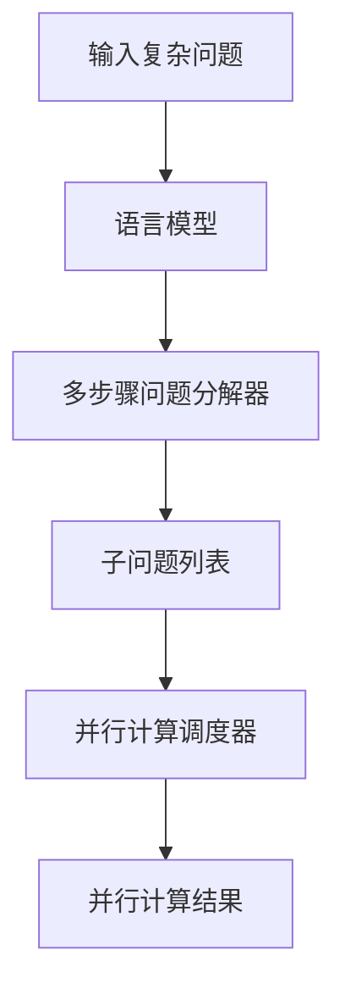

# 语言模型在多步骤问题分解与并行计算中的能力评估

> 关键词：语言模型、多步骤问题分解、并行计算、能力评估、自然语言处理

> 摘要：本文旨在深入探讨语言模型在多步骤问题分解与并行计算方面的能力。首先介绍相关背景知识，包括研究目的、预期读者、文档结构和术语表。接着阐述核心概念及其联系，给出原理和架构的文本示意图与 Mermaid 流程图。详细讲解核心算法原理，用 Python 代码进行具体操作步骤的阐述。分析数学模型和公式，并举例说明。通过项目实战展示代码实际案例及详细解释。探讨语言模型在多步骤问题分解与并行计算中的实际应用场景。推荐相关学习资源、开发工具框架和论文著作。最后总结未来发展趋势与挑战，提供常见问题解答和扩展阅读参考资料，为全面评估语言模型在该领域的能力提供系统的方法和依据。

## 1. 背景介绍 
### 1.1 目的和范围
随着自然语言处理技术的飞速发展，语言模型在各种应用场景中发挥着越来越重要的作用。多步骤问题分解与并行计算是解决复杂问题的关键能力，评估语言模型在这方面的能力具有重要的理论和实践意义。本研究的目的在于建立一套科学的评估体系，全面、客观地衡量语言模型在多步骤问题分解与并行计算中的表现。研究范围涵盖了常见的语言模型，如 GPT 系列、BERT 及其变体等，以及多种类型的多步骤问题，包括数学推理、逻辑分析、任务规划等。

### 1.2 预期读者
本文的预期读者包括自然语言处理领域的研究人员、工程师、研究生等。对于希望深入了解语言模型性能评估，特别是在多步骤问题解决和并行计算方面的专业人士，本文提供了详细的技术分析和实践指导。同时，对于对人工智能技术感兴趣的爱好者，也可以通过本文初步了解语言模型在复杂问题处理中的能力和挑战。

### 1.3 文档结构概述
本文将按照以下结构展开：首先介绍背景知识，为后续内容奠定基础；接着阐述核心概念与联系，帮助读者理解相关原理；详细讲解核心算法原理和具体操作步骤，并结合 Python 代码进行说明；分析数学模型和公式，通过举例加深理解；进行项目实战，展示代码实际案例和详细解释；探讨实际应用场景；推荐相关工具和资源；总结未来发展趋势与挑战；提供常见问题解答和扩展阅读参考资料。

### 1.4 术语表
#### 1.4.1 核心术语定义
- **语言模型**：一种基于概率统计或深度学习的模型，用于预测文本序列中下一个词或字符的概率分布。常见的语言模型包括基于规则的模型、统计语言模型和神经网络语言模型。
- **多步骤问题分解**：将一个复杂的问题分解为多个简单的子问题，通过逐步解决子问题来达到解决整个问题的目的。这是一种重要的问题解决策略，有助于降低问题的复杂度。
- **并行计算**：同时执行多个计算任务，以提高计算效率。在多步骤问题解决中，并行计算可以应用于多个子问题的同时求解，加速问题的解决过程。
- **能力评估**：通过一系列的指标和方法，对语言模型在特定任务或能力方面的表现进行量化和评价。

#### 1.4.2 相关概念解释
- **自然语言处理（NLP）**：研究如何让计算机理解和处理人类语言的技术领域。语言模型是自然语言处理中的重要组成部分，用于实现文本生成、机器翻译、问答系统等任务。
- **深度学习**：一种基于神经网络的机器学习方法，通过多层神经元的组合和训练，自动学习数据中的特征和模式。许多现代语言模型都基于深度学习技术构建。
- **计算资源**：包括计算机的硬件资源（如 CPU、GPU、内存等）和软件资源（如操作系统、编程语言、开发框架等），用于支持语言模型的训练和推理。

#### 1.4.3 缩略词列表
- **NLP**：Natural Language Processing（自然语言处理）
- **GPT**：Generative Pretrained Transformer（生成式预训练变换器）
- **BERT**：Bidirectional Encoder Representations from Transformers（基于变换器的双向编码器表示）
- **CPU**：Central Processing Unit（中央处理器）
- **GPU**：Graphics Processing Unit（图形处理器）

## 2. 核心概念与联系 

### 核心概念原理
#### 语言模型的工作原理
语言模型的基本原理是基于给定的文本序列，预测下一个词或字符的概率分布。在训练过程中，模型通过大量的文本数据学习语言的统计规律和语义信息。以基于神经网络的语言模型为例，通常采用循环神经网络（RNN）、长短期记忆网络（LSTM）或变换器（Transformer）等架构。变换器架构由于其并行计算能力和对长距离依赖的处理能力，在现代语言模型中得到了广泛应用。

#### 多步骤问题分解原理
多步骤问题分解的核心思想是将一个复杂的问题拆分为多个简单的子问题，每个子问题具有明确的目标和输入输出。这种分解可以降低问题的复杂度，使问题更容易解决。例如，在数学推理问题中，可以将一个复杂的证明过程分解为多个小的推理步骤；在任务规划问题中，可以将一个大的任务分解为多个子任务。

#### 并行计算原理
并行计算是指同时执行多个计算任务，以提高计算效率。在计算机系统中，并行计算可以通过多种方式实现，如多线程、多进程、分布式计算等。在多步骤问题解决中，并行计算可以应用于多个子问题的同时求解，减少整体的计算时间。

### 架构的文本示意图
```plaintext
+-------------------+
| 语言模型          |
|                   |
| 输入：文本序列     |
| 输出：词概率分布   |
+-------------------+
         |
         v
+-------------------+
| 多步骤问题分解器  |
|                   |
| 输入：复杂问题     |
| 输出：子问题列表   |
+-------------------+
         |
         v
+-------------------+
| 并行计算调度器    |
|                   |
| 输入：子问题列表   |
| 输出：并行计算结果 |
+-------------------+
```

### Mermaid 流程图


## 3. 核心算法原理 & 具体操作步骤 

### 核心算法原理
#### 多步骤问题分解算法
多步骤问题分解算法的目标是将一个复杂的问题分解为多个简单的子问题。一种常见的方法是基于规则的分解，通过预定义的规则和模式，将问题按照特定的逻辑进行拆分。另一种方法是基于机器学习的分解，通过训练一个分解模型，让模型自动学习问题的分解方式。

#### 并行计算调度算法
并行计算调度算法的目的是合理分配计算资源，使多个子问题能够并行执行，提高计算效率。常见的调度算法包括静态调度和动态调度。静态调度在计算开始前就确定了任务的分配方式，而动态调度则根据计算过程中的实时情况进行任务分配。

### 具体操作步骤
#### 多步骤问题分解步骤
1. **问题理解**：使用语言模型对输入的复杂问题进行理解和分析，提取关键信息。
2. **规则匹配或模型预测**：根据预定义的规则或训练好的分解模型，将问题分解为多个子问题。
3. **子问题验证**：对分解得到的子问题进行验证，确保每个子问题具有明确的目标和输入输出。

#### 并行计算调度步骤
1. **子问题分析**：对分解得到的子问题进行分析，确定每个子问题的计算复杂度和依赖关系。
2. **资源评估**：评估可用的计算资源，包括 CPU、GPU 等。
3. **任务分配**：根据子问题的分析结果和资源评估情况，将子问题分配到不同的计算单元进行并行计算。
4. **结果合并**：将并行计算得到的子问题结果进行合并，得到最终的问题解决方案。

### Python 代码示例
```python
import multiprocessing

# 模拟一个简单的多步骤问题分解函数
def problem_decomposition(complex_problem):
    # 这里简单地将问题拆分为两个子问题
    sub_problem1 = complex_problem[:len(complex_problem)//2]
    sub_problem2 = complex_problem[len(complex_problem)//2:]
    return [sub_problem1, sub_problem2]

# 模拟一个简单的子问题计算函数
def solve_sub_problem(sub_problem):
    # 这里简单地返回子问题的长度
    return len(sub_problem)

# 并行计算函数
def parallel_computation(sub_problems):
    pool = multiprocessing.Pool(processes=len(sub_problems))
    results = pool.map(solve_sub_problem, sub_problems)
    pool.close()
    pool.join()
    return results

# 主函数
def main():
    complex_problem = "This is a complex problem that needs to be decomposed and solved."
    sub_problems = problem_decomposition(complex_problem)
    results = parallel_computation(sub_problems)
    final_result = sum(results)
    print(f"Final result: {final_result}")

if __name__ == "__main__":
    main()
```

## 4. 数学模型和公式 & 详细讲解 & 举例说明 

### 语言模型的数学模型
语言模型的核心是计算给定文本序列 $x_1, x_2, \cdots, x_n$ 的概率 $P(x_1, x_2, \cdots, x_n)$。根据链式法则，该概率可以表示为：
$$P(x_1, x_2, \cdots, x_n) = \prod_{i=1}^{n} P(x_i | x_1, x_2, \cdots, x_{i-1})$$
在实际应用中，为了简化计算，通常采用 n-gram 模型或神经网络模型来近似计算条件概率 $P(x_i | x_1, x_2, \cdots, x_{i-1})$。

### 多步骤问题分解的数学模型
假设一个复杂问题 $Q$ 可以分解为 $m$ 个子问题 $Q_1, Q_2, \cdots, Q_m$，则问题分解可以表示为一个映射函数 $f: Q \to \{Q_1, Q_2, \cdots, Q_m\}$。在基于机器学习的分解方法中，该映射函数可以通过训练一个神经网络模型来学习。

### 并行计算的数学模型
并行计算的目标是最小化整体的计算时间 $T$。假设共有 $m$ 个子问题，每个子问题的计算时间为 $t_1, t_2, \cdots, t_m$，并行计算的加速比为 $S$，则有：
$$T = \frac{\sum_{i=1}^{m} t_i}{S}$$
加速比 $S$ 与计算资源的利用率、任务的并行度等因素有关。

### 举例说明
#### 语言模型举例
假设我们有一个简单的语言模型，用于预测句子中下一个词的概率。给定句子 “I want to”，模型预测下一个词为 “eat” 的概率为 $P(\text{eat} | \text{I want to}) = 0.3$，预测为 “drink” 的概率为 $P(\text{drink} | \text{I want to}) = 0.2$。

#### 多步骤问题分解举例
考虑一个数学推理问题：“证明 $a^2 - b^2 = (a + b)(a - b)$”。我们可以将其分解为以下子问题：
1. 展开 $(a + b)(a - b)$，得到 $a^2 - ab + ab - b^2$。
2. 化简 $a^2 - ab + ab - b^2$，得到 $a^2 - b^2$。

#### 并行计算举例
假设有两个子问题 $Q_1$ 和 $Q_2$，计算时间分别为 $t_1 = 5$ 秒和 $t_2 = 3$ 秒。如果采用串行计算，总计算时间为 $T_{serial} = t_1 + t_2 = 8$ 秒。如果采用并行计算，且加速比 $S = 2$，则总计算时间为 $T_{parallel} = \frac{t_1 + t_2}{S} = 4$ 秒。

## 5. 项目实战：代码实际案例和详细解释说明 

### 5.1  开发环境搭建
#### 操作系统
建议使用 Linux 系统，如 Ubuntu 或 CentOS，因为 Linux 系统对开发和并行计算有较好的支持。

#### 编程语言和库
- **Python**：Python 是一种广泛使用的编程语言，具有丰富的科学计算和自然语言处理库。建议使用 Python 3.7 及以上版本。
- **TensorFlow 或 PyTorch**：用于构建和训练语言模型。可以根据个人喜好选择其中一个。
- **multiprocessing**：Python 内置的多进程库，用于实现并行计算。

#### 安装步骤
```bash
# 安装 Python
sudo apt-get update
sudo apt-get install python3 python3-pip

# 安装 TensorFlow
pip3 install tensorflow

# 或者安装 PyTorch
pip3 install torch torchvision

# 安装其他必要的库
pip3 install numpy pandas
```

### 5.2  源代码详细实现和代码解读
```python
import tensorflow as tf
import multiprocessing

# 定义一个简单的语言模型
class SimpleLanguageModel(tf.keras.Model):
    def __init__(self, vocab_size, embedding_dim, hidden_dim):
        super(SimpleLanguageModel, self).__init__()
        self.embedding = tf.keras.layers.Embedding(vocab_size, embedding_dim)
        self.lstm = tf.keras.layers.LSTM(hidden_dim)
        self.dense = tf.keras.layers.Dense(vocab_size, activation='softmax')

    def call(self, inputs):
        x = self.embedding(inputs)
        x = self.lstm(x)
        output = self.dense(x)
        return output

# 多步骤问题分解函数
def problem_decomposition(complex_problem):
    # 这里简单地将问题拆分为两个子问题
    sub_problem1 = complex_problem[:len(complex_problem)//2]
    sub_problem2 = complex_problem[len(complex_problem)//2:]
    return [sub_problem1, sub_problem2]

# 子问题计算函数
def solve_sub_problem(sub_problem):
    # 这里简单地将子问题转换为张量并输入到语言模型中
    model = SimpleLanguageModel(vocab_size=1000, embedding_dim=128, hidden_dim=256)
    input_tensor = tf.constant([sub_problem])
    output = model(input_tensor)
    return output.numpy()

# 并行计算函数
def parallel_computation(sub_problems):
    pool = multiprocessing.Pool(processes=len(sub_problems))
    results = pool.map(solve_sub_problem, sub_problems)
    pool.close()
    pool.join()
    return results

# 主函数
def main():
    complex_problem = [1, 2, 3, 4, 5, 6, 7, 8]
    sub_problems = problem_decomposition(complex_problem)
    results = parallel_computation(sub_problems)
    print("Parallel computation results:", results)

if __name__ == "__main__":
    main()
```

### 5.3  代码解读与分析
#### 语言模型部分
`SimpleLanguageModel` 类定义了一个简单的语言模型，包含嵌入层、LSTM 层和全连接层。嵌入层将输入的词索引转换为词向量，LSTM 层处理序列信息，全连接层输出词概率分布。

#### 多步骤问题分解部分
`problem_decomposition` 函数将输入的复杂问题简单地拆分为两个子问题。在实际应用中，可以根据具体问题设计更复杂的分解策略。

#### 子问题计算部分
`solve_sub_problem` 函数将子问题转换为张量并输入到语言模型中，得到输出结果。

#### 并行计算部分
`parallel_computation` 函数使用 `multiprocessing.Pool` 实现并行计算，将子问题分配到不同的进程中同时计算。

#### 主函数部分
`main` 函数调用上述函数，完成问题分解、并行计算和结果输出。

## 6. 实际应用场景 
### 数学推理和证明
在数学领域，许多复杂的定理证明和推理问题可以通过多步骤问题分解和并行计算来解决。语言模型可以帮助理解问题描述，将问题分解为多个小的推理步骤，然后并行计算每个步骤的结果，加速证明过程。

### 任务规划和调度
在项目管理和任务调度中，需要将一个大的任务分解为多个子任务，并合理安排子任务的执行顺序和资源分配。语言模型可以根据任务描述和约束条件，进行多步骤问题分解，并行计算不同子任务的执行时间和资源需求，从而生成最优的任务调度方案。

### 自然语言处理任务
在自然语言处理中，一些复杂的任务如机器翻译、问答系统等可以通过多步骤问题分解来实现。例如，在机器翻译中，可以将翻译过程分解为源语言理解、语义转换和目标语言生成等子任务，并行计算这些子任务可以提高翻译效率。

### 科学研究和数据分析
在科学研究和数据分析中，经常需要处理大量的数据和复杂的计算任务。语言模型可以帮助理解研究问题和数据需求，将问题分解为多个数据处理和分析子任务，并行计算这些子任务可以加速研究进程。

## 7. 工具和资源推荐
### 7.1 学习资源推荐
#### 7.1.1 书籍推荐
- 《深度学习》（Deep Learning）：由 Ian Goodfellow、Yoshua Bengio 和 Aaron Courville 撰写，是深度学习领域的经典教材，涵盖了神经网络、优化算法、卷积神经网络等内容。
- 《自然语言处理入门》（Natural Language Processing with Python）：由 Steven Bird、Ewan Klein 和 Edward Loper 撰写，介绍了使用 Python 进行自然语言处理的基本方法和技术。
- 《并行计算导论》（Introduction to Parallel Computing）：由 Ananth Grama、Anshul Gupta、George Karypis 和 Vipin Kumar 撰写，系统地介绍了并行计算的原理、算法和编程技术。

#### 7.1.2 在线课程
- Coursera 上的 “深度学习专项课程”（Deep Learning Specialization）：由 Andrew Ng 教授授课，包括神经网络、卷积神经网络、循环神经网络等内容。
- edX 上的 “自然语言处理基础”（Foundations of Natural Language Processing）：介绍了自然语言处理的基本概念、算法和应用。
- Udemy 上的 “并行计算实战”（Parallel Computing in Practice）：通过实际案例讲解并行计算的编程和优化技巧。

#### 7.1.3 技术博客和网站
- Medium 上的 Towards Data Science：提供了大量关于数据科学、机器学习和自然语言处理的技术文章和案例分析。
- arXiv.org：是一个预印本服务器，提供了最新的学术研究成果，包括语言模型、并行计算等领域的论文。
- Hugging Face：是一个专注于自然语言处理的开源社区，提供了丰富的语言模型和工具。

### 7.2 开发工具框架推荐
#### 7.2.1 IDE和编辑器
- PyCharm：是一款专门为 Python 开发设计的集成开发环境，提供了代码编辑、调试、版本控制等功能。
- Jupyter Notebook：是一个交互式的开发环境，适合进行数据分析和模型实验，支持 Python、R 等多种编程语言。
- Visual Studio Code：是一款轻量级的代码编辑器，具有丰富的插件生态系统，支持多种编程语言和开发框架。

#### 7.2.2 调试和性能分析工具
- TensorBoard：是 TensorFlow 提供的可视化工具，用于监控模型训练过程、查看模型结构和分析性能指标。
- Py-Spy：是一个轻量级的 Python 性能分析工具，可以实时监控 Python 程序的 CPU 使用率和函数调用情况。
- NVIDIA Nsight Systems：是 NVIDIA 提供的性能分析工具，用于分析 GPU 计算性能和优化代码。

#### 7.2.3 相关框架和库
- TensorFlow：是一个开源的深度学习框架，提供了丰富的工具和接口，用于构建和训练各种深度学习模型。
- PyTorch：是另一个流行的深度学习框架，具有动态图机制和简洁的 API，适合快速开发和实验。
- Ray：是一个用于分布式计算的开源框架，提供了并行计算、分布式训练等功能，支持多种编程语言。

### 7.3 相关论文著作推荐
#### 7.3.1 经典论文
- “Attention Is All You Need”：提出了变换器（Transformer）架构，是现代语言模型的基础。
- “BERT: Pre-training of Deep Bidirectional Transformers for Language Understanding”：介绍了 BERT 模型，开创了预训练语言模型的先河。
- “MapReduce: Simplified Data Processing on Large Clusters”：提出了 MapReduce 编程模型，为大规模数据处理提供了一种简单有效的方法。

#### 7.3.2 最新研究成果
- 关注 arXiv.org 上关于语言模型、多步骤问题分解和并行计算的最新论文，了解该领域的前沿研究动态。
- 参加相关的学术会议，如 ACL（Association for Computational Linguistics）、NeurIPS（Neural Information Processing Systems）等，获取最新的研究成果和技术趋势。

#### 7.3.3 应用案例分析
- 阅读相关的技术博客和论文，了解语言模型在多步骤问题分解与并行计算中的实际应用案例，学习他人的经验和技巧。
- 参与开源项目，查看项目代码和文档，了解如何将理论知识应用到实际项目中。

## 8. 总结：未来发展趋势与挑战
### 未来发展趋势
#### 更强的语言理解和问题分解能力
未来的语言模型将具备更强的语言理解能力，能够更准确地理解复杂问题的含义，并进行更合理的多步骤问题分解。这将有助于解决更复杂的实际问题，如科学研究、工程设计等领域的问题。

#### 更高效的并行计算技术
随着硬件技术的不断发展，并行计算能力将不断提升。未来的语言模型将能够更好地利用多核 CPU、GPU 集群等并行计算资源，实现更高效的计算和推理。

#### 与其他技术的融合
语言模型将与计算机视觉、知识图谱、强化学习等其他技术进行更深入的融合，形成更强大的智能系统。例如，结合计算机视觉技术，语言模型可以处理图像和文本的混合输入，解决更复杂的多模态问题。

### 挑战
#### 计算资源瓶颈
语言模型的训练和推理需要大量的计算资源，特别是对于大规模的语言模型。随着模型规模的不断增大，计算资源的需求也将急剧增加，如何解决计算资源瓶颈是一个亟待解决的问题。

#### 数据质量和多样性
语言模型的性能很大程度上依赖于训练数据的质量和多样性。获取高质量、多样化的训练数据是一个挑战，特别是对于一些特定领域的问题。

#### 可解释性和可靠性
语言模型通常是基于深度学习的黑盒模型，其决策过程难以解释。在一些对可靠性要求较高的应用场景中，如医疗诊断、金融风险评估等，如何提高语言模型的可解释性和可靠性是一个重要的挑战。

## 9. 附录：常见问题与解答
### 语言模型在多步骤问题分解中的准确性如何提高？
可以通过以下方法提高语言模型在多步骤问题分解中的准确性：
- 使用更多、更高质量的训练数据，特别是包含多步骤问题分解示例的数据。
- 设计更复杂的模型架构，如结合注意力机制、图神经网络等。
- 采用强化学习等方法进行模型优化，根据问题分解的结果进行反馈和调整。

### 并行计算在语言模型应用中的加速效果受哪些因素影响？
并行计算在语言模型应用中的加速效果受以下因素影响：
- 计算资源的可用性，如 CPU 核心数、GPU 数量等。
- 子问题的独立性和并行度，子问题之间的依赖关系越少，并行度越高，加速效果越好。
- 任务调度算法的合理性，合理的任务调度可以充分利用计算资源，提高加速比。

### 如何评估语言模型在多步骤问题分解与并行计算中的能力？
可以从以下几个方面评估语言模型在多步骤问题分解与并行计算中的能力：
- 问题分解的准确性，即分解得到的子问题是否合理、完整。
- 并行计算的效率，如加速比、计算时间等。
- 最终结果的正确性，即解决问题的结果是否符合预期。

## 10. 扩展阅读 & 参考资料
### 扩展阅读
- 《人工智能：现代方法》（Artificial Intelligence: A Modern Approach）：全面介绍了人工智能的各个领域，包括自然语言处理、机器学习、搜索算法等。
- 《高性能计算》（High Performance Computing）：深入探讨了高性能计算的原理、技术和应用，包括并行计算、分布式计算等。
- 《自然语言处理前沿技术》（Frontiers in Natural Language Processing）：介绍了自然语言处理领域的最新研究成果和技术趋势。

### 参考资料
- 相关学术论文和研究报告，如 arXiv.org 上的论文、学术会议的会议记录等。
- 开源项目的代码和文档，如 TensorFlow、PyTorch 等开源框架的官方文档。
- 技术博客和论坛上的相关文章和讨论，如 Stack Overflow、GitHub 等。