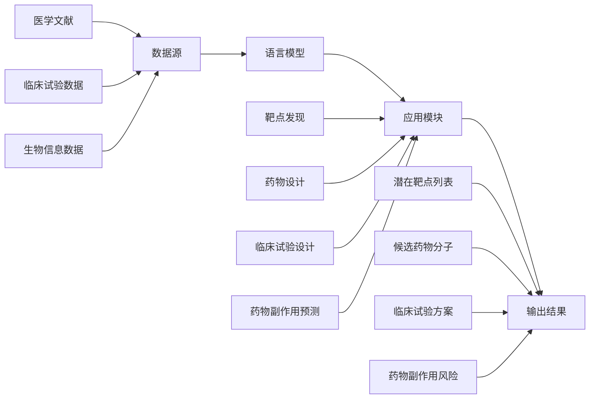

# 语言模型在新药研发全流程优化中的多维度应用

> 关键词：语言模型、新药研发、全流程优化、多维度应用、药物设计

> 摘要：本文深入探讨了语言模型在新药研发全流程优化中的多维度应用。首先介绍了新药研发的背景以及语言模型引入的目的和范围，明确预期读者。接着阐述语言模型相关核心概念及其与新药研发各环节的联系，详细讲解核心算法原理和具体操作步骤，并给出数学模型和公式。通过项目实战展示语言模型在新药研发中的实际应用，包括开发环境搭建、源代码实现与解读。分析了语言模型在新药研发中的实际应用场景，推荐了相关学习资源、开发工具框架以及论文著作。最后总结语言模型在新药研发领域的未来发展趋势与挑战，并提供常见问题解答和扩展阅读参考资料。

## 1. 背景介绍 
### 1.1 目的和范围
新药研发是一个高度复杂、耗时且成本高昂的过程，通常需要经历靶点发现、药物设计、临床前研究、临床试验等多个阶段，平均耗时长达 10 - 15 年，成本高达数十亿美元。语言模型作为人工智能领域的重要技术，具有强大的文本理解、生成和推理能力。本研究的目的在于探索语言模型在新药研发全流程中的多维度应用，以提高研发效率、降低成本、增加成功概率。研究范围涵盖新药研发的各个环节，包括但不限于靶点识别、药物分子设计、临床试验设计与分析等。

### 1.2 预期读者
本文的预期读者包括新药研发领域的科研人员、制药企业的研发工程师、人工智能领域的研究人员以及对新药研发和人工智能交叉领域感兴趣的专业人士。通过阅读本文，读者可以了解语言模型在新药研发中的应用原理、方法和实际案例，为相关研究和实践提供参考。

### 1.3 文档结构概述
本文将按照以下结构进行阐述：首先介绍语言模型和新药研发的相关核心概念及其联系；接着详细讲解语言模型在新药研发中应用的核心算法原理和具体操作步骤，并给出相应的数学模型和公式；然后通过项目实战展示语言模型在新药研发中的具体应用，包括开发环境搭建、源代码实现和代码解读；分析语言模型在新药研发中的实际应用场景；推荐相关的学习资源、开发工具框架和论文著作；最后总结语言模型在新药研发领域的未来发展趋势与挑战，并提供常见问题解答和扩展阅读参考资料。

### 1.4 术语表
#### 1.4.1 核心术语定义
- **语言模型**：是一种基于概率统计或深度学习的模型，用于预测文本序列中下一个词或字符的概率分布。在人工智能领域，常见的语言模型包括基于循环神经网络（RNN）、长短时记忆网络（LSTM）、门控循环单元（GRU）以及Transformer架构的模型，如GPT系列、BERT等。
- **新药研发**：指的是寻找和开发具有治疗潜力的新药物的过程，包括从靶点发现、药物设计、临床前研究到临床试验等一系列步骤，最终获得监管部门批准并上市销售。
- **靶点发现**：是新药研发的起始阶段，旨在确定与疾病发生、发展相关的生物分子（如蛋白质、核酸等），作为药物作用的目标。
- **药物设计**：根据靶点的结构和功能信息，运用计算机辅助药物设计（CADD）等方法，设计出能够与靶点特异性结合并产生预期治疗效果的药物分子。

#### 1.4.2 相关概念解释
- **自然语言处理（NLP）**：是人工智能的一个重要分支，主要研究如何让计算机理解、处理和生成人类语言。语言模型是NLP的核心技术之一，广泛应用于文本分类、情感分析、机器翻译等任务。
- **计算机辅助药物设计（CADD）**：利用计算机技术和算法，对药物分子的结构、性质和活性进行预测和优化，从而加速药物研发过程。CADD方法包括基于结构的药物设计（SBDD）和基于配体的药物设计（LBDD）等。
- **生物信息学**：是生物学和信息科学交叉的学科，主要研究如何利用计算机技术和算法分析生物数据，如基因组学、蛋白质组学等数据，为新药研发提供支持。

#### 1.4.3 缩略词列表
- **RNN**：Recurrent Neural Network，循环神经网络
- **LSTM**：Long Short-Term Memory，长短时记忆网络
- **GRU**：Gated Recurrent Unit，门控循环单元
- **CADD**：Computer-Aided Drug Design，计算机辅助药物设计
- **SBDD**：Structure-Based Drug Design，基于结构的药物设计
- **LBDD**：Ligand-Based Drug Design，基于配体的药物设计
- **NLP**：Natural Language Processing，自然语言处理

## 2. 核心概念与联系 
### 核心概念原理
语言模型的核心原理是通过对大量文本数据的学习，建立起文本序列之间的概率分布模型。以基于Transformer架构的语言模型为例，Transformer采用了自注意力机制（Self-Attention），能够捕捉文本中不同位置之间的依赖关系。具体来说，自注意力机制通过计算输入序列中每个位置与其他位置的相关性，为每个位置分配不同的权重，从而实现对输入序列的加权求和。

在新药研发中，靶点发现的原理是基于对疾病相关的生物分子网络的研究，通过分析基因表达数据、蛋白质相互作用网络等，找出与疾病发生、发展密切相关的生物分子作为靶点。药物设计则是根据靶点的三维结构和化学性质，利用分子对接、分子动力学模拟等方法，设计出能够与靶点特异性结合的药物分子。

### 架构的文本示意图
```plaintext
语言模型在新药研发中的应用架构

|-------------------|
|  数据源            |
|  - 医学文献        |
|  - 临床试验数据    |
|  - 生物信息数据    |
|-------------------|
           |
           v
|-------------------|
|  语言模型         |
|  - 预训练模型      |
|  - 微调模型        |
|-------------------|
           |
           v
|-------------------|
|  应用模块         |
|  - 靶点发现        |
|  - 药物设计        |
|  - 临床试验设计   |
|  - 药物副作用预测 |
|-------------------|
           |
           v
|-------------------|
|  输出结果         |
|  - 潜在靶点列表    |
|  - 候选药物分子    |
|  - 临床试验方案    |
|  - 药物副作用风险  |
|-------------------|
```

### Mermaid 流程图


## 3. 核心算法原理 & 具体操作步骤 
### 核心算法原理
在新药研发中，常用的语言模型是基于Transformer架构的预训练模型，如BERT（Bidirectional Encoder Representations from Transformers）和GPT（Generative Pretrained Transformer）。以BERT为例，其核心算法原理如下：

BERT模型由多个Transformer编码器层堆叠而成，每个编码器层包含多头自注意力机制（Multi-Head Self-Attention）和前馈神经网络（Feed-Forward Neural Network）。多头自注意力机制允许模型从不同的表示子空间中捕捉输入序列的信息，前馈神经网络则对自注意力机制的输出进行非线性变换。

在预训练阶段，BERT采用了两种无监督学习任务：掩码语言模型（Masked Language Model，MLM）和下一句预测（Next Sentence Prediction，NSP）。MLM任务通过随机掩码输入序列中的部分词，让模型预测被掩码的词；NSP任务则判断两个句子是否在原文中是连续的。通过这两个任务的训练，BERT能够学习到文本的语义和语法信息。

在新药研发的具体应用中，需要对预训练的BERT模型进行微调。微调是在特定的新药研发数据集上对预训练模型进行进一步训练，以适应具体的任务，如靶点发现、药物设计等。

### 具体操作步骤
#### 步骤1：数据收集与预处理
收集与新药研发相关的文本数据，如医学文献、临床试验报告、生物信息数据库等。对收集到的数据进行清洗、标注和分词等预处理操作，将文本数据转换为模型可以处理的格式。

```python
import pandas as pd
import nltk
from nltk.tokenize import word_tokenize
nltk.download('punkt')

# 读取数据
data = pd.read_csv('drug_discovery_data.csv')

# 数据清洗
data = data.dropna()

# 分词
data['tokens'] = data['text'].apply(lambda x: word_tokenize(x))
```

#### 步骤2：模型加载与微调
加载预训练的BERT模型，并根据具体的任务构建微调模型。在微调过程中，使用随机梯度下降（SGD）或Adam优化器对模型进行训练。

```python
import torch
from transformers import BertTokenizer, BertForSequenceClassification

# 加载预训练模型和分词器
tokenizer = BertTokenizer.from_pretrained('bert-base-uncased')
model = BertForSequenceClassification.from_pretrained('bert-base-uncased', num_labels=2)

# 准备输入数据
input_ids = []
attention_masks = []

for text in data['text']:
    encoded_dict = tokenizer.encode_plus(
                        text,                      # 输入文本
                        add_special_tokens = True, # 添加特殊标记 [CLS] 和 [SEP]
                        max_length = 128,          # 最大序列长度
                        pad_to_max_length = True,
                        return_attention_mask = True,   # 返回注意力掩码
                        return_tensors = 'pt',     # 返回 PyTorch 张量
                   )
    
    input_ids.append(encoded_dict['input_ids'])
    attention_masks.append(encoded_dict['attention_mask'])

input_ids = torch.cat(input_ids, dim=0)
attention_masks = torch.cat(attention_masks, dim=0)
labels = torch.tensor(data['label'])

# 定义训练参数
optimizer = torch.optim.Adam(model.parameters(), lr=2e-5)
epochs = 4

# 微调模型
for epoch in range(epochs):
    model.train()
    loss = model(input_ids, 
                 token_type_ids=None, 
                 attention_mask=attention_masks, 
                 labels=labels)[0]
    
    optimizer.zero_grad()
    loss.backward()
    optimizer.step()
```

#### 步骤3：模型评估与应用
使用测试数据集对微调后的模型进行评估，计算准确率、召回率、F1值等指标。评估通过后，将模型应用于实际的新药研发任务中，如靶点发现、药物设计等。

```python
from sklearn.metrics import accuracy_score, recall_score, f1_score

# 准备测试数据
test_input_ids = []
test_attention_masks = []

for text in test_data['text']:
    encoded_dict = tokenizer.encode_plus(
                        text,                     
                        add_special_tokens = True, 
                        max_length = 128,         
                        pad_to_max_length = True,
                        return_attention_mask = True,   
                        return_tensors = 'pt',     
                   )
    
    test_input_ids.append(encoded_dict['input_ids'])
    test_attention_masks.append(encoded_dict['attention_mask'])

test_input_ids = torch.cat(test_input_ids, dim=0)
test_attention_masks = torch.cat(test_attention_masks, dim=0)
test_labels = torch.tensor(test_data['label'])

# 模型评估
model.eval()
with torch.no_grad():
    outputs = model(test_input_ids, 
                    token_type_ids=None, 
                    attention_mask=test_attention_masks)
    
    logits = outputs.logits
    predictions = torch.argmax(logits, dim=1)

# 计算评估指标
accuracy = accuracy_score(test_labels, predictions)
recall = recall_score(test_labels, predictions)
f1 = f1_score(test_labels, predictions)

print(f'Accuracy: {accuracy}, Recall: {recall}, F1: {f1}')
```

## 4. 数学模型和公式 & 详细讲解 & 举例说明 
### 自注意力机制
自注意力机制是Transformer架构的核心组件，其数学公式如下：

$$Attention(Q, K, V) = softmax(\frac{QK^T}{\sqrt{d_k}})V$$

其中，$Q$ 是查询矩阵（Query），$K$ 是键矩阵（Key），$V$ 是值矩阵（Value），$d_k$ 是键向量的维度。

详细讲解：首先计算查询矩阵 $Q$ 与键矩阵 $K$ 的转置的乘积 $QK^T$，得到每个查询向量与所有键向量的相似度得分。为了防止相似度得分过大，对其除以 $\sqrt{d_k}$ 进行缩放。然后使用softmax函数将相似度得分转换为概率分布，最后将概率分布与值矩阵 $V$ 相乘，得到自注意力机制的输出。

举例说明：假设输入序列为 $x = [x_1, x_2, x_3]$，每个输入向量的维度为 $d$。首先通过线性变换将输入向量分别转换为查询向量、键向量和值向量：

$$Q = W_Qx, K = W_Kx, V = W_Vx$$

其中，$W_Q$、$W_K$ 和 $W_V$ 是可学习的权重矩阵。假设 $d_k = d$，则自注意力机制的计算过程如下：

1. 计算相似度得分：
$$S = QK^T = \begin{bmatrix} q_1^Tk_1 & q_1^Tk_2 & q_1^Tk_3 \\ q_2^Tk_1 & q_2^Tk_2 & q_2^Tk_3 \\ q_3^Tk_1 & q_3^Tk_2 & q_3^Tk_3 \end{bmatrix}$$

2. 缩放相似度得分：
$$S' = \frac{S}{\sqrt{d_k}}$$

3. 计算注意力权重：
$$A = softmax(S') = \begin{bmatrix} a_{11} & a_{12} & a_{13} \\ a_{21} & a_{22} & a_{23} \\ a_{31} & a_{32} & a_{33} \end{bmatrix}$$

4. 计算自注意力机制的输出：
$$O = AV = \begin{bmatrix} a_{11}v_1 + a_{12}v_2 + a_{13}v_3 \\ a_{21}v_1 + a_{22}v_2 + a_{23}v_3 \\ a_{31}v_1 + a_{32}v_2 + a_{33}v_3 \end{bmatrix}$$

### 掩码语言模型（MLM）
在MLM任务中，模型的目标是预测被掩码的词。假设输入序列为 $x = [x_1, x_2, \cdots, x_n]$，其中部分词被掩码，掩码位置的集合为 $M$。模型的损失函数可以表示为：

$$L_{MLM} = -\sum_{i \in M} \log P(x_i | x_{-i})$$

其中，$P(x_i | x_{-i})$ 是模型预测第 $i$ 个位置的词为 $x_i$ 的概率，$x_{-i}$ 表示除第 $i$ 个位置之外的所有词。

详细讲解：对于每个被掩码的位置 $i$，模型根据输入序列中其他位置的词预测该位置的词。损失函数是所有被掩码位置的负对数似然损失之和，通过最小化损失函数，模型可以学习到文本的语义和语法信息。

举例说明：假设输入序列为 "The dog [MASK] brown"，模型需要预测 [MASK] 位置的词。模型的输出是一个概率分布，每个词对应一个概率值。假设模型预测 "is" 的概率最高，则预测结果为 "The dog is brown"。计算损失时，将 "is" 的真实标签与模型预测的概率分布进行对比，计算负对数似然损失。

### 下一句预测（NSP）
在NSP任务中，模型的目标是判断两个句子是否在原文中是连续的。假设输入的两个句子为 $A$ 和 $B$，模型的输出是一个二分类结果，即 $A$ 和 $B$ 是连续的（正类）或不连续的（负类）。模型的损失函数可以表示为：

$$L_{NSP} = -[y \log P(y = 1) + (1 - y) \log P(y = 0)]$$

其中，$y$ 是真实标签（0 或 1），$P(y = 1)$ 是模型预测 $A$ 和 $B$ 是连续的概率，$P(y = 0)$ 是模型预测 $A$ 和 $B$ 是不连续的概率。

详细讲解：损失函数是一个二元交叉熵损失，通过最小化损失函数，模型可以学习到句子之间的语义连贯性。

举例说明：假设输入的两个句子为 "I went to the park." 和 "I saw a beautiful flower."，这两个句子在语义上是连续的，真实标签 $y = 1$。模型的输出是一个概率值，表示这两个句子是连续的概率。假设模型预测的概率为 0.8，则损失函数的值为：

$$L_{NSP} = -[1 \times \log(0.8) + (1 - 1) \times \log(1 - 0.8)] = -\log(0.8)$$

## 5. 项目实战：代码实际案例和详细解释说明 
### 5.1  开发环境搭建
#### 操作系统
推荐使用 Linux 系统，如 Ubuntu 18.04 或更高版本，也可以使用 Windows 10 或 macOS。

#### Python 环境
安装 Python 3.7 或更高版本。可以使用 Anaconda 来管理 Python 环境，创建一个新的虚拟环境：

```bash
conda create -n drug_discovery python=3.8
conda activate drug_discovery
```

#### 安装依赖库
安装必要的 Python 库，包括 `transformers`、`torch`、`pandas`、`nltk` 等：

```bash
pip install transformers torch pandas nltk scikit-learn
```

### 5.2  源代码详细实现和代码解读
以下是一个完整的语言模型在靶点发现任务中的应用案例：

```python
import pandas as pd
import nltk
from nltk.tokenize import word_tokenize
import torch
from transformers import BertTokenizer, BertForSequenceClassification
from sklearn.model_selection import train_test_split
from sklearn.metrics import accuracy_score, recall_score, f1_score

# 数据收集与预处理
nltk.download('punkt')

# 读取数据
data = pd.read_csv('drug_discovery_data.csv')

# 数据清洗
data = data.dropna()

# 分词
data['tokens'] = data['text'].apply(lambda x: word_tokenize(x))

# 划分训练集和测试集
train_data, test_data = train_test_split(data, test_size=0.2, random_state=42)

# 加载预训练模型和分词器
tokenizer = BertTokenizer.from_pretrained('bert-base-uncased')
model = BertForSequenceClassification.from_pretrained('bert-base-uncased', num_labels=2)

# 准备训练数据
train_input_ids = []
train_attention_masks = []

for text in train_data['text']:
    encoded_dict = tokenizer.encode_plus(
                        text,                     
                        add_special_tokens = True, 
                        max_length = 128,         
                        pad_to_max_length = True,
                        return_attention_mask = True,   
                        return_tensors = 'pt',     
                   )
    
    train_input_ids.append(encoded_dict['input_ids'])
    train_attention_masks.append(encoded_dict['attention_mask'])

train_input_ids = torch.cat(train_input_ids, dim=0)
train_attention_masks = torch.cat(train_attention_masks, dim=0)
train_labels = torch.tensor(train_data['label'])

# 定义训练参数
optimizer = torch.optim.Adam(model.parameters(), lr=2e-5)
epochs = 4

# 微调模型
for epoch in range(epochs):
    model.train()
    loss = model(train_input_ids, 
                 token_type_ids=None, 
                 attention_mask=train_attention_masks, 
                 labels=train_labels)[0]
    
    optimizer.zero_grad()
    loss.backward()
    optimizer.step()

# 准备测试数据
test_input_ids = []
test_attention_masks = []

for text in test_data['text']:
    encoded_dict = tokenizer.encode_plus(
                        text,                     
                        add_special_tokens = True, 
                        max_length = 128,         
                        pad_to_max_length = True,
                        return_attention_mask = True,   
                        return_tensors = 'pt',     
                   )
    
    test_input_ids.append(encoded_dict['input_ids'])
    test_attention_masks.append(encoded_dict['attention_mask'])

test_input_ids = torch.cat(test_input_ids, dim=0)
test_attention_masks = torch.cat(test_attention_masks, dim=0)
test_labels = torch.tensor(test_data['label'])

# 模型评估
model.eval()
with torch.no_grad():
    outputs = model(test_input_ids, 
                    token_type_ids=None, 
                    attention_mask=test_attention_masks)
    
    logits = outputs.logits
    predictions = torch.argmax(logits, dim=1)

# 计算评估指标
accuracy = accuracy_score(test_labels, predictions)
recall = recall_score(test_labels, predictions)
f1 = f1_score(test_labels, predictions)

print(f'Accuracy: {accuracy}, Recall: {recall}, F1: {f1}')
```

### 5.3  代码解读与分析
#### 数据收集与预处理
- 使用 `pandas` 库读取包含靶点发现相关文本数据的 CSV 文件。
- 对数据进行清洗，去除包含缺失值的行。
- 使用 `nltk` 库的 `word_tokenize` 函数对文本进行分词处理。
- 使用 `sklearn` 库的 `train_test_split` 函数将数据划分为训练集和测试集。

#### 模型加载与微调
- 使用 `transformers` 库加载预训练的 BERT 模型和分词器。
- 将训练数据转换为模型可以处理的格式，包括输入 ID 和注意力掩码。
- 定义 Adam 优化器和训练轮数。
- 在每个训练轮次中，将模型设置为训练模式，计算损失并进行反向传播和参数更新。

#### 模型评估
- 将测试数据转换为模型可以处理的格式。
- 将模型设置为评估模式，使用测试数据进行预测。
- 计算预测结果的准确率、召回率和 F1 值，评估模型的性能。

## 6. 实际应用场景 
### 靶点发现
语言模型可以通过分析大量的医学文献、生物信息数据等，挖掘与疾病相关的潜在靶点。例如，通过对基因表达数据和蛋白质相互作用网络的文本描述进行分析，语言模型可以识别出与疾病发生、发展密切相关的基因和蛋白质，为新药研发提供潜在的靶点。

### 药物设计
在药物设计阶段，语言模型可以根据靶点的结构和功能信息，生成可能具有治疗效果的药物分子。通过学习大量已知药物分子的结构和活性数据，语言模型可以预测新的药物分子的性质和活性，从而加速药物设计的过程。

### 临床试验设计与分析
语言模型可以帮助设计更合理的临床试验方案。通过分析以往的临床试验报告和医学文献，语言模型可以预测不同治疗方案的疗效和安全性，为临床试验的设计提供参考。在临床试验数据分析阶段，语言模型可以帮助分析患者的病历数据、基因数据等，挖掘潜在的生物标志物，为个性化医疗提供支持。

### 药物副作用预测
语言模型可以通过分析药物说明书、临床试验报告、患者反馈等文本数据，预测药物可能产生的副作用。通过学习药物副作用的相关知识和模式，语言模型可以提前发现潜在的药物副作用风险，为药物的安全使用提供保障。

## 7. 工具和资源推荐
### 7.1 学习资源推荐
#### 7.1.1 书籍推荐
- 《深度学习》（Deep Learning）：由 Ian Goodfellow、Yoshua Bengio 和 Aaron Courville 所著，是深度学习领域的经典教材，涵盖了神经网络、卷积神经网络、循环神经网络等内容。
- 《自然语言处理入门》：由何晗所著，系统介绍了自然语言处理的基本概念、方法和技术，包括分词、词性标注、命名实体识别等。
- 《计算机辅助药物设计》：由王存新等所著，全面介绍了计算机辅助药物设计的原理、方法和应用，包括分子对接、分子动力学模拟等。

#### 7.1.2 在线课程
- Coursera 上的“深度学习专项课程”（Deep Learning Specialization）：由 Andrew Ng 教授授课，包括神经网络和深度学习、改善深层神经网络、结构化机器学习项目等课程。
- edX 上的“自然语言处理基础”（Foundations of Natural Language Processing）：由哥伦比亚大学教授授课，介绍了自然语言处理的基本概念、算法和应用。
- Kaggle 上的“生物信息学与药物发现”（Bioinformatics and Drug Discovery）：提供了生物信息学和药物发现相关的数据集和竞赛，帮助学习者实践和应用所学知识。

#### 7.1.3 技术博客和网站
- Hugging Face Blog：提供了关于自然语言处理、深度学习等领域的最新技术和研究成果，尤其是关于语言模型的应用和开发。
- ArXiv：是一个开放获取的预印本平台，包含了计算机科学、物理学、数学等领域的最新研究论文，其中有很多关于语言模型和新药研发的研究。
- BioRxiv：是一个生物科学领域的预印本平台，提供了生物信息学、遗传学、药物研发等方面的最新研究成果。

### 7.2 开发工具框架推荐
#### 7.2.1 IDE和编辑器
- PyCharm：是一款专门为 Python 开发设计的集成开发环境（IDE），提供了代码编辑、调试、版本控制等功能，适合开发大型的 Python 项目。
- Jupyter Notebook：是一个交互式的开发环境，支持多种编程语言，尤其适合数据科学和机器学习的开发和实验。
- Visual Studio Code：是一款轻量级的代码编辑器，支持多种编程语言和插件扩展，具有丰富的开发工具和功能。

#### 7.2.2 调试和性能分析工具
- TensorBoard：是 TensorFlow 提供的可视化工具，可以用于监控模型的训练过程、查看模型的性能指标、可视化模型的结构等。
- PyTorch Profiler：是 PyTorch 提供的性能分析工具，可以帮助开发者分析模型的性能瓶颈，优化模型的训练和推理速度。
- cProfile：是 Python 内置的性能分析工具，可以分析 Python 代码的执行时间和调用关系，帮助开发者找出代码中的性能问题。

#### 7.2.3 相关框架和库
- Transformers：是 Hugging Face 开发的一个用于自然语言处理的开源库，提供了多种预训练的语言模型，如 BERT、GPT、XLNet 等，以及方便的模型加载、微调、推理等功能。
- RDKit：是一个开源的化学信息学工具包，提供了分子结构处理、分子描述符计算、分子对接等功能，可用于药物设计和化学信息学研究。
- BioPython：是一个用于生物信息学的 Python 库，提供了生物序列分析、蛋白质结构分析、基因表达数据分析等功能，可用于生物信息学和新药研发。

### 7.3 相关论文著作推荐
#### 7.3.1 经典论文
- "Attention Is All You Need"：提出了 Transformer 架构，是自然语言处理领域的里程碑论文，为后续的语言模型发展奠定了基础。
- "BERT: Pre-training of Deep Bidirectional Transformers for Language Understanding"：介绍了 BERT 模型的预训练方法和应用，在多个自然语言处理任务中取得了优异的成绩。
- "Deep Learning for Drug Discovery"：综述了深度学习在药物发现中的应用，包括靶点发现、药物设计、药物副作用预测等方面。

#### 7.3.2 最新研究成果
- 关注 ArXiv 和 BioRxiv 上关于语言模型和新药研发的最新研究论文，了解该领域的前沿技术和研究进展。
- 参加相关的学术会议，如 NeurIPS（神经信息处理系统大会）、ACL（计算语言学协会年会）、AACR（美国癌症研究协会年会）等，获取最新的研究成果和行业动态。

#### 7.3.3 应用案例分析
- 阅读制药企业和科研机构发布的关于语言模型在新药研发中的应用案例，了解实际应用中的挑战和解决方案。
- 分析 Kaggle 上关于生物信息学和药物发现的竞赛案例，学习如何将语言模型应用于实际的新药研发任务中。

## 8. 总结：未来发展趋势与挑战
### 未来发展趋势
- **多模态融合**：未来的语言模型将与图像、音频、视频等多模态数据进行融合，以获取更全面的信息。在新药研发中，结合蛋白质结构的三维图像数据和相关的文本描述，语言模型可以更准确地进行靶点发现和药物设计。
- **个性化医疗**：随着基因测序技术的发展，语言模型将能够结合患者的基因数据、病历数据等，为患者提供个性化的治疗方案。通过分析患者的基因信息，语言模型可以预测患者对不同药物的反应，实现精准医疗。
- **强化学习与语言模型的结合**：强化学习可以让语言模型在与环境的交互中不断学习和优化。在新药研发中，将强化学习与语言模型相结合，可以让模型在药物设计过程中不断探索最优的药物分子结构，提高药物研发的效率和成功率。

### 挑战
- **数据质量和隐私问题**：新药研发涉及大量的敏感数据，如患者的病历数据、基因数据等。确保数据的质量和隐私是一个重要的挑战。此外，数据的标注和清洗也需要大量的人力和时间成本。
- **模型可解释性**：语言模型通常是黑盒模型，其决策过程难以解释。在新药研发中，模型的可解释性至关重要，因为医生和监管机构需要了解模型的决策依据。如何提高语言模型的可解释性是一个亟待解决的问题。
- **跨领域知识融合**：新药研发涉及生物学、化学、医学、计算机科学等多个领域的知识。如何将这些跨领域的知识有效地融合到语言模型中，是一个挑战。需要培养具有跨领域知识的专业人才，促进不同领域之间的合作和交流。

## 9. 附录：常见问题与解答
### 问题1：语言模型在新药研发中的应用效果如何？
答：语言模型在新药研发的多个环节都取得了一定的应用效果。在靶点发现方面，语言模型可以通过分析大量的医学文献和生物信息数据，挖掘出潜在的靶点，提高靶点发现的效率。在药物设计方面，语言模型可以根据靶点的信息生成可能具有治疗效果的药物分子，加速药物设计的过程。在临床试验设计和分析以及药物副作用预测方面，语言模型也可以提供有价值的参考和支持。然而，语言模型的应用效果还受到数据质量、模型性能等多种因素的影响，需要不断地优化和改进。

### 问题2：如何选择适合新药研发的语言模型？
答：选择适合新药研发的语言模型需要考虑多个因素。首先，要考虑模型的性能和能力，如模型的语言理解能力、生成能力、推理能力等。一般来说，基于 Transformer 架构的预训练模型，如 BERT、GPT 等，在自然语言处理任务中表现较好。其次，要考虑模型的可扩展性和可定制性，以便根据具体的新药研发任务进行微调。此外，还要考虑模型的训练成本和计算资源需求，选择适合自己团队和项目的模型。

### 问题3：语言模型在新药研发中的应用是否会取代人类专家？
答：语言模型在新药研发中的应用不会取代人类专家。虽然语言模型可以处理大量的数据和信息，提供有价值的参考和建议，但新药研发是一个复杂的过程，需要人类专家的专业知识、经验和判断力。人类专家可以对语言模型的输出结果进行评估和验证，结合实际情况做出决策。语言模型和人类专家可以相互补充，共同推动新药研发的发展。

### 问题4：如何解决语言模型在新药研发中的数据隐私问题？
答：解决语言模型在新药研发中的数据隐私问题可以采取以下措施。首先，要遵循相关的法律法规和伦理准则，确保数据的收集、使用和存储符合规定。其次，可以采用数据加密、匿名化等技术手段，对敏感数据进行保护。此外，还可以采用联邦学习等技术，在不共享原始数据的情况下进行模型训练，保护数据的隐私。

## 10. 扩展阅读 & 参考资料
### 扩展阅读
- 《人工智能在医疗领域的应用与挑战》
- 《药物研发的未来趋势与创新》
- 《自然语言处理技术的最新进展》

### 参考资料
- Goodfellow, I., Bengio, Y., & Courville, A. (2016). Deep Learning. MIT Press.
- Vaswani, A., Shazeer, N., Parmar, N., Uszkoreit, J., Jones, L., Gomez, A. N.,... & Polosukhin, I. (2017). Attention is all you need. In Advances in neural information processing systems (pp. 5998-6008).
- Devlin, J., Chang, M. W., Lee, K., & Toutanova, K. (2018). Bert: Pre-training of deep bidirectional transformers for language understanding. arXiv preprint arXiv:1810.04805.
- Olivecrona, M., Blaschke, T., Engkvist, O., & Spjuth, O. (2017). Deep learning for drug discovery. Molecular pharmaceutics, 14(7), 232-240.