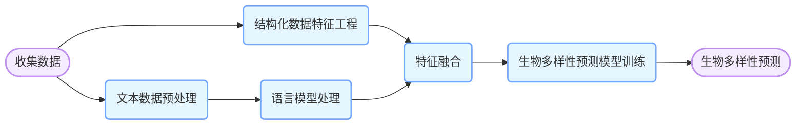

# 语言模型在生物多样性预测中的应用探索

> 关键词：语言模型、生物多样性预测、生态数据、机器学习、自然语言处理、生物信息学、环境建模

> 摘要：本文深入探索了语言模型在生物多样性预测中的应用。随着生物多样性面临诸多挑战，准确预测生物多样性的变化趋势至关重要。语言模型作为人工智能领域的重要技术，在处理和分析大量文本数据方面具有独特优势。文章首先介绍了研究的背景、目的和范围，以及相关的核心概念。接着详细阐述了语言模型在生物多样性预测中的核心算法原理、数学模型和公式。通过项目实战，展示了如何将语言模型应用于实际的生物多样性预测任务，并对代码进行了详细解读。还探讨了语言模型在生物多样性预测中的实际应用场景，推荐了相关的学习资源、开发工具和论文著作。最后总结了语言模型在该领域的未来发展趋势与挑战，并对常见问题进行了解答。

## 1. 背景介绍 
### 1.1 目的和范围
生物多样性是地球生态系统的重要组成部分，对维持生态平衡、提供生态服务和促进人类福祉具有至关重要的作用。然而，由于人类活动的影响，如栖息地破坏、气候变化、污染和物种入侵等，生物多样性正面临着前所未有的威胁。准确预测生物多样性的变化趋势对于制定有效的保护策略和管理措施至关重要。

本研究的目的是探索语言模型在生物多样性预测中的应用，旨在利用语言模型处理和分析大量的生物多样性相关文本数据，提取有用的信息和知识，从而提高生物多样性预测的准确性和可靠性。研究范围包括但不限于生物多样性数据的收集、整理和预处理，语言模型的选择、训练和优化，以及生物多样性预测模型的构建和评估。

### 1.2 预期读者
本文的预期读者包括生物学家、生态学家、环境科学家、计算机科学家、人工智能研究人员以及对生物多样性保护和人工智能应用感兴趣的专业人士和爱好者。

### 1.3 文档结构概述
本文共分为十个部分，具体结构如下：
1. 背景介绍：介绍研究的目的、范围、预期读者和文档结构概述。
2. 核心概念与联系：阐述语言模型和生物多样性预测的核心概念，以及它们之间的联系。
3. 核心算法原理 & 具体操作步骤：详细介绍语言模型在生物多样性预测中的核心算法原理和具体操作步骤，并给出Python源代码示例。
4. 数学模型和公式 & 详细讲解 & 举例说明：介绍语言模型和生物多样性预测的数学模型和公式，并进行详细讲解和举例说明。
5. 项目实战：代码实际案例和详细解释说明：通过一个实际的项目案例，展示语言模型在生物多样性预测中的应用，并对代码进行详细解释和说明。
6. 实际应用场景：探讨语言模型在生物多样性预测中的实际应用场景。
7. 工具和资源推荐：推荐相关的学习资源、开发工具和论文著作。
8. 总结：未来发展趋势与挑战：总结语言模型在生物多样性预测中的应用现状，分析未来发展趋势和面临的挑战。
9. 附录：常见问题与解答：对常见问题进行解答。
10. 扩展阅读 & 参考资料：提供扩展阅读和参考资料。

### 1.4 术语表
#### 1.4.1 核心术语定义
- **语言模型**：是一种用于处理和生成自然语言的概率模型，它可以预测一个词序列出现的概率。
- **生物多样性**：是指地球上所有生物（包括植物、动物、微生物等）及其所拥有的基因和生存环境的多样性。
- **生物多样性预测**：是指通过对生物多样性相关数据的分析和建模，预测生物多样性的变化趋势和未来状态。
- **生态数据**：是指与生态系统相关的数据，包括生物数据、环境数据、地理数据等。
- **自然语言处理**：是指计算机科学与语言学的交叉领域，主要研究如何让计算机处理和理解自然语言。
- **机器学习**：是一门多领域交叉学科，涉及概率论、统计学、逼近论、凸分析、算法复杂度理论等多门学科。它专门研究计算机怎样模拟或实现人类的学习行为，以获取新的知识或技能，重新组织已有的知识结构使之不断改善自身的性能。

#### 1.4.2 相关概念解释
- **词嵌入**：是一种将自然语言中的词汇表示为低维向量的技术，它可以将词汇的语义信息编码到向量空间中。
- **深度学习**：是机器学习的一个分支领域，它基于人工神经网络，通过构建多层的神经网络模型来学习数据的特征和模式。
- **循环神经网络（RNN）**：是一种专门用于处理序列数据的神经网络模型，它可以对序列中的每个元素进行处理，并利用之前的元素信息来预测当前元素。
- **长短时记忆网络（LSTM）**：是一种特殊的循环神经网络，它可以有效地解决传统RNN中的梯度消失问题，从而更好地处理长序列数据。
- **Transformer**：是一种基于注意力机制的神经网络模型，它在自然语言处理领域取得了巨大的成功，被广泛应用于机器翻译、文本生成等任务中。

#### 1.4.3 缩略词列表
- **NLP**：自然语言处理（Natural Language Processing）
- **ML**：机器学习（Machine Learning）
- **RNN**：循环神经网络（Recurrent Neural Network）
- **LSTM**：长短时记忆网络（Long Short-Term Memory）
- **BERT**：Bidirectional Encoder Representations from Transformers

## 2. 核心概念与联系 

### 2.1 语言模型核心概念
语言模型的核心目标是对自然语言文本进行建模，以预测文本中每个词出现的概率。传统的语言模型基于统计方法，如n - 元语法模型（n - gram model），它通过统计语料库中n个连续词出现的频率来估计词的概率。例如，在一个二元语法模型（bigram model）中，一个词的概率依赖于它前面的一个词。

现代的语言模型更多地基于深度学习技术，如基于循环神经网络（RNN）及其变体（如LSTM、GRU）和Transformer架构的模型。这些模型能够学习到更复杂的语言模式和语义信息。

以Transformer架构为例，它引入了自注意力机制（self - attention mechanism），使得模型能够在处理一个词时，动态地关注输入序列中的其他相关词，从而更好地捕捉长距离依赖关系。

### 2.2 生物多样性预测核心概念
生物多样性预测旨在根据现有的生物和环境数据，预测生物多样性的变化趋势。生物多样性可以通过多个指标来衡量，如物种丰富度（species richness）、物种均匀度（species evenness）、香农多样性指数（Shannon diversity index）等。

生物多样性预测需要考虑多种因素，包括生物因素（如物种的生态特征、种群动态等）和环境因素（如气候、土地利用变化等）。预测的方法包括统计模型（如线性回归、逻辑回归等）、机器学习模型（如决策树、随机森林等）和生态模型（如种群动态模型、生态位模型等）。

### 2.3 语言模型与生物多样性预测的联系
生物多样性相关的数据包含大量的文本信息，如物种描述、生态研究报告、环境监测记录等。语言模型可以对这些文本数据进行处理和分析，提取其中的关键信息，如物种名称、生态特征、环境条件等。

通过将语言模型与传统的生物多样性预测模型相结合，可以利用文本数据中的信息来改进预测的准确性。例如，语言模型可以从研究报告中提取关于物种栖息地偏好的信息，将其作为输入特征加入到生态位模型中，从而提高对物种分布的预测能力。

### 2.4 核心概念原理和架构的文本示意图
语言模型在生物多样性预测中的应用架构可以描述如下：

首先，收集生物多样性相关的文本数据和其他结构化数据（如环境监测数据、物种分布数据等）。文本数据包括科学文献、野外调查记录、保护报告等。

然后，对文本数据进行预处理，包括清洗、分词、词嵌入等操作，将文本转换为适合语言模型处理的格式。同时，对结构化数据进行特征工程，提取有用的特征。

接着，使用语言模型对预处理后的文本数据进行处理，提取文本中的关键信息和语义特征。可以将语言模型的输出与结构化数据的特征进行融合。

最后，将融合后的特征输入到生物多样性预测模型中，进行训练和预测。预测模型可以是统计模型、机器学习模型或生态模型。

### 2.5 Mermaid流程图


## 3. 核心算法原理 & 具体操作步骤 

### 3.1 语言模型选择与原理
在生物多样性预测中，我们可以选择预训练的语言模型，如BERT（Bidirectional Encoder Representations from Transformers）。BERT是基于Transformer架构的双向编码器，它通过在大规模文本数据上进行无监督学习，学习到了丰富的语言表示。

BERT的核心原理是通过掩码语言模型（Masked Language Model，MLM）和下一句预测（Next Sentence Prediction，NSP）两个任务进行预训练。在MLM任务中，随机掩码输入序列中的一些词，然后让模型预测这些被掩码的词。在NSP任务中，模型需要判断两个句子是否是连续的句子。

### 3.2 具体操作步骤

#### 3.2.1 数据收集与预处理
首先，收集生物多样性相关的文本数据，如科学文献、物种描述等。然后对文本数据进行预处理，包括以下步骤：
1. **清洗数据**：去除文本中的噪声，如HTML标签、特殊字符等。
2. **分词**：将文本分割成单个的词或子词。
3. **词嵌入**：将分词后的文本转换为词向量表示。

以下是一个使用Python和`transformers`库进行数据预处理的示例代码：
```python
from transformers import BertTokenizer

# 加载BERT分词器
tokenizer = BertTokenizer.from_pretrained('bert-base-uncased')

# 示例文本
text = "The species is commonly found in tropical rainforests."

# 分词
tokens = tokenizer.tokenize(text)

# 将分词转换为词ID
input_ids = tokenizer.convert_tokens_to_ids(tokens)

print("Tokens:", tokens)
print("Input IDs:", input_ids)
```

#### 3.2.2 语言模型微调
在数据预处理完成后，我们可以对预训练的BERT模型进行微调，以适应生物多样性预测的任务。微调的过程通常包括以下步骤：
1. **定义任务类型**：确定是分类任务（如物种分类）还是回归任务（如预测生物多样性指数）。
2. **构建模型**：在BERT模型的基础上添加一个或多个全连接层，以完成具体的任务。
3. **训练模型**：使用标注好的生物多样性数据对模型进行训练。

以下是一个使用Python和`transformers`库进行BERT模型微调的示例代码：
```python
import torch
from torch.utils.data import Dataset, DataLoader
from transformers import BertForSequenceClassification, AdamW
from sklearn.model_selection import train_test_split

# 定义数据集类
class BiodiversityDataset(Dataset):
    def __init__(self, texts, labels, tokenizer, max_length):
        self.texts = texts
        self.labels = labels
        self.tokenizer = tokenizer
        self.max_length = max_length

    def __len__(self):
        return len(self.texts)

    def __getitem__(self, idx):
        text = self.texts[idx]
        label = self.labels[idx]
        encoding = self.tokenizer.encode_plus(
            text,
            add_special_tokens=True,
            max_length=self.max_length,
            padding='max_length',
            truncation=True,
            return_tensors='pt'
        )
        return {
            'input_ids': encoding['input_ids'].flatten(),
            'attention_mask': encoding['attention_mask'].flatten(),
            'labels': torch.tensor(label, dtype=torch.long)
        }

# 示例数据
texts = ["The species is rare in this area.", "This species is abundant in the wetland."]
labels = [0, 1]

# 划分训练集和测试集
train_texts, test_texts, train_labels, test_labels = train_test_split(texts, labels, test_size=0.2)

# 加载BERT分词器和模型
tokenizer = BertTokenizer.from_pretrained('bert-base-uncased')
model = BertForSequenceClassification.from_pretrained('bert-base-uncased', num_labels=2)

# 创建数据集和数据加载器
train_dataset = BiodiversityDataset(train_texts, train_labels, tokenizer, max_length=128)
train_dataloader = DataLoader(train_dataset, batch_size=2, shuffle=True)

# 定义优化器
optimizer = AdamW(model.parameters(), lr=2e-5)

# 训练模型
device = torch.device('cuda' if torch.cuda.is_available() else 'cpu')
model.to(device)

for epoch in range(3):
    model.train()
    total_loss = 0
    for batch in train_dataloader:
        input_ids = batch['input_ids'].to(device)
        attention_mask = batch['attention_mask'].to(device)
        labels = batch['labels'].to(device)

        optimizer.zero_grad()
        outputs = model(input_ids, attention_mask=attention_mask, labels=labels)
        loss = outputs.loss
        loss.backward()
        optimizer.step()
        total_loss += loss.item()
    print(f'Epoch {epoch + 1}, Loss: {total_loss}')
```

#### 3.2.3 生物多样性预测
在模型训练完成后，我们可以使用训练好的模型对新的生物多样性数据进行预测。以下是一个使用训练好的模型进行预测的示例代码：
```python
# 定义预测函数
def predict(text, model, tokenizer, max_length):
    encoding = tokenizer.encode_plus(
        text,
        add_special_tokens=True,
        max_length=max_length,
        padding='max_length',
        truncation=True,
        return_tensors='pt'
    )
    input_ids = encoding['input_ids'].to(device)
    attention_mask = encoding['attention_mask'].to(device)

    model.eval()
    with torch.no_grad():
        outputs = model(input_ids, attention_mask=attention_mask)
        logits = outputs.logits
        predictions = torch.argmax(logits, dim=1)
    return predictions.item()

# 示例预测
test_text = "The species is common in the grassland."
prediction = predict(test_text, model, tokenizer, max_length=128)
print("Prediction:", prediction)
```

## 4. 数学模型和公式 & 详细讲解 & 举例说明 

### 4.1 语言模型的数学基础

#### 4.1.1 掩码语言模型（MLM）
在掩码语言模型中，给定一个输入序列 $\mathbf{x} = [x_1, x_2, \cdots, x_n]$，其中部分词被掩码，掩码的位置集合为 $\mathcal{M}$。模型的目标是预测这些被掩码的词。

设被掩码的词为 $x_i$，$i \in \mathcal{M}$，模型预测 $x_i$ 的概率分布为 $P(x_i | \mathbf{x}_{\setminus \mathcal{M}})$，其中 $\mathbf{x}_{\setminus \mathcal{M}}$ 表示未被掩码的词序列。

在BERT中，通过最大化对数似然函数来训练模型：
$$\mathcal{L}_{MLM} = - \sum_{i \in \mathcal{M}} \log P(x_i | \mathbf{x}_{\setminus \mathcal{M}})$$

例如，对于输入序列 "The [MASK] is running fast."，模型需要预测 [MASK] 位置的词。假设词汇表中包含 "dog"、"cat" 等词，模型会计算每个词在该位置出现的概率，如 $P(\text{dog} | \text{The [MASK] is running fast.})$ 和 $P(\text{cat} | \text{The [MASK] is running fast.})$ 等，然后通过最小化 $\mathcal{L}_{MLM}$ 来调整模型参数，使得正确词的概率尽可能大。

#### 4.1.2 下一句预测（NSP）
下一句预测任务是判断两个句子 $A$ 和 $B$ 是否是连续的句子。设 $y$ 是标签，$y = 1$ 表示 $B$ 是 $A$ 的下一句，$y = 0$ 表示不是。

模型输出一个二分类的概率分布 $P(y | A, B)$，通过最小化交叉熵损失函数来训练模型：
$$\mathcal{L}_{NSP} = - \sum_{i = 1}^{N} \left[ y_i \log P(y_i = 1 | A_i, B_i) + (1 - y_i) \log P(y_i = 0 | A_i, B_i) \right]$$
其中 $N$ 是训练样本的数量。

例如，给定句子对 ("I like playing football.", "It is a great sport.")，标签 $y = 1$；给定句子对 ("I like playing football.", "The sky is blue.")，标签 $y = 0$。模型会学习如何正确判断句子对的连续性。

### 4.2 生物多样性预测的数学模型

#### 4.2.1 线性回归模型
在生物多样性预测中，线性回归模型可以用于预测生物多样性指数（如物种丰富度）与环境因素（如温度、降水等）之间的关系。

设生物多样性指数为 $y$，环境因素为 $\mathbf{x} = [x_1, x_2, \cdots, x_p]$，线性回归模型可以表示为：
$$y = \beta_0 + \beta_1 x_1 + \beta_2 x_2 + \cdots + \beta_p x_p + \epsilon$$
其中 $\beta_0, \beta_1, \cdots, \beta_p$ 是模型的参数，$\epsilon$ 是误差项，通常假设 $\epsilon \sim N(0, \sigma^2)$。

通过最小化残差平方和来估计模型参数：
$$\mathcal{L} = \sum_{i = 1}^{n} (y_i - \hat{y}_i)^2$$
其中 $y_i$ 是实际的生物多样性指数，$\hat{y}_i$ 是模型预测的值。

例如，假设我们有 $n$ 个样本，每个样本包含物种丰富度 $y_i$ 和温度 $x_{i1}$、降水 $x_{i2}$ 等环境因素。我们可以使用最小二乘法来估计 $\beta_0, \beta_1, \beta_2$ 等参数，从而得到一个线性回归模型来预测物种丰富度。

#### 4.2.2 逻辑回归模型
逻辑回归模型常用于分类任务，如判断一个物种是否濒危。设 $y$ 是二分类标签（$y = 1$ 表示濒危，$y = 0$ 表示非濒危），输入特征为 $\mathbf{x} = [x_1, x_2, \cdots, x_p]$。

逻辑回归模型通过逻辑函数将线性组合转换为概率：
$$P(y = 1 | \mathbf{x}) = \frac{1}{1 + e^{-(\beta_0 + \beta_1 x_1 + \beta_2 x_2 + \cdots + \beta_p x_p)}}$$

通过最大化对数似然函数来估计模型参数：
$$\mathcal{L} = \sum_{i = 1}^{n} \left[ y_i \log P(y_i = 1 | \mathbf{x}_i) + (1 - y_i) \log (1 - P(y_i = 1 | \mathbf{x}_i)) \right]$$

例如，对于一个物种的多个特征（如种群数量、栖息地面积等），我们可以使用逻辑回归模型来预测该物种是否濒危。

### 4.3 语言模型与生物多样性预测模型的结合
当将语言模型与生物多样性预测模型结合时，语言模型的输出可以作为生物多样性预测模型的输入特征。

假设语言模型的输出为 $\mathbf{z} = [z_1, z_2, \cdots, z_q]$，生物多样性预测模型的输入特征为 $\mathbf{x} = [x_1, x_2, \cdots, x_p]$，则新的输入特征为 $\mathbf{X} = [\mathbf{x}, \mathbf{z}]$。

例如，在预测物种分布时，语言模型可以从文本中提取物种的生态特征信息，将这些信息作为新的特征加入到生态位模型中，从而提高预测的准确性。

## 5. 项目实战：代码实际案例和详细解释说明 

### 5.1  开发环境搭建

#### 5.1.1 安装Python
首先，确保你已经安装了Python 3.6或更高版本。你可以从Python官方网站（https://www.python.org/downloads/） 下载并安装Python。

#### 5.1.2 创建虚拟环境
为了避免不同项目之间的依赖冲突，建议使用虚拟环境。在命令行中执行以下命令创建并激活虚拟环境：
```bash
# 创建虚拟环境
python -m venv biodiversity_env

# 激活虚拟环境（Windows）
biodiversity_env\Scripts\activate

# 激活虚拟环境（Linux/Mac）
source biodiversity_env/bin/activate
```

#### 5.1.3 安装必要的库
在虚拟环境中，安装以下必要的库：
```bash
pip install transformers torch scikit-learn pandas numpy
```

### 5.2  源代码详细实现和代码解读

#### 5.2.1 数据准备
首先，我们需要准备生物多样性相关的文本数据和对应的标签。假设我们有一个包含物种描述和物种是否濒危标签的CSV文件 `biodiversity_data.csv`。

```python
import pandas as pd
from sklearn.model_selection import train_test_split
from transformers import BertTokenizer

# 读取数据
data = pd.read_csv('biodiversity_data.csv')
texts = data['description'].tolist()
labels = data['endangered'].tolist()

# 划分训练集和测试集
train_texts, test_texts, train_labels, test_labels = train_test_split(texts, labels, test_size=0.2)

# 加载BERT分词器
tokenizer = BertTokenizer.from_pretrained('bert-base-uncased')
```

#### 5.2.2 数据集类定义
定义一个自定义的数据集类，用于处理数据并将其转换为适合BERT模型输入的格式。

```python
import torch
from torch.utils.data import Dataset

class BiodiversityDataset(Dataset):
    def __init__(self, texts, labels, tokenizer, max_length):
        self.texts = texts
        self.labels = labels
        self.tokenizer = tokenizer
        self.max_length = max_length

    def __len__(self):
        return len(self.texts)

    def __getitem__(self, idx):
        text = self.texts[idx]
        label = self.labels[idx]
        encoding = self.tokenizer.encode_plus(
            text,
            add_special_tokens=True,
            max_length=self.max_length,
            padding='max_length',
            truncation=True,
            return_tensors='pt'
        )
        return {
            'input_ids': encoding['input_ids'].flatten(),
            'attention_mask': encoding['attention_mask'].flatten(),
            'labels': torch.tensor(label, dtype=torch.long)
        }

# 创建数据集
train_dataset = BiodiversityDataset(train_texts, train_labels, tokenizer, max_length=128)
test_dataset = BiodiversityDataset(test_texts, test_labels, tokenizer, max_length=128)
```

#### 5.2.3 模型定义和训练
加载预训练的BERT模型，并在其基础上添加一个全连接层进行二分类任务。然后定义优化器和训练循环进行模型训练。

```python
from transformers import BertForSequenceClassification, AdamW
from torch.utils.data import DataLoader

# 加载预训练的BERT模型
model = BertForSequenceClassification.from_pretrained('bert-base-uncased', num_labels=2)

# 创建数据加载器
train_dataloader = DataLoader(train_dataset, batch_size=16, shuffle=True)
test_dataloader = DataLoader(test_dataset, batch_size=16, shuffle=False)

# 定义优化器
optimizer = AdamW(model.parameters(), lr=2e-5)

# 训练模型
device = torch.device('cuda' if torch.cuda.is_available() else 'cpu')
model.to(device)

for epoch in range(3):
    model.train()
    total_loss = 0
    for batch in train_dataloader:
        input_ids = batch['input_ids'].to(device)
        attention_mask = batch['attention_mask'].to(device)
        labels = batch['labels'].to(device)

        optimizer.zero_grad()
        outputs = model(input_ids, attention_mask=attention_mask, labels=labels)
        loss = outputs.loss
        loss.backward()
        optimizer.step()
        total_loss += loss.item()
    print(f'Epoch {epoch + 1}, Loss: {total_loss}')
```

#### 5.2.4 模型评估
在训练完成后，使用测试集对模型进行评估，计算准确率等指标。

```python
from sklearn.metrics import accuracy_score

model.eval()
predictions = []
true_labels = []

for batch in test_dataloader:
    input_ids = batch['input_ids'].to(device)
    attention_mask = batch['attention_mask'].to(device)
    labels = batch['labels'].to(device)

    with torch.no_grad():
        outputs = model(input_ids, attention_mask=attention_mask)
        logits = outputs.logits
        preds = torch.argmax(logits, dim=1)
        predictions.extend(preds.cpu().tolist())
        true_labels.extend(labels.cpu().tolist())

accuracy = accuracy_score(true_labels, predictions)
print(f'Accuracy: {accuracy}')
```

### 5.3  代码解读与分析

#### 5.3.1 数据准备部分
- 使用 `pandas` 库读取CSV文件，将文本数据和标签分别存储在 `texts` 和 `labels` 列表中。
- 使用 `sklearn` 库的 `train_test_split` 函数将数据划分为训练集和测试集。
- 加载BERT分词器，用于将文本转换为适合BERT模型输入的格式。

#### 5.3.2 数据集类定义部分
- 自定义 `BiodiversityDataset` 类，继承自 `torch.utils.data.Dataset`。
- 在 `__init__` 方法中初始化数据集的文本、标签、分词器和最大长度。
- 在 `__getitem__` 方法中，使用分词器对文本进行编码，并返回输入ID、注意力掩码和标签。

#### 5.3.3 模型定义和训练部分
- 加载预训练的BERT模型，并指定分类任务的类别数为2。
- 创建数据加载器，用于批量加载数据。
- 定义优化器，使用AdamW优化算法。
- 在训练循环中，将数据移动到设备（GPU或CPU）上，计算损失并进行反向传播和参数更新。

#### 5.3.4 模型评估部分
- 将模型设置为评估模式，使用测试集进行预测。
- 计算预测结果和真实标签的准确率，评估模型的性能。

## 6. 实际应用场景 

### 6.1 物种分布预测
语言模型可以从大量的科学文献、野外调查记录等文本数据中提取物种的栖息地偏好、生态需求等信息。将这些信息与地理信息系统（GIS）数据、环境监测数据相结合，可以更准确地预测物种的分布范围和潜在栖息地。例如，通过分析文本中关于某种鸟类对栖息地植被类型、海拔高度、水源条件等的描述，结合当地的地形、气候等数据，预测该鸟类在不同地区的分布概率。

### 6.2 物种濒危状态评估
利用语言模型处理关于物种种群数量、生存环境变化、人类活动影响等方面的文本信息。可以综合这些信息，结合生物多样性评估指标，对物种的濒危状态进行更准确的评估。例如，从保护报告中提取关于某个物种栖息地破坏程度、非法捕猎情况等文本信息，辅助判断该物种是否处于濒危状态。

### 6.3 生态系统健康监测
语言模型可以分析生态系统相关的监测报告、研究论文等文本，提取关于生态系统结构、功能和动态变化的信息。通过对这些信息的分析，可以及时发现生态系统中的异常情况，如物种入侵、生态平衡破坏等，为生态系统的健康监测和管理提供支持。例如，从环境监测报告中提取关于外来物种入侵的描述，分析其对本地生态系统的影响。

### 6.4 保护策略制定
基于语言模型提取的生物多样性相关信息，结合经济、社会等多方面的因素，可以制定更科学合理的保护策略。例如，分析不同地区生物多样性的特点和面临的威胁，结合当地的社会经济发展需求，制定针对性的保护措施，如建立自然保护区、实施生态修复工程等。

### 6.5 公众教育和宣传
语言模型可以帮助整理和传播生物多样性相关的知识和信息。将科学文献、科普文章等文本进行处理和提炼，以更通俗易懂的方式呈现给公众，提高公众对生物多样性保护的认识和意识。例如，将专业的生物多样性研究成果转化为生动有趣的科普内容，通过社交媒体、科普网站等渠道进行传播。

## 7. 工具和资源推荐
### 7.1 学习资源推荐
#### 7.1.1 书籍推荐
- 《自然语言处理入门》：这本书系统地介绍了自然语言处理的基本概念、算法和技术，适合初学者入门。
- 《深度学习》：由Ian Goodfellow、Yoshua Bengio和Aaron Courville合著，是深度学习领域的经典教材，涵盖了神经网络、优化算法等方面的内容。
- 《生物多样性与生态系统功能》：深入探讨了生物多样性与生态系统功能之间的关系，对于理解生物多样性预测的背景和意义有很大帮助。

#### 7.1.2 在线课程
- Coursera上的“Natural Language Processing Specialization”：由顶尖大学的教授授课，全面介绍自然语言处理的各个方面，包括语言模型、文本分类等。
- edX上的“Introduction to Deep Learning”：讲解深度学习的基本原理和应用，适合对深度学习感兴趣的学习者。
- 中国大学MOOC上的“生物多样性保护与可持续发展”：介绍生物多样性的相关知识和保护策略，帮助学习者了解生物多样性领域的最新动态。

#### 7.1.3 技术博客和网站
- Medium：上面有很多关于自然语言处理和人工智能的技术博客，其中不乏关于语言模型应用的优秀文章。
- arXiv：是一个预印本平台，提供了大量关于人工智能、生物信息学等领域的最新研究成果。
- 中国生物多样性保护与绿色发展基金会官网：提供生物多样性保护的最新资讯、研究报告等内容。

### 7.2 开发工具框架推荐
#### 7.2.1 IDE和编辑器
- PyCharm：是一款专门为Python开发设计的集成开发环境，具有强大的代码编辑、调试和项目管理功能。
- Visual Studio Code：是一款轻量级的代码编辑器，支持多种编程语言和插件扩展，对于Python开发也非常方便。

#### 7.2.2 调试和性能分析工具
- TensorBoard：是TensorFlow的可视化工具，可以帮助开发者监控模型训练过程中的损失、准确率等指标，还可以进行模型结构可视化。
- PyTorch Profiler：是PyTorch提供的性能分析工具，可以帮助开发者找出代码中的性能瓶颈，优化模型训练和推理的效率。

#### 7.2.3 相关框架和库
- Transformers：由Hugging Face开发的库，提供了多种预训练的语言模型，如BERT、GPT等，方便开发者进行自然语言处理任务。
- PyTorch：是一个开源的深度学习框架，具有动态图机制，适合快速开发和实验。
- Scikit - learn：是一个用于机器学习的Python库，提供了多种机器学习算法和工具，如分类、回归、聚类等。

### 7.3 相关论文著作推荐
#### 7.3.1 经典论文
- “Attention Is All You Need”：介绍了Transformer架构，是自然语言处理领域的经典论文，为后续的语言模型发展奠定了基础。
- “BERT: Pre-training of Deep Bidirectional Transformers for Language Understanding”：提出了BERT模型，在自然语言处理任务中取得了显著的效果。
- “The Unified Neutral Theory of Biodiversity and Biogeography”：提出了统一中性理论，对生物多样性的研究产生了重要影响。

#### 7.3.2 最新研究成果
- 关注Nature、Science、Proceedings of the National Academy of Sciences等顶级学术期刊上关于生物多样性和人工智能交叉领域的研究论文。
- 定期浏览arXiv上关于自然语言处理和生物信息学的最新预印本。

#### 7.3.3 应用案例分析
- 一些研究机构和环保组织发布的关于生物多样性保护项目的报告和案例分析，其中可能涉及到语言模型等技术的应用。
- 相关学术会议的论文集，如ACM SIGKDD、NeurIPS等会议上关于人工智能在生态领域应用的论文。

## 8. 总结：未来发展趋势与挑战

### 8.1 未来发展趋势

#### 8.1.1 多模态融合
未来，语言模型将与图像、音频、视频等多模态数据相结合，更全面地获取生物多样性信息。例如，结合卫星图像、无人机拍摄的视频和物种描述文本，综合分析生物栖息地的变化、物种的行为特征等，提高生物多样性预测的准确性。

#### 8.1.2 跨领域合作
语言模型在生物多样性预测中的应用需要计算机科学、生物学、生态学等多个领域的专家共同合作。未来，跨领域的研究团队将不断涌现，推动该领域的快速发展。例如，计算机科学家与生态学家合作，开发更适合生物多样性数据特点的语言模型和预测算法。

#### 8.1.3 实时监测与预测
随着传感器技术和通信技术的发展，生物多样性数据的实时获取将成为可能。语言模型可以实时处理这些数据，实现对生物多样性变化的实时监测和预测，为及时采取保护措施提供支持。例如，通过实时监测环境参数和物种活动信息，预测物种的迁移和种群变化。

#### 8.1.4 个性化和定制化服务
根据不同用户的需求，语言模型可以提供个性化和定制化的生物多样性预测服务。例如，为保护组织提供特定区域的生物多样性风险评估，为政府部门提供制定政策的科学依据，为公众提供生物多样性科普知识等。

### 8.2 挑战

#### 8.2.1 数据质量和标注
生物多样性相关的数据来源广泛，数据质量参差不齐。同时，对文本数据进行标注需要专业的生物学知识，标注成本高且难度大。如何提高数据质量和标注效率是一个亟待解决的问题。

#### 8.2.2 模型可解释性
语言模型通常是复杂的黑盒模型，其决策过程难以解释。在生物多样性预测中，模型的可解释性至关重要，因为保护决策需要基于明确的科学依据。如何提高语言模型的可解释性，使其能够为生物多样性保护提供可靠的建议，是一个挑战。

#### 8.2.3 计算资源和效率
训练和运行大规模的语言模型需要大量的计算资源和时间。在生物多样性预测中，需要处理大量的数据，对计算资源和效率的要求更高。如何优化模型结构和算法，降低计算成本，提高计算效率，是一个关键问题。

#### 8.2.4 伦理和法律问题
语言模型在生物多样性预测中的应用可能涉及到伦理和法律问题，如数据隐私、知识产权、生物安全等。如何在应用过程中遵守相关的伦理和法律规定，保护生物多样性和人类的利益，是需要关注的问题。

## 9. 附录：常见问题与解答

### 9.1 语言模型在生物多样性预测中的准确性如何保证？
语言模型的准确性可以通过以下几个方面来保证：
- **数据质量**：确保收集的生物多样性相关文本数据准确、完整、有代表性。对数据进行清洗和预处理，去除噪声和错误信息。
- **模型选择和调优**：选择适合生物多样性预测任务的语言模型，并对模型进行微调，以适应具体的数据和任务需求。
- **特征工程**：合理提取和选择与生物多样性相关的特征，将语言模型的输出与其他结构化数据特征进行融合，提高模型的预测能力。
- **模型评估**：使用交叉验证、留出法等评估方法，对模型的性能进行评估和比较，选择最优的模型和参数。

### 9.2 如何处理生物多样性相关的非文本数据与语言模型的结合？
可以采用以下方法处理非文本数据与语言模型的结合：
- **特征融合**：将非文本数据（如环境监测数据、地理信息数据等）提取特征后，与语言模型的输出特征进行融合，作为生物多样性预测模型的输入。
- **多模态模型**：构建多模态模型，同时处理文本数据和非文本数据。例如，使用卷积神经网络（CNN）处理图像数据，使用循环神经网络（RNN）或Transformer处理文本数据，然后将不同模态的特征进行融合和学习。
- **数据转换**：将非文本数据转换为文本数据，然后使用语言模型进行处理。例如，将环境参数数据转换为自然语言描述，再输入到语言模型中。

### 9.3 语言模型在生物多样性预测中的计算成本高吗？
语言模型在生物多样性预测中的计算成本相对较高，主要体现在以下几个方面：
- **模型训练**：训练大规模的语言模型需要大量的计算资源和时间，尤其是在处理大量的生物多样性数据时。
- **推理过程**：在进行生物多样性预测时，语言模型的推理过程也需要一定的计算资源，特别是对于实时预测任务。

为了降低计算成本，可以采取以下措施：
- **模型压缩**：使用模型压缩技术，如剪枝、量化等，减少模型的参数数量，降低计算复杂度。
- **硬件加速**：使用GPU、TPU等硬件加速器，提高计算效率。
- **分布式计算**：采用分布式计算技术，将计算任务分配到多个计算节点上并行处理，加快计算速度。

### 9.4 语言模型在生物多样性预测中的应用是否会取代传统的生物多样性研究方法？
语言模型在生物多样性预测中的应用不会取代传统的生物多样性研究方法，而是起到补充和增强的作用。

传统的生物多样性研究方法，如野外调查、实验研究等，能够直接获取生物的形态、生态等信息，具有直观、准确的优点。而语言模型可以处理和分析大量的文本数据，提取其中的隐含信息，为生物多样性研究提供新的视角和方法。

两者结合可以充分发挥各自的优势，提高生物多样性研究的效率和准确性。例如，通过语言模型分析科学文献中的研究成果，为野外调查提供指导；野外调查获取的数据又可以用于训练和验证语言模型，提高模型的性能。

## 10. 扩展阅读 & 参考资料

### 10.1 扩展阅读
- 《人工智能时代的生物学革命》：探讨了人工智能技术在生物学领域的应用和影响，包括生物多样性研究、基因编辑等方面。
- 《生态预测学》：介绍了生态预测的理论、方法和应用，对生物多样性预测的相关知识有更深入的阐述。
- 《自然语言处理实战：基于Python和深度学习》：通过实际案例介绍自然语言处理的技术和应用，对于理解语言模型在生物多样性预测中的实现有帮助。

### 10.2 参考资料
- Hugging Face官方文档：https://huggingface.co/docs
- PyTorch官方文档：https://pytorch.org/docs/stable/index.html
- Scikit - learn官方文档：https://scikit-learn.org/stable/documentation.html
- 国际自然保护联盟（IUCN）官方网站：https://www.iucn.org/
- 联合国环境规划署（UNEP）官方网站：https://www.unep.org/