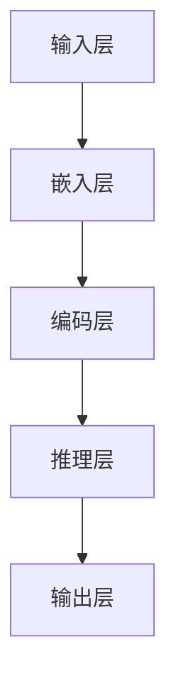

# 语言模型在跨语言推理任务中的表现研究

> 关键词：语言模型、跨语言推理任务、多语言处理、语义理解、推理能力

> 摘要：本文聚焦于语言模型在跨语言推理任务中的表现。随着全球化的发展，跨语言交流与信息处理需求日益增长，跨语言推理任务成为自然语言处理领域的重要研究方向。文章首先介绍了相关背景，包括目的范围、预期读者等。接着阐述了核心概念与联系，分析了语言模型进行跨语言推理的原理和架构。通过Python代码详细讲解了核心算法原理和具体操作步骤，同时给出了相应的数学模型和公式并举例说明。在项目实战部分，通过实际案例展示了语言模型在跨语言推理任务中的代码实现和解读。探讨了语言模型在跨语言推理任务中的实际应用场景，推荐了相关的学习资源、开发工具框架以及论文著作。最后总结了未来发展趋势与挑战，并提供了常见问题解答和扩展阅读参考资料，旨在全面深入地研究语言模型在跨语言推理任务中的表现，为该领域的研究和应用提供有价值的参考。

## 1. 背景介绍 
### 1.1 目的和范围
在当今全球化的时代，不同语言之间的信息交流与融合变得越来越频繁。跨语言推理任务旨在让计算机能够理解和处理不同语言之间的逻辑关系，例如在一种语言中给出前提条件，在另一种语言中得出合理的结论。本研究的目的在于深入探究语言模型在跨语言推理任务中的表现，评估其在不同语言对、不同推理类型下的准确性、效率等性能指标。范围涵盖了常见的语言模型，如BERT、GPT等，以及多种语言对，包括英语 - 中文、英语 - 法语等常见组合，同时涉及不同类型的推理任务，如演绎推理、归纳推理等。

### 1.2 预期读者
本文预期读者包括自然语言处理领域的研究人员、开发者、学生以及对跨语言交流和人工智能技术感兴趣的相关人士。研究人员可以从本文中获取关于语言模型在跨语言推理任务方面的最新研究进展和技术细节，为进一步的研究提供参考；开发者可以借鉴文中的算法和代码实现，应用到实际的项目开发中；学生可以通过阅读本文了解跨语言推理任务的基本概念和技术原理，拓宽知识面；对相关技术感兴趣的人士可以通过本文初步了解语言模型在跨语言推理任务中的作用和挑战。

### 1.3 文档结构概述
本文按照以下结构展开：首先介绍背景信息，包括研究目的、预期读者等；接着阐述核心概念与联系，包括语言模型和跨语言推理任务的原理和架构；然后详细讲解核心算法原理和具体操作步骤，通过Python代码进行示例；给出相关的数学模型和公式并举例说明；通过项目实战展示代码实现和解读；探讨实际应用场景；推荐相关的工具和资源；总结未来发展趋势与挑战；提供常见问题解答和扩展阅读参考资料。

### 1.4 术语表
#### 1.4.1 核心术语定义
- **语言模型**：是一种概率模型，用于计算一个句子或者一个词序列的概率，能够学习语言的统计规律和语义信息，常见的语言模型有基于规则的模型、统计语言模型和深度学习语言模型等。
- **跨语言推理任务**：指在不同语言环境下进行逻辑推理的任务，需要计算机理解不同语言的语义和逻辑关系，从一种语言的前提条件推导出另一种语言的合理结论。
- **语义理解**：是指计算机对语言所表达的意义的理解，包括词汇语义、句子语义和篇章语义等层面的理解。
- **推理能力**：在跨语言推理任务中，指语言模型根据给定的前提条件，运用逻辑规则和知识，推导出合理结论的能力。

#### 1.4.2 相关概念解释
- **多语言处理**：涉及对多种语言的文本进行处理，包括语言识别、机器翻译、跨语言信息检索等任务，是跨语言推理任务的基础。
- **上下文信息**：在语言处理中，上下文信息指的是一个词、句子或者段落所处的周围环境，能够帮助理解其准确的语义和逻辑关系。

#### 1.4.3 缩略词列表
- **BERT**：Bidirectional Encoder Representations from Transformers（基于Transformer的双向编码器表示）
- **GPT**：Generative Pretrained Transformer（生成式预训练Transformer）
- **NLP**：Natural Language Processing（自然语言处理）

## 2. 核心概念与联系 
### 核心概念原理
语言模型的核心原理是学习语言的统计规律和语义信息，通过大量的文本数据进行训练，从而能够对输入的文本进行概率计算和语义表示。在跨语言推理任务中，语言模型需要理解不同语言的语义和逻辑关系，这就要求它能够捕捉到不同语言之间的语义对应和逻辑联系。

例如，BERT模型基于Transformer架构，通过双向注意力机制学习文本的上下文信息，能够生成高质量的词向量表示。在跨语言BERT（mBERT）中，通过在多种语言的语料上进行预训练，使得模型能够学习到不同语言之间的共同语义特征，从而在跨语言任务中表现出一定的能力。

### 架构的文本示意图
语言模型在跨语言推理任务中的架构可以分为以下几个部分：

1. **输入层**：接收不同语言的文本输入，包括前提条件和问题等。
2. **嵌入层**：将输入的文本转换为向量表示，例如词向量或句子向量。
3. **编码层**：对嵌入后的向量进行编码，提取语义信息和上下文信息。
4. **推理层**：根据编码后的信息进行逻辑推理，得出结论。
5. **输出层**：输出推理结果，可能是另一种语言的文本。

### Mermaid 流程图


## 3. 核心算法原理 & 具体操作步骤 
### 算法原理讲解
在跨语言推理任务中，我们可以使用基于预训练语言模型的方法。以mBERT为例，其基本原理是通过在多种语言的语料上进行预训练，学习到不同语言之间的共同语义特征。在推理阶段，将输入的文本通过mBERT进行编码，得到文本的向量表示，然后使用一个分类器对这些向量进行分类，得出推理结果。

### Python源代码详细阐述
```python
import torch
from transformers import BertTokenizer, BertForSequenceClassification

# 加载预训练的mBERT模型和分词器
tokenizer = BertTokenizer.from_pretrained('bert-base-multilingual-cased')
model = BertForSequenceClassification.from_pretrained('bert-base-multilingual-cased', num_labels=3)

# 定义输入文本
premise = "The cat is on the mat."
hypothesis = "Le chat est sur le tapis."

# 对输入文本进行分词
inputs = tokenizer(premise, hypothesis, return_tensors='pt')

# 进行推理
outputs = model(**inputs)

# 获取预测结果
logits = outputs.logits
predicted_class_id = logits.argmax().item()

# 定义标签映射
label_map = {0: 'entailment', 1: 'neutral', 2: 'contradiction'}

# 输出预测结果
print(f"Predicted label: {label_map[predicted_class_id]}")
```

### 具体操作步骤
1. **加载预训练模型和分词器**：使用`transformers`库加载mBERT模型和对应的分词器。
2. **定义输入文本**：包括前提条件和假设，前提条件可以是一种语言，假设可以是另一种语言。
3. **分词**：使用分词器对输入文本进行分词，将文本转换为模型可以接受的输入格式。
4. **推理**：将分词后的输入传递给模型，得到模型的输出。
5. **获取预测结果**：从模型的输出中提取logits，通过argmax函数得到预测的类别ID。
6. **输出结果**：根据标签映射将类别ID转换为具体的标签。

## 4. 数学模型和公式 & 详细讲解 & 举例说明 
### 数学模型
在跨语言推理任务中，我们可以使用分类模型来进行推理。假设输入的文本对为 $(x_1, x_2)$，其中 $x_1$ 是前提条件，$x_2$ 是假设。模型的输出为一个概率分布 $p(y|x_1, x_2)$，其中 $y$ 是推理结果的类别，例如蕴含（entailment）、中立（neutral）、矛盾（contradiction）等。

### 公式
我们可以使用交叉熵损失函数来训练模型，其公式为：

$$
L = -\sum_{i=1}^{N} \sum_{j=1}^{C} y_{ij} \log(p_{ij})
$$

其中 $N$ 是样本数量，$C$ 是类别数量，$y_{ij}$ 是第 $i$ 个样本的真实标签的第 $j$ 个分量，$p_{ij}$ 是模型预测的第 $i$ 个样本的第 $j$ 个类别的概率。

### 详细讲解
交叉熵损失函数的作用是衡量模型预测的概率分布与真实标签的概率分布之间的差异。当模型的预测结果与真实标签越接近时，交叉熵损失函数的值越小。在训练过程中，我们通过最小化交叉熵损失函数来优化模型的参数。

### 举例说明
假设我们有一个样本 $(x_1, x_2)$，其真实标签为 $y = [1, 0, 0]$，表示蕴含类别。模型的预测结果为 $p = [0.8, 0.1, 0.1]$。则交叉熵损失为：

$$
L = - (1 \times \log(0.8) + 0 \times \log(0.1) + 0 \times \log(0.1)) \approx 0.223
$$

## 5. 项目实战：代码实际案例和详细解释说明 
### 5.1  开发环境搭建
1. **安装Python**：确保你的系统中安装了Python 3.6及以上版本。
2. **安装依赖库**：使用`pip`安装所需的库，包括`torch`、`transformers`等。
```bash
pip install torch transformers
```
3. **下载预训练模型**：可以使用`transformers`库自动下载预训练的mBERT模型，也可以手动下载并指定路径。

### 5.2  源代码详细实现和代码解读
```python
import torch
from transformers import BertTokenizer, BertForSequenceClassification
import numpy as np

# 加载预训练的mBERT模型和分词器
tokenizer = BertTokenizer.from_pretrained('bert-base-multilingual-cased')
model = BertForSequenceClassification.from_pretrained('bert-base-multilingual-cased', num_labels=3)

# 定义训练数据
train_data = [
    ("The dog is running.", "Le chien court.", 0),
    ("The cat is sleeping.", "Le chat dort.", 0),
    ("The sun is shining.", "La pluie tombe.", 2)
]

# 定义训练参数
epochs = 3
batch_size = 2
learning_rate = 2e-5

# 定义优化器
optimizer = torch.optim.Adam(model.parameters(), lr=learning_rate)

# 训练模型
for epoch in range(epochs):
    np.random.shuffle(train_data)
    num_batches = len(train_data) // batch_size
    for batch_idx in range(num_batches):
        batch = train_data[batch_idx * batch_size: (batch_idx + 1) * batch_size]
        premises = [data[0] for data in batch]
        hypotheses = [data[1] for data in batch]
        labels = torch.tensor([data[2] for data in batch])

        # 对输入文本进行分词
        inputs = tokenizer(premises, hypotheses, return_tensors='pt', padding=True, truncation=True)

        # 前向传播
        outputs = model(**inputs, labels=labels)
        loss = outputs.loss

        # 反向传播
        optimizer.zero_grad()
        loss.backward()
        optimizer.step()

        print(f"Epoch {epoch + 1}, Batch {batch_idx + 1}, Loss: {loss.item()}")

# 定义测试数据
test_data = [
    ("The bird is flying.", "L'oiseau vole.", 0),
    ("The book is on the table.", "Le livre est sous la table.", 2)
]

# 测试模型
model.eval()
for premise, hypothesis, label in test_data:
    inputs = tokenizer(premise, hypothesis, return_tensors='pt')
    with torch.no_grad():
        outputs = model(**inputs)
        logits = outputs.logits
        predicted_class_id = logits.argmax().item()
    print(f"Premise: {premise}, Hypothesis: {hypothesis}, True Label: {label}, Predicted Label: {predicted_class_id}")
```

### 5.3  代码解读与分析
1. **数据加载**：定义了训练数据和测试数据，每个数据样本包含前提条件、假设和真实标签。
2. **模型加载**：使用`transformers`库加载预训练的mBERT模型和分词器。
3. **训练参数设置**：设置了训练的轮数、批次大小和学习率。
4. **优化器定义**：使用Adam优化器来更新模型的参数。
5. **训练过程**：在每个轮次中，对训练数据进行随机打乱，然后按批次进行训练。在每个批次中，对输入文本进行分词，进行前向传播计算损失，然后进行反向传播更新模型参数。
6. **测试过程**：在测试阶段，使用训练好的模型对测试数据进行推理，输出预测结果。

## 6. 实际应用场景 
### 智能翻译助手
在智能翻译助手应用中，跨语言推理能力可以帮助提高翻译的准确性和逻辑性。例如，当用户输入一段文本进行翻译时，翻译助手可以通过跨语言推理任务理解原文的语义和逻辑关系，从而在目标语言中生成更符合逻辑和语境的翻译结果。

### 跨语言信息检索
在跨语言信息检索系统中，用户可能使用一种语言进行查询，而系统需要在多种语言的文档中进行检索。语言模型的跨语言推理能力可以帮助系统理解查询的语义和逻辑，从而在不同语言的文档中找到相关的信息。

### 国际商务谈判支持
在国际商务谈判中，不同语言的参与者之间需要进行有效的沟通和交流。跨语言推理技术可以帮助自动分析和理解各方的观点和意图，提供实时的翻译和推理支持，促进谈判的顺利进行。

### 跨国教育合作
在跨国教育合作中，不同语言的学生和教师需要共享知识和信息。跨语言推理任务可以帮助实现不同语言教材和课件的理解和转换，促进跨国教育资源的共享和交流。

## 7. 工具和资源推荐
### 7.1 学习资源推荐
#### 7.1.1 书籍推荐
- 《自然语言处理入门》：介绍了自然语言处理的基本概念、方法和技术，适合初学者入门。
- 《深度学习》：详细讲解了深度学习的原理和算法，包括神经网络、卷积神经网络、循环神经网络等，对于理解语言模型的底层原理有很大帮助。
- 《Transformers自然语言处理实战》：专注于Transformers架构在自然语言处理中的应用，包括BERT、GPT等模型的原理和实践。

#### 7.1.2 在线课程
- Coursera上的“Natural Language Processing Specialization”：由顶尖大学的教授授课，全面介绍了自然语言处理的各个方面，包括语言模型、机器翻译、信息检索等。
- edX上的“Deep Learning for Natural Language Processing”：深入讲解了深度学习在自然语言处理中的应用，包括Transformer架构、预训练语言模型等。

#### 7.1.3 技术博客和网站
- Hugging Face博客：提供了关于自然语言处理和语言模型的最新研究成果和技术分享，包括模型介绍、应用案例等。
- arXiv.org：是一个开放的学术预印本平台，上面有大量关于自然语言处理和跨语言推理的研究论文。

### 7.2 开发工具框架推荐
#### 7.2.1 IDE和编辑器
- PyCharm：是一款专业的Python集成开发环境，提供了丰富的代码编辑、调试、版本控制等功能，适合开发Python语言的自然语言处理项目。
- Visual Studio Code：是一款轻量级的代码编辑器，支持多种编程语言和插件，具有良好的扩展性，可用于快速开发和调试自然语言处理代码。

#### 7.2.2 调试和性能分析工具
- TensorBoard：是TensorFlow提供的可视化工具，可以用于可视化模型的训练过程、损失曲线、准确率等指标，帮助开发者分析模型的性能。
- PyTorch Profiler：是PyTorch提供的性能分析工具，可以帮助开发者分析模型的运行时间、内存使用等情况，优化模型的性能。

#### 7.2.3 相关框架和库
- Transformers：是Hugging Face开发的一个用于自然语言处理的库，提供了大量预训练的语言模型，包括BERT、GPT等，方便开发者快速实现自然语言处理任务。
- NLTK：是一个常用的自然语言处理库，提供了丰富的文本处理工具和数据集，包括分词、词性标注、命名实体识别等功能。

### 7.3 相关论文著作推荐
#### 7.3.1 经典论文
- “BERT: Pre-training of Deep Bidirectional Transformers for Language Understanding”：介绍了BERT模型的原理和训练方法，是自然语言处理领域的经典论文之一。
- “Attention Is All You Need”：提出了Transformer架构，为后续的语言模型发展奠定了基础。

#### 7.3.2 最新研究成果
- 关注ACL（Association for Computational Linguistics）、EMNLP（Conference on Empirical Methods in Natural Language Processing）等自然语言处理领域的顶级会议，上面有最新的跨语言推理研究成果。

#### 7.3.3 应用案例分析
- 一些企业和研究机构会发布关于跨语言推理技术在实际应用中的案例分析，例如谷歌、微软等公司的研究报告，可以从中了解到跨语言推理技术的实际应用效果和挑战。

## 8. 总结：未来发展趋势与挑战
### 未来发展趋势
1. **多模态融合**：未来的语言模型可能会融合图像、音频等多模态信息，从而在跨语言推理任务中获得更丰富的语义信息，提高推理的准确性和可靠性。
2. **零样本和少样本学习**：为了减少对大规模标注数据的依赖，语言模型可能会在零样本和少样本学习方面取得更大的进展，能够在少量数据的情况下进行有效的跨语言推理。
3. **个性化推理**：根据用户的语言习惯、知识背景等个性化信息，提供更符合用户需求的跨语言推理服务。

### 挑战
1. **语义鸿沟**：不同语言之间存在语义鸿沟，一些概念和表达方式在不同语言中可能没有直接的对应关系，这给跨语言推理带来了很大的挑战。
2. **数据稀缺**：在某些语言对和特定领域中，标注数据可能非常稀缺，这会影响语言模型的训练效果和泛化能力。
3. **计算资源需求**：训练和运行大规模的语言模型需要大量的计算资源，这对于一些研究机构和企业来说是一个很大的负担。

## 9. 附录：常见问题与解答
### 问题1：如何选择合适的语言模型进行跨语言推理任务？
解答：选择合适的语言模型需要考虑多个因素，包括模型的性能、支持的语言种类、训练数据的规模和质量等。一般来说，预训练的多语言模型如mBERT、XLM - RoBERTa等在跨语言任务中表现较好，可以作为首选。同时，还需要根据具体的任务需求和数据情况进行调整和优化。

### 问题2：如何处理不同语言之间的语义差异？
解答：可以通过以下几种方法处理不同语言之间的语义差异：1. 使用多语言预训练模型，这些模型在多种语言的语料上进行训练，能够学习到不同语言之间的共同语义特征；2. 引入外部知识，如词典、知识库等，帮助模型理解不同语言之间的语义对应关系；3. 进行数据增强，通过机器翻译等方法扩充训练数据，提高模型对不同语言表达方式的适应能力。

### 问题3：如何评估语言模型在跨语言推理任务中的性能？
解答：可以使用以下几种指标来评估语言模型在跨语言推理任务中的性能：1. 准确率（Accuracy）：预测正确的样本数占总样本数的比例；2. 召回率（Recall）：预测为正类的样本中实际为正类的比例；3. F1值：准确率和召回率的调和平均数，综合考虑了准确率和召回率两个指标。此外，还可以使用人工评估的方法，邀请专业的语言学家和领域专家对模型的推理结果进行评估。

## 10. 扩展阅读 & 参考资料
### 扩展阅读
- 《自然语言处理综论》：全面介绍了自然语言处理的各个方面，包括语言模型、机器翻译、信息检索等，适合深入学习自然语言处理的读者。
- 《人工智能：一种现代的方法》：介绍了人工智能的基本概念、方法和技术，包括机器学习、深度学习等，对于理解语言模型的背景和应用有很大帮助。

### 参考资料
1. Devlin, J., Chang, M. - W., Lee, K., & Toutanova, K. (2018). BERT: Pre - training of Deep Bidirectional Transformers for Language Understanding. arXiv preprint arXiv:1810.04805.
2. Vaswani, A., Shazeer, N., Parmar, N., Uszkoreit, J., Jones, L., Gomez, A. N., ... & Polosukhin, I. (2017). Attention Is All You Need. Advances in neural information processing systems, 5998 - 6008.
3. Hugging Face官方文档：https://huggingface.co/docs/transformers/index
4. NLTK官方文档：https://www.nltk.org/ 