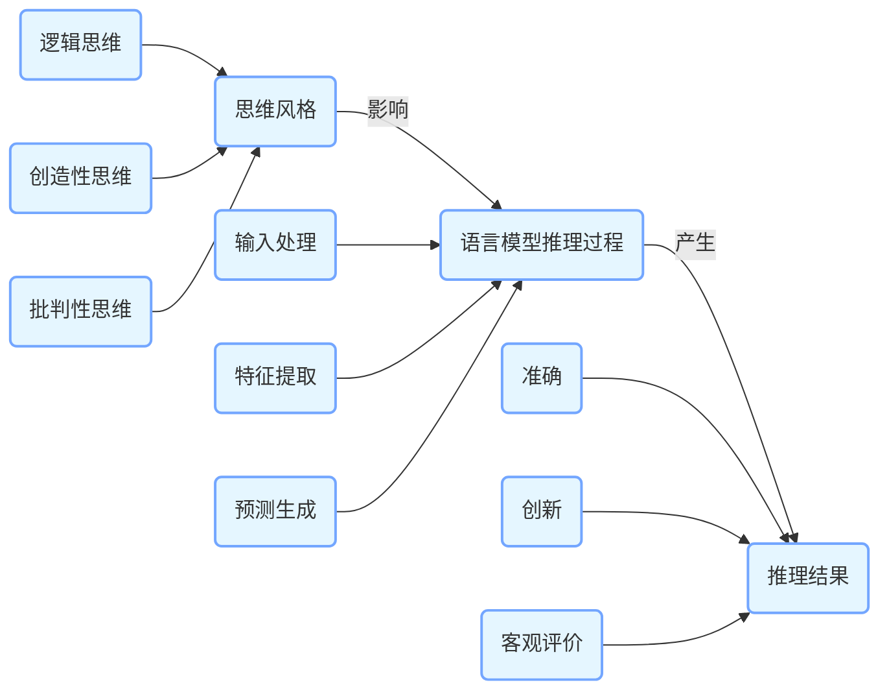

# 语言模型推理能力的思维风格相关性分析

> 关键词：语言模型、推理能力、思维风格、相关性分析、认知模式

> 摘要：本文旨在深入探讨语言模型推理能力与思维风格之间的相关性。随着语言模型在自然语言处理领域的广泛应用，其推理能力的提升成为研究的关键方向。思维风格作为人类认知和处理信息的方式，可能对语言模型的推理表现产生重要影响。通过对相关概念、算法原理、数学模型的研究，结合项目实战和实际应用场景分析，揭示两者之间的内在联系，为语言模型的优化和发展提供理论支持和实践指导。

## 1. 背景介绍 
### 1.1 目的和范围
本研究的主要目的是全面分析语言模型推理能力与思维风格之间的相关性。通过对不同思维风格的特征和语言模型推理机制的深入研究，探索思维风格如何影响语言模型的推理过程和结果。研究范围涵盖了常见的思维风格类型，如逻辑思维、创造性思维、批判性思维等，以及多种主流语言模型，包括基于深度学习的Transformer架构的模型等。旨在为语言模型的设计、训练和优化提供有价值的参考，以提高其推理能力和性能。

### 1.2 预期读者
本文预期读者包括自然语言处理领域的研究人员、人工智能开发者、语言模型相关的科研工作者以及对语言模型和思维风格感兴趣的技术爱好者。希望通过本文的阐述，为读者提供深入理解语言模型推理能力与思维风格关系的视角，促进相关领域的研究和实践。

### 1.3 文档结构概述
本文将首先介绍相关的背景知识，包括核心概念和术语的定义。接着详细阐述语言模型推理能力和思维风格的核心概念及它们之间的联系，并通过流程图进行直观展示。然后深入讲解核心算法原理和具体操作步骤，结合Python源代码进行详细说明。随后介绍相关的数学模型和公式，并通过具体例子进行解释。通过项目实战部分，展示代码实际案例并进行详细解读。分析实际应用场景，为语言模型的应用提供参考。推荐相关的工具和资源，帮助读者进一步学习和研究。最后总结未来发展趋势与挑战，解答常见问题，并提供扩展阅读和参考资料。

### 1.4 术语表
#### 1.4.1 核心术语定义
- **语言模型**：是一种对自然语言文本进行建模的数学模型，用于预测文本中下一个词或字符的概率分布，能够学习语言的统计规律和语义信息。
- **推理能力**：指语言模型根据给定的输入信息，通过逻辑推导、知识运用等方式得出合理结论或答案的能力。
- **思维风格**：是个体在认知和处理信息过程中所表现出的偏好和习惯方式，反映了个体思考问题的特点和倾向。

#### 1.4.2 相关概念解释
- **Transformer架构**：是一种基于自注意力机制的深度学习架构，在自然语言处理中广泛应用，能够有效捕捉文本中的长距离依赖关系。
- **自注意力机制**：是Transformer架构中的核心机制，通过计算输入序列中各个元素之间的相关性，为每个元素分配不同的权重，从而更好地表示序列的语义信息。

#### 1.4.3 缩略词列表
- **NLP**：Natural Language Processing，自然语言处理
- **RNN**：Recurrent Neural Network，循环神经网络
- **LSTM**：Long Short - Term Memory，长短期记忆网络
- **GPT**：Generative Pretrained Transformer，生成式预训练Transformer

## 2. 核心概念与联系 

### 2.1 语言模型推理能力
语言模型的推理能力是其智能水平的重要体现。从原理上讲，语言模型通过对大量文本数据的学习，构建起语言的统计模型和语义表示。在推理过程中，它会根据输入的上下文信息，结合自身学习到的知识和模式，预测下一个可能的词或生成相关的文本内容。

其架构通常由输入层、隐藏层和输出层组成。输入层接收文本数据，隐藏层对输入进行处理和转换，提取语义特征，输出层则根据隐藏层的结果生成预测的文本。以基于Transformer架构的语言模型为例，它通过多头自注意力机制和前馈神经网络的组合，实现对文本的高效处理和推理。

### 2.2 思维风格
思维风格是人类认知和思考的方式，常见的思维风格包括逻辑思维、创造性思维和批判性思维等。

- **逻辑思维**：强调依据逻辑规则和推理步骤进行思考，注重因果关系和推理的严密性。在解决问题时，通过分析、归纳、演绎等方法得出结论。
- **创造性思维**：注重突破常规，产生新颖、独特的想法和解决方案。它鼓励从不同的角度看待问题，发挥想象力和创造力。
- **批判性思维**：要求对信息进行客观、理性的分析和评价，不盲目接受，善于发现问题和质疑。

### 2.3 两者的联系
思维风格与语言模型推理能力存在密切的联系。不同的思维风格可以影响语言模型的推理方式和结果。例如，逻辑思维风格可能促使语言模型在推理过程中更加注重逻辑规则和推理的严密性，从而提高推理的准确性；创造性思维风格可能引导语言模型产生更具创新性和独特性的推理结果；批判性思维风格则有助于语言模型对输入信息进行更深入的分析和评价，避免盲目推理。

### 2.4 文本示意图
语言模型推理能力与思维风格的联系可以用以下示意图表示：

思维风格（逻辑思维、创造性思维、批判性思维） ---> 影响 ---> 语言模型推理过程（输入处理、特征提取、预测生成） ---> 产生 ---> 推理结果（准确、创新、客观评价）

### 2.5 Mermaid 流程图


## 3. 核心算法原理 & 具体操作步骤 

### 3.1 语言模型推理算法原理
以基于Transformer架构的语言模型为例，其核心算法基于自注意力机制和前馈神经网络。

自注意力机制的原理是通过计算输入序列中各个元素之间的相关性，为每个元素分配不同的权重。具体来说，对于输入序列 $\mathbf{X} = [\mathbf{x}_1, \mathbf{x}_2, \cdots, \mathbf{x}_n]$，首先通过线性变换将其映射到查询（Query）、键（Key）和值（Value）三个空间，得到 $\mathbf{Q}$, $\mathbf{K}$, $\mathbf{V}$。然后计算注意力分数：

$$\text{Attention}(\mathbf{Q}, \mathbf{K}, \mathbf{V}) = \text{softmax}\left(\frac{\mathbf{Q}\mathbf{K}^T}{\sqrt{d_k}}\right)\mathbf{V}$$

其中 $d_k$ 是查询和键向量的维度。多头自注意力机制则是将自注意力机制并行执行多次，然后将结果拼接起来，以捕捉不同的语义信息。

前馈神经网络则是对自注意力机制的输出进行非线性变换，进一步提取特征。

### 3.2 思维风格模拟算法原理
为了模拟不同的思维风格对语言模型推理的影响，可以通过调整语言模型的参数或生成策略来实现。

- **逻辑思维模拟**：在推理过程中，增加对逻辑规则的约束，例如在生成文本时，检查语法和语义的逻辑性，避免产生矛盾或不合理的内容。
- **创造性思维模拟**：通过引入随机噪声或调整生成概率分布，鼓励语言模型产生更具多样性和独特性的结果。
- **批判性思维模拟**：对输入信息进行分析和评价，设置阈值来判断信息的可靠性和合理性，对不可靠的信息进行过滤或修正。

### 3.3 具体操作步骤
以下是结合思维风格进行语言模型推理的具体操作步骤：

1. **数据预处理**：对输入的文本数据进行清洗、分词等预处理操作，将其转换为适合语言模型输入的格式。
2. **思维风格设定**：根据需求选择要模拟的思维风格，设置相应的参数和策略。
3. **语言模型推理**：将预处理后的输入数据输入到语言模型中，根据设定的思维风格进行推理。在推理过程中，根据不同的思维风格进行相应的调整和约束。
4. **结果输出**：输出推理结果，并对结果进行评估和分析。

### 3.4 Python源代码实现
```python
import torch
import torch.nn as nn
import torch.nn.functional as F

# 定义自注意力机制
class SelfAttention(nn.Module):
    def __init__(self, input_dim, d_k, d_v):
        super(SelfAttention, self).__init__()
        self.W_q = nn.Linear(input_dim, d_k)
        self.W_k = nn.Linear(input_dim, d_k)
        self.W_v = nn.Linear(input_dim, d_v)

    def forward(self, x):
        Q = self.W_q(x)
        K = self.W_k(x)
        V = self.W_v(x)
        attn_scores = torch.matmul(Q, K.transpose(-2, -1)) / torch.sqrt(torch.tensor(Q.size(-1), dtype=torch.float32))
        attn_probs = F.softmax(attn_scores, dim=-1)
        output = torch.matmul(attn_probs, V)
        return output

# 定义简单的语言模型
class SimpleLanguageModel(nn.Module):
    def __init__(self, input_dim, d_k, d_v, hidden_dim, output_dim):
        super(SimpleLanguageModel, self).__init__()
        self.attention = SelfAttention(input_dim, d_k, d_v)
        self.fc1 = nn.Linear(d_v, hidden_dim)
        self.fc2 = nn.Linear(hidden_dim, output_dim)

    def forward(self, x):
        attn_output = self.attention(x)
        hidden_output = F.relu(self.fc1(attn_output))
        output = self.fc2(hidden_output)
        return output

# 模拟逻辑思维风格的推理
def logical_reasoning(model, input_data):
    output = model(input_data)
    # 简单的逻辑约束：确保输出的概率分布合理
    output_probs = F.softmax(output, dim=-1)
    valid_indices = (output_probs > 0.1).nonzero(as_tuple=True)
    valid_output = output[valid_indices]
    return valid_output

# 模拟创造性思维风格的推理
def creative_reasoning(model, input_data):
    output = model(input_data)
    # 引入随机噪声
    noise = torch.randn_like(output) * 0.1
    noisy_output = output + noise
    creative_output = F.softmax(noisy_output, dim=-1)
    return creative_output

# 模拟批判性思维风格的推理
def critical_reasoning(model, input_data):
    output = model(input_data)
    # 简单的信息评估：过滤掉置信度低的输出
    output_probs = F.softmax(output, dim=-1)
    confidence_threshold = 0.2
    valid_indices = (output_probs > confidence_threshold).nonzero(as_tuple=True)
    critical_output = output[valid_indices]
    return critical_output
```

## 4. 数学模型和公式 & 详细讲解 & 举例说明 

### 4.1 自注意力机制数学模型
自注意力机制的数学模型如前面所述：

$$\text{Attention}(\mathbf{Q}, \mathbf{K}, \mathbf{V}) = \text{softmax}\left(\frac{\mathbf{Q}\mathbf{K}^T}{\sqrt{d_k}}\right)\mathbf{V}$$

详细讲解：
- $\mathbf{Q}$, $\mathbf{K}$, $\mathbf{V}$ 分别是查询、键和值矩阵，通过对输入序列进行线性变换得到。
- $\mathbf{Q}\mathbf{K}^T$ 计算了查询和键之间的相似度，通过除以 $\sqrt{d_k}$ 来缩放相似度分数，防止梯度消失或爆炸。
- $\text{softmax}$ 函数将相似度分数转换为概率分布，使得每个元素的权重之和为 1。
- 最后将概率分布与值矩阵 $\mathbf{V}$ 相乘，得到加权和作为输出。

举例说明：
假设输入序列 $\mathbf{X} = \begin{bmatrix}1 & 2 \\ 3 & 4 \\ 5 & 6\end{bmatrix}$，$d_k = d_v = 2$。

首先计算 $\mathbf{Q}$, $\mathbf{K}$, $\mathbf{V}$：
设 $\mathbf{W}_q = \begin{bmatrix}1 & 0 \\ 0 & 1\end{bmatrix}$, $\mathbf{W}_k = \begin{bmatrix}1 & 0 \\ 0 & 1\end{bmatrix}$, $\mathbf{W}_v = \begin{bmatrix}1 & 0 \\ 0 & 1\end{bmatrix}$

则 $\mathbf{Q} = \mathbf{X}\mathbf{W}_q = \begin{bmatrix}1 & 2 \\ 3 & 4 \\ 5 & 6\end{bmatrix}$，$\mathbf{K} = \mathbf{X}\mathbf{W}_k = \begin{bmatrix}1 & 2 \\ 3 & 4 \\ 5 & 6\end{bmatrix}$，$\mathbf{V} = \mathbf{X}\mathbf{W}_v = \begin{bmatrix}1 & 2 \\ 3 & 4 \\ 5 & 6\end{bmatrix}$

计算 $\mathbf{Q}\mathbf{K}^T$：
$$\mathbf{Q}\mathbf{K}^T = \begin{bmatrix}1 & 2 \\ 3 & 4 \\ 5 & 6\end{bmatrix}\begin{bmatrix}1 & 3 & 5 \\ 2 & 4 & 6\end{bmatrix} = \begin{bmatrix}5 & 11 & 17 \\ 11 & 25 & 39 \\ 17 & 39 & 61\end{bmatrix}$$

除以 $\sqrt{d_k} = \sqrt{2}$：
$$\frac{\mathbf{Q}\mathbf{K}^T}{\sqrt{2}} = \begin{bmatrix}\frac{5}{\sqrt{2}} & \frac{11}{\sqrt{2}} & \frac{17}{\sqrt{2}} \\ \frac{11}{\sqrt{2}} & \frac{25}{\sqrt{2}} & \frac{39}{\sqrt{2}} \\ \frac{17}{\sqrt{2}} & \frac{39}{\sqrt{2}} & \frac{61}{\sqrt{2}}\end{bmatrix}$$

计算 $\text{softmax}$：
$$\text{softmax}\left(\frac{\mathbf{Q}\mathbf{K}^T}{\sqrt{2}}\right) = \begin{bmatrix}s_{11} & s_{12} & s_{13} \\ s_{21} & s_{22} & s_{23} \\ s_{31} & s_{32} & s_{33}\end{bmatrix}$$

最后计算输出：
$$\text{Attention}(\mathbf{Q}, \mathbf{K}, \mathbf{V}) = \text{softmax}\left(\frac{\mathbf{Q}\mathbf{K}^T}{\sqrt{2}}\right)\mathbf{V}$$

### 4.2 思维风格模拟的数学模型
- **逻辑思维模拟**：可以通过设置逻辑约束条件，例如在生成文本时，要求输出的概率分布满足一定的逻辑规则。设 $p_i$ 是第 $i$ 个词的生成概率，逻辑约束可以表示为：

$$\sum_{i \in S} p_i \geq \alpha$$

其中 $S$ 是满足逻辑规则的词的集合，$\alpha$ 是一个阈值。

- **创造性思维模拟**：通过引入随机噪声 $\epsilon$ 来增加生成的多样性。设原始输出为 $y$，则创造性输出 $y'$ 可以表示为：

$$y' = y + \epsilon$$

其中 $\epsilon$ 服从正态分布 $\mathcal{N}(0, \sigma^2)$。

- **批判性思维模拟**：通过设置置信度阈值 $\beta$ 来过滤不可靠的信息。设 $p_i$ 是第 $i$ 个词的生成概率，过滤后的输出为：

$$y_{\text{filtered}} = \begin{cases}y_i, & p_i \geq \beta \\ 0, & p_i < \beta\end{cases}$$

## 5. 项目实战：代码实际案例和详细解释说明 

### 5.1  开发环境搭建
1. **安装Python**：建议使用Python 3.7及以上版本。可以从Python官方网站（https://www.python.org/downloads/）下载并安装。
2. **安装深度学习框架**：使用PyTorch作为深度学习框架。可以通过以下命令安装：
```sh
pip install torch torchvision
```
3. **安装相关库**：安装必要的库，如`numpy`、`matplotlib`等：
```sh
pip install numpy matplotlib
```

### 5.2  源代码详细实现和代码解读
```python
import torch
import torch.nn as nn
import torch.nn.functional as F
import numpy as np
import matplotlib.pyplot as plt

# 定义自注意力机制
class SelfAttention(nn.Module):
    def __init__(self, input_dim, d_k, d_v):
        super(SelfAttention, self).__init__()
        self.W_q = nn.Linear(input_dim, d_k)
        self.W_k = nn.Linear(input_dim, d_k)
        self.W_v = nn.Linear(input_dim, d_v)

    def forward(self, x):
        Q = self.W_q(x)
        K = self.W_k(x)
        V = self.W_v(x)
        attn_scores = torch.matmul(Q, K.transpose(-2, -1)) / torch.sqrt(torch.tensor(Q.size(-1), dtype=torch.float32))
        attn_probs = F.softmax(attn_scores, dim=-1)
        output = torch.matmul(attn_probs, V)
        return output

# 定义简单的语言模型
class SimpleLanguageModel(nn.Module):
    def __init__(self, input_dim, d_k, d_v, hidden_dim, output_dim):
        super(SimpleLanguageModel, self).__init__()
        self.attention = SelfAttention(input_dim, d_k, d_v)
        self.fc1 = nn.Linear(d_v, hidden_dim)
        self.fc2 = nn.Linear(hidden_dim, output_dim)

    def forward(self, x):
        attn_output = self.attention(x)
        hidden_output = F.relu(self.fc1(attn_output))
        output = self.fc2(hidden_output)
        return output

# 模拟逻辑思维风格的推理
def logical_reasoning(model, input_data):
    output = model(input_data)
    # 简单的逻辑约束：确保输出的概率分布合理
    output_probs = F.softmax(output, dim=-1)
    valid_indices = (output_probs > 0.1).nonzero(as_tuple=True)
    valid_output = output[valid_indices]
    return valid_output

# 模拟创造性思维风格的推理
def creative_reasoning(model, input_data):
    output = model(input_data)
    # 引入随机噪声
    noise = torch.randn_like(output) * 0.1
    noisy_output = output + noise
    creative_output = F.softmax(noisy_output, dim=-1)
    return creative_output

# 模拟批判性思维风格的推理
def critical_reasoning(model, input_data):
    output = model(input_data)
    # 简单的信息评估：过滤掉置信度低的输出
    output_probs = F.softmax(output, dim=-1)
    confidence_threshold = 0.2
    valid_indices = (output_probs > confidence_threshold).nonzero(as_tuple=True)
    critical_output = output[valid_indices]
    return critical_output

# 主函数
if __name__ == "__main__":
    # 初始化参数
    input_dim = 10
    d_k = 5
    d_v = 5
    hidden_dim = 20
    output_dim = 30
    batch_size = 1
    seq_length = 5

    # 初始化模型
    model = SimpleLanguageModel(input_dim, d_k, d_v, hidden_dim, output_dim)

    # 生成随机输入数据
    input_data = torch.randn(batch_size, seq_length, input_dim)

    # 进行不同思维风格的推理
    logical_result = logical_reasoning(model, input_data)
    creative_result = creative_reasoning(model, input_data)
    critical_result = critical_reasoning(model, input_data)

    print("逻辑思维推理结果形状:", logical_result.shape)
    print("创造性思维推理结果形状:", creative_result.shape)
    print("批判性思维推理结果形状:", critical_result.shape)

    # 可视化结果（简单示例）
    plt.figure(figsize=(12, 4))
    plt.subplot(1, 3, 1)
    plt.hist(logical_result.detach().numpy().flatten(), bins=20)
    plt.title("逻辑思维推理结果分布")
    plt.subplot(1, 3, 2)
    plt.hist(creative_result.detach().numpy().flatten(), bins=20)
    plt.title("创造性思维推理结果分布")
    plt.subplot(1, 3, 3)
    plt.hist(critical_result.detach().numpy().flatten(), bins=20)
    plt.title("批判性思维推理结果分布")
    plt.show()
```

### 5.3  代码解读与分析
1. **自注意力机制实现**：`SelfAttention`类实现了自注意力机制，通过线性变换将输入映射到查询、键和值空间，然后计算注意力分数和加权和。
2. **简单语言模型实现**：`SimpleLanguageModel`类基于自注意力机制和前馈神经网络构建了一个简单的语言模型。
3. **思维风格模拟函数**：`logical_reasoning`、`creative_reasoning`和`critical_reasoning`函数分别模拟了逻辑思维、创造性思维和批判性思维风格的推理过程。
4. **主函数**：初始化模型和输入数据，调用不同的思维风格模拟函数进行推理，并打印推理结果的形状。最后通过可视化展示不同思维风格推理结果的分布。

通过分析不同思维风格推理结果的分布，可以观察到不同思维风格对语言模型推理的影响。例如，创造性思维推理结果的分布可能更加分散，而批判性思维推理结果的分布可能更加集中在高置信度区域。

## 6. 实际应用场景 

### 6.1 智能客服
在智能客服系统中，语言模型的推理能力至关重要。不同的思维风格可以应用于不同的场景。逻辑思维风格可以用于处理用户的常见问题，通过严密的推理和准确的回答提供高效的服务；创造性思维风格可以用于处理用户的个性化需求，提供新颖、独特的解决方案；批判性思维风格可以用于对用户提供的信息进行分析和评估，避免提供错误或不合理的回答。

### 6.2 智能写作辅助
在智能写作辅助工具中，语言模型可以根据不同的思维风格为用户提供不同类型的帮助。逻辑思维风格可以帮助用户组织文章结构，确保逻辑连贯；创造性思维风格可以激发用户的灵感，提供新颖的写作思路；批判性思维风格可以帮助用户审查文章内容，发现潜在的问题和不足。

### 6.3 教育领域
在教育领域，语言模型可以作为智能辅导工具。逻辑思维风格可以帮助学生理解和掌握知识点，通过推理和解释解决学习中的问题；创造性思维风格可以鼓励学生发挥想象力，培养创新能力；批判性思维风格可以引导学生对所学内容进行分析和评价，提高思维能力。

### 6.4 信息检索与推荐
在信息检索和推荐系统中，语言模型可以根据用户的查询和历史行为进行推理。逻辑思维风格可以帮助系统准确理解用户的需求，提供相关的信息和推荐；创造性思维风格可以挖掘用户潜在的兴趣，提供个性化的推荐；批判性思维风格可以对信息的质量和可靠性进行评估，为用户提供更有价值的信息。

## 7. 工具和资源推荐
### 7.1 学习资源推荐
#### 7.1.1 书籍推荐
- 《深度学习》（Deep Learning）：由Ian Goodfellow、Yoshua Bengio和Aaron Courville所著，是深度学习领域的经典教材，全面介绍了深度学习的理论和方法。
- 《自然语言处理入门》：由何晗所著，适合初学者学习自然语言处理的基础知识和技术。
- 《Python自然语言处理》（Natural Language Processing with Python）：由Steven Bird、Ewan Klein和Edward Loper所著，通过Python代码详细介绍了自然语言处理的各种技术和应用。

#### 7.1.2 在线课程
- Coursera上的“深度学习专项课程”（Deep Learning Specialization）：由Andrew Ng教授授课，涵盖了深度学习的各个方面，包括神经网络、卷积神经网络、循环神经网络等。
- edX上的“自然语言处理”（Natural Language Processing）：由哥伦比亚大学教授授课，深入介绍了自然语言处理的理论和实践。
- 哔哩哔哩（Bilibili）上有许多关于自然语言处理和深度学习的教程视频，可以帮助初学者快速入门。

#### 7.1.3 技术博客和网站
- Medium：有许多关于自然语言处理和人工智能的技术博客，作者们分享了最新的研究成果和实践经验。
- arXiv：是一个预印本平台，提供了大量的学术论文，包括自然语言处理领域的最新研究成果。
- 机器之心：专注于人工智能领域的资讯和技术解读，提供了丰富的技术文章和案例分析。

### 7.2 开发工具框架推荐
#### 7.2.1 IDE和编辑器
- PyCharm：是一款专业的Python集成开发环境，提供了丰富的功能和插件，方便开发和调试Python代码。
- Jupyter Notebook：是一个交互式的开发环境，适合进行数据探索、模型训练和可视化等工作。
- Visual Studio Code：是一款轻量级的代码编辑器，支持多种编程语言和插件，具有良好的扩展性。

#### 7.2.2 调试和性能分析工具
- PyTorch Profiler：是PyTorch自带的性能分析工具，可以帮助用户分析模型的性能瓶颈，优化代码。
- TensorBoard：是TensorFlow的可视化工具，也可以与PyTorch结合使用，用于可视化模型的训练过程和性能指标。
- cProfile：是Python的内置性能分析工具，可以分析Python代码的执行时间和函数调用情况。

#### 7.2.3 相关框架和库
- PyTorch：是一个开源的深度学习框架，具有动态计算图和丰富的工具库，广泛应用于自然语言处理领域。
- Hugging Face Transformers：是一个基于PyTorch和TensorFlow的自然语言处理库，提供了预训练的语言模型和相关工具，方便用户进行语言模型的开发和应用。
- NLTK（Natural Language Toolkit）：是一个Python的自然语言处理库，提供了丰富的语料库和工具，适合初学者学习和实践自然语言处理技术。

### 7.3 相关论文著作推荐
#### 7.3.1 经典论文
- “Attention Is All You Need”：提出了Transformer架构，是自然语言处理领域的里程碑式论文。
- “BERT: Pre-training of Deep Bidirectional Transformers for Language Understanding”：介绍了BERT模型，开创了预训练语言模型的先河。
- “Generative Adversarial Nets”：提出了生成对抗网络（GAN）的概念，对自然语言生成等领域产生了重要影响。

#### 7.3.2 最新研究成果
- 关注arXiv上的最新论文，了解自然语言处理领域的最新研究动态，如关于语言模型推理能力提升、思维风格模拟等方面的研究。
- 参加自然语言处理领域的学术会议，如ACL（Association for Computational Linguistics）、EMNLP（Conference on Empirical Methods in Natural Language Processing）等，获取最新的研究成果和前沿技术。

#### 7.3.3 应用案例分析
- 研究一些知名公司和研究机构的自然语言处理应用案例，如谷歌的智能助手、微软的必应搜索等，了解语言模型在实际应用中的优化和改进方法。
- 参考一些开源项目的文档和代码，如Hugging Face的开源模型和应用案例，学习如何将语言模型应用于实际项目中。

## 8. 总结：未来发展趋势与挑战

### 8.1 未来发展趋势
- **融合多模态信息**：未来的语言模型将不仅仅依赖于文本信息，还会融合图像、音频等多模态信息，以提高推理能力和理解能力。例如，在智能客服系统中，结合用户的语音和表情信息，更好地理解用户的需求。
- **强化思维风格模拟**：进一步深入研究思维风格的特点和机制，更加精确地模拟不同的思维风格，使语言模型能够根据不同的场景和任务自动切换思维风格，提供更个性化、智能化的服务。
- **跨语言和跨文化应用**：随着全球化的发展，语言模型需要具备跨语言和跨文化的处理能力。未来的语言模型将能够更好地理解和处理不同语言和文化背景下的文本，实现更广泛的应用。
- **与人类思维协同**：探索语言模型与人类思维的协同方式，让语言模型成为人类的智能助手，辅助人类进行思考和决策。例如，在科学研究、艺术创作等领域，语言模型可以为人类提供灵感和支持。

### 8.2 挑战
- **数据质量和多样性**：语言模型的性能很大程度上依赖于数据的质量和多样性。获取高质量、多样化的数据是一个挑战，特别是在处理不同语言、文化和领域的文本时。
- **可解释性和透明度**：语言模型的推理过程往往是黑盒的，难以解释其决策依据。提高语言模型的可解释性和透明度是一个重要的挑战，特别是在一些关键领域，如医疗、金融等。
- **计算资源和效率**：训练和推理大规模语言模型需要大量的计算资源和时间。如何提高语言模型的计算效率，降低计算成本，是未来需要解决的问题。
- **伦理和法律问题**：随着语言模型的广泛应用，伦理和法律问题也日益凸显。例如，语言模型生成的虚假信息、偏见和歧视等问题，需要制定相应的伦理和法律规范来解决。

## 9. 附录：常见问题与解答
### 9.1 语言模型的推理能力和泛化能力有什么区别？
推理能力是指语言模型根据给定的输入信息，通过逻辑推导、知识运用等方式得出合理结论或答案的能力。泛化能力是指语言模型在面对未见过的数据时，能够准确预测和处理的能力。推理能力更侧重于模型的逻辑思维和知识运用，而泛化能力更侧重于模型的适应性和迁移能力。

### 9.2 如何评估语言模型的推理能力？
可以通过以下几种方式评估语言模型的推理能力：
- **任务测试**：设计一系列的推理任务，如逻辑推理、常识推理、阅读理解等，让语言模型完成这些任务，根据任务的准确率和效果来评估其推理能力。
- **人类评估**：邀请人类专家对语言模型的推理结果进行评估，根据人类的判断和评价来确定其推理能力的水平。
- **与基准模型比较**：将语言模型的推理结果与已有的基准模型进行比较，评估其在相同任务上的性能差异。

### 9.3 思维风格模拟的准确性如何保证？
可以通过以下方法保证思维风格模拟的准确性：
- **深入研究思维风格**：对不同的思维风格进行深入的研究和分析，了解其特点和机制，建立准确的思维风格模型。
- **大量实验和优化**：通过大量的实验和优化，调整思维风格模拟的参数和策略，使其更加符合实际的思维风格。
- **人类反馈和验证**：邀请人类专家对思维风格模拟的结果进行反馈和验证，根据人类的意见进行调整和改进。

### 9.4 语言模型推理能力与思维风格相关性分析的实际应用价值是什么？
其实际应用价值包括：
- **优化语言模型**：通过了解思维风格对语言模型推理能力的影响，可以针对性地优化语言模型的设计和训练，提高其推理能力和性能。
- **个性化服务**：根据不同用户的思维风格，为用户提供个性化的语言模型服务，提高用户体验和满意度。
- **教育和培训**：在教育和培训领域，帮助学生培养不同的思维风格，提高思维能力和学习效果。
- **决策支持**：在决策过程中，利用语言模型的推理能力和不同的思维风格，为决策者提供全面、客观的信息和建议，辅助决策。

## 10. 扩展阅读 & 参考资料
- Goodfellow, I., Bengio, Y., & Courville, A. (2016). Deep Learning. MIT Press.
- Bird, S., Klein, E., & Loper, E. (2009). Natural Language Processing with Python. O'Reilly Media.
- Vaswani, A., Shazeer, N., Parmar, N., et al. (2017). Attention Is All You Need. Advances in Neural Information Processing Systems.
- Devlin, J., Chang, M. W., Lee, K., & Toutanova, K. (2018). BERT: Pre-training of Deep Bidirectional Transformers for Language Understanding. arXiv preprint arXiv:1810.04805.
- Goodfellow, I. J., Pouget - Abadie, J., Mirza, M., et al. (2014). Generative Adversarial Nets. Advances in Neural Information Processing Systems.
- 何晗. (2019). 自然语言处理入门. 人民邮电出版社.
- Coursera: https://www.coursera.org/
- edX: https://www.edx.org/
- Medium: https://medium.com/
- arXiv: https://arxiv.org/
- 机器之心: https://www.alienstar.cn/
- PyTorch: https://pytorch.org/
- Hugging Face Transformers: https://huggingface.co/transformers/
- NLTK: https://www.nltk.org/