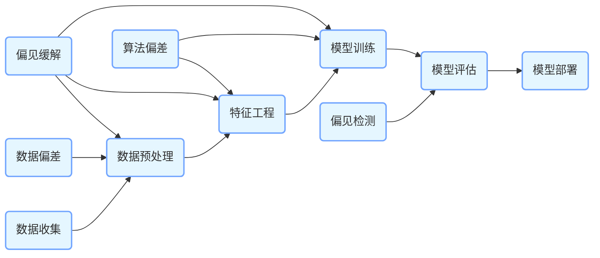

# 负责任的AI系统:偏见检测与缓解策略

> 关键词：负责任的AI、偏见检测、偏见缓解、AI伦理、算法公平性、数据偏差、模型评估

> 摘要：随着人工智能（AI）技术的广泛应用，AI系统中的偏见问题日益凸显，这不仅影响了系统的公正性和可靠性，还可能对社会造成严重的负面影响。本文旨在深入探讨负责任的AI系统中偏见检测与缓解策略。首先介绍了相关背景知识，包括目的范围、预期读者等内容；接着阐述了核心概念及其联系，展示了偏见产生的原理和架构；详细讲解了核心算法原理与具体操作步骤，结合Python源代码进行说明；探讨了相关数学模型和公式并举例；通过项目实战给出代码案例及详细解释；分析了实际应用场景；推荐了相关工具和资源；最后总结了未来发展趋势与挑战，提供常见问题解答和扩展阅读参考资料，旨在为构建更公平、更负责任的AI系统提供全面的技术指导和理论支持。

## 1. 背景介绍 
### 1.1 目的和范围
随着AI在各个领域的深度渗透，如金融、医疗、司法、招聘等，其决策结果对人们的生活和社会产生了越来越大的影响。然而，AI系统并非完全客观中立，它们可能会继承训练数据中的偏见，或者在算法设计过程中引入偏见，从而导致不公平的决策结果。例如，在招聘场景中，AI系统可能因为历史数据中存在的性别或种族偏见，而对某些群体产生不公平的筛选。本文章的目的在于深入研究AI系统中的偏见问题，介绍有效的偏见检测方法和缓解策略，范围涵盖了从数据层面到模型层面的偏见检测与缓解，以及相关的理论、算法和实践应用。

### 1.2 预期读者
本文预期读者包括AI研究人员、数据科学家、机器学习工程师、软件开发者等技术人员，他们可以从文中获取关于偏见检测与缓解的技术细节和实践经验；也包括政策制定者、伦理学家、社会学家等非技术人员，他们可以了解AI偏见问题的本质和影响，为制定相关政策和伦理准则提供参考；同时，对AI伦理和公平性感兴趣的普通读者也可以通过本文初步了解AI偏见的相关知识。

### 1.3 文档结构概述
本文首先介绍背景知识，让读者了解研究的目的、范围、预期读者等信息；接着阐述核心概念与联系，帮助读者理解偏见产生的原理和相关架构；然后详细讲解核心算法原理和具体操作步骤，并结合Python代码进行说明；再探讨相关数学模型和公式，通过举例加深理解；通过项目实战给出实际代码案例和详细解释；分析实际应用场景，展示偏见检测与缓解的重要性；推荐相关工具和资源，为读者提供学习和实践的途径；最后总结未来发展趋势与挑战，提供常见问题解答和扩展阅读参考资料，使读者对整个主题有一个全面而深入的了解。

### 1.4 术语表
#### 1.4.1 核心术语定义
- **负责任的AI**：指在开发、部署和使用AI系统的过程中，充分考虑伦理、法律、社会等因素，确保AI系统的决策和行为是公平、透明、可解释和安全的。
- **AI偏见**：指AI系统在处理数据、做出决策或提供服务时，对某些群体表现出不公正的偏好或歧视。这种偏见可能源于训练数据、算法设计或系统实现等多个方面。
- **偏见检测**：指通过各种技术和方法，识别AI系统中存在的偏见，确定偏见的类型、程度和来源。
- **偏见缓解**：指采取一系列措施，减少或消除AI系统中的偏见，提高系统的公平性和公正性。

#### 1.4.2 相关概念解释
- **数据偏差**：指训练数据集中存在的系统性偏差，可能导致模型学习到不准确或不公平的模式。例如，数据集中某些群体的样本数量过少或特征分布不均衡。
- **算法公平性**：指算法在处理不同群体的数据时，能够保证公平和公正，不会对任何群体产生歧视或偏见。算法公平性的评估通常涉及多个指标和方法。
- **模型可解释性**：指模型的决策过程和结果能够被人类理解和解释。在偏见检测和缓解中，模型可解释性有助于发现偏见的来源和原因。

#### 1.4.3 缩略词列表
- **AI**：Artificial Intelligence，人工智能
- **ML**：Machine Learning，机器学习
- **DL**：Deep Learning，深度学习
- **ROC**：Receiver Operating Characteristic，受试者工作特征曲线
- **AUC**：Area Under the Curve，曲线下面积

## 2. 核心概念与联系 
### 核心概念原理
AI系统中的偏见主要源于两个方面：数据和算法。

#### 数据层面的偏见
训练数据是AI模型学习的基础，如果数据集中存在偏差，模型就可能学习到不准确或不公平的模式。数据偏差的来源有很多，例如：
- **采样偏差**：在数据收集过程中，由于采样方法不合理，导致某些群体的样本数量过少或过多。例如，在医疗数据集中，如果只收集了某一地区或某一特定年龄段的患者数据，那么基于该数据集训练的模型可能对其他地区或年龄段的患者表现不佳。
- **标注偏差**：在数据标注过程中，标注人员的主观因素可能导致标注结果存在偏差。例如，在图像分类任务中，不同的标注人员可能对同一图像的分类存在差异，从而影响模型的学习效果。
- **历史偏差**：训练数据可能反映了历史上存在的社会偏见和歧视。例如，在招聘数据集中，由于历史上存在的性别歧视，女性的职业发展机会可能受到限制，导致数据集中女性在某些职业中的比例较低。如果直接使用这样的数据集训练模型，模型可能会学习到这种性别偏见，从而在招聘决策中对女性产生不公平的筛选。

#### 算法层面的偏见
除了数据偏差，算法设计本身也可能引入偏见。例如：
- **特征选择偏差**：在特征工程过程中，选择的特征可能与敏感属性（如性别、种族等）存在关联，从而导致模型对某些群体产生偏见。例如，在信用评分模型中，如果选择的特征与种族存在关联，那么模型可能会对不同种族的人群产生不公平的评分。
- **模型结构偏差**：某些模型结构可能对某些类型的数据或特征具有更好的适应性，而对其他类型的数据或特征表现不佳。例如，深度神经网络在处理高维数据时可能表现较好，但在处理低维数据时可能会出现过拟合或欠拟合的问题，从而影响模型的公平性。
- **优化目标偏差**：模型的优化目标通常是最小化预测误差，但这种目标可能忽略了公平性的要求。例如，在分类任务中，模型可能会为了提高整体准确率而牺牲某些群体的分类准确率，从而导致不公平的决策结果。

### 架构示意图

该流程图展示了AI系统开发的主要流程，包括数据收集、预处理、特征工程、模型训练、评估和部署。同时，也展示了数据偏差和算法偏差可能引入的环节，以及偏见检测和缓解的作用点。

## 3. 核心算法原理 & 具体操作步骤 
### 偏见检测算法原理
#### 统计方法
统计方法是最常用的偏见检测方法之一，主要通过分析不同群体之间的统计差异来检测偏见。例如，可以计算不同群体在模型预测结果中的比例差异、均值差异等。

以下是一个使用Python实现的简单统计方法示例，用于检测分类模型在不同性别群体中的预测偏差：
```python
import numpy as np

# 模拟数据集
# 0表示男性，1表示女性
gender = np.array([0, 1, 0, 1, 0, 1, 0, 1, 0, 1])
# 模型预测结果，0表示负类，1表示正类
predictions = np.array([0, 1, 0, 1, 0, 1, 0, 1, 0, 1])

# 计算男性和女性的预测正类比例
male_predictions = predictions[gender == 0]
female_predictions = predictions[gender == 1]

male_positive_rate = np.mean(male_predictions)
female_positive_rate = np.mean(female_predictions)

# 计算比例差异
rate_difference = male_positive_rate - female_positive_rate

print(f"男性预测正类比例: {male_positive_rate}")
print(f"女性预测正类比例: {female_positive_rate}")
print(f"比例差异: {rate_difference}")
```
在这个示例中，我们首先模拟了一个包含性别信息和模型预测结果的数据集。然后，我们分别计算了男性和女性的预测正类比例，并计算了两者之间的差异。如果比例差异较大，可能表示模型存在性别偏见。

#### 基于模型的方法
基于模型的方法是通过训练一个辅助模型来检测主模型中的偏见。例如，可以训练一个分类器来预测样本的敏感属性（如性别、种族等），如果主模型的预测结果与敏感属性存在关联，那么就可能存在偏见。

以下是一个使用Python和Scikit-learn库实现的基于模型的偏见检测示例：
```python
from sklearn.linear_model import LogisticRegression
from sklearn.model_selection import train_test_split
import numpy as np

# 模拟数据集
# 特征矩阵
X = np.random.rand(100, 10)
# 敏感属性，0表示男性，1表示女性
sensitive_attribute = np.random.randint(0, 2, 100)
# 模型预测结果，0表示负类，1表示正类
predictions = np.random.randint(0, 2, 100)

# 划分训练集和测试集
X_train, X_test, y_train, y_test = train_test_split(X, predictions, test_size=0.2, random_state=42)

# 训练辅助模型
model = LogisticRegression()
model.fit(X_train, y_train)

# 预测敏感属性
sensitive_predictions = model.predict(X_test)

# 计算预测结果与敏感属性的相关性
correlation = np.corrcoef(sensitive_predictions, sensitive_attribute[len(y_train):])[0, 1]

print(f"预测结果与敏感属性的相关性: {correlation}")
```
在这个示例中，我们首先模拟了一个包含特征矩阵、敏感属性和模型预测结果的数据集。然后，我们将数据集划分为训练集和测试集，并训练了一个逻辑回归模型作为辅助模型。最后，我们使用辅助模型预测敏感属性，并计算预测结果与真实敏感属性之间的相关性。如果相关性较高，可能表示模型存在偏见。

### 偏见缓解算法原理
#### 数据层面的缓解策略
- **数据平衡**：通过过采样或欠采样的方法，调整不同群体的样本数量，使数据集中各个群体的样本分布更加均衡。例如，可以使用SMOTE（Synthetic Minority Over-sampling Technique）算法对少数群体进行过采样，或者随机删除多数群体的样本进行欠采样。
以下是一个使用Python和Imblearn库实现的SMOTE过采样示例：
```python
from imblearn.over_sampling import SMOTE
import numpy as np

# 模拟不平衡数据集
X = np.random.rand(100, 10)
y = np.array([0] * 80 + [1] * 20)

# 应用SMOTE过采样
smote = SMOTE()
X_resampled, y_resampled = smote.fit_resample(X, y)

print(f"原始数据集样本数量: {len(y)}")
print(f"过采样后数据集样本数量: {len(y_resampled)}")
```
- **数据清洗**：去除数据集中的噪声和异常值，减少数据偏差对模型的影响。例如，可以使用统计方法或机器学习算法检测和去除异常值。

#### 模型层面的缓解策略
- **公平约束优化**：在模型训练过程中，加入公平性约束条件，使模型在优化预测误差的同时，满足公平性要求。例如，可以使用公平分类器（Fair Classifier）算法，通过调整模型的参数，使不同群体的预测结果更加公平。
以下是一个使用Python和AIF360库实现的公平分类器示例：
```python
from aif360.datasets import BinaryLabelDataset
from aif360.algorithms.inprocessing import PrejudiceRemover
import numpy as np

# 模拟数据集
X = np.random.rand(100, 10)
y = np.array([0] * 50 + [1] * 50)
sensitive_attribute = np.array([0] * 60 + [1] * 40)

# 创建BinaryLabelDataset对象
dataset = BinaryLabelDataset(favorable_label=1, unfavorable_label=0, df=pd.DataFrame({'X': X.tolist(), 'y': y, 'sensitive_attribute': sensitive_attribute}), label_names=['y'], protected_attribute_names=['sensitive_attribute'])

# 划分训练集和测试集
train_dataset, test_dataset = dataset.split([0.8], shuffle=True)

# 训练公平分类器
prejudice_remover = PrejudiceRemover()
train_dataset_transformed = prejudice_remover.fit_transform(train_dataset)

# 预测
test_dataset_pred = prejudice_remover.predict(test_dataset)

print("公平分类器预测完成")
```
- **模型集成**：通过集成多个不同的模型，减少单个模型的偏见。例如，可以使用Bagging或Boosting算法，训练多个弱分类器，然后将它们的预测结果进行组合。

## 4. 数学模型和公式 & 详细讲解 & 举例说明 
### 统计公平性指标
#### 差异影响率（Disparate Impact Ratio，DIR）
差异影响率是衡量不同群体之间预测结果比例差异的指标，定义为受保护群体（如女性、少数族裔等）的正类预测比例与非受保护群体的正类预测比例之比。数学公式如下：
$$DIR = \frac{P(\hat{Y}=1|S = 1)}{P(\hat{Y}=1|S = 0)}$$
其中，$\hat{Y}$ 表示模型的预测结果，$S$ 表示敏感属性（$S = 0$ 表示非受保护群体，$S = 1$ 表示受保护群体）。

如果 $DIR$ 的值接近1，表示模型在不同群体之间的预测结果比较公平；如果 $DIR$ 的值远小于1，表示模型对受保护群体存在歧视；如果 $DIR$ 的值远大于1，表示模型对受保护群体存在偏好。

例如，假设在一个招聘场景中，男性的正类预测比例（被录用的比例）为0.8，女性的正类预测比例为0.4，则差异影响率为：
$$DIR = \frac{0.4}{0.8} = 0.5$$
这表明模型对女性存在一定程度的歧视。

#### 平均 odds difference
平均赔率差异是衡量不同群体之间预测结果的真正率（True Positive Rate，TPR）和假正率（False Positive Rate，FPR）差异的指标，定义为受保护群体和非受保护群体的真正率和假正率的平均差异。数学公式如下：
$$AOD = \frac{1}{2}[(TPR_1 - TPR_0)+(FPR_1 - FPR_0)]$$
其中，$TPR_i$ 和 $FPR_i$ 分别表示第 $i$ 个群体（$i = 0$ 表示非受保护群体，$i = 1$ 表示受保护群体）的真正率和假正率。

如果 $AOD$ 的值接近0，表示模型在不同群体之间的预测结果比较公平；如果 $AOD$ 的值偏离0较大，表示模型存在偏见。

### 公平约束优化模型
#### 带公平约束的逻辑回归模型
在逻辑回归模型中，可以加入公平性约束条件，使模型在优化对数损失函数的同时，满足公平性要求。具体来说，可以在目标函数中加入一个惩罚项，惩罚模型在不同群体之间的预测差异。数学公式如下：
$$\min_{\mathbf{w}} L(\mathbf{w})+\lambda \cdot \text{Fairness Penalty}$$
其中，$L(\mathbf{w})$ 是逻辑回归的对数损失函数，$\mathbf{w}$ 是模型的参数，$\lambda$ 是惩罚系数，$\text{Fairness Penalty}$ 是公平性惩罚项，可以是差异影响率或平均赔率差异的函数。

例如，假设公平性惩罚项定义为差异影响率的平方误差：
$$\text{Fairness Penalty}=(DIR - 1)^2$$
则带公平约束的逻辑回归模型的目标函数为：
$$\min_{\mathbf{w}} L(\mathbf{w})+\lambda \cdot (DIR - 1)^2$$
通过调整惩罚系数 $\lambda$ 的值，可以控制模型在预测误差和公平性之间的权衡。

## 5. 项目实战：代码实际案例和详细解释说明 
### 5.1  开发环境搭建
#### 安装Python
首先，确保你已经安装了Python 3.x版本。可以从Python官方网站（https://www.python.org/downloads/） 下载并安装适合你操作系统的Python版本。

#### 安装必要的库
使用pip命令安装以下必要的库：
```bash
pip install numpy pandas scikit-learn imblearn aif360
```
- `numpy`：用于数值计算和数组操作。
- `pandas`：用于数据处理和分析。
- `scikit-learn`：用于机器学习算法的实现和模型评估。
- `imblearn`：用于处理不平衡数据集。
- `aif360`：用于AI公平性分析和算法实现。

### 5.2  源代码详细实现和代码解读
以下是一个完整的项目实战代码示例，用于检测和缓解一个简单分类模型中的性别偏见：
```python
import numpy as np
import pandas as pd
from sklearn.linear_model import LogisticRegression
from sklearn.model_selection import train_test_split
from imblearn.over_sampling import SMOTE
from aif360.datasets import BinaryLabelDataset
from aif360.algorithms.inprocessing import PrejudiceRemover
from aif360.metrics import BinaryLabelDatasetMetric

# 模拟数据集
np.random.seed(42)
n_samples = 1000
# 特征矩阵
X = np.random.rand(n_samples, 10)
# 敏感属性，0表示男性，1表示女性
sensitive_attribute = np.random.randint(0, 2, n_samples)
# 真实标签
y_true = np.random.randint(0, 2, n_samples)

# 引入性别偏见，女性的正类比例较低
y_biased = y_true.copy()
female_indices = np.where(sensitive_attribute == 1)[0]
male_indices = np.where(sensitive_attribute == 0)[0]
y_biased[female_indices] = np.random.binomial(1, 0.3, len(female_indices))
y_biased[male_indices] = np.random.binomial(1, 0.7, len(male_indices))

# 划分训练集和测试集
X_train, X_test, y_train, y_test, sensitive_train, sensitive_test = train_test_split(X, y_biased, sensitive_attribute, test_size=0.2, random_state=42)

# 训练有偏见的模型
biased_model = LogisticRegression()
biased_model.fit(X_train, y_train)
y_pred_biased = biased_model.predict(X_test)

# 数据层面的缓解：SMOTE过采样
smote = SMOTE()
X_train_resampled, y_train_resampled = smote.fit_resample(X_train, y_train)
resampled_model = LogisticRegression()
resampled_model.fit(X_train_resampled, y_train_resampled)
y_pred_resampled = resampled_model.predict(X_test)

# 模型层面的缓解：公平分类器
dataset = BinaryLabelDataset(favorable_label=1, unfavorable_label=0, df=pd.DataFrame({'X': X.tolist(), 'y': y_biased, 'sensitive_attribute': sensitive_attribute}), label_names=['y'], protected_attribute_names=['sensitive_attribute'])
train_dataset, test_dataset = dataset.split([0.8], shuffle=True)
prejudice_remover = PrejudiceRemover()
train_dataset_transformed = prejudice_remover.fit_transform(train_dataset)
test_dataset_pred = prejudice_remover.predict(test_dataset)
y_pred_fair = test_dataset_pred.labels.flatten()

# 评估模型公平性
def evaluate_fairness(y_pred, sensitive):
    dataset_pred = BinaryLabelDataset(favorable_label=1, unfavorable_label=0, df=pd.DataFrame({'y': y_pred, 'sensitive_attribute': sensitive}), label_names=['y'], protected_attribute_names=['sensitive_attribute'])
    metric = BinaryLabelDatasetMetric(dataset_pred, unprivileged_groups=[{'sensitive_attribute': 1}], privileged_groups=[{'sensitive_attribute': 0}])
    dir_ratio = metric.disparate_impact()
    aod = metric.average_odds_difference()
    return dir_ratio, aod

# 评估有偏见的模型
dir_ratio_biased, aod_biased = evaluate_fairness(y_pred_biased, sensitive_test)
print(f"有偏见的模型 - 差异影响率: {dir_ratio_biased}, 平均赔率差异: {aod_biased}")

# 评估数据层面缓解后的模型
dir_ratio_resampled, aod_resampled = evaluate_fairness(y_pred_resampled, sensitive_test)
print(f"数据层面缓解后的模型 - 差异影响率: {dir_ratio_resampled}, 平均赔率差异: {aod_resampled}")

# 评估模型层面缓解后的模型
dir_ratio_fair, aod_fair = evaluate_fairness(y_pred_fair, sensitive_test)
print(f"模型层面缓解后的模型 - 差异影响率: {dir_ratio_fair}, 平均赔率差异: {aod_fair}")
```
### 5.3  代码解读与分析
1. **数据生成**：首先，我们使用`numpy`库生成了一个包含1000个样本的模拟数据集，包括特征矩阵`X`、敏感属性`sensitive_attribute`和真实标签`y_true`。然后，我们引入了性别偏见，使女性的正类比例较低。
2. **数据划分**：使用`train_test_split`函数将数据集划分为训练集和测试集。
3. **训练有偏见的模型**：使用逻辑回归模型训练一个有偏见的模型，并进行预测。
4. **数据层面的缓解**：使用`SMOTE`算法对训练集进行过采样，然后训练一个新的模型并进行预测。
5. **模型层面的缓解**：使用`aif360`库中的`PrejudiceRemover`算法训练一个公平分类器，并进行预测。
6. **模型公平性评估**：定义了一个`evaluate_fairness`函数，使用`BinaryLabelDatasetMetric`类计算差异影响率和平均赔率差异，评估不同模型的公平性。

通过比较不同模型的差异影响率和平均赔率差异，我们可以看到数据层面和模型层面的缓解策略对减少模型偏见的效果。

## 6. 实际应用场景 
### 金融领域
在金融领域，AI系统被广泛应用于信用评分、贷款审批、保险定价等决策过程中。然而，如果这些系统存在偏见，可能会对某些群体（如女性、少数族裔等）造成不公平的待遇。例如，在信用评分模型中，如果模型基于历史数据中的偏见，对某些群体的信用评分较低，可能会导致这些群体难以获得贷款或信用卡，从而限制了他们的经济机会。

为了避免这种情况，金融机构可以使用偏见检测和缓解策略，对信用评分模型进行评估和改进。例如，可以检测模型在不同性别、种族群体中的预测差异，然后通过数据平衡、公平约束优化等方法，减少模型的偏见，提高模型的公平性。

### 医疗领域
在医疗领域，AI系统被用于疾病诊断、治疗方案推荐、医疗资源分配等方面。然而，医疗数据可能存在偏差，例如不同地区、不同种族的患者数据分布不均衡，或者标注数据存在主观偏见。如果基于这样的数据训练的AI模型存在偏见，可能会导致某些群体的疾病诊断不准确、治疗方案不合理，从而影响他们的健康状况。

为了确保医疗AI系统的公平性，医疗机构可以在数据收集、预处理和模型训练过程中，采用偏见检测和缓解策略。例如，可以对医疗数据进行清洗和平衡，去除数据中的噪声和偏差；在模型训练过程中，加入公平性约束条件，使模型在不同群体之间的预测结果更加公平。

### 司法领域
在司法领域，AI系统被用于犯罪预测、量刑建议等决策过程中。然而，如果这些系统存在偏见，可能会对某些群体（如少数族裔、低收入群体等）造成不公平的待遇。例如，在犯罪预测模型中，如果模型基于历史数据中的偏见，对某些群体的犯罪风险评估过高，可能会导致这些群体受到过度的监视和惩罚。

为了确保司法AI系统的公平性，司法机构可以在模型开发和应用过程中，采用偏见检测和缓解策略。例如，可以对犯罪预测模型进行评估，检测模型在不同群体中的预测差异；然后通过数据清洗、模型优化等方法，减少模型的偏见，提高模型的公平性。

### 招聘领域
在招聘领域，AI系统被用于简历筛选、面试评估等环节。然而，如果这些系统存在偏见，可能会对某些群体（如女性、少数族裔等）造成不公平的待遇。例如，在简历筛选模型中，如果模型基于历史数据中的偏见，对某些群体的简历评分较低，可能会导致这些群体失去面试机会，从而影响他们的职业发展。

为了确保招聘AI系统的公平性，企业可以在模型开发和应用过程中，采用偏见检测和缓解策略。例如，可以对简历筛选模型进行评估，检测模型在不同群体中的预测差异；然后通过数据平衡、公平约束优化等方法，减少模型的偏见，提高模型的公平性。

## 7. 工具和资源推荐
### 7.1 学习资源推荐
#### 7.1.1 书籍推荐
- 《Artificial Intelligence: A Modern Approach》（《人工智能：一种现代的方法》）：这本书是人工智能领域的经典教材，涵盖了人工智能的各个方面，包括机器学习、自然语言处理、计算机视觉等。书中也有关于AI伦理和公平性的相关内容。
- 《Fairness, Accountability, and Transparency in Machine Learning》（《机器学习中的公平性、问责制和透明度》）：这本书专门探讨了机器学习中的公平性、问责制和透明度问题，介绍了各种偏见检测和缓解方法。
- 《Data Science for Social Good: Using Data and Analytics to Drive Social Impact》（《数据科学促进社会公益：使用数据和分析推动社会影响》）：这本书介绍了如何使用数据科学方法解决社会问题，包括如何避免数据科学模型中的偏见。

#### 7.1.2 在线课程
- Coursera上的“AI for Everyone”（《人人都能学的人工智能》）：这门课程由吴恩达教授授课，适合零基础的学习者。课程介绍了人工智能的基本概念和应用，也涉及了AI伦理和公平性的相关内容。
- edX上的“Fairness in Machine Learning”（《机器学习中的公平性》）：这门课程专门介绍了机器学习中的公平性问题，包括偏见的来源、检测方法和缓解策略。
- Udemy上的“Data Science and Machine Learning Bootcamp with R and Python”（《使用R和Python进行数据科学和机器学习训练营》）：这门课程涵盖了数据科学和机器学习的各个方面，包括数据处理、模型训练、评估和优化，也有关于AI公平性的相关内容。

#### 7.1.3 技术博客和网站
- Towards Data Science（https://towardsdatascience.com/）：这是一个数据科学和机器学习领域的技术博客平台，有很多关于AI伦理和公平性的文章。
- AI Now Institute（https://ainowinstitute.org/）：这是一个专注于AI伦理和社会影响的研究机构，其网站上有很多关于AI偏见、公平性和透明度的研究报告和文章。
- FAT* Conference（https://facctconference.org/）：这是一个关于算法公平性、问责制和透明度的学术会议，其网站上有很多关于AI公平性的最新研究成果和论文。

### 7.2 开发工具框架推荐
#### 7.2.1 IDE和编辑器
- PyCharm：这是一个专门为Python开发设计的集成开发环境（IDE），具有代码编辑、调试、版本控制等功能，适合开发AI和机器学习项目。
- Jupyter Notebook：这是一个交互式的开发环境，支持Python、R等多种编程语言。它可以方便地进行数据探索、模型训练和可视化，适合进行数据分析和机器学习实验。
- Visual Studio Code：这是一个轻量级的代码编辑器，支持多种编程语言和插件。它可以通过安装Python扩展来进行Python开发，也可以用于开发AI和机器学习项目。

#### 7.2.2 调试和性能分析工具
- TensorBoard：这是TensorFlow框架自带的一个可视化工具，可以用于可视化模型的训练过程、性能指标、计算图等。通过TensorBoard，可以方便地进行模型调试和性能分析。
- PyTorch Profiler：这是PyTorch框架自带的一个性能分析工具，可以用于分析模型的运行时间、内存使用情况等。通过PyTorch Profiler，可以找出模型中的性能瓶颈，进行优化。
- Scikit-learn的`cross_val_score`和`GridSearchCV`：这是Scikit-learn库中的两个工具，用于模型评估和超参数调优。通过`cross_val_score`可以进行交叉验证，评估模型的性能；通过`GridSearchCV`可以进行网格搜索，找出最优的超参数组合。

#### 7.2.3 相关框架和库
- AIF360：这是一个专门用于AI公平性分析和算法实现的Python库，提供了各种偏见检测和缓解算法，如差异影响率计算、公平分类器等。
- Fairlearn：这是一个由微软开发的Python库，用于在机器学习模型中检测和缓解偏见。它提供了各种公平性指标和算法，如群体公平性、个体公平性等。
- Imblearn：这是一个用于处理不平衡数据集的Python库，提供了各种过采样、欠采样和集成方法，如SMOTE、ADASYN等。

### 7.3 相关论文著作推荐
#### 7.3.1 经典论文
- “Machine Bias”（《机器偏见》）：这篇论文通过对美国刑事司法系统中使用的犯罪预测算法的研究，揭示了AI系统中存在的偏见问题及其对社会的影响。
- “Fairness in Machine Learning: A Tutorial”（《机器学习中的公平性：教程》）：这篇论文系统地介绍了机器学习中的公平性问题，包括偏见的定义、检测方法和缓解策略。
- “On the Measure of Intelligence”（《论智能的度量》）：这篇论文探讨了智能的本质和度量方法，也涉及了AI伦理和公平性的相关内容。

#### 7.3.2 最新研究成果
- 每年的FAT* Conference（算法公平性、问责制和透明度会议）上都会有很多关于AI公平性的最新研究成果发表，可以关注会议的论文集。
- arXiv（https://arxiv.org/） 是一个预印本平台，上面有很多关于AI伦理和公平性的最新研究论文。

#### 7.3.3 应用案例分析
- 许多科技公司和研究机构会发布关于AI公平性的应用案例分析报告，如谷歌、微软、IBM等公司的官方博客和研究报告。
- 一些行业报告和研究机构的研究报告也会包含AI公平性的应用案例分析，如麦肯锡、波士顿咨询集团等机构的报告。

## 8. 总结：未来发展趋势与挑战
### 未来发展趋势
#### 多学科融合
未来，负责任的AI系统的研究和发展将越来越多地涉及多学科的融合，包括计算机科学、数学、统计学、伦理学、社会学等。通过跨学科的研究，可以更全面地理解AI偏见的本质和影响，开发出更有效的偏见检测和缓解策略。

#### 标准化和规范化
随着AI技术的广泛应用，对AI系统的公平性和伦理问题的关注度也越来越高。未来，可能会出现更多的标准化和规范化的方法和工具，用于评估和确保AI系统的公平性。例如，制定统一的公平性指标和评估标准，开发通用的偏见检测和缓解工具等。

#### 可解释性和透明度
可解释性和透明度是负责任的AI系统的重要特征。未来，AI模型将越来越注重可解释性和透明度，以便用户和监管者能够理解模型的决策过程和结果，发现和纠正其中的偏见。例如，开发可解释的机器学习模型、提供模型的决策依据和解释等。

#### 强化学习和自适应系统
强化学习和自适应系统在AI领域的应用越来越广泛。未来，这些技术可能会被用于开发更智能、更公平的AI系统。例如，通过强化学习算法，使AI系统能够自动调整自己的行为，以满足公平性的要求；通过自适应系统，使AI系统能够根据不同的环境和数据，动态地调整自己的偏见检测和缓解策略。

### 挑战
#### 数据隐私和安全
在进行偏见检测和缓解时，需要使用大量的数据，包括敏感数据（如性别、种族等）。这可能会涉及到数据隐私和安全问题。如何在保护数据隐私和安全的前提下，有效地进行偏见检测和缓解，是一个亟待解决的问题。

#### 复杂的社会和文化因素
AI偏见的产生往往与复杂的社会和文化因素有关。不同的社会和文化背景可能对公平性的定义和理解存在差异。如何在考虑这些复杂因素的前提下，开发出具有普遍适用性的偏见检测和缓解策略，是一个挑战。

#### 技术的局限性
目前，虽然已经有很多偏见检测和缓解方法，但这些方法仍然存在一定的局限性。例如，一些方法可能只适用于特定类型的数据集或模型，或者在处理高维数据时效果不佳。如何进一步提高偏见检测和缓解技术的有效性和通用性，是一个需要不断探索的问题。

#### 伦理和法律问题
AI偏见的存在不仅会影响系统的公平性和可靠性，还可能涉及到伦理和法律问题。例如，在某些情况下，AI系统的偏见可能会被视为歧视行为，从而引发法律诉讼。如何在开发和应用AI系统的过程中，遵守伦理和法律准则，避免偏见带来的负面影响，是一个重要的挑战。

## 9. 附录：常见问题与解答
### 问题1：如何判断一个AI系统是否存在偏见？
答：可以使用多种方法来判断一个AI系统是否存在偏见。常见的方法包括统计方法、基于模型的方法等。统计方法主要通过分析不同群体之间的统计差异来检测偏见，如计算不同群体在模型预测结果中的比例差异、均值差异等；基于模型的方法是通过训练一个辅助模型来检测主模型中的偏见，如训练一个分类器来预测样本的敏感属性，如果主模型的预测结果与敏感属性存在关联，那么就可能存在偏见。

### 问题2：偏见检测和缓解策略是否会影响模型的性能？
答：偏见检测和缓解策略可能会对模型的性能产生一定的影响。在某些情况下，为了提高模型的公平性，可能需要牺牲一定的预测准确率。例如，在数据层面的缓解策略中，过采样或欠采样可能会导致数据分布发生变化，从而影响模型的学习效果；在模型层面的缓解策略中，加入公平性约束条件可能会限制模型的优化空间，从而降低模型的预测准确率。然而，通过合理选择偏见检测和缓解策略，并进行适当的参数调整，可以在保证模型公平性的前提下，尽量减少对模型性能的影响。

### 问题3：如何选择合适的偏见检测和缓解策略？
答：选择合适的偏见检测和缓解策略需要考虑多个因素，包括数据集的特点、模型的类型、应用场景等。例如，如果数据集存在严重的不平衡问题，可以选择数据层面的缓解策略，如过采样或欠采样；如果模型的预测结果与敏感属性存在较强的关联，可以选择模型层面的缓解策略，如公平约束优化或模型集成。此外，还可以根据具体的应用场景和公平性要求，选择合适的公平性指标和评估方法，对不同的偏见检测和缓解策略进行比较和评估，选择最优的策略。

### 问题4：偏见检测和缓解策略是否适用于所有类型的AI系统？
答：偏见检测和缓解策略并不适用于所有类型的AI系统。不同类型的AI系统可能具有不同的特点和应用场景，需要采用不同的偏见检测和缓解方法。例如，对于基于规则的AI系统，可以通过检查规则的合理性和公平性来检测和缓解偏见；对于基于机器学习的AI系统，可以采用本文中介绍的统计方法、基于模型的方法等进行偏见检测和缓解。此外，一些复杂的AI系统，如深度学习模型，可能需要更复杂的偏见检测和缓解策略。

### 问题5：如何确保偏见检测和缓解策略的有效性和可靠性？
答：为了确保偏见检测和缓解策略的有效性和可靠性，需要进行充分的实验和评估。可以使用交叉验证、留一法等方法对模型进行评估，比较不同偏见检测和缓解策略的效果；可以使用多种公平性指标和评估方法，对模型的公平性进行综合评估；可以在不同的数据集和应用场景中进行实验，验证偏见检测和缓解策略的通用性和适应性。此外，还可以采用同行评审、公开透明等方法，确保偏见检测和缓解策略的科学性和可靠性。

## 10. 扩展阅读 & 参考资料
### 扩展阅读
- 《AI Superpowers: China, Silicon Valley, and the New World Order》（《AI超级大国：中国、硅谷与新世界秩序》）：这本书探讨了AI技术的发展对全球政治、经济和社会的影响，也涉及了AI伦理和公平性的相关内容。
- 《The Age of Surveillance Capitalism: The Fight for a Human Future at the New Frontier of Power》（《监控资本主义时代：在权力新前沿为人类未来而战》）：这本书揭示了数据资本主义时代的监控和隐私问题，也对AI系统中的偏见和不公平现象进行了分析。
- 《Weapons of Math Destruction: How Big Data Increases Inequality and Threatens Democracy》（《数学毁灭武器：大数据如何加剧不平等并威胁民主》）：这本书通过具体案例，揭示了大数据和AI系统中存在的偏见和不公平问题，以及这些问题对社会的影响。

### 参考资料
- 《Artificial Intelligence and Machine Learning for Business: A Practical Guide to Implementing AI in Your Organization》（《商业中的人工智能和机器学习：在组织中实施AI的实用指南》）
- 《Machine Learning: A Probabilistic Perspective》（《机器学习：概率视角》）
- 《Deep Learning》（《深度学习》）
- 相关学术期刊和会议论文，如Journal of Artificial Intelligence Research（JAIR）、Neural Information Processing Systems（NeurIPS）、International Joint Conference on Artificial Intelligence（IJCAI）等。
- 相关技术报告和白皮书，如OpenAI的技术报告、谷歌的AI伦理报告等。