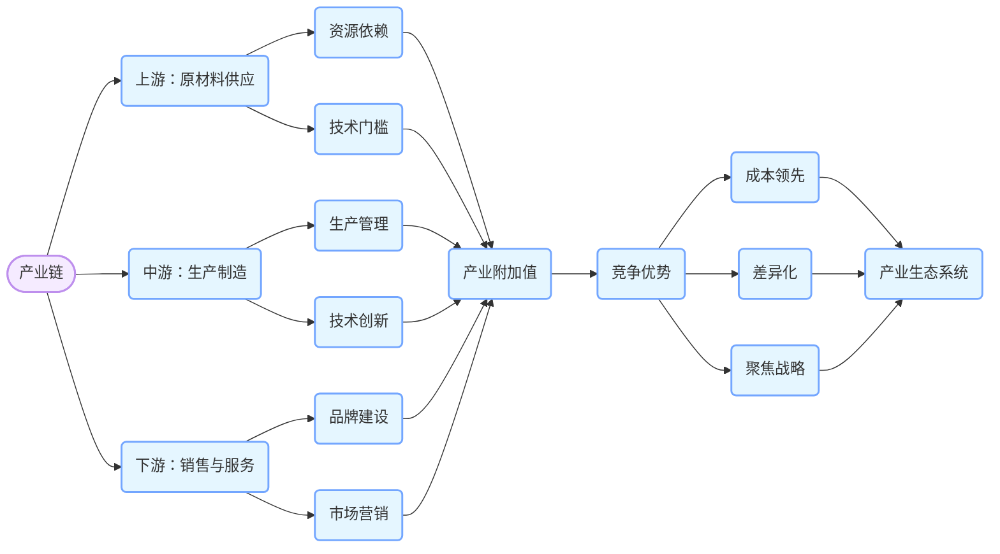

# 费雪的产业链分析方法

> 关键词：费雪、产业链分析方法、产业结构、企业价值、竞争优势、投资决策、行业趋势

> 摘要：本文深入探讨了费雪的产业链分析方法。从背景介绍入手，明确该方法的目的、适用读者及文档结构等内容。接着详细阐述核心概念与联系，包括其原理和架构，并通过 Mermaid 流程图呈现清晰的逻辑关系。对核心算法原理及具体操作步骤进行剖析，结合 Python 源代码进行说明。同时给出相关数学模型和公式，并举例讲解。通过项目实战，展示代码实际案例并详细解读。探讨该方法的实际应用场景，推荐相关工具和资源，涵盖学习资源、开发工具框架以及论文著作等。最后总结其未来发展趋势与挑战，解答常见问题并提供扩展阅读与参考资料，旨在帮助读者全面深入理解费雪的产业链分析方法，为产业研究和投资决策等提供有力的理论和实践支持。

## 1. 背景介绍 
### 1.1 目的和范围
费雪的产业链分析方法旨在为投资者、企业管理者以及产业研究人员提供一套全面且深入的分析工具，以更好地理解产业链的结构、动态和价值创造过程。该方法的范围涵盖了从产业链上游的原材料供应，到中游的生产制造，再到下游的销售与服务等各个环节。通过对产业链的整体分析，可以识别出产业链中的关键环节、竞争优势来源以及潜在的投资机会和风险，帮助相关人员做出更明智的决策。

### 1.2 预期读者
本文的预期读者主要包括以下几类人群：
1. **投资者**：希望通过对产业链的分析，找到具有投资价值的企业和行业，提高投资回报率，降低投资风险。
2. **企业管理者**：有助于企业管理者了解自身在产业链中的位置和竞争态势，制定合理的战略规划，提升企业的竞争力和市场地位。
3. **产业研究人员**：为产业研究人员提供一种系统的分析方法，深入研究产业的发展规律、趋势和影响因素，为产业政策的制定和产业发展的引导提供依据。
4. **金融分析师**：帮助金融分析师更准确地评估企业的价值和前景，为投资建议和评级提供更可靠的依据。

### 1.3 文档结构概述
本文将按照以下结构进行阐述：
1. **背景介绍**：介绍费雪产业链分析方法的目的、预期读者和文档结构概述，以及相关术语的定义和解释。
2. **核心概念与联系**：详细阐述费雪产业链分析方法的核心概念，包括产业链的定义、结构、价值创造等，以及各概念之间的联系，并通过文本示意图和 Mermaid 流程图进行展示。
3. **核心算法原理 & 具体操作步骤**：讲解费雪产业链分析方法的核心算法原理，结合 Python 源代码详细说明具体的操作步骤。
4. **数学模型和公式 & 详细讲解 & 举例说明**：给出费雪产业链分析方法中涉及的数学模型和公式，进行详细讲解，并通过实际例子进行说明。
5. **项目实战：代码实际案例和详细解释说明**：通过一个实际的项目案例，展示费雪产业链分析方法的具体应用，包括开发环境搭建、源代码实现和代码解读。
6. **实际应用场景**：探讨费雪产业链分析方法在不同领域的实际应用场景，如投资决策、企业战略规划、产业政策制定等。
7. **工具和资源推荐**：推荐与费雪产业链分析方法相关的学习资源、开发工具框架和论文著作，帮助读者进一步深入学习和应用该方法。
8. **总结：未来发展趋势与挑战**：总结费雪产业链分析方法的发展现状，探讨其未来的发展趋势和面临的挑战。
9. **附录：常见问题与解答**：解答读者在学习和应用费雪产业链分析方法过程中常见的问题。
10. **扩展阅读 & 参考资料**：提供相关的扩展阅读材料和参考资料，方便读者进一步研究和学习。

### 1.4 术语表
#### 1.4.1 核心术语定义
1. **产业链**：产业链是指在一种最终产品的生产加工过程中，从最初的自然资源到最终产品到达消费者手中所包含的各个环节所构成的整个链条。它包括原材料的采集、生产、加工、运输、销售等一系列环节，涉及多个企业和产业部门。
2. **产业附加值**：产业附加值是指在产业链的某个环节中，通过企业的生产经营活动所增加的价值。它是企业利润的来源，也是衡量企业竞争力和产业发展水平的重要指标。
3. **竞争优势**：竞争优势是指企业在市场竞争中相对于其他企业所具有的优势地位，表现为成本优势、差异化优势、技术优势等。竞争优势是企业在产业链中获取更高附加值的关键。
4. **产业生态系统**：产业生态系统是指由产业链上的各个企业、相关的供应商、客户、政府机构、科研机构等组成的一个相互依存、相互作用的生态系统。它强调产业链中各主体之间的协同合作和共同发展。

#### 1.4.2 相关概念解释
1. **垂直一体化**：垂直一体化是指企业在产业链中向上游或下游延伸，参与到产业链的多个环节中。它可以分为前向一体化和后向一体化，前向一体化是指企业向产业链的下游延伸，如生产企业涉足销售环节；后向一体化是指企业向产业链的上游延伸，如制造企业进入原材料生产领域。
2. **横向一体化**：横向一体化是指企业通过并购、联盟等方式，与同行业的其他企业进行整合，扩大企业的规模和市场份额。横向一体化可以实现资源共享、优势互补，提高企业的竞争力。
3. **微笑曲线**：微笑曲线是指产业链中附加值分布的一种形态，它呈现出两端高、中间低的特征。产业链的上游研发和下游品牌营销环节附加值较高，而中游的生产制造环节附加值较低。

#### 1.4.3 缩略词列表
1. **ROE**：Return on Equity，净资产收益率，反映企业运用自有资本的效率。
2. **EPS**：Earnings Per Share，每股收益，衡量企业盈利能力的重要指标。
3. **PE**：Price - Earnings Ratio，市盈率，用于评估股票的估值水平。

## 2. 核心概念与联系 

### 核心概念原理
费雪的产业链分析方法基于对产业链的全面理解和深入研究。产业链是一个复杂的系统，其中每个环节都相互关联、相互影响。其核心原理在于通过对产业链各环节的分析，找出影响产业附加值和企业竞争优势的关键因素。

从产业链的结构来看，它可以分为上游、中游和下游三个主要部分。上游主要是原材料的供应环节，其特点是资源依赖性强，技术门槛相对较高，对整个产业链的稳定性起着关键作用。中游是生产制造环节，涉及产品的加工和组装，需要具备高效的生产管理和技术创新能力。下游是销售和服务环节，直接面向消费者，品牌建设和市场营销能力至关重要。

产业附加值的创造是产业链分析的核心目标之一。附加值的高低取决于企业在产业链中所处的位置和所具备的竞争优势。在产业链的不同环节，附加值的分布是不均衡的。一般来说，具有核心技术、品牌优势和高附加值服务的环节能够获得更高的利润。

竞争优势是企业在产业链中立足的关键。企业可以通过成本领先、差异化和聚焦战略等方式来构建自己的竞争优势。成本领先战略通过降低生产成本，提高生产效率，使企业在价格上具有竞争力；差异化战略则通过提供独特的产品或服务，满足消费者的个性化需求，从而获得更高的附加值；聚焦战略则是将企业的资源集中在特定的细分市场，提高市场份额和竞争力。

### 架构的文本示意图
```plaintext
            +----------------------+
            |       产业链        |
            +----------------------+
            |  上游：原材料供应  |
            |  中游：生产制造    |
            |  下游：销售与服务  |
            +----------------------+
            |  产业附加值        |
            |  竞争优势          |
            |  产业生态系统      |
            +----------------------+
```

### Mermaid 流程图


## 3. 核心算法原理 & 具体操作步骤 

### 核心算法原理
费雪的产业链分析方法主要基于对产业链各环节数据的收集、整理和分析。其核心算法原理在于通过量化的指标来评估产业链中各企业的竞争力和产业附加值。常用的指标包括财务指标（如 ROE、EPS、PE 等）、市场份额、技术创新能力等。

通过对这些指标的分析，可以构建一个综合的评估模型，从而对产业链中的企业进行排名和分类。例如，可以根据企业的 ROE 水平来评估其盈利能力，根据市场份额来评估其市场竞争力，根据技术创新能力来评估其未来发展潜力。

### 具体操作步骤及 Python 源代码
#### 步骤 1：数据收集
首先需要收集产业链中各企业的相关数据，包括财务数据、市场数据、技术数据等。可以通过公开的财务报表、行业报告、新闻资讯等渠道获取数据。以下是一个简单的 Python 代码示例，用于从网络上获取企业的财务数据：

```python
import requests
import pandas as pd

def get_financial_data(ticker):
    url = f"https://api.example.com/financial_data?ticker={ticker}"
    response = requests.get(url)
    if response.status_code == 200:
        data = response.json()
        df = pd.DataFrame(data)
        return df
    else:
        print(f"Failed to get data for {ticker}")
        return None

# 示例：获取某企业的财务数据
ticker = "AAPL"
financial_data = get_financial_data(ticker)
if financial_data is not None:
    print(financial_data.head())
```

#### 步骤 2：数据清洗和预处理
收集到的数据可能存在缺失值、异常值等问题，需要进行清洗和预处理。以下是一个简单的数据清洗和预处理的 Python 代码示例：

```python
import numpy as np

def clean_and_preprocess_data(df):
    # 处理缺失值
    df = df.fillna(method='ffill')  # 向前填充缺失值
    # 处理异常值
    for column in df.columns:
        if df[column].dtype == np.number:
            q1 = df[column].quantile(0.25)
            q3 = df[column].quantile(0.75)
            iqr = q3 - q1
            lower_bound = q1 - 1.5 * iqr
            upper_bound = q3 + 1.5 * iqr
            df[column] = df[column].clip(lower_bound, upper_bound)
    return df

if financial_data is not None:
    cleaned_data = clean_and_preprocess_data(financial_data)
    print(cleaned_data.head())
```

#### 步骤 3：指标计算
根据清洗和预处理后的数据，计算相关的评估指标。以下是一个计算 ROE 和 EPS 的 Python 代码示例：

```python
def calculate_roe_and_eps(df):
    df['ROE'] = df['Net Income'] / df['Shareholders Equity']
    df['EPS'] = df['Net Income'] / df['Shares Outstanding']
    return df

if financial_data is not None:
    data_with_metrics = calculate_roe_and_eps(cleaned_data)
    print(data_with_metrics[['ROE', 'EPS']].head())
```

#### 步骤 4：综合评估
根据计算得到的指标，构建综合评估模型，对产业链中的企业进行排名和分类。以下是一个简单的综合评估的 Python 代码示例：

```python
def comprehensive_evaluation(df):
    df['Score'] = df['ROE'] * 0.5 + df['EPS'] * 0.3  # 简单加权平均
    df = df.sort_values(by='Score', ascending=False)
    df['Rank'] = range(1, len(df) + 1)
    return df

if financial_data is not None:
    evaluated_data = comprehensive_evaluation(data_with_metrics)
    print(evaluated_data[['Score', 'Rank']].head())
```

## 4. 数学模型和公式 & 详细讲解 & 举例说明 

### 数学模型和公式
#### 1. 净资产收益率（ROE）
净资产收益率是衡量企业盈利能力的重要指标，其计算公式为：
$$ROE = \frac{Net\ Income}{Shareholders\ Equity}$$
其中，$Net\ Income$ 表示净利润，$Shareholders\ Equity$ 表示股东权益。

#### 2. 每股收益（EPS）
每股收益是衡量企业每股盈利水平的指标，其计算公式为：
$$EPS = \frac{Net\ Income}{Shares\ Outstanding}$$
其中，$Net\ Income$ 表示净利润，$Shares\ Outstanding$ 表示发行在外的普通股股数。

#### 3. 市盈率（PE）
市盈率是评估股票估值水平的指标，其计算公式为：
$$PE = \frac{Stock\ Price}{EPS}$$
其中，$Stock\ Price$ 表示股票价格，$EPS$ 表示每股收益。

#### 4. 综合评估得分
综合评估得分是对企业竞争力的综合评价，其计算公式可以采用加权平均的方法：
$$Score = w_1 \times ROE + w_2 \times EPS + w_3 \times Market\ Share + \cdots$$
其中，$w_1, w_2, w_3, \cdots$ 表示各指标的权重，且 $\sum_{i} w_i = 1$。

### 详细讲解
#### ROE
ROE 反映了企业运用自有资本的效率。ROE 越高，说明企业利用股东权益创造利润的能力越强。例如，一家企业的净利润为 1000 万元，股东权益为 5000 万元，则其 ROE 为：
$$ROE = \frac{1000}{5000} = 0.2 = 20\%$$
这意味着该企业每 1 元的股东权益可以创造 0.2 元的净利润。

#### EPS
EPS 反映了企业每股的盈利水平。EPS 越高，说明企业每股股票的盈利能力越强。例如，一家企业的净利润为 1000 万元，发行在外的普通股股数为 500 万股，则其 EPS 为：
$$EPS = \frac{1000}{500} = 2$$
这意味着该企业每股股票的盈利为 2 元。

#### PE
PE 反映了市场对企业股票的估值水平。PE 越高，说明市场对企业的未来发展前景越看好，但也可能意味着股票价格被高估。例如，一家企业的股票价格为 20 元，EPS 为 2 元，则其 PE 为：
$$PE = \frac{20}{2} = 10$$
这意味着市场愿意为该企业每股 1 元的盈利支付 10 元的价格。

#### 综合评估得分
综合评估得分通过对多个指标进行加权平均，全面评估企业的竞争力。例如，假设 ROE 的权重为 0.5，EPS 的权重为 0.3，市场份额的权重为 0.2，某企业的 ROE 为 20%，EPS 为 2 元，市场份额为 10%，则其综合评估得分计算如下：
$$Score = 0.5 \times 0.2 + 0.3 \times 2 + 0.2 \times 0.1 = 0.1 + 0.6 + 0.02 = 0.72$$

### 举例说明
假设有两家企业 A 和 B，其相关财务数据如下表所示：

| 企业 | 净利润（万元） | 股东权益（万元） | 发行在外普通股股数（万股） | 股票价格（元） | 市场份额（%） |
| ---- | ---- | ---- | ---- | ---- | ---- |
| A | 1000 | 5000 | 500 | 20 | 10 |
| B | 1500 | 8000 | 600 | 25 | 15 |

#### 计算 ROE
企业 A 的 ROE 为：
$$ROE_A = \frac{1000}{5000} = 0.2 = 20\%$$
企业 B 的 ROE 为：
$$ROE_B = \frac{1500}{8000} = 0.1875 = 18.75\%$$

#### 计算 EPS
企业 A 的 EPS 为：
$$EPS_A = \frac{1000}{500} = 2$$
企业 B 的 EPS 为：
$$EPS_B = \frac{1500}{600} = 2.5$$

#### 计算 PE
企业 A 的 PE 为：
$$PE_A = \frac{20}{2} = 10$$
企业 B 的 PE 为：
$$PE_B = \frac{25}{2.5} = 10$$

#### 计算综合评估得分
假设 ROE 的权重为 0.5，EPS 的权重为 0.3，市场份额的权重为 0.2，则企业 A 的综合评估得分计算如下：
$$Score_A = 0.5 \times 0.2 + 0.3 \times 2 + 0.2 \times 0.1 = 0.1 + 0.6 + 0.02 = 0.72$$
企业 B 的综合评估得分计算如下：
$$Score_B = 0.5 \times 0.1875 + 0.3 \times 2.5 + 0.2 \times 0.15 = 0.09375 + 0.75 + 0.03 = 0.87375$$

从综合评估得分来看，企业 B 的竞争力相对较强。

## 5. 项目实战：代码实际案例和详细解释说明 

### 5.1  开发环境搭建
#### 操作系统
本项目可以在 Windows、Linux 或 macOS 等主流操作系统上进行开发。

#### 编程语言和版本
使用 Python 3.7 及以上版本。Python 是一种功能强大、易于学习和使用的编程语言，拥有丰富的库和工具，非常适合用于数据处理和分析。

#### 开发工具
可以使用 PyCharm、Jupyter Notebook 等开发工具。PyCharm 是一款专业的 Python 集成开发环境（IDE），提供了丰富的功能和插件，方便代码的编写、调试和管理；Jupyter Notebook 则是一种交互式的开发环境，适合用于数据分析和实验。

#### 相关库的安装
本项目需要安装以下库：
- `pandas`：用于数据处理和分析。
- `requests`：用于网络请求，获取数据。
- `numpy`：用于数值计算。

可以使用以下命令安装这些库：
```sh
pip install pandas requests numpy
```

### 5.2  源代码详细实现和代码解读
#### 完整代码示例
```python
import requests
import pandas as pd
import numpy as np

# 步骤 1：数据收集
def get_financial_data(ticker):
    url = f"https://api.example.com/financial_data?ticker={ticker}"
    response = requests.get(url)
    if response.status_code == 200:
        data = response.json()
        df = pd.DataFrame(data)
        return df
    else:
        print(f"Failed to get data for {ticker}")
        return None

# 步骤 2：数据清洗和预处理
def clean_and_preprocess_data(df):
    # 处理缺失值
    df = df.fillna(method='ffill')  # 向前填充缺失值
    # 处理异常值
    for column in df.columns:
        if df[column].dtype == np.number:
            q1 = df[column].quantile(0.25)
            q3 = df[column].quantile(0.75)
            iqr = q3 - q1
            lower_bound = q1 - 1.5 * iqr
            upper_bound = q3 + 1.5 * iqr
            df[column] = df[column].clip(lower_bound, upper_bound)
    return df

# 步骤 3：指标计算
def calculate_roe_and_eps(df):
    df['ROE'] = df['Net Income'] / df['Shareholders Equity']
    df['EPS'] = df['Net Income'] / df['Shares Outstanding']
    return df

# 步骤 4：综合评估
def comprehensive_evaluation(df):
    df['Score'] = df['ROE'] * 0.5 + df['EPS'] * 0.3  # 简单加权平均
    df = df.sort_values(by='Score', ascending=False)
    df['Rank'] = range(1, len(df) + 1)
    return df

# 主函数
def main():
    tickers = ["AAPL", "GOOG", "MSFT"]
    all_data = []
    for ticker in tickers:
        financial_data = get_financial_data(ticker)
        if financial_data is not None:
            cleaned_data = clean_and_preprocess_data(financial_data)
            data_with_metrics = calculate_roe_and_eps(cleaned_data)
            all_data.append(data_with_metrics)
    combined_data = pd.concat(all_data)
    evaluated_data = comprehensive_evaluation(combined_data)
    print(evaluated_data[['Ticker', 'ROE', 'EPS', 'Score', 'Rank']])

if __name__ == "__main__":
    main()
```

#### 代码解读
1. **数据收集**：`get_financial_data` 函数通过网络请求从指定的 API 获取企业的财务数据。如果请求成功，将数据转换为 Pandas 数据框并返回；否则，打印错误信息并返回 `None`。
2. **数据清洗和预处理**：`clean_and_preprocess_data` 函数处理数据中的缺失值和异常值。使用向前填充的方法处理缺失值，使用四分位距（IQR）方法处理异常值。
3. **指标计算**：`calculate_roe_and_eps` 函数根据财务数据计算 ROE 和 EPS 指标，并将其添加到数据框中。
4. **综合评估**：`comprehensive_evaluation` 函数根据 ROE 和 EPS 指标计算综合评估得分，并对企业进行排名。
5. **主函数**：`main` 函数遍历多个企业的股票代码，依次调用上述函数进行数据收集、清洗、指标计算和综合评估，最后打印出评估结果。

### 5.3  代码解读与分析
#### 优点
1. **模块化设计**：代码采用模块化设计，将不同的功能封装在不同的函数中，提高了代码的可读性和可维护性。
2. **数据处理和分析功能完善**：代码实现了数据收集、清洗、预处理、指标计算和综合评估等完整的数据处理和分析流程，能够对产业链中的企业进行全面的评估。
3. **可扩展性**：代码具有一定的可扩展性，可以根据需要添加更多的指标和评估方法。

#### 缺点
1. **数据来源的局限性**：代码中使用的 API 是示例 API，实际应用中可能需要根据具体情况选择合适的数据来源，并且需要处理数据的合法性和准确性问题。
2. **指标权重的主观性**：综合评估得分的计算中，指标的权重是人为设定的，可能存在一定的主观性。可以通过更科学的方法（如层次分析法）来确定指标的权重。
3. **缺乏可视化**：代码没有对评估结果进行可视化展示，不利于用户直观地理解和分析数据。可以使用 Matplotlib、Seaborn 等库对评估结果进行可视化。

## 6. 实际应用场景 
### 投资决策
费雪的产业链分析方法在投资决策中具有重要的应用价值。投资者可以通过对产业链的分析，找出具有投资价值的企业和行业。例如，在分析某一行业的产业链时，发现产业链上游的原材料供应商由于掌握了稀缺资源，具有较高的竞争优势和产业附加值，而中游的生产制造企业由于竞争激烈，利润空间较小。此时，投资者可以考虑将资金投向产业链上游的企业，以获取更高的投资回报率。

同时，通过对企业的综合评估，可以筛选出具有较强竞争力和发展潜力的企业进行投资。投资者可以根据企业的 ROE、EPS、市场份额等指标，评估企业的盈利能力、成长能力和市场地位，从而做出更明智的投资决策。

### 企业战略规划
企业管理者可以利用费雪的产业链分析方法来制定企业的战略规划。通过对产业链的分析，企业可以了解自身在产业链中的位置和竞争态势，找出自身的优势和劣势。例如，如果企业发现自己处于产业链的中游，且竞争激烈，利润空间较小，可以考虑向产业链的上游或下游延伸，实现垂直一体化，以提高企业的附加值和竞争力。

此外，企业还可以通过分析产业链中其他企业的竞争优势和发展趋势，制定差异化的竞争战略。例如，通过技术创新、品牌建设等方式，提供独特的产品或服务，满足消费者的个性化需求，从而在市场竞争中脱颖而出。

### 产业政策制定
政府部门可以运用费雪的产业链分析方法来制定产业政策。通过对产业链的全面分析，政府可以了解产业的发展现状、存在的问题和发展趋势，从而制定针对性的产业政策，促进产业的健康发展。例如，对于产业链中存在瓶颈的环节，政府可以加大对该环节的扶持力度，提高其技术水平和生产能力，以保障产业链的稳定运行。

政府还可以根据产业链的附加值分布情况，引导资源向高附加值环节流动，促进产业结构的优化升级。例如，鼓励企业加大对研发和品牌营销的投入，提高产业的整体附加值和竞争力。

### 行业研究和分析
产业研究人员可以使用费雪的产业链分析方法进行行业研究和分析。通过对产业链各环节的深入研究，了解行业的发展规律、竞争格局和未来趋势。例如，研究人员可以分析产业链中各企业的市场份额变化情况，了解行业的竞争态势；分析技术创新在产业链中的应用情况，预测行业的未来发展方向。

行业研究和分析的结果可以为企业的决策、投资者的投资和政府的政策制定提供参考依据，促进整个行业的健康发展。

## 7. 工具和资源推荐
### 7.1 学习资源推荐
#### 7.1.1 书籍推荐
1. 《怎样选择成长股》（菲利普·费雪著）：这本书是费雪的经典著作，详细阐述了他的投资理念和选股方法，其中包含了对产业链分析的相关内容，对于理解费雪的产业链分析方法具有重要的参考价值。
2. 《产业链经济学》：该书系统地介绍了产业链的基本理论、分析方法和应用案例，是学习产业链分析的重要参考书籍。
3. 《竞争战略》（迈克尔·波特著）：波特的竞争战略理论对产业链分析具有重要的指导意义，这本书详细阐述了企业的竞争战略和竞争优势的来源，为产业链分析提供了理论基础。

#### 7.1.2 在线课程
1. Coursera 上的“产业经济学”课程：该课程由知名大学的教授授课，系统地介绍了产业经济学的基本理论和分析方法，包括产业链分析的相关内容。
2. edX 上的“战略管理”课程：该课程涵盖了企业战略规划的各个方面，其中包括对产业链分析在企业战略制定中的应用，有助于深入理解产业链分析方法的实际应用。
3. 中国大学 MOOC 上的“产业组织与产业政策”课程：该课程结合中国的产业实际，介绍了产业组织和产业政策的相关知识，对于了解产业链分析在产业政策制定中的应用具有重要的参考价值。

#### 7.1.3 技术博客和网站
1. 雪球网：雪球网是一个投资交流社区，上面有很多投资者分享的关于产业链分析和投资决策的经验和观点，可以从中获取很多有价值的信息。
2. 东方财富网：东方财富网提供了丰富的金融数据和资讯，包括企业的财务报表、行业报告等，对于进行产业链分析和企业评估具有重要的参考价值。
3. 艾瑞咨询网：艾瑞咨询网专注于互联网和新经济领域的研究，提供了大量的行业研究报告和分析文章，对于了解相关行业的产业链结构和发展趋势具有重要的参考价值。

### 7.2 开发工具框架推荐
#### 7.2.1 IDE和编辑器
1. PyCharm：PyCharm 是一款专业的 Python 集成开发环境，提供了丰富的功能和插件，如代码自动补全、调试工具、版本控制等，非常适合用于 Python 代码的开发和调试。
2. Jupyter Notebook：Jupyter Notebook 是一种交互式的开发环境，支持多种编程语言，如 Python、R 等。它可以将代码、文本、图表等内容整合在一起，方便进行数据分析和实验。
3. Visual Studio Code：Visual Studio Code 是一款轻量级的代码编辑器，支持多种编程语言，具有丰富的插件和扩展功能。它可以通过安装相关插件来支持 Python 开发，并且具有良好的代码编辑体验。

#### 7.2.2 调试和性能分析工具
1. PDB：PDB 是 Python 内置的调试器，可以帮助开发者在代码执行过程中进行调试，查看变量的值、执行流程等，定位和解决代码中的问题。
2. cProfile：cProfile 是 Python 的性能分析工具，可以分析代码的执行时间和函数调用情况，帮助开发者找出代码中的性能瓶颈，进行优化。
3. Py-Spy：Py-Spy 是一个轻量级的 Python 性能分析工具，可以在不修改代码的情况下对 Python 程序进行性能分析，实时查看函数的执行时间和调用次数。

#### 7.2.3 相关框架和库
1. Pandas：Pandas 是一个强大的数据处理和分析库，提供了数据结构（如 DataFrame 和 Series）和数据操作方法（如数据清洗、合并、分组等），非常适合用于产业链分析中的数据处理和分析。
2. NumPy：NumPy 是一个用于数值计算的库，提供了高效的数组对象和数学函数，对于进行产业链分析中的数值计算和矩阵运算非常有用。
3. Matplotlib 和 Seaborn：Matplotlib 和 Seaborn 是用于数据可视化的库，可以将产业链分析的结果以图表的形式展示出来，方便用户直观地理解和分析数据。

### 7.3 相关论文著作推荐
#### 7.3.1 经典论文
1. “The Theory of the Growth of the Firm”（Edith Penrose）：该论文提出了企业成长理论，对于理解企业在产业链中的发展和扩张具有重要的理论指导意义。
2. “Competitive Advantage: Creating and Sustaining Superior Performance”（Michael Porter）：波特的这篇论文详细阐述了企业的竞争优势理论，为产业链分析中评估企业的竞争力提供了重要的理论基础。
3. “The Economics of Organization: The Transaction Cost Approach”（Oliver Williamson）：威廉姆森的交易成本理论对于理解产业链中企业之间的交易关系和组织形式具有重要的参考价值。

#### 7.3.2 最新研究成果
1. 关注《Journal of Industrial Economics》《Strategic Management Journal》等学术期刊上的最新研究论文，这些期刊发表了很多关于产业经济学、战略管理等领域的前沿研究成果，对于了解产业链分析的最新发展趋势具有重要的参考价值。
2. 参加相关的学术会议，如产业经济学年会、战略管理学会年会等，与国内外的专家学者交流，了解产业链分析的最新研究动态和实践经验。

#### 7.3.3 应用案例分析
1. 研究一些知名企业的案例，如苹果公司、华为公司等，分析它们在产业链中的战略布局和竞争优势，了解产业链分析方法在实际企业中的应用。
2. 关注行业研究机构发布的行业报告和案例分析，如波士顿咨询公司（BCG）、麦肯锡公司等发布的报告，学习它们在产业链分析和企业战略规划方面的实践经验。

## 8. 总结：未来发展趋势与挑战
### 未来发展趋势
#### 数字化和智能化
随着信息技术的快速发展，产业链将越来越数字化和智能化。大数据、人工智能、物联网等技术将在产业链的各个环节得到广泛应用，提高产业链的效率和竞争力。例如，通过大数据分析可以更好地了解消费者需求，优化生产计划和供应链管理；人工智能技术可以实现生产过程的自动化和智能化，提高生产质量和效率。

#### 绿色化和可持续发展
在全球环保意识不断提高的背景下，产业链将越来越注重绿色化和可持续发展。企业将更加关注环境保护和资源节约，采用绿色生产技术和可持续发展的商业模式。例如，在原材料采购环节，企业将优先选择环保型的原材料；在生产过程中，将减少能源消耗和污染物排放；在产品设计和销售环节，将注重产品的环保性能和可持续性。

#### 产业融合
未来产业链将呈现出越来越明显的产业融合趋势。不同产业之间的界限将越来越模糊，通过技术创新和商业模式创新，实现产业之间的深度融合。例如，制造业与服务业的融合，将产生智能制造、服务型制造等新型产业形态；互联网与传统产业的融合，将催生电子商务、共享经济等新业态。

#### 全球产业链重构
随着全球经济格局的变化和贸易保护主义的抬头，全球产业链将面临重构的挑战。一些国家和地区将加大对本土产业的扶持力度，推动产业链的本地化和区域化。同时，企业也将更加注重供应链的安全和稳定性，调整全球布局，降低对单一国家和地区的依赖。

### 挑战
#### 数据安全和隐私保护
在数字化和智能化的背景下，产业链中的数据量将越来越大，数据安全和隐私保护将成为一个重要的挑战。企业需要加强数据安全管理，采取有效的技术和管理措施，保护企业和消费者的数据安全和隐私。

#### 技术创新和人才短缺
产业链的数字化、智能化和绿色化发展需要大量的技术创新和高素质的人才。然而，目前技术创新能力和人才短缺是制约产业链发展的重要因素。企业需要加大对技术研发的投入，培养和引进高素质的人才，提高企业的技术创新能力和竞争力。

#### 产业政策和法规的不确定性
全球产业链重构和产业融合的发展趋势，使得产业政策和法规的制定面临更大的挑战。产业政策和法规的不确定性将增加企业的经营风险，影响产业链的稳定发展。政府需要加强对产业政策和法规的研究和制定，提高政策的稳定性和透明度，为产业链的发展创造良好的政策环境。

#### 国际竞争加剧
随着全球经济一体化的深入发展，国际竞争将越来越激烈。企业需要面对来自全球范围内的竞争对手，提高自身的核心竞争力。同时，贸易保护主义的抬头也将给企业的国际市场拓展带来更大的困难，企业需要积极应对贸易摩擦，拓展多元化的市场渠道。

## 9. 附录：常见问题与解答
### 1. 费雪的产业链分析方法适用于所有行业吗？
费雪的产业链分析方法具有一定的通用性，但不同行业的产业链结构和特点可能存在差异。在应用该方法时，需要根据具体行业的特点进行适当的调整和补充。例如，对于高科技行业，技术创新和知识产权保护可能是产业链分析的重点；对于传统制造业，成本控制和生产效率可能更为关键。

### 2. 如何确定综合评估指标的权重？
综合评估指标的权重可以根据不同的目的和需求进行确定。一种常见的方法是采用专家打分法，邀请行业专家和相关领域的专业人士对各指标的重要性进行打分，然后根据打分结果确定权重。另一种方法是采用层次分析法（AHP），通过建立层次结构模型，对各指标的相对重要性进行定量分析，从而确定权重。

### 3. 数据的准确性和可靠性对产业链分析结果有多大影响？
数据的准确性和可靠性对产业链分析结果具有至关重要的影响。如果数据存在错误或偏差，可能会导致分析结果的不准确，从而影响决策的正确性。因此，在进行产业链分析时，需要确保数据的来源可靠，对数据进行严格的清洗和预处理，以提高数据的质量。

### 4. 费雪的产业链分析方法与其他产业链分析方法有什么区别？
费雪的产业链分析方法强调对企业竞争力和产业附加值的评估，注重从财务指标、市场份额、技术创新等多个方面进行综合分析。与其他产业链分析方法相比，它更加注重定量分析和数据支持，能够提供更客观、准确的分析结果。同时，费雪的产业链分析方法也结合了投资决策的需求，对于投资者具有重要的参考价值。

### 5. 如何将产业链分析结果应用到实际决策中？
将产业链分析结果应用到实际决策中需要根据具体的决策目标和场景进行。例如，在投资决策中，可以根据产业链分析结果筛选出具有投资价值的企业和行业，制定投资策略；在企业战略规划中，可以根据自身在产业链中的位置和竞争态势，制定差异化的竞争战略和发展规划；在产业政策制定中，可以根据产业链的发展现状和趋势，制定针对性的产业政策，促进产业的健康发展。

## 10. 扩展阅读 & 参考资料
### 扩展阅读
1. 《创新者的窘境》（克莱顿·克里斯坦森著）：这本书探讨了创新对企业和产业的影响，对于理解产业链中的技术创新和产业变革具有重要的启示作用。
2. 《平台战略》（陈威如、余卓轩著）：该书介绍了平台经济的基本理论和商业模式，对于了解产业链中的平台企业和产业生态系统的发展具有重要的参考价值。
3. 《价值投资实战手册》（唐朝著）：这本书详细阐述了价值投资的理念和方法，结合实际案例介绍了如何运用产业链分析等方法进行投资决策，对于投资者具有重要的指导意义。

### 参考资料
1. 菲利普·费雪的相关著作和论文。
2. 各行业的行业报告和统计数据，如中国统计年鉴、行业协会发布的报告等。
3. 相关学术期刊上发表的关于产业链分析、产业经济学、战略管理等领域的研究论文。
4. 企业的财务报表和年度报告，可通过证券交易所网站、企业官方网站等渠道获取。