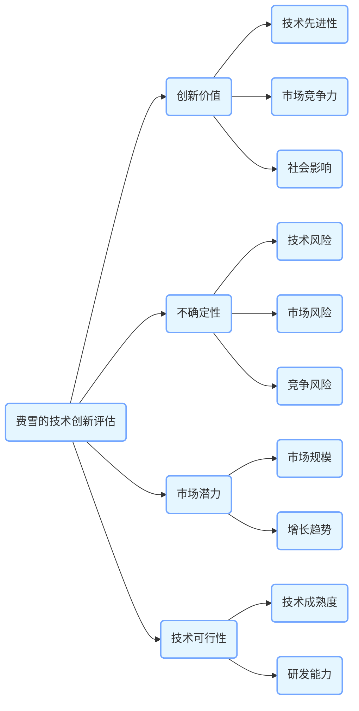

# 费雪的技术创新评估在投资中的运用

> 关键词：费雪、技术创新评估、投资、创新价值、风险评估

> 摘要：本文围绕费雪的技术创新评估在投资中的运用展开深入探讨。首先介绍费雪技术创新评估理论的背景，包括其目的、适用读者、文档结构等内容。接着阐述该评估方法的核心概念与联系，通过清晰的文本示意图和 Mermaid 流程图进行呈现。详细讲解其核心算法原理，并用 Python 代码示例展示具体操作步骤。引入相关数学模型和公式，结合实际例子进行说明。通过项目实战，给出代码实际案例并进行详细解释。探讨其在不同实际应用场景中的作用，推荐相关学习资源、开发工具框架以及论文著作。最后总结未来发展趋势与挑战，解答常见问题并提供扩展阅读和参考资料，旨在为投资者提供全面、深入的关于费雪技术创新评估在投资中运用的知识体系。

## 1. 背景介绍 
### 1.1 目的和范围
费雪的技术创新评估理论为投资领域提供了一种独特且有效的评估技术创新项目投资价值的方法。其目的在于帮助投资者更准确地判断技术创新项目的潜力和风险，从而做出更明智的投资决策。本文章的范围将涵盖费雪技术创新评估理论的核心概念、算法原理、数学模型、实际应用案例等方面，全面探讨其在投资中的运用。

### 1.2 预期读者
本文预期读者包括专业投资者、投资机构从业者、对投资和技术创新领域感兴趣的学者和研究人员，以及希望了解如何评估技术创新项目投资价值的个人投资者。

### 1.3 文档结构概述
本文首先介绍费雪技术创新评估的背景知识，包括其目的、读者群体和文档结构等。接着深入讲解核心概念与联系，通过文本示意图和 Mermaid 流程图呈现其原理和架构。然后阐述核心算法原理，并用 Python 代码展示具体操作步骤。随后引入数学模型和公式，并结合实际例子进行说明。通过项目实战，给出代码案例并详细解释。探讨其实际应用场景，推荐相关工具和资源。最后总结未来发展趋势与挑战，解答常见问题并提供扩展阅读和参考资料。

### 1.4 术语表
#### 1.4.1 核心术语定义
- **费雪的技术创新评估**：是一种基于费雪相关理论发展而来的，用于评估技术创新项目投资价值和风险的方法体系。
- **技术创新项目**：指涉及新技术、新方法、新产品或新服务的研发和推广的项目。
- **投资价值**：指技术创新项目对投资者而言所具有的潜在经济价值和回报。
- **风险评估**：对技术创新项目可能面临的各种风险进行识别、分析和评估的过程。

#### 1.4.2 相关概念解释
- **创新价值**：技术创新项目所具有的独特价值，包括技术先进性、市场竞争力、社会影响等方面。
- **不确定性**：技术创新项目在研发、市场推广等过程中存在的各种不确定因素，如技术难题、市场需求变化等。
- **折现率**：用于将未来的现金流折现到当前时刻的比率，反映了资金的时间价值和风险程度。

#### 1.4.3 缩略词列表
- **NPV**：净现值（Net Present Value），是指投资项目在未来各期现金流入量的现值与现金流出量的现值之差。
- **IRR**：内部收益率（Internal Rate of Return），是指使投资项目净现值为零时的折现率。

## 2. 核心概念与联系 

费雪的技术创新评估主要基于对技术创新项目的多个关键因素进行综合分析，以确定其投资价值和风险。核心概念包括创新价值、不确定性、市场潜力、技术可行性等。这些概念之间相互联系，共同影响着技术创新项目的投资决策。

### 文本示意图
```plaintext
费雪的技术创新评估
|-- 创新价值
|   |-- 技术先进性
|   |-- 市场竞争力
|   |-- 社会影响
|-- 不确定性
|   |-- 技术风险
|   |-- 市场风险
|   |-- 竞争风险
|-- 市场潜力
|   |-- 市场规模
|   |-- 增长趋势
|-- 技术可行性
|   |-- 技术成熟度
|   |-- 研发能力
```

### Mermaid 流程图


创新价值是技术创新项目的核心，它决定了项目在市场中的独特地位和潜在回报。不确定性则反映了项目面临的各种风险，可能会降低项目的投资价值。市场潜力是评估项目未来发展空间的重要指标，而技术可行性则是项目能否成功实施的关键因素。这些因素相互影响，投资者需要综合考虑它们来做出投资决策。

## 3. 核心算法原理 & 具体操作步骤 

### 核心算法原理
费雪的技术创新评估主要基于净现值（NPV）和内部收益率（IRR）等方法来评估技术创新项目的投资价值。净现值是将项目未来各期的现金流量按照一定的折现率折现到当前时刻，然后减去初始投资成本。如果净现值大于零，则说明项目具有投资价值；反之，则不具有投资价值。内部收益率是指使项目净现值为零的折现率，它反映了项目的实际收益率。

### 具体操作步骤
1. **确定项目的现金流量**：预测项目在未来各期的现金流入和现金流出，包括销售收入、成本、研发费用等。
2. **选择合适的折现率**：折现率应反映项目的风险程度和资金的时间价值。一般可以参考市场利率、行业平均收益率等因素来确定。
3. **计算净现值**：根据确定的现金流量和折现率，计算项目的净现值。
4. **计算内部收益率**：通过试错法或使用财务软件等工具，计算项目的内部收益率。
5. **进行决策**：根据净现值和内部收益率的计算结果，判断项目是否具有投资价值。

### Python 代码示例
```python
import numpy as np
from scipy.optimize import newton

def calculate_npv(cash_flows, discount_rate):
    """
    计算净现值
    :param cash_flows: 现金流量列表，第一个元素为初始投资（负数）
    :param discount_rate: 折现率
    :return: 净现值
    """
    npv = 0
    for i, cash_flow in enumerate(cash_flows):
        npv += cash_flow / (1 + discount_rate) ** i
    return npv

def calculate_irr(cash_flows):
    """
    计算内部收益率
    :param cash_flows: 现金流量列表，第一个元素为初始投资（负数）
    :return: 内部收益率
    """
    def npv_func(irr):
        return calculate_npv(cash_flows, irr)
    try:
        irr = newton(npv_func, 0.1)
        return irr
    except:
        return None

# 示例现金流量
cash_flows = [-100000, 20000, 30000, 40000, 50000]
discount_rate = 0.1

# 计算净现值
npv = calculate_npv(cash_flows, discount_rate)
print(f"净现值: {npv}")

# 计算内部收益率
irr = calculate_irr(cash_flows)
if irr is not None:
    print(f"内部收益率: {irr * 100}%")
else:
    print("无法计算内部收益率")
```

在上述代码中，`calculate_npv` 函数用于计算净现值，`calculate_irr` 函数用于计算内部收益率。通过给定的现金流量和折现率，我们可以计算出项目的净现值和内部收益率，从而判断项目的投资价值。

## 4. 数学模型和公式 & 详细讲解 & 举例说明 

### 净现值（NPV）公式
净现值的计算公式为：
$$NPV = \sum_{t=0}^{n} \frac{CF_t}{(1 + r)^t}$$
其中，$NPV$ 表示净现值，$CF_t$ 表示第 $t$ 期的现金流量，$r$ 表示折现率，$n$ 表示项目的寿命期。

### 详细讲解
净现值的计算原理是将项目未来各期的现金流量按照一定的折现率折现到当前时刻，然后减去初始投资成本。折现率反映了资金的时间价值和项目的风险程度。如果净现值大于零，则说明项目的收益超过了成本，具有投资价值；反之，则不具有投资价值。

### 举例说明
假设一个技术创新项目的初始投资为 100 万元，预计未来 5 年的现金流量分别为 20 万元、30 万元、40 万元、50 万元和 60 万元，折现率为 10%。则该项目的净现值为：
$$NPV = -100 + \frac{20}{(1 + 0.1)^1} + \frac{30}{(1 + 0.1)^2} + \frac{40}{(1 + 0.1)^3} + \frac{50}{(1 + 0.1)^4} + \frac{60}{(1 + 0.1)^5}$$
```python
import numpy as np

cash_flows = [-100, 20, 30, 40, 50, 60]
discount_rate = 0.1

npv = 0
for i, cash_flow in enumerate(cash_flows):
    npv += cash_flow / (1 + discount_rate) ** i

print(f"净现值: {npv} 万元")
```
运行上述代码，可得到该项目的净现值。如果净现值大于零，则说明该项目具有投资价值。

### 内部收益率（IRR）公式
内部收益率是指使净现值为零的折现率，即满足以下方程的 $r$ 值：
$$\sum_{t=0}^{n} \frac{CF_t}{(1 + r)^t} = 0$$

### 详细讲解
内部收益率反映了项目的实际收益率。如果内部收益率大于投资者要求的最低收益率，则说明项目具有投资价值；反之，则不具有投资价值。

### 举例说明
使用上述示例的现金流量，我们可以通过试错法或使用财务软件等工具来计算内部收益率。在 Python 中，我们可以使用 `scipy.optimize.newton` 函数来计算内部收益率。
```python
from scipy.optimize import newton

def npv_func(irr):
    cash_flows = [-100, 20, 30, 40, 50, 60]
    npv = 0
    for i, cash_flow in enumerate(cash_flows):
        npv += cash_flow / (1 + irr) ** i
    return npv

try:
    irr = newton(npv_func, 0.1)
    print(f"内部收益率: {irr * 100}%")
except:
    print("无法计算内部收益率")
```
运行上述代码，可得到该项目的内部收益率。

## 5. 项目实战：代码实际案例和详细解释说明 

### 5.1  开发环境搭建
在进行项目实战之前，我们需要搭建相应的开发环境。以下是搭建开发环境的步骤：
1. **安装 Python**：从 Python 官方网站（https://www.python.org/downloads/）下载并安装 Python 3.x 版本。
2. **安装必要的库**：使用 `pip` 命令安装 `numpy` 和 `scipy` 库。
```sh
pip install numpy scipy
```
3. **选择开发工具**：可以选择使用 PyCharm、VS Code 等集成开发环境（IDE）或文本编辑器来编写和运行 Python 代码。

### 5.2  源代码详细实现和代码解读
以下是一个完整的项目实战代码示例，用于评估一个技术创新项目的投资价值。
```python
import numpy as np
from scipy.optimize import newton

def calculate_npv(cash_flows, discount_rate):
    """
    计算净现值
    :param cash_flows: 现金流量列表，第一个元素为初始投资（负数）
    :param discount_rate: 折现率
    :return: 净现值
    """
    npv = 0
    for i, cash_flow in enumerate(cash_flows):
        npv += cash_flow / (1 + discount_rate) ** i
    return npv

def calculate_irr(cash_flows):
    """
    计算内部收益率
    :param cash_flows: 现金流量列表，第一个元素为初始投资（负数）
    :return: 内部收益率
    """
    def npv_func(irr):
        return calculate_npv(cash_flows, irr)
    try:
        irr = newton(npv_func, 0.1)
        return irr
    except:
        return None

def evaluate_project(cash_flows, discount_rate):
    """
    评估项目的投资价值
    :param cash_flows: 现金流量列表，第一个元素为初始投资（负数）
    :param discount_rate: 折现率
    :return: 评估结果
    """
    npv = calculate_npv(cash_flows, discount_rate)
    irr = calculate_irr(cash_flows)

    if npv > 0 and irr is not None and irr > discount_rate:
        result = "项目具有投资价值"
    else:
        result = "项目不具有投资价值"

    return npv, irr, result

# 示例现金流量
cash_flows = [-200000, 30000, 40000, 50000, 60000, 70000]
discount_rate = 0.12

# 评估项目
npv, irr, result = evaluate_project(cash_flows, discount_rate)

print(f"净现值: {npv}")
if irr is not None:
    print(f"内部收益率: {irr * 100}%")
else:
    print("无法计算内部收益率")
print(f"评估结果: {result}")
```

### 代码解读与分析
1. **`calculate_npv` 函数**：该函数用于计算项目的净现值。它接受现金流量列表和折现率作为输入，通过遍历现金流量列表，将每个现金流量按照折现率折现到当前时刻，然后求和得到净现值。
2. **`calculate_irr` 函数**：该函数用于计算项目的内部收益率。它定义了一个内部函数 `npv_func`，用于计算净现值。通过 `scipy.optimize.newton` 函数求解使净现值为零的折现率，即内部收益率。
3. **`evaluate_project` 函数**：该函数用于评估项目的投资价值。它调用 `calculate_npv` 和 `calculate_irr` 函数计算净现值和内部收益率，然后根据净现值大于零且内部收益率大于折现率的条件判断项目是否具有投资价值。
4. **主程序**：定义了示例现金流量和折现率，调用 `evaluate_project` 函数评估项目的投资价值，并输出净现值、内部收益率和评估结果。

## 6. 实际应用场景 
### 风险投资领域
在风险投资领域，投资者面临着众多具有创新性但风险较高的项目。费雪的技术创新评估方法可以帮助投资者筛选出具有潜力的技术创新项目。通过评估项目的创新价值、市场潜力和技术可行性等因素，投资者可以更准确地判断项目的投资价值和风险程度，从而做出更明智的投资决策。例如，对于一个专注于人工智能领域的初创企业，投资者可以使用该评估方法分析其技术的先进性、市场需求和竞争状况，以确定是否值得投资。

### 企业战略投资
企业在进行战略投资时，需要考虑投资项目对企业未来发展的影响。费雪的技术创新评估可以帮助企业评估新技术、新产品或新业务的投资价值。通过分析项目的市场潜力和技术可行性，企业可以确定投资项目是否与企业的战略目标相符，是否能够提升企业的竞争力。例如，一家传统制造业企业计划投资研发新能源汽车技术，通过该评估方法可以评估该项目的投资价值和风险，为企业的战略决策提供依据。

### 政府科技项目投资
政府在推动科技发展和创新方面发挥着重要作用。政府在投资科技项目时，需要确保资金的有效利用和项目的社会经济效益。费雪的技术创新评估方法可以帮助政府评估科技项目的创新价值、社会影响和市场潜力等因素，从而选择具有重要战略意义和发展潜力的项目进行投资。例如，政府在支持新能源技术研发项目时，可以使用该评估方法筛选出最有前景的项目，提高资金的使用效率。

## 7. 工具和资源推荐
### 7.1 学习资源推荐
#### 7.1.1 书籍推荐
- 《投资学》：全面介绍了投资领域的基本理论和方法，包括投资组合理论、资产定价模型等，对于理解投资决策的原理和方法具有重要帮助。
- 《技术创新管理》：深入探讨了技术创新的过程、管理和评估方法，结合实际案例分析了技术创新项目的投资决策和风险管理。
- 《财务分析与决策》：详细介绍了财务分析的方法和工具，包括财务报表分析、现金流量分析、净现值和内部收益率等指标的计算和应用，对于掌握投资项目的财务评估方法具有重要意义。

#### 7.1.2 在线课程
- Coursera 上的“投资学原理”课程：由知名大学的教授授课，系统讲解投资学的基本原理和方法，包括资产定价、投资组合管理、风险管理等内容。
- edX 上的“技术创新与创业”课程：介绍了技术创新的过程和管理方法，以及创业项目的投资决策和融资策略，结合实际案例进行分析和讨论。
- 中国大学 MOOC 上的“财务管理”课程：全面讲解财务管理的基本理论和方法，包括财务报表分析、资金时间价值、投资决策等内容，适合初学者学习。

#### 7.1.3 技术博客和网站
- 雪球网：是一个投资者社区，提供了丰富的投资资讯、研究报告和投资策略分享，投资者可以在这里交流投资经验和心得。
- 36氪：专注于科技、创新和创业领域的资讯平台，提供了大量关于技术创新项目的报道和分析，对于了解科技行业的发展趋势和投资机会具有重要参考价值。
- 麻省理工科技评论：是全球知名的科技媒体，关注科技前沿和创新趋势，发布了许多关于新技术、新发明的研究报告和分析文章，对于投资者了解科技领域的创新动态具有重要帮助。

### 7.2 开发工具框架推荐
#### 7.2.1 IDE和编辑器
- PyCharm：是一款专业的 Python 集成开发环境，具有代码编辑、调试、代码分析等功能，适合开发 Python 投资分析程序。
- VS Code：是一款轻量级的代码编辑器，支持多种编程语言，具有丰富的插件生态系统，可以通过安装相关插件来实现 Python 开发和调试功能。

#### 7.2.2 调试和性能分析工具
- PDB：是 Python 自带的调试工具，可以在代码中设置断点，逐行执行代码，查看变量的值和程序的执行流程，帮助开发者调试代码。
- cProfile：是 Python 的性能分析工具，可以分析代码的运行时间和函数调用次数，帮助开发者找出代码中的性能瓶颈。

#### 7.2.3 相关框架和库
- NumPy：是 Python 的科学计算库，提供了高效的数组操作和数学函数，用于处理投资分析中的数值计算问题。
- SciPy：是 Python 的科学计算库，提供了优化、插值、积分等多种数学算法，用于计算内部收益率等投资指标。
- Pandas：是 Python 的数据处理库，提供了高效的数据结构和数据处理方法，用于处理和分析投资数据。

### 7.3 相关论文著作推荐
#### 7.3.1 经典论文
- 《资本资产定价模型：理论与实证》：提出了资本资产定价模型（CAPM），为投资领域的资产定价提供了重要的理论基础。
- 《有效市场假说》：阐述了有效市场假说的基本原理和分类，对于理解市场效率和投资决策具有重要意义。
- 《技术创新的扩散模型》：研究了技术创新在市场中的扩散过程和规律，为评估技术创新项目的市场潜力提供了理论依据。

#### 7.3.2 最新研究成果
- 关于人工智能、区块链等新兴技术在投资领域应用的研究论文：探讨了新兴技术对投资决策、风险管理等方面的影响和应用前景。
- 关于绿色投资、社会责任投资等可持续投资领域的研究论文：关注投资项目的社会和环境效益，为投资者提供了新的投资理念和方法。

#### 7.3.3 应用案例分析
- 关于成功的技术创新项目投资案例分析：分析了这些项目的投资决策过程、创新模式和市场表现，为投资者提供了实际操作的参考和借鉴。
- 关于失败的技术创新项目投资案例分析：总结了这些项目失败的原因和教训，帮助投资者避免类似的错误。

## 8. 总结：未来发展趋势与挑战
### 未来发展趋势
1. **与新兴技术的融合**：随着人工智能、大数据、区块链等新兴技术的不断发展，费雪的技术创新评估方法将与这些技术深度融合。例如，利用人工智能算法可以更准确地预测技术创新项目的市场需求和发展趋势，利用大数据可以获取更全面的项目信息和市场数据，利用区块链可以实现投资项目的透明化和可信化。
2. **可持续投资的重视**：未来投资者将更加关注投资项目的社会和环境效益，费雪的技术创新评估方法也将更加注重对可持续发展因素的考量。例如，在评估技术创新项目时，将考虑项目对环境的影响、对社会公平的贡献等因素，以推动可持续投资的发展。
3. **全球化投资的需求**：随着经济全球化的深入发展，投资者的投资范围将越来越广泛，费雪的技术创新评估方法也将适应全球化投资的需求。例如，在评估跨国技术创新项目时，需要考虑不同国家和地区的政策法规、文化差异、市场环境等因素，以提高投资决策的准确性和有效性。

### 挑战
1. **数据质量和获取难度**：费雪的技术创新评估方法需要大量的项目信息和市场数据作为支撑，但数据的质量和获取难度是一个挑战。例如，一些技术创新项目的信息可能不公开或不完整，市场数据可能存在误差或滞后性，这将影响评估结果的准确性。
2. **不确定性的增加**：技术创新项目本身具有较高的不确定性，随着科技的快速发展和市场环境的变化，不确定性将进一步增加。例如，新技术的出现可能会使现有技术创新项目的市场价值发生变化，市场需求的波动也会影响项目的投资回报。如何准确评估和应对这些不确定性是一个挑战。
3. **评估方法的局限性**：费雪的技术创新评估方法虽然具有一定的科学性和实用性，但也存在一定的局限性。例如，该方法主要基于财务指标进行评估，对于一些非财务因素的考量不够充分，如技术创新项目的团队素质、创新文化等。如何完善评估方法，提高评估的全面性和准确性是一个挑战。

## 9. 附录：常见问题与解答
### 1. 费雪的技术创新评估方法适用于所有类型的投资项目吗？
不是的，费雪的技术创新评估方法主要适用于技术创新项目的投资评估。对于一些传统行业的投资项目，可能需要采用其他更适合的评估方法。

### 2. 如何确定合适的折现率？
折现率的确定需要考虑多个因素，如市场利率、行业平均收益率、项目的风险程度等。一般可以参考市场上类似项目的折现率，或者使用资本资产定价模型（CAPM）等方法来计算折现率。

### 3. 如果项目的内部收益率无法计算怎么办？
如果项目的内部收益率无法计算，可能是由于现金流量的分布比较复杂或存在多个解。在这种情况下，可以主要参考净现值等其他指标来评估项目的投资价值。

### 4. 费雪的技术创新评估方法需要哪些数据？
该评估方法需要项目的现金流量数据、市场需求数据、技术指标数据等。此外，还需要了解项目的行业背景、竞争状况、政策法规等信息。

### 5. 如何提高评估结果的准确性？
为了提高评估结果的准确性，需要尽可能获取准确、全面的数据，选择合适的评估方法和参数，同时考虑项目的不确定性和风险因素。可以结合多种评估方法进行综合评估，以减少单一方法的局限性。

## 10. 扩展阅读 & 参考资料
### 扩展阅读
- 《创新者的窘境》：探讨了技术创新对企业的影响和挑战，以及企业如何应对创新带来的变革。
- 《聪明的投资者》：是一本经典的投资著作，介绍了价值投资的理念和方法，对于投资者培养正确的投资思维具有重要帮助。
- 《从零到一》：讲述了创业和创新的过程和方法，对于理解技术创新项目的发展规律和投资机会具有重要启示。

### 参考资料
- 费雪相关学术论文和著作。
- 投资学、财务管理等相关教材和书籍。
- 金融资讯网站、科技媒体等发布的相关研究报告和文章。