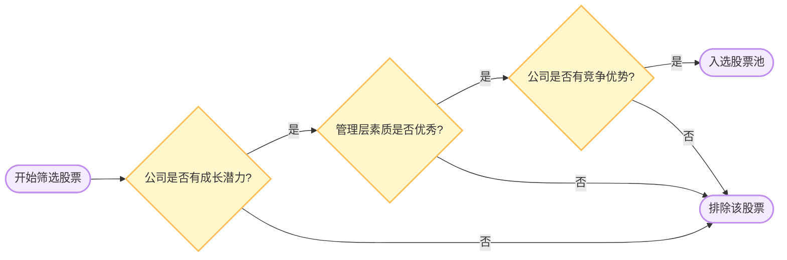

# 费雪的股票筛选技巧

> 关键词：费雪、股票筛选、成长股投资、基本面分析、财务指标

> 摘要：本文深入探讨了费雪的股票筛选技巧。费雪作为成长股投资策略的倡导者，其独特的股票筛选方法对投资者有着深远影响。文章首先介绍了费雪股票筛选技巧的背景，包括目的、预期读者等。接着阐述了核心概念，分析了相关的算法原理及具体操作步骤，并给出了数学模型和公式。通过项目实战，展示了如何运用费雪的技巧进行股票筛选。同时，探讨了其在实际应用场景中的表现，推荐了相关的学习工具和资源。最后，总结了未来发展趋势与挑战，解答了常见问题，并提供了扩展阅读和参考资料，旨在帮助投资者更好地理解和运用费雪的股票筛选技巧。

## 1. 背景介绍 
### 1.1 目的和范围
费雪的股票筛选技巧旨在帮助投资者从众多股票中挑选出具有长期成长潜力的优质股票。这种方法侧重于对公司基本面的深入分析，寻找那些在未来能够实现持续盈利增长、具有竞争优势的企业。本文的范围将涵盖费雪股票筛选技巧的核心概念、算法原理、数学模型、实际应用案例以及相关的工具和资源推荐，为投资者提供一个全面的学习和实践指南。

### 1.2 预期读者
本文预期读者主要包括股票投资者、金融从业者、投资研究人员以及对股票投资感兴趣的爱好者。无论是新手投资者希望学习如何筛选优质股票，还是有经验的投资者想要进一步优化自己的投资策略，都能从本文中获得有价值的信息。

### 1.3 文档结构概述
本文将按照以下结构进行阐述：首先介绍费雪股票筛选技巧的背景知识，包括目的、读者群体和文档结构；接着深入探讨核心概念与联系，通过文本示意图和 Mermaid 流程图进行清晰展示；然后详细讲解核心算法原理和具体操作步骤，结合 Python 源代码进行说明；再介绍相关的数学模型和公式，并举例说明；之后通过项目实战，展示如何运用费雪的技巧进行股票筛选；接着探讨实际应用场景；推荐相关的工具和资源；总结未来发展趋势与挑战；解答常见问题；最后提供扩展阅读和参考资料。

### 1.4 术语表
#### 1.4.1 核心术语定义
- **成长股**：指那些销售额和利润额持续增长，且增长速度快于整个国家及其所在行业的公司所发行的股票。
- **竞争优势**：企业在市场竞争中相对于其他竞争对手所具有的独特优势，如技术优势、品牌优势、成本优势等。
- **ROE（净资产收益率）**：净利润与平均股东权益的百分比，反映股东权益的收益水平，用以衡量公司运用自有资本的效率。
- **PEG（市盈率相对盈利增长比率）**：是用公司的市盈率除以公司的盈利增长速度，是在考虑市盈率的同时也兼顾了公司的盈利增长。

#### 1.4.2 相关概念解释
- **基本面分析**：通过对宏观经济、行业和公司基本情况的分析，评估股票的内在价值，判断股票的投资价值和风险。
- **定性分析**：主要关注公司的非量化因素，如管理层素质、企业文化、市场竞争力等。
- **定量分析**：侧重于对公司财务数据等量化指标的分析，如营收、利润、资产负债率等。

#### 1.4.3 缩略词列表
- **ROE**：Return on Equity（净资产收益率）
- **PEG**：Price/Earnings to Growth ratio（市盈率相对盈利增长比率）
- **EPS**：Earnings Per Share（每股收益）

## 2. 核心概念与联系 

费雪的股票筛选技巧核心在于寻找具有长期成长潜力的公司。其主要基于以下几个核心概念：

### 核心概念原理
- **公司的成长潜力**：费雪认为，投资者应该关注那些具有持续成长能力的公司。这种成长不仅体现在营收和利润的增长上，还包括市场份额的扩大、新产品的推出等方面。一个具有成长潜力的公司能够在未来为股东带来丰厚的回报。
- **管理层素质**：优秀的管理层是公司成功的关键因素之一。管理层的决策能力、创新能力、战略眼光以及对股东利益的关注程度，都会影响公司的发展前景。
- **竞争优势**：具有竞争优势的公司能够在市场中脱颖而出，抵御竞争对手的挑战。竞争优势可以来自于技术创新、品牌影响力、成本控制等方面。

### 架构的文本示意图
```plaintext
费雪股票筛选技巧
|-- 公司成长潜力
|   |-- 营收增长
|   |-- 利润增长
|   |-- 市场份额扩大
|   |-- 新产品推出
|-- 管理层素质
|   |-- 决策能力
|   |-- 创新能力
|   |-- 战略眼光
|   |-- 股东利益关注
|-- 竞争优势
|   |-- 技术创新
|   |-- 品牌影响力
|   |-- 成本控制
```

### Mermaid 流程图


## 3. 核心算法原理 & 具体操作步骤 

### 核心算法原理
费雪的股票筛选算法主要基于对公司基本面的综合评估。通过对公司的财务数据、管理层素质、竞争优势等多个方面进行分析，计算出一个综合得分，得分越高的公司越有可能是优质的成长股。

### 具体操作步骤

#### 步骤 1：收集数据
收集公司的财务报表，包括资产负债表、利润表和现金流量表。同时，了解公司的行业地位、管理层背景、产品或服务特点等信息。

#### 步骤 2：财务指标分析
- **营收增长率**：计算公司过去几年的营收增长率，判断公司的业务扩张情况。
- **净利润增长率**：分析公司净利润的增长趋势，反映公司的盈利能力。
- **ROE**：评估公司运用自有资本的效率。

#### 步骤 3：定性分析
- **管理层素质评估**：考察管理层的经验、决策能力、创新能力等。
- **竞争优势分析**：判断公司在技术、品牌、成本等方面的竞争优势。

#### 步骤 4：综合评估
根据以上分析结果，为每个公司给出一个综合得分，得分高的公司优先考虑。

### Python 源代码实现

```python
import pandas as pd

# 模拟收集的公司数据
data = {
    '公司名称': ['公司A', '公司B', '公司C'],
    '营收增长率': [0.2, 0.15, 0.25],
    '净利润增长率': [0.22, 0.18, 0.28],
    'ROE': [0.18, 0.15, 0.2],
    '管理层评分': [8, 7, 9],
    '竞争优势评分': [8, 7, 9]
}

df = pd.DataFrame(data)

# 计算综合得分
def calculate_score(row):
    financial_score = row['营收增长率'] * 0.3 + row['净利润增长率'] * 0.3 + row['ROE'] * 0.4
    qualitative_score = row['管理层评分'] * 0.5 + row['竞争优势评分'] * 0.5
    total_score = financial_score * 0.6 + qualitative_score * 0.4
    return total_score

df['综合得分'] = df.apply(calculate_score, axis=1)

# 按综合得分排序
sorted_df = df.sort_values(by='综合得分', ascending=False)

print(sorted_df)
```

### 代码解释
- 首先，我们使用 `pandas` 库创建一个包含公司数据的 DataFrame。
- 然后，定义一个 `calculate_score` 函数，用于计算每个公司的综合得分。该函数将财务指标得分和定性分析得分按照一定的权重进行加权平均。
- 最后，将计算得到的综合得分添加到 DataFrame 中，并按综合得分进行排序。

## 4. 数学模型和公式 & 详细讲解 & 举例说明 

### 数学模型和公式
#### 财务指标得分
设营收增长率为 $R_{r}$，净利润增长率为 $R_{p}$，ROE 为 $ROE$，则财务指标得分 $S_{f}$ 的计算公式为：
$$S_{f}=0.3R_{r}+0.3R_{p}+0.4ROE$$

#### 定性分析得分
设管理层评分 $M$，竞争优势评分 $C$，则定性分析得分 $S_{q}$ 的计算公式为：
$$S_{q}=0.5M + 0.5C$$

#### 综合得分
设财务指标得分权重为 $w_{f}=0.6$，定性分析得分权重为 $w_{q}=0.4$，则综合得分 $S$ 的计算公式为：
$$S = w_{f}S_{f}+w_{q}S_{q}$$

### 详细讲解
- **财务指标得分**：营收增长率、净利润增长率和 ROE 是衡量公司财务状况的重要指标。通过赋予不同的权重，可以综合评估公司的财务表现。这里，ROE 的权重较高，因为它反映了公司运用自有资本的效率。
- **定性分析得分**：管理层素质和竞争优势是影响公司长期发展的关键因素。将两者的评分进行平均，可以得到定性分析得分。
- **综合得分**：将财务指标得分和定性分析得分按照一定的权重进行加权平均，得到最终的综合得分。这样可以综合考虑公司的财务状况和非财务因素。

### 举例说明
以公司 A 为例，假设其营收增长率 $R_{r}=0.2$，净利润增长率 $R_{p}=0.22$，ROE $= 0.18$，管理层评分 $M = 8$，竞争优势评分 $C = 8$。

- 计算财务指标得分：
$$S_{f}=0.3\times0.2 + 0.3\times0.22 + 0.4\times0.18 = 0.198$$
- 计算定性分析得分：
$$S_{q}=0.5\times8 + 0.5\times8 = 8$$
- 计算综合得分：
$$S = 0.6\times0.198+0.4\times8 = 3.3188$$

## 5. 项目实战：代码实际案例和详细解释说明 

### 5.1  开发环境搭建
- **安装 Python**：确保你的系统中已经安装了 Python 3.x 版本。可以从 Python 官方网站（https://www.python.org/downloads/）下载并安装。
- **安装必要的库**：使用 `pip` 安装 `pandas` 库，用于数据处理和分析。在命令行中运行以下命令：
```sh
pip install pandas
```

### 5.2  源代码详细实现和代码解读

```python
import pandas as pd

# 读取公司数据文件
def read_data(file_path):
    df = pd.read_csv(file_path)
    return df

# 计算财务指标得分
def calculate_financial_score(row):
    revenue_growth = row['营收增长率']
    profit_growth = row['净利润增长率']
    roe = row['ROE']
    financial_score = 0.3 * revenue_growth + 0.3 * profit_growth + 0.4 * roe
    return financial_score

# 计算定性分析得分
def calculate_qualitative_score(row):
    management_score = row['管理层评分']
    competitive_advantage_score = row['竞争优势评分']
    qualitative_score = 0.5 * management_score + 0.5 * competitive_advantage_score
    return qualitative_score

# 计算综合得分
def calculate_total_score(row):
    financial_score = calculate_financial_score(row)
    qualitative_score = calculate_qualitative_score(row)
    total_score = 0.6 * financial_score + 0.4 * qualitative_score
    return total_score

# 主函数
def main():
    file_path = 'company_data.csv'
    df = read_data(file_path)
    df['财务指标得分'] = df.apply(calculate_financial_score, axis=1)
    df['定性分析得分'] = df.apply(calculate_qualitative_score, axis=1)
    df['综合得分'] = df.apply(calculate_total_score, axis=1)
    sorted_df = df.sort_values(by='综合得分', ascending=False)
    print(sorted_df)

if __name__ == "__main__":
    main()
```

### 代码解读与分析
- **`read_data` 函数**：用于读取包含公司数据的 CSV 文件，并将其转换为 `pandas` 的 DataFrame 对象。
- **`calculate_financial_score` 函数**：根据前面介绍的公式，计算每个公司的财务指标得分。
- **`calculate_qualitative_score` 函数**：计算每个公司的定性分析得分。
- **`calculate_total_score` 函数**：将财务指标得分和定性分析得分进行加权平均，得到综合得分。
- **`main` 函数**：主函数，负责调用上述函数，完成数据读取、得分计算和排序，并输出最终结果。

## 6. 实际应用场景 
### 个人投资者
个人投资者可以运用费雪的股票筛选技巧，从众多股票中挑选出具有成长潜力的优质股票，构建自己的投资组合。通过深入分析公司的基本面，投资者可以更好地了解公司的价值，避免盲目跟风投资，提高投资的成功率。

### 机构投资者
对于基金公司、证券公司等机构投资者来说，费雪的股票筛选技巧可以作为其投资研究的重要工具。机构投资者可以利用大规模的数据和专业的分析团队，更全面地评估公司的成长潜力和竞争优势，为投资决策提供有力支持。

### 投资顾问
投资顾问可以向客户介绍费雪的股票筛选方法，帮助客户制定个性化的投资策略。通过对客户的风险承受能力、投资目标等因素的综合考虑，投资顾问可以为客户筛选出适合的股票，提高客户的投资收益。

## 7. 工具和资源推荐
### 7.1 学习资源推荐
#### 7.1.1 书籍推荐
- 《怎样选择成长股》（菲利普·费雪著）：这是费雪的经典著作，详细阐述了他的成长股投资理念和股票筛选方法。
- 《聪明的投资者》（本杰明·格雷厄姆著）：虽然不是专门介绍费雪的方法，但书中的价值投资理念对理解股票筛选有很大帮助。

#### 7.1.2 在线课程
- Coursera 上的“投资学原理”课程：该课程涵盖了股票投资的基本原理和方法，包括基本面分析和股票筛选技巧。
- 网易云课堂上的“股票投资实战课程”：提供了丰富的实战案例和分析方法，有助于学习者将理论知识应用到实际投资中。

#### 7.1.3 技术博客和网站
- 雪球网：国内知名的投资社区，有大量的投资者分享自己的投资经验和股票分析文章。
- 东方财富网：提供全面的金融数据和资讯，包括公司财务报表、行业动态等，是进行股票分析的重要信息来源。

### 7.2 开发工具框架推荐
#### 7.2.1 IDE和编辑器
- PyCharm：功能强大的 Python 集成开发环境，提供代码编辑、调试、版本控制等功能，适合专业开发者使用。
- Jupyter Notebook：交互式的开发环境，方便进行数据探索和代码演示，适合数据分析和机器学习领域的开发者。

#### 7.2.2 调试和性能分析工具
- `pdb`：Python 自带的调试工具，可以帮助开发者定位代码中的错误。
- `cProfile`：用于分析 Python 代码的性能，找出性能瓶颈。

#### 7.2.3 相关框架和库
- `pandas`：用于数据处理和分析，提供了丰富的数据结构和函数，方便进行财务数据的处理和分析。
- `numpy`：用于数值计算，提供了高效的数组操作和数学函数，是进行数据分析的基础库。

### 7.3 相关论文著作推荐
#### 7.3.1 经典论文
- 《The Cross - Section of Expected Stock Returns》（Eugene F. Fama and Kenneth R. French 著）：该论文提出了著名的 Fama - French 三因子模型，对股票收益的影响因素进行了深入分析。
- 《Capital Asset Pricing Model: Theory and Evidence》（Fischer Black 著）：介绍了资本资产定价模型（CAPM）的理论和实证研究，为股票投资提供了重要的理论基础。

#### 7.3.2 最新研究成果
- 《Machine Learning for Asset Managers》（Lopez de Prado 著）：探讨了机器学习在资产管理中的应用，为股票筛选和投资决策提供了新的思路和方法。
- 《Factor Investing: From Academic Theory to Industrial Practice》（Ronald N. Kahn 著）：介绍了因子投资的理论和实践，对股票筛选中的因子分析有重要参考价值。

#### 7.3.3 应用案例分析
- 《Case Studies in Finance: Managing for Corporate Value Creation》（Aswath Damodaran 著）：通过实际案例分析，展示了如何运用财务分析和投资决策方法，为企业创造价值。
- 《Investment Banking: Valuation, Leveraged Buyouts, and Mergers & Acquisitions》（Joshua Rosenbaum and Joshua Pearl 著）：提供了投资银行在企业估值、杠杆收购和并购等方面的实际案例，对股票投资和分析有一定的借鉴作用。

## 8. 总结：未来发展趋势与挑战
### 未来发展趋势
- **数据驱动的分析**：随着大数据和人工智能技术的发展，未来的股票筛选将更加依赖于数据驱动的分析方法。投资者可以利用更多的数据源，如社交媒体数据、卫星图像数据等，更全面地了解公司的运营情况和市场趋势。
- **多因子模型的应用**：除了传统的财务指标和定性分析，未来的股票筛选将更多地运用多因子模型，综合考虑各种因素对股票收益的影响，提高筛选的准确性和有效性。
- **全球投资视野**：随着全球经济的一体化，投资者将更加关注全球市场的投资机会。费雪的股票筛选技巧也将在全球范围内得到更广泛的应用，投资者需要具备更广阔的国际视野和跨文化分析能力。

### 挑战
- **数据质量和可靠性**：大量的数据并不一定意味着高质量和可靠性。投资者需要面对数据不准确、不完整等问题，如何筛选和处理数据是一个挑战。
- **市场变化的不确定性**：股票市场是复杂多变的，未来的市场环境可能与过去有很大不同。费雪的股票筛选技巧是基于历史数据和经验总结的，如何适应市场的变化是一个挑战。
- **竞争加剧**：随着越来越多的投资者和机构采用类似的股票筛选方法，市场竞争将加剧。投资者需要不断创新和优化自己的筛选方法，以获得更好的投资回报。

## 9. 附录：常见问题与解答
### 问题 1：费雪的股票筛选技巧适用于所有类型的股票吗？
解答：费雪的股票筛选技巧主要侧重于成长股的筛选，对于那些具有长期成长潜力的公司更为适用。对于一些成熟行业的蓝筹股或周期性股票，可能需要结合其他的分析方法。

### 问题 2：如何评估管理层素质和竞争优势？
解答：评估管理层素质可以从管理层的教育背景、工作经验、过往业绩、决策能力等方面进行考察。评估竞争优势可以分析公司的技术创新能力、品牌影响力、成本控制能力、市场份额等因素。

### 问题 3：财务指标的权重可以根据不同情况进行调整吗？
解答：可以。不同的投资者可以根据自己的投资目标、风险偏好和市场环境等因素，对财务指标的权重进行调整。例如，对于风险偏好较高的投资者，可以适当提高营收增长率和净利润增长率的权重。

### 问题 4：运用费雪的股票筛选技巧一定能获得高收益吗？
解答：不能保证。股票投资本身具有不确定性，即使采用了科学的筛选方法，也不能完全排除市场风险和公司经营风险。投资者需要结合自己的投资经验和风险承受能力，合理运用筛选技巧。

## 10. 扩展阅读 & 参考资料
### 扩展阅读
- 《金融炼金术》（乔治·索罗斯著）：介绍了索罗斯的投资哲学和方法，对理解股票市场的波动和投资策略有一定的启发。
- 《穷查理宝典》（查理·芒格著）：包含了芒格的投资智慧和人生经验，对投资者的思维方式和投资决策有很大的帮助。

### 参考资料
- 菲利普·费雪的官方网站（如果有），获取费雪的最新研究成果和观点。
- 各大金融数据库，如 Wind、Bloomberg 等，获取准确的公司财务数据和市场信息。
- 学术期刊，如《Journal of Finance》、《Review of Financial Studies》等，了解最新的金融研究成果。