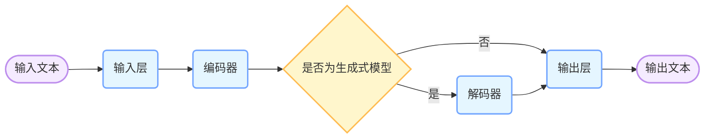

# 选择合适的LLM模型：性能与成本的平衡

> 关键词：LLM模型、性能、成本、模型选择、平衡策略

> 摘要：随着大语言模型（LLM）在各个领域的广泛应用，如何选择合适的LLM模型以实现性能与成本的平衡成为了关键问题。本文深入探讨了LLM模型的核心概念、算法原理、数学模型，通过项目实战展示了模型选择的具体过程，分析了其实际应用场景，推荐了相关的工具和资源，最后总结了未来发展趋势与挑战，并对常见问题进行了解答，旨在为读者提供全面、系统的指导，帮助其在选择LLM模型时做出明智决策。

## 1. 背景介绍 
### 1.1 目的和范围
本文章的主要目的是帮助读者理解如何在选择大语言模型（LLM）时平衡性能与成本。我们将涵盖从基础概念到实际应用的各个方面，包括LLM的核心原理、算法细节、数学模型，以及如何通过实际项目来选择合适的模型。同时，我们还将探讨LLM在不同场景下的应用，推荐相关的学习资源、开发工具和研究论文，帮助读者全面了解LLM模型选择的相关知识。

### 1.2 预期读者
本文适合对大语言模型感兴趣的各类人群，包括但不限于人工智能开发者、数据科学家、企业技术决策者、研究人员以及对新兴技术有探索欲望的爱好者。无论是想要将LLM应用到实际项目中的开发者，还是需要评估模型投资的企业决策者，都能从本文中获得有价值的信息。

### 1.3 文档结构概述
本文将按照以下结构进行组织：
- 核心概念与联系：介绍LLM的基本概念、原理和架构，并通过文本示意图和Mermaid流程图进行直观展示。
- 核心算法原理 & 具体操作步骤：详细讲解LLM的核心算法原理，并使用Python源代码进行阐述。
- 数学模型和公式 & 详细讲解 & 举例说明：介绍LLM的数学模型和相关公式，并通过具体例子进行说明。
- 项目实战：代码实际案例和详细解释说明：通过实际项目案例，展示如何选择合适的LLM模型，并对代码进行详细解读。
- 实际应用场景：分析LLM在不同领域的实际应用场景。
- 工具和资源推荐：推荐相关的学习资源、开发工具和研究论文。
- 总结：未来发展趋势与挑战：总结LLM模型选择的关键要点，探讨未来的发展趋势和面临的挑战。
- 附录：常见问题与解答：解答读者在选择LLM模型过程中常见的问题。
- 扩展阅读 & 参考资料：提供相关的扩展阅读材料和参考资料。

### 1.4 术语表
#### 1.4.1 核心术语定义
- **大语言模型（LLM）**：是一种基于深度学习的自然语言处理模型，通过在大规模文本数据上进行训练，学习语言的模式和规律，从而能够生成自然流畅的文本。
- **性能**：指LLM在处理各种自然语言任务时的表现，如语言理解、文本生成、问答系统等方面的准确性、效率和质量。
- **成本**：包括模型的训练成本（如计算资源、数据标注等）、使用成本（如API调用费用、硬件资源等）和维护成本（如模型更新、优化等）。
- **模型架构**：指LLM的具体结构和设计，如Transformer架构等，不同的架构会影响模型的性能和训练效率。
- **微调（Fine-tuning）**：在预训练模型的基础上，使用特定领域的数据集对模型进行进一步训练，以提高模型在该领域的性能。

#### 1.4.2 相关概念解释
- **预训练**：在大规模无监督文本数据上对模型进行训练，学习语言的通用模式和知识。
- **注意力机制**：一种在处理序列数据时，能够动态地关注序列中不同部分的机制，有助于模型捕捉长距离依赖关系。
- **梯度下降**：一种优化算法，用于在训练过程中调整模型的参数，使得模型的损失函数最小化。

#### 1.4.3 缩略词列表
- **LLM**：大语言模型（Large Language Model）
- **API**：应用程序编程接口（Application Programming Interface）
- **NLP**：自然语言处理（Natural Language Processing）

## 2. 核心概念与联系 

### 核心概念原理
大语言模型（LLM）的核心原理基于深度学习，特别是Transformer架构。Transformer架构通过引入注意力机制，能够有效地处理序列数据，捕捉长距离依赖关系。在训练过程中，LLM使用大规模的文本数据进行无监督学习，学习语言的模式和规律。预训练完成后，模型可以在各种自然语言任务中进行微调，以适应不同的应用场景。

### 架构的文本示意图
LLM的基本架构可以分为输入层、编码器、解码器（在生成式模型中）和输出层。输入层将文本数据转换为模型可以处理的向量表示；编码器对输入进行特征提取和表示学习；解码器根据编码器的输出生成文本；输出层将模型的输出转换为自然语言文本。

### Mermaid流程图


这个流程图展示了LLM处理文本的基本流程。首先，输入文本经过输入层转换为向量表示，然后进入编码器进行特征提取。如果是生成式模型，编码器的输出会进入解码器生成文本；否则，直接通过输出层得到最终的文本输出。

## 3. 核心算法原理 & 具体操作步骤 

### 核心算法原理
LLM的核心算法基于Transformer架构，其中注意力机制是关键。注意力机制允许模型在处理序列数据时，动态地关注序列中不同部分的信息。具体来说，注意力机制通过计算查询（Query）、键（Key）和值（Value）之间的相似度，来确定每个位置的权重。

### Python源代码详细阐述
以下是一个简单的多头注意力机制的Python实现：

```python
import torch
import torch.nn as nn
import torch.nn.functional as F

class MultiHeadAttention(nn.Module):
    def __init__(self, d_model, num_heads):
        super(MultiHeadAttention, self).__init__()
        assert d_model % num_heads == 0, "d_model must be divisible by num_heads"
        
        self.d_model = d_model
        self.num_heads = num_heads
        self.d_k = d_model // num_heads
        
        self.W_q = nn.Linear(d_model, d_model)
        self.W_k = nn.Linear(d_model, d_model)
        self.W_v = nn.Linear(d_model, d_model)
        self.W_o = nn.Linear(d_model, d_model)
        
    def scaled_dot_product_attention(self, Q, K, V, mask=None):
        attn_scores = torch.matmul(Q, K.transpose(-2, -1)) / torch.sqrt(torch.tensor(self.d_k, dtype=torch.float32))
        if mask is not None:
            attn_scores = attn_scores.masked_fill(mask == 0, -1e9)
        attn_probs = F.softmax(attn_scores, dim=-1)
        output = torch.matmul(attn_probs, V)
        return output
        
    def split_heads(self, x):
        batch_size, seq_length, d_model = x.size()
        return x.view(batch_size, seq_length, self.num_heads, self.d_k).transpose(1, 2)
        
    def combine_heads(self, x):
        batch_size, num_heads, seq_length, d_k = x.size()
        return x.transpose(1, 2).contiguous().view(batch_size, seq_length, self.d_model)
        
    def forward(self, Q, K, V, mask=None):
        Q = self.split_heads(self.W_q(Q))
        K = self.split_heads(self.W_k(K))
        V = self.split_heads(self.W_v(V))
        
        attn_output = self.scaled_dot_product_attention(Q, K, V, mask)
        output = self.W_o(self.combine_heads(attn_output))
        return output


# 示例使用
d_model = 512
num_heads = 8
batch_size = 32
seq_length = 10
input_tensor = torch.randn(batch_size, seq_length, d_model)

multihead_attn = MultiHeadAttention(d_model, num_heads)
output = multihead_attn(input_tensor, input_tensor, input_tensor)
print(output.shape)
```

### 具体操作步骤
1. **初始化模型**：创建一个`MultiHeadAttention`类的实例，指定`d_model`和`num_heads`参数。
2. **输入处理**：将输入的文本数据转换为合适的张量形式，并输入到模型中。
3. **计算注意力分数**：在`scaled_dot_product_attention`方法中，计算查询、键之间的相似度，并进行缩放。
4. **应用掩码（可选）**：如果有掩码，将掩码应用到注意力分数上，屏蔽不需要关注的位置。
5. **计算注意力概率**：使用softmax函数将注意力分数转换为概率分布。
6. **计算输出**：将注意力概率与值相乘，得到最终的输出。
7. **合并多头结果**：将多头的输出合并，并通过线性层进行变换。

## 4. 数学模型和公式 & 详细讲解 & 举例说明 

### 数学模型和公式
#### 缩放点积注意力
缩放点积注意力的计算公式如下：
$$
\text{Attention}(Q, K, V) = \text{softmax}\left(\frac{QK^T}{\sqrt{d_k}}\right)V
$$
其中，$Q$ 是查询矩阵，$K$ 是键矩阵，$V$ 是值矩阵，$d_k$ 是键的维度。

#### 多头注意力
多头注意力通过将输入分成多个头，并行计算注意力，然后将结果合并。其计算公式如下：
$$
\text{MultiHead}(Q, K, V) = \text{Concat}(\text{head}_1, \cdots, \text{head}_h)W^O
$$
其中，$\text{head}_i = \text{Attention}(QW_i^Q, KW_i^K, VW_i^V)$，$W_i^Q$、$W_i^K$、$W_i^V$ 是每个头的线性变换矩阵，$W^O$ 是输出的线性变换矩阵。

### 详细讲解
#### 缩放点积注意力
缩放点积注意力的核心思想是通过计算查询和键之间的相似度，来确定每个位置的权重。缩放操作 $\frac{1}{\sqrt{d_k}}$ 是为了防止点积结果过大，导致softmax函数的梯度消失。

#### 多头注意力
多头注意力通过将输入分成多个头，使得模型能够从不同的表示子空间中捕捉信息，提高模型的表达能力。

### 举例说明
假设我们有一个输入序列 $x = [x_1, x_2, x_3]$，每个 $x_i$ 的维度为 $d = 512$。我们将其通过线性变换得到查询 $Q$、键 $K$ 和值 $V$，每个矩阵的维度为 $3 \times 512$。假设我们使用 $h = 8$ 个头，每个头的维度为 $d_k = 64$。

首先，我们将 $Q$、$K$、$V$ 分别分成 8 个头，每个头的维度为 $3 \times 64$。然后，对于每个头，我们计算缩放点积注意力，得到 8 个输出矩阵，每个矩阵的维度为 $3 \times 64$。最后，我们将这 8 个矩阵拼接起来，得到一个维度为 $3 \times 512$ 的矩阵，再通过一个线性变换得到最终的输出。

## 5. 项目实战：代码实际案例和详细解释说明 

### 5.1 开发环境搭建
#### 安装Python和相关库
我们使用Python 3.8及以上版本，并安装以下库：
```bash
pip install torch transformers datasets
```
- `torch`：PyTorch深度学习框架。
- `transformers`：Hugging Face提供的用于自然语言处理的库，包含了各种预训练模型。
- `datasets`：Hugging Face提供的用于加载和处理数据集的库。

#### 选择合适的预训练模型
在本项目中，我们选择`bert-base-uncased`作为预训练模型。

### 5.2 源代码详细实现和代码解读
```python
from transformers import AutoTokenizer, AutoModelForSequenceClassification
from datasets import load_dataset
import torch
from torch.utils.data import DataLoader
from sklearn.metrics import accuracy_score

# 加载数据集
dataset = load_dataset("glue", "sst2")

# 加载预训练模型和分词器
tokenizer = AutoTokenizer.from_pretrained("bert-base-uncased")
model = AutoModelForSequenceClassification.from_pretrained("bert-base-uncased", num_labels=2)

# 数据预处理
def preprocess_function(examples):
    return tokenizer(examples["sentence"], truncation=True, padding="max_length", max_length=128)

tokenized_dataset = dataset.map(preprocess_function, batched=True)

# 创建数据加载器
train_dataloader = DataLoader(tokenized_dataset["train"], batch_size=16, shuffle=True)
eval_dataloader = DataLoader(tokenized_dataset["validation"], batch_size=16)

# 定义优化器和损失函数
optimizer = torch.optim.AdamW(model.parameters(), lr=2e-5)
loss_fn = torch.nn.CrossEntropyLoss()

# 训练模型
device = torch.device("cuda" if torch.cuda.is_available() else "cpu")
model.to(device)

for epoch in range(3):
    model.train()
    total_loss = 0
    for batch in train_dataloader:
        batch = {k: v.to(device) for k, v in batch.items()}
        optimizer.zero_grad()
        outputs = model(**batch)
        loss = loss_fn(outputs.logits, batch["labels"])
        loss.backward()
        optimizer.step()
        total_loss += loss.item()
    
    print(f"Epoch {epoch+1}, Loss: {total_loss / len(train_dataloader)}")

# 评估模型
model.eval()
predictions = []
true_labels = []
with torch.no_grad():
    for batch in eval_dataloader:
        batch = {k: v.to(device) for k, v in batch.items()}
        outputs = model(**batch)
        logits = outputs.logits
        preds = torch.argmax(logits, dim=1)
        predictions.extend(preds.cpu().tolist())
        true_labels.extend(batch["labels"].cpu().tolist())

accuracy = accuracy_score(true_labels, predictions)
print(f"Accuracy: {accuracy}")
```

### 5.3 代码解读与分析
#### 数据加载和预处理
- 使用`load_dataset`函数从Hugging Face的数据集库中加载`sst2`数据集，该数据集是一个情感分类数据集。
- 使用`AutoTokenizer`加载`bert-base-uncased`的分词器，将文本数据转换为模型可以处理的输入格式。
- 定义`preprocess_function`函数，对数据集进行预处理，包括截断和填充操作。

#### 模型加载和配置
- 使用`AutoModelForSequenceClassification`加载`bert-base-uncased`的预训练模型，并指定分类的类别数为 2。
- 定义优化器`AdamW`和损失函数`CrossEntropyLoss`。

#### 训练过程
- 将模型移动到GPU（如果可用）上进行训练。
- 遍历训练数据集，计算损失并进行反向传播和参数更新。

#### 评估过程
- 在验证数据集上评估模型的性能，计算准确率。

## 6. 实际应用场景 
### 智能客服
LLM可以用于构建智能客服系统，能够理解用户的问题并提供准确的回答。通过对大量的历史对话数据进行训练，模型可以学习到常见问题的解决方案，提高客服效率和用户满意度。

### 文本生成
在内容创作领域，LLM可以用于生成新闻报道、故事、诗歌等文本内容。模型可以根据给定的主题和关键词，生成自然流畅的文本，为创作者提供灵感和辅助。

### 机器翻译
LLM可以用于机器翻译任务，通过学习不同语言之间的对应关系，将一种语言的文本翻译成另一种语言。与传统的机器翻译方法相比，LLM能够更好地处理语言的语义和上下文信息，提高翻译的质量。

### 信息检索
在搜索引擎和知识图谱中，LLM可以用于理解用户的查询意图，从大量的文本数据中检索出相关的信息。模型可以对文本进行语义分析和理解，提高信息检索的准确性和效率。

### 金融分析
在金融领域，LLM可以用于分析新闻报道、研报等文本信息，提取关键信息和情感倾向，为投资决策提供支持。模型可以对市场动态进行实时监测和分析，帮助投资者做出更明智的决策。

## 7. 工具和资源推荐
### 7.1 学习资源推荐
#### 7.1.1 书籍推荐
- 《深度学习》（Deep Learning）：由Ian Goodfellow、Yoshua Bengio和Aaron Courville撰写，是深度学习领域的经典教材，涵盖了神经网络、优化算法、深度学习应用等方面的内容。
- 《自然语言处理入门》（Natural Language Processing with Python）：由Steven Bird、Ewan Klein和Edward Loper撰写，介绍了使用Python进行自然语言处理的基本方法和技术。
- 《Transformers从入门到实战》：详细介绍了Transformer架构的原理和应用，以及如何使用Hugging Face的`transformers`库进行模型开发。

#### 7.1.2 在线课程
- Coursera上的“深度学习专项课程”（Deep Learning Specialization）：由Andrew Ng教授授课，涵盖了深度学习的基础知识和应用。
- edX上的“自然语言处理”（Natural Language Processing）：介绍了自然语言处理的核心技术和算法。
- Hugging Face的官方文档和教程：提供了关于`transformers`库的详细文档和示例代码，帮助用户快速上手。

#### 7.1.3 技术博客和网站
- Hugging Face博客：发布了关于大语言模型的最新研究成果和应用案例。
- Medium上的人工智能相关博客：有很多专业人士分享的关于LLM的技术文章和经验。
- arXiv：提供了大量的学术论文，包括LLM领域的最新研究成果。

### 7.2 开发工具框架推荐
#### 7.2.1 IDE和编辑器
- PyCharm：一款功能强大的Python集成开发环境，提供了代码编辑、调试、版本控制等功能。
- Visual Studio Code：一款轻量级的代码编辑器，支持多种编程语言，并且有丰富的插件扩展。

#### 7.2.2 调试和性能分析工具
- TensorBoard：用于可视化深度学习模型的训练过程和性能指标。
- PyTorch Profiler：可以帮助用户分析模型的性能瓶颈，优化代码。

#### 7.2.3 相关框架和库
- Hugging Face的`transformers`库：提供了各种预训练的大语言模型和相关工具，方便用户进行模型开发和应用。
- PyTorch：一个开源的深度学习框架，具有强大的计算能力和灵活的模型构建能力。
- TensorFlow：另一个广泛使用的深度学习框架，提供了丰富的工具和库。

### 7.3 相关论文著作推荐
#### 7.3.1 经典论文
- 《Attention Is All You Need》：介绍了Transformer架构，是大语言模型的基础。
- 《BERT: Pre-training of Deep Bidirectional Transformers for Language Understanding》：提出了BERT模型，开创了预训练-微调的自然语言处理范式。
- 《GPT: Generative Pretrained Transformer》：介绍了GPT系列模型，推动了生成式语言模型的发展。

#### 7.3.2 最新研究成果
- 关注arXiv上关于LLM的最新论文，了解模型架构、训练方法、应用场景等方面的最新进展。

#### 7.3.3 应用案例分析
- 研究一些知名公司和研究机构在实际项目中应用LLM的案例，学习他们的经验和方法。

## 8. 总结：未来发展趋势与挑战
### 未来发展趋势
#### 模型规模不断扩大
随着计算资源的不断提升，LLM的模型规模将继续扩大，以学习更丰富的语言知识和模式，提高模型的性能。

#### 多模态融合
未来的LLM将不仅仅局限于处理文本数据，还将融合图像、音频、视频等多种模态的信息，实现更强大的智能交互。

#### 个性化定制
根据用户的需求和偏好，为用户提供个性化的语言服务，提高用户体验。

#### 跨领域应用
LLM将在更多的领域得到应用，如医疗、教育、交通等，为各个行业带来变革。

### 挑战
#### 计算资源需求大
大规模的LLM训练需要大量的计算资源和能源消耗，这限制了模型的发展和应用。

#### 数据隐私和安全
LLM的训练需要大量的数据，如何保护数据的隐私和安全是一个重要的问题。

#### 模型可解释性
LLM是一种黑盒模型，其决策过程难以解释，这在一些关键领域的应用中存在风险。

#### 伦理和社会问题
LLM的应用可能会带来一些伦理和社会问题，如虚假信息传播、偏见和歧视等，需要制定相应的规范和准则。

## 9. 附录：常见问题与解答
### 如何选择合适的LLM模型？
选择合适的LLM模型需要考虑多个因素，如任务类型、数据规模、性能要求、成本等。可以根据具体的应用场景，选择预训练模型并进行微调，或者使用开源的模型进行开发。

### LLM的训练成本高吗？
LLM的训练成本通常较高，包括计算资源、数据标注等方面的成本。可以使用云计算平台或者分布式训练来降低成本，也可以选择使用预训练模型进行微调，减少训练时间和成本。

### LLM在实际应用中会遇到哪些问题？
在实际应用中，LLM可能会遇到语言理解不准确、生成文本质量不高、处理长文本能力有限等问题。可以通过优化模型、增加训练数据、调整参数等方法来解决这些问题。

### 如何评估LLM的性能？
可以使用各种评估指标来评估LLM的性能，如准确率、召回率、F1值、困惑度等。根据具体的任务类型，选择合适的评估指标进行评估。

## 10. 扩展阅读 & 参考资料
### 扩展阅读
- 《人工智能：现代方法》（Artificial Intelligence: A Modern Approach）：全面介绍了人工智能的各个领域，包括自然语言处理、机器学习等。
- 《深度学习实战》（Deep Learning in Practice）：通过实际案例介绍了深度学习的应用和开发方法。

### 参考资料
- Hugging Face官方文档：https://huggingface.co/docs
- PyTorch官方文档：https://pytorch.org/docs/stable/index.html
- arXiv论文库：https://arxiv.org/