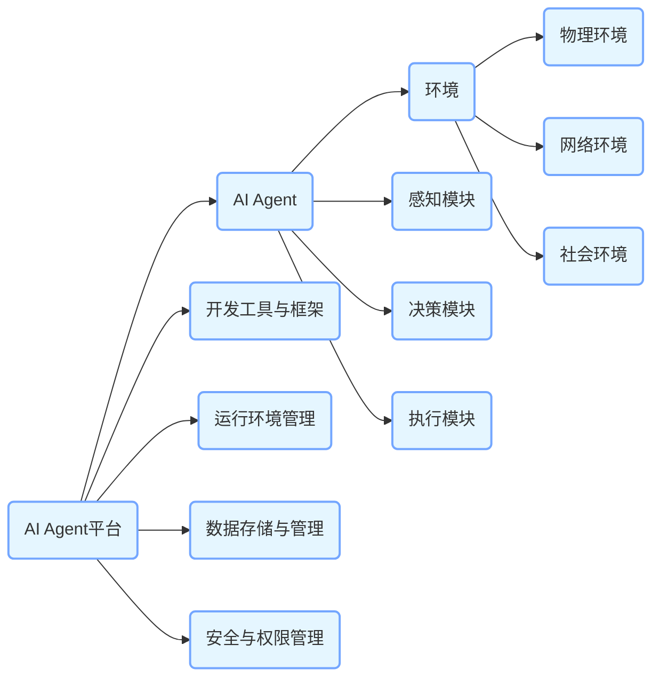

# 选择适合企业的AI Agent平台

> 关键词：AI Agent平台、企业选择、人工智能、平台评估、业务适配

> 摘要：随着人工智能技术的快速发展，AI Agent平台在企业中的应用日益广泛。选择适合企业的AI Agent平台对于提升企业的效率、创新能力和竞争力至关重要。本文将深入探讨如何选择适合企业的AI Agent平台，从背景介绍、核心概念、算法原理、数学模型、项目实战、实际应用场景、工具资源推荐等多个方面进行详细阐述，为企业在选择AI Agent平台时提供全面、专业的指导和参考。

## 1. 背景介绍 
### 1.1 目的和范围
本文章的目的在于为企业提供一套全面且实用的方法和思路，帮助企业准确、高效地选择适合自身发展需求的AI Agent平台。范围涵盖了AI Agent平台的基本概念、核心技术原理、不同类型企业的应用场景分析，以及选择平台时需要考虑的各种因素和评估方法等内容。通过对这些方面的详细探讨，使企业能够在众多的AI Agent平台中做出明智的决策。

### 1.2 预期读者
本文预期读者主要包括企业的决策者，如CEO、CTO等，他们负责企业的战略规划和技术选型，需要了解AI Agent平台的相关知识以做出合理的决策；企业的技术研发人员，他们需要深入掌握AI Agent平台的技术细节，以便更好地进行系统集成和开发；以及对人工智能技术和企业数字化转型感兴趣的专业人士，他们希望通过本文了解AI Agent平台在企业中的应用和选择方法。

### 1.3 文档结构概述
本文将按照以下结构展开：首先介绍背景信息，包括目的、预期读者和文档结构概述等；接着阐述AI Agent平台的核心概念与联系，通过文本示意图和Mermaid流程图进行直观展示；然后详细讲解核心算法原理和具体操作步骤，并使用Python源代码进行阐述；再介绍数学模型和公式，结合举例说明加深理解；之后通过项目实战，展示代码实际案例并进行详细解释说明；随后分析实际应用场景；接着推荐相关的工具和资源；最后进行总结，探讨未来发展趋势与挑战，并提供附录，解答常见问题，同时列出扩展阅读和参考资料。

### 1.4 术语表
#### 1.4.1 核心术语定义
- **AI Agent（人工智能智能体）**：是一种能够感知环境、自主决策并采取行动以实现特定目标的人工智能实体。它可以是软件程序、机器人或其他具有智能行为的系统。
- **AI Agent平台**：是为开发、部署和管理AI Agent提供支持的软件平台。它通常包含一系列的工具、框架和服务，帮助开发者快速构建和运行AI Agent。
- **多智能体系统（Multi - Agent System，MAS）**：由多个AI Agent组成的系统，这些智能体之间可以相互协作、竞争或交互，以实现共同的或各自的目标。

#### 1.4.2 相关概念解释
- **强化学习**：是一种机器学习方法，智能体通过与环境进行交互，根据环境反馈的奖励信号来学习最优的行为策略。在AI Agent中，强化学习可用于智能体的决策和行动选择。
- **自然语言处理（NLP）**：是研究如何让计算机理解、处理和生成人类语言的技术。在AI Agent平台中，NLP可用于实现智能对话、文本分析等功能。
- **计算机视觉**：是让计算机从图像或视频中提取信息、理解场景的技术。AI Agent可以利用计算机视觉技术进行环境感知和目标识别。

#### 1.4.3 缩略词列表
- **MAS**：Multi - Agent System（多智能体系统）
- **NLP**：Natural Language Processing（自然语言处理）

## 2. 核心概念与联系 

### 核心概念原理
AI Agent平台的核心是AI Agent，它基于人工智能的多种技术实现智能行为。AI Agent通常包含感知模块、决策模块和执行模块。感知模块负责收集环境信息，例如通过传感器获取物理环境的数据，或通过网络获取文本、图像等信息。决策模块根据感知到的信息和预设的目标，运用机器学习算法（如强化学习、深度学习等）进行决策。执行模块则根据决策结果采取相应的行动，如控制机器人运动、发送消息等。

AI Agent平台为AI Agent的开发和运行提供了支持。它提供了开发工具，如编程语言、开发框架等，帮助开发者快速实现AI Agent的功能。同时，平台还提供了运行环境，管理AI Agent的生命周期，包括启动、暂停、终止等操作。

### 架构的文本示意图
```plaintext
+---------------------+
|     AI Agent平台     |
|---------------------|
| 开发工具与框架       |
| 运行环境管理         |
| 数据存储与管理       |
| 安全与权限管理       |
+---------------------+
           |
           |
           v
+---------------------+
|      AI Agent       |
|---------------------|
| 感知模块            |
| 决策模块            |
| 执行模块            |
+---------------------+
           |
           |
           v
+---------------------+
|       环境          |
|---------------------|
| 物理环境            |
| 网络环境            |
| 社会环境            |
+---------------------+
```

### Mermaid流程图


## 3. 核心算法原理 & 具体操作步骤 

### 强化学习算法原理
强化学习是AI Agent决策模块中常用的算法之一。其基本思想是智能体在环境中不断尝试不同的行动，根据环境给予的奖励信号来调整自己的行为策略，以最大化长期累积奖励。

以下是一个简单的Python代码示例，使用OpenAI Gym库实现一个简单的强化学习智能体，解决CartPole问题：

```python
import gym
import numpy as np

# 创建环境
env = gym.make('CartPole-v1')

# 初始化参数
learning_rate = 0.1
discount_factor = 0.99
epsilon = 0.1
num_episodes = 1000

# 初始化Q表
state_space_size = env.observation_space.shape[0]
action_space_size = env.action_space.n
q_table = np.zeros((state_space_size, action_space_size))

# 训练智能体
for episode in range(num_episodes):
    state = env.reset()
    done = False
    total_reward = 0

    while not done:
        # 选择行动
        if np.random.uniform(0, 1) < epsilon:
            action = env.action_space.sample()
        else:
            action = np.argmax(q_table[state])

        # 执行行动
        next_state, reward, done, _ = env.step(action)

        # 更新Q表
        q_table[state, action] = (1 - learning_rate) * q_table[state, action] + \
                                 learning_rate * (reward + discount_factor * np.max(q_table[next_state]))

        state = next_state
        total_reward += reward

    if episode % 100 == 0:
        print(f"Episode {episode}: Total Reward = {total_reward}")

env.close()
```

### 具体操作步骤
1. **环境初始化**：使用`gym.make`函数创建一个环境实例，例如`CartPole-v1`环境。
2. **参数初始化**：设置学习率、折扣因子、探索率等参数，以及初始化Q表。
3. **训练循环**：进行多轮训练，每一轮训练开始时重置环境状态。
4. **行动选择**：根据探索率决定是随机选择行动还是根据Q表选择最优行动。
5. **行动执行**：在环境中执行选择的行动，获取下一个状态、奖励和终止标志。
6. **Q表更新**：根据贝尔曼方程更新Q表，以调整智能体的行为策略。
7. **状态更新**：将下一个状态作为当前状态，继续循环，直到达到终止条件。

## 4. 数学模型和公式 & 详细讲解 & 举例说明 

### 强化学习中的数学模型
强化学习的核心数学模型是马尔可夫决策过程（Markov Decision Process，MDP）。MDP可以用一个五元组 $<S, A, P, R, \gamma>$ 来表示，其中：
- $S$ 是状态空间，表示智能体可能处于的所有状态的集合。
- $A$ 是行动空间，表示智能体可以采取的所有行动的集合。
- $P$ 是状态转移概率函数，$P(s'|s, a)$ 表示在状态 $s$ 下采取行动 $a$ 后转移到状态 $s'$ 的概率。
- $R$ 是奖励函数，$R(s, a)$ 表示在状态 $s$ 下采取行动 $a$ 所获得的即时奖励。
- $\gamma$ 是折扣因子，$0 \leq \gamma \leq 1$，用于衡量未来奖励的重要性。

### Q学习算法的公式
Q学习是一种基于价值的强化学习算法，其目标是学习最优的动作价值函数 $Q(s, a)$，表示在状态 $s$ 下采取行动 $a$ 所能获得的最大累积奖励。Q学习的更新公式为：

$$Q(s, a) \leftarrow (1 - \alpha)Q(s, a) + \alpha [r + \gamma \max_{a'} Q(s', a')]$$

其中：
- $\alpha$ 是学习率，控制每次更新的步长。
- $r$ 是即时奖励。
- $s'$ 是下一个状态。

### 举例说明
假设有一个简单的网格世界环境，智能体的目标是从起点移动到终点。状态空间 $S$ 是网格中的所有位置，行动空间 $A$ 是上下左右四个方向的移动。当智能体到达终点时，获得奖励 $10$，否则奖励为 $0$。

假设当前状态 $s$ 是 $(1, 1)$，行动 $a$ 是向右移动，下一个状态 $s'$ 是 $(1, 2)$，即时奖励 $r = 0$。学习率 $\alpha = 0.1$，折扣因子 $\gamma = 0.9$。当前 $Q(s, a) = 2$，$Q(s', a')$ 的最大值为 $3$。

根据Q学习更新公式：

$$Q(s, a) = (1 - 0.1) \times 2 + 0.1 \times (0 + 0.9 \times 3) = 0.9 \times 2 + 0.1 \times 2.7 = 1.8 + 0.27 = 2.07$$

这样，智能体就会根据更新后的Q值来调整自己的行为策略，逐渐学习到最优的行动方式。

## 5. 项目实战：代码实际案例和详细解释说明 

### 5.1  开发环境搭建
#### 安装Python
首先，确保你已经安装了Python 3.x版本。可以从Python官方网站（https://www.python.org/downloads/） 下载并安装适合你操作系统的Python版本。

#### 安装必要的库
在命令行中使用以下命令安装所需的库：
```sh
pip install gym numpy
```

### 5.2  源代码详细实现和代码解读
以下是一个完整的使用强化学习实现简单智能体的代码示例：

```python
import gym
import numpy as np

# 创建环境
env = gym.make('CartPole-v1')

# 初始化参数
learning_rate = 0.1
discount_factor = 0.99
epsilon = 0.1
num_episodes = 1000

# 初始化Q表
state_space_size = env.observation_space.shape[0]
action_space_size = env.action_space.n
q_table = np.zeros((state_space_size, action_space_size))

# 训练智能体
for episode in range(num_episodes):
    state = env.reset()
    done = False
    total_reward = 0

    while not done:
        # 选择行动
        if np.random.uniform(0, 1) < epsilon:
            action = env.action_space.sample()
        else:
            action = np.argmax(q_table[state])

        # 执行行动
        next_state, reward, done, _ = env.step(action)

        # 更新Q表
        q_table[state, action] = (1 - learning_rate) * q_table[state, action] + \
                                 learning_rate * (reward + discount_factor * np.max(q_table[next_state]))

        state = next_state
        total_reward += reward

    if episode % 100 == 0:
        print(f"Episode {episode}: Total Reward = {total_reward}")

env.close()
```

### 5.3  代码解读与分析
1. **环境创建**：使用`gym.make('CartPole-v1')`创建一个CartPole环境实例，该环境模拟了一个平衡杆的问题。
2. **参数初始化**：设置学习率、折扣因子、探索率和训练轮数等参数，并初始化Q表。
3. **训练循环**：通过多轮训练，让智能体在环境中不断尝试不同的行动，学习最优的行为策略。
4. **行动选择**：根据探索率决定是随机选择行动（探索）还是根据Q表选择最优行动（利用）。
5. **行动执行**：使用`env.step(action)`在环境中执行选择的行动，获取下一个状态、奖励和终止标志。
6. **Q表更新**：根据Q学习的更新公式更新Q表，调整智能体的行为策略。
7. **结果输出**：每训练100轮，输出当前轮的总奖励，以便观察智能体的学习进度。

## 6. 实际应用场景 
### 客户服务
企业可以使用AI Agent平台开发智能客服系统，通过自然语言处理技术实现与客户的智能对话。智能客服可以自动回答客户的常见问题，处理简单的业务流程，如订单查询、退换货申请等，提高客户服务效率和质量。

### 供应链管理
在供应链管理中，AI Agent可以实时监测库存水平、物流状态等信息。当库存低于阈值时，智能体可以自动触发补货流程；根据物流信息预测货物到达时间，优化配送路线，降低物流成本。

### 金融风险管理
金融机构可以利用AI Agent平台开发风险评估智能体，通过分析大量的金融数据，如市场行情、客户信用记录等，实时评估金融风险。智能体可以及时发出风险预警，帮助金融机构采取相应的措施，降低风险损失。

### 智能制造
在智能制造领域，AI Agent可以控制机器人和自动化设备，实现生产过程的智能化控制。智能体可以根据生产任务和设备状态，自动调整生产参数，优化生产流程，提高生产效率和产品质量。

## 7. 工具和资源推荐
### 7.1 学习资源推荐
#### 7.1.1 书籍推荐
- 《人工智能：一种现代方法》（Artificial Intelligence: A Modern Approach）：这是一本经典的人工智能教材，全面介绍了人工智能的各个领域，包括搜索算法、机器学习、自然语言处理等。
- 《强化学习：原理与Python实现》：详细讲解了强化学习的基本原理和算法，并通过Python代码实现了多个实际案例。

#### 7.1.2 在线课程
- Coursera上的“机器学习”课程：由斯坦福大学教授Andrew Ng主讲，是学习机器学习的经典课程，涵盖了监督学习、无监督学习等多个方面。
- edX上的“强化学习基础”课程：系统介绍了强化学习的基本概念、算法和应用。

#### 7.1.3 技术博客和网站
- Medium上的人工智能相关博客：有很多专业人士分享的人工智能技术文章和实践经验。
- arXiv.org：提供了大量的人工智能领域的学术论文，可及时了解最新的研究成果。

### 7.2 开发工具框架推荐
#### 7.2.1 IDE和编辑器
- PyCharm：是一款专门为Python开发设计的集成开发环境，具有代码自动补全、调试等功能，方便开发者进行Python代码的开发。
- Visual Studio Code：是一款轻量级的代码编辑器，支持多种编程语言，有丰富的插件扩展，可用于AI Agent开发。

#### 7.2.2 调试和性能分析工具
- TensorBoard：是TensorFlow的可视化工具，可用于监控训练过程中的各种指标，如损失函数、准确率等，帮助开发者调试和优化模型。
- cProfile：Python的内置性能分析工具，可用于分析代码的运行时间和资源消耗情况。

#### 7.2.3 相关框架和库
- TensorFlow：是一个开源的机器学习框架，提供了丰富的工具和接口，可用于开发各种AI Agent模型。
- PyTorch：也是一个流行的深度学习框架，具有动态图的优势，方便开发者进行模型的快速迭代和调试。

### 7.3 相关论文著作推荐
#### 7.3.1 经典论文
- “Q - Learning”：由Watkins和Dayan发表，首次提出了Q学习算法，是强化学习领域的经典论文。
- “Playing Atari with Deep Reinforcement Learning”：介绍了深度强化学习在Atari游戏中的应用，开启了深度强化学习的研究热潮。

#### 7.3.2 最新研究成果
- 关注NeurIPS、ICML等顶级人工智能学术会议上的最新论文，了解AI Agent领域的最新研究进展。

#### 7.3.3 应用案例分析
- 研究一些知名企业在AI Agent应用方面的案例，如谷歌、亚马逊等公司的相关实践，学习他们的经验和方法。

## 8. 总结：未来发展趋势与挑战
### 未来发展趋势
- **多智能体协作**：未来的AI Agent平台将更加注重多智能体之间的协作，多个智能体可以共同完成复杂的任务，提高系统的整体性能和效率。
- **与物联网融合**：AI Agent与物联网技术的融合将越来越紧密，智能体可以通过物联网设备获取更多的环境信息，实现更智能的决策和行动。
- **个性化服务**：AI Agent将能够根据用户的个性化需求和偏好，提供更加定制化的服务，提高用户体验。

### 挑战
- **伦理和法律问题**：随着AI Agent的广泛应用，伦理和法律问题日益凸显，如智能体的责任界定、隐私保护等。
- **数据安全**：AI Agent需要处理大量的数据，数据的安全性和隐私性是一个重要的挑战，需要采取有效的措施来保障数据的安全。
- **算法可解释性**：许多AI Agent使用的深度学习算法是黑盒模型，其决策过程难以解释，这在一些关键领域的应用中存在风险，需要提高算法的可解释性。

## 9. 附录：常见问题与解答
### 问题1：如何评估AI Agent平台的性能？
解答：可以从多个方面评估AI Agent平台的性能，如智能体的决策准确率、响应时间、资源消耗等。可以通过模拟实验和实际应用测试来获取相关数据，进行综合评估。

### 问题2：AI Agent平台的开发难度大吗？
解答：开发难度取决于平台的功能和复杂度。对于简单的AI Agent平台，可以使用现有的开源框架和工具快速搭建。但对于复杂的、具有高级功能的平台，需要具备深厚的人工智能和软件开发知识，开发难度相对较大。

### 问题3：如何选择适合企业的AI Agent平台？
解答：需要综合考虑企业的业务需求、技术实力、预算等因素。首先明确企业的业务目标和需求，然后评估平台的功能、性能、易用性、可扩展性等方面，选择最适合企业的平台。

## 10. 扩展阅读 & 参考资料
- 《智能系统中的概率推理》（Probabilistic Reasoning in Intelligent Systems）
- 《深度学习》（Deep Learning）
- OpenAI官方文档（https://openai.com/）
- Gym官方文档（https://gym.openai.com/）