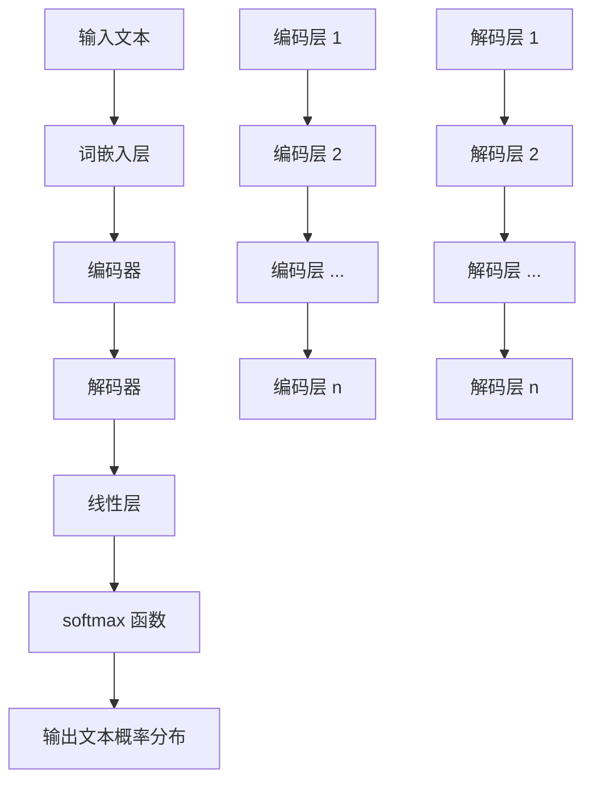

# 通过增加推理时间计算量提升大语言模型能力的方法

> 关键词：大语言模型、推理时间、计算量、模型能力提升、计算资源优化

> 摘要：本文围绕通过增加推理时间计算量来提升大语言模型能力这一主题展开深入探讨。首先介绍相关背景，明确目的、读者群体及文档结构等。接着阐述核心概念与联系，包括大语言模型的工作原理和架构。详细讲解核心算法原理及具体操作步骤，借助 Python 代码示例说明。通过数学模型和公式进一步剖析其内在机制，并举例说明。给出项目实战案例，包括开发环境搭建、源代码实现与解读。探讨实际应用场景，推荐相关工具和资源，如学习资料、开发工具、论文著作等。最后总结未来发展趋势与挑战，提供常见问题解答及扩展阅读参考资料，旨在为提升大语言模型能力提供全面、深入的技术指导和思路。

## 1. 背景介绍 
### 1.1 目的和范围
大语言模型在自然语言处理领域取得了显著进展，但仍面临诸多挑战，如生成内容的准确性、逻辑性和连贯性等。本研究的目的在于探索通过增加推理时间计算量的方式来提升大语言模型的能力，以改善其在各种自然语言处理任务中的表现。范围涵盖了对不同类型大语言模型的分析，以及多种增加计算量的方法和策略的研究。

### 1.2 预期读者
本文预期读者包括人工智能研究人员、计算机科学家、软件工程师、大语言模型开发者以及对自然语言处理技术感兴趣的技术爱好者。希望为他们在提升大语言模型性能方面提供有价值的参考和思路。

### 1.3 文档结构概述
本文将按照以下结构展开：首先介绍核心概念与联系，帮助读者理解大语言模型的基本原理和增加推理时间计算量的相关概念。接着阐述核心算法原理及具体操作步骤，通过 Python 代码进行详细说明。然后介绍数学模型和公式，深入剖析其内在机制。再通过项目实战案例展示具体实现过程和代码解读。之后探讨实际应用场景，推荐相关工具和资源。最后总结未来发展趋势与挑战，提供常见问题解答和扩展阅读参考资料。

### 1.4 术语表
#### 1.4.1 核心术语定义
- **大语言模型（Large Language Model）**：基于深度学习的自然语言处理模型，通常具有大量的参数和强大的语言理解与生成能力。
- **推理时间（Inference Time）**：模型对输入数据进行处理并生成输出结果所花费的时间。
- **计算量（Computational Complexity）**：模型在执行计算任务时所需的计算资源和操作次数。
- **模型能力（Model Capability）**：模型在各种自然语言处理任务中表现出的性能和效果，如准确性、逻辑性、连贯性等。

#### 1.4.2 相关概念解释
- **增加推理时间计算量**：通过增加模型在推理过程中的计算步骤、迭代次数或使用更复杂的计算方法，来提高模型对输入数据的处理能力和理解程度。
- **模型优化**：对模型的结构、参数或训练方法进行调整和改进，以提高模型的性能和效率。

#### 1.4.3 缩略词列表
- **NLP**：Natural Language Processing（自然语言处理）
- **GPT**：Generative Pretrained Transformer（生成式预训练变换器）
- **BERT**：Bidirectional Encoder Representations from Transformers（基于变换器的双向编码器表示）

## 2. 核心概念与联系 
### 核心概念原理
大语言模型通常基于神经网络架构，如 Transformer 架构。Transformer 架构由编码器和解码器组成，通过多头自注意力机制来捕捉输入序列中的长距离依赖关系。在推理过程中，模型接收输入文本，经过一系列的计算步骤，包括词嵌入、注意力计算、前馈神经网络计算等，最终生成输出文本。

增加推理时间计算量的核心原理在于通过增加这些计算步骤的复杂度或迭代次数，让模型有更多的机会对输入信息进行深入分析和处理。例如，可以增加注意力头的数量，让模型能够从更多的角度捕捉输入序列的特征；或者增加解码器的层数，使模型能够进行更深入的推理和生成。

### 架构的文本示意图
大语言模型的基本架构可以描述为：输入文本经过词嵌入层将文本转换为向量表示，然后进入编码器部分进行特征提取和编码，编码器通常由多个相同的编码层组成，每个编码层包含多头自注意力机制和前馈神经网络。编码后的特征再进入解码器部分，解码器同样由多个解码层组成，每个解码层包含自注意力机制、编码器 - 解码器注意力机制和前馈神经网络。最后，解码器的输出经过线性层和 softmax 函数生成输出文本的概率分布。

### Mermaid 流程图


## 3. 核心算法原理 & 具体操作步骤 
### 核心算法原理
以基于 Transformer 架构的大语言模型为例，其核心算法包括多头自注意力机制和前馈神经网络。

多头自注意力机制的计算过程如下：
1. 将输入向量 $X$ 分别乘以三个不同的权重矩阵 $W^Q$、$W^K$ 和 $W^V$，得到查询向量 $Q$、键向量 $K$ 和值向量 $V$。
2. 计算查询向量 $Q$ 和键向量 $K$ 的点积，得到注意力分数。
3. 对注意力分数进行缩放和平滑处理，得到注意力权重。
4. 将注意力权重与值向量 $V$ 相乘，得到加权和。
5. 将加权和通过线性变换得到多头自注意力机制的输出。

前馈神经网络则是一个简单的两层全连接神经网络，对多头自注意力机制的输出进行非线性变换。

### 具体操作步骤
以下是通过增加推理时间计算量提升大语言模型能力的具体操作步骤：

#### 步骤 1：增加注意力头的数量
在多头自注意力机制中，增加注意力头的数量可以让模型从更多的角度捕捉输入序列的特征。在实现时，可以调整模型的超参数，增加注意力头的数量。

#### 步骤 2：增加解码器的层数
增加解码器的层数可以使模型进行更深入的推理和生成。在实现时，可以在模型架构中添加更多的解码层。

#### 步骤 3：增加迭代次数
在推理过程中，可以增加模型的迭代次数，让模型有更多的机会对输入信息进行处理和优化。

### Python 源代码示例
```python
import torch
import torch.nn as nn

# 定义多头自注意力机制
class MultiHeadAttention(nn.Module):
    def __init__(self, d_model, num_heads):
        super(MultiHeadAttention, self).__init__()
        self.d_model = d_model
        self.num_heads = num_heads
        self.d_k = d_model // num_heads

        self.W_q = nn.Linear(d_model, d_model)
        self.W_k = nn.Linear(d_model, d_model)
        self.W_v = nn.Linear(d_model, d_model)
        self.W_o = nn.Linear(d_model, d_model)

    def forward(self, Q, K, V, mask=None):
        batch_size = Q.size(0)

        Q = self.W_q(Q).view(batch_size, -1, self.num_heads, self.d_k).transpose(1, 2)
        K = self.W_k(K).view(batch_size, -1, self.num_heads, self.d_k).transpose(1, 2)
        V = self.W_v(V).view(batch_size, -1, self.num_heads, self.d_k).transpose(1, 2)

        scores = torch.matmul(Q, K.transpose(-2, -1)) / (self.d_k ** 0.5)
        if mask is not None:
            scores = scores.masked_fill(mask == 0, -1e9)
        attention_weights = torch.softmax(scores, dim=-1)
        output = torch.matmul(attention_weights, V)
        output = output.transpose(1, 2).contiguous().view(batch_size, -1, self.d_model)
        output = self.W_o(output)
        return output

# 定义前馈神经网络
class PositionwiseFeedForward(nn.Module):
    def __init__(self, d_model, d_ff):
        super(PositionwiseFeedForward, self).__init__()
        self.fc1 = nn.Linear(d_model, d_ff)
        self.fc2 = nn.Linear(d_ff, d_model)
        self.relu = nn.ReLU()

    def forward(self, x):
        return self.fc2(self.relu(self.fc1(x)))

# 定义解码层
class DecoderLayer(nn.Module):
    def __init__(self, d_model, num_heads, d_ff):
        super(DecoderLayer, self).__init__()
        self.self_attn = MultiHeadAttention(d_model, num_heads)
        self.enc_dec_attn = MultiHeadAttention(d_model, num_heads)
        self.feed_forward = PositionwiseFeedForward(d_model, d_ff)
        self.norm1 = nn.LayerNorm(d_model)
        self.norm2 = nn.LayerNorm(d_model)
        self.norm3 = nn.LayerNorm(d_model)

    def forward(self, x, enc_output, src_mask=None, tgt_mask=None):
        attn_output = self.self_attn(x, x, x, tgt_mask)
        x = self.norm1(x + attn_output)
        enc_dec_attn_output = self.enc_dec_attn(x, enc_output, enc_output, src_mask)
        x = self.norm2(x + enc_dec_attn_output)
        ff_output = self.feed_forward(x)
        x = self.norm3(x + ff_output)
        return x

# 定义解码器
class Decoder(nn.Module):
    def __init__(self, num_layers, d_model, num_heads, d_ff):
        super(Decoder, self).__init__()
        self.layers = nn.ModuleList([DecoderLayer(d_model, num_heads, d_ff) for _ in range(num_layers)])

    def forward(self, x, enc_output, src_mask=None, tgt_mask=None):
        for layer in self.layers:
            x = layer(x, enc_output, src_mask, tgt_mask)
        return x

# 示例使用
d_model = 512
num_heads = 8
d_ff = 2048
num_layers = 6

decoder = Decoder(num_layers, d_model, num_heads, d_ff)
batch_size = 32
seq_len = 10
input_tensor = torch.randn(batch_size, seq_len, d_model)
enc_output = torch.randn(batch_size, seq_len, d_model)
output = decoder(input_tensor, enc_output)
print(output.shape)
```

## 4. 数学模型和公式 & 详细讲解 & 举例说明 
### 多头自注意力机制的数学模型和公式
多头自注意力机制的数学模型可以表示为：

$$
\text{MultiHead}(Q, K, V) = \text{Concat}(\text{head}_1, \cdots, \text{head}_h)W^O
$$

其中，

$$
\text{head}_i = \text{Attention}(QW_i^Q, KW_i^K, VW_i^V)
$$

$$
\text{Attention}(Q, K, V) = \text{softmax}\left(\frac{QK^T}{\sqrt{d_k}}\right)V
$$

$Q$ 是查询向量，$K$ 是键向量，$V$ 是值向量，$W_i^Q$、$W_i^K$ 和 $W_i^V$ 是第 $i$ 个注意力头的权重矩阵，$W^O$ 是输出的权重矩阵，$d_k$ 是查询和键向量的维度。

### 详细讲解
多头自注意力机制通过将输入向量分别投影到多个低维子空间中，每个子空间对应一个注意力头，然后在每个子空间中计算注意力分数和加权和，最后将所有子空间的输出拼接起来并通过线性变换得到最终的输出。这样可以让模型从多个角度捕捉输入序列的特征，提高模型的表达能力。

### 举例说明
假设输入向量 $X$ 的维度为 $d_{model} = 512$，注意力头的数量 $h = 8$，则每个注意力头的维度 $d_k = d_{model} // h = 64$。在计算过程中，$X$ 分别乘以 $W^Q$、$W^K$ 和 $W^V$ 得到查询向量 $Q$、键向量 $K$ 和值向量 $V$，然后在每个注意力头中计算注意力分数和加权和，最后将 8 个注意力头的输出拼接起来并通过线性变换得到多头自注意力机制的输出。

### 前馈神经网络的数学模型和公式
前馈神经网络的数学模型可以表示为：

$$
\text{FFN}(x) = \text{max}(0, xW_1 + b_1)W_2 + b_2
$$

其中，$x$ 是输入向量，$W_1$ 和 $W_2$ 是权重矩阵，$b_1$ 和 $b_2$ 是偏置向量。

### 详细讲解
前馈神经网络是一个简单的两层全连接神经网络，第一层使用 ReLU 激活函数进行非线性变换，第二层进行线性变换。前馈神经网络的作用是对多头自注意力机制的输出进行进一步的处理和变换，提高模型的表达能力。

### 举例说明
假设输入向量 $x$ 的维度为 $d_{model} = 512$，中间层的维度 $d_{ff} = 2048$，则 $W_1$ 的维度为 $(512, 2048)$，$W_2$ 的维度为 $(2048, 512)$。$x$ 乘以 $W_1$ 并加上偏置 $b_1$ 后，通过 ReLU 激活函数进行非线性变换，然后再乘以 $W_2$ 并加上偏置 $b_2$ 得到前馈神经网络的输出。

## 5. 项目实战：代码实际案例和详细解释说明 
### 5.1  开发环境搭建
#### 安装 Python
首先需要安装 Python 环境，建议使用 Python 3.7 及以上版本。可以从 Python 官方网站（https://www.python.org/downloads/） 下载并安装。

#### 安装深度学习框架
本文使用 PyTorch 作为深度学习框架，可以使用以下命令安装：
```sh
pip install torch torchvision
```

#### 安装其他依赖库
还需要安装一些其他的依赖库，如 numpy、matplotlib 等，可以使用以下命令安装：
```sh
pip install numpy matplotlib
```

### 5.2  源代码详细实现和代码解读
以下是一个完整的基于 PyTorch 的大语言模型示例代码，通过增加解码器的层数和注意力头的数量来提升模型能力：

```python
import torch
import torch.nn as nn
import torch.optim as optim
import numpy as np

# 定义多头自注意力机制
class MultiHeadAttention(nn.Module):
    def __init__(self, d_model, num_heads):
        super(MultiHeadAttention, self).__init__()
        self.d_model = d_model
        self.num_heads = num_heads
        self.d_k = d_model // num_heads

        self.W_q = nn.Linear(d_model, d_model)
        self.W_k = nn.Linear(d_model, d_model)
        self.W_v = nn.Linear(d_model, d_model)
        self.W_o = nn.Linear(d_model, d_model)

    def forward(self, Q, K, V, mask=None):
        batch_size = Q.size(0)

        Q = self.W_q(Q).view(batch_size, -1, self.num_heads, self.d_k).transpose(1, 2)
        K = self.W_k(K).view(batch_size, -1, self.num_heads, self.d_k).transpose(1, 2)
        V = self.W_v(V).view(batch_size, -1, self.num_heads, self.d_k).transpose(1, 2)

        scores = torch.matmul(Q, K.transpose(-2, -1)) / (self.d_k ** 0.5)
        if mask is not None:
            scores = scores.masked_fill(mask == 0, -1e9)
        attention_weights = torch.softmax(scores, dim=-1)
        output = torch.matmul(attention_weights, V)
        output = output.transpose(1, 2).contiguous().view(batch_size, -1, self.d_model)
        output = self.W_o(output)
        return output

# 定义前馈神经网络
class PositionwiseFeedForward(nn.Module):
    def __init__(self, d_model, d_ff):
        super(PositionwiseFeedForward, self).__init__()
        self.fc1 = nn.Linear(d_model, d_ff)
        self.fc2 = nn.Linear(d_ff, d_model)
        self.relu = nn.ReLU()

    def forward(self, x):
        return self.fc2(self.relu(self.fc1(x)))

# 定义解码层
class DecoderLayer(nn.Module):
    def __init__(self, d_model, num_heads, d_ff):
        super(DecoderLayer, self).__init__()
        self.self_attn = MultiHeadAttention(d_model, num_heads)
        self.enc_dec_attn = MultiHeadAttention(d_model, num_heads)
        self.feed_forward = PositionwiseFeedForward(d_model, d_ff)
        self.norm1 = nn.LayerNorm(d_model)
        self.norm2 = nn.LayerNorm(d_model)
        self.norm3 = nn.LayerNorm(d_model)

    def forward(self, x, enc_output, src_mask=None, tgt_mask=None):
        attn_output = self.self_attn(x, x, x, tgt_mask)
        x = self.norm1(x + attn_output)
        enc_dec_attn_output = self.enc_dec_attn(x, enc_output, enc_output, src_mask)
        x = self.norm2(x + enc_dec_attn_output)
        ff_output = self.feed_forward(x)
        x = self.norm3(x + ff_output)
        return x

# 定义解码器
class Decoder(nn.Module):
    def __init__(self, num_layers, d_model, num_heads, d_ff):
        super(Decoder, self).__init__()
        self.layers = nn.ModuleList([DecoderLayer(d_model, num_heads, d_ff) for _ in range(num_layers)])

    def forward(self, x, enc_output, src_mask=None, tgt_mask=None):
        for layer in self.layers:
            x = layer(x, enc_output, src_mask, tgt_mask)
        return x

# 定义大语言模型
class LargeLanguageModel(nn.Module):
    def __init__(self, num_layers, d_model, num_heads, d_ff, vocab_size):
        super(LargeLanguageModel, self).__init__()
        self.embedding = nn.Embedding(vocab_size, d_model)
        self.decoder = Decoder(num_layers, d_model, num_heads, d_ff)
        self.fc = nn.Linear(d_model, vocab_size)

    def forward(self, x, enc_output, src_mask=None, tgt_mask=None):
        x = self.embedding(x)
        x = self.decoder(x, enc_output, src_mask, tgt_mask)
        x = self.fc(x)
        return x

# 训练模型
def train_model(model, train_data, optimizer, criterion, epochs):
    model.train()
    for epoch in range(epochs):
        total_loss = 0
        for inputs, targets in train_data:
            optimizer.zero_grad()
            outputs = model(inputs, enc_output=None)
            loss = criterion(outputs.view(-1, outputs.size(-1)), targets.view(-1))
            loss.backward()
            optimizer.step()
            total_loss += loss.item()
        print(f'Epoch {epoch + 1}/{epochs}, Loss: {total_loss / len(train_data)}')

# 示例使用
d_model = 512
num_heads = 8
d_ff = 2048
num_layers = 6
vocab_size = 10000
batch_size = 32
seq_len = 10
epochs = 10

model = LargeLanguageModel(num_layers, d_model, num_heads, d_ff, vocab_size)
optimizer = optim.Adam(model.parameters(), lr=0.001)
criterion = nn.CrossEntropyLoss()

# 生成示例训练数据
train_data = []
for _ in range(100):
    inputs = torch.randint(0, vocab_size, (batch_size, seq_len))
    targets = torch.randint(0, vocab_size, (batch_size, seq_len))
    train_data.append((inputs, targets))

train_model(model, train_data, optimizer, criterion, epochs)
```

### 5.3  代码解读与分析
#### 多头自注意力机制
`MultiHeadAttention` 类实现了多头自注意力机制，通过将输入向量分别投影到多个低维子空间中，每个子空间对应一个注意力头，然后在每个子空间中计算注意力分数和加权和，最后将所有子空间的输出拼接起来并通过线性变换得到最终的输出。

#### 前馈神经网络
`PositionwiseFeedForward` 类实现了前馈神经网络，是一个简单的两层全连接神经网络，第一层使用 ReLU 激活函数进行非线性变换，第二层进行线性变换。

#### 解码层
`DecoderLayer` 类实现了解码层，包含自注意力机制、编码器 - 解码器注意力机制和前馈神经网络，通过残差连接和层归一化来提高模型的训练稳定性。

#### 解码器
`Decoder` 类实现了解码器，由多个解码层组成，通过迭代调用解码层来进行推理和生成。

#### 大语言模型
`LargeLanguageModel` 类实现了大语言模型，包含词嵌入层、解码器和线性层，通过将输入文本转换为向量表示，然后通过解码器进行推理和生成，最后通过线性层生成输出文本的概率分布。

#### 训练模型
`train_model` 函数实现了模型的训练过程，通过迭代训练数据，计算损失并进行反向传播和参数更新。

## 6. 实际应用场景 
### 文本生成任务
在文本生成任务中，如故事生成、诗歌创作、对话生成等，通过增加推理时间计算量可以提高生成文本的质量和连贯性。例如，在故事生成中，模型可以有更多的时间对故事情节进行深入推理和构思，生成更加精彩和连贯的故事。

### 机器翻译任务
在机器翻译任务中，增加推理时间计算量可以让模型更好地理解源语言文本的语义和语法结构，从而生成更加准确和自然的目标语言翻译。例如，在翻译复杂的句子时，模型可以通过更多的计算步骤来分析句子的结构和语义，提高翻译的质量。

### 问答系统任务
在问答系统任务中，增加推理时间计算量可以让模型更好地理解问题的含义，从知识库中检索相关信息并进行推理和回答。例如，在回答复杂的问题时，模型可以通过更多的计算步骤来分析问题的背景和上下文，提供更加准确和详细的答案。

## 7. 工具和资源推荐
### 7.1 学习资源推荐
#### 7.1.1 书籍推荐
- 《深度学习》（Deep Learning）：由 Ian Goodfellow、Yoshua Bengio 和 Aaron Courville 所著，是深度学习领域的经典教材，涵盖了深度学习的基本概念、算法和应用。
- 《自然语言处理入门》（Natural Language Processing with Python）：由 Steven Bird、Ewan Klein 和 Edward Loper 所著，介绍了使用 Python 进行自然语言处理的基本方法和技术。
- 《Transformer 自然语言处理》（Transformers for Natural Language Processing）：由 Denis Rothman 所著，深入介绍了 Transformer 架构及其在自然语言处理中的应用。

#### 7.1.2 在线课程
- Coursera 上的《深度学习专项课程》（Deep Learning Specialization）：由 Andrew Ng 教授讲授，包括深度学习的基础知识、卷积神经网络、循环神经网络等内容。
- edX 上的《自然语言处理》（Natural Language Processing）：由哥伦比亚大学的教授讲授，介绍了自然语言处理的基本概念、算法和应用。
- 吴恩达的《机器学习》课程：介绍了机器学习的基本概念、算法和应用，为学习深度学习和自然语言处理打下基础。

#### 7.1.3 技术博客和网站
- Medium 上的 Towards Data Science：是一个专注于数据科学和人工智能的技术博客，提供了大量关于深度学习和自然语言处理的文章和教程。
- arXiv.org：是一个预印本数据库，提供了大量关于深度学习和自然语言处理的最新研究成果和论文。
- Hugging Face Blog：是 Hugging Face 公司的技术博客，提供了关于大语言模型和自然语言处理的最新技术和应用案例。

### 7.2 开发工具框架推荐
#### 7.2.1 IDE和编辑器
- PyCharm：是一款专门为 Python 开发设计的集成开发环境，提供了丰富的代码编辑、调试和分析功能。
- Visual Studio Code：是一款轻量级的代码编辑器，支持多种编程语言，并且有丰富的插件可以扩展其功能。
- Jupyter Notebook：是一个交互式的笔记本环境，非常适合进行数据分析和模型开发。

#### 7.2.2 调试和性能分析工具
- PyTorch Profiler：是 PyTorch 提供的性能分析工具，可以帮助开发者分析模型的性能瓶颈和资源使用情况。
- TensorBoard：是 TensorFlow 提供的可视化工具，也可以与 PyTorch 结合使用，用于可视化模型的训练过程和性能指标。
- NVIDIA Nsight Systems：是 NVIDIA 提供的性能分析工具，可以帮助开发者分析 GPU 加速的深度学习模型的性能瓶颈。

#### 7.2.3 相关框架和库
- PyTorch：是一个开源的深度学习框架，提供了丰富的神经网络模块和优化算法，广泛应用于自然语言处理和计算机视觉等领域。
- Hugging Face Transformers：是一个开源的自然语言处理库，提供了大量预训练的大语言模型和工具，方便开发者进行自然语言处理任务的开发。
- SpaCy：是一个开源的自然语言处理库，提供了高效的文本处理和分析功能，广泛应用于信息提取、文本分类等任务。

### 7.3 相关论文著作推荐
#### 7.3.1 经典论文
- 《Attention Is All You Need》：提出了 Transformer 架构，是自然语言处理领域的里程碑式论文。
- 《BERT: Pre-training of Deep Bidirectional Transformers for Language Understanding》：提出了 BERT 模型，开创了预训练 - 微调的自然语言处理范式。
- 《GPT: Generative Pretrained Transformer》：提出了 GPT 模型，是生成式预训练语言模型的代表。

#### 7.3.2 最新研究成果
- 《GPT-3: Language Models are Few-Shot Learners》：介绍了 GPT-3 模型的强大能力和应用场景。
- 《T5: Exploring the Limits of Transfer Learning with a Unified Text-to-Text Transformer》：提出了 T5 模型，强调了统一的文本到文本的转换框架。
- 《XLNet: Generalized Autoregressive Pretraining for Language Understanding》：提出了 XLNet 模型，结合了自回归和自编码的优点。

#### 7.3.3 应用案例分析
- 《Natural Language Processing with Deep Learning》：介绍了深度学习在自然语言处理中的应用案例和技术细节。
- 《Speech and Language Processing》：是自然语言处理领域的经典教材，提供了大量的应用案例和实践经验。
- 《Deep Learning for Natural Language Processing》：介绍了深度学习在自然语言处理中的最新应用和研究成果。

## 8. 总结：未来发展趋势与挑战
### 未来发展趋势
- **模型规模不断增大**：随着计算资源的不断提升，大语言模型的规模将继续增大，参数数量将达到数十亿甚至数百亿，从而进一步提高模型的能力和性能。
- **多模态融合**：大语言模型将与计算机视觉、语音识别等技术进行融合，实现多模态的自然语言处理，如图文问答、语音交互等。
- **个性化定制**：根据用户的需求和偏好，为用户提供个性化的大语言模型服务，如个性化的文本生成、智能助手等。
- **高效计算方法**：研究和开发更加高效的计算方法和算法，以减少推理时间和计算资源的消耗，提高模型的效率和可扩展性。

### 挑战
- **计算资源需求巨大**：增加推理时间计算量会导致模型的计算资源需求急剧增加，需要强大的硬件支持，如 GPU 集群、TPU 等，这对于很多开发者和企业来说是一个巨大的挑战。
- **训练时间长**：模型规模的增大和计算量的增加会导致训练时间大幅延长，需要花费大量的时间和精力进行模型训练和调优。
- **数据隐私和安全问题**：大语言模型通常需要大量的数据进行训练，这些数据可能包含用户的隐私信息，如何保障数据的隐私和安全是一个重要的问题。
- **可解释性差**：大语言模型通常是基于深度学习的黑盒模型，其决策过程和推理机制难以解释，这在一些对可解释性要求较高的领域，如医疗、金融等，是一个限制因素。

## 9. 附录：常见问题与解答
### 问题 1：增加推理时间计算量一定会提升大语言模型的能力吗？
不一定。增加推理时间计算量只是一种提升模型能力的方法，但并不是绝对有效的。如果模型的架构设计不合理，或者训练数据质量不高，增加计算量可能无法带来明显的性能提升，甚至可能导致过拟合等问题。

### 问题 2：如何平衡推理时间和模型能力之间的关系？
需要根据具体的应用场景和需求来平衡推理时间和模型能力之间的关系。在对实时性要求较高的场景中，如对话系统、实时翻译等，需要在保证一定模型能力的前提下，尽量减少推理时间；而在对实时性要求不高的场景中，如文本生成、知识问答等，可以适当增加推理时间来提升模型的能力。

### 问题 3：增加推理时间计算量会带来哪些额外的成本？
增加推理时间计算量会带来以下额外的成本：
- **计算资源成本**：需要更多的计算资源，如 GPU、TPU 等，这会增加硬件采购和使用成本。
- **能源成本**：更多的计算资源会消耗更多的能源，增加能源成本。
- **时间成本**：增加推理时间会导致模型的响应时间变长，影响用户体验，在一些实时性要求较高的场景中可能无法满足需求。

### 问题 4：如何评估增加推理时间计算量对模型能力的提升效果？
可以使用以下方法评估增加推理时间计算量对模型能力的提升效果：
- **指标评估**：使用一些常用的自然语言处理指标，如准确率、召回率、F1 值、BLEU 值等，来评估模型在不同任务中的性能表现。
- **人工评估**：邀请专业的人员对模型生成的结果进行人工评估，如评估生成文本的质量、逻辑性、连贯性等。
- **用户反馈**：收集用户的反馈意见，了解用户对模型生成结果的满意度和使用体验。

## 10. 扩展阅读 & 参考资料
- 《人工智能：现代方法》（Artificial Intelligence: A Modern Approach）
- 《深度学习实战》（Deep Learning in Practice）
- 《自然语言处理实战》（Natural Language Processing in Practice）
- OpenAI 官方文档（https://openai.com/）
- Hugging Face 官方文档（https://huggingface.co/）
- PyTorch 官方文档（https://pytorch.org/）