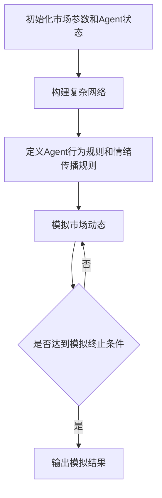

# 金融市场情绪传染效应模拟系统

> 关键词：金融市场、情绪传染效应、模拟系统、复杂网络、Agent-based模型

> 摘要：本文围绕金融市场情绪传染效应模拟系统展开深入研究。首先介绍了该系统的背景，包括目的、预期读者、文档结构和相关术语。接着阐述了核心概念与联系，构建了相应的原理和架构示意图以及流程图。详细讲解了核心算法原理，用Python代码实现具体操作步骤。给出了相关数学模型和公式，并举例说明。通过项目实战，从开发环境搭建、源代码实现到代码解读进行了全面分析。探讨了系统的实际应用场景，推荐了学习资源、开发工具框架和相关论文著作。最后总结了未来发展趋势与挑战，提供了常见问题解答和扩展阅读参考资料，旨在为金融市场情绪传染效应的研究和模拟提供全面且深入的指导。

## 1. 背景介绍 
### 1.1 目的和范围
金融市场的情绪传染效应是影响市场波动的重要因素之一。投资者的情绪会在市场参与者之间相互传播，进而影响资产价格和市场稳定性。本模拟系统的目的是构建一个能够模拟金融市场中情绪传染过程的系统，帮助研究人员和投资者更好地理解情绪传染效应的机制和影响。

系统的范围涵盖了对金融市场参与者的建模、情绪传播规则的设定、市场动态的模拟等方面。通过模拟不同的市场场景和情绪传播模式，我们可以分析情绪传染对市场价格、交易量等指标的影响，为市场监管、投资决策等提供参考。

### 1.2 预期读者
本文的预期读者包括金融领域的研究人员、投资者、市场监管者以及对复杂系统模拟和人工智能在金融领域应用感兴趣的技术人员。对于金融研究人员，该系统可以作为研究情绪传染理论的实验平台；投资者可以利用模拟结果优化投资策略；市场监管者可以通过模拟了解市场情绪波动的潜在风险；技术人员可以借鉴系统的设计和实现思路，开展相关的研究和开发工作。

### 1.3 文档结构概述
本文将按照以下结构进行组织：
- 核心概念与联系：介绍金融市场情绪传染效应的基本概念，构建系统的原理和架构，并给出相应的流程图。
- 核心算法原理 & 具体操作步骤：详细讲解系统所采用的核心算法，并用Python代码实现具体的操作步骤。
- 数学模型和公式 & 详细讲解 & 举例说明：给出系统涉及的数学模型和公式，进行详细的讲解，并通过具体例子说明其应用。
- 项目实战：代码实际案例和详细解释说明：包括开发环境的搭建、源代码的详细实现和代码解读。
- 实际应用场景：探讨系统在金融市场研究、投资决策、市场监管等方面的实际应用场景。
- 工具和资源推荐：推荐学习相关知识的资源、开发工具框架和相关论文著作。
- 总结：未来发展趋势与挑战：总结系统的发展趋势和面临的挑战。
- 附录：常见问题与解答：解答读者可能遇到的常见问题。
- 扩展阅读 & 参考资料：提供扩展阅读的建议和参考资料。

### 1.4 术语表
#### 1.4.1 核心术语定义
- **金融市场情绪**：投资者对金融市场的乐观、悲观或中性的心理状态，这种心理状态会影响他们的投资决策。
- **情绪传染效应**：投资者的情绪在市场参与者之间相互传播的现象，类似于传染病的传播。
- **Agent-based模型**：一种基于个体的建模方法，将金融市场中的参与者看作具有不同特征和行为规则的Agent，通过模拟Agent之间的交互来研究市场的整体行为。
- **复杂网络**：一种用于描述系统中个体之间相互关系的网络结构，在金融市场中可以用来表示投资者之间的信息传播和情绪传染关系。

#### 1.4.2 相关概念解释
- **羊群效应**：投资者在决策时往往会受到其他投资者的影响，跟随大多数人的行为，这种现象在情绪传染的作用下会更加明显。
- **反馈机制**：市场价格的变化会影响投资者的情绪，而投资者的情绪又会进一步影响市场价格，形成一种反馈循环。
- **信息传播**：投资者通过各种渠道获取市场信息，信息的传播会影响投资者的情绪和决策，进而影响市场的情绪传染效应。

#### 1.4.3 缩略词列表
- **ABM**：Agent-based Model（基于Agent的模型）
- **SIR模型**：Susceptible-Infected-Recovered model（易感-感染-恢复模型）

## 2. 核心概念与联系 
### 核心概念原理
金融市场情绪传染效应模拟系统主要基于Agent-based模型和复杂网络理论。在这个系统中，金融市场的参与者被抽象为一个个Agent，每个Agent具有自己的情绪状态（如乐观、悲观、中性）和投资策略。这些Agent通过复杂网络相互连接，网络中的边表示Agent之间的信息传播和情绪传染关系。

情绪传染的过程类似于传染病的传播。一个处于乐观（或悲观）情绪状态的Agent可以将其情绪传播给与其相连的其他Agent，使其他Agent也转变为相同的情绪状态。同时，Agent的情绪状态也会受到市场信息、自身投资经验等因素的影响。

### 架构示意图
```plaintext
+---------------------+
| 金融市场情绪传染模拟系统 |
+---------------------+
| 输入层             |
| - 市场初始参数       |
| - Agent初始状态      |
| - 网络拓扑结构       |
+---------------------+
| 处理层             |
| - Agent行为规则定义  |
| - 情绪传播规则定义  |
| - 市场动态模拟      |
+---------------------+
| 输出层             |
| - 市场价格走势      |
| - 交易量变化       |
| - Agent情绪分布     |
+---------------------+
```

### Mermaid流程图


## 3. 核心算法原理 & 具体操作步骤 
### 核心算法原理
本系统主要采用Agent-based模型进行模拟，结合SIR模型的思想来描述情绪传染过程。SIR模型将人群分为易感者（Susceptible）、感染者（Infected）和恢复者（Recovered）三类，在金融市场情绪传染中，我们可以将Agent的情绪状态分为乐观（类似感染者）、悲观（类似感染者）和中性（类似易感者）。

Agent的行为规则包括投资决策和情绪更新。投资决策取决于Agent的情绪状态和市场信息，情绪更新则受到自身情绪惯性、相邻Agent情绪影响和市场信息的综合作用。

### 具体操作步骤及Python代码实现
```python
import networkx as nx
import numpy as np

# 定义Agent类
class Agent:
    def __init__(self, id, initial_emotion):
        self.id = id
        self.emotion = initial_emotion
        self.investment = 0

    def update_emotion(self, neighbors, market_info, emotion_inertia=0.8, infection_rate=0.2):
        neighbor_emotions = [neighbor.emotion for neighbor in neighbors]
        positive_count = neighbor_emotions.count('optimistic')
        negative_count = neighbor_emotions.count('pessimistic')

        # 自身情绪惯性
        if np.random.rand() < emotion_inertia:
            pass
        else:
            if positive_count > negative_count and market_info > 0:
                self.emotion = 'optimistic'
            elif negative_count > positive_count and market_info < 0:
                self.emotion = 'pessimistic'
            else:
                self.emotion = 'neutral'

    def make_investment(self, market_price):
        if self.emotion == 'optimistic':
            self.investment = 1
        elif self.emotion == 'pessimistic':
            self.investment = -1
        else:
            self.investment = 0

# 定义模拟系统类
class FinancialMarketSimulation:
    def __init__(self, num_agents, initial_emotions, network_type='random'):
        self.num_agents = num_agents
        self.agents = [Agent(i, initial_emotions[i]) for i in range(num_agents)]
        if network_type == 'random':
            self.network = nx.erdos_renyi_graph(num_agents, 0.2)
        elif network_type == 'scale_free':
            self.network = nx.barabasi_albert_graph(num_agents, 2)

    def simulate(self, num_steps, market_info_generator):
        prices = []
        volumes = []
        emotions = []
        market_price = 100

        for step in range(num_steps):
            market_info = market_info_generator(step)

            # 更新Agent情绪
            for agent in self.agents:
                neighbors = [self.agents[n] for n in self.network.neighbors(agent.id)]
                agent.update_emotion(neighbors, market_info)

            # Agent做出投资决策
            total_investment = 0
            for agent in self.agents:
                agent.make_investment(market_price)
                total_investment += agent.investment

            # 更新市场价格
            market_price += total_investment * 0.1
            prices.append(market_price)

            # 计算交易量
            volume = sum([abs(agent.investment) for agent in self.agents])
            volumes.append(volume)

            # 记录Agent情绪分布
            emotion_distribution = [agent.emotion for agent in self.agents]
            emotions.append(emotion_distribution)

        return prices, volumes, emotions

# 市场信息生成函数示例
def market_info_generator(step):
    return np.random.normal(0, 1)

# 初始化模拟系统
num_agents = 100
initial_emotions = np.random.choice(['optimistic', 'pessimistic', 'neutral'], num_agents)
simulation = FinancialMarketSimulation(num_agents, initial_emotions)

# 进行模拟
num_steps = 100
prices, volumes, emotions = simulation.simulate(num_steps, market_info_generator)

# 输出结果
print("市场价格走势:", prices)
print("交易量变化:", volumes)
```

## 4. 数学模型和公式 & 详细讲解 & 举例说明 
### 情绪更新模型
假设Agent $i$ 在时刻 $t$ 的情绪状态用 $E_i(t)$ 表示，其取值为 $\{optimistic, pessimistic, neutral\}$。Agent $i$ 的相邻Agent集合为 $N_i$。

情绪更新规则可以用以下公式表示：

$$
P(E_i(t + 1) = optimistic) = 
\begin{cases}
\alpha & \text{if } \sum_{j \in N_i} I(E_j(t) = optimistic) > \sum_{j \in N_i} I(E_j(t) = pessimistic) \text{ and } M(t) > 0 \\
\beta & \text{otherwise}
\end{cases}
$$

$$
P(E_i(t + 1) = pessimistic) = 
\begin{cases}
\alpha & \text{if } \sum_{j \in N_i} I(E_j(t) = pessimistic) > \sum_{j \in N_i} I(E_j(t) = optimistic) \text{ and } M(t) < 0 \\
\beta & \text{otherwise}
\end{cases}
$$

$$
P(E_i(t + 1) = neutral) = 1 - P(E_i(t + 1) = optimistic) - P(E_i(t + 1) = pessimistic)
$$

其中，$I(\cdot)$ 是指示函数，$M(t)$ 是时刻 $t$ 的市场信息，$\alpha$ 和 $\beta$ 是情绪更新概率参数。

### 投资决策模型
Agent $i$ 在时刻 $t$ 的投资决策 $I_i(t)$ 可以表示为：

$$
I_i(t) = 
\begin{cases}
1 & \text{if } E_i(t) = optimistic \\
-1 & \text{if } E_i(t) = pessimistic \\
0 & \text{if } E_i(t) = neutral
\end{cases}
$$

### 市场价格更新模型
市场价格 $P(t)$ 在时刻 $t + 1$ 的更新公式为：

$$
P(t + 1) = P(t) + \gamma \sum_{i = 1}^{n} I_i(t)
$$

其中，$\gamma$ 是价格调整系数，$n$ 是Agent的数量。

### 举例说明
假设市场中有3个Agent，初始情绪状态分别为 $E_1(0) = optimistic$，$E_2(0) = neutral$，$E_3(0) = pessimistic$。Agent之间的连接关系为 $N_1 = \{2\}$，$N_2 = \{1, 3\}$，$N_3 = \{2\}$。

在时刻 $t = 0$，市场信息 $M(0) = 0.5$。

- Agent 1：由于其相邻Agent 2的情绪为中性，且市场信息为正，根据情绪更新规则，Agent 1保持乐观情绪，即 $E_1(1) = optimistic$。投资决策 $I_1(1) = 1$。
- Agent 2：相邻Agent 1乐观，Agent 3悲观，且市场信息为正，Agent 2转变为乐观情绪，即 $E_2(1) = optimistic$。投资决策 $I_2(1) = 1$。
- Agent 3：相邻Agent 2转变为乐观，且市场信息为正，Agent 3转变为乐观情绪，即 $E_3(1) = optimistic$。投资决策 $I_3(1) = 1$。

假设初始市场价格 $P(0) = 100$，价格调整系数 $\gamma = 0.1$，则时刻 $t = 1$ 的市场价格为：

$$
P(1) = P(0) + \gamma (I_1(1) + I_2(1) + I_3(1)) = 100 + 0.1\times(1 + 1 + 1) = 100.3
$$

## 5. 项目实战：代码实际案例和详细解释说明 
### 5.1  开发环境搭建
- **Python环境**：建议使用Python 3.7及以上版本。可以从Python官方网站（https://www.python.org/downloads/）下载并安装。
- **依赖库安装**：本项目需要使用 `networkx`、`numpy` 等库。可以使用以下命令进行安装：
```sh
pip install networkx numpy
```

### 5.2  源代码详细实现和代码解读
```python
import networkx as nx
import numpy as np

# 定义Agent类
class Agent:
    def __init__(self, id, initial_emotion):
        # 初始化Agent的ID和初始情绪状态
        self.id = id
        self.emotion = initial_emotion
        # 初始化投资决策为0
        self.investment = 0

    def update_emotion(self, neighbors, market_info, emotion_inertia=0.8, infection_rate=0.2):
        # 获取相邻Agent的情绪状态
        neighbor_emotions = [neighbor.emotion for neighbor in neighbors]
        # 统计相邻Agent中乐观和悲观情绪的数量
        positive_count = neighbor_emotions.count('optimistic')
        negative_count = neighbor_emotions.count('pessimistic')

        # 自身情绪惯性
        if np.random.rand() < emotion_inertia:
            # 以一定概率保持当前情绪
            pass
        else:
            if positive_count > negative_count and market_info > 0:
                # 如果相邻乐观Agent多且市场信息为正，转变为乐观情绪
                self.emotion = 'optimistic'
            elif negative_count > positive_count and market_info < 0:
                # 如果相邻悲观Agent多且市场信息为负，转变为悲观情绪
                self.emotion = 'pessimistic'
            else:
                # 否则转变为中性情绪
                self.emotion = 'neutral'

    def make_investment(self, market_price):
        # 根据情绪状态做出投资决策
        if self.emotion == 'optimistic':
            self.investment = 1
        elif self.emotion == 'pessimistic':
            self.investment = -1
        else:
            self.investment = 0

# 定义模拟系统类
class FinancialMarketSimulation:
    def __init__(self, num_agents, initial_emotions, network_type='random'):
        # 初始化Agent数量
        self.num_agents = num_agents
        # 创建Agent列表
        self.agents = [Agent(i, initial_emotions[i]) for i in range(num_agents)]
        # 根据网络类型构建复杂网络
        if network_type == 'random':
            self.network = nx.erdos_renyi_graph(num_agents, 0.2)
        elif network_type == 'scale_free':
            self.network = nx.barabasi_albert_graph(num_agents, 2)

    def simulate(self, num_steps, market_info_generator):
        # 初始化市场价格、交易量和情绪分布列表
        prices = []
        volumes = []
        emotions = []
        # 初始市场价格
        market_price = 100

        for step in range(num_steps):
            # 生成当前步骤的市场信息
            market_info = market_info_generator(step)

            # 更新Agent情绪
            for agent in self.agents:
                # 获取相邻Agent列表
                neighbors = [self.agents[n] for n in self.network.neighbors(agent.id)]
                # 调用Agent的情绪更新方法
                agent.update_emotion(neighbors, market_info)

            # Agent做出投资决策
            total_investment = 0
            for agent in self.agents:
                # 调用Agent的投资决策方法
                agent.make_investment(market_price)
                total_investment += agent.investment

            # 更新市场价格
            market_price += total_investment * 0.1
            prices.append(market_price)

            # 计算交易量
            volume = sum([abs(agent.investment) for agent in self.agents])
            volumes.append(volume)

            # 记录Agent情绪分布
            emotion_distribution = [agent.emotion for agent in self.agents]
            emotions.append(emotion_distribution)

        return prices, volumes, emotions

# 市场信息生成函数示例
def market_info_generator(step):
    # 生成随机的市场信息
    return np.random.normal(0, 1)

# 初始化模拟系统
num_agents = 100
initial_emotions = np.random.choice(['optimistic', 'pessimistic', 'neutral'], num_agents)
simulation = FinancialMarketSimulation(num_agents, initial_emotions)

# 进行模拟
num_steps = 100
prices, volumes, emotions = simulation.simulate(num_steps, market_info_generator)

# 输出结果
print("市场价格走势:", prices)
print("交易量变化:", volumes)
```

### 5.3  代码解读与分析
- **Agent类**：封装了Agent的基本属性和行为方法。`__init__` 方法初始化Agent的ID、情绪状态和投资决策。`update_emotion` 方法根据相邻Agent的情绪和市场信息更新自身情绪，考虑了情绪惯性。`make_investment` 方法根据情绪状态做出投资决策。
- **FinancialMarketSimulation类**：封装了整个模拟系统的逻辑。`__init__` 方法初始化Agent数量、Agent列表和复杂网络。`simulate` 方法进行模拟，在每个步骤中更新Agent情绪、做出投资决策、更新市场价格和计算交易量，并记录相关数据。
- **市场信息生成函数**：`market_info_generator` 函数用于生成随机的市场信息，模拟市场的不确定性。

通过运行上述代码，我们可以得到市场价格走势和交易量变化的模拟结果，从而分析情绪传染效应在金融市场中的影响。

## 6. 实际应用场景 
### 金融市场研究
研究人员可以使用该模拟系统来验证和发展金融市场情绪传染的理论模型。通过改变模拟参数（如Agent数量、网络拓扑结构、情绪传播概率等），可以研究不同因素对情绪传染效应和市场动态的影响。例如，研究不同网络结构下情绪传染的速度和范围，以及情绪传染对市场价格波动和交易量的影响机制。

### 投资决策
投资者可以利用模拟系统的结果来优化投资策略。通过模拟不同市场场景下的情绪传染过程，投资者可以预测市场价格的走势和波动情况，从而做出更合理的投资决策。例如，在市场情绪乐观时，投资者可以适当增加投资；在市场情绪悲观时，投资者可以减少投资或采取对冲策略。

### 市场监管
市场监管者可以使用该系统来监测市场情绪波动的潜在风险。通过模拟不同的市场冲击和情绪传播情景，监管者可以评估市场的稳定性，提前发现可能引发市场危机的因素，并采取相应的监管措施。例如，当模拟结果显示市场情绪可能出现过度乐观或悲观时，监管者可以加强信息披露、限制杠杆交易等，以维护市场的稳定。

### 风险管理
金融机构可以利用该模拟系统进行风险管理。通过模拟情绪传染对资产价格和投资组合价值的影响，金融机构可以评估投资组合的风险水平，制定相应的风险控制策略。例如，在市场情绪波动较大时，金融机构可以调整投资组合的资产配置，降低风险暴露。

## 7. 工具和资源推荐
### 7.1 学习资源推荐
#### 7.1.1 书籍推荐
- 《复杂网络：结构、传播与演化》：本书系统介绍了复杂网络的基本概念、模型和分析方法，对于理解金融市场中的网络结构和信息传播非常有帮助。
- 《Agent-Based Modeling and Simulation for Social Sciences》：详细讲解了基于Agent的建模和模拟方法，包括模型构建、算法设计和结果分析等方面，为开发金融市场情绪传染模拟系统提供了理论基础。
- 《金融市场学》：全面介绍了金融市场的基本原理、运行机制和主要金融工具，有助于了解金融市场的实际情况和背景知识。

#### 7.1.2 在线课程
- Coursera上的“Complex Networks”课程：由知名学者授课，系统讲解复杂网络的理论和应用，包括网络拓扑结构、传播动力学等内容。
- edX上的“Agent-Based Modeling in Python”课程：通过实际案例介绍如何使用Python进行基于Agent的建模和模拟，适合初学者学习。
- 中国大学MOOC上的“金融市场学”课程：国内高校教师讲解金融市场的基础知识和前沿理论，帮助学习者建立金融市场的整体认识。

#### 7.1.3 技术博客和网站
- Medium上的“Towards Data Science”：提供了大量关于数据科学、机器学习和复杂系统模拟的技术文章和案例，其中不乏关于金融市场模拟的内容。
- arXiv.org：一个预印本平台，提供了最新的学术研究成果，包括金融市场情绪传染方面的研究论文。
- 知乎的“金融科技”和“复杂系统”板块：汇集了众多专业人士的观点和经验分享，对于了解金融市场情绪传染模拟系统的发展动态和应用案例很有帮助。

### 7.2 开发工具框架推荐
#### 7.2.1 IDE和编辑器
- PyCharm：一款专业的Python集成开发环境，提供了丰富的代码编辑、调试和项目管理功能，适合开发大型的Python项目。
- Jupyter Notebook：一种交互式的开发环境，支持代码、文本和可视化结果的混合展示，方便进行数据探索和模型验证。
- Visual Studio Code：一款轻量级的代码编辑器，支持多种编程语言和插件扩展，具有良好的开发体验。

#### 7.2.2 调试和性能分析工具
- pdb：Python自带的调试器，可以帮助开发者逐行调试代码，查找程序中的错误。
- cProfile：Python的性能分析工具，可以分析代码的运行时间和函数调用情况，帮助开发者优化代码性能。
- Py-Spy：一个快速的Python性能分析工具，可以实时监测Python程序的运行状态和性能瓶颈。

#### 7.2.3 相关框架和库
- NetworkX：一个用于创建、操作和研究复杂网络的Python库，提供了丰富的网络算法和数据结构，方便构建金融市场中的网络模型。
- NumPy：一个用于科学计算的Python库，提供了高效的数组操作和数学函数，是进行数值计算和模拟的基础库。
- Pandas：一个用于数据处理和分析的Python库，提供了灵活的数据结构和数据操作方法，方便处理模拟结果和进行数据分析。

### 7.3 相关论文著作推荐
#### 7.3.1 经典论文
- “Epidemic Spreading in Scale-Free Networks”：该论文研究了传染病在无标度网络中的传播规律，为金融市场情绪传染的研究提供了重要的理论基础。
- “Agent-Based Computational Finance: Suggested Readings and Early Research”：这篇论文介绍了基于Agent的计算金融的基本概念和早期研究成果，对于了解该领域的发展历程和研究方向很有帮助。
- “The Role of Social Networks in Financial Contagion”：探讨了社会网络在金融传染中的作用，分析了网络结构和信息传播对金融市场稳定性的影响。

#### 7.3.2 最新研究成果
- 近年来，关于金融市场情绪传染的研究不断涌现，许多研究机构和学者在顶级学术期刊上发表了相关论文。可以通过学术数据库（如IEEE Xplore、ACM Digital Library、ScienceDirect等）搜索最新的研究成果。
- 一些知名的金融学术会议（如American Finance Association Annual Meeting、Western Finance Association Annual Meeting等）也会发布关于金融市场情绪传染的最新研究动态。

#### 7.3.3 应用案例分析
- 一些金融机构和研究机构会发布关于金融市场情绪传染模拟系统的应用案例分析报告。可以关注这些报告，了解系统在实际应用中的效果和挑战。
- 部分学术论文也会结合实际金融市场数据进行案例分析，通过对比模拟结果和实际数据，验证模拟系统的有效性和准确性。

## 8. 总结：未来发展趋势与挑战
### 未来发展趋势
- **多学科融合**：金融市场情绪传染效应的研究将越来越多地融合计算机科学、物理学、社会学等多学科的理论和方法。例如，引入量子计算技术来提高模拟系统的计算效率，借鉴社会学中的社会网络分析方法来更准确地描述投资者之间的关系。
- **大数据和人工智能的应用**：随着金融数据的不断丰富和人工智能技术的发展，模拟系统将能够利用更多的实时数据进行情绪分析和预测。同时，人工智能算法（如深度学习、强化学习）可以用于优化模拟模型和投资策略。
- **实时模拟和预警系统**：未来的模拟系统将朝着实时模拟和预警的方向发展。通过实时监测市场信息和投资者情绪，系统可以及时发现市场情绪的异常波动，并发出预警信号，为投资者和监管者提供及时的决策支持。

### 挑战
- **数据质量和获取**：准确的金融市场数据和投资者情绪数据是模拟系统的基础，但数据的质量和获取仍然面临挑战。一方面，数据可能存在噪声和误差；另一方面，一些敏感数据（如投资者的真实情绪）难以获取。
- **模型的准确性和可解释性**：构建准确的情绪传染模型是模拟系统的关键，但由于金融市场的复杂性和不确定性，模型的准确性难以保证。同时，一些复杂的模型（如深度学习模型）缺乏可解释性，难以让用户理解模型的决策过程。
- **计算资源和效率**：随着模拟系统的规模和复杂度不断增加，对计算资源的需求也越来越大。如何在有限的计算资源下提高模拟系统的效率，是一个亟待解决的问题。

## 9. 附录：常见问题与解答
### 问题1：如何选择合适的网络拓扑结构来模拟金融市场？
解答：不同的网络拓扑结构具有不同的特点，适用于不同的金融市场场景。随机网络适用于描述投资者之间随机连接的情况，无标度网络则更能反映金融市场中少数核心投资者对市场的影响。在选择网络拓扑结构时，需要考虑市场的实际情况和研究目的。可以通过对比不同网络结构下的模拟结果，选择最能符合实际市场特征的网络结构。

### 问题2：模拟结果的准确性如何保证？
解答：模拟结果的准确性受到多种因素的影响，包括模型的合理性、参数的选择和数据的质量等。为了保证模拟结果的准确性，需要对模型进行严格的验证和校准。可以通过对比模拟结果和实际市场数据，调整模型参数，使模拟结果尽可能接近实际情况。同时，要注意数据的质量，避免使用存在噪声和误差的数据。

### 问题3：如何扩展模拟系统的功能？
解答：可以从以下几个方面扩展模拟系统的功能：增加更多的Agent特征和行为规则，如考虑投资者的风险偏好、投资经验等；引入更多的市场因素，如宏观经济指标、政策变化等；改进情绪传播规则，考虑不同类型信息的传播速度和影响程度。此外，还可以将模拟系统与可视化工具结合，更直观地展示模拟结果。

### 问题4：模拟系统能否直接用于实际投资决策？
解答：模拟系统可以为投资决策提供参考，但不能直接用于实际投资决策。因为模拟系统是基于一定的假设和模型构建的，实际金融市场具有高度的复杂性和不确定性，模拟结果可能与实际情况存在偏差。投资者在使用模拟结果时，需要结合自己的投资经验、风险偏好和市场实际情况进行综合判断。

## 10. 扩展阅读 & 参考资料
### 扩展阅读
- 《金融物理学：从统计物理到市场建模》：本书介绍了金融物理学的基本概念和方法，探讨了物理学原理在金融市场研究中的应用，对于深入理解金融市场的复杂性和动态性很有帮助。
- 《行为金融学：心理、决策与市场》：详细介绍了行为金融学的理论和实践，分析了投资者的心理和行为对金融市场的影响，为研究金融市场情绪传染提供了心理学基础。
- 《人工智能在金融领域的应用》：介绍了人工智能技术在金融领域的各种应用场景和案例，包括风险评估、投资决策、市场预测等，对于了解人工智能与金融市场模拟系统的结合具有重要的参考价值。

### 参考资料
- Watts, D. J., & Strogatz, S. H. (1998). Collective dynamics of 'small-world' networks. Nature, 393(6684), 440-442.
- Barabási, A. L., & Albert, R. (1999). Emergence of scaling in random networks. Science, 286(5439), 509-512.
- Farmer, J. D., & Foley, D. (2009). The economy needs agent-based modelling. Nature, 460(7256), 685-686.