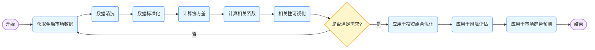

# 金融市场跨资产相关性分析工具

> 关键词：金融市场、跨资产、相关性分析、数据分析工具、风险评估

> 摘要：本文围绕金融市场跨资产相关性分析工具展开，详细阐述了其背景、核心概念、算法原理、数学模型等内容。通过深入剖析该工具的原理和应用，旨在帮助读者理解其在金融领域的重要性和实际价值。文中不仅介绍了相关理论知识，还提供了项目实战案例，包括开发环境搭建、源代码实现及解读，同时列举了实际应用场景、工具和资源推荐等内容。最后对未来发展趋势与挑战进行了总结，并提供了常见问题解答和参考资料，为读者全面了解和应用金融市场跨资产相关性分析工具提供了全面而深入的指导。

## 1. 背景介绍 
### 1.1 目的和范围
在金融市场中，不同资产之间的相关性分析对于投资者、金融机构和监管部门都具有重要意义。投资者可以通过了解资产之间的相关性来优化投资组合，降低风险；金融机构可以利用相关性分析进行风险评估和管理；监管部门可以借助相关性分析监测市场系统性风险。本文章的目的在于详细介绍金融市场跨资产相关性分析工具，包括其原理、实现方法和应用场景等。范围涵盖了常见的金融资产，如股票、债券、期货、外汇等，以及相关的数据分析技术和工具。

### 1.2 预期读者
本文预期读者包括金融从业者，如投资经理、分析师、风险管理人员等，他们希望通过掌握跨资产相关性分析工具来提升投资决策和风险管理能力；也包括对金融数据分析感兴趣的技术人员，如数据科学家、程序员等，他们可以从中学习相关的算法和实现方法；同时还适合金融专业的学生，作为了解金融市场数据分析的参考资料。

### 1.3 文档结构概述
本文首先介绍了金融市场跨资产相关性分析工具的背景，包括目的、预期读者和文档结构概述等内容。接着阐述了核心概念与联系，通过文本示意图和 Mermaid 流程图展示相关原理和架构。然后详细讲解了核心算法原理及具体操作步骤，并用 Python 源代码进行阐述。之后介绍了数学模型和公式，并举例说明。在项目实战部分，给出了开发环境搭建、源代码详细实现和代码解读。随后列举了实际应用场景。再介绍了工具和资源推荐，包括学习资源、开发工具框架和相关论文著作等。最后对未来发展趋势与挑战进行总结，提供常见问题解答和扩展阅读及参考资料。

### 1.4 术语表
#### 1.4.1 核心术语定义
- **跨资产**：指不同类型的金融资产，如股票、债券、商品期货、外汇等。
- **相关性**：是指两个或多个变量之间的关联程度，在金融市场中，资产之间的相关性反映了它们价格变动的相似性。
- **相关性分析**：通过统计方法计算资产之间的相关性系数，以评估它们之间的关联程度。
- **投资组合**：由多种资产组成的集合，投资者通过合理配置资产来实现投资目标。
- **风险评估**：对投资组合面临的风险进行量化和分析的过程。

#### 1.4.2 相关概念解释
- **协方差**：用于衡量两个变量的总体误差，在金融领域中，协方差可以反映两种资产收益率之间的共同变动程度。
- **相关系数**：是协方差的标准化形式，取值范围在 -1 到 1 之间。相关系数为 1 表示完全正相关，为 -1 表示完全负相关，为 0 表示不相关。
- **系统性风险**：指由于宏观经济、政治等因素导致的整个金融市场的风险，无法通过分散投资完全消除。
- **非系统性风险**：指个别资产或行业特有的风险，可以通过分散投资降低。

#### 1.4.3 缩略词列表
- **CAPM**：Capital Asset Pricing Model，资本资产定价模型
- **VAR**：Value at Risk，风险价值
- **ETF**：Exchange Traded Fund，交易型开放式指数基金

## 2. 核心概念与联系 
### 核心概念原理
金融市场跨资产相关性分析的核心在于理解不同资产价格变动之间的关系。资产价格的变动受到多种因素的影响，包括宏观经济数据、公司基本面、市场情绪等。当某些因素同时影响多种资产时，这些资产的价格变动就可能呈现出一定的相关性。

例如，在经济衰退时期，股票市场和商品市场可能同时下跌，因为经济衰退会导致企业盈利下降和商品需求减少。而债券市场可能会上涨，因为投资者会寻求相对安全的资产。通过分析资产之间的相关性，投资者可以更好地理解市场动态，优化投资组合。

### 架构的文本示意图
```plaintext
金融市场跨资产相关性分析工具架构

数据源层：
    - 股票市场数据
    - 债券市场数据
    - 期货市场数据
    - 外汇市场数据

数据处理层：
    - 数据清洗
    - 数据标准化
    - 数据特征提取

相关性分析层：
    - 计算协方差
    - 计算相关系数
    - 相关性可视化

应用层：
    - 投资组合优化
    - 风险评估
    - 市场趋势预测
```

### Mermaid 流程图


## 3. 核心算法原理 & 具体操作步骤 
### 核心算法原理
计算资产之间相关性的常用方法是皮尔逊相关系数（Pearson correlation coefficient）。皮尔逊相关系数衡量的是两个变量之间的线性关系。其计算公式为：

$$
\rho_{X,Y}=\frac{\mathrm{cov}(X,Y)}{\sigma_X\sigma_Y}
$$

其中，$\rho_{X,Y}$ 是变量 $X$ 和 $Y$ 的皮尔逊相关系数，$\mathrm{cov}(X,Y)$ 是 $X$ 和 $Y$ 的协方差，$\sigma_X$ 和 $\sigma_Y$ 分别是 $X$ 和 $Y$ 的标准差。

### 具体操作步骤
1. **数据准备**：收集不同资产的历史价格数据。
2. **数据处理**：对数据进行清洗，去除缺失值和异常值，并进行标准化处理。
3. **计算收益率**：计算每个资产的收益率，收益率的计算公式为：

$$
R_t=\frac{P_t - P_{t-1}}{P_{t-1}}
$$

其中，$R_t$ 是第 $t$ 期的收益率，$P_t$ 是第 $t$ 期的价格，$P_{t-1}$ 是第 $t - 1$ 期的价格。

4. **计算协方差矩阵**：根据收益率数据计算协方差矩阵。
5. **计算相关系数矩阵**：根据协方差矩阵计算相关系数矩阵。

### Python 源代码实现
```python
import pandas as pd
import numpy as np

# 数据准备
# 假设我们有三个资产的历史价格数据，存储在 CSV 文件中
data = pd.read_csv('asset_prices.csv')

# 数据处理
# 去除缺失值
data = data.dropna()

# 计算收益率
returns = data.pct_change().dropna()

# 计算协方差矩阵
cov_matrix = returns.cov()

# 计算相关系数矩阵
corr_matrix = returns.corr()

print("协方差矩阵:")
print(cov_matrix)
print("相关系数矩阵:")
print(corr_matrix)
```

## 4. 数学模型和公式 & 详细讲解 & 举例说明 
### 数学模型和公式
#### 协方差公式
协方差衡量的是两个变量的总体误差，其计算公式为：

$$
\mathrm{cov}(X,Y)=\frac{1}{n - 1}\sum_{i = 1}^{n}(x_i-\bar{x})(y_i-\bar{y})
$$

其中，$x_i$ 和 $y_i$ 分别是变量 $X$ 和 $Y$ 的第 $i$ 个观测值，$\bar{x}$ 和 $\bar{y}$ 分别是 $X$ 和 $Y$ 的均值，$n$ 是观测值的数量。

#### 标准差公式
标准差衡量的是变量的离散程度，其计算公式为：

$$
\sigma_X=\sqrt{\frac{1}{n - 1}\sum_{i = 1}^{n}(x_i-\bar{x})^2}
$$

#### 皮尔逊相关系数公式
如前所述，皮尔逊相关系数的计算公式为：

$$
\rho_{X,Y}=\frac{\mathrm{cov}(X,Y)}{\sigma_X\sigma_Y}
$$

### 详细讲解
- **协方差**：协方差的正负表示两个变量的变动方向。如果协方差为正，说明两个变量的变动方向相同；如果协方差为负，说明两个变量的变动方向相反；如果协方差为 0，说明两个变量之间没有线性关系。
- **标准差**：标准差越大，说明变量的离散程度越大，即变量的取值越分散。
- **皮尔逊相关系数**：相关系数的取值范围在 -1 到 1 之间。相关系数为 1 表示两个变量完全正相关，即一个变量增加时，另一个变量也随之增加；相关系数为 -1 表示两个变量完全负相关，即一个变量增加时，另一个变量随之减少；相关系数为 0 表示两个变量不相关。

### 举例说明
假设我们有两个资产 $A$ 和 $B$ 的收益率数据如下：

| 时间 | 资产 A 收益率 | 资产 B 收益率 |
|---|---|---|
| 1 | 0.02 | 0.03 |
| 2 | 0.01 | 0.02 |
| 3 | -0.01 | -0.02 |
| 4 | 0.03 | 0.04 |
| 5 | 0.02 | 0.03 |

首先，计算资产 $A$ 和 $B$ 的均值：

$$
\bar{R_A}=\frac{0.02 + 0.01 - 0.01 + 0.03 + 0.02}{5}=0.014
$$

$$
\bar{R_B}=\frac{0.03 + 0.02 - 0.02 + 0.04 + 0.03}{5}=0.02
$$

然后，计算协方差：

$$
\begin{align*}
\mathrm{cov}(R_A,R_B)&=\frac{1}{5 - 1}[(0.02 - 0.014)(0.03 - 0.02)+(0.01 - 0.014)(0.02 - 0.02)+(-0.01 - 0.014)(-0.02 - 0.02)+(0.03 - 0.014)(0.04 - 0.02)+(0.02 - 0.014)(0.03 - 0.02)]\\
&=\frac{1}{4}[0.00006+0+0.00096+0.00032+0.00006]\\
&=\frac{1}{4}\times0.0014\\
&=0.00035
\end{align*}
$$

接着，计算标准差：

$$
\begin{align*}
\sigma_{R_A}&=\sqrt{\frac{1}{5 - 1}[(0.02 - 0.014)^2+(0.01 - 0.014)^2+(-0.01 - 0.014)^2+(0.03 - 0.014)^2+(0.02 - 0.014)^2]}\\
&=\sqrt{\frac{1}{4}[0.000036+0.000016+0.000576+0.000256+0.000036]}\\
&=\sqrt{\frac{1}{4}\times0.00092}\\
&\approx0.0152
\end{align*}
$$

$$
\begin{align*}
\sigma_{R_B}&=\sqrt{\frac{1}{5 - 1}[(0.03 - 0.02)^2+(0.02 - 0.02)^2+(-0.02 - 0.02)^2+(0.04 - 0.02)^2+(0.03 - 0.02)^2]}\\
&=\sqrt{\frac{1}{4}[0.0001+0+0.0016+0.0004+0.0001]}\\
&=\sqrt{\frac{1}{4}\times0.0022}\\
&\approx0.0235
\end{align*}
$$

最后，计算皮尔逊相关系数：

$$
\rho_{R_A,R_B}=\frac{\mathrm{cov}(R_A,R_B)}{\sigma_{R_A}\sigma_{R_B}}=\frac{0.00035}{0.0152\times0.0235}\approx0.98
$$

这表明资产 $A$ 和 $B$ 的收益率之间存在很强的正相关关系。

## 5. 项目实战：代码实际案例和详细解释说明 
### 5.1  开发环境搭建
#### 安装 Python
首先，需要安装 Python 环境。可以从 Python 官方网站（https://www.python.org/downloads/） 下载适合自己操作系统的 Python 安装包，并按照安装向导进行安装。

#### 安装必要的库
在安装好 Python 后，需要安装一些必要的库，如 `pandas`、`numpy`、`matplotlib` 等。可以使用 `pip` 命令进行安装：

```sh
pip install pandas numpy matplotlib
```

### 5.2  源代码详细实现和代码解读
```python
import pandas as pd
import numpy as np
import matplotlib.pyplot as plt

# 数据准备
# 假设我们从雅虎财经获取股票数据
import yfinance as yf

# 定义要分析的股票代码
tickers = ['AAPL', 'MSFT', 'GOOG', 'AMZN']

# 获取股票数据
data = yf.download(tickers, start='2020-01-01', end='2023-01-01')['Adj Close']

# 数据处理
# 去除缺失值
data = data.dropna()

# 计算收益率
returns = data.pct_change().dropna()

# 计算协方差矩阵
cov_matrix = returns.cov()

# 计算相关系数矩阵
corr_matrix = returns.corr()

# 可视化相关系数矩阵
plt.figure(figsize=(10, 8))
plt.imshow(corr_matrix, cmap='coolwarm', interpolation='nearest')
plt.colorbar()
plt.xticks(range(len(corr_matrix.columns)), corr_matrix.columns, rotation=90)
plt.yticks(range(len(corr_matrix.columns)), corr_matrix.columns)
plt.title('Correlation Matrix of Stocks')
plt.show()

# 投资组合优化示例
# 定义资产权重
weights = np.array([0.25, 0.25, 0.25, 0.25])

# 计算投资组合的预期收益率
portfolio_return = np.sum(returns.mean() * weights) * 252

# 计算投资组合的波动率
portfolio_volatility = np.sqrt(np.dot(weights.T, np.dot(cov_matrix * 252, weights)))

print("投资组合的预期收益率: {:.2f}%".format(portfolio_return * 100))
print("投资组合的波动率: {:.2f}%".format(portfolio_volatility * 100))
```

### 5.3  代码解读与分析
1. **数据准备**：使用 `yfinance` 库从雅虎财经获取股票数据。`yf.download` 函数可以方便地获取指定股票在指定时间范围内的调整后收盘价。
2. **数据处理**：使用 `dropna` 方法去除缺失值，然后计算收益率。
3. **相关性分析**：使用 `cov` 方法计算协方差矩阵，使用 `corr` 方法计算相关系数矩阵。
4. **可视化**：使用 `matplotlib` 库绘制相关系数矩阵的热力图，直观地展示股票之间的相关性。
5. **投资组合优化**：定义资产权重，计算投资组合的预期收益率和波动率。预期收益率是各资产预期收益率的加权平均值，波动率是根据协方差矩阵计算得到的。

## 6. 实际应用场景 
### 投资组合优化
投资者可以利用跨资产相关性分析工具来优化投资组合。通过选择相关性较低的资产进行组合，可以降低投资组合的风险。例如，股票和债券在某些情况下呈现负相关关系，投资者可以同时持有股票和债券，以平衡投资组合的风险和收益。

### 风险评估
金融机构可以使用跨资产相关性分析工具来评估投资组合面临的风险。通过计算投资组合的波动率和风险价值（VAR）等指标，可以量化投资组合的风险水平。如果资产之间的相关性较高，投资组合的风险可能会增加，金融机构需要采取相应的风险管理措施。

### 市场趋势预测
分析跨资产相关性可以帮助投资者和分析师预测市场趋势。例如，如果股票市场和商品市场的相关性突然发生变化，可能预示着市场环境的改变。投资者可以根据这种变化调整投资策略。

### 资产配置决策
在进行资产配置时，跨资产相关性分析可以为投资者提供参考。不同类型的资产在不同的经济环境下表现不同，通过了解资产之间的相关性，投资者可以合理配置资产，实现资产的保值增值。

## 7. 工具和资源推荐
### 7.1 学习资源推荐
#### 7.1.1 书籍推荐
- 《金融市场学》：全面介绍了金融市场的基本概念、理论和实践，对于理解金融市场的运行机制有很大帮助。
- 《投资学》：系统地阐述了投资组合理论、资产定价模型等投资领域的核心知识，是学习投资分析的经典教材。
- 《Python 金融数据分析实战》：结合 Python 编程语言，详细介绍了如何进行金融数据分析，包括数据获取、处理、可视化和建模等内容。

#### 7.1.2 在线课程
- Coursera 上的“Financial Markets”课程：由耶鲁大学教授 Robert Shiller 主讲，深入浅出地介绍了金融市场的相关知识。
- edX 上的“Python for Finance: Investment Fundamentals and Data Analytics”课程：通过实际案例，讲解如何使用 Python 进行金融数据分析和投资决策。

#### 7.1.3 技术博客和网站
- 金融界（https://www.jrj.com.cn/）：提供丰富的金融资讯和市场分析。
- 雪球（https://xueqiu.com/）：一个投资者社区，用户可以分享投资经验和观点。
- Towards Data Science（https://towardsdatascience.com/）：一个专注于数据科学和机器学习的技术博客，有很多关于金融数据分析的文章。

### 7.2 开发工具框架推荐
#### 7.2.1 IDE和编辑器
- PyCharm：一款功能强大的 Python 集成开发环境，提供代码编辑、调试、版本控制等功能。
- Jupyter Notebook：一个交互式的开发环境，适合进行数据分析和可视化，支持 Python、R 等多种编程语言。

#### 7.2.2 调试和性能分析工具
- pdb：Python 自带的调试工具，可以帮助开发者定位和解决代码中的问题。
- cProfile：Python 的性能分析工具，可以分析代码的运行时间和资源占用情况，帮助开发者优化代码性能。

#### 7.2.3 相关框架和库
- Pandas：一个强大的数据处理和分析库，提供了高效的数据结构和数据操作方法。
- NumPy：一个用于科学计算的基础库，提供了多维数组和各种数学函数。
- Matplotlib：一个用于数据可视化的库，可以绘制各种类型的图表。
- Scikit-learn：一个用于机器学习的库，提供了各种机器学习算法和工具。

### 7.3 相关论文著作推荐
#### 7.3.1 经典论文
- Markowitz, H. M. (1952). Portfolio Selection. The Journal of Finance, 7(1), 77 - 91. 这篇论文提出了现代投资组合理论，奠定了投资组合优化的基础。
- Sharpe, W. F. (1964). Capital Asset Prices: A Theory of Market Equilibrium under Conditions of Risk. The Journal of Finance, 19(3), 425 - 442. 该论文提出了资本资产定价模型（CAPM），用于解释资产的预期收益率和风险之间的关系。

#### 7.3.2 最新研究成果
可以通过学术数据库，如 Google Scholar、IEEE Xplore、ACM Digital Library 等，搜索关于金融市场跨资产相关性分析的最新研究成果。

#### 7.3.3 应用案例分析
一些金融机构和研究机构会发布关于跨资产相关性分析的应用案例，例如高盛、摩根大通等的研究报告，可以从中学习实际应用中的经验和方法。

## 8. 总结：未来发展趋势与挑战
### 未来发展趋势
#### 大数据和人工智能的应用
随着金融市场数据的不断增加，大数据和人工智能技术将在跨资产相关性分析中发挥越来越重要的作用。通过使用机器学习算法，可以更准确地捕捉资产之间的复杂关系，提高分析的准确性和效率。

#### 跨市场和跨境分析
金融市场的全球化趋势使得跨市场和跨境资产的相关性分析变得更加重要。未来的分析工具将更加注重整合不同市场和地区的数据，提供更全面的市场视角。

#### 实时分析和预测
投资者和金融机构对实时信息的需求越来越高，未来的跨资产相关性分析工具将具备实时分析和预测的能力，帮助用户及时做出决策。

### 挑战
#### 数据质量和可靠性
金融市场数据的质量和可靠性是影响相关性分析结果的关键因素。数据中可能存在缺失值、异常值等问题，需要进行有效的数据清洗和预处理。

#### 模型的复杂性和可解释性
随着分析方法的不断发展，模型的复杂性也在增加。复杂的模型可能会提高分析的准确性，但也会降低模型的可解释性，使得用户难以理解分析结果的含义。

#### 市场的不确定性
金融市场是复杂多变的，资产之间的相关性也会随着市场环境的变化而变化。如何准确地捕捉市场的不确定性，是跨资产相关性分析面临的一个挑战。

## 9. 附录：常见问题与解答
### 问题 1：如何选择合适的相关性分析方法？
答：选择合适的相关性分析方法需要考虑数据的特点和分析的目的。皮尔逊相关系数适用于线性关系的分析，而斯皮尔曼相关系数和肯德尔相关系数适用于非线性关系的分析。如果数据存在异常值，建议使用斯皮尔曼相关系数或肯德尔相关系数。

### 问题 2：如何处理缺失值和异常值？
答：处理缺失值的方法包括删除缺失值、填充缺失值等。填充缺失值的方法有均值填充、中位数填充、插值法等。处理异常值的方法包括删除异常值、替换异常值等。具体方法的选择需要根据数据的特点和分析的目的来决定。

### 问题 3：如何解释相关系数矩阵？
答：相关系数矩阵中的每个元素表示两个资产之间的相关性。相关系数的取值范围在 -1 到 1 之间，绝对值越接近 1 表示相关性越强，绝对值越接近 0 表示相关性越弱。正相关表示两个资产的价格变动方向相同，负相关表示两个资产的价格变动方向相反。

### 问题 4：跨资产相关性分析在实际应用中存在哪些局限性？
答：跨资产相关性分析在实际应用中存在一些局限性。例如，相关性分析只能反映资产之间的线性关系，对于非线性关系的捕捉能力有限；资产之间的相关性可能会随着时间的变化而变化，历史数据的相关性不一定能代表未来的相关性；市场突发事件可能会导致资产之间的相关性发生突变，使得基于历史数据的分析结果失效。

## 10. 扩展阅读 & 参考资料
### 扩展阅读
- 《金融计量学》：深入介绍了金融领域的计量方法和模型，对于进一步学习金融数据分析有很大帮助。
- 《行为金融学》：探讨了投资者的心理和行为对金融市场的影响，为理解金融市场的复杂性提供了新的视角。

### 参考资料
- 雅虎财经（https://finance.yahoo.com/）：提供金融市场数据和资讯。
- 中国证券监督管理委员会（https://www.csrc.gov.cn/）：提供中国证券市场的监管信息和政策解读。
- 国际货币基金组织（https://www.imf.org/）：提供全球金融市场的研究报告和数据。