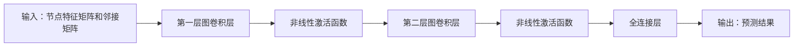

# 金融领域图卷积网络在跨市场风险传导分析中的应用

> 关键词：金融领域、图卷积网络、跨市场风险传导、风险分析、金融网络

> 摘要：本文聚焦于金融领域中图卷积网络在跨市场风险传导分析的应用。随着金融市场的全球化和复杂化，跨市场风险传导问题日益凸显，传统的分析方法面临诸多挑战。图卷积网络作为一种强大的图数据处理工具，能够有效捕捉金融市场中复杂的关联结构，为跨市场风险传导分析提供新的思路和方法。文章将深入探讨图卷积网络的核心概念、算法原理、数学模型，通过项目实战展示其在实际应用中的效果，并分析其在金融领域的实际应用场景，最后对未来发展趋势与挑战进行总结。

## 1. 背景介绍 
### 1.1 目的和范围
在金融全球化的背景下，各个金融市场之间的联系日益紧密，一个市场的波动很可能会传导到其他市场，引发系统性风险。因此，准确分析跨市场风险传导机制对于维护金融稳定至关重要。本文旨在介绍图卷积网络在跨市场风险传导分析中的应用，探讨其原理、方法和实际效果，为金融从业者和研究人员提供参考。研究范围涵盖图卷积网络的基本原理、在金融网络中的建模方法、跨市场风险传导分析的具体应用以及相关的技术和资源。

### 1.2 预期读者
本文预期读者包括金融领域的从业者，如风险分析师、投资经理、金融监管人员等，他们可以通过本文了解图卷积网络在跨市场风险传导分析中的应用，为实际工作提供新的工具和思路。同时，也适合计算机科学和人工智能领域的研究人员和学生，他们可以从金融应用的角度深入理解图卷积网络的实际应用场景。

### 1.3 文档结构概述
本文首先介绍相关的背景知识，包括目的、预期读者和文档结构。接着阐述图卷积网络的核心概念与联系，包括其原理和架构。然后详细讲解核心算法原理和具体操作步骤，并给出相应的数学模型和公式。通过项目实战展示图卷积网络在跨市场风险传导分析中的具体应用，包括开发环境搭建、源代码实现和代码解读。之后分析图卷积网络在金融领域的实际应用场景。再推荐相关的工具和资源，包括学习资源、开发工具框架和论文著作。最后总结未来发展趋势与挑战，并提供常见问题与解答以及扩展阅读和参考资料。

### 1.4 术语表
#### 1.4.1 核心术语定义
- **图卷积网络（Graph Convolutional Network，GCN）**：是一种专门处理图结构数据的深度学习模型，通过对图中节点的特征和邻接关系进行卷积操作，学习节点的表示。
- **跨市场风险传导**：指一个金融市场的风险通过各种渠道传递到其他金融市场，导致其他市场也出现波动和风险的现象。
- **金融网络**：由金融机构、金融市场和金融产品等节点以及它们之间的关系构成的复杂网络。

#### 1.4.2 相关概念解释
- **图数据**：由节点和边组成的数据结构，节点表示实体，边表示实体之间的关系。在金融网络中，节点可以是金融机构、股票、债券等，边可以表示它们之间的交易关系、信用关系等。
- **卷积操作**：在传统图像处理中，卷积操作是通过一个卷积核在图像上滑动，对每个局部区域进行加权求和的操作。在图卷积网络中，卷积操作是对节点的邻域进行信息聚合和变换。

#### 1.4.3 缩略词列表
- **GCN**：Graph Convolutional Network（图卷积网络）
- **API**：Application Programming Interface（应用程序编程接口）
- **GPU**：Graphics Processing Unit（图形处理器）

## 2. 核心概念与联系 

### 2.1 图卷积网络原理
图卷积网络的核心思想是通过聚合节点的邻域信息来更新节点的特征表示。在传统的卷积神经网络（CNN）中，卷积操作是在规则的网格结构（如图像）上进行的，而图卷积网络则是在不规则的图结构上进行卷积操作。

假设我们有一个图 $G=(V, E)$，其中 $V$ 是节点集合，$E$ 是边集合。每个节点 $v_i$ 有一个特征向量 $x_i$，图的邻接矩阵为 $A$。图卷积网络的一层可以表示为：

$$H^{(l+1)} = \sigma(\tilde{D}^{-\frac{1}{2}}\tilde{A}\tilde{D}^{-\frac{1}{2}}H^{(l)}W^{(l)})$$

其中，$\tilde{A} = A + I$（$I$ 是单位矩阵），$\tilde{D}$ 是 $\tilde{A}$ 的度矩阵，$H^{(l)}$ 是第 $l$ 层的节点特征矩阵，$W^{(l)}$ 是第 $l$ 层的可学习权重矩阵，$\sigma$ 是激活函数。

### 2.2 图卷积网络架构
图卷积网络通常由多个卷积层和非线性激活函数组成。输入是图的节点特征矩阵和邻接矩阵，经过多个卷积层的信息聚合和变换后，输出节点的特征表示。最后，可以根据具体的任务，如节点分类、图分类等，添加相应的全连接层进行预测。

下面是一个简单的图卷积网络架构的 Mermaid 流程图：



### 2.3 图卷积网络与金融网络的联系
在金融领域，金融市场可以被看作一个复杂的网络，其中金融机构、金融产品等可以看作网络中的节点，它们之间的交易关系、信用关系等可以看作网络中的边。图卷积网络可以很好地处理这种复杂的网络结构，通过学习节点之间的关系，捕捉跨市场风险传导的路径和机制。

例如，不同股票市场之间可能存在资金流动关系，通过图卷积网络可以分析这些资金流动对股票价格波动的影响，从而预测跨市场风险传导的可能性。

## 3. 核心算法原理 & 具体操作步骤 

### 3.1 核心算法原理
图卷积网络的核心算法是基于图的邻接矩阵和节点特征矩阵进行信息聚合和变换。下面我们使用 Python 代码详细阐述图卷积层的实现。

```python
import torch
import torch.nn as nn
import torch.nn.functional as F

class GraphConvolution(nn.Module):
    def __init__(self, in_features, out_features, bias=True):
        super(GraphConvolution, self).__init__()
        self.in_features = in_features
        self.out_features = out_features
        self.weight = nn.Parameter(torch.FloatTensor(in_features, out_features))
        if bias:
            self.bias = nn.Parameter(torch.FloatTensor(out_features))
        else:
            self.register_parameter('bias', None)
        self.reset_parameters()

    def reset_parameters(self):
        nn.init.xavier_uniform_(self.weight)
        if self.bias is not None:
            nn.init.zeros_(self.bias)

    def forward(self, input, adj):
        support = torch.mm(input, self.weight)
        output = torch.spmm(adj, support)
        if self.bias is not None:
            return output + self.bias
        else:
            return output
```

### 3.2 具体操作步骤
1. **数据准备**：收集金融市场的相关数据，包括节点的特征信息（如金融机构的财务指标、股票的基本面数据等）和节点之间的关系信息（如交易数据、信用评级等），并将其转换为图的节点特征矩阵和邻接矩阵。
2. **模型定义**：定义图卷积网络模型，包括多个图卷积层和全连接层。
3. **模型训练**：使用训练数据对模型进行训练，通过优化损失函数（如交叉熵损失函数）来更新模型的参数。
4. **模型评估**：使用测试数据对训练好的模型进行评估，计算评估指标（如准确率、召回率等）。
5. **预测与分析**：使用训练好的模型对新的数据进行预测，分析跨市场风险传导的路径和机制。

下面是一个简单的图卷积网络模型定义和训练的示例代码：

```python
class GCN(nn.Module):
    def __init__(self, nfeat, nhid, nclass, dropout):
        super(GCN, self).__init__()
        self.gc1 = GraphConvolution(nfeat, nhid)
        self.gc2 = GraphConvolution(nhid, nclass)
        self.dropout = dropout

    def forward(self, x, adj):
        x = F.relu(self.gc1(x, adj))
        x = F.dropout(x, self.dropout, training=self.training)
        x = self.gc2(x, adj)
        return F.log_softmax(x, dim=1)

# 数据准备
# 假设已经有节点特征矩阵 x 和邻接矩阵 adj
# 以及标签 y
x = torch.FloatTensor(...)
adj = torch.FloatTensor(...)
y = torch.LongTensor(...)

# 模型定义
model = GCN(nfeat=x.shape[1], nhid=16, nclass=y.max().item() + 1, dropout=0.5)

# 优化器和损失函数
optimizer = torch.optim.Adam(model.parameters(), lr=0.01, weight_decay=5e-4)
criterion = nn.NLLLoss()

# 模型训练
for epoch in range(200):
    model.train()
    optimizer.zero_grad()
    output = model(x, adj)
    loss = criterion(output, y)
    loss.backward()
    optimizer.step()
    print(f'Epoch {epoch}: Loss = {loss.item()}')
```

## 4. 数学模型和公式 & 详细讲解 & 举例说明 

### 4.1 图卷积网络的数学模型
图卷积网络的数学模型基于图的邻接矩阵和节点特征矩阵进行信息聚合和变换。如前面所述，图卷积网络的一层可以表示为：

$$H^{(l+1)} = \sigma(\tilde{D}^{-\frac{1}{2}}\tilde{A}\tilde{D}^{-\frac{1}{2}}H^{(l)}W^{(l)})$$

其中，$\tilde{A} = A + I$，$\tilde{D}$ 是 $\tilde{A}$ 的度矩阵，$H^{(l)}$ 是第 $l$ 层的节点特征矩阵，$W^{(l)}$ 是第 $l$ 层的可学习权重矩阵，$\sigma$ 是激活函数。

### 4.2 公式详细讲解
- **邻接矩阵 $A$**：表示图中节点之间的连接关系，$A_{ij}$ 表示节点 $i$ 和节点 $j$ 之间是否有边相连。
- **单位矩阵 $I$**：用于将自环添加到图中，确保每个节点在信息聚合时考虑自身的特征。
- **度矩阵 $\tilde{D}$**：是一个对角矩阵，$\tilde{D}_{ii}$ 表示节点 $i$ 的度（即与节点 $i$ 相连的边的数量）。
- **$\tilde{D}^{-\frac{1}{2}}\tilde{A}\tilde{D}^{-\frac{1}{2}}$**：这一步是对邻接矩阵进行归一化处理，使得不同度的节点在信息聚合时具有相同的权重。
- **$H^{(l)}W^{(l)}$**：对第 $l$ 层的节点特征矩阵进行线性变换，$W^{(l)}$ 是可学习的权重矩阵。
- **$\sigma$**：激活函数，如 ReLU 函数，用于引入非线性因素，增加模型的表达能力。

### 4.3 举例说明
假设我们有一个简单的图，包含 3 个节点，节点特征矩阵 $H^{(0)}$ 为：

$$H^{(0)} = \begin{bmatrix}
1 & 2 \\
3 & 4 \\
5 & 6
\end{bmatrix}$$

邻接矩阵 $A$ 为：

$$A = \begin{bmatrix}
0 & 1 & 0 \\
1 & 0 & 1 \\
0 & 1 & 0
\end{bmatrix}$$

则 $\tilde{A} = A + I$ 为：

$$\tilde{A} = \begin{bmatrix}
1 & 1 & 0 \\
1 & 1 & 1 \\
0 & 1 & 1
\end{bmatrix}$$

$\tilde{D}$ 为：

$$\tilde{D} = \begin{bmatrix}
2 & 0 & 0 \\
0 & 3 & 0 \\
0 & 0 & 2
\end{bmatrix}$$

$\tilde{D}^{-\frac{1}{2}}$ 为：

$$\tilde{D}^{-\frac{1}{2}} = \begin{bmatrix}
\frac{1}{\sqrt{2}} & 0 & 0 \\
0 & \frac{1}{\sqrt{3}} & 0 \\
0 & 0 & \frac{1}{\sqrt{2}}
\end{bmatrix}$$

$\tilde{D}^{-\frac{1}{2}}\tilde{A}\tilde{D}^{-\frac{1}{2}}$ 为：

$$\tilde{D}^{-\frac{1}{2}}\tilde{A}\tilde{D}^{-\frac{1}{2}} = \begin{bmatrix}
\frac{1}{2} & \frac{1}{\sqrt{6}} & 0 \\
\frac{1}{\sqrt{6}} & \frac{1}{3} & \frac{1}{\sqrt{6}} \\
0 & \frac{1}{\sqrt{6}} & \frac{1}{2}
\end{bmatrix}$$

假设 $W^{(0)}$ 为：

$$W^{(0)} = \begin{bmatrix}
0.1 & 0.2 \\
0.3 & 0.4
\end{bmatrix}$$

则 $H^{(1)}$ 为：

$$H^{(1)} = \sigma(\tilde{D}^{-\frac{1}{2}}\tilde{A}\tilde{D}^{-\frac{1}{2}}H^{(0)}W^{(0)})$$

首先计算 $\tilde{D}^{-\frac{1}{2}}\tilde{A}\tilde{D}^{-\frac{1}{2}}H^{(0)}$：

$$\tilde{D}^{-\frac{1}{2}}\tilde{A}\tilde{D}^{-\frac{1}{2}}H^{(0)} = \begin{bmatrix}
\frac{1}{2} & \frac{1}{\sqrt{6}} & 0 \\
\frac{1}{\sqrt{6}} & \frac{1}{3} & \frac{1}{\sqrt{6}} \\
0 & \frac{1}{\sqrt{6}} & \frac{1}{2}
\end{bmatrix} \begin{bmatrix}
1 & 2 \\
3 & 4 \\
5 & 6
\end{bmatrix} = \begin{bmatrix}
\frac{1}{2} + \frac{3}{\sqrt{6}} & 1 + \frac{4}{\sqrt{6}} \\
\frac{1}{\sqrt{6}} + 1 + \frac{5}{\sqrt{6}} & \frac{2}{\sqrt{6}} + \frac{4}{3} + \frac{6}{\sqrt{6}} \\
\frac{3}{\sqrt{6}} + \frac{5}{2} & \frac{4}{\sqrt{6}} + 3
\end{bmatrix}$$

然后计算 $\tilde{D}^{-\frac{1}{2}}\tilde{A}\tilde{D}^{-\frac{1}{2}}H^{(0)}W^{(0)}$：

$$\tilde{D}^{-\frac{1}{2}}\tilde{A}\tilde{D}^{-\frac{1}{2}}H^{(0)}W^{(0)} = \begin{bmatrix}
(\frac{1}{2} + \frac{3}{\sqrt{6}}) \times 0.1 + (1 + \frac{4}{\sqrt{6}}) \times 0.3 & (\frac{1}{2} + \frac{3}{\sqrt{6}}) \times 0.2 + (1 + \frac{4}{\sqrt{6}}) \times 0.4 \\
(\frac{1}{\sqrt{6}} + 1 + \frac{5}{\sqrt{6}}) \times 0.1 + (\frac{2}{\sqrt{6}} + \frac{4}{3} + \frac{6}{\sqrt{6}}) \times 0.3 & (\frac{1}{\sqrt{6}} + 1 + \frac{5}{\sqrt{6}}) \times 0.2 + (\frac{2}{\sqrt{6}} + \frac{4}{3} + \frac{6}{\sqrt{6}}) \times 0.4 \\
(\frac{3}{\sqrt{6}} + \frac{5}{2}) \times 0.1 + (\frac{4}{\sqrt{6}} + 3) \times 0.3 & (\frac{3}{\sqrt{6}} + \frac{5}{2}) \times 0.2 + (\frac{4}{\sqrt{6}} + 3) \times 0.4
\end{bmatrix}$$

最后通过激活函数 $\sigma$ 得到 $H^{(1)}$。

## 5. 项目实战：代码实际案例和详细解释说明 

### 5.1  开发环境搭建
1. **安装 Python**：推荐使用 Python 3.7 及以上版本，可以从 Python 官方网站下载安装包进行安装。
2. **安装深度学习框架**：本文使用 PyTorch 作为深度学习框架，可以使用以下命令进行安装：
```sh
pip install torch torchvision
```
3. **安装其他依赖库**：如 NumPy、SciPy 等，可以使用以下命令进行安装：
```sh
pip install numpy scipy
```

### 5.2  源代码详细实现和代码解读
下面是一个完整的图卷积网络在跨市场风险传导分析中的项目实战代码示例：

```python
import torch
import torch.nn as nn
import torch.nn.functional as F
import numpy as np
import scipy.sparse as sp

# 图卷积层定义
class GraphConvolution(nn.Module):
    def __init__(self, in_features, out_features, bias=True):
        super(GraphConvolution, self).__init__()
        self.in_features = in_features
        self.out_features = out_features
        self.weight = nn.Parameter(torch.FloatTensor(in_features, out_features))
        if bias:
            self.bias = nn.Parameter(torch.FloatTensor(out_features))
        else:
            self.register_parameter('bias', None)
        self.reset_parameters()

    def reset_parameters(self):
        nn.init.xavier_uniform_(self.weight)
        if self.bias is not None:
            nn.init.zeros_(self.bias)

    def forward(self, input, adj):
        support = torch.mm(input, self.weight)
        output = torch.spmm(adj, support)
        if self.bias is not None:
            return output + self.bias
        else:
            return output

# 图卷积网络模型定义
class GCN(nn.Module):
    def __init__(self, nfeat, nhid, nclass, dropout):
        super(GCN, self).__init__()
        self.gc1 = GraphConvolution(nfeat, nhid)
        self.gc2 = GraphConvolution(nhid, nclass)
        self.dropout = dropout

    def forward(self, x, adj):
        x = F.relu(self.gc1(x, adj))
        x = F.dropout(x, self.dropout, training=self.training)
        x = self.gc2(x, adj)
        return F.log_softmax(x, dim=1)

# 数据预处理函数
def normalize(mx):
    """Row-normalize sparse matrix"""
    rowsum = np.array(mx.sum(1))
    r_inv = np.power(rowsum, -1).flatten()
    r_inv[np.isinf(r_inv)] = 0.
    r_mat_inv = sp.diags(r_inv)
    mx = r_mat_inv.dot(mx)
    return mx

def sparse_mx_to_torch_sparse_tensor(sparse_mx):
    """Convert a scipy sparse matrix to a torch sparse tensor."""
    sparse_mx = sparse_mx.tocoo().astype(np.float32)
    indices = torch.from_numpy(
        np.vstack((sparse_mx.row, sparse_mx.col)).astype(np.int64))
    values = torch.from_numpy(sparse_mx.data)
    shape = torch.Size(sparse_mx.shape)
    return torch.sparse.FloatTensor(indices, values, shape)

# 模拟数据生成
# 假设我们有 100 个节点，每个节点有 10 个特征
n_nodes = 100
n_features = 10
x = np.random.randn(n_nodes, n_features)
x = torch.FloatTensor(x)

# 邻接矩阵
adj = np.random.randint(0, 2, size=(n_nodes, n_nodes))
adj = sp.coo_matrix(adj)
adj = adj + adj.T.multiply(adj.T > adj) - adj.multiply(adj.T > adj)
adj = normalize(adj + sp.eye(adj.shape[0]))
adj = sparse_mx_to_torch_sparse_tensor(adj)

# 标签
y = np.random.randint(0, 2, size=n_nodes)
y = torch.LongTensor(y)

# 模型定义
model = GCN(nfeat=n_features, nhid=16, nclass=2, dropout=0.5)

# 优化器和损失函数
optimizer = torch.optim.Adam(model.parameters(), lr=0.01, weight_decay=5e-4)
criterion = nn.NLLLoss()

# 模型训练
for epoch in range(200):
    model.train()
    optimizer.zero_grad()
    output = model(x, adj)
    loss = criterion(output, y)
    loss.backward()
    optimizer.step()
    print(f'Epoch {epoch}: Loss = {loss.item()}')
```

### 5.3  代码解读与分析
1. **图卷积层定义**：`GraphConvolution` 类实现了图卷积层的前向传播过程，包括线性变换和邻接矩阵的信息聚合。
2. **图卷积网络模型定义**：`GCN` 类定义了一个简单的图卷积网络模型，包含两个图卷积层和一个全连接层。
3. **数据预处理函数**：`normalize` 函数用于对邻接矩阵进行归一化处理，`sparse_mx_to_torch_sparse_tensor` 函数用于将稀疏矩阵转换为 PyTorch 的稀疏张量。
4. **模拟数据生成**：生成模拟的节点特征矩阵、邻接矩阵和标签。
5. **模型训练**：使用 Adam 优化器和负对数似然损失函数对模型进行训练，通过迭代更新模型的参数。

通过这个项目实战，我们可以看到图卷积网络在处理图结构数据时的基本流程和方法，为跨市场风险传导分析提供了一个可行的解决方案。

## 6. 实际应用场景 
### 6.1 金融机构风险评估
在金融领域，不同的金融机构之间存在着复杂的业务往来和信用关系。图卷积网络可以通过构建金融机构网络，分析机构之间的风险传导路径，评估单个金融机构的风险状况以及其对整个金融系统的影响。例如，通过分析银行之间的同业拆借关系、证券机构之间的交易关系等，预测某一金融机构的风险事件是否会引发系统性风险。

### 6.2 股票市场风险预测
股票市场中，不同股票之间存在着相关性。图卷积网络可以将股票看作节点，股票之间的相关性看作边，构建股票网络。通过学习股票网络的结构和节点特征，预测股票价格的波动和风险传导。例如，当某一行业的龙头股票出现大幅下跌时，图卷积网络可以分析其对同行业其他股票以及相关行业股票的影响。

### 6.3 跨市场风险预警
随着金融市场的全球化，不同金融市场之间的联系日益紧密。图卷积网络可以用于构建跨市场金融网络，监测不同市场之间的风险传导。例如，外汇市场的波动可能会影响股票市场和债券市场，图卷积网络可以实时监测这些市场之间的风险传导情况，及时发出风险预警。

## 7. 工具和资源推荐
### 7.1 学习资源推荐
#### 7.1.1 书籍推荐
- 《深度学习》（Deep Learning）：由 Ian Goodfellow、Yoshua Bengio 和 Aaron Courville 所著，是深度学习领域的经典教材，介绍了深度学习的基本原理和方法。
- 《图神经网络》（Graph Neural Networks）：由 Jure Leskovec、William L. Hamilton 等所著，全面介绍了图神经网络的理论和应用。

#### 7.1.2 在线课程
- Coursera 上的“Deep Learning Specialization”：由 Andrew Ng 教授的深度学习专项课程，涵盖了深度学习的各个方面。
- edX 上的“Graph Neural Networks for Machine Learning”：专门介绍图神经网络的课程，适合深入学习图卷积网络。

#### 7.1.3 技术博客和网站
- Medium 上的 Towards Data Science：有很多关于深度学习和图神经网络的优秀文章。
- arXiv 网站：可以获取最新的学术论文和研究成果。

### 7.2 开发工具框架推荐
#### 7.2.1 IDE和编辑器
- PyCharm：是一款专门为 Python 开发设计的集成开发环境，具有强大的代码编辑、调试和自动完成功能。
- Jupyter Notebook：是一个交互式的开发环境，适合进行数据探索和模型实验。

#### 7.2.2 调试和性能分析工具
- PyTorch Profiler：可以对 PyTorch 模型进行性能分析，找出性能瓶颈。
- TensorBoard：可以可视化模型的训练过程和性能指标。

#### 7.2.3 相关框架和库
- PyTorch Geometric：是一个基于 PyTorch 的图神经网络库，提供了丰富的图数据处理和图神经网络模型实现。
- DGL（Deep Graph Library）：是另一个流行的图神经网络库，支持多种深度学习框架。

### 7.3 相关论文著作推荐
#### 7.3.1 经典论文
- “Semi-Supervised Classification with Graph Convolutional Networks”：由 Thomas N. Kipf 和 Max Welling 发表，是图卷积网络领域的经典论文，提出了图卷积网络的基本模型。
- “Graph Attention Networks”：由 Petar Veličković 等发表，提出了图注意力网络，进一步改进了图神经网络的性能。

#### 7.3.2 最新研究成果
可以通过 arXiv、IEEE Xplore、ACM Digital Library 等学术数据库查找最新的图卷积网络在金融领域的研究成果。

#### 7.3.3 应用案例分析
- 一些金融机构和研究机构会发布图卷积网络在金融风险分析中的应用案例，可以通过他们的官方网站或相关报告获取。

## 8. 总结：未来发展趋势与挑战
### 8.1 未来发展趋势
- **多模态数据融合**：未来的图卷积网络在跨市场风险传导分析中可能会融合更多类型的数据，如文本数据、图像数据等，以更全面地捕捉金融市场的信息。
- **强化学习与图卷积网络结合**：将强化学习与图卷积网络相结合，可以实现更加智能的风险决策和管理。
- **可解释性图卷积网络**：随着金融监管的加强，对图卷积网络的可解释性要求越来越高。未来的研究将致力于开发可解释性更强的图卷积网络模型。

### 8.2 挑战
- **数据质量和隐私问题**：金融数据的质量和隐私是图卷积网络应用的关键挑战。数据的不准确、不完整以及隐私保护问题可能会影响模型的性能和可靠性。
- **模型复杂度和计算资源需求**：图卷积网络的模型复杂度较高，需要大量的计算资源。如何在有限的计算资源下提高模型的效率是一个亟待解决的问题。
- **金融市场的动态变化**：金融市场是一个动态变化的系统，图卷积网络需要不断适应市场的变化，及时调整模型的参数和结构。

## 9. 附录：常见问题与解答
### 9.1 图卷积网络与传统神经网络有什么区别？
图卷积网络是专门处理图结构数据的神经网络，而传统神经网络主要处理规则的网格结构数据（如图像、序列等）。图卷积网络通过聚合节点的邻域信息来更新节点的特征表示，能够更好地捕捉图中节点之间的关系。

### 9.2 图卷积网络在跨市场风险传导分析中的优势是什么？
图卷积网络能够有效捕捉金融市场中复杂的关联结构，通过学习节点之间的关系，发现跨市场风险传导的路径和机制。相比传统的分析方法，图卷积网络可以处理更复杂的网络结构，提高风险分析的准确性和效率。

### 9.3 如何选择图卷积网络的超参数？
图卷积网络的超参数包括学习率、隐藏层维度、 dropout 率等。可以使用网格搜索、随机搜索等方法进行超参数调优，也可以根据经验和实验结果进行选择。

## 10. 扩展阅读 & 参考资料
- Kipf, T. N., & Welling, M. (2016). Semi-Supervised Classification with Graph Convolutional Networks. arXiv preprint arXiv:1609.02907.
- Veličković, P., Cucurull, G., Casanova, A., Romero, A., Lio, P., & Bengio, Y. (2017). Graph Attention Networks. arXiv preprint arXiv:1710.10903.
- Goodfellow, I., Bengio, Y., & Courville, A. (2016). Deep Learning. MIT press.
- Leskovec, J., Hamilton, W. L., et al. (2020). Graph Neural Networks.
- PyTorch 官方文档：https://pytorch.org/docs/stable/index.html
- PyTorch Geometric 官方文档：https://pytorch-geometric.readthedocs.io/en/latest/
- DGL 官方文档：https://docs.dgl.ai/