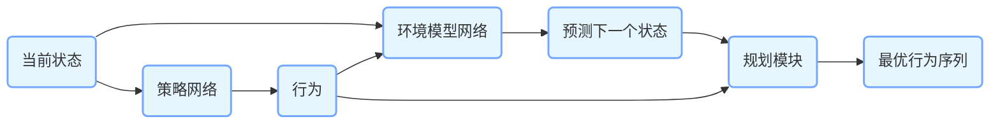

# 长期策略推理中神经规划器的效果评估研究

> 关键词：长期策略推理、神经规划器、效果评估、智能决策、强化学习

> 摘要：本文围绕长期策略推理中神经规划器的效果评估展开深入研究。在复杂动态的环境下，长期策略推理对于实现智能决策至关重要，而神经规划器作为一种新兴的工具被广泛应用。文章首先介绍了相关背景，包括目的范围、预期读者等内容。接着阐述了核心概念与联系，详细讲解了神经规划器的原理和架构，并通过 Mermaid 流程图进行直观展示。核心算法原理部分使用 Python 源代码进行了深入剖析，同时给出了数学模型和公式并举例说明。通过项目实战，展示了代码实际案例并进行详细解释。探讨了神经规划器在不同实际应用场景中的表现，推荐了相关的工具和资源。最后总结了未来发展趋势与挑战，提供了常见问题与解答以及扩展阅读和参考资料，旨在为长期策略推理中神经规划器的效果评估提供全面、深入的技术参考。

## 1. 背景介绍 
### 1.1 目的和范围
在当今科技飞速发展的时代，许多领域都面临着需要做出长期策略决策的问题，如自动驾驶、机器人控制、金融投资等。长期策略推理要求系统能够在复杂的环境中，考虑到多个时间步的影响，做出最优的决策。神经规划器作为一种结合了神经网络和规划算法的技术，被认为具有很大的潜力来解决这些问题。然而，目前对于神经规划器在长期策略推理中的效果评估还缺乏系统和深入的研究。

本文的目的在于全面评估神经规划器在长期策略推理中的效果，通过理论分析、算法实现、项目实战和实际应用场景的探讨，为神经规划器的进一步发展和应用提供参考。研究范围涵盖了神经规划器的核心概念、算法原理、数学模型，以及在不同领域的实际应用效果评估。

### 1.2 预期读者
本文预期读者包括但不限于以下几类人群：
1. **人工智能领域的研究人员**：希望通过本文了解神经规划器在长期策略推理中的最新研究进展和效果评估方法，为其进一步的研究提供思路和参考。
2. **程序员和软件开发者**：对于想要将神经规划器应用到实际项目中的开发者，本文提供了详细的算法实现和代码案例，帮助他们更好地理解和应用神经规划器。
3. **相关领域的工程师**：如自动驾驶工程师、机器人工程师等，他们可以从本文中了解神经规划器在长期策略推理中的应用场景和效果，为其实际工作提供决策依据。
4. **对人工智能和智能决策感兴趣的学生**：有助于他们深入学习和理解神经规划器的原理和应用，拓宽知识面。

### 1.3 文档结构概述
本文将按照以下结构进行组织：
1. **背景介绍**：介绍研究的目的、范围、预期读者和文档结构概述，以及相关术语的定义和解释。
2. **核心概念与联系**：阐述长期策略推理和神经规划器的核心概念，展示其原理和架构的文本示意图和 Mermaid 流程图。
3. **核心算法原理 & 具体操作步骤**：详细讲解神经规划器的核心算法原理，并使用 Python 源代码进行具体实现。
4. **数学模型和公式 & 详细讲解 & 举例说明**：给出神经规划器的数学模型和公式，并通过具体例子进行详细讲解。
5. **项目实战：代码实际案例和详细解释说明**：介绍开发环境搭建，展示源代码的详细实现和代码解读。
6. **实际应用场景**：探讨神经规划器在不同实际应用场景中的表现和效果。
7. **工具和资源推荐**：推荐相关的学习资源、开发工具框架和论文著作。
8. **总结：未来发展趋势与挑战**：总结神经规划器在长期策略推理中的发展趋势和面临的挑战。
9. **附录：常见问题与解答**：提供常见问题的解答，帮助读者更好地理解和应用本文内容。
10. **扩展阅读 & 参考资料**：提供相关的扩展阅读材料和参考资料，方便读者进一步深入学习。

### 1.4 术语表
#### 1.4.1 核心术语定义
1. **长期策略推理**：指在复杂动态环境中，考虑多个时间步的影响，通过对未来状态和行为的预测和评估，制定出最优长期策略的过程。
2. **神经规划器**：一种结合了神经网络和规划算法的技术，利用神经网络的强大学习能力来模拟环境模型和策略，通过规划算法在这些模型的基础上进行搜索和决策。
3. **效果评估**：对神经规划器在长期策略推理中的性能、效率、准确性等方面进行量化和分析的过程。

#### 1.4.2 相关概念解释
1. **强化学习**：一种通过智能体与环境进行交互，根据环境反馈的奖励信号来学习最优策略的机器学习方法。神经规划器可以与强化学习相结合，利用强化学习的思想来优化策略。
2. **环境模型**：对现实环境的抽象和建模，用于预测环境状态的变化和智能体行为的后果。神经规划器可以学习环境模型，以便更好地进行规划和决策。
3. **策略**：智能体在不同环境状态下采取的行为规则。长期策略推理的目标就是找到最优的策略，使得智能体在长期内获得最大的累积奖励。

#### 1.4.3 缩略词列表
1. **RL**：Reinforcement Learning，强化学习
2. **MDP**：Markov Decision Process，马尔可夫决策过程

## 2. 核心概念与联系 

### 长期策略推理的核心概念
长期策略推理的核心在于在复杂的动态环境中，对未来多个时间步的情况进行预测和评估，以制定出能够在长期内获得最优结果的策略。在这个过程中，需要考虑到环境的不确定性、智能体的行为选择以及不同行为所带来的长期影响。

### 神经规划器的核心概念
神经规划器结合了神经网络和规划算法的优势。神经网络具有强大的学习能力，可以学习环境模型和策略。通过对大量数据的学习，神经网络可以捕捉到环境的复杂模式和规律。规划算法则在学习到的模型基础上进行搜索和决策，找到最优的行为序列。

### 核心概念的联系
神经规划器是实现长期策略推理的一种有效工具。通过学习环境模型，神经规划器可以预测未来的状态，从而在多个时间步上进行规划。策略网络则根据规划结果选择最优的行为，实现长期策略的制定。

### 原理和架构的文本示意图
神经规划器的基本架构包括环境模型网络、策略网络和规划模块。环境模型网络接收当前状态和行为作为输入，预测下一个状态。策略网络根据当前状态输出最优的行为。规划模块在环境模型的基础上，通过搜索算法找到最优的行为序列。

### Mermaid 流程图


## 3. 核心算法原理 & 具体操作步骤 

### 核心算法原理
神经规划器的核心算法主要包括环境模型学习、策略学习和规划算法。

#### 环境模型学习
环境模型学习的目标是学习一个函数 $f(s_t, a_t)$，其中 $s_t$ 是当前状态，$a_t$ 是当前行为，$f(s_t, a_t)$ 输出预测的下一个状态 $s_{t+1}$。我们可以使用神经网络来近似这个函数。

#### 策略学习
策略学习的目标是学习一个策略 $\pi(s)$，其中 $s$ 是当前状态，$\pi(s)$ 输出在该状态下的最优行为 $a$。同样可以使用神经网络来实现。

#### 规划算法
规划算法在学习到的环境模型基础上，通过搜索算法找到最优的行为序列。常见的规划算法包括蒙特卡罗树搜索（MCTS）等。

### 具体操作步骤
1. **数据收集**：智能体与环境进行交互，收集状态、行为和下一个状态的数据。
2. **环境模型训练**：使用收集到的数据训练环境模型网络。
3. **策略训练**：使用强化学习算法训练策略网络，优化策略。
4. **规划**：在需要做出决策时，使用规划算法在环境模型的基础上找到最优的行为序列。

### Python 源代码实现
```python
import torch
import torch.nn as nn
import torch.optim as optim

# 定义环境模型网络
class EnvironmentModel(nn.Module):
    def __init__(self, state_dim, action_dim, next_state_dim):
        super(EnvironmentModel, self).__init__()
        self.fc1 = nn.Linear(state_dim + action_dim, 128)
        self.fc2 = nn.Linear(128, next_state_dim)

    def forward(self, state, action):
        x = torch.cat((state, action), dim=1)
        x = torch.relu(self.fc1(x))
        x = self.fc2(x)
        return x

# 定义策略网络
class PolicyNetwork(nn.Module):
    def __init__(self, state_dim, action_dim):
        super(PolicyNetwork, self).__init__()
        self.fc1 = nn.Linear(state_dim, 128)
        self.fc2 = nn.Linear(128, action_dim)

    def forward(self, state):
        x = torch.relu(self.fc1(state))
        x = torch.softmax(self.fc2(x), dim=1)
        return x

# 训练环境模型
def train_environment_model(env_model, state_data, action_data, next_state_data, epochs=100, lr=0.001):
    criterion = nn.MSELoss()
    optimizer = optim.Adam(env_model.parameters(), lr=lr)

    for epoch in range(epochs):
        optimizer.zero_grad()
        predicted_next_state = env_model(state_data, action_data)
        loss = criterion(predicted_next_state, next_state_data)
        loss.backward()
        optimizer.step()
        if epoch % 10 == 0:
            print(f'Epoch {epoch}, Loss: {loss.item()}')

# 训练策略网络
def train_policy_network(policy_net, state_data, action_data, rewards, epochs=100, lr=0.001):
    criterion = nn.CrossEntropyLoss()
    optimizer = optim.Adam(policy_net.parameters(), lr=lr)

    for epoch in range(epochs):
        optimizer.zero_grad()
        predicted_action_probs = policy_net(state_data)
        loss = -torch.sum(torch.log(predicted_action_probs) * rewards)
        loss.backward()
        optimizer.step()
        if epoch % 10 == 0:
            print(f'Epoch {epoch}, Loss: {loss.item()}')

# 示例数据
state_dim = 10
action_dim = 5
next_state_dim = 10
state_data = torch.randn(100, state_dim)
action_data = torch.randn(100, action_dim)
next_state_data = torch.randn(100, next_state_dim)
rewards = torch.randn(100)

# 创建模型
env_model = EnvironmentModel(state_dim, action_dim, next_state_dim)
policy_net = PolicyNetwork(state_dim, action_dim)

# 训练模型
train_environment_model(env_model, state_data, action_data, next_state_data)
train_policy_network(policy_net, state_data, action_data, rewards)
```

## 4. 数学模型和公式 & 详细讲解 & 举例说明 

### 数学模型
神经规划器的数学模型主要基于马尔可夫决策过程（MDP）。MDP 可以用一个五元组 $\langle S, A, P, R, \gamma \rangle$ 表示，其中：
- $S$ 是状态空间，包含所有可能的环境状态。
- $A$ 是动作空间，包含智能体可以采取的所有动作。
- $P(s_{t+1} | s_t, a_t)$ 是状态转移概率，表示在状态 $s_t$ 采取动作 $a_t$ 后转移到状态 $s_{t+1}$ 的概率。
- $R(s_t, a_t)$ 是奖励函数，表示在状态 $s_t$ 采取动作 $a_t$ 后获得的即时奖励。
- $\gamma \in [0, 1]$ 是折扣因子，用于衡量未来奖励的重要性。

### 公式
#### 状态转移模型
环境模型网络学习的是状态转移概率的近似。可以表示为：
$$\hat{P}(s_{t+1} | s_t, a_t) = f(s_t, a_t)$$
其中 $f$ 是环境模型网络。

#### 策略函数
策略网络学习的是策略函数 $\pi(a | s)$，表示在状态 $s$ 下采取动作 $a$ 的概率。可以表示为：
$$\pi(a | s) = \text{softmax}(g(s))$$
其中 $g$ 是策略网络。

#### 价值函数
价值函数 $V^{\pi}(s)$ 表示在策略 $\pi$ 下，从状态 $s$ 开始的长期累积奖励的期望。可以表示为：
$$V^{\pi}(s) = \mathbb{E} \left[ \sum_{t=0}^{\infty} \gamma^t R(s_t, a_t) | s_0 = s, a_t \sim \pi(\cdot | s_t) \right]$$

### 详细讲解
状态转移模型通过环境模型网络学习，将当前状态和动作作为输入，输出预测的下一个状态。策略函数通过策略网络学习，根据当前状态输出动作的概率分布。价值函数用于评估策略的好坏，通过计算长期累积奖励的期望来衡量。

### 举例说明
假设我们有一个简单的机器人导航任务，状态空间 $S$ 包含机器人的位置和方向，动作空间 $A$ 包含机器人的前进、左转、右转等动作。奖励函数 $R$ 可以根据机器人是否到达目标位置来设置，如果到达目标位置则给予正奖励，否则给予负奖励。

我们可以使用神经规划器来学习环境模型和策略。环境模型网络根据当前机器人的状态和动作，预测下一个状态。策略网络根据当前状态输出最优的动作。通过不断地训练，神经规划器可以找到最优的导航策略，使得机器人能够尽快到达目标位置。

## 5. 项目实战：代码实际案例和详细解释说明 

### 5.1  开发环境搭建
1. **安装 Python**：建议使用 Python 3.7 及以上版本。
2. **安装 PyTorch**：根据自己的系统和 CUDA 版本选择合适的 PyTorch 版本进行安装。可以使用以下命令安装：
```bash
pip install torch torchvision
```
3. **安装其他依赖库**：根据项目需要，安装其他必要的依赖库，如 numpy、matplotlib 等。
```bash
pip install numpy matplotlib
```

### 5.2  源代码详细实现和代码解读
```python
import torch
import torch.nn as nn
import torch.optim as optim
import numpy as np
import matplotlib.pyplot as plt

# 定义环境模型网络
class EnvironmentModel(nn.Module):
    def __init__(self, state_dim, action_dim, next_state_dim):
        super(EnvironmentModel, self).__init__()
        self.fc1 = nn.Linear(state_dim + action_dim, 128)
        self.fc2 = nn.Linear(128, next_state_dim)

    def forward(self, state, action):
        x = torch.cat((state, action), dim=1)
        x = torch.relu(self.fc1(x))
        x = self.fc2(x)
        return x

# 定义策略网络
class PolicyNetwork(nn.Module):
    def __init__(self, state_dim, action_dim):
        super(PolicyNetwork, self).__init__()
        self.fc1 = nn.Linear(state_dim, 128)
        self.fc2 = nn.Linear(128, action_dim)

    def forward(self, state):
        x = torch.relu(self.fc1(state))
        x = torch.softmax(self.fc2(x), dim=1)
        return x

# 模拟环境
class SimpleEnvironment:
    def __init__(self):
        self.state_dim = 2
        self.action_dim = 2
        self.reset()

    def reset(self):
        self.state = np.random.randn(self.state_dim)
        return self.state

    def step(self, action):
        next_state = self.state + action
        reward = -np.sum((next_state - np.array([1, 1]))**2)
        done = np.linalg.norm(next_state - np.array([1, 1])) < 0.1
        self.state = next_state
        return next_state, reward, done

# 训练环境模型
def train_environment_model(env_model, env, epochs=100, lr=0.001):
    criterion = nn.MSELoss()
    optimizer = optim.Adam(env_model.parameters(), lr=lr)

    state_data = []
    action_data = []
    next_state_data = []

    for _ in range(1000):
        state = env.reset()
        for _ in range(10):
            action = np.random.randn(env.action_dim)
            next_state, _, _ = env.step(action)
            state_data.append(state)
            action_data.append(action)
            next_state_data.append(next_state)
            state = next_state

    state_data = torch.tensor(np.array(state_data), dtype=torch.float32)
    action_data = torch.tensor(np.array(action_data), dtype=torch.float32)
    next_state_data = torch.tensor(np.array(next_state_data), dtype=torch.float32)

    for epoch in range(epochs):
        optimizer.zero_grad()
        predicted_next_state = env_model(state_data, action_data)
        loss = criterion(predicted_next_state, next_state_data)
        loss.backward()
        optimizer.step()
        if epoch % 10 == 0:
            print(f'Epoch {epoch}, Loss: {loss.item()}')

# 训练策略网络
def train_policy_network(policy_net, env, epochs=100, lr=0.001):
    optimizer = optim.Adam(policy_net.parameters(), lr=lr)

    for epoch in range(epochs):
        state = env.reset()
        states = []
        actions = []
        rewards = []

        for _ in range(10):
            state_tensor = torch.tensor(state, dtype=torch.float32).unsqueeze(0)
            action_probs = policy_net(state_tensor)
            action = torch.multinomial(action_probs, 1).item()
            action_one_hot = np.zeros(env.action_dim)
            action_one_hot[action] = 1
            next_state, reward, done = env.step(action_one_hot)
            states.append(state)
            actions.append(action)
            rewards.append(reward)
            state = next_state

        states = torch.tensor(np.array(states), dtype=torch.float32)
        actions = torch.tensor(np.array(actions), dtype=torch.long)
        rewards = torch.tensor(np.array(rewards), dtype=torch.float32)

        discounted_rewards = []
        cumulative_reward = 0
        for r in reversed(rewards):
            cumulative_reward = r + 0.9 * cumulative_reward
            discounted_rewards.insert(0, cumulative_reward)
        discounted_rewards = torch.tensor(discounted_rewards, dtype=torch.float32)

        optimizer.zero_grad()
        action_probs = policy_net(states)
        log_probs = torch.log(action_probs.gather(1, actions.unsqueeze(1)).squeeze(1))
        loss = -torch.sum(log_probs * discounted_rewards)
        loss.backward()
        optimizer.step()
        if epoch % 10 == 0:
            print(f'Epoch {epoch}, Loss: {loss.item()}')

# 主函数
def main():
    env = SimpleEnvironment()
    state_dim = env.state_dim
    action_dim = env.action_dim
    next_state_dim = env.state_dim

    env_model = EnvironmentModel(state_dim, action_dim, next_state_dim)
    policy_net = PolicyNetwork(state_dim, action_dim)

    train_environment_model(env_model, env)
    train_policy_network(policy_net, env)

    # 测试策略
    state = env.reset()
    rewards = []
    for _ in range(10):
        state_tensor = torch.tensor(state, dtype=torch.float32).unsqueeze(0)
        action_probs = policy_net(state_tensor)
        action = torch.multinomial(action_probs, 1).item()
        action_one_hot = np.zeros(env.action_dim)
        action_one_hot[action] = 1
        next_state, reward, done = env.step(action_one_hot)
        rewards.append(reward)
        state = next_state

    plt.plot(rewards)
    plt.xlabel('Step')
    plt.ylabel('Reward')
    plt.show()

if __name__ == '__main__':
    main()
```

### 5.3  代码解读与分析
1. **环境模型网络**：`EnvironmentModel` 类定义了环境模型网络，它接收当前状态和动作作为输入，通过两个全连接层输出预测的下一个状态。
2. **策略网络**：`PolicyNetwork` 类定义了策略网络，它接收当前状态作为输入，通过两个全连接层输出动作的概率分布。
3. **模拟环境**：`SimpleEnvironment` 类模拟了一个简单的环境，包含状态重置和步骤执行的方法。
4. **训练环境模型**：`train_environment_model` 函数收集环境数据，使用均方误差损失函数训练环境模型网络。
5. **训练策略网络**：`train_policy_network` 函数使用强化学习的思想，通过计算折扣奖励来训练策略网络。
6. **主函数**：`main` 函数初始化环境和模型，调用训练函数进行训练，最后测试策略并绘制奖励曲线。

## 6. 实际应用场景 
### 自动驾驶
在自动驾驶领域，长期策略推理至关重要。神经规划器可以学习道路环境模型，预测其他车辆和行人的行为，从而制定出最优的驾驶策略。例如，在复杂的城市道路环境中，神经规划器可以考虑多个时间步的情况，选择合适的车道、速度和转向，确保车辆安全、高效地行驶。

### 机器人控制
对于机器人控制任务，神经规划器可以帮助机器人在复杂的环境中进行导航和操作。通过学习环境模型，机器人可以预测障碍物的位置和运动，制定出最优的路径规划和动作策略。例如，在仓库物流场景中，机器人可以使用神经规划器来规划货物的搬运路径，提高工作效率。

### 金融投资
在金融投资领域，长期策略推理可以帮助投资者制定最优的投资策略。神经规划器可以学习市场环境模型，预测股票、债券等资产的价格走势，从而选择合适的投资组合。例如，在股票市场中，神经规划器可以考虑多个时间步的市场变化，制定出长期的投资策略，实现资产的增值。

### 游戏领域
在游戏领域，神经规划器可以用于游戏 AI 的开发。例如，在策略游戏中，神经规划器可以学习游戏环境模型，预测对手的行为，制定出最优的游戏策略。通过不断地学习和优化，游戏 AI 可以表现出更高的智能水平，给玩家带来更具挑战性的游戏体验。

## 7. 工具和资源推荐
### 7.1 学习资源推荐
#### 7.1.1 书籍推荐
1. 《深度学习》（Deep Learning）：由 Ian Goodfellow、Yoshua Bengio 和 Aaron Courville 合著，是深度学习领域的经典教材，涵盖了神经网络、优化算法等基础知识，对于理解神经规划器的原理有很大帮助。
2. 《强化学习：原理与Python实现》：详细介绍了强化学习的基本原理和算法，以及如何使用 Python 实现这些算法。神经规划器与强化学习密切相关，这本书可以为学习神经规划器提供理论基础。
3. 《人工智能：一种现代的方法》（Artificial Intelligence: A Modern Approach）：全面介绍了人工智能的各个领域，包括搜索算法、知识表示、机器学习等，对于理解长期策略推理和神经规划器的应用场景有很大帮助。

#### 7.1.2 在线课程
1. Coursera 上的《深度学习专项课程》（Deep Learning Specialization）：由 Andrew Ng 教授授课，系统地介绍了深度学习的各个方面，包括神经网络、卷积神经网络、循环神经网络等。
2. edX 上的《强化学习基础》（Foundations of Reinforcement Learning）：详细讲解了强化学习的基本概念、算法和应用，对于理解神经规划器的强化学习部分有很大帮助。
3. Udemy 上的《Python 深度学习实战》（Deep Learning with Python）：通过实际项目案例，介绍了如何使用 Python 和深度学习框架实现各种深度学习任务，对于实践神经规划器的开发有一定的参考价值。

#### 7.1.3 技术博客和网站
1. Medium：上面有很多关于人工智能、深度学习和强化学习的技术博客文章，其中不乏关于神经规划器的最新研究和实践经验分享。
2. arXiv：是一个预印本平台，上面有很多关于人工智能领域的最新研究论文，包括神经规划器的相关研究。
3. OpenAI Blog：OpenAI 发布的博客文章，介绍了他们在人工智能领域的最新研究成果和实践经验，对于了解神经规划器的前沿发展有很大帮助。

### 7.2 开发工具框架推荐
#### 7.2.1 IDE和编辑器
1. PyCharm：是一款专业的 Python 集成开发环境，提供了丰富的代码编辑、调试和分析功能，对于开发神经规划器的 Python 代码非常方便。
2. Jupyter Notebook：是一个交互式的开发环境，适合进行代码的快速测试和实验。可以方便地展示代码、运行结果和可视化图表，对于学习和研究神经规划器非常有用。
3. Visual Studio Code：是一款轻量级的代码编辑器，支持多种编程语言和插件扩展。可以安装 Python 相关的插件，实现代码的编辑、调试和版本控制等功能。

#### 7.2.2 调试和性能分析工具
1. PyTorch Profiler：是 PyTorch 提供的性能分析工具，可以帮助开发者分析模型的运行时间、内存使用等情况，优化模型的性能。
2. TensorBoard：是 TensorFlow 提供的可视化工具，也可以与 PyTorch 结合使用。可以用于可视化模型的训练过程、损失曲线、准确率等指标，帮助开发者更好地理解模型的性能。
3. cProfile：是 Python 内置的性能分析工具，可以分析 Python 代码的运行时间和函数调用情况，帮助开发者找出代码中的性能瓶颈。

#### 7.2.3 相关框架和库
1. PyTorch：是一个开源的深度学习框架，提供了丰富的神经网络层和优化算法，支持 GPU 加速。可以方便地实现神经规划器的环境模型网络和策略网络。
2. Gym：是 OpenAI 开发的一个开源的强化学习环境库，提供了多种模拟环境，方便开发者进行强化学习算法的测试和实验。
3. NumPy：是 Python 中用于科学计算的基础库，提供了高效的数组操作和数学函数。在神经规划器的开发中，NumPy 可以用于数据处理和计算。

### 7.3 相关论文著作推荐
#### 7.3.1 经典论文
1. “Playing Atari with Deep Reinforcement Learning”：这篇论文提出了深度 Q 网络（DQN）算法，开创了深度强化学习的先河，对于理解神经规划器与强化学习的结合有重要意义。
2. “Mastering the Game of Go without Human Knowledge”：介绍了 AlphaGo Zero 算法，通过自我对弈学习围棋策略，展示了神经规划器在复杂游戏领域的强大能力。
3. “Neural Network Dynamics for Model-Based Deep Reinforcement Learning with Model-Free Fine-Tuning”：探讨了基于模型的深度强化学习方法，对于理解神经规划器的环境模型学习有很大帮助。

#### 7.3.2 最新研究成果
1. 关注 arXiv 上关于神经规划器和长期策略推理的最新研究论文，了解该领域的前沿发展动态。
2. 参加人工智能领域的国际会议，如 NeurIPS、ICML、AAAI 等，听取相关的学术报告和研究成果分享。

#### 7.3.3 应用案例分析
1. 研究自动驾驶、机器人控制、金融投资等领域中神经规划器的应用案例，了解实际应用中的问题和解决方案。
2. 参考相关企业的技术博客和开源项目，学习他们在实际项目中使用神经规划器的经验和技巧。

## 8. 总结：未来发展趋势与挑战
### 未来发展趋势
1. **与其他技术的融合**：神经规划器将与计算机视觉、自然语言处理等技术进一步融合，实现更加复杂和智能的决策系统。例如，在自动驾驶中，结合计算机视觉技术可以更好地感知环境，提高决策的准确性。
2. **多智能体协同**：研究多智能体环境下的神经规划器，实现多个智能体之间的协同决策。例如，在物流场景中，多个机器人可以通过协同规划，提高物流效率。
3. **可解释性增强**：提高神经规划器的可解释性，让决策者能够更好地理解决策的依据和过程。这对于在一些关键领域的应用，如医疗、金融等，尤为重要。

### 挑战
1. **数据获取和处理**：在实际应用中，获取高质量的数据往往比较困难。同时，如何处理大规模的数据，提高数据的利用效率，也是一个挑战。
2. **计算资源需求**：神经规划器通常需要大量的计算资源来进行训练和推理。如何降低计算成本，提高计算效率，是一个亟待解决的问题。
3. **环境不确定性**：现实环境往往具有很大的不确定性，如何在不确定的环境中进行有效的长期策略推理，是神经规划器面临的一个重要挑战。

## 9. 附录：常见问题与解答
### 1. 神经规划器与传统规划算法有什么区别？
神经规划器结合了神经网络的强大学习能力和规划算法的搜索决策能力。传统规划算法通常基于规则和模型进行搜索，对于复杂环境的适应性较差。而神经规划器可以通过学习大量的数据，自动捕捉环境的复杂模式和规律，具有更好的适应性和泛化能力。

### 2. 如何评估神经规划器的效果？
可以从多个方面评估神经规划器的效果，如策略的性能（如累积奖励、成功率等）、规划的效率（如规划时间、计算资源消耗等）、模型的准确性（如环境模型的预测误差等）。可以通过实验和对比分析，选择合适的评估指标来评估神经规划器的效果。

### 3. 神经规划器在实际应用中存在哪些问题？
神经规划器在实际应用中可能存在数据获取和处理困难、计算资源需求大、环境不确定性等问题。同时，神经规划器的可解释性较差，在一些关键领域的应用可能会受到限制。

### 4. 如何提高神经规划器的性能？
可以通过优化环境模型和策略网络的结构、选择合适的训练算法和超参数、增加训练数据等方法来提高神经规划器的性能。同时，结合其他技术，如多智能体协同、强化学习的技巧等，也可以进一步提高神经规划器的性能。

## 10. 扩展阅读 & 参考资料
### 扩展阅读
1. 《深度强化学习实战》：进一步深入介绍了深度强化学习的算法和应用，对于理解神经规划器的强化学习部分有更深入的帮助。
2. 《人工智能中的不确定性》：探讨了人工智能中处理不确定性的方法和技术，对于理解神经规划器在不确定环境中的应用有一定的参考价值。
3. 《机器人学导论》：介绍了机器人的运动学、动力学、控制等基础知识，对于理解神经规划器在机器人控制领域的应用有很大帮助。

### 参考资料
1. Goodfellow, I., Bengio, Y., & Courville, A. (2016). Deep Learning. MIT Press.
2. Sutton, R. S., & Barto, A. G. (2018). Reinforcement Learning: An Introduction. MIT Press.
3. Russell, S. J., & Norvig, P. (2016). Artificial Intelligence: A Modern Approach. Pearson.
4. Mnih, V., et al. (2013). Playing Atari with Deep Reinforcement Learning. arXiv preprint arXiv:1312.5602.
5. Silver, D., et al. (2017). Mastering the Game of Go without Human Knowledge. Nature, 550(7676), 354-359.
6. Nagabandi, A., et al. (2018). Neural Network Dynamics for Model-Based Deep Reinforcement Learning with Model-Free Fine-Tuning. arXiv preprint arXiv:1708.02596.