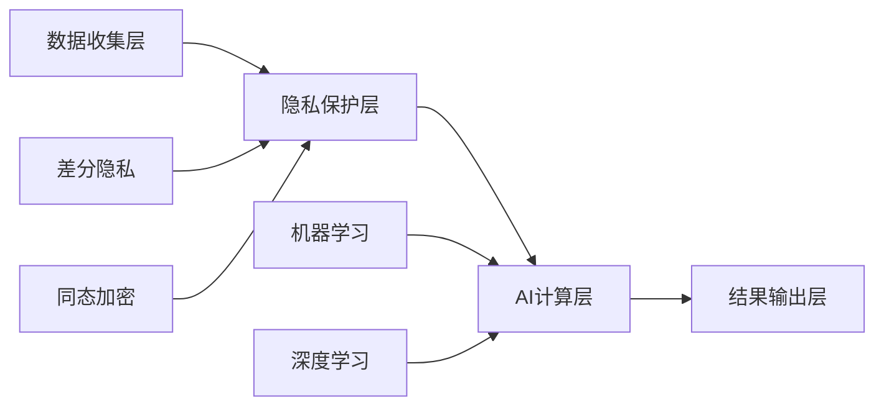

# 隐私保护AI：在数据安全与功能之间寻找平衡

> 关键词：隐私保护AI、数据安全、功能平衡、差分隐私、同态加密

> 摘要：随着人工智能的快速发展，数据的大量使用和共享成为常态，隐私保护问题日益凸显。隐私保护AI旨在解决数据安全与AI功能之间的矛盾，在保证数据隐私的前提下，让AI发挥出应有的作用。本文将深入探讨隐私保护AI的核心概念、算法原理、数学模型，通过项目实战展示其应用，分析实际应用场景，推荐相关工具和资源，并对其未来发展趋势与挑战进行总结。

## 1. 背景介绍 
### 1.1 目的和范围
本文章的目的在于全面介绍隐私保护AI这一新兴领域，探讨如何在数据安全与AI功能之间找到平衡。范围涵盖隐私保护AI的基本概念、核心算法、数学模型、实际应用案例以及相关工具和资源等方面，旨在为读者提供一个系统的、深入的了解隐私保护AI的途径。

### 1.2 预期读者
本文预期读者包括对人工智能、数据安全领域感兴趣的技术人员，如程序员、软件架构师、数据科学家等；也适合相关领域的研究人员、学生以及关注数据隐私保护的企业管理者和决策者。

### 1.3 文档结构概述
本文首先介绍隐私保护AI的背景信息，包括目的、预期读者和文档结构。接着阐述核心概念与联系，包括相关原理和架构的示意图与流程图。然后详细讲解核心算法原理及具体操作步骤，通过Python源代码进行阐述。之后介绍数学模型和公式，并举例说明。再通过项目实战展示代码实际案例和详细解释。随后分析实际应用场景，推荐相关工具和资源。最后总结未来发展趋势与挑战，并提供常见问题与解答以及扩展阅读和参考资料。

### 1.4 术语表
#### 1.4.1 核心术语定义
- **隐私保护AI**：指在人工智能的开发和应用过程中，采取一系列技术和策略来保护数据隐私，同时保证AI系统的功能和性能不受严重影响的技术领域。
- **差分隐私**：一种严格的数学定义的隐私保护技术，通过向数据中添加噪声来保护个体隐私，同时保证数据的统计特性基本不变。
- **同态加密**：一种特殊的加密技术，允许在加密数据上进行特定的计算，而无需先解密数据，计算结果解密后与在明文数据上进行相同计算的结果相同。

#### 1.4.2 相关概念解释
- **数据安全**：指保护数据不受未经授权的访问、使用、披露、破坏、更改或泄露，确保数据的完整性、保密性和可用性。
- **AI功能**：指人工智能系统所具备的各种能力，如机器学习、深度学习中的分类、预测、聚类等功能。

#### 1.4.3 缩略词列表
- **AI**：Artificial Intelligence（人工智能）
- **DP**：Differential Privacy（差分隐私）
- **HE**：Homomorphic Encryption（同态加密）

## 2. 核心概念与联系 
### 核心概念原理
隐私保护AI的核心目标是在数据隐私和AI功能之间找到平衡。其主要原理基于两种关键技术：差分隐私和同态加密。

差分隐私的原理是通过向数据中添加精心设计的噪声，使得数据集中某个个体的存在或不存在对最终的统计结果影响很小，从而保护个体隐私。例如，在一个用户行为数据集中，通过添加噪声，使得攻击者无法准确推断出某个特定用户的行为信息。

同态加密的原理是对数据进行加密后，仍然可以在加密数据上进行特定的数学运算，运算结果解密后与在明文数据上进行相同运算的结果相同。这样可以在不泄露数据隐私的前提下，利用加密数据进行AI计算。

### 架构的文本示意图
隐私保护AI的架构通常包括数据收集层、隐私保护层、AI计算层和结果输出层。

数据收集层负责收集各种类型的数据，如用户行为数据、医疗数据等。隐私保护层采用差分隐私、同态加密等技术对数据进行处理，保护数据隐私。AI计算层利用处理后的数据进行机器学习、深度学习等计算。结果输出层将计算结果以安全的方式输出给用户或相关系统。

### Mermaid流程图


## 3. 核心算法原理 & 具体操作步骤 
### 差分隐私算法原理及Python实现
差分隐私的核心是通过添加拉普拉斯噪声来保护数据隐私。拉普拉斯分布的概率密度函数为：

$$f(x;\mu,b)=\frac{1}{2b}\exp\left(-\frac{|x - \mu|}{b}\right)$$

其中，$\mu$ 是分布的中心，$b$ 是尺度参数。在差分隐私中，噪声的尺度参数 $b$ 与隐私预算 $\epsilon$ 和敏感度 $\Delta f$ 有关，计算公式为：

$$b = \frac{\Delta f}{\epsilon}$$

下面是一个简单的差分隐私示例，对一个数据集的均值进行保护：

```python
import numpy as np

def laplace_mechanism(data, epsilon, sensitivity):
    """
    拉普拉斯机制实现差分隐私
    :param data: 数据集
    :param epsilon: 隐私预算
    :param sensitivity: 敏感度
    :return: 加噪后的均值
    """
    true_mean = np.mean(data)
    b = sensitivity / epsilon
    noise = np.random.laplace(0, b)
    noisy_mean = true_mean + noise
    return noisy_mean

# 示例数据集
data = np.array([1, 2, 3, 4, 5])
epsilon = 0.1
sensitivity = 1

noisy_mean = laplace_mechanism(data, epsilon, sensitivity)
print("加噪后的均值:", noisy_mean)
```

### 同态加密算法原理及Python实现
同态加密的实现较为复杂，这里以Paillier同态加密为例进行简单说明。Paillier同态加密支持加法同态，即可以对加密数据进行加法运算，运算结果解密后与在明文数据上进行加法运算的结果相同。

```python
from phe import paillier

# 生成公钥和私钥
public_key, private_key = paillier.generate_paillier_keypair()

# 明文数据
data1 = 5
data2 = 3

# 加密数据
encrypted_data1 = public_key.encrypt(data1)
encrypted_data2 = public_key.encrypt(data2)

# 加密数据相加
encrypted_sum = encrypted_data1 + encrypted_data2

# 解密结果
decrypted_sum = private_key.decrypt(encrypted_sum)

print("明文相加结果:", data1 + data2)
print("加密数据相加后解密结果:", decrypted_sum)
```

## 4. 数学模型和公式 & 详细讲解 & 举例说明 
### 差分隐私数学模型
差分隐私的数学定义基于两个相邻数据集的概念。设 $D$ 和 $D'$ 是两个相邻数据集，即它们之间只有一个个体的数据不同。一个随机算法 $\mathcal{M}$ 满足 $\epsilon$-差分隐私，如果对于任意的输出集合 $S$，有：

$$\Pr[\mathcal{M}(D) \in S] \leq \exp(\epsilon) \cdot \Pr[\mathcal{M}(D') \in S]$$

其中，$\epsilon$ 是隐私预算，$\epsilon$ 越小，隐私保护程度越高，但数据的可用性可能会降低。

举例说明：假设有一个用户年龄数据集 $D$ 和 $D'$，$D$ 中包含用户A的年龄，$D'$ 中不包含用户A的年龄。一个基于差分隐私的查询算法 $\mathcal{M}$ 对 $D$ 和 $D'$ 进行查询，对于任意的查询结果集合 $S$，满足上述不等式。

### 同态加密数学模型
以Paillier同态加密为例，其加密和解密过程基于数论原理。设 $n = pq$ 是两个大素数 $p$ 和 $q$ 的乘积，公钥为 $(n, g)$，私钥为 $(\lambda, \mu)$。

加密过程：对于明文 $m$，随机选择一个整数 $r \in \mathbb{Z}_n^*$，加密结果为：

$$c = g^m r^n \bmod n^2$$

解密过程：对于密文 $c$，解密结果为：

$$m = L(c^\lambda \bmod n^2) \cdot \mu \bmod n$$

其中，$L(u) = \frac{u - 1}{n}$。

举例说明：假设 $n = 15$，$g = 4$，明文 $m = 3$，随机选择 $r = 2$。加密过程为：

$$c = 4^3 \cdot 2^{15} \bmod 15^2 = 64 \cdot 32768 \bmod 225 = 20736 \bmod 225 = 156$$

解密过程需要计算私钥 $\lambda$ 和 $\mu$，这里省略具体计算过程，最终解密结果为 $m = 3$。

## 5. 项目实战：代码实际案例和详细解释说明 
### 5.1  开发环境搭建
本项目使用Python语言进行开发，需要安装以下库：
- `numpy`：用于数值计算
- `phe`：用于同态加密
- `scikit-learn`：用于机器学习算法

可以使用以下命令进行安装：

```bash
pip install numpy phe scikit-learn
```

### 5.2  源代码详细实现和代码解读
以下是一个基于差分隐私和同态加密的简单机器学习项目示例，使用鸢尾花数据集进行分类任务。

```python
import numpy as np
from phe import paillier
from sklearn.datasets import load_iris
from sklearn.model_selection import train_test_split
from sklearn.linear_model import LogisticRegression

# 加载鸢尾花数据集
iris = load_iris()
X = iris.data
y = iris.target

# 划分训练集和测试集
X_train, X_test, y_train, y_test = train_test_split(X, y, test_size=0.2, random_state=42)

# 差分隐私处理训练数据
def laplace_mechanism(data, epsilon, sensitivity):
    """
    拉普拉斯机制实现差分隐私
    :param data: 数据集
    :param epsilon: 隐私预算
    :param sensitivity: 敏感度
    :return: 加噪后的数据集
    """
    b = sensitivity / epsilon
    noise = np.random.laplace(0, b, data.shape)
    noisy_data = data + noise
    return noisy_data

epsilon = 0.1
sensitivity = 1
noisy_X_train = laplace_mechanism(X_train, epsilon, sensitivity)

# 同态加密处理标签
public_key, private_key = paillier.generate_paillier_keypair()
encrypted_y_train = [public_key.encrypt(label) for label in y_train]

# 训练模型
model = LogisticRegression()
model.fit(noisy_X_train, y_train)

# 预测
predictions = model.predict(X_test)

# 解密预测结果（这里只是示例，实际应用中可能需要更复杂的处理）
# 由于同态加密不直接支持分类预测的解密，这里只是简单输出预测结果
print("预测结果:", predictions)
```

### 5.3  代码解读与分析
1. **数据加载与划分**：使用 `sklearn` 库加载鸢尾花数据集，并将其划分为训练集和测试集。
2. **差分隐私处理**：使用拉普拉斯机制对训练数据进行加噪处理，保护数据隐私。
3. **同态加密处理**：使用Paillier同态加密对训练标签进行加密，确保标签的隐私性。
4. **模型训练与预测**：使用加噪后的训练数据和原始标签训练逻辑回归模型，并对测试数据进行预测。
5. **解密预测结果**：由于同态加密不直接支持分类预测的解密，这里只是简单输出预测结果。在实际应用中，可能需要更复杂的处理来保护预测结果的隐私。

## 6. 实际应用场景 
### 医疗领域
在医疗领域，患者的医疗数据包含大量敏感信息，如疾病史、基因信息等。隐私保护AI可以在保护患者隐私的前提下，利用这些数据进行疾病诊断、药物研发等工作。例如，多家医院可以在不共享患者原始数据的情况下，联合训练一个疾病预测模型，通过差分隐私和同态加密技术保护患者数据隐私。

### 金融领域
金融领域的客户交易数据、信用信息等都属于敏感信息。隐私保护AI可以用于风险评估、欺诈检测等任务。例如，银行可以在加密的客户交易数据上进行欺诈检测模型的训练，避免数据泄露风险。

### 智能交通领域
智能交通系统中，车辆的行驶轨迹、驾驶员信息等数据需要保护。隐私保护AI可以用于交通流量预测、自动驾驶等任务。例如，通过差分隐私技术对车辆行驶轨迹数据进行处理，在保护驾驶员隐私的同时，提高交通流量预测的准确性。

## 7. 工具和资源推荐
### 7.1 学习资源推荐
#### 7.1.1 书籍推荐
- 《隐私计算：原理、技术与应用》：全面介绍隐私计算的原理、技术和应用，包括差分隐私、同态加密等内容。
- 《机器学习中的隐私保护》：深入探讨机器学习中的隐私保护问题，提供了大量的理论和实践案例。

#### 7.1.2 在线课程
- Coursera上的“Privacy in Machine Learning”课程：由知名学者授课，系统介绍机器学习中的隐私保护技术。
- edX上的“Differential Privacy”课程：专门讲解差分隐私的原理和应用。

#### 7.1.3 技术博客和网站
- Towards Data Science：有许多关于隐私保护AI的技术文章和案例分享。
- IAPP（International Association of Privacy Professionals）：提供最新的隐私保护领域的资讯和研究成果。

### 7.2 开发工具框架推荐
#### 7.2.1 IDE和编辑器
- PyCharm：功能强大的Python集成开发环境，适合开发隐私保护AI项目。
- Visual Studio Code：轻量级的代码编辑器，支持多种编程语言和插件，方便进行代码开发和调试。

#### 7.2.2 调试和性能分析工具
- `pdb`：Python自带的调试工具，可以帮助调试隐私保护AI代码。
- `cProfile`：Python的性能分析工具，用于分析代码的性能瓶颈。

#### 7.2.3 相关框架和库
- `OpenMined/PySyft`：用于隐私保护深度学习的Python库，支持差分隐私、同态加密等技术。
- `IBM Differential Privacy Library`：专门用于差分隐私的Python库，提供了多种差分隐私算法的实现。

### 7.3 相关论文著作推荐
#### 7.3.1 经典论文
- “Differential Privacy” by Cynthia Dwork：差分隐私领域的经典论文，首次提出了差分隐私的概念和定义。
- “Public-Key Cryptosystems Based on Composite Degree Residuosity Classes” by Pascal Paillier：介绍了Paillier同态加密算法的论文。

#### 7.3.2 最新研究成果
- 关注顶级学术会议如NeurIPS、ICML等，这些会议上有许多关于隐私保护AI的最新研究成果。
- 关注顶级学术期刊如Journal of Privacy and Confidentiality等，这些期刊上发表了大量隐私保护领域的研究论文。

#### 7.3.3 应用案例分析
- 可以参考一些大型科技公司的技术博客，如Google、Microsoft等，他们会分享一些隐私保护AI的应用案例和实践经验。

## 8. 总结：未来发展趋势与挑战
### 未来发展趋势
- **多技术融合**：未来隐私保护AI将融合更多的技术，如区块链、联邦学习等，进一步提高数据隐私保护的效果和AI系统的性能。
- **行业应用拓展**：隐私保护AI将在更多的行业得到应用，如教育、能源、政府等，为各个行业的数据安全和隐私保护提供解决方案。
- **标准化和规范化**：随着隐私保护AI的发展，相关的标准和规范将逐渐完善，促进隐私保护AI技术的健康发展。

### 挑战
- **性能瓶颈**：目前差分隐私和同态加密等技术在计算效率上存在一定的瓶颈，如何在保证隐私保护的前提下，提高计算效率是一个亟待解决的问题。
- **安全漏洞**：隐私保护AI技术也存在一定的安全漏洞，如差分隐私中的噪声添加可能会导致数据可用性降低，同态加密中的密钥管理也存在安全风险。
- **法律法规和伦理问题**：隐私保护AI涉及到许多法律法规和伦理问题，如数据所有权、隐私政策等，如何在法律和伦理的框架内发展隐私保护AI是一个重要的挑战。

## 9. 附录：常见问题与解答
### 差分隐私和同态加密有什么区别？
差分隐私通过向数据中添加噪声来保护数据隐私，主要用于保护数据的统计特性；同态加密则是对数据进行加密后，仍然可以在加密数据上进行特定的计算，主要用于保护数据的机密性。

### 隐私保护AI会影响AI系统的性能吗？
在一定程度上会影响AI系统的性能。差分隐私添加的噪声可能会降低数据的质量，从而影响模型的准确性；同态加密的计算复杂度较高，会增加计算时间和资源消耗。但是，通过合理的参数选择和算法优化，可以在保证隐私保护的前提下，尽量减少对AI系统性能的影响。

### 隐私保护AI在实际应用中需要注意什么？
在实际应用中，需要根据具体的应用场景和需求选择合适的隐私保护技术；同时，需要注意数据的敏感性和可用性，合理设置隐私预算和加密参数；此外，还需要遵守相关的法律法规和伦理准则，确保数据的合法使用和隐私保护。

## 10. 扩展阅读 & 参考资料
### 扩展阅读
- 《数据安全法》《个人信息保护法》等相关法律法规，了解数据安全和隐私保护的法律要求。
- 一些关于人工智能伦理和社会影响的书籍和文章，深入思考隐私保护AI的伦理问题。

### 参考资料
- 本文中引用的论文、书籍、在线课程等相关资料。
- 相关技术文档和官方网站，如 `OpenMined/PySyft`、`IBM Differential Privacy Library` 等的官方文档。