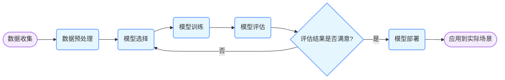

# 顶级掠食者：AI创造者的职业路径

> 关键词：AI创造者、职业路径、人工智能技术、职业发展、技能提升

> 摘要：本文旨在深入探讨AI创造者的职业路径，从背景介绍出发，详细阐述AI相关的核心概念与联系、核心算法原理及操作步骤、数学模型和公式。通过项目实战案例，展示如何将理论应用于实际。同时分析AI创造者在不同场景下的实际应用，推荐相关的工具和资源。最后总结未来发展趋势与挑战，解答常见问题，并提供扩展阅读和参考资料，为有志于成为AI创造者的人士提供全面且深入的指导。

## 1. 背景介绍 
### 1.1 目的和范围
随着人工智能技术的飞速发展，AI创造者这一职业群体逐渐成为科技领域的核心力量。本文的目的在于为那些希望进入AI领域并成为顶级AI创造者的人提供清晰、全面的职业路径指导。范围涵盖了从基础知识学习、技能培养、项目实践到职业发展的各个阶段，同时探讨了相关的技术原理、数学模型以及实际应用场景。

### 1.2 预期读者
本文预期读者主要包括以下几类人群：
- 对人工智能充满热情，希望了解如何成为AI创造者的大学生和初学者。
- 已经在相关领域工作，想要转型成为AI创造者的专业人士。
- 教育工作者和研究者，希望从职业发展的角度深入了解AI领域。

### 1.3 文档结构概述
本文将按照以下结构展开：
- 核心概念与联系：介绍人工智能的核心概念、原理和架构，并通过示意图和流程图进行直观展示。
- 核心算法原理 & 具体操作步骤：详细讲解人工智能的核心算法原理，并使用Python代码进行实现和说明。
- 数学模型和公式 & 详细讲解 & 举例说明：阐述人工智能中涉及的数学模型和公式，并通过具体例子进行深入理解。
- 项目实战：通过实际案例展示如何将理论知识应用于实践，包括开发环境搭建、源代码实现和代码解读。
- 实际应用场景：分析AI创造者在不同领域的实际应用场景。
- 工具和资源推荐：推荐学习资源、开发工具框架以及相关论文著作。
- 总结：未来发展趋势与挑战：总结AI创造者职业的未来发展趋势和面临的挑战。
- 附录：常见问题与解答：解答读者在职业发展过程中常见的问题。
- 扩展阅读 & 参考资料：提供进一步学习的扩展阅读材料和参考资料。

### 1.4 术语表
#### 1.4.1 核心术语定义
- **人工智能（Artificial Intelligence，AI）**：是一门研究如何使计算机能够模拟人类智能的学科，包括学习、推理、感知、语言理解等能力。
- **机器学习（Machine Learning，ML）**：是人工智能的一个重要分支，通过让计算机从数据中自动学习模式和规律，从而实现预测和决策。
- **深度学习（Deep Learning，DL）**：是机器学习的一种特殊形式，使用深度神经网络来处理复杂的数据，在图像识别、语音识别等领域取得了巨大成功。
- **神经网络（Neural Network）**：是一种模仿人类神经系统的计算模型，由多个神经元组成，通过调整神经元之间的连接权重来学习数据的特征。
- **强化学习（Reinforcement Learning，RL）**：是一种通过智能体与环境进行交互，根据环境反馈的奖励信号来学习最优行为策略的机器学习方法。

#### 1.4.2 相关概念解释
- **监督学习（Supervised Learning）**：在监督学习中，训练数据包含输入特征和对应的标签，模型通过学习输入和标签之间的关系来进行预测。
- **无监督学习（Unsupervised Learning）**：无监督学习的训练数据只包含输入特征，没有对应的标签，模型的任务是发现数据中的内在结构和模式。
- **半监督学习（Semi - supervised Learning）**：半监督学习结合了监督学习和无监督学习的方法，使用少量有标签数据和大量无标签数据进行训练。
- **迁移学习（Transfer Learning）**：迁移学习是指将在一个任务上学习到的知识和技能迁移到另一个相关任务上，以提高模型的性能和训练效率。

#### 1.4.3 缩略词列表
- **AI**：Artificial Intelligence
- **ML**：Machine Learning
- **DL**：Deep Learning
- **RL**：Reinforcement Learning
- **DNN**：Deep Neural Network
- **CNN**：Convolutional Neural Network
- **RNN**：Recurrent Neural Network

## 2. 核心概念与联系 
### 2.1 人工智能的核心概念原理
人工智能的核心目标是使计算机能够模拟人类的智能行为，其实现途径主要包括机器学习、自然语言处理、计算机视觉等领域。机器学习是人工智能的核心技术之一，它通过让计算机从数据中学习模式和规律，从而实现对未知数据的预测和决策。

深度学习作为机器学习的一个重要分支，使用深度神经网络来处理复杂的数据。深度神经网络由多个神经元层组成，每一层神经元通过非线性变换将输入数据映射到更高层次的特征表示。通过不断调整神经元之间的连接权重，深度神经网络可以学习到数据的复杂特征，从而在图像识别、语音识别等领域取得优异的性能。

### 2.2 人工智能的架构
人工智能系统通常由数据层、模型层和应用层组成。数据层负责收集、存储和预处理数据，为模型训练提供高质量的数据。模型层使用各种机器学习和深度学习算法构建模型，并进行训练和优化。应用层将训练好的模型应用于实际场景，如智能推荐、自动驾驶等。

### 2.3 文本示意图
```plaintext
人工智能系统架构

+----------------+
|   应用层       |
| （智能推荐、   |
|  自动驾驶等） |
+----------------+
|   模型层       |
| （机器学习、   |
|  深度学习模型）|
+----------------+
|   数据层       |
| （数据收集、   |
|  存储和预处理）|
+----------------+
```

### 2.4 Mermaid流程图


## 3. 核心算法原理 & 具体操作步骤 
### 3.1 线性回归算法原理
线性回归是一种简单而常用的机器学习算法，用于预测连续数值。其基本原理是通过找到一条直线（在二维空间中）或超平面（在多维空间中），使得数据点到该直线或超平面的距离之和最小。

线性回归的数学模型可以表示为：
$$y = \theta_0 + \theta_1x_1 + \theta_2x_2 + \cdots + \theta_nx_n$$
其中，$y$ 是预测值，$x_1, x_2, \cdots, x_n$ 是输入特征，$\theta_0, \theta_1, \cdots, \theta_n$ 是模型的参数。

### 3.2 Python代码实现线性回归
```python
import numpy as np
from sklearn.linear_model import LinearRegression
import matplotlib.pyplot as plt

# 生成示例数据
np.random.seed(0)
X = np.random.rand(100, 1)
y = 2 * X + 1 + 0.5 * np.random.randn(100, 1)

# 创建线性回归模型
model = LinearRegression()

# 训练模型
model.fit(X, y)

# 预测
X_new = np.array([[0.5]])
y_pred = model.predict(X_new)

# 输出模型参数
print("截距:", model.intercept_)
print("斜率:", model.coef_)
print("预测值:", y_pred)

# 可视化结果
plt.scatter(X, y, color='blue')
plt.plot(X, model.predict(X), color='red', linewidth=2)
plt.xlabel('X')
plt.ylabel('y')
plt.title('Linear Regression')
plt.show()
```
### 3.3 代码解释
1. **数据生成**：使用 `numpy` 生成随机数据作为示例，其中 $X$ 是输入特征，$y$ 是对应的目标值。
2. **模型创建**：使用 `sklearn` 库中的 `LinearRegression` 类创建线性回归模型。
3. **模型训练**：调用 `fit` 方法对模型进行训练，传入输入特征 $X$ 和目标值 $y$。
4. **预测**：使用训练好的模型对新的输入数据进行预测。
5. **输出模型参数**：打印模型的截距和斜率，以及预测值。
6. **可视化结果**：使用 `matplotlib` 库绘制数据点和拟合直线，直观展示线性回归的结果。

### 3.4 逻辑回归算法原理
逻辑回归是一种用于分类问题的机器学习算法，它通过逻辑函数将线性回归的输出映射到 $[0, 1]$ 区间，从而得到样本属于某个类别的概率。

逻辑函数的定义为：
$$\sigma(z) = \frac{1}{1 + e^{-z}}$$
其中，$z$ 是线性回归的输出，$\sigma(z)$ 是样本属于正类的概率。

### 3.5 Python代码实现逻辑回归
```python
import numpy as np
from sklearn.linear_model import LogisticRegression
from sklearn.datasets import make_classification
import matplotlib.pyplot as plt

# 生成示例数据
X, y = make_classification(n_samples=100, n_features=2, n_informative=2, n_redundant=0, random_state=42)

# 创建逻辑回归模型
model = LogisticRegression()

# 训练模型
model.fit(X, y)

# 预测
X_new = np.array([[0, 0]])
y_pred = model.predict(X_new)

# 输出预测结果
print("预测类别:", y_pred)

# 可视化结果
plt.scatter(X[:, 0], X[:, 1], c=y, cmap='viridis')
x_min, x_max = X[:, 0].min() - 1, X[:, 0].max() + 1
y_min, y_max = X[:, 1].min() - 1, X[:, 1].max() + 1
xx, yy = np.meshgrid(np.arange(x_min, x_max, 0.02), np.arange(y_min, y_max, 0.02))
Z = model.predict(np.c_[xx.ravel(), yy.ravel()])
Z = Z.reshape(xx.shape)
plt.contourf(xx, yy, Z, alpha=0.4, cmap='viridis')
plt.xlabel('Feature 1')
plt.ylabel('Feature 2')
plt.title('Logistic Regression')
plt.show()
```
### 3.6 代码解释
1. **数据生成**：使用 `sklearn` 库中的 `make_classification` 函数生成二分类示例数据。
2. **模型创建**：使用 `sklearn` 库中的 `LogisticRegression` 类创建逻辑回归模型。
3. **模型训练**：调用 `fit` 方法对模型进行训练，传入输入特征 $X$ 和目标值 $y$。
4. **预测**：使用训练好的模型对新的输入数据进行预测。
5. **输出预测结果**：打印预测的类别。
6. **可视化结果**：使用 `matplotlib` 库绘制数据点和决策边界，直观展示逻辑回归的分类结果。

## 4. 数学模型和公式 & 详细讲解 & 举例说明 
### 4.1 线性回归的数学模型和公式
线性回归的目标是找到一组参数 $\theta = [\theta_0, \theta_1, \cdots, \theta_n]$，使得预测值 $\hat{y}$ 与真实值 $y$ 之间的误差最小。通常使用均方误差（Mean Squared Error，MSE）作为损失函数：
$$MSE(\theta) = \frac{1}{m} \sum_{i = 1}^{m} (\hat{y}^{(i)} - y^{(i)})^2$$
其中，$m$ 是样本数量，$\hat{y}^{(i)}$ 是第 $i$ 个样本的预测值，$y^{(i)}$ 是第 $i$ 个样本的真实值。

为了最小化均方误差，可以使用梯度下降法。梯度下降法的更新公式为：
$$\theta_j := \theta_j - \alpha \frac{\partial MSE(\theta)}{\partial \theta_j}$$
其中，$\alpha$ 是学习率，$\frac{\partial MSE(\theta)}{\partial \theta_j}$ 是损失函数关于参数 $\theta_j$ 的偏导数。

### 4.2 举例说明
假设我们有一组简单的二维数据 $(x_1, y_1), (x_2, y_2), \cdots, (x_m, y_m)$，线性回归模型为 $y = \theta_0 + \theta_1x$。均方误差损失函数为：
$$MSE(\theta_0, \theta_1) = \frac{1}{m} \sum_{i = 1}^{m} (\theta_0 + \theta_1x^{(i)} - y^{(i)})^2$$
对 $\theta_0$ 和 $\theta_1$ 求偏导数：
$$\frac{\partial MSE(\theta_0, \theta_1)}{\partial \theta_0} = \frac{2}{m} \sum_{i = 1}^{m} (\theta_0 + \theta_1x^{(i)} - y^{(i)})$$
$$\frac{\partial MSE(\theta_0, \theta_1)}{\partial \theta_1} = \frac{2}{m} \sum_{i = 1}^{m} (\theta_0 + \theta_1x^{(i)} - y^{(i)})x^{(i)}$$
使用梯度下降法更新参数：
$$\theta_0 := \theta_0 - \alpha \frac{2}{m} \sum_{i = 1}^{m} (\theta_0 + \theta_1x^{(i)} - y^{(i)})$$
$$\theta_1 := \theta_1 - \alpha \frac{2}{m} \sum_{i = 1}^{m} (\theta_0 + \theta_1x^{(i)} - y^{(i)})x^{(i)}$$

### 4.3 逻辑回归的数学模型和公式
逻辑回归的目标是最大化似然函数，即样本属于其真实类别的概率。似然函数可以表示为：
$$L(\theta) = \prod_{i = 1}^{m} P(y^{(i)} | x^{(i)}; \theta)$$
其中，$P(y^{(i)} | x^{(i)}; \theta)$ 是第 $i$ 个样本属于其真实类别的概率。

为了方便计算，通常使用对数似然函数：
$$\ell(\theta) = \log L(\theta) = \sum_{i = 1}^{m} \log P(y^{(i)} | x^{(i)}; \theta)$$
在二分类问题中，$P(y | x; \theta) = \sigma(\theta^T x)^y (1 - \sigma(\theta^T x))^{1 - y}$，其中 $\sigma(z)$ 是逻辑函数。

对数似然函数可以进一步展开为：
$$\ell(\theta) = \sum_{i = 1}^{m} [y^{(i)} \log \sigma(\theta^T x^{(i)}) + (1 - y^{(i)}) \log (1 - \sigma(\theta^T x^{(i)}))]$$
为了最大化对数似然函数，可以使用梯度上升法。梯度上升法的更新公式为：
$$\theta_j := \theta_j + \alpha \frac{\partial \ell(\theta)}{\partial \theta_j}$$

### 4.4 举例说明
假设我们有一个二分类问题，输入特征 $x$ 是一维的，逻辑回归模型为 $P(y = 1 | x; \theta) = \sigma(\theta_0 + \theta_1x)$。对数似然函数为：
$$\ell(\theta_0, \theta_1) = \sum_{i = 1}^{m} [y^{(i)} \log \sigma(\theta_0 + \theta_1x^{(i)}) + (1 - y^{(i)}) \log (1 - \sigma(\theta_0 + \theta_1x^{(i)}))]$$
对 $\theta_0$ 和 $\theta_1$ 求偏导数：
$$\frac{\partial \ell(\theta_0, \theta_1)}{\partial \theta_0} = \sum_{i = 1}^{m} (y^{(i)} - \sigma(\theta_0 + \theta_1x^{(i)}))$$
$$\frac{\partial \ell(\theta_0, \theta_1)}{\partial \theta_1} = \sum_{i = 1}^{m} (y^{(i)} - \sigma(\theta_0 + \theta_1x^{(i)}))x^{(i)}$$
使用梯度上升法更新参数：
$$\theta_0 := \theta_0 + \alpha \sum_{i = 1}^{m} (y^{(i)} - \sigma(\theta_0 + \theta_1x^{(i)}))$$
$$\theta_1 := \theta_1 + \alpha \sum_{i = 1}^{m} (y^{(i)} - \sigma(\theta_0 + \theta_1x^{(i)}))x^{(i)}$$

## 5. 项目实战：代码实际案例和详细解释说明 
### 5.1  开发环境搭建
#### 5.1.1 安装Python
首先，需要安装Python编程语言。可以从Python官方网站（https://www.python.org/downloads/） 下载适合自己操作系统的Python安装包，并按照安装向导进行安装。建议安装Python 3.7及以上版本。

#### 5.1.2 安装开发环境
推荐使用Anaconda作为Python的开发环境。Anaconda是一个开源的Python发行版本，包含了许多常用的科学计算和数据分析库。可以从Anaconda官方网站（https://www.anaconda.com/products/individual） 下载适合自己操作系统的Anaconda安装包，并按照安装向导进行安装。

#### 5.1.3 创建虚拟环境
为了避免不同项目之间的依赖冲突，建议使用虚拟环境。可以使用Anaconda创建虚拟环境：
```bash
conda create -n ai_project python=3.8
conda activate ai_project
```
#### 5.1.4 安装必要的库
在虚拟环境中安装必要的Python库，如 `numpy`、`pandas`、`scikit - learn`、`tensorflow`、`pytorch` 等：
```bash
pip install numpy pandas scikit-learn tensorflow torch matplotlib
```

### 5.2  源代码详细实现和代码解读
#### 5.2.1 项目概述
本项目是一个简单的手写数字识别项目，使用深度学习中的卷积神经网络（Convolutional Neural Network，CNN）来识别MNIST数据集中的手写数字。

#### 5.2.2 代码实现
```python
import tensorflow as tf
from tensorflow.keras.datasets import mnist
from tensorflow.keras.models import Sequential
from tensorflow.keras.layers import Conv2D, MaxPooling2D, Flatten, Dense
import matplotlib.pyplot as plt

# 加载MNIST数据集
(train_images, train_labels), (test_images, test_labels) = mnist.load_data()

# 数据预处理
train_images = train_images.reshape((60000, 28, 28, 1)).astype('float32') / 255
test_images = test_images.reshape((10000, 28, 28, 1)).astype('float32') / 255

train_labels = tf.keras.utils.to_categorical(train_labels)
test_labels = tf.keras.utils.to_categorical(test_labels)

# 构建卷积神经网络模型
model = Sequential([
    Conv2D(32, (3, 3), activation='relu', input_shape=(28, 28, 1)),
    MaxPooling2D((2, 2)),
    Conv2D(64, (3, 3), activation='relu'),
    MaxPooling2D((2, 2)),
    Flatten(),
    Dense(64, activation='relu'),
    Dense(10, activation='softmax')
])

# 编译模型
model.compile(optimizer='adam',
              loss='categorical_crossentropy',
              metrics=['accuracy'])

# 训练模型
history = model.fit(train_images, train_labels, epochs=5, batch_size=64)

# 评估模型
test_loss, test_acc = model.evaluate(test_images, test_labels)
print(f"Test accuracy: {test_acc}")

# 可视化训练过程
plt.plot(history.history['accuracy'])
plt.title('Model accuracy')
plt.ylabel('Accuracy')
plt.xlabel('Epoch')
plt.legend(['Train'], loc='upper left')
plt.show()

plt.plot(history.history['loss'])
plt.title('Model loss')
plt.ylabel('Loss')
plt.xlabel('Epoch')
plt.legend(['Train'], loc='upper left')
plt.show()
```
#### 5.2.3 代码解读
1. **数据加载**：使用 `tensorflow.keras.datasets.mnist.load_data()` 加载MNIST数据集，该数据集包含60000个训练样本和10000个测试样本。
2. **数据预处理**：将图像数据的形状调整为 `(样本数, 高度, 宽度, 通道数)`，并将像素值归一化到 $[0, 1]$ 区间。同时，将标签进行独热编码。
3. **模型构建**：使用 `Sequential` 模型构建卷积神经网络，包含卷积层、池化层、全连接层等。
4. **模型编译**：使用 `adam` 优化器和 `categorical_crossentropy` 损失函数编译模型，并设置评估指标为准确率。
5. **模型训练**：使用 `fit` 方法对模型进行训练，设置训练轮数和批次大小。
6. **模型评估**：使用 `evaluate` 方法对模型在测试集上的性能进行评估。
7. **可视化训练过程**：使用 `matplotlib` 库绘制训练过程中的准确率和损失曲线，直观展示模型的训练效果。

### 5.3  代码解读与分析
#### 5.3.1 卷积层的作用
卷积层是卷积神经网络的核心组件，它通过卷积核在输入图像上滑动，提取图像的局部特征。卷积核的大小、数量和步长等参数会影响卷积层的输出特征图的大小和数量。

#### 5.3.2 池化层的作用
池化层用于减少特征图的尺寸，降低模型的计算量和参数数量，同时增强模型的鲁棒性。常用的池化方法有最大池化和平均池化。

#### 5.3.3 全连接层的作用
全连接层将卷积层和池化层提取的特征进行整合，将特征映射到分类空间，从而实现分类任务。

#### 5.3.4 激活函数的作用
激活函数引入非线性因素，使得神经网络能够学习到复杂的函数关系。常用的激活函数有 `relu`、`sigmoid`、`tanh` 等。

#### 5.3.5 损失函数和优化器的选择
损失函数用于衡量模型的预测值与真实值之间的差异，优化器用于更新模型的参数以最小化损失函数。在分类问题中，常用的损失函数是交叉熵损失函数，常用的优化器有 `adam`、`sgd` 等。

## 6. 实际应用场景 
### 6.1 医疗领域
- **疾病诊断**：AI创造者可以开发基于深度学习的医学图像分析系统，如X光、CT、MRI等图像的诊断系统，帮助医生更准确地检测疾病，如肿瘤、肺炎等。
- **药物研发**：利用人工智能技术分析大量的生物数据和药物信息，预测药物的疗效和副作用，加速药物研发的进程。

### 6.2 金融领域
- **风险评估**：通过分析客户的信用记录、财务数据等信息，使用机器学习算法评估客户的信用风险，为金融机构提供决策支持。
- **交易预测**：利用人工智能技术分析市场数据和新闻信息，预测股票、期货等金融产品的价格走势，辅助投资者进行交易决策。

### 6.3 交通领域
- **自动驾驶**：AI创造者可以参与自动驾驶汽车的研发，开发感知、决策和控制算法，使汽车能够自动识别道路、交通标志和其他车辆，实现自动驾驶。
- **智能交通管理**：通过分析交通流量数据，使用人工智能算法优化交通信号控制，缓解城市交通拥堵。

### 6.4 教育领域
- **个性化学习**：根据学生的学习进度、兴趣爱好等信息，使用人工智能算法为学生提供个性化的学习方案和学习资源，提高学习效果。
- **智能辅导**：开发智能辅导系统，能够自动解答学生的问题，提供实时反馈和指导。

### 6.5 娱乐领域
- **游戏开发**：利用人工智能技术开发智能游戏角色，使游戏角色能够根据玩家的行为做出智能反应，提高游戏的趣味性和挑战性。
- **内容推荐**：通过分析用户的历史行为和偏好，使用人工智能算法为用户推荐个性化的音乐、电影、书籍等内容。

## 7. 工具和资源推荐
### 7.1 学习资源推荐
#### 7.1.1 书籍推荐
- 《深度学习》（Deep Learning）：由Ian Goodfellow、Yoshua Bengio和Aaron Courville撰写，是深度学习领域的经典教材，全面介绍了深度学习的理论和实践。
- 《Python机器学习》（Python Machine Learning）：由Sebastian Raschka和Vahid Mirjalili撰写，详细介绍了使用Python进行机器学习的方法和技术。
- 《人工智能：一种现代的方法》（Artificial Intelligence: A Modern Approach）：由Stuart Russell和Peter Norvig撰写，是人工智能领域的权威教材，涵盖了人工智能的各个方面。

#### 7.1.2 在线课程
- Coursera上的“机器学习”课程：由Andrew Ng教授讲授，是机器学习领域的经典课程，适合初学者入门。
- edX上的“深度学习”课程：由DeepLearning.AI提供，深入介绍了深度学习的原理和应用。
- Udemy上的“Python数据科学和机器学习实战”课程：结合实际案例，介绍了使用Python进行数据科学和机器学习的方法和技术。

#### 7.1.3 技术博客和网站
- Medium：是一个技术博客平台，上面有许多人工智能领域的优秀文章和教程。
- Towards Data Science：专注于数据科学和人工智能领域，提供了大量的技术文章和案例分析。
- arXiv：是一个预印本服务器，上面有许多最新的人工智能研究论文。

### 7.2 开发工具框架推荐
#### 7.2.1 IDE和编辑器
- PyCharm：是一款专门为Python开发设计的集成开发环境，提供了丰富的代码编辑、调试和分析功能。
- Jupyter Notebook：是一个交互式的开发环境，适合进行数据探索和模型实验，支持Python、R等多种编程语言。
- Visual Studio Code：是一款轻量级的代码编辑器，支持多种编程语言和插件扩展，广泛应用于人工智能开发。

#### 7.2.2 调试和性能分析工具
- TensorBoard：是TensorFlow的可视化工具，可用于监控模型的训练过程、可视化模型结构和分析性能指标。
- PyTorch Profiler：是PyTorch的性能分析工具，可用于分析模型的计算时间、内存使用等性能指标。
- cProfile：是Python的内置性能分析工具，可用于分析Python代码的运行时间和函数调用情况。

#### 7.2.3 相关框架和库
- TensorFlow：是Google开发的开源深度学习框架，提供了丰富的工具和库，支持分布式训练和模型部署。
- PyTorch：是Facebook开发的开源深度学习框架，具有动态图和易于使用的特点，广泛应用于学术研究和工业开发。
- Scikit - learn：是Python的机器学习库，提供了丰富的机器学习算法和工具，适合初学者入门。

### 7.3 相关论文著作推荐
#### 7.3.1 经典论文
- “Gradient - Based Learning Applied to Document Recognition”：由Yann LeCun等人撰写，介绍了卷积神经网络的经典模型LeNet，开创了卷积神经网络在图像识别领域的应用。
- “ImageNet Classification with Deep Convolutional Neural Networks”：由Alex Krizhevsky等人撰写，介绍了AlexNet模型，在2012年的ImageNet图像分类竞赛中取得了巨大成功，推动了深度学习的发展。
- “Attention Is All You Need”：由Ashish Vaswani等人撰写，介绍了Transformer模型，在自然语言处理领域取得了显著的成果。

#### 7.3.2 最新研究成果
- 关注顶级学术会议如NeurIPS、ICML、CVPR等的最新论文，了解人工智能领域的最新研究动态和技术趋势。
- 关注知名研究机构如OpenAI、DeepMind等的官方网站，获取他们的最新研究成果和技术报告。

#### 7.3.3 应用案例分析
- 阅读相关的行业报告和案例分析，了解人工智能在不同领域的实际应用情况和成功经验。
- 参考开源项目和代码库，学习他人在实际项目中的实现思路和方法。

## 8. 总结：未来发展趋势与挑战
### 8.1 未来发展趋势
#### 8.1.1 多模态融合
未来的人工智能系统将更加注重多模态数据的融合，如图像、语音、文本等。通过融合多种模态的数据，人工智能系统可以获得更全面、更准确的信息，从而实现更智能的决策和交互。

#### 8.1.2 强化学习与现实应用的结合
强化学习在游戏、机器人等领域已经取得了显著的成果，未来将更多地应用于现实世界的问题，如自动驾驶、智能物流等。通过强化学习，智能体可以在复杂的环境中学习最优的行为策略，提高系统的效率和性能。

#### 8.1.3 人工智能与其他技术的融合
人工智能将与物联网、区块链、云计算等技术深度融合，创造出更多的创新应用。例如，物联网提供了大量的实时数据，人工智能可以对这些数据进行分析和处理，实现智能决策和自动化控制。

#### 8.1.4 可解释人工智能
随着人工智能在医疗、金融等关键领域的应用越来越广泛，可解释人工智能将成为未来的研究热点。可解释人工智能旨在让人工智能系统的决策过程和结果变得可理解、可解释，提高系统的可信度和可靠性。

### 8.2 面临的挑战
#### 8.2.1 数据隐私和安全问题
人工智能系统的训练和运行需要大量的数据，这些数据可能包含用户的隐私信息。因此，如何保护数据的隐私和安全是人工智能发展面临的重要挑战。

#### 8.2.2 算法偏见和公平性问题
人工智能算法的训练数据可能存在偏见，导致模型的预测结果出现不公平的情况。如何消除算法偏见，确保人工智能系统的公平性和公正性是需要解决的问题。

#### 8.2.3 人才短缺问题
人工智能领域的快速发展导致对专业人才的需求急剧增加，目前人才短缺是制约人工智能发展的重要因素。如何培养更多的人工智能专业人才是未来需要关注的问题。

#### 8.2.4 伦理和法律问题
人工智能的发展带来了一系列的伦理和法律问题，如人工智能的责任归属、人工智能对就业的影响等。如何制定相应的伦理和法律规范，引导人工智能的健康发展是亟待解决的问题。

## 9. 附录：常见问题与解答
### 9.1 成为AI创造者需要具备哪些基础知识？
成为AI创造者需要具备数学基础（如线性代数、概率论、统计学等）、编程基础（如Python、Java等）和机器学习、深度学习等相关知识。

### 9.2 如何选择适合自己的机器学习算法？
选择适合自己的机器学习算法需要考虑问题的类型（如分类、回归、聚类等）、数据的特点（如数据量、特征维度等）和算法的复杂度等因素。可以通过查阅资料、实践和比较不同算法的性能来选择合适的算法。

### 9.3 如何提高自己的人工智能技能？
可以通过学习相关的书籍和在线课程、参加实践项目、阅读优秀的研究论文和代码、参加技术交流活动等方式提高自己的人工智能技能。

### 9.4 人工智能领域的就业前景如何？
人工智能领域的就业前景非常广阔，随着人工智能技术的不断发展，对AI创造者的需求也在不断增加。AI创造者可以在科技公司、金融机构、医疗行业等多个领域找到工作机会。

### 9.5 如何应对人工智能带来的伦理和法律问题？
需要政府、企业和学术界共同努力，制定相应的伦理和法律规范，引导人工智能的健康发展。同时，AI创造者也应该增强伦理和法律意识，在开发和应用人工智能系统时遵循相关的规范和原则。

## 10. 扩展阅读 & 参考资料
### 10.1 扩展阅读
- 《AI未来进行式》：由李开复和王咏刚撰写，介绍了人工智能在不同领域的应用和未来发展趋势。
- 《奇点临近》：由雷·库兹韦尔撰写，探讨了人工智能与人类未来的关系。
- 《生命3.0：人工智能时代人类的进化与重生》：由迈克斯·泰格马克撰写，从哲学和科学的角度探讨了人工智能对人类社会的影响。

### 10.2 参考资料
- 《人工智能基础教程》
- 《机器学习实战》
- 《深度学习实战》
- 各大人工智能研究机构和学术会议的官方网站
- 相关的学术期刊和杂志，如《Journal of Artificial Intelligence Research》、《Artificial Intelligence》等。