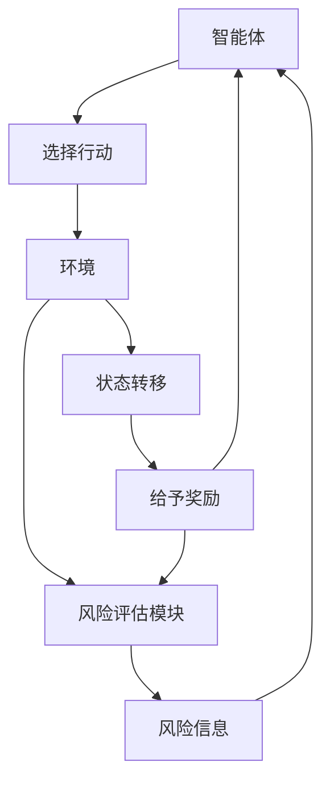

# 风险感知强化学习:在不确定环境中的决策

> 关键词：风险感知、强化学习、不确定环境、决策、马尔可夫决策过程、风险度量、智能体

> 摘要：本文聚焦于风险感知强化学习在不确定环境中的决策问题。首先介绍了风险感知强化学习的背景，包括其目的、预期读者、文档结构和相关术语。接着阐述了核心概念与联系，通过文本示意图和 Mermaid 流程图展示其架构。详细讲解了核心算法原理，结合 Python 源代码进行说明，并给出了数学模型和公式及举例。通过项目实战展示了代码的实际案例和详细解释。探讨了其实际应用场景，推荐了相关的工具和资源。最后总结了未来发展趋势与挑战，提供了常见问题解答和扩展阅读参考资料，旨在为读者全面深入地理解风险感知强化学习在不确定环境中的决策提供有价值的参考。

## 1. 背景介绍 
### 1.1 目的和范围
在现实世界中，许多决策问题都面临着不确定性。传统的强化学习方法通常侧重于最大化长期累积奖励，而忽略了决策过程中所面临的风险。风险感知强化学习的目的在于开发能够在不确定环境中同时考虑奖励和风险的决策策略。本文章的范围涵盖了风险感知强化学习的基本概念、核心算法、数学模型、实际应用以及未来发展趋势等方面，旨在为读者提供一个全面深入的理解。

### 1.2 预期读者
本文预期读者包括对人工智能、机器学习、强化学习等领域感兴趣的研究人员、工程师和学生。对于希望在不确定环境中进行更智能决策的从业者，以及想要深入了解风险感知强化学习技术的人士都具有参考价值。

### 1.3 文档结构概述
本文将按照以下结构进行阐述：首先介绍风险感知强化学习的背景知识，包括术语定义等；接着讲解核心概念与联系，通过示意图和流程图展示其架构；然后详细介绍核心算法原理和具体操作步骤，结合 Python 代码；再给出数学模型和公式并举例说明；通过项目实战展示代码的实现和解读；探讨实际应用场景；推荐相关的工具和资源；总结未来发展趋势与挑战；提供常见问题解答和扩展阅读参考资料。

### 1.4 术语表
#### 1.4.1 核心术语定义
- **风险感知强化学习**：一种强化学习方法，在决策过程中不仅考虑累积奖励，还考虑决策所带来的风险。
- **不确定环境**：环境的状态转移和奖励反馈存在不确定性的环境。
- **智能体**：在环境中进行决策和行动的主体。
- **策略**：智能体在不同状态下选择行动的规则。
- **风险度量**：用于衡量决策所面临风险的指标。

#### 1.4.2 相关概念解释
- **马尔可夫决策过程（MDP）**：是强化学习中常用的数学模型，描述了智能体在环境中的决策过程。它由状态集合、行动集合、状态转移概率、奖励函数和折扣因子组成。
- **贝尔曼方程**：是马尔可夫决策过程中的核心方程，用于计算最优策略下的价值函数。

#### 1.4.3 缩略词列表
- **MDP**：马尔可夫决策过程（Markov Decision Process）
- **RL**：强化学习（Reinforcement Learning）
- **RARL**：风险感知强化学习（Risk - Aware Reinforcement Learning）

## 2. 核心概念与联系 

### 核心概念原理
风险感知强化学习的核心思想是在传统强化学习的基础上，引入风险度量来平衡奖励和风险。传统强化学习通常使用期望累积奖励作为目标，而风险感知强化学习考虑到不同决策可能带来的风险差异。

在不确定环境中，智能体的决策不仅要考虑可能获得的奖励，还要考虑到可能面临的损失或风险。例如，在金融投资领域，一个投资策略可能带来高回报，但同时也伴随着高风险；另一个策略可能回报较低，但风险也相对较小。风险感知强化学习就是要在这些不同的策略中找到一个合适的平衡点。

### 架构的文本示意图
风险感知强化学习系统主要由智能体、环境和风险评估模块组成。智能体与环境进行交互，在每个时间步，智能体根据当前状态选择一个行动，环境根据智能体的行动转移到下一个状态并给予奖励。风险评估模块则根据智能体的决策和环境的反馈，评估当前决策所面临的风险。智能体根据奖励和风险信息，不断调整自己的策略，以实现既获得较高奖励又控制风险的目标。

### Mermaid 流程图


## 3. 核心算法原理 & 具体操作步骤 

### 核心算法原理
风险感知强化学习的核心算法通常基于传统的强化学习算法，如 Q - learning、策略梯度算法等，并结合风险度量进行改进。

以基于 Q - learning 的风险感知强化学习为例，传统的 Q - learning 算法通过更新 Q 值来学习最优策略，Q 值表示在某个状态下采取某个行动的期望累积奖励。在风险感知强化学习中，我们不仅要考虑期望累积奖励，还要考虑风险。

我们可以定义一个风险调整后的 Q 值，记为 $Q^r(s, a)$，它是期望累积奖励和风险度量的函数。例如，我们可以使用以下公式来计算风险调整后的 Q 值：

$Q^r(s, a) = E[R(s, a)] - \lambda \cdot \text{Risk}(s, a)$

其中，$E[R(s, a)]$ 是在状态 $s$ 下采取行动 $a$ 的期望累积奖励，$\text{Risk}(s, a)$ 是在状态 $s$ 下采取行动 $a$ 的风险度量，$\lambda$ 是一个风险偏好参数，用于平衡奖励和风险。

### 具体操作步骤
1. **初始化**：初始化 Q 表 $Q(s, a)$ 和风险调整后的 Q 表 $Q^r(s, a)$，以及其他参数，如学习率 $\alpha$、折扣因子 $\gamma$ 和风险偏好参数 $\lambda$。
2. **智能体与环境交互**：在每个时间步 $t$，智能体根据当前状态 $s_t$ 选择一个行动 $a_t$，可以使用 $\epsilon$ - 贪心策略。
3. **环境反馈**：环境根据智能体的行动 $a_t$ 转移到下一个状态 $s_{t + 1}$ 并给予奖励 $r_t$。
4. **风险评估**：使用风险评估模块计算在状态 $s_t$ 下采取行动 $a_t$ 的风险 $\text{Risk}(s_t, a_t)$。
5. **更新风险调整后的 Q 值**：根据以下公式更新 $Q^r(s_t, a_t)$：

$Q^r(s_t, a_t) \leftarrow Q^r(s_t, a_t) + \alpha \cdot [r_t + \gamma \cdot \max_{a} Q^r(s_{t + 1}, a) - Q^r(s_t, a_t) - \lambda \cdot \text{Risk}(s_t, a_t)]$

6. **更新 Q 值**：根据风险调整后的 Q 值更新 Q 值：

$Q(s_t, a_t) \leftarrow Q^r(s_t, a_t) + \lambda \cdot \text{Risk}(s_t, a_t)$

7. **重复步骤 2 - 6**：直到达到终止条件。

### Python 源代码实现
```python
import numpy as np

# 定义环境参数
num_states = 10
num_actions = 2
alpha = 0.1
gamma = 0.9
lambda_ = 0.5
epsilon = 0.1

# 初始化 Q 表和风险调整后的 Q 表
Q = np.zeros((num_states, num_actions))
Q_r = np.zeros((num_states, num_actions))

# 定义风险评估函数
def risk_evaluation(state, action):
    # 这里简单地返回一个随机风险值，实际应用中需要根据具体情况实现
    return np.random.uniform(0, 1)

# 定义 epsilon - 贪心策略
def epsilon_greedy(state):
    if np.random.uniform(0, 1) < epsilon:
        return np.random.choice(num_actions)
    else:
        return np.argmax(Q_r[state, :])

# 模拟环境转移和奖励反馈
def environment_step(state, action):
    next_state = np.random.choice(num_states)
    reward = np.random.uniform(-1, 1)
    return next_state, reward

# 风险感知强化学习算法
num_episodes = 1000
for episode in range(num_episodes):
    state = np.random.choice(num_states)
    done = False
    while not done:
        action = epsilon_greedy(state)
        next_state, reward = environment_step(state, action)
        risk = risk_evaluation(state, action)
        
        # 更新风险调整后的 Q 值
        Q_r[state, action] = Q_r[state, action] + alpha * (reward + gamma * np.max(Q_r[next_state, :]) - Q_r[state, action] - lambda_ * risk)
        
        # 更新 Q 值
        Q[state, action] = Q_r[state, action] + lambda_ * risk
        
        state = next_state
        
        # 模拟终止条件
        if np.random.uniform(0, 1) < 0.1:
            done = True
```

## 4. 数学模型和公式 & 详细讲解 & 举例说明 

### 马尔可夫决策过程（MDP）模型
马尔可夫决策过程是一个五元组 $(S, A, P, R, \gamma)$，其中：
- $S$ 是有限的状态集合。
- $A$ 是有限的行动集合。
- $P: S \times A \times S \to [0, 1]$ 是状态转移概率函数，$P(s'|s, a)$ 表示在状态 $s$ 下采取行动 $a$ 转移到状态 $s'$ 的概率。
- $R: S \times A \to \mathbb{R}$ 是奖励函数，$R(s, a)$ 表示在状态 $s$ 下采取行动 $a$ 获得的奖励。
- $\gamma \in [0, 1]$ 是折扣因子，用于衡量未来奖励的重要性。

### 价值函数
在马尔可夫决策过程中，价值函数用于评估策略的好坏。有状态价值函数 $V^{\pi}(s)$ 和动作价值函数 $Q^{\pi}(s, a)$。

状态价值函数 $V^{\pi}(s)$ 表示在策略 $\pi$ 下，从状态 $s$ 开始的期望累积折扣奖励：

$$V^{\pi}(s) = E_{\pi} \left[ \sum_{t = 0}^{\infty} \gamma^t R(s_t, a_t) | s_0 = s \right]$$

动作价值函数 $Q^{\pi}(s, a)$ 表示在策略 $\pi$ 下，从状态 $s$ 采取行动 $a$ 开始的期望累积折扣奖励：

$$Q^{\pi}(s, a) = E_{\pi} \left[ \sum_{t = 0}^{\infty} \gamma^t R(s_t, a_t) | s_0 = s, a_0 = a \right]$$

### 贝尔曼方程
贝尔曼方程描述了价值函数之间的递归关系。

状态价值函数的贝尔曼方程为：

$$V^{\pi}(s) = \sum_{a \in A} \pi(a|s) \sum_{s' \in S} P(s'|s, a) [R(s, a) + \gamma V^{\pi}(s')]$$

动作价值函数的贝尔曼方程为：

$$Q^{\pi}(s, a) = \sum_{s' \in S} P(s'|s, a) [R(s, a) + \gamma \sum_{a' \in A} \pi(a'|s') Q^{\pi}(s', a')]$$

### 风险度量
常见的风险度量包括方差、条件风险价值（CVaR）等。

- **方差**：表示奖励的离散程度。设 $R(s, a)$ 是在状态 $s$ 下采取行动 $a$ 的奖励随机变量，其方差定义为：

$$\text{Var}(R(s, a)) = E[(R(s, a) - E[R(s, a)])^2]$$

- **条件风险价值（CVaR）**：是在给定置信水平 $\alpha$ 下，超过风险价值（VaR）的损失的期望值。设 $F_R(r)$ 是奖励随机变量 $R$ 的累积分布函数，风险价值 $\text{VaR}_{\alpha}(R)$ 定义为：

$$\text{VaR}_{\alpha}(R) = \inf \{ r \in \mathbb{R} : F_R(r) \geq \alpha \}$$

条件风险价值 $\text{CVaR}_{\alpha}(R)$ 定义为：

$$\text{CVaR}_{\alpha}(R) = \frac{1}{1 - \alpha} \int_{\text{VaR}_{\alpha}(R)}^{\infty} r f_R(r) dr$$

其中，$f_R(r)$ 是奖励随机变量 $R$ 的概率密度函数。

### 举例说明
假设我们有一个简单的马尔可夫决策过程，状态集合 $S = \{ s_1, s_2 \}$，行动集合 $A = \{ a_1, a_2 \}$，状态转移概率和奖励函数如下：

| $s$ | $a$ | $P(s'|s, a)$ | $R(s, a)$ |
|---|---|---|---|
| $s_1$ | $a_1$ | $P(s_1|s_1, a_1) = 0.6, P(s_2|s_1, a_1) = 0.4$ | $R(s_1, a_1) = 2$ |
| $s_1$ | $a_2$ | $P(s_1|s_1, a_2) = 0.3, P(s_2|s_1, a_2) = 0.7$ | $R(s_1, a_2) = 5$ |
| $s_2$ | $a_1$ | $P(s_1|s_2, a_1) = 0.8, P(s_2|s_2, a_1) = 0.2$ | $R(s_2, a_1) = -1$ |
| $s_2$ | $a_2$ | $P(s_1|s_2, a_2) = 0.1, P(s_2|s_2, a_2) = 0.9$ | $R(s_2, a_2) = 3$ |

折扣因子 $\gamma = 0.9$。

我们可以计算状态价值函数和动作价值函数。以状态 $s_1$ 为例，假设策略 $\pi$ 是均匀策略，即 $\pi(a_1|s_1) = \pi(a_2|s_1) = 0.5$。

首先计算动作价值函数：

$Q^{\pi}(s_1, a_1) = 0.6 \times (2 + 0.9 \times V^{\pi}(s_1)) + 0.4 \times (2 + 0.9 \times V^{\pi}(s_2))$

$Q^{\pi}(s_1, a_2) = 0.3 \times (5 + 0.9 \times V^{\pi}(s_1)) + 0.7 \times (5 + 0.9 \times V^{\pi}(s_2))$

然后计算状态价值函数：

$V^{\pi}(s_1) = 0.5 \times Q^{\pi}(s_1, a_1) + 0.5 \times Q^{\pi}(s_1, a_2)$

通过迭代求解这些方程，可以得到状态价值函数和动作价值函数的值。

如果我们考虑风险，假设使用方差作为风险度量。对于 $Q^{\pi}(s_1, a_1)$，我们可以计算其奖励的方差，根据状态转移概率和奖励值来计算。

设 $X_1$ 是在状态 $s_1$ 下采取行动 $a_1$ 的奖励随机变量，则：

$E[X_1] = 0.6 \times 2 + 0.4 \times 2 = 2$

$\text{Var}(X_1) = 0.6 \times (2 - 2)^2 + 0.4 \times (2 - 2)^2 = 0$

对于 $Q^{\pi}(s_1, a_2)$，设 $X_2$ 是在状态 $s_1$ 下采取行动 $a_2$ 的奖励随机变量，则：

$E[X_2] = 0.3 \times 5 + 0.7 \times 5 = 5$

$\text{Var}(X_2) = 0.3 \times (5 - 5)^2 + 0.7 \times (5 - 5)^2 = 0$

在实际应用中，奖励的分布可能更复杂，需要更精确的计算方法。

## 5. 项目实战：代码实际案例和详细解释说明 

### 5.1  开发环境搭建
#### 操作系统
可以选择 Linux、Windows 或 macOS 等主流操作系统。这里以 Ubuntu 18.04 为例进行说明。

#### Python 环境
安装 Python 3.6 或更高版本。可以使用以下命令进行安装：

```bash
sudo apt update
sudo apt install python3 python3-pip
```

#### 依赖库安装
安装必要的依赖库，如 NumPy、Matplotlib 等。可以使用以下命令进行安装：

```bash
pip3 install numpy matplotlib
```

### 5.2  源代码详细实现和代码解读
```python
import numpy as np
import matplotlib.pyplot as plt

# 定义环境参数
num_states = 5
num_actions = 2
alpha = 0.1
gamma = 0.9
lambda_ = 0.3
epsilon = 0.1
num_episodes = 1000

# 初始化 Q 表和风险调整后的 Q 表
Q = np.zeros((num_states, num_actions))
Q_r = np.zeros((num_states, num_actions))

# 定义风险评估函数
def risk_evaluation(state, action):
    # 简单的风险评估函数，根据状态和行动返回一个风险值
    if state == 0 and action == 0:
        return 0.1
    elif state == 1 and action == 1:
        return 0.3
    else:
        return 0.2

# 定义 epsilon - 贪心策略
def epsilon_greedy(state):
    if np.random.uniform(0, 1) < epsilon:
        return np.random.choice(num_actions)
    else:
        return np.argmax(Q_r[state, :])

# 模拟环境转移和奖励反馈
def environment_step(state, action):
    if state == 0 and action == 0:
        next_state = 1
        reward = 1
    elif state == 1 and action == 1:
        next_state = 2
        reward = -2
    else:
        next_state = np.random.choice(num_states)
        reward = np.random.uniform(-1, 1)
    return next_state, reward

# 风险感知强化学习算法
total_rewards = []
for episode in range(num_episodes):
    state = np.random.choice(num_states)
    total_reward = 0
    done = False
    while not done:
        action = epsilon_greedy(state)
        next_state, reward = environment_step(state, action)
        risk = risk_evaluation(state, action)
        
        # 更新风险调整后的 Q 值
        Q_r[state, action] = Q_r[state, action] + alpha * (reward + gamma * np.max(Q_r[next_state, :]) - Q_r[state, action] - lambda_ * risk)
        
        # 更新 Q 值
        Q[state, action] = Q_r[state, action] + lambda_ * risk
        
        state = next_state
        total_reward += reward
        
        # 模拟终止条件
        if np.random.uniform(0, 1) < 0.1:
            done = True
    
    total_rewards.append(total_reward)

# 绘制累计奖励曲线
plt.plot(total_rewards)
plt.xlabel('Episode')
plt.ylabel('Total Reward')
plt.title('Risk - Aware Reinforcement Learning')
plt.show()
```

### 5.3  代码解读与分析
- **环境参数定义**：定义了状态数量、行动数量、学习率、折扣因子、风险偏好参数、探索率和训练轮数等参数。
- **Q 表和风险调整后的 Q 表初始化**：使用 `np.zeros` 函数初始化 Q 表和风险调整后的 Q 表。
- **风险评估函数**：根据不同的状态和行动返回不同的风险值。
- **epsilon - 贪心策略**：以一定的概率进行随机探索，以一定的概率选择风险调整后 Q 值最大的行动。
- **环境转移和奖励反馈模拟**：根据不同的状态和行动返回下一个状态和奖励。
- **风险感知强化学习算法**：在每个训练轮次中，智能体与环境进行交互，更新风险调整后的 Q 值和 Q 值，记录每一轮的累计奖励。
- **绘制累计奖励曲线**：使用 Matplotlib 库绘制累计奖励曲线，直观地展示智能体的学习过程。

通过分析累计奖励曲线，我们可以观察到智能体在训练过程中的性能变化。如果曲线呈上升趋势，说明智能体在不断学习并提高自己的决策能力；如果曲线波动较大，可能需要调整参数或优化算法。

## 6. 实际应用场景 
### 金融投资领域
在金融投资中，投资者面临着市场的不确定性和风险。风险感知强化学习可以帮助投资者在不同的投资策略中进行选择，平衡预期收益和风险。例如，在股票投资中，智能体可以根据市场行情、公司财务状况等信息，选择买入、卖出或持有股票的时机，同时考虑到投资组合的风险。

### 自动驾驶领域
自动驾驶车辆在行驶过程中面临着各种不确定因素，如其他车辆的行为、道路状况等。风险感知强化学习可以用于自动驾驶车辆的决策规划，使车辆在保证安全的前提下，选择最优的行驶路径和速度。例如，当遇到交通拥堵或突发事件时，车辆可以根据风险评估选择合适的绕行路线。

### 医疗决策领域
在医疗决策中，医生需要根据患者的病情、病史等信息选择合适的治疗方案。由于患者的个体差异和疾病的复杂性，治疗方案的效果存在不确定性。风险感知强化学习可以帮助医生在不同的治疗方案中进行选择，考虑到治疗效果和可能的风险，如并发症、副作用等。

### 工业生产领域
在工业生产中，生产过程可能受到原材料质量、设备故障等不确定因素的影响。风险感知强化学习可以用于生产调度和资源分配，使生产系统在保证生产效率的前提下，降低生产成本和风险。例如，在生产线上合理安排设备的使用和维护时间，以减少设备故障的发生。

## 7. 工具和资源推荐
### 7.1 学习资源推荐
#### 7.1.1 书籍推荐
- 《强化学习：原理与Python实现》：全面介绍了强化学习的基本原理和算法，并通过 Python 代码进行实现，适合初学者入门。
- 《Reinforcement Learning: An Introduction》（《强化学习导论》）：经典的强化学习教材，详细介绍了强化学习的理论和算法，是学习强化学习的必读之书。
- 《Risk - Averse Reinforcement Learning》：专门介绍风险感知强化学习的书籍，深入探讨了风险度量和风险感知强化学习算法。

#### 7.1.2 在线课程
- Coursera 上的《Reinforcement Learning Specialization》：由著名学者授课，系统地介绍了强化学习的理论和应用。
- edX 上的《Artificial Intelligence: Reinforcement Learning》：提供了丰富的教学资源和实践项目，帮助学习者掌握强化学习的知识和技能。

#### 7.1.3 技术博客和网站
- OpenAI 博客：发布了许多关于强化学习和人工智能的最新研究成果和技术文章。
- DeepMind 博客：提供了关于深度强化学习的前沿研究和应用案例。
- arXiv.org：一个预印本数据库，包含了大量关于风险感知强化学习和其他相关领域的研究论文。

### 7.2 开发工具框架推荐
#### 7.2.1 IDE和编辑器
- PyCharm：功能强大的 Python 集成开发环境，提供了代码编辑、调试、版本控制等功能。
- Visual Studio Code：轻量级的代码编辑器，支持多种编程语言，有丰富的插件可以扩展功能。

#### 7.2.2 调试和性能分析工具
- PDB：Python 自带的调试器，可以帮助开发者定位代码中的问题。
- cProfile：Python 标准库中的性能分析工具，可以分析代码的运行时间和函数调用情况。

#### 7.2.3 相关框架和库
- OpenAI Gym：一个用于开发和比较强化学习算法的工具包，提供了多种环境和基准测试。
- Stable Baselines：基于 OpenAI Gym 的强化学习库，提供了多种预训练的强化学习算法。
- TensorFlow 和 PyTorch：流行的深度学习框架，可以用于实现深度强化学习算法。

### 7.3 相关论文著作推荐
#### 7.3.1 经典论文
- “Policy Gradient Methods for Reinforcement Learning with Function Approximation”：提出了策略梯度算法，是强化学习领域的经典论文。
- “Deep Q - Network (DQN)”：介绍了深度 Q 网络，开启了深度强化学习的时代。

#### 7.3.2 最新研究成果
- “Risk - Sensitive Policy Gradient for Reinforcement Learning”：提出了一种风险敏感的策略梯度算法，用于风险感知强化学习。
- “CVaR - Based Risk - Averse Reinforcement Learning”：研究了基于条件风险价值的风险厌恶强化学习算法。

#### 7.3.3 应用案例分析
- “Applying Risk - Aware Reinforcement Learning to Financial Portfolio Management”：介绍了风险感知强化学习在金融投资组合管理中的应用案例。
- “Risk - Aware Autonomous Driving with Reinforcement Learning”：探讨了风险感知强化学习在自动驾驶中的应用。

## 8. 总结：未来发展趋势与挑战
### 未来发展趋势
- **与其他技术的融合**：风险感知强化学习将与深度学习、计算机视觉、自然语言处理等技术相结合，应用于更复杂的场景。例如，在自动驾驶中，结合计算机视觉技术识别道路和交通标志，结合风险感知强化学习进行决策规划。
- **多智能体系统**：研究多智能体环境下的风险感知强化学习，智能体之间需要进行协作和竞争，同时考虑自身和其他智能体的风险。例如，在智能交通系统中，多个自动驾驶车辆需要协同决策，以提高整体交通效率和安全性。
- **理论研究的深入**：进一步完善风险感知强化学习的理论体系，包括风险度量的定义和优化、算法的收敛性分析等。

### 挑战
- **风险度量的准确性**：如何准确地度量风险是风险感知强化学习面临的一个重要挑战。不同的风险度量方法可能会导致不同的决策结果，需要根据具体应用场景选择合适的风险度量方法。
- **计算复杂度**：风险感知强化学习算法通常比传统强化学习算法具有更高的计算复杂度，特别是在处理大规模状态空间和动作空间时。如何提高算法的效率是一个亟待解决的问题。
- **数据的稀缺性**：在某些应用场景中，获取足够的高质量数据可能比较困难。如何在数据稀缺的情况下进行有效的风险感知强化学习是一个挑战。

## 9. 附录：常见问题与解答
### 1. 风险感知强化学习与传统强化学习有什么区别？
传统强化学习主要关注最大化长期累积奖励，而风险感知强化学习在决策过程中不仅考虑奖励，还考虑决策所面临的风险。风险感知强化学习通过引入风险度量，平衡奖励和风险，以实现更稳健的决策。

### 2. 如何选择合适的风险度量方法？
选择合适的风险度量方法需要根据具体的应用场景和问题特点。常见的风险度量方法包括方差、条件风险价值（CVaR）等。如果关注奖励的离散程度，可以选择方差；如果关注极端损失的情况，可以选择条件风险价值。

### 3. 风险感知强化学习算法的收敛性如何保证？
保证风险感知强化学习算法的收敛性是一个复杂的问题。通常需要对算法的参数进行合理的选择，如学习率、折扣因子等。同时，一些理论研究也在不断探索如何改进算法以保证收敛性。

### 4. 风险感知强化学习在实际应用中需要注意什么？
在实际应用中，需要注意数据的质量和数量，因为数据的质量和数量会影响风险评估的准确性和算法的性能。此外，还需要根据具体应用场景调整风险偏好参数，以平衡奖励和风险。

## 10. 扩展阅读 & 参考资料
### 扩展阅读
- Sutton, R. S., & Barto, A. G. (2018). Reinforcement Learning: An Introduction. MIT Press.
- Pflug, G. C., & Römisch, W. (2016). Modeling, Measuring and Managing Risk. World Scientific.

### 参考资料
- OpenAI Gym Documentation: https://gym.openai.com/docs/
- Stable Baselines Documentation: https://stable-baselines.readthedocs.io/en/master/
- TensorFlow Documentation: https://www.tensorflow.org/api_docs
- PyTorch Documentation: https://pytorch.org/docs/stable/