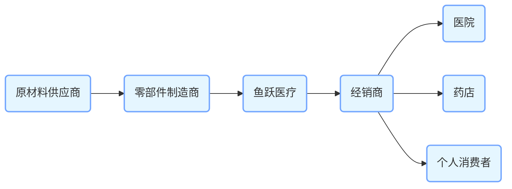

# 鱼跃医疗(2223)公司最新 2025估值与产业链上下游价值分析 ——从行业产业链供应链到市场终端的全链路价值点剖析：深度解构2025 - 2408 年长期投资价值研究报告【融合巴菲特价值投资理念与索罗斯市场自强化理论 】

> 关键词：鱼跃医疗、2025估值、产业链上下游、全链路价值点、长期投资价值、巴菲特价值投资理念、索罗斯市场自强化理论

> 摘要：本报告聚焦于鱼跃医疗（2223）公司，旨在深入剖析其 2025 年的估值以及产业链上下游的价值情况。通过对行业产业链、供应链直至市场终端的全链路价值点进行剖析，融合巴菲特价值投资理念与索罗斯市场自强化理论，全面研究该公司在 2025 - 2408 年的长期投资价值，为投资者提供有价值的参考依据。

## 1. 背景介绍 
### 1.1 目的和范围
本报告的主要目的是对鱼跃医疗（2223）公司进行全面的分析和评估，确定其在 2025 年的合理估值，并深入研究其产业链上下游的价值情况。具体范围涵盖了鱼跃医疗所处的医疗器械行业的产业链、供应链各个环节，以及市场终端的需求和竞争状况。同时，结合巴菲特价值投资理念和索罗斯市场自强化理论，探讨该公司在 2025 - 2408 年的长期投资价值。

### 1.2 预期读者
本报告预期读者主要包括专业投资者、金融分析师、医疗器械行业从业者以及对鱼跃医疗公司感兴趣的个人投资者。这些读者希望通过本报告获取有关鱼跃医疗公司的详细信息，以便做出合理的投资决策或了解行业动态。

### 1.3 文档结构概述
本报告将按照以下结构进行组织：首先介绍鱼跃医疗公司的背景和相关概念，包括核心概念与联系；接着阐述核心算法原理和具体操作步骤，用于公司估值和产业链价值分析；然后介绍数学模型和公式，并通过举例说明其应用；之后进行项目实战，包括开发环境搭建、源代码实现和代码解读；再探讨鱼跃医疗的实际应用场景；推荐相关的工具和资源；最后总结公司的未来发展趋势与挑战，解答常见问题，并提供扩展阅读和参考资料。

### 1.4 术语表
#### 1.4.1 核心术语定义
- **鱼跃医疗（2223）**：指在证券市场上代码为 2223 的鱼跃医疗股份有限公司，是一家专注于医疗器械研发、生产和销售的企业。
- **2025 估值**：对鱼跃医疗公司在 2025 年的价值进行评估和预测。
- **产业链上下游**：产业链上游指为鱼跃医疗提供原材料、零部件等生产要素的企业和环节；产业链下游指鱼跃医疗产品的销售渠道、终端用户等环节。
- **全链路价值点**：从产业链的源头到市场终端的各个环节中，能够为鱼跃医疗创造价值的关键点。
- **长期投资价值**：指鱼跃医疗公司在较长时间内（2025 - 2408 年）为投资者带来收益的潜力和能力。
- **巴菲特价值投资理念**：强调寻找具有内在价值的企业，以合理的价格买入并长期持有。
- **索罗斯市场自强化理论**：认为市场参与者的认知和行为会影响市场的走势，市场走势又会反过来影响参与者的认知和行为，形成一种自我强化的循环。

#### 1.4.2 相关概念解释
- **医疗器械行业**：是指生产、销售用于医疗诊断、治疗、预防等方面的设备、器具、材料等产品的行业。
- **供应链**：是指围绕核心企业，通过对信息流、物流、资金流的控制，从采购原材料开始，制成中间产品以及最终产品，最后由销售网络把产品送到消费者手中的将供应商、制造商、分销商、零售商、直到最终用户连成一个整体的功能网链结构。
- **市场终端**：指产品最终到达的消费者手中的环节，包括医院、药店、个人消费者等。

#### 1.4.3 缩略词列表
- **PE**：市盈率（Price - Earnings Ratio），是指股票价格除以每股收益的比率，用于衡量股票的估值水平。
- **DCF**：现金流折现法（Discounted Cash Flow），是一种通过预测企业未来的现金流并将其折现到当前的方法来评估企业价值。
- **ROE**：净资产收益率（Return on Equity），是指净利润与平均股东权益的百分比，反映了股东权益的收益水平。

## 2. 核心概念与联系 

### 鱼跃医疗产业链上下游结构示意图


### 核心概念原理阐述
鱼跃医疗作为医疗器械行业的重要企业，其产业链上下游存在着紧密的联系。产业链上游的原材料供应商和零部件制造商为鱼跃医疗提供生产所需的基础材料和部件，其质量和供应稳定性直接影响鱼跃医疗的产品质量和生产效率。鱼跃医疗作为核心企业，负责产品的研发、生产和组装，将上游的原材料和零部件转化为具有医疗功能的产品。

产业链下游的经销商则负责将鱼跃医疗的产品推向市场，通过医院、药店等渠道销售给终端用户，包括医院和个人消费者。市场终端的需求反馈又会影响鱼跃医疗的产品研发和生产决策，形成一个闭环的产业链系统。

巴菲特价值投资理念强调对企业内在价值的评估，关注企业的基本面，如盈利能力、资产质量、管理团队等。对于鱼跃医疗，我们需要分析其财务报表、产品竞争力、市场份额等因素，以确定其内在价值。

索罗斯市场自强化理论认为市场参与者的情绪和行为会影响市场的走势。在鱼跃医疗的投资分析中，我们需要考虑市场对鱼跃医疗的预期和情绪，以及这些因素如何影响其股价和市场表现。当市场对鱼跃医疗的预期向好时，投资者会增加买入，推动股价上涨，而股价上涨又会进一步吸引更多投资者，形成自我强化的循环；反之亦然。

## 3. 核心算法原理 & 具体操作步骤 

### 3.1 现金流折现法（DCF）原理及 Python 实现
现金流折现法是一种常用的企业估值方法，其核心原理是将企业未来的现金流按照一定的折现率折现到当前，以确定企业的内在价值。

#### 算法原理
假设企业未来 $n$ 年的自由现金流分别为 $FCF_1, FCF_2, \cdots, FCF_n$，折现率为 $r$，则企业的内在价值 $V$ 可以通过以下公式计算：

$$V = \sum_{i = 1}^{n} \frac{FCF_i}{(1 + r)^i} + \frac{TV}{(1 + r)^n}$$

其中，$TV$ 为企业的终值，通常采用永续增长模型计算：

$$TV = \frac{FCF_n(1 + g)}{r - g}$$

其中，$g$ 为永续增长率。

#### Python 代码实现
```python
def dcf_valuation(fcf_list, r, g):
    """
    现金流折现法计算企业内在价值
    :param fcf_list: 未来 n 年的自由现金流列表
    :param r: 折现率
    :param g: 永续增长率
    :return: 企业内在价值
    """
    n = len(fcf_list)
    present_value = 0
    # 计算前 n 年现金流的现值
    for i in range(n):
        present_value += fcf_list[i] / ((1 + r) ** (i + 1))
    # 计算终值
    fcf_n = fcf_list[-1]
    tv = fcf_n * (1 + g) / (r - g)
    # 计算终值的现值
    present_value += tv / ((1 + r) ** n)
    return present_value

# 示例数据
fcf_list = [100, 120, 140, 160, 180]  # 未来 5 年的自由现金流
r = 0.1  # 折现率为 10%
g = 0.03  # 永续增长率为 3%

value = dcf_valuation(fcf_list, r, g)
print(f"企业内在价值: {value}")
```

### 3.2 具体操作步骤
1. **预测未来现金流**：通过对鱼跃医疗的历史财务数据、市场趋势、行业发展等因素进行分析，预测其未来 $n$ 年的自由现金流。
2. **确定折现率**：折现率反映了投资者对投资风险的要求，通常可以采用资本资产定价模型（CAPM）来确定。
3. **确定永续增长率**：永续增长率是指企业在长期内的稳定增长率，一般根据行业的平均增长率和企业的竞争优势来确定。
4. **计算企业内在价值**：将预测的未来现金流、折现率和永续增长率代入现金流折现法公式，计算鱼跃医疗的内在价值。

## 4. 数学模型和公式 & 详细讲解 & 举例说明 

### 4.1 市盈率（PE）模型
#### 公式
市盈率（PE）是指股票价格除以每股收益的比率，其公式为：

$$PE = \frac{P}{EPS}$$

其中，$P$ 为股票价格，$EPS$ 为每股收益。

#### 详细讲解
市盈率是一种常用的估值指标，它反映了市场对企业盈利能力的预期。较高的市盈率通常表示市场对企业未来的盈利增长有较高的预期，反之则表示市场对企业的预期较低。

#### 举例说明
假设鱼跃医疗的股票价格为 $50$ 元，每股收益为 $2$ 元，则其市盈率为：

$$PE = \frac{50}{2} = 25$$

这意味着投资者愿意为鱼跃医疗每股 $2$ 元的收益支付 $25$ 倍的价格。

### 4.2 净资产收益率（ROE）模型
#### 公式
净资产收益率（ROE）是指净利润与平均股东权益的百分比，其公式为：

$$ROE = \frac{Net Income}{Average Shareholders' Equity} \times 100\%$$

其中，$Net Income$ 为净利润，$Average Shareholders' Equity$ 为平均股东权益。

#### 详细讲解
净资产收益率反映了股东权益的收益水平，是衡量企业盈利能力和股东回报的重要指标。较高的 ROE 表示企业能够更有效地利用股东的资金创造利润。

#### 举例说明
假设鱼跃医疗的净利润为 $10000$ 万元，平均股东权益为 $50000$ 万元，则其 ROE 为：

$$ROE = \frac{10000}{50000} \times 100\% = 20\%$$

这意味着鱼跃医疗每 $1$ 元的股东权益能够创造 $0.2$ 元的净利润。

### 4.3 杜邦分析模型
#### 公式
杜邦分析模型将 ROE 分解为三个因素的乘积，其公式为：

$$ROE = \frac{Net Income}{Sales} \times \frac{Sales}{Total Assets} \times \frac{Total Assets}{Average Shareholders' Equity}$$

其中，$\frac{Net Income}{Sales}$ 为销售净利率，反映了企业的盈利能力；$\frac{Sales}{Total Assets}$ 为总资产周转率，反映了企业的资产运营效率；$\frac{Total Assets}{Average Shareholders' Equity}$ 为权益乘数，反映了企业的财务杠杆水平。

#### 详细讲解
杜邦分析模型通过将 ROE 分解为三个因素，能够更深入地分析企业的盈利能力、资产运营效率和财务杠杆水平。通过对这三个因素的分析，可以找出影响 ROE 的关键因素，为企业的经营决策提供参考。

#### 举例说明
假设鱼跃医疗的销售净利率为 $15\%$，总资产周转率为 $1.2$，权益乘数为 $1.5$，则其 ROE 为：

$$ROE = 15\% \times 1.2 \times 1.5 = 27\%$$

通过杜邦分析，我们可以看到鱼跃医疗的 ROE 较高是由于其销售净利率、总资产周转率和权益乘数共同作用的结果。如果我们想进一步提高 ROE，可以从提高销售净利率、加快总资产周转或合理利用财务杠杆等方面入手。

## 5. 项目实战：代码实际案例和详细解释说明 

### 5.1 开发环境搭建
为了进行鱼跃医疗公司的估值和产业链分析，我们需要搭建以下开发环境：

1. **Python 环境**：建议使用 Python 3.7 及以上版本，可以从 Python 官方网站（https://www.python.org/downloads/）下载并安装。
2. **开发工具**：可以使用 PyCharm、Jupyter Notebook 等开发工具。PyCharm 是一款功能强大的 Python 集成开发环境，适合大型项目的开发；Jupyter Notebook 则是一种交互式的开发环境，适合进行数据分析和实验。
3. **必要的 Python 库**：需要安装 pandas、numpy、matplotlib 等库，用于数据处理、数值计算和可视化。可以使用以下命令进行安装：

```sh
pip install pandas numpy matplotlib
```

### 5.2 源代码详细实现和代码解读
#### 数据获取与预处理
```python
import pandas as pd

# 假设我们从 CSV 文件中获取鱼跃医疗的财务数据
data = pd.read_csv('yuwell_medical_financial_data.csv')

# 数据预处理
# 去除缺失值
data = data.dropna()

# 显示数据基本信息
print(data.info())

# 显示数据前几行
print(data.head())
```

**代码解读**：
- 首先，我们使用 `pandas` 库的 `read_csv` 函数从 CSV 文件中读取鱼跃医疗的财务数据。
- 然后，使用 `dropna` 函数去除数据中的缺失值，以确保数据的完整性。
- 最后，使用 `info` 函数显示数据的基本信息，使用 `head` 函数显示数据的前几行，以便我们对数据有一个初步的了解。

#### 基于 PE 模型的估值计算
```python
# 假设我们已经从数据中提取了每股收益（EPS）和市场平均市盈率（PE_avg）
eps = data['EPS'].values[-1]
pe_avg = 20  # 市场平均市盈率

# 计算股票的理论价格
price = eps * pe_avg

print(f"基于 PE 模型的股票理论价格: {price}")
```

**代码解读**：
- 我们从数据中提取了最新的每股收益（EPS），并假设市场平均市盈率为 $20$。
- 然后，使用 PE 模型的公式 $P = PE \times EPS$ 计算股票的理论价格。
- 最后，打印出计算结果。

### 5.3 代码解读与分析
通过上述代码，我们完成了数据的获取、预处理和基于 PE 模型的估值计算。在实际应用中，我们可以根据需要对代码进行扩展和优化，例如使用更多的财务指标进行估值分析，或者结合机器学习算法进行预测。

需要注意的是，估值模型只是一种参考，实际的股票价格受到多种因素的影响，包括市场情绪、宏观经济环境、行业竞争等。因此，在进行投资决策时，我们需要综合考虑各种因素，不能仅仅依赖于估值模型的结果。

## 6. 实际应用场景 
### 6.1 医院市场
鱼跃医疗的产品在医院市场有着广泛的应用。例如，其血压计、血糖仪等设备可以用于医院的临床诊断和监测，为医生提供准确的患者数据。此外，鱼跃医疗的制氧机、呼吸机等呼吸设备在呼吸内科、急诊科等科室也发挥着重要作用，帮助患者改善呼吸功能。

### 6.2 药店市场
在药店市场，鱼跃医疗的家用医疗器械产品受到消费者的青睐。消费者可以在药店购买到鱼跃医疗的血压计、体温计、按摩器等产品，方便在家中进行自我健康监测和保健。药店作为鱼跃医疗产品的重要销售渠道，能够为消费者提供专业的产品咨询和售后服务。

### 6.3 个人消费者市场
随着人们健康意识的提高，个人消费者对家用医疗器械的需求不断增加。鱼跃医疗的产品以其质量可靠、价格合理、使用方便等特点，满足了个人消费者的需求。例如，很多家庭会购买鱼跃医疗的血压计和血糖仪，定期监测自己和家人的健康状况。此外，鱼跃医疗的按摩器、理疗仪等产品也为个人消费者提供了缓解疲劳、促进健康的选择。

### 6.4 养老机构市场
随着老龄化社会的到来，养老机构的数量不断增加。鱼跃医疗的产品在养老机构中也有着重要的应用。养老机构需要配备各种医疗器械，如血压计、血糖仪、制氧机等，以满足老年人的健康监测和护理需求。鱼跃医疗的产品能够为养老机构提供全面的解决方案，提高养老服务的质量。

## 7. 工具和资源推荐
### 7.1 学习资源推荐
#### 7.1.1 书籍推荐
- 《聪明的投资者》（The Intelligent Investor）：作者是本杰明·格雷厄姆（Benjamin Graham），这本书是价值投资领域的经典之作，介绍了价值投资的基本理念和方法，对理解巴菲特价值投资理念有很大帮助。
- 《金融炼金术》（The Alchemy of Finance）：作者是乔治·索罗斯（George Soros），书中阐述了索罗斯的市场自强化理论和投资哲学，对于深入理解市场的运行机制和投资策略有重要意义。
- 《财务报表分析与股票估值》（Financial Statement Analysis and Security Valuation）：作者是斯蒂芬·佩因曼（Stephen Penman），这本书详细介绍了如何通过分析企业的财务报表来评估企业的价值，对于进行鱼跃医疗的估值分析非常有帮助。

#### 7.1.2 在线课程
- Coursera 上的“投资学原理”（Principles of Investing）课程：该课程由知名大学的教授授课，系统介绍了投资学的基本原理和方法，包括价值投资、技术分析等内容。
- edX 上的“金融市场”（Financial Markets）课程：由耶鲁大学教授罗伯特·席勒（Robert Shiller）授课，深入探讨了金融市场的运行机制和投资策略，对于理解市场自强化理论有一定的帮助。

#### 7.1.3 技术博客和网站
- 雪球网（https://xueqiu.com/）：是一个投资交流社区，汇聚了众多投资者和金融专家，提供了丰富的股票分析、投资策略等内容。
- 东方财富网（https://www.eastmoney.com/）：是国内知名的财经网站，提供了全面的金融信息和数据，包括股票行情、财务报表、行业分析等。

### 7.2 开发工具框架推荐
#### 7.2.1 IDE和编辑器
- PyCharm：是一款功能强大的 Python 集成开发环境，具有代码自动补全、调试、版本控制等功能，适合大型项目的开发。
- Jupyter Notebook：是一种交互式的开发环境，支持 Python、R 等多种编程语言，适合进行数据分析和实验。

#### 7.2.2 调试和性能分析工具
- pdb：是 Python 自带的调试工具，可以帮助我们在代码中设置断点、查看变量值等，方便调试代码。
- cProfile：是 Python 的性能分析工具，可以帮助我们找出代码中的性能瓶颈，优化代码性能。

#### 7.2.3 相关框架和库
- pandas：是一个用于数据处理和分析的 Python 库，提供了丰富的数据结构和数据操作方法，方便我们处理和分析鱼跃医疗的财务数据。
- numpy：是一个用于数值计算的 Python 库，提供了高效的数组操作和数学函数，为我们的估值计算提供了支持。
- matplotlib：是一个用于数据可视化的 Python 库，可以帮助我们将分析结果以图表的形式直观地展示出来。

### 7.3 相关论文著作推荐
#### 7.3.1 经典论文
- “The Capital Asset Pricing Model: Theory and Evidence”：该论文对资本资产定价模型（CAPM）进行了详细的阐述和实证研究，对于理解折现率的确定方法有重要意义。
- “Efficient Capital Markets: A Review of Theory and Empirical Work”：这篇论文是有效市场假说的经典文献，讨论了市场效率的概念和检验方法，对于理解市场的有效性和投资策略有一定的启示。

#### 7.3.2 最新研究成果
- 关注学术数据库如知网、万方、Web of Science 等，搜索关于医疗器械行业估值、产业链分析等方面的最新研究论文，了解行业的前沿动态和研究方法。

#### 7.3.3 应用案例分析
- 可以参考一些知名投资机构或研究机构发布的关于医疗器械企业的投资分析报告，学习他们的分析方法和思路，以及如何将理论应用到实际案例中。

## 8. 总结：未来发展趋势与挑战
### 8.1 未来发展趋势
#### 8.1.1 技术创新驱动
随着科技的不断进步，医疗器械行业将迎来更多的技术创新。鱼跃医疗有望加大在研发方面的投入，推出更多具有创新性和竞争力的产品。例如，智能化、可穿戴的医疗器械产品将成为未来的发展方向，鱼跃医疗可以利用物联网、大数据等技术，实现产品的远程监测和数据分析，为用户提供更加个性化的健康管理服务。

#### 8.1.2 市场需求增长
随着人们健康意识的提高和老龄化社会的到来，对医疗器械的需求将持续增长。特别是家用医疗器械市场，将迎来更大的发展机遇。鱼跃医疗作为家用医疗器械领域的领先企业，有望受益于市场需求的增长，扩大市场份额。

#### 8.1.3 产业整合加速
医疗器械行业竞争激烈，产业整合将成为未来的发展趋势。鱼跃医疗可以通过并购、重组等方式，整合产业链上下游资源，提高企业的竞争力和抗风险能力。例如，收购原材料供应商或零部件制造商，可以保障原材料的供应和产品质量；收购经销商或终端医疗机构，可以拓展销售渠道和市场份额。

### 8.2 挑战
#### 8.2.1 技术竞争压力
医疗器械行业技术更新换代快，竞争对手不断推出新的产品和技术。鱼跃医疗需要不断加大研发投入，提高自身的技术创新能力，以应对技术竞争的压力。如果不能及时跟上技术发展的步伐，可能会导致产品竞争力下降，市场份额受到影响。

#### 8.2.2 政策监管风险
医疗器械行业受到严格的政策监管，政策的变化可能会对企业的生产、销售和经营产生重大影响。例如，医疗器械注册审批政策的变化、医保政策的调整等，都可能增加企业的运营成本和市场风险。鱼跃医疗需要密切关注政策变化，及时调整企业战略，以适应政策环境的变化。

#### 8.2.3 市场竞争加剧
随着医疗器械市场的不断发展，市场竞争将日益激烈。除了国内竞争对手外，鱼跃医疗还将面临来自国际知名企业的竞争。这些企业通常具有更强的技术实力、品牌影响力和市场渠道，鱼跃医疗需要不断提升自身的品牌形象和市场竞争力，以在激烈的市场竞争中脱颖而出。

## 9. 附录：常见问题与解答
### 9.1 如何确定鱼跃医疗的折现率？
折现率的确定通常可以采用资本资产定价模型（CAPM），其公式为：

$$r = R_f + \beta \times (R_m - R_f)$$

其中，$R_f$ 为无风险利率，通常可以采用国债收益率；$\beta$ 为鱼跃医疗股票的贝塔系数，反映了股票的系统性风险；$R_m$ 为市场平均收益率。

### 9.2 鱼跃医疗的产业链上下游企业有哪些？
鱼跃医疗的产业链上游企业包括原材料供应商，如塑料、金属等原材料生产企业；零部件制造商，如传感器、电路板等零部件生产企业。产业链下游企业包括经销商、医院、药店、个人消费者等。具体的企业名单可以通过查阅相关的行业报告和企业公告获取。

### 9.3 如何评估鱼跃医疗的长期投资价值？
评估鱼跃医疗的长期投资价值需要综合考虑多个因素，包括企业的基本面、行业发展趋势、市场竞争状况等。可以通过分析企业的财务报表，如净利润、净资产收益率、现金流等指标，了解企业的盈利能力和财务状况；研究行业的发展趋势，如市场需求增长、技术创新等，判断企业的市场前景；分析企业的竞争优势，如品牌、技术、渠道等，评估企业的竞争力和抗风险能力。同时，还可以结合巴菲特价值投资理念和索罗斯市场自强化理论，综合评估企业的长期投资价值。

## 10. 扩展阅读 & 参考资料
### 10.1 扩展阅读
- 《价值投资实战手册》：作者是唐朝，这本书结合了中国股市的实际情况，详细介绍了价值投资的方法和实践经验，对于理解和应用巴菲特价值投资理念有很大帮助。
- 《超越金融：索罗斯的哲学》：作者是乔治·索罗斯，书中进一步阐述了索罗斯的市场自强化理论和哲学思想，对于深入理解市场的运行机制和投资策略有重要意义。

### 10.2 参考资料
- 鱼跃医疗公司的官方网站和年度报告，获取公司的最新信息和财务数据。
- 医疗器械行业的相关研究报告和统计数据，了解行业的发展趋势和市场状况。
- 证券交易所的公告和数据，获取鱼跃医疗的股价、成交量等市场信息。