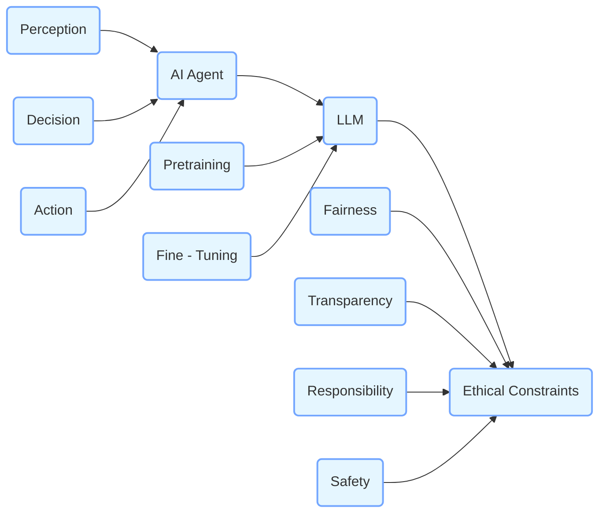

# AI Agent 的伦理约束：LLM 的安全性与道德性设计

> 关键词：AI Agent、伦理约束、大语言模型（LLM）、安全性设计、道德性设计

> 摘要：本文聚焦于 AI Agent 的伦理约束，着重探讨大语言模型（LLM）的安全性与道德性设计。首先介绍相关背景知识，包括目的、预期读者、文档结构和术语表。接着阐述核心概念与联系，详细讲解核心算法原理及操作步骤，并给出数学模型和公式。通过项目实战展示代码实现与解读，分析实际应用场景。推荐了学习资源、开发工具框架以及相关论文著作。最后总结未来发展趋势与挑战，解答常见问题并提供扩展阅读与参考资料，旨在为 AI Agent 的伦理约束及 LLM 的安全道德设计提供全面且深入的技术指导。

## 1. 背景介绍 
### 1.1 目的和范围
随着人工智能技术的飞速发展，AI Agent 在各个领域的应用日益广泛。大语言模型（LLM）作为 AI Agent 的核心组成部分，其输出结果对社会、经济和文化等方面产生着深远影响。然而，LLM 也可能带来一系列伦理问题，如生成虚假信息、传播偏见、侵犯隐私等。因此，本文的目的是深入探讨 AI Agent 的伦理约束，特别是 LLM 的安全性与道德性设计，旨在为开发者、研究者和决策者提供理论支持和实践指导，确保 AI Agent 的开发和应用符合伦理道德标准。
本文的范围涵盖了 AI Agent 和 LLM 的基本概念、伦理约束的重要性、安全性与道德性设计的原理和方法、实际应用场景以及未来发展趋势等方面。通过对这些内容的研究和分析，帮助读者全面了解 AI Agent 的伦理问题，并掌握相应的解决方案。

### 1.2 预期读者
本文的预期读者包括但不限于以下几类人群：
- **人工智能开发者**：希望了解如何在开发 AI Agent 和 LLM 时考虑伦理约束，确保模型的安全性和道德性。
- **研究者**：对人工智能伦理问题感兴趣，希望深入研究相关理论和方法。
- **政策制定者**：需要制定相关政策和法规，规范 AI Agent 的开发和应用，保障社会公共利益。
- **普通读者**：对人工智能技术有一定了解，希望了解 AI Agent 可能带来的伦理问题及其解决方案。

### 1.3 文档结构概述
本文将按照以下结构进行组织：
- **核心概念与联系**：介绍 AI Agent、LLM、伦理约束等核心概念，并阐述它们之间的联系。
- **核心算法原理 & 具体操作步骤**：详细讲解 LLM 的安全性与道德性设计的核心算法原理，并给出具体的操作步骤。
- **数学模型和公式 & 详细讲解 & 举例说明**：建立数学模型，推导相关公式，并通过具体例子进行说明。
- **项目实战：代码实际案例和详细解释说明**：通过实际项目案例，展示如何在代码中实现 LLM 的安全性与道德性设计。
- **实际应用场景**：分析 AI Agent 在不同领域的实际应用场景，以及可能面临的伦理问题和解决方案。
- **工具和资源推荐**：推荐相关的学习资源、开发工具框架和论文著作，帮助读者进一步深入学习和研究。
- **总结：未来发展趋势与挑战**：总结本文的主要内容，展望 AI Agent 的伦理约束及 LLM 的安全性与道德性设计的未来发展趋势，并分析可能面临的挑战。
- **附录：常见问题与解答**：解答读者在阅读过程中可能遇到的常见问题。
- **扩展阅读 & 参考资料**：提供相关的扩展阅读材料和参考资料，方便读者进一步深入研究。

### 1.4 术语表
#### 1.4.1 核心术语定义
- **AI Agent**：人工智能代理，是一种能够感知环境、做出决策并采取行动的智能实体。
- **大语言模型（LLM）**：一种基于深度学习的语言模型，能够处理和生成自然语言文本。
- **伦理约束**：指在人工智能开发和应用过程中，需要遵循的道德原则和规范。
- **安全性设计**：为确保 AI Agent 和 LLM 的输出结果不会对用户、社会和环境造成危害而进行的设计。
- **道德性设计**：为使 AI Agent 和 LLM 的输出结果符合道德标准，避免传播偏见、歧视等不良信息而进行的设计。

#### 1.4.2 相关概念解释
- **对抗训练**：一种通过引入对抗样本，提高模型鲁棒性和安全性的训练方法。
- **偏见检测**：检测模型输出结果中是否存在对特定群体的偏见和歧视。
- **内容审核**：对模型生成的文本内容进行审核，确保其符合法律法规和道德标准。

#### 1.4.3 缩略词列表
- **LLM**：大语言模型（Large Language Model）
- **AI**：人工智能（Artificial Intelligence）

## 2. 核心概念与联系 
### 核心概念原理
#### AI Agent
AI Agent 是人工智能领域中的一个重要概念，它可以被看作是一个具有自主性、反应性和社会性的智能实体。自主性意味着 AI Agent 能够独立地感知环境、做出决策并采取行动；反应性表示它能够对环境的变化做出及时的响应；社会性则指它可以与其他 Agent 或人类进行交互。

AI Agent 通常由感知模块、决策模块和行动模块组成。感知模块负责收集环境信息，决策模块根据感知到的信息进行推理和决策，行动模块则执行决策模块下达的指令。例如，一个智能客服 Agent 可以通过感知用户的输入信息，利用决策模块进行意图识别和回复生成，最后通过行动模块将回复发送给用户。

#### 大语言模型（LLM）
大语言模型是基于深度学习技术的一种语言模型，它通过在大规模文本数据上进行训练，学习语言的模式和规律，从而能够处理和生成自然语言文本。LLM 通常采用Transformer架构，该架构具有强大的并行计算能力和长序列处理能力。

LLM 的训练过程通常分为预训练和微调两个阶段。在预训练阶段，模型在大规模无监督文本数据上进行训练，学习语言的通用知识；在微调阶段，模型在特定任务的有监督数据上进行训练，以适应具体的应用场景。例如，GPT系列模型就是典型的大语言模型，它们在大规模文本数据上进行预训练后，可以用于文本生成、问答系统、机器翻译等多种自然语言处理任务。

#### 伦理约束
伦理约束是指在人工智能开发和应用过程中需要遵循的道德原则和规范。随着人工智能技术的广泛应用，其可能带来的伦理问题也日益受到关注。例如，AI Agent 可能会生成虚假信息、传播偏见、侵犯隐私等，这些问题不仅会对用户造成伤害，还会影响社会的公平和稳定。

伦理约束的目的是确保人工智能技术的发展和应用符合人类的价值观和利益。常见的伦理原则包括公平性、透明度、责任性、安全性等。例如，公平性原则要求 AI Agent 在处理不同群体的信息时不应该存在偏见和歧视；透明度原则要求模型的决策过程和输出结果应该是可解释的；责任性原则要求开发者和使用者对 AI Agent 的行为负责；安全性原则要求模型的输出结果不会对用户、社会和环境造成危害。

### 架构的文本示意图
```plaintext
+----------------------+
|       AI Agent       |
| +------------------+ |
| |    Perception    | |
| +------------------+ |
| |    Decision      | |
| +------------------+ |
| |    Action        | |
| +------------------+ |
+----------------------+
           |
           v
+----------------------+
|      LLM (Backend)   |
| +------------------+ |
| |  Pretraining     | |
| +------------------+ |
| |  Fine - Tuning   | |
| +------------------+ |
+----------------------+
           |
           v
+----------------------+
|    Ethical Constraints |
| +------------------+ |
| |  Fairness        | |
| +------------------+ |
| |  Transparency    | |
| +------------------+ |
| |  Responsibility  | |
| +------------------+ |
| |  Safety          | |
| +------------------+ |
+----------------------+
```

### Mermaid 流程图


从上述的示意图和流程图可以看出，AI Agent 依赖于 LLM 作为其语言处理的后端支持，而 LLM 的开发和应用需要受到伦理约束的规范。AI Agent 通过感知模块获取信息，经过决策模块基于 LLM 的能力进行决策，最后通过行动模块执行决策。LLM 在预训练和微调阶段都需要考虑伦理约束，以确保其输出结果符合道德标准。伦理约束中的公平性、透明度、责任性和安全性等原则相互关联，共同保障 AI Agent 和 LLM 的健康发展。

## 3. 核心算法原理 & 具体操作步骤 
### 核心算法原理
#### 对抗训练提高安全性
对抗训练是一种提高模型安全性和鲁棒性的有效方法。其基本思想是在训练过程中引入对抗样本，使得模型能够学习到如何抵御这些恶意攻击。具体来说，对抗样本是通过对原始输入数据进行微小的扰动而生成的，这些扰动在人类看来几乎不可察觉，但却能使模型产生错误的输出。

在 LLM 中，对抗训练可以通过以下方式实现。假设我们有一个原始输入序列 $x$ 和对应的目标输出 $y$，我们首先生成一个对抗样本 $x_{adv}$，它是在 $x$ 的基础上添加了一个微小的扰动 $\delta$，即 $x_{adv}=x + \delta$。然后，我们同时使用原始样本 $(x, y)$ 和对抗样本 $(x_{adv}, y)$ 来训练模型。在训练过程中，模型需要同时优化对原始样本和对抗样本的预测能力，从而提高其对恶意攻击的抵抗力。

以下是一个简单的 Python 代码示例，展示了如何使用 PyTorch 实现对抗训练：
```python
import torch
import torch.nn as nn
import torch.optim as optim
from torch.autograd import Variable

# 定义一个简单的语言模型
class SimpleLanguageModel(nn.Module):
    def __init__(self, input_size, hidden_size, output_size):
        super(SimpleLanguageModel, self).__init__()
        self.fc1 = nn.Linear(input_size, hidden_size)
        self.relu = nn.ReLU()
        self.fc2 = nn.Linear(hidden_size, output_size)

    def forward(self, x):
        out = self.fc1(x)
        out = self.relu(out)
        out = self.fc2(out)
        return out

# 初始化模型、损失函数和优化器
input_size = 10
hidden_size = 20
output_size = 5
model = SimpleLanguageModel(input_size, hidden_size, output_size)
criterion = nn.CrossEntropyLoss()
optimizer = optim.Adam(model.parameters(), lr=0.001)

# 生成一些随机数据
batch_size = 32
x = torch.randn(batch_size, input_size)
y = torch.randint(0, output_size, (batch_size,))

# 对抗训练参数
epsilon = 0.01  # 扰动的大小
num_steps = 10  # 迭代步数

for epoch in range(100):
    # 计算原始样本的损失
    optimizer.zero_grad()
    outputs = model(x)
    loss = criterion(outputs, y)
    loss.backward()

    # 生成对抗样本
    delta = torch.zeros_like(x, requires_grad=True)
    for _ in range(num_steps):
        adv_outputs = model(x + delta)
        adv_loss = criterion(adv_outputs, y)
        adv_loss.backward()
        delta.data = (delta + epsilon * delta.grad.data.sign()).clamp(-epsilon, epsilon)
        delta.grad.zero_()

    # 计算对抗样本的损失
    adv_outputs = model(x + delta)
    adv_loss = criterion(adv_outputs, y)
    adv_loss.backward()

    # 更新模型参数
    optimizer.step()

    if (epoch + 1) % 10 == 0:
        print(f'Epoch [{epoch + 1}/100], Loss: {loss.item()}, Adv Loss: {adv_loss.item()}')
```

#### 偏见检测与消除
偏见检测是识别模型输出结果中是否存在对特定群体的偏见和歧视的过程。常见的偏见类型包括性别偏见、种族偏见、年龄偏见等。为了检测偏见，我们可以使用一些基于统计学和机器学习的方法。

一种简单的方法是统计模型在不同群体上的输出差异。例如，我们可以收集不同性别、种族的文本数据，让模型对这些数据进行处理，然后比较模型在不同群体上的输出结果。如果存在显著的差异，则可能意味着模型存在偏见。

另一种方法是使用预训练的偏见检测模型。这些模型通常在大规模标注的偏见数据上进行训练，能够自动识别文本中的偏见信息。例如，我们可以使用 Hugging Face 上的一些预训练模型来进行偏见检测。

以下是一个使用 Hugging Face 的 `transformers` 库进行偏见检测的示例代码：
```python
from transformers import AutoTokenizer, AutoModelForSequenceClassification
import torch

# 加载预训练的偏见检测模型
tokenizer = AutoTokenizer.from_pretrained("d4data/bias-detection-model")
model = AutoModelForSequenceClassification.from_pretrained("d4data/bias-detection-model")

# 待检测的文本
text = "Women are not as good at math as men."

# 对文本进行编码
inputs = tokenizer(text, return_tensors="pt")

# 进行预测
with torch.no_grad():
    outputs = model(**inputs)
    logits = outputs.logits
    predicted_class_id = logits.argmax().item()
    label = model.config.id2label[predicted_class_id]

print(f"文本是否存在偏见: {label}")
```

### 具体操作步骤
#### 对抗训练步骤
1. **数据准备**：收集训练数据，包括原始输入序列和对应的目标输出。
2. **模型初始化**：选择合适的 LLM 架构，并初始化模型的参数。
3. **设置对抗训练参数**：确定扰动的大小 $\epsilon$ 和迭代步数 $num\_steps$。
4. **训练过程**：
    - 计算原始样本的损失，并进行反向传播。
    - 生成对抗样本，通过迭代更新扰动 $\delta$。
    - 计算对抗样本的损失，并进行反向传播。
    - 更新模型参数。
5. **评估和调整**：在验证集上评估模型的性能，根据评估结果调整对抗训练参数。

#### 偏见检测与消除步骤
1. **数据收集**：收集不同群体的文本数据，用于偏见检测和分析。
2. **选择偏见检测方法**：可以选择基于统计学的方法或使用预训练的偏见检测模型。
3. **进行偏见检测**：对模型的输出结果进行偏见检测，记录存在偏见的文本和相关信息。
4. **消除偏见**：根据检测结果，对模型进行调整和优化。例如，可以使用对抗训练的方法，让模型学习到如何消除偏见；或者对训练数据进行清洗和平衡，减少数据中的偏见信息。
5. **再次评估**：在消除偏见后，再次对模型进行评估，确保模型的输出结果符合公平性原则。

通过以上的核心算法原理和具体操作步骤，我们可以提高 LLM 的安全性和道德性，减少模型可能带来的伦理问题。

## 4. 数学模型和公式 & 详细讲解 & 举例说明 
### 对抗训练的数学模型
#### 基本原理
在对抗训练中，我们的目标是让模型在面对原始样本和对抗样本时都能有较好的表现。设模型的输入为 $x$，目标输出为 $y$，模型的参数为 $\theta$，模型的预测函数为 $f(x; \theta)$。我们使用损失函数 $L(f(x; \theta), y)$ 来衡量模型的预测结果与目标输出之间的差异。

对抗样本 $x_{adv}$ 是通过对原始输入 $x$ 进行微小的扰动得到的，即 $x_{adv}=x + \delta$，其中 $\delta$ 是扰动向量。我们希望模型在对抗样本上的损失也尽可能小，因此对抗训练的目标可以表示为：

$$\min_{\theta} \mathbb{E}_{(x,y) \sim D} [L(f(x; \theta), y) + \alpha L(f(x + \delta(\theta, x); \theta), y)]$$

其中 $D$ 是训练数据集，$\alpha$ 是一个超参数，用于控制对抗样本损失的权重，$\delta(\theta, x)$ 是根据模型参数 $\theta$ 和原始输入 $x$ 生成的扰动向量。

#### 扰动向量的生成
在实际应用中，常用的扰动向量生成方法是快速梯度符号法（FGSM）。FGSM 的基本思想是沿着损失函数关于输入的梯度方向添加一个微小的扰动。具体来说，扰动向量 $\delta$ 可以表示为：

$$\delta = \epsilon \cdot \text{sign}(\nabla_x L(f(x; \theta), y))$$

其中 $\epsilon$ 是扰动的大小，$\nabla_x L(f(x; \theta), y)$ 是损失函数关于输入 $x$ 的梯度，$\text{sign}$ 是符号函数。

#### 举例说明
假设我们有一个简单的线性分类器 $f(x; \theta) = \theta^T x$，其中 $\theta$ 是模型的参数，$x$ 是输入向量。损失函数采用交叉熵损失 $L(f(x; \theta), y) = -y \log(f(x; \theta)) - (1 - y) \log(1 - f(x; \theta))$。

给定一个输入样本 $x = [1, 2]$，目标输出 $y = 1$，模型参数 $\theta = [0.1, 0.2]$，扰动大小 $\epsilon = 0.1$。

首先，计算损失函数关于输入 $x$ 的梯度：

$$\nabla_x L(f(x; \theta), y) = \frac{\partial L}{\partial x}$$

对于交叉熵损失，经过求导可得：

$$\nabla_x L(f(x; \theta), y) = \frac{y - f(x; \theta)}{f(x; \theta)(1 - f(x; \theta))} \cdot \theta$$

将 $x = [1, 2]$，$y = 1$，$\theta = [0.1, 0.2]$ 代入可得：

$$f(x; \theta) = 0.1 \times 1 + 0.2 \times 2 = 0.5$$

$$\nabla_x L(f(x; \theta), y) = \frac{1 - 0.5}{0.5 \times (1 - 0.5)} \cdot [0.1, 0.2] = [0.2, 0.4]$$

然后，根据 FGSM 生成扰动向量：

$$\delta = \epsilon \cdot \text{sign}(\nabla_x L(f(x; \theta), y)) = 0.1 \cdot [\text{sign}(0.2), \text{sign}(0.4)] = [0.1, 0.1]$$

最后，得到对抗样本 $x_{adv} = x + \delta = [1 + 0.1, 2 + 0.1] = [1.1, 2.1]$。

### 偏见检测的数学模型
#### 基于统计的偏见检测
基于统计的偏见检测方法通常通过比较不同群体的模型输出结果来判断是否存在偏见。设我们有两个群体 $G_1$ 和 $G_2$，对于每个群体，我们收集了一组文本数据 $D_1$ 和 $D_2$。模型对这些数据的输出结果分别为 $O_1$ 和 $O_2$。

我们可以定义一个偏见指标 $B$ 来衡量两个群体之间的输出差异。例如，我们可以使用均值差异来定义偏见指标：

$$B = |\bar{O}_1 - \bar{O}_2|$$

其中 $\bar{O}_1$ 和 $\bar{O}_2$ 分别是 $O_1$ 和 $O_2$ 的均值。如果 $B$ 超过了某个阈值 $T$，则认为模型存在偏见。

#### 基于机器学习的偏见检测
基于机器学习的偏见检测方法通常使用一个预训练的分类器来判断文本是否存在偏见。设分类器的输入为文本的特征向量 $x$，输出为偏见标签 $y \in \{0, 1\}$，其中 $0$ 表示无偏见，$1$ 表示有偏见。

分类器的预测函数可以表示为 $g(x; \omega)$，其中 $\omega$ 是分类器的参数。我们使用损失函数 $L(g(x; \omega), y)$ 来训练分类器，目标是最小化损失函数：

$$\min_{\omega} \mathbb{E}_{(x,y) \sim D_b} [L(g(x; \omega), y)]$$

其中 $D_b$ 是偏见检测的训练数据集。

#### 举例说明
假设我们要检测一个情感分析模型是否存在性别偏见。我们收集了男性和女性的影评数据 $D_{male}$ 和 $D_{female}$，模型对这些数据的情感得分分别为 $O_{male}$ 和 $O_{female}$。

计算均值：

$$\bar{O}_{male} = \frac{1}{n_{male}} \sum_{i = 1}^{n_{male}} O_{male}^i$$

$$\bar{O}_{female} = \frac{1}{n_{female}} \sum_{i = 1}^{n_{female}} O_{female}^i$$

其中 $n_{male}$ 和 $n_{female}$ 分别是男性和女性影评数据的数量。

假设 $\bar{O}_{male} = 0.7$，$\bar{O}_{female} = 0.5$，阈值 $T = 0.1$。则偏见指标 $B = |0.7 - 0.5| = 0.2 > T$，说明该情感分析模型可能存在性别偏见。

通过以上的数学模型和公式，我们可以更深入地理解对抗训练和偏见检测的原理，并通过具体的例子来直观地感受它们的应用。

## 5. 项目实战：代码实际案例和详细解释说明 
### 5.1  开发环境搭建
#### 硬件环境
为了能够顺利运行大语言模型相关的代码，我们建议使用具有较高计算性能的硬件设备。以下是一些推荐的硬件配置：
- **CPU**：至少具有 4 核及以上的处理器，例如 Intel Core i7 系列或 AMD Ryzen 7 系列。
- **GPU**：如果进行大规模的模型训练，建议使用 NVIDIA GPU，如 NVIDIA GeForce RTX 3060 或更高版本，以利用其强大的并行计算能力加速训练过程。
- **内存**：至少 16GB 的 RAM，以确保能够处理较大的数据集和模型参数。

#### 软件环境
- **操作系统**：推荐使用 Linux 系统，如 Ubuntu 20.04 或更高版本，因为 Linux 系统在人工智能开发中具有广泛的支持和良好的性能。当然，Windows 10 或 macOS 也可以使用，但可能需要进行一些额外的配置。
- **Python 环境**：安装 Python 3.7 或更高版本。可以使用 Anaconda 来管理 Python 环境，它可以方便地创建和切换不同的虚拟环境。
```bash
# 安装 Anaconda
wget https://repo.anaconda.com/archive/Anaconda3-2023.03-Linux-x86_64.sh
bash Anaconda3-2023.03-Linux-x86_64.sh

# 创建虚拟环境
conda create -n llm_ethics python=3.8
conda activate llm_ethics
```
- **深度学习框架**：安装 PyTorch 和 Transformers 库。PyTorch 是一个广泛使用的深度学习框架，而 Transformers 库提供了许多预训练的大语言模型和相关工具。
```bash
# 安装 PyTorch
pip install torch torchvision torchaudio

# 安装 Transformers
pip install transformers
```

### 5.2  源代码详细实现和代码解读
#### 对抗训练示例
```python
import torch
import torch.nn as nn
import torch.optim as optim
from torch.utils.data import DataLoader, Dataset
from transformers import AutoTokenizer, AutoModelForSequenceClassification

# 定义数据集类
class CustomDataset(Dataset):
    def __init__(self, texts, labels, tokenizer, max_length):
        self.texts = texts
        self.labels = labels
        self.tokenizer = tokenizer
        self.max_length = max_length

    def __len__(self):
        return len(self.texts)

    def __getitem__(self, idx):
        text = self.texts[idx]
        label = self.labels[idx]
        encoding = self.tokenizer.encode_plus(
            text,
            add_special_tokens=True,
            max_length=self.max_length,
            padding='max_length',
            truncation=True,
            return_tensors='pt'
        )
        return {
            'input_ids': encoding['input_ids'].flatten(),
            'attention_mask': encoding['attention_mask'].flatten(),
            'labels': torch.tensor(label, dtype=torch.long)
        }

# 定义训练函数
def train_model(model, train_dataloader, optimizer, criterion, device, epsilon=0.01, num_steps=10):
    model.train()
    total_loss = 0
    for batch in train_dataloader:
        input_ids = batch['input_ids'].to(device)
        attention_mask = batch['attention_mask'].to(device)
        labels = batch['labels'].to(device)

        # 计算原始样本的损失
        optimizer.zero_grad()
        outputs = model(input_ids, attention_mask=attention_mask)
        logits = outputs.logits
        loss = criterion(logits, labels)
        loss.backward()

        # 生成对抗样本
        delta = torch.zeros_like(input_ids, dtype=torch.float32, requires_grad=True).to(device)
        for _ in range(num_steps):
            adv_input_ids = (input_ids + delta).clamp(0, 1).long()
            adv_outputs = model(adv_input_ids, attention_mask=attention_mask)
            adv_logits = adv_outputs.logits
            adv_loss = criterion(adv_logits, labels)
            adv_loss.backward()
            delta.data = (delta + epsilon * delta.grad.data.sign()).clamp(-epsilon, epsilon)
            delta.grad.zero_()

        # 计算对抗样本的损失
        adv_input_ids = (input_ids + delta).clamp(0, 1).long()
        adv_outputs = model(adv_input_ids, attention_mask=attention_mask)
        adv_logits = adv_outputs.logits
        adv_loss = criterion(adv_logits, labels)
        adv_loss.backward()

        # 更新模型参数
        optimizer.step()

        total_loss += loss.item()

    return total_loss / len(train_dataloader)

# 主函数
def main():
    # 加载预训练模型和分词器
    model_name = 'bert-base-uncased'
    tokenizer = AutoTokenizer.from_pretrained(model_name)
    model = AutoModelForSequenceClassification.from_pretrained(model_name, num_labels=2)

    # 模拟数据
    texts = ["This is a positive sentence.", "This is a negative sentence."]
    labels = [1, 0]

    # 创建数据集和数据加载器
    dataset = CustomDataset(texts, labels, tokenizer, max_length=128)
    train_dataloader = DataLoader(dataset, batch_size=2, shuffle=True)

    # 定义损失函数和优化器
    criterion = nn.CrossEntropyLoss()
    optimizer = optim.Adam(model.parameters(), lr=2e-5)

    # 设备配置
    device = torch.device('cuda' if torch.cuda.is_available() else 'cpu')
    model.to(device)

    # 训练模型
    num_epochs = 3
    for epoch in range(num_epochs):
        train_loss = train_model(model, train_dataloader, optimizer, criterion, device)
        print(f'Epoch {epoch + 1}/{num_epochs}, Train Loss: {train_loss:.4f}')

if __name__ == "__main__":
    main()
```
**代码解读**：
1. **数据集类 `CustomDataset`**：用于处理文本数据，将文本转换为模型可以接受的输入格式。它接受文本列表、标签列表、分词器和最大长度作为参数，在 `__getitem__` 方法中对文本进行编码，并返回输入 ID、注意力掩码和标签。
2. **训练函数 `train_model`**：实现了对抗训练的过程。首先计算原始样本的损失，然后生成对抗样本，通过多次迭代更新扰动向量 $\delta$，计算对抗样本的损失，最后更新模型参数。
3. **主函数 `main`**：加载预训练的 BERT 模型和分词器，模拟数据，创建数据集和数据加载器，定义损失函数和优化器，将模型移动到指定设备上，进行多轮训练并输出训练损失。

#### 偏见检测示例
```python
from transformers import AutoTokenizer, AutoModelForSequenceClassification
import torch

# 加载预训练的偏见检测模型
model_name = "d4data/bias-detection-model"
tokenizer = AutoTokenizer.from_pretrained(model_name)
model = AutoModelForSequenceClassification.from_pretrained(model_name)

# 待检测的文本列表
texts = [
    "Women are not as good at math as men.",
    "All Asians are good at programming."
]

# 进行偏见检测
for text in texts:
    inputs = tokenizer(text, return_tensors="pt")
    with torch.no_grad():
        outputs = model(**inputs)
        logits = outputs.logits
        predicted_class_id = logits.argmax().item()
        label = model.config.id2label[predicted_class_id]
    print(f"文本: {text}")
    print(f"是否存在偏见: {label}")
```
**代码解读**：
1. **加载模型和分词器**：使用 `transformers` 库加载预训练的偏见检测模型和对应的分词器。
2. **待检测文本列表**：定义了一个包含多个待检测文本的列表。
3. **进行偏见检测**：遍历文本列表，对每个文本进行编码，使用模型进行预测，根据预测结果输出文本是否存在偏见的标签。

### 5.3  代码解读与分析
#### 对抗训练代码分析
- **优势**：通过引入对抗样本，模型能够学习到如何抵御恶意攻击，提高了模型的鲁棒性和安全性。在面对对抗性输入时，模型的性能下降会相对较小。
- **局限性**：对抗训练的计算成本较高，需要额外的计算资源和时间来生成对抗样本和进行训练。同时，对抗样本的生成方法可能存在一定的局限性，不能完全模拟所有可能的攻击方式。

#### 偏见检测代码分析
- **优势**：使用预训练的偏见检测模型可以快速、准确地识别文本中的偏见信息，无需大量的标注数据和复杂的特征工程。
- **局限性**：预训练模型的性能可能受到训练数据的限制，对于一些特定领域或新型的偏见信息可能无法准确检测。此外，模型的解释性较差，难以理解模型做出判断的具体依据。

通过以上的项目实战，我们展示了如何在代码中实现对抗训练和偏见检测，以及对代码的详细解读和分析，帮助读者更好地理解和应用这些技术。

## 6. 实际应用场景 
### 智能客服
在智能客服领域，AI Agent 被广泛应用于回答用户的问题、解决用户的投诉等。然而，智能客服系统可能会出现一些伦理问题。例如，在回答用户问题时，可能会生成虚假信息或提供不恰当的建议；在处理用户投诉时，可能会对某些用户群体存在偏见。

为了确保智能客服系统的安全性和道德性，我们可以采用以下方法：
- **对抗训练**：通过引入对抗样本，提高模型对恶意输入的抵抗力，防止黑客利用对抗攻击来获取系统信息或破坏系统正常运行。
- **偏见检测与消除**：对智能客服系统的回复进行偏见检测，及时发现和纠正可能存在的偏见信息。例如，在处理用户投诉时，确保对不同性别、种族、年龄的用户一视同仁。

### 内容创作
在内容创作领域，AI Agent 可以辅助人类进行文章写作、故事创作等。但 AI 生成的内容可能会存在抄袭、传播虚假信息、包含偏见等问题。

为了保障内容创作的质量和道德性，可以采取以下措施：
- **内容审核**：使用内容审核工具对 AI 生成的内容进行审核，检查是否存在抄袭、虚假信息等问题。例如，可以使用文本相似度检测工具来检查内容是否与已有文献相似度过高。
- **偏见检测与引导**：对生成的内容进行偏见检测，引导模型生成更加客观、公正的内容。例如，在进行新闻报道创作时，避免使用带有偏见性的词汇和描述。

### 金融风险评估
在金融风险评估领域，AI Agent 可以帮助银行和金融机构评估客户的信用风险、投资风险等。然而，金融风险评估模型可能会受到数据偏差的影响，导致对某些客户群体的评估结果不准确，存在歧视性。

为了保证金融风险评估的公平性和准确性，可以采取以下方法：
- **数据清洗和平衡**：对训练数据进行清洗，去除可能存在的偏见信息，并对不同群体的数据进行平衡处理，确保模型在不同群体上的表现一致。
- **可解释性模型**：使用可解释性的机器学习模型，让金融机构和客户能够理解模型的决策过程和依据，避免因模型的不透明性而导致的不公平评估。

### 医疗诊断辅助
在医疗诊断辅助领域，AI Agent 可以帮助医生进行疾病诊断、治疗方案推荐等。但医疗诊断结果直接关系到患者的生命健康，因此对模型的安全性和道德性要求极高。

为了确保医疗诊断辅助系统的可靠性和安全性，可以采取以下措施：
- **严格的数据验证**：对训练数据进行严格的验证和审核，确保数据的准确性和完整性。例如，对患者的病历数据进行多次核对，避免因数据错误而导致的误诊。
- **多模型融合和专家审核**：采用多模型融合的方法，综合多个模型的诊断结果，提高诊断的准确性。同时，引入医学专家对 AI 诊断结果进行审核，确保诊断结果符合医学伦理和规范。

通过以上实际应用场景的分析，我们可以看到 AI Agent 在不同领域的应用中都可能面临伦理问题，需要采取相应的措施来确保其安全性和道德性。

## 7. 工具和资源推荐
### 7.1 学习资源推荐
#### 7.1.1 书籍推荐
- 《人工智能：一种现代的方法》（Artificial Intelligence: A Modern Approach）：这是一本经典的人工智能教材，全面介绍了人工智能的各个领域，包括搜索算法、知识表示、机器学习、自然语言处理等。书中对 AI Agent 和大语言模型的基本原理和算法有详细的讲解，适合初学者和有一定基础的读者阅读。
- 《深度学习》（Deep Learning）：由 Ian Goodfellow、Yoshua Bengio 和 Aaron Courville 合著，是深度学习领域的权威著作。书中深入介绍了深度学习的基本概念、模型架构和训练方法，对于理解大语言模型的技术原理非常有帮助。
- 《道德算法：机器学习的科学与道德》（The Ethical Algorithm: The Science of Socially Aware Algorithm Design）：这本书专门探讨了人工智能中的伦理问题，包括算法偏见、隐私保护、责任分配等。通过实际案例和理论分析，帮助读者了解如何在算法设计中考虑伦理因素。

#### 7.1.2 在线课程
- Coursera 上的 “人工智能基础”（Foundations of Artificial Intelligence）：该课程由哥伦比亚大学教授 Peter Norvig 等讲授，系统地介绍了人工智能的基本概念、算法和应用。课程内容包括搜索算法、知识表示、机器学习、自然语言处理等，适合初学者学习。
- edX 上的 “深度学习专项课程”（Deep Learning Specialization）：由 Andrew Ng 教授创建，是一套非常受欢迎的深度学习课程。课程涵盖了神经网络、卷积神经网络、循环神经网络等深度学习的核心内容，通过大量的实践项目帮助学员掌握深度学习的技术。
- Udemy 上的 “自然语言处理实战”（Natural Language Processing in Python）：该课程详细介绍了自然语言处理的基本技术和应用，包括文本分类、情感分析、机器翻译等。课程中会使用 Python 和相关的库进行实践操作，适合有一定编程基础的读者学习。

#### 7.1.3 技术博客和网站
- Towards Data Science：这是一个专注于数据科学和人工智能领域的技术博客平台，上面有许多优秀的文章和教程，涵盖了机器学习、深度学习、自然语言处理等多个方面。作者们会分享自己的研究成果、实践经验和技术见解，对于学习和了解最新的技术动态非常有帮助。
- Hugging Face Blog：Hugging Face 是一家专注于自然语言处理的公司，其博客上会发布关于大语言模型、Transformer 架构、预训练模型等方面的最新研究成果和技术文章。同时，Hugging Face 还提供了许多开源的预训练模型和工具，方便开发者进行自然语言处理任务的开发。
- OpenAI Blog：OpenAI 是人工智能领域的知名研究机构，其博客上会发布关于人工智能技术的最新研究成果和应用案例。通过阅读 OpenAI Blog 的文章，可以了解到人工智能领域的前沿技术和发展趋势。

### 7.2 开发工具框架推荐
#### 7.2.1 IDE和编辑器
- PyCharm：是一款专门为 Python 开发设计的集成开发环境（IDE），具有强大的代码编辑、调试、自动补全、代码分析等功能。PyCharm 支持多种 Python 框架和库，对于开发基于 PyTorch 的大语言模型非常方便。
- Jupyter Notebook：是一个交互式的开发环境，支持多种编程语言，尤其适合数据科学和机器学习的开发。Jupyter Notebook 可以将代码、文本、图表等内容整合在一起，方便进行实验和数据分析。在开发大语言模型时，可以使用 Jupyter Notebook 进行模型的训练和调试。
- Visual Studio Code：是一款轻量级的代码编辑器，具有丰富的插件生态系统。通过安装 Python 相关的插件，Visual Studio Code 可以提供强大的代码编辑和调试功能。同时，它还支持版本控制、远程开发等功能，适合团队协作开发。

#### 7.2.2 调试和性能分析工具
- PyTorch Profiler：是 PyTorch 提供的一个性能分析工具，可以帮助开发者分析模型的性能瓶颈，找出耗时较长的操作和模块。通过使用 PyTorch Profiler，可以优化模型的训练和推理速度。
- TensorBoard：是 TensorFlow 提供的一个可视化工具，也可以与 PyTorch 结合使用。TensorBoard 可以可视化模型的训练过程、损失曲线、准确率等指标，帮助开发者监控模型的训练状态。同时，它还可以可视化模型的结构和参数分布，方便进行模型分析。
- cProfile：是 Python 标准库中的一个性能分析工具，可以分析 Python 代码的执行时间和函数调用情况。通过使用 cProfile，可以找出代码中的性能瓶颈，进行针对性的优化。

#### 7.2.3 相关框架和库
- PyTorch：是一个开源的深度学习框架，具有动态计算图、易于使用等特点。PyTorch 提供了丰富的神经网络层和优化算法，方便开发者构建和训练大语言模型。同时，PyTorch 还支持分布式训练和 GPU 加速，能够提高模型的训练效率。
- Transformers：是 Hugging Face 开发的一个开源库，提供了许多预训练的大语言模型和相关工具。通过使用 Transformers 库，开发者可以方便地加载和使用预训练模型，进行文本生成、问答系统、机器翻译等自然语言处理任务。
- AllenNLP：是一个用于自然语言处理的深度学习框架，提供了许多预训练的模型和工具。AllenNLP 支持多种自然语言处理任务，如文本分类、命名实体识别、语义角色标注等。它还提供了丰富的数据集和评估指标，方便开发者进行模型的训练和评估。

### 7.3 相关论文著作推荐
#### 7.3.1 经典论文
- “Attention Is All You Need”：这篇论文提出了 Transformer 架构，是大语言模型发展的重要里程碑。Transformer 架构通过引入注意力机制，解决了传统循环神经网络在处理长序列时的梯度消失和信息丢失问题，大大提高了模型的性能和训练效率。
- “BERT: Pre-training of Deep Bidirectional Transformers for Language Understanding”：这篇论文提出了 BERT 模型，是一种基于 Transformer 架构的预训练语言模型。BERT 通过在大规模无监督文本数据上进行预训练，学习到了丰富的语言知识，在多个自然语言处理任务上取得了显著的性能提升。
- “Generative Pretrained Transformer 3 (GPT-3): Language Models are Few-Shot Learners”：这篇论文介绍了 GPT-3 模型，是 OpenAI 开发的一个大规模的生成式预训练语言模型。GPT-3 具有强大的语言生成能力，在少样本学习任务上表现出色。

#### 7.3.2 最新研究成果
- 关注 arXiv 上的人工智能领域的最新论文，arXiv 是一个开放的预印本平台，许多研究人员会在上面发布自己的最新研究成果。可以通过设置关键词订阅，及时获取关于 AI Agent 伦理约束、大语言模型安全性和道德性设计等方面的最新论文。
- 阅读顶级人工智能会议（如 NeurIPS、ICML、ACL 等）的论文集，这些会议汇聚了人工智能领域的最新研究成果和前沿技术。通过阅读会议论文，可以了解到该领域的最新研究动态和发展趋势。

#### 7.3.3 应用案例分析
- 一些知名科技公司（如 Google、Microsoft、Facebook 等）会发布关于人工智能应用的案例分析报告。这些报告通常会介绍公司在实际项目中应用人工智能技术的经验和成果，包括如何解决伦理问题、确保模型的安全性和道德性等方面的内容。
- 行业研究机构（如 Gartner、IDC 等）也会发布关于人工智能应用的研究报告，对不同行业的人工智能应用案例进行分析和评估。通过阅读这些报告，可以了解到人工智能在不同领域的应用现状和发展趋势。

通过以上推荐的学习资源、开发工具框架和论文著作，读者可以深入学习和研究 AI Agent 的伦理约束以及大语言模型的安全性和道德性设计。

## 8. 总结：未来发展趋势与挑战
### 未来发展趋势
#### 强化伦理意识和规范制定
随着人工智能技术的广泛应用，社会对 AI Agent 的伦理问题将越来越关注。未来，各国政府和国际组织将加强对人工智能伦理的研究和规范制定，出台更加严格的法律法规和行业标准，确保 AI Agent 的开发和应用符合伦理道德原则。例如，可能会要求开发者在模型开发过程中进行伦理审查，对模型的安全性和道德性进行评估和验证。

#### 技术创新解决伦理问题
为了应对 AI Agent 带来的伦理挑战，研究人员将不断探索新的技术方法。例如，开发更加安全和可解释的机器学习模型，提高模型的鲁棒性和透明度；利用区块链技术实现数据的可信存储和共享，保障数据的隐私和安全；引入对抗训练、联邦学习等技术，减少模型的偏见和歧视。

#### 跨学科研究与合作
AI Agent 的伦理问题涉及到计算机科学、哲学、社会学、法学等多个学科领域。未来，跨学科研究将成为解决人工智能伦理问题的重要途径。计算机科学家、伦理学家、社会学家等将共同合作，从不同的角度对人工智能伦理问题进行研究和探讨，提出综合性的