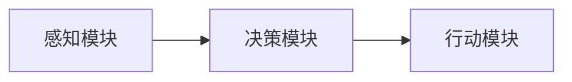
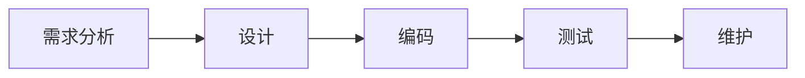

# AI Agent与传统软件开发的区别

> 关键词：AI Agent、传统软件开发、区别、智能交互、自主性

> 摘要：本文旨在深入探讨AI Agent与传统软件开发之间的区别。通过对两者的核心概念、算法原理、数学模型、实际应用场景等多个方面进行详细分析，结合具体的代码案例和丰富的工具资源推荐，帮助读者清晰地认识到它们各自的特点和优势。同时，对未来的发展趋势与挑战进行了总结，并提供了常见问题的解答和扩展阅读参考资料，使读者能够全面深入地了解AI Agent与传统软件开发的差异。

## 1. 背景介绍 
### 1.1 目的和范围
随着人工智能技术的飞速发展，AI Agent逐渐成为软件开发领域的一个热门话题。本文章的目的在于系统地比较AI Agent和传统软件开发，详细阐述它们在各个方面的区别，帮助软件开发人员、技术爱好者以及相关领域的研究者更好地理解这两种开发模式，以便在实际项目中做出更合适的选择。文章将涵盖核心概念、算法原理、数学模型、实际应用等多个关键领域。

### 1.2 预期读者
本文预期读者包括但不限于软件开发工程师、软件架构师、人工智能研究者、计算机科学专业的学生以及对软件开发和人工智能技术感兴趣的人士。无论您是新手想要了解基础知识，还是有一定经验的专业人士希望深入研究两者的差异，都能从本文中获得有价值的信息。

### 1.3 文档结构概述
本文将按照以下结构进行组织：首先介绍核心概念与联系，明确AI Agent和传统软件开发的定义和相互关系；接着详细阐述核心算法原理和具体操作步骤，并使用Python代码进行说明；然后讲解相关的数学模型和公式，并举例说明；之后通过项目实战展示两者在实际代码实现中的差异；再探讨实际应用场景；推荐相关的工具和资源；最后总结未来发展趋势与挑战，提供常见问题解答和扩展阅读参考资料。

### 1.4 术语表
#### 1.4.1 核心术语定义
- **AI Agent**：AI Agent是一种能够感知环境、根据感知到的信息做出决策并采取行动以实现特定目标的智能实体。它可以自主地与环境进行交互，具有一定的学习和适应能力。
- **传统软件开发**：传统软件开发是指按照预先定义的需求规格说明书，使用编程语言和开发工具，遵循一定的软件开发流程（如瀑布模型、敏捷开发等）来构建软件系统的过程。

#### 1.4.2 相关概念解释
- **智能交互**：指AI Agent能够理解用户的意图，以自然、灵活的方式与用户进行交互，并根据交互结果动态调整自己的行为。
- **自主性**：AI Agent在没有明确指令的情况下，能够根据自身的目标和对环境的感知自主地做出决策和采取行动。

#### 1.4.3 缩略词列表
- **AI**：Artificial Intelligence，人工智能
- **IDE**：Integrated Development Environment，集成开发环境

## 2. 核心概念与联系 

### 2.1 AI Agent的核心概念
AI Agent是人工智能领域中的一个重要概念，它是具有感知、决策和行动能力的智能体。AI Agent的基本架构通常包括感知模块、决策模块和行动模块。感知模块用于获取环境信息，决策模块根据感知到的信息和预设的目标进行决策，行动模块则根据决策结果执行相应的动作。

下面是AI Agent核心架构的文本示意图：
```plaintext
+-----------------+
|  感知模块       |
|  (获取环境信息) |
+-----------------+
       |
       v
+-----------------+
|  决策模块       |
|  (根据信息决策) |
+-----------------+
       |
       v
+-----------------+
|  行动模块       |
|  (执行动作)     |
+-----------------+
```

使用Mermaid绘制的流程图如下：


### 2.2 传统软件开发的核心概念
传统软件开发遵循一系列的流程和规范，通常包括需求分析、设计、编码、测试和维护等阶段。在需求分析阶段，开发团队与客户沟通，明确软件的功能和性能要求；设计阶段则根据需求设计软件的架构和模块；编码阶段使用编程语言将设计转化为代码；测试阶段对软件进行各种测试，确保其符合需求；维护阶段则对软件进行更新和修复。

传统软件开发核心流程的文本示意图：
```plaintext
+-----------------+
|  需求分析       |
+-----------------+
       |
       v
+-----------------+
|  设计           |
+-----------------+
       |
       v
+-----------------+
|  编码           |
+-----------------+
       |
       v
+-----------------+
|  测试           |
+-----------------+
       |
       v
+-----------------+
|  维护           |
+-----------------+
```

使用Mermaid绘制的流程图如下：


### 2.3 两者的联系
虽然AI Agent和传统软件开发有明显的区别，但它们也存在一定的联系。在某些情况下，AI Agent可以作为传统软件系统的一个组件，为系统增加智能交互和自主决策的能力。例如，在一个客户服务系统中，可以引入AI Agent来自动回答用户的常见问题，提高服务效率。同时，传统软件开发的一些技术和方法也可以应用于AI Agent的开发中，如软件工程的原则、代码管理工具等。

## 3. 核心算法原理 & 具体操作步骤 

### 3.1 AI Agent的核心算法原理及Python实现
AI Agent的核心算法包括搜索算法、机器学习算法等。以简单的基于规则的AI Agent为例，下面是一个使用Python实现的简单示例：

```python
# 定义一个简单的基于规则的AI Agent类
class SimpleAgent:
    def __init__(self, rules):
        self.rules = rules

    def perceive(self, environment):
        # 模拟感知环境信息
        return environment

    def decide(self, perception):
        # 根据感知信息和规则进行决策
        for condition, action in self.rules.items():
            if condition in perception:
                return action
        return None

    def act(self, decision):
        # 根据决策执行动作
        if decision:
            print(f"执行动作: {decision}")
        else:
            print("无合适动作")

# 定义规则
rules = {
    "危险": "躲避",
    "目标出现": "接近"
}

# 创建AI Agent实例
agent = SimpleAgent(rules)

# 模拟环境信息
environment = "目标出现"

# 感知环境
perception = agent.perceive(environment)

# 进行决策
decision = agent.decide(perception)

# 执行动作
agent.act(decision)
```

### 3.2 传统软件开发的核心算法原理及Python实现
传统软件开发中常见的算法包括排序算法、查找算法等。以冒泡排序算法为例，下面是Python实现：

```python
def bubble_sort(arr):
    n = len(arr)
    for i in range(n):
        for j in range(0, n - i - 1):
            if arr[j] > arr[j + 1]:
                arr[j], arr[j + 1] = arr[j + 1], arr[j]
    return arr

# 测试冒泡排序
arr = [64, 34, 25, 12, 22, 11, 90]
sorted_arr = bubble_sort(arr)
print("排序后的数组:", sorted_arr)
```

### 3.3 具体操作步骤对比
#### AI Agent
1. **定义规则或训练模型**：根据具体的应用场景，定义AI Agent的决策规则或使用机器学习算法训练模型。
2. **实现感知模块**：编写代码实现对环境信息的感知。
3. **实现决策模块**：根据感知到的信息和规则或模型进行决策。
4. **实现行动模块**：根据决策结果执行相应的动作。

#### 传统软件开发
1. **需求分析**：与客户沟通，明确软件的功能和性能要求。
2. **设计**：设计软件的架构和模块。
3. **编码**：使用编程语言实现软件的功能。
4. **测试**：对软件进行各种测试，确保其符合需求。
5. **维护**：对软件进行更新和修复。

## 4. 数学模型和公式 & 详细讲解 & 举例说明 

### 4.1 AI Agent的数学模型和公式
在AI Agent中，常用的数学模型包括马尔可夫决策过程（MDP）。马尔可夫决策过程可以用一个五元组 $(S, A, P, R, \gamma)$ 表示，其中：
- $S$ 是状态集合，表示环境的所有可能状态。
- $A$ 是动作集合，表示AI Agent可以采取的所有动作。
- $P(s'|s, a)$ 是状态转移概率，表示在状态 $s$ 下采取动作 $a$ 后转移到状态 $s'$ 的概率。
- $R(s, a, s')$ 是奖励函数，表示在状态 $s$ 下采取动作 $a$ 并转移到状态 $s'$ 时获得的奖励。
- $\gamma$ 是折扣因子，取值范围为 $[0, 1]$，用于权衡当前奖励和未来奖励。

AI Agent的目标是找到一个最优策略 $\pi(s)$，使得长期累积奖励最大化，即：
$$
V^*(s) = \max_{\pi} \mathbb{E} \left[ \sum_{t=0}^{\infty} \gamma^t R(S_t, A_t, S_{t+1}) | S_0 = s, \pi \right]
$$
其中 $V^*(s)$ 是状态 $s$ 的最优值函数。

举例说明：假设一个机器人在一个二维网格环境中移动，状态 $s$ 表示机器人的位置，动作 $a$ 包括上下左右移动。当机器人移动到目标位置时获得奖励 $+10$，撞到障碍物时获得奖励 $-1$。通过马尔可夫决策过程可以计算出机器人的最优移动策略。

### 4.2 传统软件开发的数学模型和公式
在传统软件开发中，排序算法的复杂度分析是一个重要的数学模型。以冒泡排序为例，其时间复杂度可以用大 $O$ 表示法来分析。冒泡排序的时间复杂度为 $O(n^2)$，其中 $n$ 是数组的长度。这是因为冒泡排序需要进行两层嵌套循环，对于每个元素都需要与其他元素进行比较和交换。

具体推导过程如下：
冒泡排序的外层循环执行 $n$ 次，内层循环对于每次外层循环执行 $n - i - 1$ 次（$i$ 是外层循环的当前迭代次数）。因此，总的比较次数为：
$$
\sum_{i = 0}^{n - 1} (n - i - 1) = \sum_{j = 0}^{n - 1} j = \frac{n(n - 1)}{2}
$$
当 $n$ 足够大时，忽略常数项和低阶项，时间复杂度为 $O(n^2)$。

## 5. 项目实战：代码实际案例和详细解释说明 

### 5.1  开发环境搭建
#### AI Agent项目
对于AI Agent项目，我们可以使用Python作为开发语言，安装相关的库如 `numpy`、`scikit-learn` 等。可以使用以下命令进行安装：
```sh
pip install numpy scikit-learn
```
同时，建议使用Jupyter Notebook或PyCharm作为开发工具，方便代码的编写和调试。

#### 传统软件开发项目
同样使用Python作为开发语言，根据具体项目需求安装相应的库。例如，如果开发一个Web应用，可以安装 `Flask` 或 `Django` 等框架。使用以下命令安装 `Flask`：
```sh
pip install flask
```
开发工具可以选择PyCharm或VS Code。

### 5.2  源代码详细实现和代码解读
#### AI Agent项目：简单的聊天机器人
```python
import random

# 定义规则
responses = {
    "你好": ["你好呀", "您好", "哈喽"],
    "吃饭了吗": ["还没呢，你呢", "吃过啦", "正准备吃"]
}

# 定义AI Agent类
class ChatBotAgent:
    def perceive(self, user_input):
        # 感知用户输入
        return user_input

    def decide(self, perception):
        # 根据用户输入进行决策
        if perception in responses:
            return random.choice(responses[perception])
        else:
            return "我不太明白你的意思"

    def act(self, decision):
        # 输出回复
        print(decision)

# 创建聊天机器人实例
bot = ChatBotAgent()

# 模拟用户输入
user_input = "你好"

# 感知用户输入
perception = bot.perceive(user_input)

# 进行决策
decision = bot.decide(perception)

# 执行动作
bot.act(decision)
```
代码解读：
- `responses` 字典存储了常见问题的回复列表。
- `ChatBotAgent` 类的 `perceive` 方法用于获取用户输入，`decide` 方法根据用户输入在 `responses` 字典中查找对应的回复，如果找不到则返回默认回复，`act` 方法用于输出回复。

#### 传统软件开发项目：简单的Web应用
```python
from flask import Flask

app = Flask(__name__)

@app.route('/')
def hello_world():
    return 'Hello, World!'

if __name__ == '__main__':
    app.run()
```
代码解读：
- 使用 `Flask` 框架创建一个简单的Web应用。
- `@app.route('/')` 装饰器定义了根路径的路由，当用户访问根路径时，会调用 `hello_world` 函数并返回 `Hello, World!` 字符串。
- `app.run()` 启动Web服务器。

### 5.3  代码解读与分析
#### AI Agent项目
AI Agent项目的代码重点在于模拟智能交互，通过规则匹配来生成回复。这种方式的优点是实现简单，适用于处理一些常见问题。但缺点是缺乏灵活性，对于复杂问题或新问题无法很好地处理。可以通过引入机器学习算法，如自然语言处理中的深度学习模型，来提高聊天机器人的智能水平。

#### 传统软件开发项目
传统软件开发项目的代码遵循Web开发的规范，通过路由机制来处理不同的请求。这种方式的优点是结构清晰，易于维护和扩展。但对于需要实时交互和智能决策的场景，传统的Web开发方式可能不够灵活，需要引入其他技术来增强功能。

## 6. 实际应用场景 
### 6.1 AI Agent的实际应用场景
- **智能客服**：AI Agent可以自动回答用户的常见问题，提高客户服务效率。例如，电商平台的在线客服可以使用AI Agent来处理用户的咨询，快速提供解决方案。
- **智能家居**：AI Agent可以感知家居环境的信息，如温度、湿度等，并根据用户的需求自动调节家电设备。例如，智能空调可以根据室内温度自动调节温度。
- **自动驾驶**：AI Agent可以感知车辆周围的环境，如道路状况、其他车辆和行人等，并做出决策，如加速、减速、转弯等。

### 6.2 传统软件开发的实际应用场景
- **企业管理系统**：传统软件开发可以开发各种企业管理系统，如人力资源管理系统、财务管理系统等。这些系统通常需要处理大量的数据和复杂的业务逻辑，传统软件开发的方法可以保证系统的稳定性和可靠性。
- **办公软件**：如Microsoft Office系列软件，包括Word、Excel、PowerPoint等，都是传统软件开发的典型代表。这些软件具有丰富的功能和复杂的界面设计，需要遵循严格的软件开发流程。
- **游戏开发**：虽然现在游戏开发中也引入了一些人工智能技术，但传统软件开发仍然是游戏开发的基础。例如，游戏的场景设计、角色动画等都需要使用传统的编程技术。

## 7. 工具和资源推荐
### 7.1 学习资源推荐
#### 7.1.1 书籍推荐
- 《人工智能：一种现代的方法》：全面介绍了人工智能的各个领域，包括搜索算法、机器学习、自然语言处理等，是学习AI Agent的经典教材。
- 《Python编程：从入门到实践》：适合初学者学习Python编程语言，为AI Agent和传统软件开发打下基础。
- 《软件工程》：详细讲解了传统软件开发的流程、方法和技术，是学习传统软件开发的重要书籍。

#### 7.1.2 在线课程
- Coursera上的“人工智能基础”课程：由知名高校的教授授课，系统地介绍了人工智能的基本概念和算法。
- edX上的“Python for Data Science”课程：学习Python在数据科学领域的应用，对于AI Agent开发有很大帮助。
- Udemy上的“Web Development Bootcamp”课程：全面学习Web开发的技术和框架，适合传统软件开发的学习。

#### 7.1.3 技术博客和网站
- Medium：有很多关于AI Agent和传统软件开发的技术文章和经验分享。
- Stack Overflow：是一个程序员社区，可以在上面查找和解决开发过程中遇到的问题。
- GitHub：可以找到很多开源的AI Agent和传统软件开发项目，学习他人的代码和经验。

### 7.2 开发工具框架推荐
#### 7.2.1 IDE和编辑器
- PyCharm：是一款专门为Python开发设计的集成开发环境，具有强大的代码编辑、调试和自动补全功能，适合AI Agent和传统Python开发。
- Visual Studio Code：是一款轻量级的代码编辑器，支持多种编程语言和插件扩展，非常适合快速开发和调试。
- Eclipse：是一个广泛使用的集成开发环境，支持Java、Python等多种编程语言，适合大型传统软件开发项目。

#### 7.2.2 调试和性能分析工具
- PDB：Python自带的调试工具，可以在代码中设置断点，逐步调试程序。
- Py-Spy：用于分析Python程序的性能，找出性能瓶颈。
- Chrome DevTools：对于Web开发项目，可以使用Chrome浏览器的开发者工具进行调试和性能分析。

#### 7.2.3 相关框架和库
- TensorFlow：是一个开源的机器学习框架，广泛应用于AI Agent的开发中，特别是深度学习领域。
- PyTorch：也是一个流行的深度学习框架，具有简洁易用的特点。
- Flask：是一个轻量级的Web开发框架，适合快速开发简单的Web应用。
- Django：是一个功能强大的Web开发框架，提供了丰富的组件和工具，适合开发大型的Web应用。

### 7.3 相关论文著作推荐
#### 7.3.1 经典论文
- “Reinforcement Learning: An Introduction”：是强化学习领域的经典论文，介绍了强化学习的基本概念和算法，对于AI Agent的决策模块开发有重要指导意义。
- “A Mathematical Theory of Communication”：奠定了信息论的基础，对于理解信息的传输和处理有很大帮助，在传统软件开发和AI Agent中都有应用。

#### 7.3.2 最新研究成果
- 可以关注顶级学术会议如NeurIPS（神经信息处理系统大会）、ICML（国际机器学习会议）等的最新研究成果，了解AI Agent和传统软件开发的前沿技术。
- 学术期刊如Journal of Artificial Intelligence Research（JAIR）、ACM Transactions on Software Engineering and Methodology（TOSEM）等也会发表相关的高质量研究论文。

#### 7.3.3 应用案例分析
- 可以参考一些知名公司的技术博客，如Google AI Blog、Microsoft Research Blog等，了解他们在AI Agent和传统软件开发方面的应用案例和实践经验。
- 一些开源项目的文档和README文件中也会有详细的应用案例分析，可以从中学习到实际项目中的开发思路和方法。

## 8. 总结：未来发展趋势与挑战
### 8.1 AI Agent的未来发展趋势与挑战
#### 趋势
- **更强大的智能**：随着人工智能技术的不断发展，AI Agent将具备更强大的智能，能够处理更复杂的任务和场景。例如，在医疗领域，AI Agent可以辅助医生进行疾病诊断和治疗方案制定。
- **多模态交互**：未来的AI Agent将支持多种模态的交互，如语音、图像、手势等，提供更加自然和便捷的交互方式。例如，智能音箱可以通过语音与用户交互，同时还可以显示图片和视频。
- **与物联网的融合**：AI Agent将与物联网技术深度融合，实现对物理世界的智能感知和控制。例如，智能家居系统中的AI Agent可以通过物联网设备感知家居环境的信息，并自动调节家电设备。

#### 挑战
- **伦理和法律问题**：AI Agent的自主性和智能性可能会引发一系列的伦理和法律问题，如责任界定、隐私保护等。例如，当自动驾驶汽车发生事故时，责任应该由谁来承担。
- **数据安全和隐私**：AI Agent需要大量的数据来进行训练和学习，如何保证数据的安全和隐私是一个重要的挑战。例如，医疗数据的隐私保护问题。
- **可解释性**：AI Agent的决策过程往往是黑盒的，难以解释其决策的原因。这在一些关键领域，如医疗和金融，可能会带来问题。例如，医生需要了解AI Agent给出的诊断结果的依据。

### 8.2 传统软件开发的未来发展趋势与挑战
#### 趋势
- **云原生开发**：随着云计算技术的发展，传统软件开发将越来越多地采用云原生的开发方式，如容器化、微服务等。云原生开发可以提高软件的可扩展性和灵活性。
- **低代码/无代码开发**：低代码/无代码开发平台将降低软件开发的门槛，使得非专业开发人员也能够开发出简单的软件应用。这将促进软件开发的普及和创新。
- **DevOps实践**：DevOps将软件开发和运维紧密结合，实现软件的快速迭代和持续交付。未来，传统软件开发将更加注重DevOps实践，提高开发效率和质量。

#### 挑战
- **技术更新换代快**：传统软件开发技术不断更新换代，开发人员需要不断学习新的技术和框架，以跟上时代的步伐。例如，Web开发从传统的静态网页到动态网页，再到现在的单页应用和微前端架构。
- **安全漏洞**：随着软件系统的复杂性不断增加，安全漏洞也越来越难以发现和修复。传统软件开发需要加强安全意识，采用先进的安全技术和方法来保障软件的安全。
- **用户需求多样化**：用户对软件的需求越来越多样化和个性化，传统软件开发需要更加注重用户体验，快速响应用户的需求变化。

## 9. 附录：常见问题与解答
### 9.1 AI Agent相关问题
#### Q1：AI Agent一定需要机器学习算法吗？
A：不一定。简单的AI Agent可以基于规则实现，不需要机器学习算法。但对于需要处理复杂任务和具有学习能力的AI Agent，机器学习算法是必不可少的。

#### Q2：AI Agent的训练数据从哪里来？
A：训练数据可以来自多个渠道，如公开数据集、企业内部数据、用户交互数据等。在使用数据时，需要注意数据的质量和合法性。

### 9.2 传统软件开发相关问题
#### Q1：传统软件开发的流程可以随意更改吗？
A：虽然传统软件开发流程有一定的灵活性，但不建议随意更改。软件开发流程是经过长期实践总结出来的，遵循流程可以保证软件的质量和开发效率。如果需要更改流程，应该进行充分的评估和测试。

#### Q2：传统软件开发如何应对快速变化的市场需求？
A：可以采用敏捷开发等方法，快速迭代软件版本，及时响应市场需求。同时，加强与用户的沟通和反馈，了解用户的需求变化。

## 10. 扩展阅读 & 参考资料
### 10.1 扩展阅读
- 《深度学习》：深入介绍了深度学习的理论和实践，对于理解AI Agent中的深度学习算法有很大帮助。
- 《人月神话》：经典的软件工程著作，讲述了软件开发过程中的管理和团队协作问题。

### 10.2 参考资料
- 相关学术会议和期刊的官方网站，如NeurIPS、ICML、JAIR、TOSEM等。
- 开源项目的官方文档和GitHub仓库，如TensorFlow、PyTorch、Flask、Django等。

作者：AI天才研究院/AI Genius Institute & 禅与计算机程序设计艺术 /Zen And The Art of Computer Programming