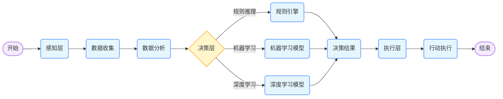

# AI Agent在企业产品生命周期管理中的应用

> 关键词：AI Agent、企业产品生命周期管理、智能制造、数字化转型、自动化决策、智能协作、数据分析

> 摘要：本文深入探讨了AI Agent在企业产品生命周期管理中的应用。首先介绍了相关背景，包括目的范围、预期读者等内容。接着阐述了AI Agent与产品生命周期管理的核心概念及联系，通过文本示意图和Mermaid流程图清晰展示其架构。详细讲解了核心算法原理，结合Python源代码进行说明，还给出了数学模型和公式并举例。通过项目实战，展示了开发环境搭建、源代码实现及解读。探讨了AI Agent在企业产品生命周期管理中的实际应用场景，推荐了相关学习资源、开发工具框架和论文著作。最后总结了未来发展趋势与挑战，给出常见问题解答和扩展阅读参考资料，旨在为企业利用AI Agent提升产品生命周期管理水平提供全面的技术指导和实践参考。

## 1. 背景介绍 
### 1.1 目的和范围
在当今竞争激烈的商业环境中，企业需要不断优化产品生命周期管理（PLM）以提高效率、降低成本、提升产品质量和创新能力。AI Agent作为一种智能实体，具有感知、决策和行动的能力，能够在PLM的各个阶段发挥重要作用。本文的目的是全面探讨AI Agent在企业PLM中的应用，包括从产品的概念设计、开发、生产、销售到售后服务的整个生命周期。范围涵盖了AI Agent的技术原理、实现方法、实际应用案例以及未来发展趋势等方面。

### 1.2 预期读者
本文预期读者包括企业的产品经理、项目经理、研发人员、生产管理人员、市场营销人员等与产品生命周期管理相关的人员，以及对人工智能和企业信息化感兴趣的技术爱好者、研究人员和学者。

### 1.3 文档结构概述
本文将按照以下结构进行组织：首先介绍AI Agent和企业产品生命周期管理的背景知识，包括术语定义和相关概念解释。然后阐述AI Agent与PLM的核心概念及联系，通过文本示意图和Mermaid流程图展示其架构。接着详细讲解AI Agent的核心算法原理，并给出Python源代码示例。随后介绍相关的数学模型和公式，并举例说明。通过项目实战展示AI Agent在PLM中的具体应用，包括开发环境搭建、源代码实现和代码解读。探讨AI Agent在PLM中的实际应用场景，推荐相关的学习资源、开发工具框架和论文著作。最后总结AI Agent在PLM中的未来发展趋势与挑战，给出常见问题解答和扩展阅读参考资料。

### 1.4 术语表
#### 1.4.1 核心术语定义
- **AI Agent（人工智能智能体）**：是一种能够感知环境、根据感知信息进行决策并采取行动的智能实体。它可以是软件程序、机器人或其他具有智能行为的系统。
- **企业产品生命周期管理（PLM）**：是一种管理企业产品从概念设计、开发、生产、销售到售后服务整个生命周期的方法和技术体系。它涵盖了产品数据管理、过程管理、协同工作等多个方面。
- **智能制造**：是一种基于新一代信息技术，贯穿于设计、生产、管理、服务等制造活动各个环节，具有信息深度自感知、智慧优化自决策、精准控制自执行等功能的先进制造过程、系统与模式的总称。
- **数字化转型**：是指企业利用数字技术对业务进行全面的改造和升级，以提高企业的竞争力和创新能力。

#### 1.4.2 相关概念解释
- **智能协作**：AI Agent之间或AI Agent与人类之间通过信息共享和协同工作，实现更高效的任务执行和问题解决。
- **自动化决策**：AI Agent根据预设的规则和算法，自动对环境信息进行分析和判断，做出决策并采取相应的行动。
- **数据分析**：是指对大量的数据进行收集、整理、分析和解释，以发现数据中的规律和价值，为决策提供支持。

#### 1.4.3 缩略词列表
- **PLM**：Product Lifecycle Management（企业产品生命周期管理）
- **AI**：Artificial Intelligence（人工智能）
- **CAD**：Computer-Aided Design（计算机辅助设计）
- **CAM**：Computer-Aided Manufacturing（计算机辅助制造）
- **ERP**：Enterprise Resource Planning（企业资源计划）

## 2. 核心概念与联系 
### 核心概念原理
AI Agent是人工智能领域的一个重要概念，它基于感知、决策和行动的循环机制来实现智能行为。感知模块负责收集环境信息，决策模块根据感知信息和预设的目标、规则进行推理和决策，行动模块则根据决策结果采取相应的行动。在企业产品生命周期管理中，AI Agent可以作为一个智能助手，帮助企业更好地管理产品的各个阶段。

企业产品生命周期管理是一个复杂的过程，涉及到多个部门和环节。它的核心是对产品数据和过程的管理，通过整合各种信息系统和工具，实现产品信息的共享和协同工作。PLM的主要阶段包括产品规划、设计、开发、生产、销售和售后服务。

### 架构的文本示意图
AI Agent在企业产品生命周期管理中的架构可以分为三个层次：感知层、决策层和执行层。

感知层：通过各种传感器和数据接口，收集产品生命周期各个阶段的信息，包括市场需求、设计数据、生产数据、销售数据和客户反馈等。

决策层：AI Agent根据感知层收集的信息，进行数据分析和挖掘，利用机器学习、深度学习等算法进行决策。决策层可以包括多个AI Agent，它们可以协同工作，共同完成复杂的决策任务。

执行层：根据决策层的决策结果，AI Agent采取相应的行动，如调整设计方案、优化生产计划、改进营销策略等。执行层可以与企业的各种信息系统和生产设备进行集成，实现自动化控制和执行。

### Mermaid流程图


## 3. 核心算法原理 & 具体操作步骤 
### 核心算法原理
AI Agent在企业产品生命周期管理中常用的算法包括规则推理、机器学习和深度学习等。

#### 规则推理
规则推理是一种基于规则的专家系统，它根据预设的规则和事实进行推理和决策。规则推理的基本原理是将领域知识表示为规则的形式，当输入的事实与规则的前提条件匹配时，就可以得出相应的结论。

以下是一个简单的规则推理示例：
```python
# 定义规则
rules = [
    {
        "condition": lambda x: x["price"] > 100 and x["quantity"] > 10,
        "action": "给予10%的折扣"
    },
    {
        "condition": lambda x: x["price"] > 50 and x["quantity"] > 5,
        "action": "给予5%的折扣"
    }
]

# 定义事实
fact = {
    "price": 120,
    "quantity": 15
}

# 规则推理
for rule in rules:
    if rule["condition"](fact):
        print(rule["action"])
        break
```

#### 机器学习
机器学习是一种让计算机通过数据学习模式和规律的方法。在企业产品生命周期管理中，机器学习可以用于预测市场需求、优化生产计划、评估产品质量等。常见的机器学习算法包括线性回归、逻辑回归、决策树、支持向量机等。

以下是一个简单的线性回归示例：
```python
import numpy as np
from sklearn.linear_model import LinearRegression

# 生成数据
X = np.array([[1], [2], [3], [4], [5]])
y = np.array([2, 4, 6, 8, 10])

# 创建线性回归模型
model = LinearRegression()

# 训练模型
model.fit(X, y)

# 预测
new_X = np.array([[6]])
prediction = model.predict(new_X)
print("预测结果:", prediction)
```

#### 深度学习
深度学习是机器学习的一个分支，它通过构建深度神经网络来学习数据的复杂模式和特征。在企业产品生命周期管理中，深度学习可以用于图像识别、自然语言处理、语音识别等。常见的深度学习模型包括卷积神经网络（CNN）、循环神经网络（RNN）、长短时记忆网络（LSTM）等。

以下是一个简单的卷积神经网络示例：
```python
import tensorflow as tf
from tensorflow.keras import layers, models

# 构建卷积神经网络模型
model = models.Sequential()
model.add(layers.Conv2D(32, (3, 3), activation='relu', input_shape=(32, 32, 3)))
model.add(layers.MaxPooling2D((2, 2)))
model.add(layers.Conv2D(64, (3, 3), activation='relu'))
model.add(layers.MaxPooling2D((2, 2)))
model.add(layers.Conv2D(64, (3, 3), activation='relu'))
model.add(layers.Flatten())
model.add(layers.Dense(64, activation='relu'))
model.add(layers.Dense(10))

# 编译模型
model.compile(optimizer='adam',
              loss=tf.keras.losses.SparseCategoricalCrossentropy(from_logits=True),
              metrics=['accuracy'])

# 打印模型结构
model.summary()
```

### 具体操作步骤
1. **数据收集**：收集产品生命周期各个阶段的相关数据，包括市场数据、设计数据、生产数据、销售数据和客户反馈等。
2. **数据预处理**：对收集到的数据进行清洗、转换和归一化等预处理操作，以提高数据的质量和可用性。
3. **模型选择和训练**：根据具体的应用场景和任务需求，选择合适的算法和模型，并使用预处理后的数据进行训练。
4. **模型评估和优化**：使用测试数据对训练好的模型进行评估，根据评估结果对模型进行优化和调整。
5. **模型部署和应用**：将优化后的模型部署到实际的生产环境中，实现AI Agent的智能决策和行动执行。

## 4. 数学模型和公式 & 详细讲解 & 举例说明 
### 线性回归数学模型和公式
线性回归是一种用于建立自变量和因变量之间线性关系的统计模型。其数学模型可以表示为：
$$y = \beta_0 + \beta_1x_1 + \beta_2x_2 + \cdots + \beta_nx_n + \epsilon$$
其中，$y$ 是因变量，$x_1, x_2, \cdots, x_n$ 是自变量，$\beta_0, \beta_1, \beta_2, \cdots, \beta_n$ 是回归系数，$\epsilon$ 是误差项。

线性回归的目标是找到一组回归系数 $\beta_0, \beta_1, \beta_2, \cdots, \beta_n$，使得预测值 $\hat{y}$ 与真实值 $y$ 之间的误差最小。常用的误差度量方法是均方误差（MSE）：
$$MSE = \frac{1}{m}\sum_{i=1}^{m}(y_i - \hat{y}_i)^2$$
其中，$m$ 是样本数量，$y_i$ 是第 $i$ 个样本的真实值，$\hat{y}_i$ 是第 $i$ 个样本的预测值。

通过最小化均方误差，可以得到回归系数的最优解。在简单线性回归（只有一个自变量）的情况下，回归系数的计算公式为：
$$\beta_1 = \frac{\sum_{i=1}^{m}(x_i - \bar{x})(y_i - \bar{y})}{\sum_{i=1}^{m}(x_i - \bar{x})^2}$$
$$\beta_0 = \bar{y} - \beta_1\bar{x}$$
其中，$\bar{x}$ 和 $\bar{y}$ 分别是自变量和因变量的均值。

### 举例说明
假设我们有一组数据，包含产品的价格 $x$ 和销售量 $y$，如下表所示：

| 价格 ($x$) | 销售量 ($y$) |
| --- | --- |
| 10 | 20 |
| 20 | 40 |
| 30 | 60 |
| 40 | 80 |
| 50 | 100 |

我们可以使用线性回归来建立价格和销售量之间的关系。首先，计算均值：
$$\bar{x} = \frac{10 + 20 + 30 + 40 + 50}{5} = 30$$
$$\bar{y} = \frac{20 + 40 + 60 + 80 + 100}{5} = 60$$

然后，计算回归系数 $\beta_1$：
$$\beta_1 = \frac{(10 - 30)(20 - 60) + (20 - 30)(40 - 60) + (30 - 30)(60 - 60) + (40 - 30)(80 - 60) + (50 - 30)(100 - 60)}{(10 - 30)^2 + (20 - 30)^2 + (30 - 30)^2 + (40 - 30)^2 + (50 - 30)^2} = 2$$

最后，计算回归系数 $\beta_0$：
$$\beta_0 = 60 - 2 \times 30 = 0$$

因此，线性回归模型为 $y = 2x$。这意味着产品的价格每增加 1 单位，销售量将增加 2 单位。

### 逻辑回归数学模型和公式
逻辑回归是一种用于分类问题的统计模型，它通过逻辑函数将线性回归的输出映射到概率值。逻辑回归的数学模型可以表示为：
$$P(y = 1|x) = \frac{1}{1 + e^{-z}}$$
其中，$P(y = 1|x)$ 是给定自变量 $x$ 时，因变量 $y$ 取值为 1 的概率，$z = \beta_0 + \beta_1x_1 + \beta_2x_2 + \cdots + \beta_nx_n$ 是线性回归的输出。

逻辑回归的目标是找到一组回归系数 $\beta_0, \beta_1, \beta_2, \cdots, \beta_n$，使得模型对训练数据的似然函数最大。常用的优化方法是梯度下降法。

### 举例说明
假设我们有一个二分类问题，根据产品的特征 $x_1$ 和 $x_2$ 预测产品是否畅销（$y = 1$ 表示畅销，$y = 0$ 表示不畅销）。我们可以使用逻辑回归来建立模型。

首先，定义逻辑回归模型：
```python
import numpy as np

def sigmoid(z):
    return 1 / (1 + np.exp(-z))

def logistic_regression(X, y, learning_rate, num_iterations):
    m, n = X.shape
    theta = np.zeros((n, 1))
    
    for iteration in range(num_iterations):
        z = np.dot(X, theta)
        h = sigmoid(z)
        gradient = np.dot(X.T, (h - y)) / m
        theta = theta - learning_rate * gradient
    
    return theta
```

然后，生成一些示例数据并进行训练：
```python
# 生成示例数据
X = np.array([[1, 2], [2, 3], [3, 4], [4, 5]])
y = np.array([[0], [0], [1], [1]])

# 训练逻辑回归模型
learning_rate = 0.01
num_iterations = 1000
theta = logistic_regression(X, y, learning_rate, num_iterations)

print("回归系数:", theta)
```

## 5. 项目实战：代码实际案例和详细解释说明 
### 5.1  开发环境搭建
#### 硬件环境
- **服务器**：建议使用具有较高性能的服务器，如Intel Xeon处理器、16GB以上内存、500GB以上硬盘空间。
- **存储设备**：可以使用磁盘阵列或分布式存储系统，以满足数据存储和处理的需求。

#### 软件环境
- **操作系统**：推荐使用Linux系统，如Ubuntu、CentOS等。
- **编程语言**：Python 3.x，因为Python具有丰富的机器学习和深度学习库。
- **开发工具**：可以使用Jupyter Notebook、PyCharm等开发工具。
- **数据库**：可以使用MySQL、MongoDB等数据库来存储产品数据和模型参数。

#### 安装依赖库
```bash
pip install numpy pandas scikit-learn tensorflow keras
```

### 5.2  源代码详细实现和代码解读
#### 需求预测模型
以下是一个基于线性回归的产品需求预测模型的示例代码：
```python
import numpy as np
import pandas as pd
from sklearn.model_selection import train_test_split
from sklearn.linear_model import LinearRegression
from sklearn.metrics import mean_squared_error

# 加载数据
data = pd.read_csv('product_demand.csv')

# 提取特征和目标变量
X = data.drop('demand', axis=1)
y = data['demand']

# 划分训练集和测试集
X_train, X_test, y_train, y_test = train_test_split(X, y, test_size=0.2, random_state=42)

# 创建线性回归模型
model = LinearRegression()

# 训练模型
model.fit(X_train, y_train)

# 预测
y_pred = model.predict(X_test)

# 评估模型
mse = mean_squared_error(y_test, y_pred)
print("均方误差:", mse)
```

**代码解读**：
1. **数据加载**：使用 `pandas` 库的 `read_csv` 函数加载产品需求数据。
2. **特征提取**：将数据集中除了 `demand` 列以外的列作为特征，`demand` 列作为目标变量。
3. **数据集划分**：使用 `train_test_split` 函数将数据集划分为训练集和测试集，测试集占比为 20%。
4. **模型创建和训练**：创建线性回归模型，并使用训练集数据进行训练。
5. **预测和评估**：使用训练好的模型对测试集数据进行预测，并计算均方误差来评估模型的性能。

#### 质量检测模型
以下是一个基于卷积神经网络的产品质量检测模型的示例代码：
```python
import tensorflow as tf
from tensorflow.keras import layers, models
from tensorflow.keras.preprocessing.image import ImageDataGenerator

# 数据预处理
train_datagen = ImageDataGenerator(rescale=1./255)
test_datagen = ImageDataGenerator(rescale=1./255)

train_generator = train_datagen.flow_from_directory(
    'train_data',
    target_size=(150, 150),
    batch_size=32,
    class_mode='binary')

test_generator = test_datagen.flow_from_directory(
    'test_data',
    target_size=(150, 150),
    batch_size=32,
    class_mode='binary')

# 构建卷积神经网络模型
model = models.Sequential()
model.add(layers.Conv2D(32, (3, 3), activation='relu', input_shape=(150, 150, 3)))
model.add(layers.MaxPooling2D((2, 2)))
model.add(layers.Conv2D(64, (3, 3), activation='relu'))
model.add(layers.MaxPooling2D((2, 2)))
model.add(layers.Conv2D(128, (3, 3), activation='relu'))
model.add(layers.MaxPooling2D((2, 2)))
model.add(layers.Flatten())
model.add(layers.Dense(128, activation='relu'))
model.add(layers.Dense(1, activation='sigmoid'))

# 编译模型
model.compile(optimizer='adam',
              loss='binary_crossentropy',
              metrics=['accuracy'])

# 训练模型
model.fit(
    train_generator,
    steps_per_epoch=train_generator.samples // train_generator.batch_size,
    epochs=10,
    validation_data=test_generator,
    validation_steps=test_generator.samples // test_generator.batch_size)

# 评估模型
test_loss, test_acc = model.evaluate(test_generator)
print("测试集准确率:", test_acc)
```

**代码解读**：
1. **数据预处理**：使用 `ImageDataGenerator` 对图像数据进行预处理，包括归一化操作。
2. **数据加载**：使用 `flow_from_directory` 函数从指定目录加载训练集和测试集图像数据。
3. **模型构建**：构建一个卷积神经网络模型，包括卷积层、池化层、全连接层等。
4. **模型编译**：使用 `adam` 优化器、`binary_crossentropy` 损失函数和 `accuracy` 指标编译模型。
5. **模型训练**：使用训练集数据对模型进行训练，并在验证集上进行验证。
6. **模型评估**：使用测试集数据评估模型的准确率。

### 5.3  代码解读与分析
#### 需求预测模型分析
线性回归模型是一种简单而有效的预测模型，适用于具有线性关系的数据集。在产品需求预测中，如果产品的需求与某些特征（如价格、促销活动等）存在线性关系，那么线性回归模型可以很好地进行预测。然而，线性回归模型也有其局限性，例如它无法处理非线性关系的数据。

#### 质量检测模型分析
卷积神经网络模型在图像识别和分类任务中表现出色，因为它能够自动提取图像的特征。在产品质量检测中，通过训练卷积神经网络模型，可以对产品的图像进行分类，判断产品是否合格。但是，卷积神经网络模型的训练需要大量的图像数据和计算资源，并且模型的解释性较差。

## 6. 实际应用场景 
### 产品规划阶段
- **市场需求预测**：AI Agent可以收集和分析市场数据，包括历史销售数据、竞争对手数据、消费者趋势等，使用机器学习算法预测市场需求，帮助企业制定合理的产品规划和生产计划。
- **产品定位和差异化**：通过对市场数据和消费者反馈的分析，AI Agent可以帮助企业确定产品的定位和差异化竞争优势，从而提高产品的市场竞争力。

### 产品设计阶段
- **设计优化**：AI Agent可以对产品的设计方案进行模拟和分析，评估设计的可行性和性能，提出优化建议，帮助企业提高产品的设计质量和效率。
- **创新设计**：AI Agent可以通过对大量的设计案例和知识的学习，提供创新的设计思路和方案，激发企业的创新能力。

### 产品开发阶段
- **项目管理**：AI Agent可以协助项目经理进行项目进度跟踪、资源分配和风险管理，及时发现和解决项目中的问题，确保项目按时、按质量要求完成。
- **代码审查和测试**：AI Agent可以对开发人员的代码进行审查，发现代码中的潜在问题和漏洞，同时可以自动化执行测试用例，提高软件的质量和稳定性。

### 产品生产阶段
- **生产计划优化**：AI Agent可以根据市场需求预测、库存水平和生产能力等因素，优化生产计划，提高生产效率，降低生产成本。
- **质量控制**：AI Agent可以通过对生产过程中的数据进行实时监测和分析，及时发现质量问题并采取措施进行纠正，确保产品质量符合标准。

### 产品销售阶段
- **营销策略制定**：AI Agent可以分析消费者的购买行为和偏好，制定个性化的营销策略，提高营销效果和客户满意度。
- **客户服务**：AI Agent可以作为智能客服，回答客户的咨询和问题，提供实时的客户服务，提高客户的满意度和忠诚度。

### 产品售后服务阶段
- **故障诊断和修复**：AI Agent可以通过对产品的运行数据进行分析，诊断产品的故障原因，并提供相应的修复建议，帮助企业快速解决客户的问题。
- **产品改进和升级**：AI Agent可以收集客户的反馈和建议，分析产品的使用情况和性能，为产品的改进和升级提供依据。

## 7. 工具和资源推荐
### 7.1 学习资源推荐
#### 7.1.1 书籍推荐
- 《Python机器学习》：介绍了Python在机器学习领域的应用，包括各种机器学习算法的原理和实现。
- 《深度学习》：由深度学习领域的三位权威专家编写，系统地介绍了深度学习的理论和实践。
- 《人工智能：一种现代的方法》：是人工智能领域的经典教材，全面介绍了人工智能的各个方面。

#### 7.1.2 在线课程
- Coursera上的“机器学习”课程：由斯坦福大学的Andrew Ng教授授课，是机器学习领域的经典课程。
- edX上的“深度学习”课程：由麻省理工学院等机构提供，深入介绍了深度学习的理论和实践。
- 阿里云天池平台的人工智能课程：提供了丰富的人工智能实践案例和教学资源。

#### 7.1.3 技术博客和网站
- Medium：是一个技术博客平台，有很多关于人工智能和机器学习的优质文章。
- Towards Data Science：专注于数据科学和机器学习领域的技术博客，提供了很多实用的技术教程和案例分析。
- 开源中国：是国内知名的开源技术社区，有很多关于人工智能和企业信息化的技术文章和讨论。

### 7.2 开发工具框架推荐
#### 7.2.1 IDE和编辑器
- PyCharm：是一款专业的Python集成开发环境，提供了丰富的代码编辑、调试和项目管理功能。
- Jupyter Notebook：是一个交互式的开发环境，适合进行数据探索和模型实验。
- Visual Studio Code：是一款轻量级的代码编辑器，支持多种编程语言和插件扩展。

#### 7.2.2 调试和性能分析工具
- TensorBoard：是TensorFlow的可视化工具，可以帮助用户可视化模型的训练过程和性能指标。
- PyTorch Profiler：是PyTorch的性能分析工具，可以帮助用户分析模型的性能瓶颈和优化方向。
- cProfile：是Python的内置性能分析工具，可以帮助用户分析Python代码的性能。

#### 7.2.3 相关框架和库
- TensorFlow：是Google开发的深度学习框架，提供了丰富的深度学习模型和工具。
- PyTorch：是Facebook开发的深度学习框架，具有动态图和易于使用的特点。
- Scikit-learn：是Python的机器学习库，提供了各种机器学习算法和工具。

### 7.3 相关论文著作推荐
#### 7.3.1 经典论文
- “Gradient-Based Learning Applied to Document Recognition”：由Yann LeCun等人发表，介绍了卷积神经网络的经典应用——手写数字识别。
- “Long Short-Term Memory”：由Sepp Hochreiter和Jürgen Schmidhuber发表，提出了长短时记忆网络（LSTM）。
- “Attention Is All You Need”：由Vaswani等人发表，提出了Transformer模型，在自然语言处理领域取得了巨大成功。

#### 7.3.2 最新研究成果
- 关注顶级学术会议，如NeurIPS（神经信息处理系统大会）、ICML（国际机器学习会议）、CVPR（计算机视觉与模式识别会议）等，了解人工智能领域的最新研究成果。
- 查阅学术期刊，如Journal of Artificial Intelligence Research（JAIR）、Artificial Intelligence等，获取高质量的学术论文。

#### 7.3.3 应用案例分析
- 关注行业报告和案例分析，如Gartner的技术成熟度曲线、Forrester的市场研究报告等，了解AI Agent在企业产品生命周期管理中的实际应用案例和最佳实践。

## 8. 总结：未来发展趋势与挑战
### 未来发展趋势
- **智能化程度不断提高**：随着人工智能技术的不断发展，AI Agent的智能化程度将不断提高，能够更好地理解和处理复杂的信息，做出更加准确和智能的决策。
- **与物联网的深度融合**：AI Agent将与物联网技术深度融合，实现对产品生命周期各个环节的实时监测和控制，提高生产效率和产品质量。
- **跨领域协同合作**：AI Agent将在不同领域之间实现协同合作，如与供应链管理、客户关系管理等系统的集成，实现企业的全面数字化转型。
- **个性化服务**：AI Agent将能够根据用户的个性化需求和偏好，提供更加个性化的产品和服务，提高客户满意度和忠诚度。

### 挑战
- **数据隐私和安全**：AI Agent的应用需要大量的数据支持，如何保护数据的隐私和安全是一个重要的挑战。企业需要采取有效的数据加密、访问控制等措施，确保数据的安全。
- **算法可解释性**：一些复杂的人工智能算法（如深度学习）的可解释性较差，难以理解模型的决策过程和依据。这在一些关键领域（如医疗、金融等）可能会带来风险，需要提高算法的可解释性。
- **人才短缺**：AI Agent的开发和应用需要具备人工智能、机器学习、软件工程等多方面知识的复合型人才，目前这类人才相对短缺，企业需要加强人才培养和引进。
- **伦理和法律问题**：AI Agent的应用可能会带来一些伦理和法律问题，如人工智能的责任认定、算法歧视等。需要建立相应的伦理和法律框架，规范AI Agent的应用。

## 9. 附录：常见问题与解答
### 1. AI Agent在企业产品生命周期管理中的应用是否需要大量的资金投入？
AI Agent的应用需要一定的资金投入，包括硬件设备的采购、软件系统的开发和维护、人才的培养和引进等。但是，随着技术的不断发展和成本的降低，AI Agent的应用成本也在逐渐降低。同时，AI Agent的应用可以为企业带来显著的效益，如提高生产效率、降低成本、提升产品质量等，从长远来看，投资回报率是比较高的。

### 2. AI Agent是否能够完全替代人类在产品生命周期管理中的作用？
目前，AI Agent还不能完全替代人类在产品生命周期管理中的作用。虽然AI Agent具有强大的数据分析和决策能力，但是在一些需要人类的创造力、判断力和情感交流的环节，如产品的创新设计、客户关系管理等，人类仍然发挥着重要的作用。AI Agent更多的是作为人类的智能助手，帮助人类更好地完成工作。

### 3. 如何确保AI Agent的决策是准确和可靠的？
为了确保AI Agent的决策准确和可靠，需要从以下几个方面入手：
- **数据质量**：确保输入的数据准确、完整、可靠，对数据进行清洗和预处理，去除噪声和异常值。
- **模型选择和训练**：选择合适的算法和模型，并使用大量的高质量数据进行训练，对模型进行评估和优化，确保模型的性能和泛化能力。
- **监控和反馈**：对AI Agent的决策过程和结果进行实时监控，及时发现和纠正错误，根据反馈信息对模型进行调整和改进。

### 4. AI Agent的应用是否会导致企业员工失业？
AI Agent的应用可能会对企业的人员结构产生一定的影响，一些重复性、规律性的工作可能会被AI Agent所取代。但是，AI Agent的应用也会创造新的就业机会，如AI Agent的开发、维护和管理等工作。同时，企业可以通过培训和转岗等方式，帮助员工适应新的工作要求，实现员工的职业发展。

## 10. 扩展阅读 & 参考资料
- 《人工智能时代的企业数字化转型》
- 《智能制造：从理念到实践》
- 《产品生命周期管理：原理、方法与系统》
- [TensorFlow官方文档](https://www.tensorflow.org/)
- [PyTorch官方文档](https://pytorch.org/)
- [Scikit-learn官方文档](https://scikit-learn.org/)

作者：AI天才研究院/AI Genius Institute & 禅与计算机程序设计艺术 /Zen And The Art of Computer Programming