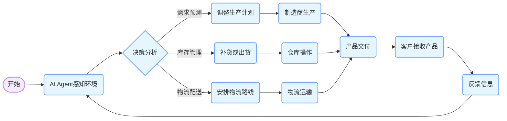

# AI Agent在企业供应链管理中的应用

> 关键词：AI Agent、企业供应链管理、智能决策、自动化流程、数据驱动

> 摘要：本文深入探讨了AI Agent在企业供应链管理中的应用。首先介绍了相关背景，包括目的、预期读者等内容。接着阐述了AI Agent和企业供应链管理的核心概念及联系，通过示意图和流程图直观呈现。详细讲解了核心算法原理和具体操作步骤，并给出Python源代码示例。分析了相关数学模型和公式，辅以举例说明。通过项目实战展示了代码实现和解读。探讨了AI Agent在企业供应链管理中的实际应用场景，推荐了学习资源、开发工具框架和相关论文著作。最后总结了未来发展趋势与挑战，提供常见问题解答和扩展阅读参考资料，旨在为企业利用AI Agent优化供应链管理提供全面的技术指导。

## 1. 背景介绍 
### 1.1 目的和范围
随着全球经济的快速发展和市场竞争的日益激烈，企业供应链管理面临着越来越多的挑战，如需求预测不准确、库存管理不善、物流配送效率低下等。AI Agent作为一种具有自主决策和学习能力的智能体，为解决这些问题提供了新的思路和方法。本文的目的是深入探讨AI Agent在企业供应链管理中的应用，涵盖从核心概念到实际应用的各个方面，包括算法原理、数学模型、项目实战等，旨在为企业和相关从业者提供全面的技术参考和实践指导。

### 1.2 预期读者
本文预期读者包括企业供应链管理人员、IT技术人员、供应链管理领域的研究人员以及对AI技术在供应链管理中应用感兴趣的爱好者。对于供应链管理人员，本文可以帮助他们了解如何利用AI Agent优化供应链流程和决策；对于IT技术人员，本文提供了具体的算法和代码实现，有助于他们进行相关系统的开发和优化；对于研究人员，本文可以为他们的研究提供新的视角和思路；对于爱好者，本文可以让他们对AI Agent在供应链管理中的应用有一个初步的认识和了解。

### 1.3 文档结构概述
本文共分为十个部分。第一部分是背景介绍，包括目的、预期读者、文档结构概述和术语表；第二部分阐述核心概念与联系，通过文本示意图和Mermaid流程图展示AI Agent与企业供应链管理的关系；第三部分讲解核心算法原理和具体操作步骤，使用Python源代码详细说明；第四部分分析数学模型和公式，并举例说明；第五部分进行项目实战，包括开发环境搭建、源代码实现和代码解读；第六部分探讨实际应用场景；第七部分推荐工具和资源，包括学习资源、开发工具框架和相关论文著作；第八部分总结未来发展趋势与挑战；第九部分是附录，提供常见问题与解答；第十部分给出扩展阅读和参考资料。

### 1.4 术语表
#### 1.4.1 核心术语定义
- **AI Agent（人工智能智能体）**：是一种能够感知环境、自主决策并采取行动以实现特定目标的智能实体。它可以根据环境的变化动态调整自己的行为，具有一定的学习和适应能力。
- **企业供应链管理**：是对企业供应链中的物流、信息流和资金流进行全面规划、组织、协调和控制的过程，旨在提高供应链的效率和效益，满足客户需求。
- **需求预测**：是指通过对历史数据和市场信息的分析，预测未来一段时间内客户对产品或服务的需求数量和时间。
- **库存管理**：是对企业库存的数量、种类、位置等进行管理和控制的过程，以确保企业在满足客户需求的前提下，最小化库存成本。
- **物流配送**：是指将产品从生产地运输到客户手中的过程，包括运输、仓储、装卸、包装等环节。

#### 1.4.2 相关概念解释
- **机器学习**：是一门多领域交叉学科，涉及概率论、统计学、逼近论、凸分析、算法复杂度理论等多门学科。它专门研究计算机怎样模拟或实现人类的学习行为，以获取新的知识或技能，重新组织已有的知识结构使之不断改善自身的性能。
- **深度学习**：是机器学习的一个分支领域，它是一种基于对数据进行表征学习的方法。深度学习通过构建具有很多层的神经网络模型，自动从数据中学习特征和模式，从而实现对数据的分类、预测等任务。
- **强化学习**：是一种通过智能体与环境进行交互，以最大化累积奖励为目标的机器学习方法。智能体在环境中采取行动，环境会根据智能体的行动给予相应的奖励或惩罚，智能体通过不断学习和调整自己的策略，以获得最大的累积奖励。

#### 1.4.3 缩略词列表
- **AI**：Artificial Intelligence，人工智能
- **ML**：Machine Learning，机器学习
- **DL**：Deep Learning，深度学习
- **RL**：Reinforcement Learning，强化学习
- **SCM**：Supply Chain Management，供应链管理

## 2. 核心概念与联系 
### 核心概念原理
#### AI Agent原理
AI Agent是一种能够自主感知环境、做出决策并执行相应行动的智能实体。它通常由感知模块、决策模块和执行模块组成。感知模块负责收集环境中的信息，如市场需求、库存水平、物流状态等；决策模块根据感知到的信息，运用预设的算法或模型进行分析和推理，做出最优决策；执行模块则根据决策结果，采取相应的行动，如调整生产计划、补货、安排物流配送等。AI Agent可以通过学习和适应不断优化自己的决策和行为，以更好地实现目标。

#### 企业供应链管理原理
企业供应链管理是一个复杂的系统工程，涉及到供应商、制造商、分销商、零售商和客户等多个环节。其核心原理是通过对物流、信息流和资金流的有效整合和协调，实现供应链的高效运作和价值最大化。具体来说，企业需要通过需求预测来合理安排生产和库存，通过优化物流配送来降低成本和提高服务质量，通过与供应商和合作伙伴的紧密合作来确保原材料的供应和产品的质量。

### 架构的文本示意图
```plaintext
企业供应链管理系统
|
|-- AI Agent
|   |-- 感知模块
|       |-- 市场需求传感器
|       |-- 库存水平传感器
|       |-- 物流状态传感器
|   |-- 决策模块
|       |-- 需求预测模型
|       |-- 库存优化模型
|       |-- 物流调度模型
|   |-- 执行模块
|       |-- 生产计划调整器
|       |-- 补货控制器
|       |-- 物流配送安排器
|
|-- 供应商
|-- 制造商
|-- 分销商
|-- 零售商
|-- 客户
```

### Mermaid流程图


## 3. 核心算法原理 & 具体操作步骤 
### 需求预测算法 - 时间序列分析
时间序列分析是一种常用的需求预测方法，它基于历史数据的时间顺序来预测未来的需求。下面是一个使用Python实现的简单的时间序列分析算法，采用移动平均法。

```python
import numpy as np

def moving_average(history_data, window_size):
    """
    移动平均法进行需求预测
    :param history_data: 历史需求数据
    :param window_size: 窗口大小
    :return: 预测值
    """
    if len(history_data) < window_size:
        return np.mean(history_data)
    return np.mean(history_data[-window_size:])

# 示例数据
history_demand = [10, 12, 15, 13, 16, 18, 20]
window = 3
predicted_demand = moving_average(history_demand, window)
print(f"预测的需求值为: {predicted_demand}")
```

### 具体操作步骤
1. **数据收集**：收集历史需求数据，确保数据的准确性和完整性。
2. **数据预处理**：对收集到的数据进行清洗、归一化等处理，以提高算法的准确性。
3. **选择算法**：根据数据的特点和需求，选择合适的预测算法，如移动平均法、指数平滑法、ARIMA模型等。
4. **训练模型**：使用历史数据对选择的算法进行训练，调整模型的参数。
5. **预测需求**：使用训练好的模型对未来的需求进行预测。
6. **评估和优化**：对预测结果进行评估，根据评估结果对模型进行优化和调整。

### 库存优化算法 - 经济订货量模型
经济订货量（EOQ）模型是一种经典的库存优化算法，它通过平衡采购成本和库存持有成本，确定最优的订货量。以下是Python实现代码：

```python
def economic_order_quantity(demand_rate, ordering_cost, holding_cost):
    """
    经济订货量模型
    :param demand_rate: 年需求率
    :param ordering_cost: 每次订货成本
    :param holding_cost: 单位库存持有成本
    :return: 最优订货量
    """
    return np.sqrt((2 * demand_rate * ordering_cost) / holding_cost)

# 示例数据
annual_demand = 1000
order_cost = 50
holding_cost = 2
eoq = economic_order_quantity(annual_demand, order_cost, holding_cost)
print(f"最优订货量为: {eoq}")
```

### 具体操作步骤
1. **确定参数**：确定年需求率、每次订货成本和单位库存持有成本等参数。
2. **计算最优订货量**：使用经济订货量模型计算最优的订货量。
3. **制定订货策略**：根据最优订货量制定订货策略，如订货点、订货批量等。
4. **监控和调整**：实时监控库存水平，根据实际情况对订货策略进行调整。

## 4. 数学模型和公式 & 详细讲解 & 举例说明 
### 需求预测 - 移动平均法
#### 数学模型和公式
移动平均法的基本公式为：
$$
\hat{y}_{t+1}=\frac{1}{n}\sum_{i=t - n + 1}^{t}y_{i}
$$
其中，$\hat{y}_{t+1}$ 是 $t + 1$ 时刻的预测值，$n$ 是窗口大小，$y_{i}$ 是 $i$ 时刻的实际值。

#### 详细讲解
移动平均法的核心思想是通过计算过去一段时间内数据的平均值来预测未来的值。窗口大小 $n$ 的选择非常重要，较小的窗口大小可以更快地反映数据的变化，但容易受到噪声的影响；较大的窗口大小可以平滑数据，但对数据变化的响应较慢。

#### 举例说明
假设我们有过去7天的产品需求数据：$[10, 12, 15, 13, 16, 18, 20]$，选择窗口大小 $n = 3$。则第8天的预测需求值为：
$$
\hat{y}_{8}=\frac{16 + 18 + 20}{3}=\frac{54}{3}=18
$$

### 库存优化 - 经济订货量模型
#### 数学模型和公式
经济订货量模型的公式为：
$$
EOQ=\sqrt{\frac{2DS}{H}}
$$
其中，$EOQ$ 是经济订货量，$D$ 是年需求率，$S$ 是每次订货成本，$H$ 是单位库存持有成本。

#### 详细讲解
经济订货量模型的目标是最小化总库存成本，总库存成本包括采购成本和库存持有成本。当订货量增加时，采购成本降低，但库存持有成本增加；当订货量减少时，库存持有成本降低，但采购成本增加。经济订货量就是使这两种成本之和最小的订货量。

#### 举例说明
假设某产品的年需求率 $D = 1000$ 件，每次订货成本 $S = 50$ 元，单位库存持有成本 $H = 2$ 元/件。则经济订货量为：
$$
EOQ=\sqrt{\frac{2\times1000\times50}{2}}=\sqrt{50000}\approx223.6
$$
即每次订货量约为224件时，总库存成本最小。

## 5. 项目实战：代码实际案例和详细解释说明 
### 5.1  开发环境搭建
#### 操作系统
建议使用Linux系统，如Ubuntu 20.04，也可以使用Windows 10或macOS。

#### Python环境
安装Python 3.7及以上版本，可以从Python官方网站（https://www.python.org/downloads/）下载安装包进行安装。

#### 依赖库安装
使用pip命令安装以下依赖库：
```bash
pip install numpy pandas matplotlib scikit-learn
```

### 5.2  源代码详细实现和代码解读
以下是一个综合的企业供应链管理模拟项目，包括需求预测、库存管理和物流配送的简单实现。

```python
import numpy as np
import pandas as pd
import matplotlib.pyplot as plt

# 需求预测 - 移动平均法
def moving_average(history_data, window_size):
    if len(history_data) < window_size:
        return np.mean(history_data)
    return np.mean(history_data[-window_size:])

# 库存管理 - 经济订货量模型
def economic_order_quantity(demand_rate, ordering_cost, holding_cost):
    return np.sqrt((2 * demand_rate * ordering_cost) / holding_cost)

# 物流配送 - 简单的路线规划（这里简化为距离最短）
def route_planning(distances):
    min_distance = np.min(distances)
    best_route_index = np.argmin(distances)
    return best_route_index, min_distance

# 模拟企业供应链管理过程
def supply_chain_simulation():
    # 初始化参数
    num_periods = 20
    window_size = 3
    annual_demand = 1000
    order_cost = 50
    holding_cost = 2
    distances = [10, 15, 20, 25]  # 假设的物流距离

    # 生成随机需求数据
    np.random.seed(42)
    demand_data = np.random.randint(80, 120, num_periods)

    # 初始化库存
    initial_inventory = 200
    inventory = initial_inventory

    # 记录数据
    demand_prediction = []
    inventory_level = []
    order_quantity = []
    route = []

    for t in range(num_periods):
        # 需求预测
        if t < window_size:
            prediction = np.mean(demand_data[:t + 1])
        else:
            prediction = moving_average(demand_data[:t], window_size)
        demand_prediction.append(prediction)

        # 库存管理
        if inventory < prediction:
            eoq = economic_order_quantity(annual_demand, order_cost, holding_cost)
            order_quantity.append(eoq)
            inventory += eoq
        else:
            order_quantity.append(0)

        # 满足需求
        inventory -= demand_data[t]
        inventory_level.append(inventory)

        # 物流配送
        best_route_index, min_distance = route_planning(distances)
        route.append(best_route_index)

    # 可视化结果
    plt.figure(figsize=(12, 8))
    plt.subplot(3, 1, 1)
    plt.plot(demand_data, label='Actual Demand')
    plt.plot(demand_prediction, label='Predicted Demand')
    plt.title('Demand Forecast')
    plt.legend()

    plt.subplot(3, 1, 2)
    plt.plot(inventory_level, label='Inventory Level')
    plt.title('Inventory Management')
    plt.legend()

    plt.subplot(3, 1, 3)
    plt.plot(route, label='Best Route Index')
    plt.title('Logistics Route Planning')
    plt.legend()

    plt.tight_layout()
    plt.show()

if __name__ == "__main__":
    supply_chain_simulation()
```

### 5.3  代码解读与分析
#### 需求预测部分
`moving_average` 函数实现了移动平均法的需求预测。在模拟过程中，根据历史需求数据和窗口大小计算预测值。

#### 库存管理部分
`economic_order_quantity` 函数实现了经济订货量模型。当库存水平低于预测需求时，计算最优订货量并进行补货。

#### 物流配送部分
`route_planning` 函数实现了简单的路线规划，选择距离最短的路线。

#### 模拟过程
`supply_chain_simulation` 函数模拟了企业供应链管理的整个过程，包括需求预测、库存管理和物流配送。通过循环模拟多个周期，记录每个周期的需求预测值、库存水平和物流路线，并使用 `matplotlib` 库进行可视化展示。

## 6. 实际应用场景 
### 需求预测与生产计划
AI Agent可以通过对历史销售数据、市场趋势、季节因素等多方面信息的分析，准确预测产品的需求。企业可以根据预测结果合理安排生产计划，避免生产过剩或不足的情况。例如，一家服装企业可以利用AI Agent预测不同款式服装在不同季节的需求，提前安排生产和采购原材料，提高生产效率和客户满意度。

### 库存管理与补货决策
AI Agent可以实时监控库存水平，根据需求预测和库存成本等因素，自动做出补货决策。通过优化库存管理，企业可以降低库存成本，提高资金周转率。例如，一家超市可以利用AI Agent根据商品的销售速度和库存水平，自动生成补货清单，确保货架上的商品充足。

### 物流配送与路线优化
AI Agent可以根据订单信息、交通状况、车辆状态等因素，优化物流配送路线，提高物流效率，降低运输成本。例如，一家快递公司可以利用AI Agent实时调整快递员的配送路线，避免交通拥堵，提高配送速度。

### 供应商管理与合作优化
AI Agent可以对供应商的交货时间、产品质量、价格等信息进行分析和评估，帮助企业选择最优的供应商，并优化与供应商的合作关系。例如，一家制造企业可以利用AI Agent对供应商进行实时监控和评估，及时发现问题并采取措施，确保原材料的稳定供应。

## 7. 工具和资源推荐
### 7.1 学习资源推荐
#### 7.1.1 书籍推荐
- 《人工智能：一种现代的方法》：全面介绍了人工智能的基本概念、算法和应用，是人工智能领域的经典教材。
- 《Python机器学习》：详细介绍了使用Python进行机器学习的方法和技术，适合初学者入门。
- 《供应链管理：战略、规划与运营》：系统阐述了供应链管理的理论和实践，对企业供应链管理有很大的指导作用。

#### 7.1.2 在线课程
- Coursera上的“人工智能基础”课程：由知名高校的教授授课，内容涵盖人工智能的各个方面。
- edX上的“Python数据科学”课程：讲解了使用Python进行数据处理和分析的方法和技巧。
- Udemy上的“供应链管理实战”课程：通过实际案例介绍了供应链管理的具体操作和优化方法。

#### 7.1.3 技术博客和网站
- Towards Data Science：是一个专注于数据科学和人工智能的技术博客，提供了大量的技术文章和案例分析。
- Kaggle：是一个数据科学竞赛平台，上面有很多关于机器学习和数据分析的优秀项目和代码。
- Supply Chain Dive：是一个专注于供应链管理的网站，提供了供应链行业的最新动态和趋势分析。

### 7.2 开发工具框架推荐
#### 7.2.1 IDE和编辑器
- PyCharm：是一款专门为Python开发设计的集成开发环境，具有代码自动补全、调试、版本控制等功能，适合专业开发人员使用。
- Jupyter Notebook：是一个交互式的开发环境，支持Python、R等多种编程语言，适合数据探索和模型实验。
- Visual Studio Code：是一款轻量级的代码编辑器，支持多种编程语言和插件扩展，具有良好的用户体验。

#### 7.2.2 调试和性能分析工具
- PDB：是Python自带的调试工具，可以帮助开发人员定位和解决代码中的问题。
- cProfile：是Python的性能分析工具，可以分析代码的运行时间和函数调用情况，帮助开发人员优化代码性能。
- TensorBoard：是TensorFlow的可视化工具，可以帮助开发人员可视化模型的训练过程和性能指标。

#### 7.2.3 相关框架和库
- NumPy：是Python的数值计算库，提供了高效的数组操作和数学函数，是机器学习和数据分析的基础库。
- Pandas：是Python的数据处理库，提供了数据结构和数据分析工具，方便对数据进行清洗、转换和分析。
- Scikit-learn：是Python的机器学习库，提供了各种机器学习算法和工具，如分类、回归、聚类等。
- TensorFlow和PyTorch：是深度学习框架，提供了构建和训练深度学习模型的工具和接口。

### 7.3 相关论文著作推荐
#### 7.3.1 经典论文
- “Artificial Intelligence for Supply Chain Management: A Systematic Literature Review”：对人工智能在供应链管理中的应用进行了系统的文献综述，分析了人工智能技术在供应链各个环节的应用现状和发展趋势。
- “Inventory Management with Machine Learning: A Review”：综述了机器学习在库存管理中的应用，介绍了各种机器学习算法在库存预测、补货决策等方面的应用方法和效果。
- “Logistics Routing Optimization Using Artificial Intelligence Techniques”：探讨了人工智能技术在物流路线优化中的应用，提出了一些基于人工智能的物流路线优化算法和模型。

#### 7.3.2 最新研究成果
- 关注顶级学术会议如NeurIPS、ICML、KDD等上关于人工智能和供应链管理的研究论文，了解最新的研究成果和技术趋势。
- 查阅知名学术期刊如《Management Science》、《Operations Research》、《European Journal of Operational Research》等上关于供应链管理和人工智能的研究文章。

#### 7.3.3 应用案例分析
- 一些企业和研究机构会发布关于AI Agent在供应链管理中应用的案例分析报告，可以通过企业官网、行业报告网站等渠道获取这些案例，学习实际应用中的经验和方法。

## 8. 总结：未来发展趋势与挑战
### 未来发展趋势
#### 智能化程度不断提高
随着人工智能技术的不断发展，AI Agent将具备更强的自主学习和决策能力，能够更加准确地感知环境变化，做出更加优化的决策。例如，AI Agent可以通过深度学习算法自动从海量数据中学习复杂的模式和规律，提高需求预测的准确性和库存管理的效率。

#### 与物联网深度融合
物联网技术可以为AI Agent提供更丰富的实时数据，如传感器收集的设备状态、物流车辆的位置和行驶速度等。AI Agent可以结合这些数据进行更精确的决策和控制，实现供应链的智能化管理。例如，通过物联网技术实时监控库存水平和物流运输状态，AI Agent可以及时调整生产计划和物流配送路线。

#### 供应链协同更加紧密
AI Agent可以促进供应链各环节之间的信息共享和协同合作，实现供应链的整体优化。例如，供应商、制造商和零售商可以通过AI Agent共享需求信息和库存信息，共同制定生产和采购计划，提高供应链的响应速度和灵活性。

### 挑战
#### 数据质量和安全问题
AI Agent的决策和学习依赖于大量的数据，数据的质量和安全性直接影响到AI Agent的性能和可靠性。企业需要解决数据收集、存储、处理和传输过程中的质量和安全问题，确保数据的准确性、完整性和保密性。

#### 技术复杂度和人才短缺
人工智能技术的应用需要具备一定的技术知识和技能，企业在实施AI Agent项目时面临技术复杂度高和人才短缺的问题。企业需要加强技术研发和人才培养，提高自身的技术能力和创新能力。

#### 法律法规和伦理问题
随着AI Agent在企业供应链管理中的广泛应用，相关的法律法规和伦理问题也日益凸显。例如，AI Agent的决策可能会对员工的就业和权益产生影响，需要制定相应的法律法规和伦理准则来规范其应用。

## 9. 附录：常见问题与解答
### 问题1：AI Agent在企业供应链管理中的应用需要多少数据？
解答：AI Agent的性能和准确性与数据的数量和质量密切相关。一般来说，数据量越大，AI Agent学习到的模式和规律就越准确。具体需要多少数据取决于应用场景和算法的复杂程度。在需求预测和库存管理等场景中，建议至少收集一年以上的历史数据。同时，要确保数据的准确性和完整性，对数据进行清洗和预处理。

### 问题2：如何评估AI Agent在企业供应链管理中的效果？
解答：可以从多个方面评估AI Agent的效果，如需求预测的准确性、库存成本的降低、物流配送效率的提高等。常用的评估指标包括均方误差（MSE）、平均绝对误差（MAE）、库存周转率、订单履行率等。通过对比使用AI Agent前后的指标变化，可以评估其在企业供应链管理中的效果。

### 问题3：AI Agent能否完全替代人工决策？
解答：目前AI Agent还不能完全替代人工决策。虽然AI Agent可以通过数据分析和模型计算做出决策，但在一些复杂的情况下，如市场突发变化、政策调整等，还需要人工的经验和判断力。因此，在企业供应链管理中，AI Agent通常作为辅助工具，与人工决策相结合，共同提高决策的质量和效率。

### 问题4：实施AI Agent项目需要多长时间？
解答：实施AI Agent项目的时间取决于项目的规模和复杂度。一般来说，小型项目可能需要几个月的时间，包括需求分析、数据准备、模型开发和测试等阶段；大型项目可能需要一年以上的时间，还需要考虑系统集成和员工培训等方面的工作。

## 10. 扩展阅读 & 参考资料
### 扩展阅读
- 《智能供应链：从数字化转型到智能化升级》：深入探讨了智能供应链的发展趋势和实践案例，对AI Agent在供应链管理中的应用有更深入的介绍。
- 《大数据与供应链管理》：介绍了大数据技术在供应链管理中的应用，包括数据挖掘、分析和决策支持等方面。
- 《人工智能时代的供应链创新》：探讨了人工智能技术对供应链创新的影响和挑战，提出了一些应对策略和建议。

### 参考资料
- 人工智能相关的学术论文和研究报告，可以通过学术数据库如IEEE Xplore、ACM Digital Library等获取。
- 企业供应链管理的行业报告和案例分析，可以通过咨询公司、行业协会等渠道获取。
- 开源代码库如GitHub上有很多关于AI Agent和供应链管理的开源项目，可以参考学习。

作者：AI天才研究院/AI Genius Institute & 禅与计算机程序设计艺术 /Zen And The Art of Computer Programming