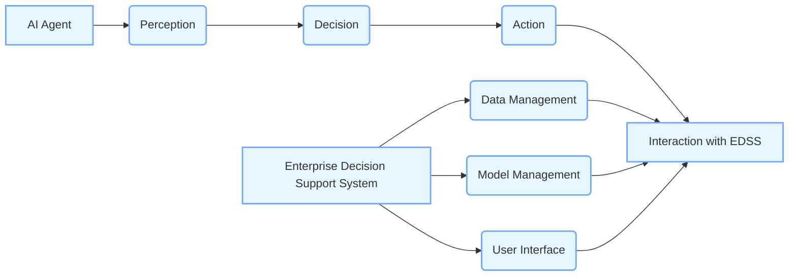

# AI Agent在企业决策支持系统中的角色与实现

> 关键词：AI Agent、企业决策支持系统、角色、实现、智能决策

> 摘要：本文深入探讨了AI Agent在企业决策支持系统中的角色与实现方式。首先介绍了相关背景知识，包括目的范围、预期读者等。接着阐述了AI Agent和企业决策支持系统的核心概念及联系，并给出了相应的示意图和流程图。详细讲解了核心算法原理，结合Python代码进行说明，同时给出了相关的数学模型和公式。通过项目实战，展示了AI Agent在企业决策支持系统中的具体实现，包括开发环境搭建、源代码实现与解读。分析了其实际应用场景，推荐了学习、开发工具和相关论文著作。最后总结了未来发展趋势与挑战，提供了常见问题解答和扩展阅读参考资料，旨在为企业利用AI Agent提升决策支持系统的效能提供全面的技术指导。

## 1. 背景介绍 
### 1.1 目的和范围
随着信息技术的飞速发展，企业面临着海量的数据和复杂的决策环境。传统的决策支持系统在处理复杂问题和实时数据时往往显得力不从心。AI Agent作为一种智能实体，能够感知环境、自主决策并采取行动，为企业决策支持系统带来了新的活力。本文的目的在于深入探讨AI Agent在企业决策支持系统中的角色和具体实现方式，范围涵盖了从基本概念到实际应用的各个方面，旨在为企业提供一个全面的技术参考，帮助企业更好地利用AI Agent提升决策的科学性和效率。

### 1.2 预期读者
本文的预期读者包括企业的技术管理人员、数据分析师、决策支持系统的开发人员以及对AI Agent和企业决策支持系统感兴趣的研究人员。对于技术管理人员，本文可以帮助他们了解AI Agent在企业决策中的价值和应用前景，以便做出合理的技术投资决策；数据分析师可以从中学到如何利用AI Agent处理和分析复杂的数据，为决策提供更有价值的信息；开发人员则可以获取AI Agent在企业决策支持系统中的具体实现技术和方法；研究人员可以在本文的基础上进行更深入的理论和应用研究。

### 1.3 文档结构概述
本文将按照以下结构进行阐述：首先介绍相关背景知识，包括目的范围、预期读者、文档结构概述和术语表；接着详细讲解AI Agent和企业决策支持系统的核心概念及它们之间的联系，并给出相应的示意图和流程图；然后深入探讨核心算法原理和具体操作步骤，结合Python代码进行说明；再介绍相关的数学模型和公式，并通过举例进行详细讲解；通过项目实战展示AI Agent在企业决策支持系统中的具体实现，包括开发环境搭建、源代码实现与解读；分析AI Agent在企业决策支持系统中的实际应用场景；推荐学习、开发工具和相关论文著作；最后总结未来发展趋势与挑战，提供常见问题解答和扩展阅读参考资料。

### 1.4 术语表
#### 1.4.1 核心术语定义
- **AI Agent（人工智能代理）**：是一种能够感知环境、自主决策并采取行动以实现特定目标的智能实体。它可以是软件程序、机器人或其他具有智能行为的系统。
- **企业决策支持系统（Enterprise Decision Support System，EDSS）**：是一种基于计算机技术，为企业决策者提供信息支持和分析工具，帮助他们做出科学决策的系统。
- **智能决策**：是指利用人工智能技术，对大量的数据进行分析和处理，以生成最优的决策方案。

#### 1.4.2 相关概念解释
- **环境感知**：AI Agent通过各种传感器收集环境信息的过程，这些信息可以是数据、事件、状态等。
- **自主决策**：AI Agent根据感知到的环境信息，运用自身的知识和算法，独立地做出决策的能力。
- **行动执行**：AI Agent根据决策结果，采取相应的行动来影响环境的过程。

#### 1.4.3 缩略词列表
- **AI**：Artificial Intelligence（人工智能）
- **EDSS**：Enterprise Decision Support System（企业决策支持系统）

## 2. 核心概念与联系 
### 2.1 AI Agent的核心概念
AI Agent是一个具有自主性、反应性、社会性和适应性的智能实体。自主性意味着它能够在没有人类干预的情况下独立地做出决策和采取行动；反应性表示它能够感知环境的变化并及时做出响应；社会性指它可以与其他Agent或人类进行交互；适应性则说明它能够根据环境的变化调整自己的行为和策略。

AI Agent通常由三个主要部分组成：感知模块、决策模块和行动模块。感知模块负责收集环境信息，决策模块根据感知到的信息进行分析和推理，生成决策方案，行动模块则根据决策方案执行相应的行动。

### 2.2 企业决策支持系统的核心概念
企业决策支持系统是一个集成了数据管理、模型管理和用户界面的系统。数据管理模块负责收集、存储和管理企业的各种数据，包括内部数据和外部数据；模型管理模块提供各种分析模型和算法，用于对数据进行处理和分析；用户界面模块则为决策者提供一个友好的交互界面，方便他们输入决策需求和获取决策结果。

企业决策支持系统的主要功能包括数据查询、数据分析、决策方案生成和评估等。它可以帮助决策者更好地理解企业的运营状况，发现潜在的问题和机会，从而做出更科学的决策。

### 2.3 AI Agent与企业决策支持系统的联系
AI Agent可以作为企业决策支持系统的一个重要组成部分，为系统提供智能决策能力。具体来说，AI Agent可以在以下几个方面发挥作用：
- **数据收集和预处理**：AI Agent可以自动收集企业内外的各种数据，并对数据进行清洗、转换和整合，为后续的分析和决策提供高质量的数据。
- **数据分析和挖掘**：AI Agent可以运用各种数据分析和挖掘算法，对数据进行深入分析，发现数据中的规律和模式，为决策提供有价值的信息。
- **决策方案生成**：AI Agent可以根据数据分析的结果，结合自身的知识和经验，生成多个决策方案，并对这些方案进行评估和比较，为决策者提供最优的决策建议。
- **实时决策支持**：AI Agent可以实时感知环境的变化，及时调整决策方案，为决策者提供实时的决策支持。

### 2.4 文本示意图
```plaintext
+----------------------+          +----------------------+
|       AI Agent       |          |  Enterprise Decision |
|                      |          |    Support System    |
+----------------------+          +----------------------+
| - Perception Module  |          | - Data Management    |
| - Decision Module    |          | - Model Management   |
| - Action Module      |          | - User Interface     |
+----------------------+          +----------------------+
           |                                   |
           |                                   |
           +-------------------+---------------+
                               |
                               |
                      +----------------+
                      |    Interaction   |
                      +----------------+
```

### 2.5 Mermaid流程图


## 3. 核心算法原理 & 具体操作步骤 
### 3.1 核心算法原理
在AI Agent用于企业决策支持系统中，常用的核心算法包括强化学习算法和机器学习分类算法等。这里以强化学习中的Q - learning算法为例进行详细讲解。

Q - learning算法是一种无模型的强化学习算法，其目标是学习一个最优的动作价值函数 $Q(s, a)$，其中 $s$ 表示环境的状态，$a$ 表示Agent采取的动作。$Q(s, a)$ 表示在状态 $s$ 下采取动作 $a$ 所能获得的最大累积奖励。

Q - learning算法的更新公式为：

$$Q(s_t, a_t) \leftarrow Q(s_t, a_t) + \alpha \left[ r_{t+1} + \gamma \max_{a} Q(s_{t+1}, a) - Q(s_t, a_t) \right]$$

其中：
- $s_t$ 是当前状态
- $a_t$ 是当前采取的动作
- $r_{t+1}$ 是执行动作 $a_t$ 后获得的即时奖励
- $s_{t+1}$ 是执行动作 $a_t$ 后转移到的下一个状态
- $\alpha$ 是学习率，控制每次更新的步长
- $\gamma$ 是折扣因子，用于权衡即时奖励和未来奖励

### 3.2 具体操作步骤
1. **初始化**：初始化Q表 $Q(s, a)$，将所有的 $Q$ 值初始化为0。同时，设置学习率 $\alpha$、折扣因子 $\gamma$ 和探索率 $\epsilon$。
2. **环境交互**：
    - 观察当前状态 $s_t$。
    - 根据探索率 $\epsilon$ 选择动作 $a_t$：
        - 如果随机数小于 $\epsilon$，则随机选择一个动作（探索）。
        - 否则，选择 $Q(s_t, a)$ 值最大的动作（利用）。
    - 执行动作 $a_t$，并观察即时奖励 $r_{t+1}$ 和下一个状态 $s_{t+1}$。
3. **Q表更新**：根据Q - learning更新公式更新 $Q(s_t, a_t)$。
4. **状态转移**：将 $s_{t+1}$ 作为新的当前状态 $s_t$。
5. **终止条件判断**：如果达到终止条件（如达到最大步数或完成目标），则结束训练；否则，返回步骤2继续进行交互和更新。

### 3.3 Python源代码实现
```python
import numpy as np

# 定义Q - learning类
class QLearningAgent:
    def __init__(self, state_space_size, action_space_size, learning_rate=0.1, discount_factor=0.9, exploration_rate=0.1):
        self.state_space_size = state_space_size
        self.action_space_size = action_space_size
        self.learning_rate = learning_rate
        self.discount_factor = discount_factor
        self.exploration_rate = exploration_rate
        # 初始化Q表
        self.q_table = np.zeros((state_space_size, action_space_size))

    def choose_action(self, state):
        if np.random.uniform(0, 1) < self.exploration_rate:
            # 探索：随机选择一个动作
            action = np.random.choice(self.action_space_size)
        else:
            # 利用：选择Q值最大的动作
            action = np.argmax(self.q_table[state, :])
        return action

    def update_q_table(self, state, action, reward, next_state):
        # 根据Q - learning更新公式更新Q表
        max_q_next = np.max(self.q_table[next_state, :])
        self.q_table[state, action] = (1 - self.learning_rate) * self.q_table[state, action] + \
                                      self.learning_rate * (reward + self.discount_factor * max_q_next)


# 示例使用
if __name__ == "__main__":
    # 假设状态空间大小为10，动作空间大小为4
    state_space_size = 10
    action_space_size = 4
    agent = QLearningAgent(state_space_size, action_space_size)

    # 模拟环境交互
    current_state = 0
    for _ in range(100):
        action = agent.choose_action(current_state)
        # 假设即时奖励为1，下一个状态为当前状态加1
        reward = 1
        next_state = (current_state + 1) % state_space_size
        agent.update_q_table(current_state, action, reward, next_state)
        current_state = next_state
```

## 4. 数学模型和公式 & 详细讲解 & 举例说明 
### 4.1 Q - learning算法的数学模型
Q - learning算法基于马尔可夫决策过程（MDP）。马尔可夫决策过程可以用一个五元组 $\langle S, A, P, R, \gamma \rangle$ 来表示，其中：
- $S$ 是状态空间，包含所有可能的环境状态。
- $A$ 是动作空间，包含Agent可以采取的所有动作。
- $P(s_{t+1} | s_t, a_t)$ 是状态转移概率，表示在状态 $s_t$ 下采取动作 $a_t$ 后转移到状态 $s_{t+1}$ 的概率。
- $R(s_t, a_t)$ 是奖励函数，表示在状态 $s_t$ 下采取动作 $a_t$ 所获得的即时奖励。
- $\gamma$ 是折扣因子，用于权衡即时奖励和未来奖励。

Q - learning算法的目标是学习一个最优的策略 $\pi^*$，使得Agent在每个状态下选择的动作能够最大化长期累积奖励。动作价值函数 $Q(s, a)$ 表示在状态 $s$ 下采取动作 $a$ 并遵循最优策略 $\pi^*$ 所能获得的最大累积奖励。

### 4.2 Q - learning更新公式的详细讲解
$$Q(s_t, a_t) \leftarrow Q(s_t, a_t) + \alpha \left[ r_{t+1} + \gamma \max_{a} Q(s_{t+1}, a) - Q(s_t, a_t) \right]$$

- **$r_{t+1} + \gamma \max_{a} Q(s_{t+1}, a)$**：这是目标值，表示在状态 $s_t$ 下采取动作 $a_t$ 后获得的即时奖励 $r_{t+1}$ 加上折扣后的下一个状态 $s_{t+1}$ 下所有可能动作的最大 $Q$ 值。
- **$Q(s_t, a_t)$**：是当前估计的 $Q$ 值。
- **$r_{t+1} + \gamma \max_{a} Q(s_{t+1}, a) - Q(s_t, a_t)$**：是估计误差，即目标值与当前估计值之间的差值。
- **$\alpha$**：学习率，控制每次更新的步长。如果 $\alpha$ 过大，可能会导致算法不稳定；如果 $\alpha$ 过小，算法收敛速度会很慢。

### 4.3 举例说明
假设一个简单的企业决策场景，有两个状态 $S = \{s_1, s_2\}$ 和两个动作 $A = \{a_1, a_2\}$。初始时，$Q$ 表如下：

| 状态 | $a_1$ | $a_2$ |
|------|-------|-------|
| $s_1$ | 0     | 0     |
| $s_2$ | 0     | 0     |

当前状态 $s_t = s_1$，Agent选择动作 $a_t = a_1$，执行动作后获得即时奖励 $r_{t+1} = 1$，转移到下一个状态 $s_{t+1} = s_2$。

假设学习率 $\alpha = 0.1$，折扣因子 $\gamma = 0.9$。在状态 $s_2$ 下，$Q(s_2, a_1) = 0$，$Q(s_2, a_2) = 0$，则 $\max_{a} Q(s_{t+1}, a) = 0$。

根据Q - learning更新公式：

$$Q(s_1, a_1) \leftarrow Q(s_1, a_1) + \alpha \left[ r_{t+1} + \gamma \max_{a} Q(s_{2}, a) - Q(s_1, a_1) \right]$$

$$Q(s_1, a_1) \leftarrow 0 + 0.1 \times (1 + 0.9 \times 0 - 0) = 0.1$$

更新后的 $Q$ 表如下：

| 状态 | $a_1$ | $a_2$ |
|------|-------|-------|
| $s_1$ | 0.1   | 0     |
| $s_2$ | 0     | 0     |

## 5. 项目实战：代码实际案例和详细解释说明 
### 5.1  开发环境搭建
#### 5.1.1 安装Python
首先，需要安装Python环境。可以从Python官方网站（https://www.python.org/downloads/）下载适合自己操作系统的Python版本。建议安装Python 3.6及以上版本。

#### 5.1.2 安装必要的库
在命令行中使用pip安装必要的库，如NumPy：
```sh
pip install numpy
```

### 5.2  源代码详细实现和代码解读
```python
import numpy as np

# 定义Q - learning类
class QLearningAgent:
    def __init__(self, state_space_size, action_space_size, learning_rate=0.1, discount_factor=0.9, exploration_rate=0.1):
        self.state_space_size = state_space_size
        self.action_space_size = action_space_size
        self.learning_rate = learning_rate
        self.discount_factor = discount_factor
        self.exploration_rate = exploration_rate
        # 初始化Q表
        self.q_table = np.zeros((state_space_size, action_space_size))

    def choose_action(self, state):
        if np.random.uniform(0, 1) < self.exploration_rate:
            # 探索：随机选择一个动作
            action = np.random.choice(self.action_space_size)
        else:
            # 利用：选择Q值最大的动作
            action = np.argmax(self.q_table[state, :])
        return action

    def update_q_table(self, state, action, reward, next_state):
        # 根据Q - learning更新公式更新Q表
        max_q_next = np.max(self.q_table[next_state, :])
        self.q_table[state, action] = (1 - self.learning_rate) * self.q_table[state, action] + \
                                      self.learning_rate * (reward + self.discount_factor * max_q_next)


# 模拟企业决策场景
class EnterpriseDecisionEnvironment:
    def __init__(self):
        # 假设状态空间大小为5，动作空间大小为3
        self.state_space_size = 5
        self.action_space_size = 3
        self.current_state = 0

    def step(self, action):
        # 简单模拟状态转移和奖励
        if action == 0:
            self.current_state = (self.current_state + 1) % self.state_space_size
            reward = 1
        elif action == 1:
            self.current_state = (self.current_state - 1) % self.state_space_size
            reward = -1
        else:
            reward = 0
        return self.current_state, reward


# 主程序
if __name__ == "__main__":
    env = EnterpriseDecisionEnvironment()
    agent = QLearningAgent(env.state_space_size, env.action_space_size)

    num_episodes = 1000
    for episode in range(num_episodes):
        state = env.current_state
        done = False
        while not done:
            action = agent.choose_action(state)
            next_state, reward = env.step(action)
            agent.update_q_table(state, action, reward, next_state)
            state = next_state
            # 简单终止条件：达到一定步数
            if episode > 100:
                done = True

    print("Final Q - table:")
    print(agent.q_table)
```

### 5.3  代码解读与分析
#### 5.3.1 QLearningAgent类
- `__init__` 方法：初始化Q - learning代理的参数，包括状态空间大小、动作空间大小、学习率、折扣因子、探索率，并初始化Q表。
- `choose_action` 方法：根据探索率选择动作。如果随机数小于探索率，则随机选择一个动作进行探索；否则，选择Q值最大的动作进行利用。
- `update_q_table` 方法：根据Q - learning更新公式更新Q表。

#### 5.3.2 EnterpriseDecisionEnvironment类
- `__init__` 方法：初始化企业决策环境，设置状态空间大小、动作空间大小和当前状态。
- `step` 方法：根据Agent采取的动作，模拟状态转移和奖励。

#### 5.3.3 主程序
- 创建企业决策环境和Q - learning代理。
- 进行多轮训练，每一轮中Agent与环境进行交互，根据环境反馈更新Q表。
- 最后打印出训练后的Q表。

## 6. 实际应用场景 
### 6.1 市场营销决策
在市场营销中，AI Agent可以分析大量的市场数据，包括客户偏好、竞争对手动态等。通过Q - learning等算法，AI Agent可以学习到最优的营销策略，如选择最佳的广告投放渠道、制定最优的促销方案等。例如，根据不同客户群体的特征，AI Agent可以自动调整广告内容和投放时间，以提高广告的点击率和转化率。

### 6.2 供应链管理决策
在供应链管理中，AI Agent可以实时监控供应链的各个环节，包括原材料采购、生产制造、物流配送等。通过对供应链数据的分析，AI Agent可以预测需求变化、优化库存水平、选择最优的供应商和物流方案。例如，当市场需求发生变化时，AI Agent可以及时调整生产计划和采购量，以避免库存积压或缺货现象的发生。

### 6.3 金融投资决策
在金融投资领域，AI Agent可以分析各种金融数据，如股票价格、利率、宏观经济指标等。通过强化学习算法，AI Agent可以学习到最优的投资策略，如选择最佳的投资组合、确定买卖时机等。例如，AI Agent可以根据市场行情的变化，自动调整投资组合的权重，以实现投资收益的最大化。

### 6.4 人力资源管理决策
在人力资源管理中，AI Agent可以分析员工的绩效数据、技能水平、职业发展需求等。通过对这些数据的分析，AI Agent可以为企业提供最优的人力资源管理决策，如招聘策略、培训计划、绩效考核方案等。例如，AI Agent可以根据员工的技能差距，自动推荐适合的培训课程，以提高员工的工作能力和绩效。

## 7. 工具和资源推荐
### 7.1 学习资源推荐
#### 7.1.1 书籍推荐
- 《人工智能：一种现代的方法》（Artificial Intelligence: A Modern Approach）：这是一本经典的人工智能教材，涵盖了人工智能的各个领域，包括搜索算法、机器学习、自然语言处理等。
- 《强化学习：原理与Python实现》（Reinforcement Learning: An Introduction）：详细介绍了强化学习的基本原理和算法，适合初学者深入学习强化学习。
- 《Python机器学习》（Python Machine Learning）：介绍了如何使用Python进行机器学习，包括各种机器学习算法的实现和应用。

#### 7.1.2 在线课程
- Coursera上的“人工智能基础”（Fundamentals of Artificial Intelligence）课程：由知名教授授课，系统地介绍了人工智能的基本概念和算法。
- edX上的“强化学习”（Reinforcement Learning）课程：深入讲解了强化学习的理论和实践，提供了丰富的案例和代码实现。
- 吴恩达的“机器学习”（Machine Learning）课程：是机器学习领域的经典课程，适合初学者入门。

#### 7.1.3 技术博客和网站
- Medium上的人工智能相关博客：有很多专业的人工智能博主分享最新的技术文章和研究成果。
- arXiv.org：是一个预印本数据库，收录了大量的人工智能研究论文，可以及时了解最新的研究动态。
- Towards Data Science：提供了很多关于数据科学和人工智能的实用教程和案例分析。

### 7.2 开发工具框架推荐
#### 7.2.1 IDE和编辑器
- PyCharm：是一款专业的Python集成开发环境，提供了丰富的代码编辑、调试和项目管理功能。
- Jupyter Notebook：是一个交互式的开发环境，适合进行数据探索和模型开发，支持Python、R等多种编程语言。
- Visual Studio Code：是一款轻量级的代码编辑器，支持多种编程语言，并且有丰富的插件可以扩展功能。

#### 7.2.2 调试和性能分析工具
- PDB：是Python自带的调试工具，可以帮助开发者定位代码中的错误。
- cProfile：是Python的性能分析工具，可以分析代码的运行时间和函数调用次数，帮助开发者优化代码性能。
- TensorBoard：是TensorFlow的可视化工具，可以用于可视化训练过程、模型结构等。

#### 7.2.3 相关框架和库
- TensorFlow：是一个开源的机器学习框架，提供了丰富的工具和算法，支持深度学习模型的开发和训练。
- PyTorch：是另一个流行的深度学习框架，具有动态图的优势，适合快速开发和实验。
- Scikit - learn：是一个简单易用的机器学习库，提供了各种机器学习算法的实现，适合初学者进行机器学习实验。

### 7.3 相关论文著作推荐
#### 7.3.1 经典论文
- “Q - learning” by Watkins and Dayan：这是Q - learning算法的经典论文，详细介绍了Q - learning算法的原理和实现。
- “Playing Atari with Deep Reinforcement Learning” by Mnih et al.：提出了深度Q网络（DQN）算法，将深度学习和强化学习相结合，在Atari游戏中取得了很好的效果。
- “Policy Gradient Methods for Reinforcement Learning with Function Approximation” by Sutton et al.：介绍了策略梯度算法，为强化学习中的策略优化提供了重要的理论基础。

#### 7.3.2 最新研究成果
- 关注NeurIPS（神经信息处理系统大会）、ICML（国际机器学习会议）等顶级学术会议上的最新研究论文，了解人工智能和强化学习领域的最新进展。
- 阅读知名学术期刊，如Journal of Artificial Intelligence Research（JAIR）、Artificial Intelligence等，获取最新的研究成果。

#### 7.3.3 应用案例分析
- 研究一些大型企业在实际应用中使用AI Agent进行决策支持的案例，如谷歌、亚马逊等公司的相关技术报告和论文，了解实际应用中的挑战和解决方案。

## 8. 总结：未来发展趋势与挑战
### 8.1 未来发展趋势
#### 8.1.1 与其他技术的融合
AI Agent将与物联网、大数据、区块链等技术深度融合。例如，通过物联网设备收集更多的实时数据，为AI Agent提供更丰富的环境信息；利用大数据技术对海量数据进行存储和处理，提高AI Agent的决策能力；借助区块链技术保证数据的安全性和可信度。

#### 8.1.2 多Agent系统的发展
未来将出现更多的多Agent系统，多个AI Agent之间可以进行协作和竞争，共同完成复杂的企业决策任务。例如，在供应链管理中，不同环节的AI Agent可以相互协作，实现供应链的整体优化。

#### 8.1.3 可解释性和透明度的提升
随着AI Agent在企业决策中的应用越来越广泛，对其可解释性和透明度的要求也越来越高。未来的研究将致力于开发具有可解释性的AI Agent模型，使决策者能够理解AI Agent的决策过程和依据。

### 8.2 挑战
#### 8.2.1 数据质量和安全问题
AI Agent的决策能力依赖于高质量的数据，但企业数据往往存在噪声、缺失值等问题，影响AI Agent的性能。此外，数据安全也是一个重要的挑战，企业需要保护敏感数据不被泄露。

#### 8.2.2 算法复杂度和计算资源需求
一些复杂的AI算法，如深度强化学习算法，需要大量的计算资源和时间进行训练。企业需要解决算法复杂度和计算资源之间的矛盾，以提高决策效率。

#### 8.2.3 伦理和法律问题
AI Agent的决策可能会对企业和社会产生重大影响，因此需要考虑伦理和法律问题。例如，AI Agent的决策是否公平、是否符合法律法规等。

## 9. 附录：常见问题与解答
### 9.1 Q：AI Agent在企业决策支持系统中一定能做出最优决策吗？
A：不一定。AI Agent的决策能力受到多种因素的影响，如数据质量、算法选择、模型参数等。虽然AI Agent可以通过学习和优化不断提高决策的准确性，但在复杂的环境中，仍然可能存在不确定性和误差。

### 9.2 Q：如何评估AI Agent在企业决策支持系统中的性能？
A：可以从多个方面评估AI Agent的性能，如决策的准确性、决策的效率、对环境变化的适应性等。可以通过实验和对比分析，将AI Agent的决策结果与人类专家的决策结果进行比较，评估其性能。

### 9.3 Q：AI Agent的开发难度大吗？
A：AI Agent的开发难度取决于具体的应用场景和算法选择。对于简单的应用场景和算法，开发难度相对较低；但对于复杂的应用场景和算法，如深度强化学习，开发难度较大，需要具备一定的专业知识和技能。

### 9.4 Q：AI Agent会取代人类决策者吗？
A：目前来看，AI Agent不会完全取代人类决策者。虽然AI Agent可以提供决策建议和支持，但人类决策者具有丰富的经验、判断力和创造力，能够考虑到更多的因素和背景信息。AI Agent更适合作为人类决策者的辅助工具，帮助他们做出更科学的决策。

## 10. 扩展阅读 & 参考资料
### 10.1 扩展阅读
- 《智能系统原理》：进一步深入了解智能系统的原理和应用。
- 《深度学习实战》：学习深度学习的实际应用和开发技巧。
- 《决策科学》：系统学习决策的理论和方法。

### 10.2 参考资料
- 相关学术论文和研究报告，如IEEE Transactions on Systems, Man, and Cybernetics等期刊上的论文。
- 企业的技术文档和案例分析，如微软、IBM等公司的技术博客和案例分享。

作者：AI天才研究院/AI Genius Institute & 禅与计算机程序设计艺术 /Zen And The Art of Computer Programming